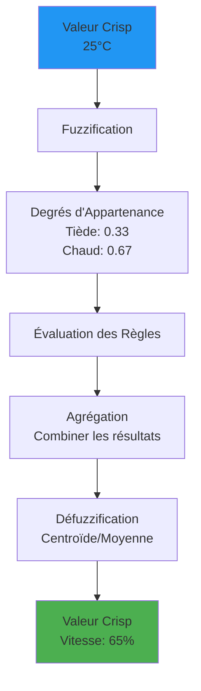

---
tags:
  - ai
  - fuzzy-logic
  - logic
---

# Logique Floue (Fuzzy Logic)

L'informatique classique est binaire : C'est vrai (1) ou c'est faux (0).
La **Logique Floue** permet de gérer les nuances du monde réel : C'est "un peu vrai" ou "presque faux".

## Le Problème de la Logique Binaire

Imaginons un système de climatisation automatique.
*   Règle classique : `SI (Température > 25°C) ALORS [Clim ON]`
*   **Problème** : À 24.9°C, la clim est éteinte. À 25.1°C, elle démarre à fond. À 25.0°C, elle clignote. C'est brutal et inefficace.

## La Solution "Floue"

Introduite par Lotfi Zadeh en 1965, cette logique remplace les booléens par des **Degrés d'Appartenance** (compris entre 0 et 1).

### Incertitude vs Imprécision
*   **Incertitude** (Probabilités) : "Il y a 50% de chances qu'il pleuve demain." (L'événement futur est inconnu).
*   **Imprécision** (Logique Floue) : "Il fait un peu chaud." (L'événement est connu, mais sa définition est subjective).

## Fonctions d'Appartenance Détaillées

Les fonctions d'appartenance définissent comment une valeur numérique crisp (précise) se transforme en degré d'appartenance flou.

### Types de Fonctions d'Appartenance

#### 1. Fonction Triangulaire
La plus courante, définie par trois points : début, sommet, fin.

```python
def triangular(x, a, b, c):
    """
    a: début (appartenance = 0)
    b: sommet (appartenance = 1)
    c: fin (appartenance = 0)
    """
    if x <= a or x >= c:
        return 0
    elif a < x <= b:
        return (x - a) / (b - a)
    else:
        return (c - x) / (c - b)
```

#### 2. Fonction Trapézoïdale
Permet un plateau où l'appartenance reste à 1.

```python
def trapezoidal(x, a, b, c, d):
    """
    a: début, b: début plateau, c: fin plateau, d: fin
    """
    if x <= a or x >= d:
        return 0
    elif a < x < b:
        return (x - a) / (b - a)
    elif b <= x <= c:
        return 1
    else:
        return (d - x) / (d - c)
```

#### 3. Fonction Gaussienne
Plus douce, utilisée pour des transitions naturelles.

```python
import numpy as np

def gaussian(x, mean, sigma):
    """mean: centre, sigma: largeur"""
    return np.exp(-((x - mean)**2) / (2 * sigma**2))
```

## Exemple Pratique : Contrôle de Température

### Système Complet avec scikit-fuzzy

```python
import numpy as np
import skfuzzy as fuzz
from skfuzzy import control as ctrl

# 1. Définir les variables linguistiques
temperature = ctrl.Antecedent(np.arange(15, 36, 1), 'temperature')
fan_speed = ctrl.Consequent(np.arange(0, 101, 1), 'fan_speed')

# 2. Définir les fonctions d'appartenance
temperature['froid'] = fuzz.trimf(temperature.universe, [15, 15, 22])
temperature['tiede'] = fuzz.trimf(temperature.universe, [20, 23, 26])
temperature['chaud'] = fuzz.trimf(temperature.universe, [24, 35, 35])

fan_speed['lent'] = fuzz.trimf(fan_speed.universe, [0, 0, 50])
fan_speed['moyen'] = fuzz.trimf(fan_speed.universe, [20, 50, 80])
fan_speed['rapide'] = fuzz.trimf(fan_speed.universe, [50, 100, 100])

# 3. Définir les règles floues
rule1 = ctrl.Rule(temperature['froid'], fan_speed['lent'])
rule2 = ctrl.Rule(temperature['tiede'], fan_speed['moyen'])
rule3 = ctrl.Rule(temperature['chaud'], fan_speed['rapide'])

# 4. Créer le système de contrôle
fan_ctrl = ctrl.ControlSystem([rule1, rule2, rule3])
fan_simulation = ctrl.ControlSystemSimulation(fan_ctrl)

# 5. Tester avec différentes températures
for temp in [18, 22, 25, 30]:
    fan_simulation.input['temperature'] = temp
    fan_simulation.compute()
    print(f"Température: {temp}°C → Ventilateur: {fan_simulation.output['fan_speed']:.1f}%")
```

**Résultat :**
```text
Température: 18°C → Ventilateur: 25.0%
Température: 22°C → Ventilateur: 45.8%
Température: 25°C → Ventilateur: 65.2%
Température: 30°C → Ventilateur: 100.0%
```

## Processus d'Inférence Floue



### Étapes du Processus

1. **Fuzzification** : Conversion des valeurs numériques en degrés d'appartenance
2. **Évaluation des Règles** : Application des règles IF-THEN avec opérateurs flous (ET=min, OU=max)
3. **Agrégation** : Combinaison des sorties de toutes les règles
4. **Défuzzification** : Conversion du résultat flou en valeur numérique (méthode du centroïde, moyenne pondérée...)

## Cas d'Usage en SysOps

### 1. Auto-Scaling Intelligent

```python
# Système d'auto-scaling basé sur logique floue
import skfuzzy as fuzz
import numpy as np

# Variables d'entrée
cpu_usage = np.arange(0, 101, 1)
memory_usage = np.arange(0, 101, 1)
response_time = np.arange(0, 5001, 50)  # en ms

# Variable de sortie
scale_decision = np.arange(-3, 4, 1)  # -3=remove 3 instances, +3=add 3 instances

# Fonctions d'appartenance
cpu_low = fuzz.trimf(cpu_usage, [0, 0, 50])
cpu_medium = fuzz.trimf(cpu_usage, [30, 50, 70])
cpu_high = fuzz.trimf(cpu_usage, [60, 100, 100])

mem_low = fuzz.trimf(memory_usage, [0, 0, 50])
mem_medium = fuzz.trimf(memory_usage, [30, 50, 70])
mem_high = fuzz.trimf(memory_usage, [60, 100, 100])

# Règles d'inférence
# SI CPU élevé ET Mémoire élevée ALORS scale up fortement
# SI CPU faible ET Mémoire faible ALORS scale down
```

**Avantages sur seuils fixes :**
- Évite le flapping (ajout/suppression rapide d'instances)
- Prend en compte plusieurs métriques simultanément
- Réagit graduellement aux changements

### 2. Système d'Alerting Adaptatif

```python
# Scoring de criticité d'alerte
def alert_criticality(error_rate, latency_p95, disk_usage):
    """
    Détermine si une alerte doit être envoyée et avec quelle priorité

    error_rate: pourcentage d'erreurs (0-100)
    latency_p95: latence 95e percentile (ms)
    disk_usage: utilisation disque (0-100%)
    """

    # Fuzzification
    error_high = max(0, min(1, (error_rate - 1) / 4))  # >5% = critique
    latency_high = max(0, min(1, (latency_p95 - 200) / 300))  # >500ms = critique
    disk_critical = max(0, min(1, (disk_usage - 80) / 15))  # >95% = critique

    # Inférence
    criticality = max(
        min(error_high, latency_high),  # Règle 1: erreurs ET latence
        disk_critical  # Règle 2: disque seul peut déclencher
    )

    # Défuzzification
    if criticality > 0.7:
        return "CRITICAL - PagerDuty"
    elif criticality > 0.4:
        return "WARNING - Slack"
    elif criticality > 0.2:
        return "INFO - Log"
    else:
        return "OK"

# Test
print(alert_criticality(error_rate=3, latency_p95=350, disk_usage=85))
# → "WARNING - Slack"
```

### 3. Load Balancer Intelligent

Au lieu de distribuer le trafic de façon binaire (Round-Robin), un load balancer flou peut considérer :
- Charge CPU actuelle
- Mémoire disponible
- Nombre de connexions
- Temps de réponse récent

Et calculer un "score de disponibilité" flou pour chaque serveur.

## Cas d'Usage Grand Public

La logique floue est partout dans l'électronique grand public (Japon) :
*   **Machines à laver** : Ajuster l'eau selon si le linge est "plutôt sale" ou "très lourd".
*   **Appareils Photo** : Stabilisation d'image (compenser le tremblement "léger").
*   **Métros automatiques** : Freinage doux (au lieu d'accélérer/freiner par à-coups).
*   **Aspirateurs robots** : Ajuster la puissance selon le type de surface "détecté".

## Avantages et Limites

### Avantages
- **Robustesse** : Tolère les données imprécises ou bruitées
- **Intuitivité** : Règles exprimées en langage naturel
- **Pas de training** : Pas besoin de données d'apprentissage
- **Déterministe** : Même entrée = même sortie

### Limites
- **Design manuel** : Nécessite expertise métier pour définir les règles
- **Scalabilité** : Difficile avec >10 variables (explosion combinatoire)
- **Pas d'apprentissage** : Ne s'améliore pas avec l'expérience (contrairement au ML)

> **En résumé** : La Logique Floue permet aux machines de raisonner avec des concepts humains vagues ("vite", "loin", "fort") plutôt qu'avec des seuils numériques rigides. Elle est idéale pour les systèmes de contrôle où l'expertise humaine peut être formalisée en règles, mais où les transitions doivent être douces.
