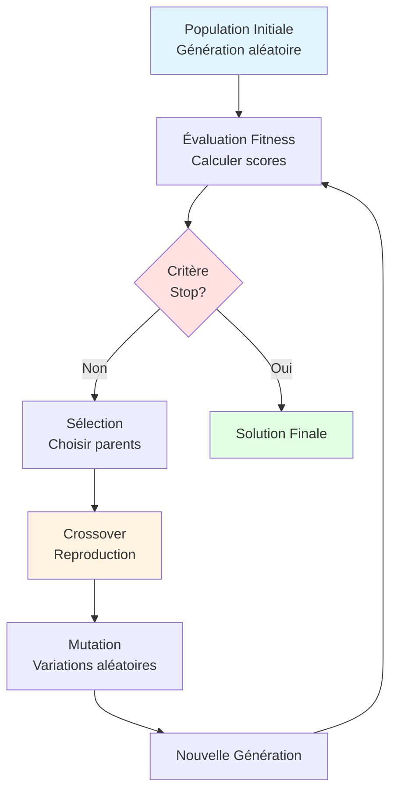

---
tags:
  - ai
  - genetic-algorithms
  - optimization
---

# Algorithmes Génétiques

Quand on ne connaît pas la solution à un problème complexe, on peut parfois laisser l'évolution la trouver pour nous. Les Algorithmes Génétiques s'inspirent de la théorie de l'évolution de Darwin.

## Le Concept : L'Évolution Artificielle

L'idée est de créer une population de "solutions potentielles" (même mauvaises) et de les faire évoluer sur des milliers de générations pour qu'elles s'améliorent.

## Le Cycle de Vie Algorithmique Détaillé



### 1. Population Initiale

On génère N solutions au hasard (ex: 100 configurations d'un emploi du temps).

```python
import random

def generate_random_solution(size):
    """Génère une solution aléatoire (liste de 0 et 1)"""
    return [random.randint(0, 1) for _ in range(size)]

# Population de 50 individus de taille 10
population = [generate_random_solution(10) for _ in range(50)]
```

### 2. Évaluation (Fitness Function)

On donne une note à chaque solution. C'est la fonction la plus importante : elle définit ce qu'est une "bonne" solution.

**Exemples de fonctions fitness :**

```python
# Exemple 1: Maximiser le nombre de 1
def fitness_count_ones(individual):
    return sum(individual)

# Exemple 2: Optimisation de fonction mathématique
def fitness_rastrigin(individual):
    """Plus la valeur est faible, meilleure est la solution"""
    n = len(individual)
    A = 10
    total = A * n
    for x in individual:
        total += x**2 - A * np.cos(2 * np.pi * x)
    return -total  # Négation car on maximise le fitness

# Exemple 3: Problème du sac à dos (knapsack)
def fitness_knapsack(individual, weights, values, max_weight):
    total_weight = sum(w * gene for w, gene in zip(weights, individual))
    total_value = sum(v * gene for v, gene in zip(values, individual))

    if total_weight > max_weight:
        return 0  # Solution invalide
    return total_value
```

### 3. Sélection (Selection)

On choisit les individus qui vont se reproduire. Plusieurs méthodes :

#### Sélection par Tournoi (Tournament Selection)
```python
def tournament_selection(population, fitnesses, k=3):
    """
    Sélectionne le meilleur parmi k individus tirés au hasard
    k=3 est un bon compromis
    """
    tournament = random.sample(list(zip(population, fitnesses)), k)
    winner = max(tournament, key=lambda x: x[1])
    return winner[0]
```

#### Sélection par Roulette (Roulette Wheel Selection)
```python
def roulette_selection(population, fitnesses):
    """Probabilité de sélection proportionnelle au fitness"""
    total_fitness = sum(fitnesses)
    pick = random.uniform(0, total_fitness)
    current = 0

    for individual, fitness in zip(population, fitnesses):
        current += fitness
        if current > pick:
            return individual
```

#### Sélection Élitiste
```python
def elitist_selection(population, fitnesses, n_elite=2):
    """Garde les n meilleurs individus automatiquement"""
    sorted_pop = [x for _, x in sorted(zip(fitnesses, population),
                                       key=lambda pair: pair[0],
                                       reverse=True)]
    return sorted_pop[:n_elite]
```

### 4. Crossover (Reproduction)

On mélange le "code génétique" de deux parents pour créer des enfants.

#### Crossover à 1 Point
```python
def single_point_crossover(parent1, parent2):
    """Coupe et échange à un point aléatoire"""
    point = random.randint(1, len(parent1) - 1)
    child1 = parent1[:point] + parent2[point:]
    child2 = parent2[:point] + parent1[point:]
    return child1, child2

# Exemple:
# Parent1: [1,1,1,1,1]
#              ↓ point=2
# Parent2: [0,0,0,0,0]
# Child1:  [1,1,0,0,0]
# Child2:  [0,0,1,1,1]
```

#### Crossover à 2 Points
```python
def two_point_crossover(parent1, parent2):
    """Échange le segment entre deux points"""
    size = len(parent1)
    point1, point2 = sorted(random.sample(range(1, size), 2))

    child1 = parent1[:point1] + parent2[point1:point2] + parent1[point2:]
    child2 = parent2[:point1] + parent1[point1:point2] + parent2[point2:]
    return child1, child2
```

#### Crossover Uniforme
```python
def uniform_crossover(parent1, parent2, prob=0.5):
    """Chaque gène a 50% de venir de parent1 ou parent2"""
    child1 = []
    child2 = []
    for g1, g2 in zip(parent1, parent2):
        if random.random() < prob:
            child1.append(g1)
            child2.append(g2)
        else:
            child1.append(g2)
            child2.append(g1)
    return child1, child2
```

### 5. Mutation

De temps en temps, on change un détail au hasard. Cela évite la convergence prématurée (rester bloqué dans un optimum local).

```python
def mutate(individual, mutation_rate=0.01):
    """
    Flip chaque bit avec une probabilité mutation_rate
    Taux typique: 0.01 à 0.1 (1% à 10%)
    """
    mutated = individual.copy()
    for i in range(len(mutated)):
        if random.random() < mutation_rate:
            mutated[i] = 1 - mutated[i]  # Flip 0→1 ou 1→0
    return mutated

# Pour valeurs continues
def mutate_continuous(individual, mutation_rate=0.1, mutation_strength=0.5):
    """Ajoute du bruit gaussien"""
    mutated = individual.copy()
    for i in range(len(mutated)):
        if random.random() < mutation_rate:
            mutated[i] += random.gauss(0, mutation_strength)
    return mutated
```

## Exemple Complet : Problème du Voyageur de Commerce (TSP)

Le TSP est un problème NP-difficile : trouver le plus court chemin visitant N villes exactement une fois.

### Implémentation avec DEAP

```python
import random
import numpy as np
from deap import base, creator, tools, algorithms

# Coordonnées de 10 villes
cities = np.random.rand(10, 2) * 100

def distance(city1, city2):
    """Distance euclidienne entre deux villes"""
    return np.sqrt((city1[0] - city2[0])**2 + (city1[1] - city2[1])**2)

def total_distance(tour):
    """Fitness: distance totale du parcours (à minimiser)"""
    dist = 0
    for i in range(len(tour)):
        dist += distance(cities[tour[i]], cities[tour[(i+1) % len(tour)]])
    return (dist,)  # DEAP exige un tuple

# Configuration DEAP
creator.create("FitnessMin", base.Fitness, weights=(-1.0,))  # Minimisation
creator.create("Individual", list, fitness=creator.FitnessMin)

toolbox = base.Toolbox()
toolbox.register("indices", random.sample, range(len(cities)), len(cities))
toolbox.register("individual", tools.initIterate, creator.Individual, toolbox.indices)
toolbox.register("population", tools.initRepeat, list, toolbox.individual)

# Opérateurs génétiques
toolbox.register("mate", tools.cxOrdered)  # Crossover pour permutations
toolbox.register("mutate", tools.mutShuffleIndexes, indpb=0.05)
toolbox.register("select", tools.selTournament, tournsize=3)
toolbox.register("evaluate", total_distance)

# Évolution
def run_ga():
    random.seed(42)
    pop = toolbox.population(n=100)
    hof = tools.HallOfFame(1)  # Garde le meilleur
    stats = tools.Statistics(lambda ind: ind.fitness.values)
    stats.register("min", np.min)
    stats.register("avg", np.mean)

    pop, logbook = algorithms.eaSimple(
        pop, toolbox,
        cxpb=0.7,  # Probabilité de crossover
        mutpb=0.2,  # Probabilité de mutation
        ngen=200,   # 200 générations
        stats=stats,
        halloffame=hof,
        verbose=True
    )

    best = hof[0]
    print(f"\nMeilleur parcours: {best}")
    print(f"Distance: {total_distance(best)[0]:.2f}")
    return best, logbook

best_tour, log = run_ga()
```

**Résultat typique :**
```
gen	nevals	min    	avg
0  	100   	458.234	652.891
10 	70    	312.456	398.234
50 	70    	278.123	312.456
100	70    	265.891	285.234
200	70    	254.123	268.456

Meilleur parcours: [0, 3, 7, 2, 9, 4, 1, 8, 5, 6]
Distance: 254.12
```

### Visualisation de l'Évolution

```python
import matplotlib.pyplot as plt

def plot_evolution(logbook):
    gen = logbook.select("gen")
    min_fit = logbook.select("min")
    avg_fit = logbook.select("avg")

    plt.figure(figsize=(10, 5))
    plt.plot(gen, min_fit, label="Meilleur", linewidth=2)
    plt.plot(gen, avg_fit, label="Moyenne", linestyle="--")
    plt.xlabel("Génération")
    plt.ylabel("Distance totale")
    plt.title("Évolution du TSP")
    plt.legend()
    plt.grid(True)
    plt.show()

plot_evolution(log)
```

## Exemple Simplifié Sans Bibliothèque

```python
import random
import numpy as np

# Problème: Maximiser f(x) = x² où x ∈ [0, 31]
# Encodage: x en binaire sur 5 bits (00000 à 11111)

def decode(binary):
    """Convertit liste binaire en entier"""
    return int(''.join(map(str, binary)), 2)

def fitness(individual):
    """Fitness = x²"""
    x = decode(individual)
    return x ** 2

def genetic_algorithm():
    POP_SIZE = 20
    GENE_SIZE = 5
    GENERATIONS = 50
    MUTATION_RATE = 0.01

    # Population initiale
    population = [[random.randint(0, 1) for _ in range(GENE_SIZE)]
                  for _ in range(POP_SIZE)]

    for gen in range(GENERATIONS):
        # Évaluation
        fitnesses = [fitness(ind) for ind in population]

        # Nouvelle génération
        new_population = []

        for _ in range(POP_SIZE // 2):
            # Sélection par tournoi
            parent1 = tournament_selection(population, fitnesses, k=3)
            parent2 = tournament_selection(population, fitnesses, k=3)

            # Crossover
            child1, child2 = single_point_crossover(parent1, parent2)

            # Mutation
            child1 = mutate(child1, MUTATION_RATE)
            child2 = mutate(child2, MUTATION_RATE)

            new_population.extend([child1, child2])

        population = new_population

        # Affichage
        best_fitness = max(fitnesses)
        best_individual = population[fitnesses.index(best_fitness)]
        if gen % 10 == 0:
            print(f"Gen {gen}: Meilleur x={decode(best_individual)}, f(x)={best_fitness}")

    # Résultat final
    fitnesses = [fitness(ind) for ind in population]
    best_individual = population[fitnesses.index(max(fitnesses))]
    print(f"\nSolution finale: x={decode(best_individual)}, f(x)={fitness(best_individual)}")

genetic_algorithm()
```

**Sortie :**
```
Gen 0: Meilleur x=29, f(x)=841
Gen 10: Meilleur x=31, f(x)=961
Gen 20: Meilleur x=31, f(x)=961
Gen 30: Meilleur x=31, f(x)=961
Gen 40: Meilleur x=31, f(x)=961

Solution finale: x=31, f(x)=961
```

## Analogie Biologique Complète

| Biologie | Informatique (IA) | Exemple TSP |
|----------|-------------------|-------------|
| **ADN** | Code de la solution | [0,3,7,2,9,4,1,8,5,6] |
| **Individu** | Une solution candidate | Un parcours complet |
| **Environnement** | Le problème à résoudre | La carte avec les villes |
| **Survie** | Score de performance (Fitness) | Distance totale (à minimiser) |
| **Mutation** | Changement aléatoire | Échanger deux villes |
| **Crossover** | Reproduction sexuée | Mélanger deux parcours |
| **Sélection Naturelle** | Survie du plus apte | Garder les parcours courts |
| **Génération** | Itération de l'algorithme | Population à l'instant t |

## Cas d'Usage en Infrastructure

### 1. Optimisation de Placement de VMs

```python
# Objectif: Placer N VMs sur M serveurs physiques
# Contraintes: CPU, RAM, bande passante
# Objectif: Minimiser nombre de serveurs utilisés + équilibrer la charge

def fitness_vm_placement(individual, vms, servers):
    """
    individual: [0,2,1,0,3] signifie VM0→Serveur0, VM1→Serveur2, etc.
    """
    server_load = {i: {'cpu': 0, 'ram': 0} for i in range(len(servers))}

    # Calculer charge de chaque serveur
    for vm_idx, server_idx in enumerate(individual):
        server_load[server_idx]['cpu'] += vms[vm_idx]['cpu']
        server_load[server_idx]['ram'] += vms[vm_idx]['ram']

    # Pénalités
    penalty = 0
    for server_idx, load in server_load.items():
        if load['cpu'] > servers[server_idx]['cpu_max']:
            penalty += 1000  # Violation contrainte
        if load['ram'] > servers[server_idx]['ram_max']:
            penalty += 1000

    # Score: minimiser serveurs utilisés + équilibrer charge
    servers_used = len([l for l in server_load.values() if l['cpu'] > 0])
    load_variance = np.var([l['cpu'] for l in server_load.values()])

    return -(servers_used * 10 + load_variance + penalty)
```

### 2. Ordonnancement de Tâches Cron

```python
# Optimiser horaires de backups/maintenances pour minimiser impact
# Variables: heure de démarrage, jour de la semaine
# Contraintes: pas de chevauchement, fenêtres de maintenance

def fitness_cron_schedule(individual, tasks):
    """
    individual: [(hour, day), ...] pour chaque tâche
    """
    score = 0

    # Bonus si tâches en heures creuses (2h-5h)
    for hour, day in individual:
        if 2 <= hour <= 5:
            score += 10

    # Pénalité si chevauchements
    for i, (h1, d1) in enumerate(individual):
        for j, (h2, d2) in enumerate(individual[i+1:], i+1):
            if d1 == d2 and abs(h1 - h2) < tasks[i]['duration']:
                score -= 50  # Chevauchement!

    return score
```

### 3. Optimisation de Configurations

```python
# Trouver paramètres optimaux pour un service (cache size, threads, timeout)
# Fitness = throughput / latency sur benchmark réel

def fitness_config_tuning(individual):
    """
    individual: [cache_size, n_threads, timeout, buffer_size]
    """
    # Lancer benchmark avec ces paramètres
    result = run_benchmark(
        cache_size=individual[0],
        threads=individual[1],
        timeout=individual[2],
        buffer=individual[3]
    )

    # Maximiser throughput, minimiser latency
    return result['throughput'] / result['latency_p95']
```

## Paramètres Clés et Tuning

| Paramètre | Valeurs typiques | Impact |
|-----------|-----------------|--------|
| **Taille Population** | 50-500 | Plus = exploration, mais lent |
| **Nombre Générations** | 100-1000 | Jusqu'à convergence |
| **Taux Crossover** | 0.6-0.9 | 70-80% recommandé |
| **Taux Mutation** | 0.001-0.1 | 1-5% typique, empêche stagnation |
| **Pression Sélection** | Tournoi k=3-7 | Plus = convergence rapide mais risque local minimum |
| **Élitisme** | 1-5% | Garde meilleurs pour éviter régression |

## Avantages et Limites

### Avantages
- **Pas de gradient** : Fonctionne sur problèmes non-différentiables
- **Parallélisable** : Évaluation fitness indépendante
- **Robuste** : Explore largement l'espace de recherche
- **Universel** : Adaptable à tout problème avec fonction fitness

### Limites
- **Lent** : Nécessite beaucoup d'évaluations (milliers)
- **Pas de garantie** : Trouve des bonnes solutions, rarement l'optimum global
- **Tuning** : Paramètres sensibles (taux mutation, taille pop...)
- **Fitness Design** : Qualité de solution dépend de la fonction fitness

## Quand Utiliser un GA ?

**Utilisez un GA si :**
- Espace de recherche discret et large (combinatoire)
- Pas de méthode exacte connue ou trop lente
- Fonction fitness facile à évaluer
- Solution "assez bonne" acceptable (pas besoin d'optimum parfait)

**N'utilisez PAS un GA si :**
- Problème a une solution analytique
- Espace continu et différentiable → Gradient Descent
- Évaluation fitness très coûteuse (>1s) → Bayesian Optimization
- Contraintes complexes → Solveurs CP/SAT

> **Note** : Ce n'est pas de l'apprentissage (Machine Learning) au sens strict, c'est de l'**Optimisation Stochastique** (Recherche aléatoire dirigée). Les GAs ne généralisent pas : ils trouvent une solution pour UNE instance du problème.
