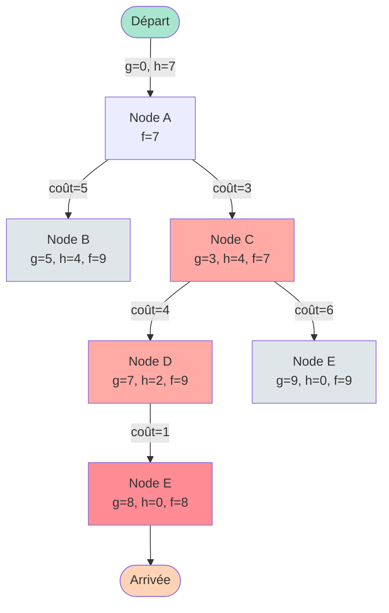

---
tags:
  - ai
  - pathfinding
  - graph-theory
  - algorithms
---

# Pathfinding (Recherche de Chemin)

Comment une IA dans un jeu vidéo sait-elle aller du point A au point B sans se cogner dans les murs ? Grâce aux algorithmes de Pathfinding.

## La Théorie des Graphes

Pour un ordinateur, une carte (labyrinthe, ville, réseau routier) est un **Graphe**.
*   **Noeuds (Nodes)** : Les carrefours, les pièces, ou les cases d'une grille.
*   **Arcs (Edges)** : Les routes qui relient ces noeuds.
*   **Coût** : La "distance" ou la difficulté pour traverser un arc (Km, temps, danger...).

Le but est de trouver la suite de noeuds qui relie le Départ à l'Arrivée avec le **Coût Total** le plus faible.

## Comparaison des Algorithmes

### Table de Complexité

| Algorithme | Complexité Temporelle | Complexité Spatiale | Optimal ? | Complet ? | Heuristique |
|------------|----------------------|---------------------|-----------|-----------|-------------|
| **BFS** (Largeur) | O(V + E) | O(V) | Oui (coût uniforme) | Oui | Non |
| **DFS** (Profondeur) | O(V + E) | O(V) | Non | Oui (graphe fini) | Non |
| **Dijkstra** | O((V + E) log V) | O(V) | Oui | Oui | Non |
| **A*** | O(E) | O(V) | Oui* | Oui | Oui |
| **Greedy Best-First** | O(E) | O(V) | Non | Non | Oui |

*V = nombre de noeuds, E = nombre d'arêtes*
*A* est optimal si l'heuristique est **admissible** (ne surestime jamais le coût réel)

### Caractéristiques Détaillées

#### 1. BFS (Breadth-First Search) - Parcours en Largeur
**Stratégie :** Explore comme une tache d'huile (toutes les cases à distance 1, puis 2, puis 3...).

**Avantages :**
- Trouve toujours le chemin le plus court (en nombre de noeuds)
- Simple à implémenter

**Inconvénients :**
- Très lent (explore dans toutes les directions)
- Ne prend pas en compte les coûts variables

**Cas d'usage :** Grilles uniformes, puzzles simples.

#### 2. DFS (Depth-First Search) - Parcours en Profondeur
**Stratégie :** Fonce tête baissée dans une direction jusqu'à être bloqué, puis revient en arrière (backtrack).

**Avantages :**
- Faible consommation mémoire
- Rapide pour trouver "un" chemin

**Inconvénients :**
- Trouve souvent des chemins horribles
- Peut boucler infiniment (graphes cycliques)

**Cas d'usage :** Génération de labyrinthes, exploration exhaustive.

#### 3. Dijkstra
**Stratégie :** Explore méthodiquement en privilégiant toujours le chemin le "moins cher" connu.

**Avantages :**
- Garantit le chemin optimal
- Fonctionne avec coûts variables

**Inconvénients :**
- Plus lent que A* (explore dans toutes les directions)
- Pas de notion de "direction vers le but"

**Cas d'usage :** Routage réseau (OSPF), GPS sans heuristique.

#### 4. A* (A-Star) - Le Champion
**Stratégie :** Dijkstra intelligent qui privilégie les noeuds qui se rapprochent du but.

**Avantages :**
- Optimal (si heuristique admissible)
- Beaucoup plus rapide que Dijkstra
- Le plus utilisé en pratique

**Inconvénients :**
- Nécessite une bonne heuristique
- Consomme de la mémoire (open set)

**Cas d'usage :** Jeux vidéo, GPS, robotique.

## L'Algorithme A* en Détail

A* est une amélioration de Dijkstra qui utilise une **Heuristique** (une intuition).

### Formule Magique

$$f(n) = g(n) + h(n)$$

- **g(n)** : Coût réel depuis le départ (ce qu'on a déjà parcouru)
- **h(n)** : Estimation du coût restant jusqu'au but (heuristique)
- **f(n)** : Estimation du coût total du chemin passant par n

### Pseudo-Code A*

```
fonction A*(départ, arrivée):
    open_set = file de priorité contenant (départ)
    came_from = dictionnaire vide

    g_score = dictionnaire avec g_score[départ] = 0
    f_score = dictionnaire avec f_score[départ] = h(départ)

    tant que open_set n'est pas vide:
        current = noeud avec plus petit f_score dans open_set

        si current == arrivée:
            retourner reconstruire_chemin(came_from, current)

        retirer current de open_set

        pour chaque voisin de current:
            tentative_g_score = g_score[current] + distance(current, voisin)

            si tentative_g_score < g_score[voisin]:
                came_from[voisin] = current
                g_score[voisin] = tentative_g_score
                f_score[voisin] = g_score[voisin] + h(voisin)

                si voisin pas dans open_set:
                    ajouter voisin à open_set

    retourner échec
```

### Fonctions Heuristiques

Le choix de l'heuristique est crucial pour les performances d'A*.

#### Distance de Manhattan (Grille 4-directions)
```python
def heuristic_manhattan(node, goal):
    """
    Pour grilles où déplacement horizontal/vertical uniquement
    Distance = |x1 - x2| + |y1 - y2|
    """
    return abs(node[0] - goal[0]) + abs(node[1] - goal[1])
```

#### Distance Euclidienne (Vol d'oiseau)
```python
import math

def heuristic_euclidean(node, goal):
    """
    Pour déplacements en diagonale ou espace continu
    Distance = √((x1-x2)² + (y1-y2)²)
    """
    return math.sqrt((node[0] - goal[0])**2 + (node[1] - goal[1])**2)
```

#### Distance de Chebyshev (Grille 8-directions)
```python
def heuristic_chebyshev(node, goal):
    """
    Pour grilles avec diagonales (coût diagonale = coût horizontal)
    Distance = max(|x1 - x2|, |y1 - y2|)
    """
    return max(abs(node[0] - goal[0]), abs(node[1] - goal[1]))
```

**Propriété importante :** L'heuristique doit être **admissible** (ne jamais surestimer) pour garantir l'optimalité d'A*.

## Implémentation Python Complète

### Version Simple avec Grille

```python
import heapq
from typing import List, Tuple, Set, Dict

def astar_grid(grid: List[List[int]], start: Tuple[int, int], goal: Tuple[int, int]) -> List[Tuple[int, int]]:
    """
    A* sur grille 2D

    Args:
        grid: Grille où 0=libre, 1=mur
        start: Position départ (row, col)
        goal: Position arrivée (row, col)

    Returns:
        Liste des positions du chemin, ou [] si impossible
    """
    rows, cols = len(grid), len(grid[0])

    def heuristic(pos):
        return abs(pos[0] - goal[0]) + abs(pos[1] - goal[1])

    def get_neighbors(pos):
        neighbors = []
        for dr, dc in [(0, 1), (1, 0), (0, -1), (-1, 0)]:  # 4 directions
            new_row, new_col = pos[0] + dr, pos[1] + dc
            if 0 <= new_row < rows and 0 <= new_col < cols:
                if grid[new_row][new_col] == 0:  # Case libre
                    neighbors.append((new_row, new_col))
        return neighbors

    # Initialisation
    open_set = []
    heapq.heappush(open_set, (0 + heuristic(start), 0, start))  # (f_score, g_score, position)

    came_from: Dict[Tuple[int, int], Tuple[int, int]] = {}
    g_score = {start: 0}
    f_score = {start: heuristic(start)}

    closed_set: Set[Tuple[int, int]] = set()

    while open_set:
        current_f, current_g, current = heapq.heappop(open_set)

        if current in closed_set:
            continue

        if current == goal:
            # Reconstruction du chemin
            path = []
            while current in came_from:
                path.append(current)
                current = came_from[current]
            path.append(start)
            return path[::-1]

        closed_set.add(current)

        for neighbor in get_neighbors(current):
            if neighbor in closed_set:
                continue

            tentative_g = g_score[current] + 1  # Coût = 1 par case

            if neighbor not in g_score or tentative_g < g_score[neighbor]:
                came_from[neighbor] = current
                g_score[neighbor] = tentative_g
                f = tentative_g + heuristic(neighbor)
                f_score[neighbor] = f
                heapq.heappush(open_set, (f, tentative_g, neighbor))

    return []  # Pas de chemin trouvé

# Exemple d'utilisation
grid = [
    [0, 0, 0, 0, 0],
    [0, 1, 1, 1, 0],
    [0, 0, 0, 0, 0],
    [0, 1, 0, 1, 0],
    [0, 0, 0, 0, 0]
]

start = (0, 0)
goal = (4, 4)

path = astar_grid(grid, start, goal)
print(f"Chemin trouvé: {path}")
print(f"Longueur: {len(path)} cases")

# Visualisation
for r in range(len(grid)):
    row = ""
    for c in range(len(grid[0])):
        if (r, c) == start:
            row += "S "
        elif (r, c) == goal:
            row += "G "
        elif (r, c) in path:
            row += "* "
        elif grid[r][c] == 1:
            row += "# "
        else:
            row += ". "
    print(row)
```

**Sortie :**
```
Chemin trouvé: [(0, 0), (0, 1), (0, 2), (0, 3), (0, 4), (1, 4), (2, 4), (3, 4), (4, 4)]
Longueur: 9 cases

S * * * *
. # # # *
. . . . *
. # . # *
. . . . G
```

### Version avec Graphe Pondéré

```python
from dataclasses import dataclass
from typing import Dict, List
import heapq

@dataclass
class Node:
    id: str
    neighbors: Dict[str, float]  # {node_id: cost}

def astar_graph(graph: Dict[str, Node], start: str, goal: str,
                heuristic: Dict[str, float]) -> List[str]:
    """
    A* sur graphe pondéré général

    Args:
        graph: Dictionnaire de noeuds
        start: ID noeud départ
        goal: ID noeud arrivée
        heuristic: Estimation du coût de chaque noeud vers le goal

    Returns:
        Liste des IDs de noeuds du chemin
    """
    open_set = [(0 + heuristic.get(start, 0), 0, start)]
    came_from = {}
    g_score = {start: 0}
    closed_set = set()

    while open_set:
        current_f, current_g, current = heapq.heappop(open_set)

        if current in closed_set:
            continue

        if current == goal:
            path = []
            while current in came_from:
                path.append(current)
                current = came_from[current]
            path.append(start)
            return path[::-1]

        closed_set.add(current)

        for neighbor, cost in graph[current].neighbors.items():
            if neighbor in closed_set:
                continue

            tentative_g = g_score[current] + cost

            if neighbor not in g_score or tentative_g < g_score[neighbor]:
                came_from[neighbor] = current
                g_score[neighbor] = tentative_g
                f = tentative_g + heuristic.get(neighbor, 0)
                heapq.heappush(open_set, (f, tentative_g, neighbor))

    return []

# Exemple: Graphe de villes
graph = {
    'A': Node('A', {'B': 5, 'C': 3}),
    'B': Node('B', {'A': 5, 'D': 2}),
    'C': Node('C', {'A': 3, 'D': 4, 'E': 6}),
    'D': Node('D', {'B': 2, 'C': 4, 'E': 1}),
    'E': Node('E', {'C': 6, 'D': 1})
}

# Heuristique: distance à vol d'oiseau vers E
heuristic = {'A': 7, 'B': 4, 'C': 4, 'D': 2, 'E': 0}

path = astar_graph(graph, 'A', 'E', heuristic)
print(f"Chemin optimal: {' → '.join(path)}")

# Calculer coût total
total_cost = sum(graph[path[i]].neighbors[path[i+1]] for i in range(len(path)-1))
print(f"Coût total: {total_cost}")
```

**Sortie :**
```
Chemin optimal: A → C → D → E
Coût total: 8
```

## Visualisation de l'Exploration A*



**Légende :**
- **Vert** : Noeud de départ
- **Rouge** : Chemin optimal sélectionné
- **Orange** : But atteint
- **Gris** : Noeuds explorés mais non retenus

### Ordre d'Exploration

1. **A** (f=7) : Plus petit f, on explore
2. **C** (f=7) : Plus prometteur que B (f=9)
3. **D** (f=9) : Exploration via C
4. **E via D** (f=8) : Plus court que E via C (f=9)
5. **But atteint** : A → C → D → E

## Cas d'Usage Pratiques

### 1. Routage Réseau

```python
# Trouver meilleur chemin entre deux datacenters
# Coût = latence réseau

def network_pathfinding(topology, source_dc, dest_dc):
    """
    topology: {
        'DC1': {'DC2': 10ms, 'DC3': 50ms},
        'DC2': {'DC1': 10ms, 'DC4': 30ms},
        ...
    }
    """
    def heuristic(node):
        # Estimation: latence minimale théorique
        return estimate_min_latency(node, dest_dc)

    path = astar_graph(topology, source_dc, dest_dc, heuristic)
    return path

# Application: Routage dynamique de requêtes
# Si DC2 saturé, reroutage automatique via DC3
```

### 2. Allocation de Ressources

```python
# Ordonnancer tâches sur cluster
# Trouver séquence d'allocations minimisant makespan

class ResourceState:
    def __init__(self, allocated_tasks, free_cpus, time):
        self.allocated = allocated_tasks
        self.free_cpus = free_cpus
        self.time = time

    def get_neighbors(self):
        """Retourne états possibles (quelle tâche allouer ensuite)"""
        neighbors = []
        for task in remaining_tasks:
            if task.cpus <= self.free_cpus:
                new_state = ResourceState(
                    self.allocated + [task],
                    self.free_cpus - task.cpus,
                    max(self.time, task.end_time)
                )
                neighbors.append(new_state)
        return neighbors

def schedule_tasks(tasks, total_cpus):
    """Utilise A* pour trouver ordonnancement optimal"""
    start_state = ResourceState([], total_cpus, 0)
    goal_condition = lambda s: len(s.allocated) == len(tasks)

    def heuristic(state):
        # Estimation: temps minimum pour tâches restantes
        remaining = [t for t in tasks if t not in state.allocated]
        return sum(t.duration for t in remaining) / total_cpus

    # A* avec états au lieu de graphe
    # ...
```

### 3. Pathfinding Multi-Agents

```python
# Jeu vidéo: plusieurs unités doivent se déplacer sans collision

def cooperative_pathfinding(units, goals, grid):
    """
    Réservation temporelle: chaque unité réserve cases aux instants t
    """
    reservations = {}  # {(row, col, time): unit_id}
    paths = {}

    for unit in units:
        # Modifier A* pour éviter cases réservées
        path = astar_with_reservations(
            grid, unit.pos, goals[unit.id], reservations
        )

        # Réserver les cases du chemin
        for t, pos in enumerate(path):
            reservations[(pos[0], pos[1], t)] = unit.id

        paths[unit.id] = path

    return paths

def astar_with_reservations(grid, start, goal, reservations):
    """A* modifié qui considère les réservations comme obstacles temporels"""
    # Dans get_neighbors, vérifier:
    # if (neighbor[0], neighbor[1], current_time + 1) in reservations:
    #     continue  # Case occupée à cet instant
    pass
```

### 4. Navigation GPS avec Contraintes

```python
# GPS avec préférences utilisateur
def astar_gps(road_network, start, goal, preferences):
    """
    preferences = {
        'avoid_highways': True,
        'avoid_tolls': True,
        'prefer_scenic': True
    }
    """
    def adjusted_cost(edge):
        base_cost = edge.distance

        if preferences.get('avoid_highways') and edge.type == 'highway':
            base_cost *= 2  # Pénalité
        if preferences.get('avoid_tolls') and edge.toll:
            base_cost *= 1.5
        if preferences.get('prefer_scenic') and edge.scenic:
            base_cost *= 0.8  # Bonus

        return base_cost

    # A* avec coûts ajustés
    # ...
```

## Optimisations Avancées

### 1. Jump Point Search (JPS)
Optimisation d'A* pour grilles uniformes. Saute plusieurs cases d'un coup.

```python
def jump_point_search(grid, start, goal):
    """
    Jusqu'à 10x plus rapide qu'A* sur grandes grilles
    Utilise propriétés de symétrie pour sauter cases
    """
    # Implémentation complexe, voir bibliothèque pathfinding
    pass
```

### 2. Bidirectional A*
Recherche simultanée depuis départ ET arrivée.

```python
def bidirectional_astar(graph, start, goal):
    """
    Deux A* se rencontrent au milieu
    Réduit l'espace exploré de moitié
    """
    forward_search = astar_search(graph, start, direction='forward')
    backward_search = astar_search(graph, goal, direction='backward')

    # Continue jusqu'à intersection
    # ...
```

### 3. Hierarchical A*
Pour très grandes cartes : découper en régions.

```python
# Étape 1: Pathfinding grossier entre régions
# Étape 2: Pathfinding fin dans chaque région
```

## Comparaison Visuelle

Voici comment chaque algorithme explore un labyrinthe simple :

```
BFS: Explore en cercles concentriques
######################
#S********************#
#****################*#
#****#          ****#*#
#****#          ****#*#
#****#          ****#*#
#****#          ****#*#
#****############***#*#
#*******************G#
######################
Noeuds explorés: 85

Dijkstra: Similaire à BFS (coûts uniformes)
Noeuds explorés: 85

A*: Exploration dirigée vers le but
######################
#S                   #
#****################*#
#   *#          ****#*#
#   *#          ****#*#
#   *#          ****#*#
#   *#          ****#*#
#   *############***#*#
#   ****************G#
######################
Noeuds explorés: 32
```

## Ressources et Bibliothèques Python

```python
# Bibliothèque recommandée: pathfinding
from pathfinding.core.grid import Grid
from pathfinding.finder.a_star import AStarFinder

grid = Grid(matrix=[[0,0,1], [0,0,0], [0,1,0]])
start = grid.node(0, 0)
end = grid.node(2, 2)

finder = AStarFinder()
path, runs = finder.find_path(start, end, grid)
print(path)  # [(0, 0), (1, 0), (1, 1), (1, 2), (2, 2)]
```

## Comparaison Finale

**Choisir :**
- **BFS** : Grilles non pondérées, très petites cartes
- **Dijkstra** : Besoin de distance exacte vers tous les noeuds (ex: routage OSPF)
- **A*** : 99% des cas pratiques (jeux, GPS, robotique)
- **JPS** : Grandes grilles uniformes (RTS, roguelikes)

> **En résumé** : A* est intelligent car il combine la rigueur (Dijkstra) et l'intuition (Direction générale vers le but). C'est l'algorithme de référence pour le pathfinding moderne, utilisé de Starcraft à Google Maps.
