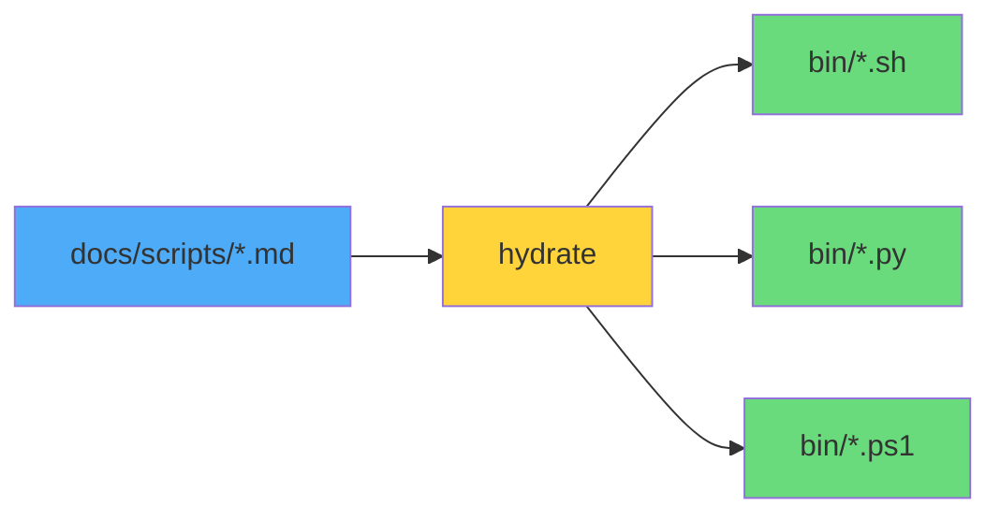

---
tags:
  - cli
  - tools
  - automation
---

# ShellBook CLI (`sb`)

Le wrapper unifié pour tous les scripts ShellBook.

---

## Vue d'Ensemble

```
   _____ __         ____  ____              __
  / ___// /_  ___  / / / / __ )____  ____  / /__
  \__ \/ __ \/ _ \/ / / / __  / __ \/ __ \/ //_/
 ___/ / / / /  __/ / / / /_/ / /_/ / /_/ / ,<
/____/_/ /_/\___/_/_/ /_____/\____/\____/_/|_|
```

Le script `sb` (ShellBook) est un wrapper Bash qui unifie l'accès à tous les scripts de la bibliothèque. Sa fonctionnalité principale est **hydrate** : l'extraction automatique du code depuis les fichiers Markdown vers des scripts exécutables.

---

## Installation Rapide

```bash
# Cloner le dépôt
git clone https://github.com/VBlackJack/ShellBook.git
cd ShellBook

# Rendre le CLI exécutable
chmod +x sb

# Extraire les scripts et installer les dépendances
./sb hydrate
./sb install
```

!!! success "Prêt à l'emploi"
    Après ces commandes, tous les scripts sont disponibles dans le dossier `bin/` et peuvent être exécutés via le CLI.

---

## Commandes Disponibles

### Setup & Maintenance

| Commande | Description |
|----------|-------------|
| `./sb hydrate` | Extrait les scripts des fichiers Markdown vers `bin/` |
| `./sb install` | Installe les dépendances Python via pip |
| `./sb list` | Liste tous les scripts disponibles dans `bin/` |
| `./sb help` | Affiche l'aide complète |

### Nettoyage

| Commande | Description |
|----------|-------------|
| `./sb clean docker` | Nettoyage Docker (images, conteneurs, volumes) |
| `./sb clean git` | Nettoyage des branches Git obsolètes |

### Audit

| Commande | Description |
|----------|-------------|
| `./sb audit server` | Audit complet du serveur (God Script) |
| `./sb audit redis` | Audit des clés Redis |

### Générateurs

| Commande | Description |
|----------|-------------|
| `./sb generate systemd` | Génère un fichier unit systemd |
| `./sb generate ssl` | Génère un CSR SSL/TLS |
| `./sb generate logrotate` | Génère une config logrotate |

---

## La Magie de Hydrate

La commande `hydrate` est le cœur du CLI. Elle transforme la documentation en code exécutable.

### Comment ça fonctionne



### Processus d'extraction

1. **Scan** : Parcourt tous les fichiers `.md` dans `docs/scripts/`
2. **Parse** : Identifie le premier bloc de code (````bash`, ````python`, ````powershell`)
3. **Extract** : Extrait le contenu du bloc de code
4. **Write** : Sauvegarde dans `bin/` avec l'extension appropriée
5. **Chmod** : Rend les scripts exécutables

### Exemple

**Avant** (`docs/scripts/bash/cleanup-system.md`) :

```markdown
# Cleanup System

Ce script nettoie le système...

​```bash
#!/bin/bash
# cleanup-system.sh
echo "Cleaning..."
apt autoremove -y
​```
```

**Après** (`bin/cleanup-system.sh`) :

```bash
#!/bin/bash
# cleanup-system.sh
echo "Cleaning..."
apt autoremove -y
```

---

## Exemples d'Utilisation

### Première utilisation

```bash
# Setup complet
./sb hydrate && ./sb install

# Vérifier les scripts disponibles
./sb list
```

### Nettoyage Docker

```bash
# Dry-run (voir ce qui serait supprimé)
./sb clean docker --dry-run

# Nettoyage effectif avec volumes
./sb clean docker --include-volumes --force
```

### Audit serveur

```bash
# Audit complet avec rapport Markdown
./sb audit server -o audit_$(hostname).md

# Audit Redis
./sb audit redis --host localhost --top 50
```

### Génération de configuration

```bash
# Générer un service systemd
./sb generate systemd

# Générer un CSR SSL
./sb generate ssl

# Générer une config logrotate
./sb generate logrotate
```

---

## Structure du Projet

```
ShellBook/
├── sb                          # CLI wrapper (ce script)
├── bin/                        # Scripts extraits (après hydrate)
│   ├── *.sh                    # Scripts Bash
│   ├── *.py                    # Scripts Python
│   └── *.ps1                   # Scripts PowerShell
├── docs/
│   ├── scripts/
│   │   ├── bash/               # Documentation Bash (source)
│   │   ├── python/             # Documentation Python (source)
│   │   │   └── requirements.txt
│   │   └── powershell/         # Documentation PowerShell (source)
│   └── cli/
│       └── index.md            # Cette documentation
└── mkdocs.yml
```

---

## Options Avancées

### Exécution directe depuis bin/

Après `hydrate`, vous pouvez aussi exécuter les scripts directement :

```bash
# Python
python3 bin/docker_cleaner_pro.py --dry-run

# Bash
bash bin/server-discovery-audit.sh -o report.md

# PowerShell (Windows)
pwsh bin/Invoke-ServerAudit.ps1
```

### Alias recommandés

Ajoutez ces alias à votre `.bashrc` ou `.zshrc` :

```bash
# Alias ShellBook
alias sb='./sb'
alias sb-clean='./sb clean docker --dry-run'
alias sb-audit='./sb audit server'
```

---

## Dépannage

### "Script not found"

```
[ERROR] Script not found: bin/docker_cleaner_pro.py
[WARN] Run './sb hydrate' first to extract scripts from documentation.
```

**Solution :** Exécutez `./sb hydrate` pour extraire les scripts.

### "pip not found"

```
[ERROR] pip not found. Please install Python and pip first.
```

**Solution :** Installez Python 3 avec pip :

```bash
# Ubuntu/Debian
sudo apt install python3 python3-pip

# macOS
brew install python3

# Windows
# Téléchargez depuis python.org
```

### Permissions refusées

```bash
# Rendre le CLI exécutable
chmod +x sb

# Rendre tous les scripts du bin/ exécutables
chmod +x bin/*
```

---

## Voir Aussi

- [Scripts Bash](../scripts/bash/index.md)
- [Scripts Python](../scripts/python/index.md)
- [Scripts PowerShell](../scripts/powershell/index.md)
- [Playbook Réponse Incident](../playbooks/incident-response.md)
