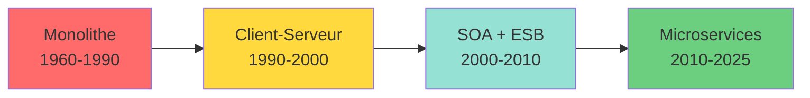
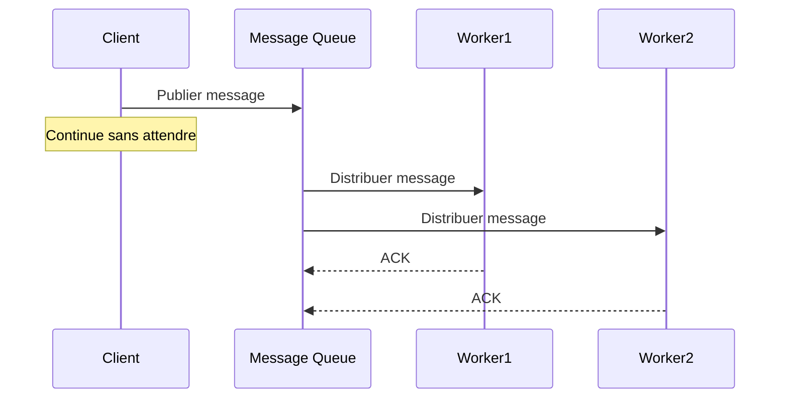
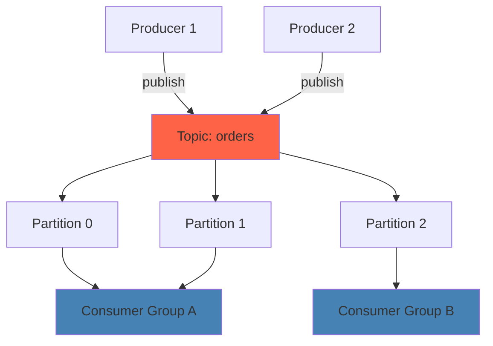
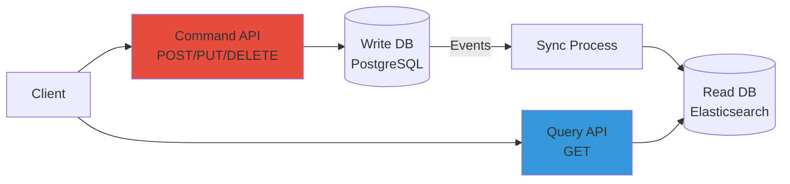
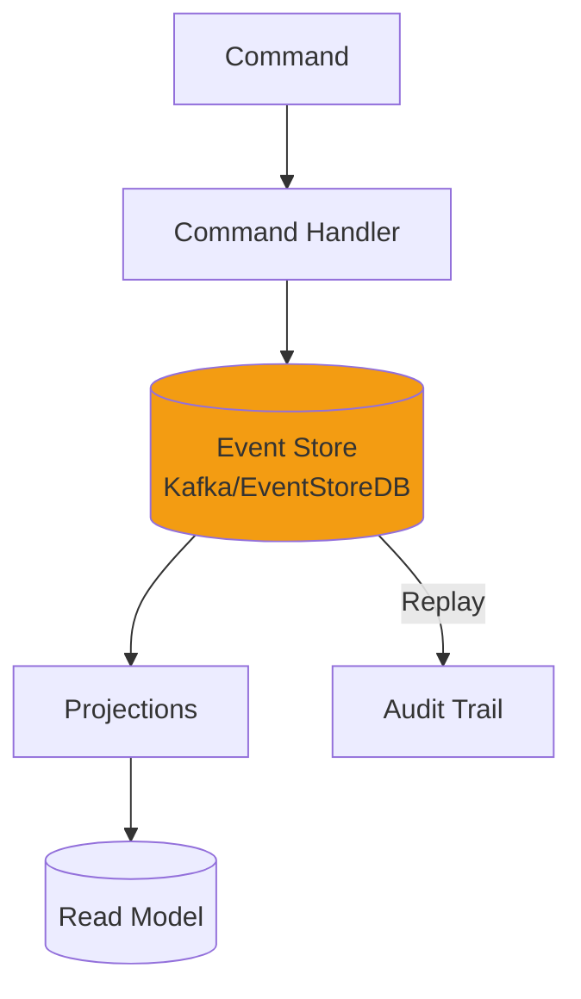
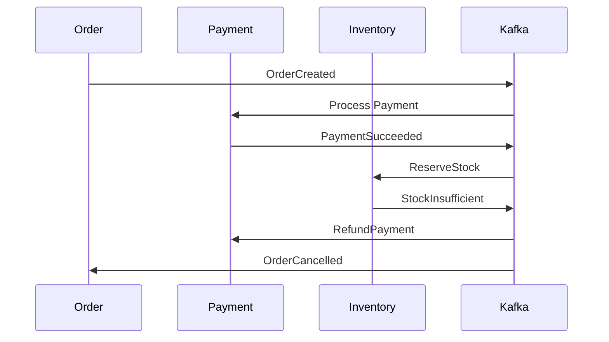

---
tags:
  - architecture
  - soa
  - microservices
  - api
  - kafka
  - messaging
---

# Architecture Logicielle : Concepts & Patterns

Comprendre comment les systèmes modernes communiquent est essentiel pour un ingénieur DevOps. Nous sommes passés des monolithes aux microservices via le SOA.

## 1. L'Évolution des Architectures



### Gen 1 : Le Monolithe (Mainframe)
Une seule application géante qui fait tout.
*   **Avantages** : Simple à déployer (un seul binaire), appels de fonctions instantanés.
*   **Inconvénients** : Scalabilité difficile (tout ou rien), techno unique (si c'est du COBOL, tout est en COBOL), risque de casser tout le système au moindre changement.

### Gen 2 : Client-Serveur
Séparation entre l'interface (Client lourd) et la logique/données (Serveur).

### Gen 3 : SOA (Service Oriented Architecture)
Apparu vers 2004, c'est l'ancêtre des microservices.
*   **Concept** : Découper le SI en services métier réutilisables (Service Facturation, Service Client).
*   **Paradigme** : **Publish / Find / Consume**.
    *   Un service publie son contrat (WSDL) dans un annuaire (UDDI).
    *   Le consommateur trouve le service et l'appelle (SOAP).
*   **Problème** : Souvent implémenté avec des "Bus d'Entreprise" (ESB) très lourds et centraux.

### Gen 4 : Microservices (SOA "Léger")
L'approche moderne (Netflix, Uber, Google).
*   C'est du SOA, mais **décentralisé** et **sans état**.
*   Chaque service a sa propre base de données.
*   Communication via des protocoles web légers (REST, gRPC) plutôt que SOAP.

---

## 2. Concepts Clés du SOA & Microservices

### Couplage Lâche (Loose Coupling)
Le but ultime. Le client ne doit pas dépendre des détails internes du serveur.
*   **Abstraction (Boîte Noire)** : Je sais *ce que* fait le service, mais pas *comment* il le fait.
*   **Contrat d'Interface** : Le service promet "Si tu m'envoies X, je te réponds Y". Tant que le contrat est respecté, le code interne peut changer sans casser les clients.

### Stateless (Sans État)
Pour être scalable horizontalement, un service ne doit pas garder de "session" en mémoire.
*   Si le serveur A traite la requête 1, le serveur B doit pouvoir traiter la requête 2 du même utilisateur.
*   L'état est stocké dans une base de données externe (Redis, SQL).

### Composabilité
Un service complexe peut être créé en assemblant plusieurs services simples (Orchestration).

---

## 3. Protocoles d'Échange

### SOAP (Simple Object Access Protocol) - "L'Ancien"
*   Format : XML strict.
*   Contrat : WSDL (Web Services Description Language).
*   **Avantages** : Très rigoureux, sécurité (WS-Security), transactions atomiques.
*   **Inconvénients** : Verbeux, lourd, complexe à parser.
*   **Usage 2025** : Encore très présent dans les banques et les assurances (Legacy).

### REST (Representational State Transfer) - "Le Standard Web"
*   Format : Souvent JSON (plus léger que XML).
*   Utilise les verbes HTTP standards :
    *   `GET` : Lire (Idempotent).
    *   `POST` : Créer.
    *   `PUT` : Remplacer.
    *   `DELETE` : Supprimer.
*   **Ressources** : Tout est une URL (`/api/users/123`).
*   **Usage 2025** : Le standard de facto pour les API Web et Microservices.

### gRPC (Google RPC) - "La Performance"
*   Format : Binaire (Protocol Buffers).
*   **Avantages** :
    *   10x plus rapide que REST/JSON (sérialisation binaire).
    *   Support natif du streaming bidirectionnel.
    *   Génération automatique du code client/serveur (à partir du `.proto`).
*   **Inconvénients** :
    *   Non lisible par l'humain (binaire).
    *   Moins adapté pour les navigateurs (pas de support natif HTTP/2 partout).
*   **Usage 2025** : Communication interne entre microservices (Kubernetes) où la latence doit être minimale.

**Exemple de contrat gRPC** (`user.proto`) :
```protobuf
service UserService {
  rpc GetUser (UserRequest) returns (UserResponse);
  rpc ListUsers (Empty) returns (stream UserResponse);
}

message UserRequest {
  int32 id = 1;
}

message UserResponse {
  int32 id = 1;
  string name = 2;
  string email = 3;
}
```

---

## 4. Patterns de Messaging Asynchrone

La communication synchrone (REST/gRPC) bloque le client. En asynchrone, le client envoie un message et continue sans attendre.



### Point-to-Point (Queue)
*   Un message est consommé par **un seul** worker.
*   Use case : Traitement de tâches (génération de PDF, envoi d'emails).

### Publish/Subscribe (Pub/Sub)
*   Un message est diffusé à **tous** les abonnés.
*   Use case : Notifications, logs centralisés, événements métier.

---

## 5. Apache Kafka - Le Bus d'Événements Distribué

### Concept
Kafka n'est pas une simple queue. C'est un **log distribué immuable**.
*   Les messages sont écrits séquentiellement dans des **topics** (sujets).
*   Chaque message a une position (**offset**).
*   Les consommateurs avancent à leur rythme (peuvent relire l'historique).

### Architecture


### Use Cases
*   **Event Sourcing** : Stocker tous les événements métier (commande créée, payée, expédiée).
*   **Real-time Analytics** : Traitement de flux (clickstream, IoT).
*   **Data Pipeline** : Synchroniser des bases de données (CDC - Change Data Capture).
*   **Logs Centralisés** : Agrégation de logs applicatifs.

### Concepts Clés
*   **Topic** : Canal logique (ex: `orders`, `payments`).
*   **Partition** : Division physique d'un topic pour la scalabilité.
*   **Consumer Group** : Plusieurs workers qui partagent le travail (chaque partition est lue par un seul worker du groupe).
*   **Retention** : Kafka garde les messages X jours (par défaut 7 jours), même après consommation.

---

## 6. RabbitMQ - Le Courtier de Messages Classique

### Concept
RabbitMQ est un **message broker** traditionnel qui implémente AMQP (Advanced Message Queuing Protocol).
*   Les messages passent par des **exchanges** qui routent vers des **queues**.
*   Une fois consommé et acquitté (ACK), le message est supprimé.

### Kafka vs RabbitMQ

| Critère | Kafka | RabbitMQ |
|---------|-------|----------|
| **Modèle** | Log distribué (append-only) | Queue traditionnelle |
| **Suppression** | Après X jours (retention) | Après consommation (ACK) |
| **Throughput** | Très élevé (millions/sec) | Moyen (milliers/sec) |
| **Ordre des messages** | Garanti par partition | Garanti par queue |
| **Use case principal** | Event streaming, analytics | Task queue, RPC asynchrone |
| **Complexité** | Plus complexe (Zookeeper/KRaft) | Plus simple |
| **Relecture** | Oui (via offset) | Non (sauf DLQ) |

### Quand utiliser RabbitMQ ?
*   Traitement de tâches simples (envoi d'emails, génération de rapports).
*   Besoin de routage complexe (topic exchange, headers exchange).
*   Faible volume de messages (<10k/sec).
*   Pas besoin de relire l'historique.

### Quand utiliser Kafka ?
*   Event-driven architecture (microservices qui réagissent aux événements).
*   Analytics en temps réel.
*   Volumes massifs (>100k messages/sec).
*   Besoin de rejouer les événements (audit, debugging).

---

## 7. CQRS - Command Query Responsibility Segregation

### Concept
Séparer les opérations **d'écriture** (Commands) et de **lecture** (Queries) en deux modèles distincts.



### Pourquoi ?
*   Les besoins en lecture et écriture sont souvent très différents.
*   **Écriture** : Normalisation, transactions ACID, validation métier.
*   **Lecture** : Dénormalisation, performance, recherche full-text.

### Exemple Pratique
*   **Write side** : PostgreSQL avec données normalisées.
*   **Read side** : Elasticsearch ou MongoDB avec données dénormalisées (vues optimisées).
*   **Synchronisation** : Via Kafka ou CDC (Debezium).

### Avantages
*   Scalabilité indépendante (10 instances read, 2 instances write).
*   Optimisation spécifique (index différents).

### Inconvénients
*   Complexité accrue.
*   Eventual consistency (délai de synchro).

---

## 8. Event Sourcing - L'Historique Immuable

### Concept
Au lieu de stocker l'**état actuel**, on stocke la **séquence d'événements** qui ont mené à cet état.

**Exemple classique : Compte bancaire**
```
État traditionnel : Solde = 1500€

Event Sourcing :
1. CompteCreated { solde: 0 }
2. DepotEffectue { montant: 2000 }
3. RetraitEffectue { montant: 500 }
→ État final calculé : 1500€
```

### Architecture


### Avantages
*   **Audit complet** : On sait exactement ce qui s'est passé et quand.
*   **Debugging** : On peut rejouer les événements pour reproduire un bug.
*   **Temporal queries** : "Quel était l'état du compte le 15/03/2024 ?"
*   **Nouvelles projections** : On peut créer de nouvelles vues en rejouant l'historique.

### Inconvénients
*   Complexité (il faut gérer les snapshots pour éviter de rejouer 1 million d'événements).
*   Stockage (les événements ne sont jamais supprimés).
*   Courbe d'apprentissage.

### Use Cases
*   Banque, assurance (traçabilité réglementaire).
*   E-commerce (historique des commandes).
*   Systèmes collaboratifs (Google Docs = event sourcing).

---

## 9. Saga Pattern - Transactions Distribuées

### Problème
Dans un monolithe, une transaction SQL garantit l'atomicité. Dans les microservices, chaque service a sa propre BDD. Comment gérer une opération qui touche plusieurs services ?

**Exemple : Commande e-commerce**
1. Service Order : Créer la commande
2. Service Payment : Débiter la carte
3. Service Inventory : Réserver le stock
4. Service Shipping : Programmer la livraison

Si l'étape 3 échoue (stock insuffisant), il faut **annuler** les étapes 1 et 2.

### Solution : Saga
Une saga est une séquence de transactions locales coordonnées par des événements.

#### Saga Chorégraphiée (Event-driven)
Chaque service publie un événement, les autres réagissent.



#### Saga Orchestrée (Centralisée)
Un orchestrateur (workflow engine) coordonne les étapes.

### Compensation
Chaque étape doit avoir une opération inverse :
*   `CreateOrder` ↔ `CancelOrder`
*   `ChargeCard` ↔ `RefundCard`

---

## 10. Quand Utiliser Quel Pattern ?

| Besoin | Pattern Recommandé | Outils |
|--------|-------------------|--------|
| API publique, mobile app | **REST** | Spring Boot, FastAPI, Express |
| Communication inter-microservices rapide | **gRPC** | gRPC, Protobuf |
| Traitement asynchrone de tâches | **Message Queue** | RabbitMQ, AWS SQS |
| Event-driven architecture | **Kafka** | Kafka, Pulsar |
| Séparation lecture/écriture | **CQRS** | PostgreSQL + Elasticsearch |
| Audit et traçabilité totale | **Event Sourcing** | EventStoreDB, Kafka |
| Transaction multi-services | **Saga** | Temporal, Camunda |

---

## 11. Anti-Patterns à Éviter

### 1. Le Distributed Monolith
*   **Symptôme** : Vous avez 20 microservices, mais ils se déploient tous ensemble.
*   **Cause** : Couplage fort (appels synchrones en chaîne, base de données partagée).
*   **Solution** : Asynchronisme (Kafka), contrats d'API stricts, BDD par service.

### 2. Le Chatty Microservices
*   **Symptôme** : Une action utilisateur génère 50 appels API internes.
*   **Cause** : Services trop granulaires.
*   **Solution** : Regrouper certains services, utiliser des API Gateway, caching (Redis).

### 3. La Transaction Distribuée Synchrone
*   **Symptôme** : Appeler 5 services en REST pour valider une commande (timeout probable).
*   **Solution** : Saga asynchrone, événements.

### 4. Le Manque de Monitoring
*   **Symptôme** : "Ça marche pas, mais je sais pas pourquoi".
*   **Solution** : OpenTelemetry, distributed tracing (Jaeger), logs centralisés (ELK).

### 5. L'Over-Engineering
*   **Symptôme** : Kafka + CQRS + Event Sourcing pour une todo-list.
*   **Solution** : Commencer simple (REST + PostgreSQL). Complexifier uniquement quand le besoin l'impose.

### 6. La Base de Données Partagée
*   **Symptôme** : Tous les microservices tapent dans la même BDD.
*   **Problème** : Couplage maximal, pas de scalabilité indépendante.
*   **Solution** : Database per service (chaque microservice a sa propre BDD).

---

## Ressources

*   [Martin Fowler - Microservices](https://martinfowler.com/articles/microservices.html)
*   [Kafka Documentation](https://kafka.apache.org/documentation/)
*   [CQRS by Microsoft](https://learn.microsoft.com/en-us/azure/architecture/patterns/cqrs)
*   [Saga Pattern](https://microservices.io/patterns/data/saga.html)
*   [gRPC Official](https://grpc.io/)
