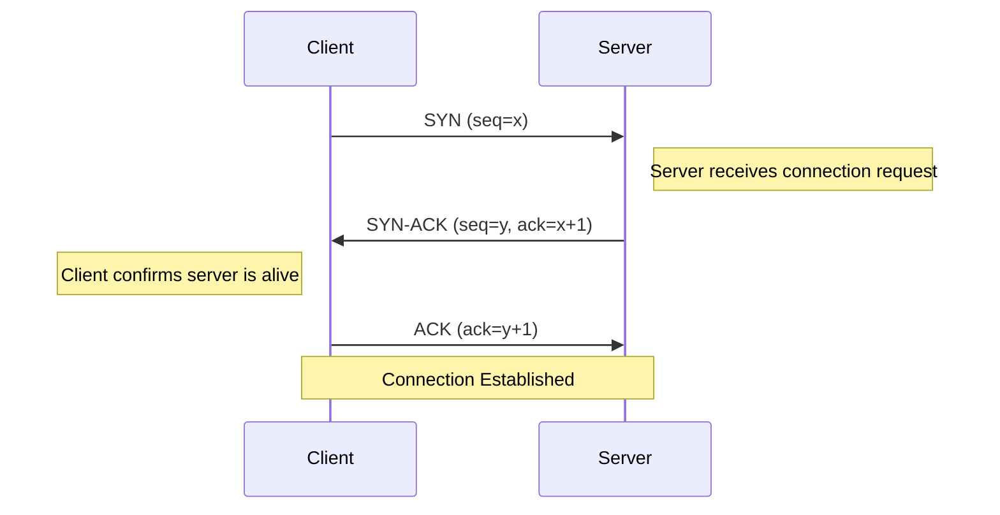
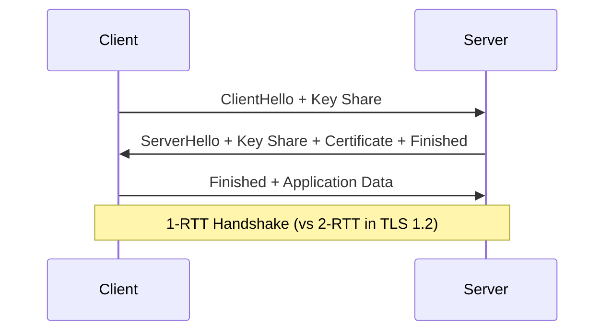

# Web Architecture: From URL to Page

`#network` `#dns` `#http3` `#quic`

Understanding the complete journey of a web request, from typing a URL to rendering a page.

---

## Phase 1: DNS Resolution

When you type `https://example.com`, your browser must first resolve the domain to an IP address.

### Cache Hierarchy

```
Browser Cache → OS Cache → Router Cache → ISP Resolver → Root DNS
     ↓              ↓            ↓              ↓             ↓
   (ms)          (ms)         (ms)          (10-50ms)    (100ms+)
```

1. **Browser Cache** - Chrome/Firefox stores recent lookups (~60s TTL)
2. **OS Cache** - System resolver (`/etc/hosts`, systemd-resolved)
3. **Router Cache** - Local network DNS cache
4. **ISP Recursive Resolver** - Your ISP's DNS server
5. **Authoritative DNS** - The domain's actual nameserver

### Recursive Resolution

```
Client → Resolver → Root (.) → TLD (.com) → Authoritative (example.com)
                  ←──────────── IP Address ────────────────┘
```

!!! tip "Debugging DNS"
    ```bash
    # Full trace of DNS resolution
    dig +trace example.com

    # Simple lookup
    nslookup example.com

    # Query specific DNS server
    dig @8.8.8.8 example.com

    # Check DNS propagation
    dig +short example.com @1.1.1.1
    dig +short example.com @8.8.8.8
    ```

---

## Phase 2: The Connection (TCP & TLS)

### TCP Three-Way Handshake



**Round trips:** 1.5 RTT before any data can be sent.

### TLS 1.3 Handshake

TLS 1.3 reduces latency significantly compared to TLS 1.2:



**Key improvements in TLS 1.3:**

- **1-RTT handshake** (down from 2-RTT)
- **0-RTT resumption** for repeat connections
- **Removed weak ciphers** (RC4, 3DES, SHA-1)
- **Forward secrecy mandatory**

### SNI (Server Name Indication)

!!! info "Why SNI matters"
    SNI allows multiple HTTPS sites on a single IP address.
    The client sends the hostname in the TLS handshake (unencrypted in TLS 1.2).

    **Privacy concern:** ISPs can see which sites you visit via SNI.
    **Solution:** Encrypted Client Hello (ECH) in TLS 1.3 extensions.

---

## Phase 3: HTTP Evolution

=== "HTTP/1.1"

    **Released:** 1997

    ```
    GET /index.html HTTP/1.1
    Host: example.com
    Connection: keep-alive
    ```

    **Characteristics:**

    - Text-based protocol (human readable)
    - One request per TCP connection (or pipelining)
    - **Head-of-line blocking** - requests wait in queue
    - Multiple TCP connections needed for parallelism (6 per domain)
    - No header compression

    **Limitations:**
    ```
    Request 1 ████████░░░░░░░░ (waiting)
    Request 2 ░░░░░░░░████████ (blocked)
    ```

=== "HTTP/2"

    **Released:** 2015

    **Characteristics:**

    - **Binary protocol** (efficient parsing)
    - **Multiplexing** - multiple streams over single TCP
    - **Header compression** (HPACK)
    - **Server push** (preemptive resource sending)
    - **Stream prioritization**

    **Multiplexing visualization:**
    ```
    Stream 1 ██░░██░░██
    Stream 2 ░░██░░██░░  → Single TCP Connection
    Stream 3 ██░░░░██░░
    ```

    **Remaining issue:** TCP-level head-of-line blocking on packet loss.

=== "HTTP/3 (QUIC)"

    **Released:** 2022

    **Characteristics:**

    - **UDP-based** (no TCP handshake)
    - **Built-in TLS 1.3** (0-RTT possible)
    - **Independent streams** - packet loss doesn't block other streams
    - **Connection migration** (survives IP changes)
    - **Improved congestion control**

    **Key advantage:**
    ```
    Stream 1 ██░░██░░██  ← Packet lost, only Stream 1 affected
    Stream 2 ░░██░░██░░  ← Continues normally
    Stream 3 ██░░░░██░░  ← Continues normally
    ```

    **Connection establishment:**
    ```
    HTTP/1.1: TCP (1.5 RTT) + TLS (2 RTT) = 3.5 RTT
    HTTP/2:   TCP (1.5 RTT) + TLS (1 RTT) = 2.5 RTT
    HTTP/3:   QUIC+TLS (1 RTT) = 1 RTT (0-RTT for resumption)
    ```

---

## Protocol Comparison

| Protocol | Transport | Encryption | Multiplexing | Key Feature |
|----------|-----------|------------|--------------|-------------|
| HTTP/1.1 | TCP | Optional (HTTPS) | No | Simple, text-based |
| HTTP/2 | TCP | Practically required | Yes | Binary, multiplexed streams |
| HTTP/3 | UDP (QUIC) | Mandatory (built-in) | Yes | No head-of-line blocking |

---

## Debugging Tools

```bash
# Check HTTP version support
curl -I --http2 https://example.com
curl -I --http3 https://example.com  # requires curl 7.66+

# View TLS handshake
openssl s_client -connect example.com:443 -servername example.com

# Check supported protocols
nmap --script ssl-enum-ciphers -p 443 example.com
```

!!! warning "HTTP/3 Adoption"
    Not all clients/servers support HTTP/3 yet. Always ensure HTTP/2 fallback is available.
