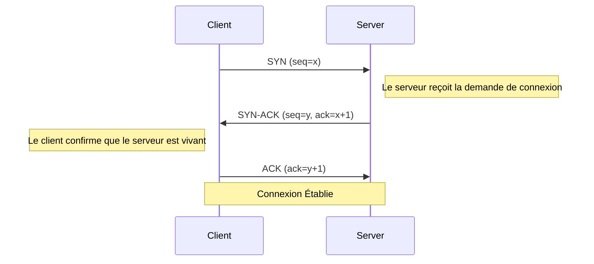
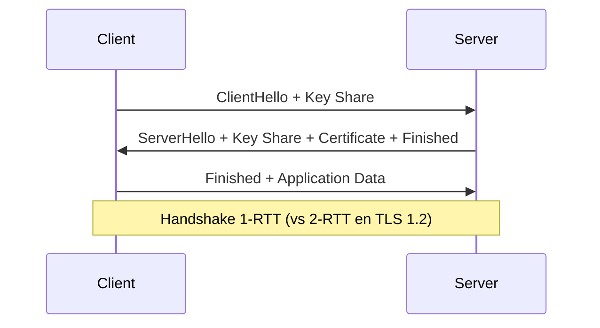

# Architecture Web : De l'URL à la Page

`#network` `#dns` `#http3` `#quic`

Comprendre le parcours complet d'une requête web, de la saisie d'une URL au rendu d'une page.

---

## Phase 1 : Résolution DNS

Quand vous tapez `https://example.com`, votre navigateur doit d'abord résoudre le domaine en adresse IP.

### Hiérarchie de Cache

```
Browser Cache → OS Cache → Router Cache → ISP Resolver → Root DNS
     ↓              ↓            ↓              ↓             ↓
   (ms)          (ms)         (ms)          (10-50ms)    (100ms+)
```

1. **Browser Cache** - Chrome/Firefox stocke les recherches récentes (~60s TTL)
2. **OS Cache** - Résolveur système (`/etc/hosts`, systemd-resolved)
3. **Router Cache** - Cache DNS du réseau local
4. **ISP Recursive Resolver** - Serveur DNS de votre FAI
5. **Authoritative DNS** - Le nameserver réel du domaine

### Résolution Récursive

```
Client → Resolver → Root (.) → TLD (.com) → Authoritative (example.com)
                  ←──────────── Adresse IP ────────────────┘
```

!!! tip "Déboguer DNS"
    ```bash
    # Trace complète de la résolution DNS
    dig +trace example.com

    # Recherche simple
    nslookup example.com

    # Interroger un serveur DNS spécifique
    dig @8.8.8.8 example.com

    # Vérifier la propagation DNS
    dig +short example.com @1.1.1.1
    dig +short example.com @8.8.8.8
    ```

---

## Phase 2 : La Connexion (TCP & TLS)

### Handshake TCP en Trois Temps



**Round trips :** 1.5 RTT avant que des données puissent être envoyées.

### Handshake TLS 1.3

TLS 1.3 réduit significativement la latence par rapport à TLS 1.2 :



**Améliorations clés dans TLS 1.3 :**

- **Handshake 1-RTT** (réduit de 2-RTT)
- **Reprise 0-RTT** pour les connexions répétées
- **Suppression des ciphers faibles** (RC4, 3DES, SHA-1)
- **Forward secrecy obligatoire**

### SNI (Server Name Indication)

!!! info "Pourquoi SNI est important"
    SNI permet d'avoir plusieurs sites HTTPS sur une seule adresse IP.
    Le client envoie le nom d'hôte dans le handshake TLS (non chiffré en TLS 1.2).

    **Problème de confidentialité :** Les FAI peuvent voir quels sites vous visitez via SNI.
    **Solution :** Encrypted Client Hello (ECH) dans les extensions TLS 1.3.

---

## Phase 3 : Évolution HTTP

=== "HTTP/1.1"

    **Sortie :** 1997

    ```
    GET /index.html HTTP/1.1
    Host: example.com
    Connection: keep-alive
    ```

    **Caractéristiques :**

    - Protocole texte (lisible par humain)
    - Une requête par connexion TCP (ou pipelining)
    - **Blocage head-of-line** - les requêtes attendent en file
    - Plusieurs connexions TCP nécessaires pour le parallélisme (6 par domaine)
    - Pas de compression des headers

    **Limitations :**
    ```
    Requête 1 ████████░░░░░░░░ (en attente)
    Requête 2 ░░░░░░░░████████ (bloquée)
    ```

=== "HTTP/2"

    **Sortie :** 2015

    **Caractéristiques :**

    - **Protocole binaire** (parsing efficace)
    - **Multiplexing** - plusieurs streams sur une seule connexion TCP
    - **Compression des headers** (HPACK)
    - **Server push** (envoi préventif de ressources)
    - **Priorisation des streams**

    **Visualisation du multiplexing :**
    ```
    Stream 1 ██░░██░░██
    Stream 2 ░░██░░██░░  → Connexion TCP Unique
    Stream 3 ██░░░░██░░
    ```

    **Problème restant :** Blocage head-of-line au niveau TCP lors de perte de paquets.

=== "HTTP/3 (QUIC)"

    **Sortie :** 2022

    **Caractéristiques :**

    - **Basé sur UDP** (pas de handshake TCP)
    - **TLS 1.3 intégré** (0-RTT possible)
    - **Streams indépendants** - la perte de paquets ne bloque pas les autres streams
    - **Migration de connexion** (survit aux changements d'IP)
    - **Contrôle de congestion amélioré**

    **Avantage clé :**
    ```
    Stream 1 ██░░██░░██  ← Paquet perdu, seul Stream 1 affecté
    Stream 2 ░░██░░██░░  ← Continue normalement
    Stream 3 ██░░░░██░░  ← Continue normalement
    ```

    **Établissement de connexion :**
    ```
    HTTP/1.1: TCP (1.5 RTT) + TLS (2 RTT) = 3.5 RTT
    HTTP/2:   TCP (1.5 RTT) + TLS (1 RTT) = 2.5 RTT
    HTTP/3:   QUIC+TLS (1 RTT) = 1 RTT (0-RTT pour reprise)
    ```

---

## Comparaison des Protocoles

| Protocole | Transport | Encryption | Multiplexing | Fonctionnalité Clé |
|----------|-----------|------------|--------------|-------------|
| HTTP/1.1 | TCP | Optionnel (HTTPS) | Non | Simple, texte |
| HTTP/2 | TCP | Pratiquement requis | Oui | Binaire, streams multiplexés |
| HTTP/3 | UDP (QUIC) | Obligatoire (intégré) | Oui | Pas de blocage head-of-line |

---

## Outils de Débogage

```bash
# Vérifier le support de version HTTP
curl -I --http2 https://example.com
curl -I --http3 https://example.com  # nécessite curl 7.66+

# Voir le handshake TLS
openssl s_client -connect example.com:443 -servername example.com

# Vérifier les protocoles supportés
nmap --script ssl-enum-ciphers -p 443 example.com
```

!!! warning "Adoption HTTP/3"
    Tous les clients/serveurs ne supportent pas encore HTTP/3. Assurez-vous toujours qu'un fallback HTTP/2 est disponible.
