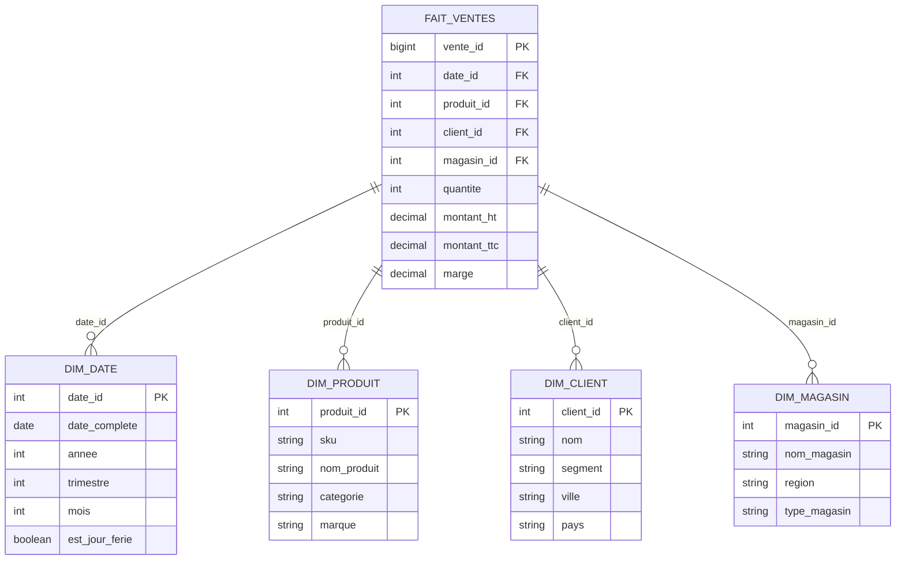

---
tags:
  - databases
  - data
  - bi
  - warehousing
---

# Concepts Data & Business Intelligence

Avant de manipuler des Big Data, il faut comprendre l'architecture qui permet de transformer la donnée brute en information décisionnelle.

## 1. OLTP vs OLAP

La distinction fondamentale en gestion de données.

| Caractéristique | OLTP (Online Transaction Processing) | OLAP (Online Analytical Processing) |
|-----------------|--------------------------------------|-------------------------------------|
| **Objectif** | Gérer l'opérationnel au quotidien | Analyser, décider, prévoir |
| **Opérations** | Beaucoup de petites lectures/écritures rapides (INSERT/UPDATE) | Grosses lectures complexes (SELECT SUM...) |
| **Données** | Actuelles, détaillées, normalisées | Historisées, agrégées, dénormalisées |
| **Volume par transaction** | Petites requêtes (<100 lignes) | Analyses massives (millions de lignes) |
| **Utilisateurs** | Milliers d'utilisateurs concurrents | Centaines d'analystes |
| **Temps de réponse** | Millisecondes | Secondes à minutes |
| **Normalisation** | 3ème Forme Normale (3NF) | Schéma en étoile/flocon |
| **Index** | B-Tree sur clés primaires/étrangères | Colonnar, Bitmap, Partitions |
| **Exemple** | Site E-commerce (Panier, Paiement) | Tableau de bord des ventes par région |
| **Technologies** | PostgreSQL, MySQL, MongoDB | Snowflake, BigQuery, Redshift, ClickHouse |

### Exemples concrets

**OLTP** : Insérer une commande dans le système
```sql
INSERT INTO commandes (client_id, date_commande, montant)
VALUES (42, '2025-12-08', 149.99);
```

**OLAP** : Analyser les ventes par trimestre
```sql
SELECT
    DATE_TRUNC('quarter', date_commande) AS trimestre,
    SUM(montant) AS ca_total,
    COUNT(*) AS nb_commandes
FROM commandes
WHERE date_commande >= '2024-01-01'
GROUP BY trimestre
ORDER BY trimestre;
```

## 2. L'Entrepôt de Données (Data Warehouse)

C'est le cerveau de la BI. Il centralise toutes les données de l'entreprise (CRM, ERP, Site Web, Logs).
*   **Historisé** : On ne supprime jamais rien (contrairement à la prod qui efface les vieux paniers).
*   **Non-Volatile** : Une fois écrite, la donnée ne change plus.
*   **Orienté Sujet** : Organisé par thème (Ventes, Clients) et non par application.

### Architecture en couches

```
┌─────────────────────────────────────────────────────────┐
│  COUCHE PRÉSENTATION (Presentation Layer)               │
│  - Data Marts métiers (Ventes, Marketing, RH)          │
│  - Cubes OLAP pour analyses rapides                     │
└─────────────────────────────────────────────────────────┘
                          ↑
┌─────────────────────────────────────────────────────────┐
│  COUCHE INTÉGRATION (Integration Layer)                 │
│  - Modèles dimensionnels (Star/Snowflake)              │
│  - Tables de faits et dimensions                        │
└─────────────────────────────────────────────────────────┘
                          ↑
┌─────────────────────────────────────────────────────────┐
│  COUCHE STAGING (Staging Layer)                         │
│  - Données brutes copiées depuis les sources            │
│  - Zone temporaire pour transformation                  │
└─────────────────────────────────────────────────────────┘
                          ↑
┌─────────────────────────────────────────────────────────┐
│  SOURCES DE DONNÉES                                      │
│  - ERP, CRM, Logs, API, Fichiers plats                 │
└─────────────────────────────────────────────────────────┘
```

### Data Mart
Un sous-ensemble du Data Warehouse, spécialisé pour un métier précis (ex: Data Mart Marketing, Data Mart RH).

## 3. Schéma en Étoile (Star Schema)

Le plus simple et le plus performant pour les requêtes analytiques.

### Exemple SQL : E-commerce

```sql
-- TABLE DE FAITS : Ventes
CREATE TABLE fait_ventes (
    vente_id BIGSERIAL PRIMARY KEY,
    date_id INT NOT NULL,
    produit_id INT NOT NULL,
    client_id INT NOT NULL,
    magasin_id INT NOT NULL,
    quantite INT NOT NULL,
    montant_ht DECIMAL(10,2) NOT NULL,
    montant_ttc DECIMAL(10,2) NOT NULL,
    marge DECIMAL(10,2),
    FOREIGN KEY (date_id) REFERENCES dim_date(date_id),
    FOREIGN KEY (produit_id) REFERENCES dim_produit(produit_id),
    FOREIGN KEY (client_id) REFERENCES dim_client(client_id),
    FOREIGN KEY (magasin_id) REFERENCES dim_magasin(magasin_id)
);

-- DIMENSION : Date
CREATE TABLE dim_date (
    date_id INT PRIMARY KEY,
    date_complete DATE NOT NULL,
    annee INT NOT NULL,
    trimestre INT NOT NULL,
    mois INT NOT NULL,
    mois_nom VARCHAR(20),
    semaine INT NOT NULL,
    jour_semaine INT NOT NULL,
    jour_semaine_nom VARCHAR(20),
    est_jour_ferie BOOLEAN DEFAULT FALSE,
    est_weekend BOOLEAN DEFAULT FALSE
);

-- DIMENSION : Produit
CREATE TABLE dim_produit (
    produit_id INT PRIMARY KEY,
    sku VARCHAR(50) UNIQUE NOT NULL,
    nom_produit VARCHAR(200) NOT NULL,
    categorie VARCHAR(100),
    sous_categorie VARCHAR(100),
    marque VARCHAR(100),
    prix_unitaire DECIMAL(10,2)
);

-- DIMENSION : Client
CREATE TABLE dim_client (
    client_id INT PRIMARY KEY,
    nom VARCHAR(100),
    prenom VARCHAR(100),
    email VARCHAR(200),
    segment VARCHAR(50), -- VIP, Standard, Prospect
    ville VARCHAR(100),
    region VARCHAR(100),
    pays VARCHAR(100),
    date_premiere_commande DATE
);

-- DIMENSION : Magasin
CREATE TABLE dim_magasin (
    magasin_id INT PRIMARY KEY,
    nom_magasin VARCHAR(100),
    ville VARCHAR(100),
    region VARCHAR(100),
    type_magasin VARCHAR(50), -- Physique, Online
    surface_m2 INT
);
```

### Visualisation Mermaid



## 4. Schéma en Flocon (Snowflake Schema)

Les dimensions sont normalisées, créant une structure hiérarchique.

### Exemple SQL : Normalisation de la dimension Produit

```sql
-- Dimension Produit (normalisée)
CREATE TABLE dim_produit (
    produit_id INT PRIMARY KEY,
    sku VARCHAR(50) UNIQUE NOT NULL,
    nom_produit VARCHAR(200) NOT NULL,
    sous_categorie_id INT NOT NULL,
    marque_id INT NOT NULL,
    prix_unitaire DECIMAL(10,2),
    FOREIGN KEY (sous_categorie_id) REFERENCES dim_sous_categorie(sous_categorie_id),
    FOREIGN KEY (marque_id) REFERENCES dim_marque(marque_id)
);

-- Sous-dimension : Sous-catégorie
CREATE TABLE dim_sous_categorie (
    sous_categorie_id INT PRIMARY KEY,
    nom_sous_categorie VARCHAR(100),
    categorie_id INT NOT NULL,
    FOREIGN KEY (categorie_id) REFERENCES dim_categorie(categorie_id)
);

-- Sous-dimension : Catégorie
CREATE TABLE dim_categorie (
    categorie_id INT PRIMARY KEY,
    nom_categorie VARCHAR(100)
);

-- Sous-dimension : Marque
CREATE TABLE dim_marque (
    marque_id INT PRIMARY KEY,
    nom_marque VARCHAR(100),
    pays_origine VARCHAR(100)
);
```

### Comparaison Star vs Snowflake

| Critère | Star Schema | Snowflake Schema |
|---------|-------------|------------------|
| **Structure** | Dimensions dénormalisées | Dimensions normalisées (3NF) |
| **Jointures** | Peu (1 seule pour chaque dimension) | Nombreuses (chaînes de jointures) |
| **Performances** | Très rapides pour les requêtes | Plus lentes (multiples JOIN) |
| **Stockage** | Plus d'espace (redondance) | Moins d'espace (pas de doublons) |
| **Maintenance** | Simple à comprendre et maintenir | Complexe (hiérarchies multiples) |
| **Usage recommandé** | **BI moderne (90% des cas)** | Legacy, contraintes de stockage extrêmes |

**Verdict** : Privilégiez le Star Schema. Le stockage est devenu peu coûteux, mais le temps CPU reste précieux.

## 5. ETL vs ELT

### ETL (Extract, Transform, Load)

**Flux classique** : Transformation avant chargement

```
Sources → [Outil ETL: Talend, Informatica] → Transformation → Data Warehouse
```

1.  **Extract** : On aspire les données des sources (Bases de prod, API, Fichiers CSV).
2.  **Transform** : Le gros du travail.
    *   Nettoyage (Supprimer les doublons, corriger les fautes).
    *   Standardisation (Convertir "F", "Femme", "Female" → "F").
    *   Anonymisation (RGPD).
3.  **Load** : On charge la donnée propre dans le Data Warehouse.

**Avantages** : Données déjà propres, moins de charge sur le DW.
**Inconvénients** : Processus lent, difficile à déboguer.

### ELT (Extract, Load, Transform)

**Flux moderne** : Transformation après chargement

```
Sources → [Fivetran, Airbyte] → Data Lake/Warehouse → [dbt, SQL] → Transformation
```

1.  **Extract** : Aspiration des données brutes.
2.  **Load** : Chargement immédiat dans le Cloud (S3, BigQuery).
3.  **Transform** : Transformation via SQL sur le DW lui-même (dbt).

**Avantages** : Plus rapide, flexible, versionnable (Git).
**Inconvénients** : Nécessite un DW puissant (Cloud).

### Quand utiliser quoi ?

| Contexte | Choix |
|----------|-------|
| Cloud Data Warehouse moderne (Snowflake, BigQuery) | **ELT** |
| Données sensibles nécessitant anonymisation avant stockage | **ETL** |
| Transformations complexes (ML, algorithmes custom) | **ETL** |
| Agilité, itérations rapides, équipe SQL | **ELT** |

## 6. Modern Data Stack

L'écosystème actuel privilégie l'agilité et le SQL.

```
┌──────────────────────────────────────────────────────┐
│  VISUALISATION                                        │
│  Power BI, Tableau, Metabase, Superset, Looker      │
└──────────────────────────────────────────────────────┘
                       ↑
┌──────────────────────────────────────────────────────┐
│  TRANSFORMATION (ELT)                                 │
│  dbt (Data Build Tool) - SQL as Code                 │
└──────────────────────────────────────────────────────┘
                       ↑
┌──────────────────────────────────────────────────────┐
│  DATA WAREHOUSE                                       │
│  Snowflake, BigQuery, Redshift, Databricks          │
└──────────────────────────────────────────────────────┘
                       ↑
┌──────────────────────────────────────────────────────┐
│  ORCHESTRATION                                        │
│  Airflow, Prefect, Dagster                          │
└──────────────────────────────────────────────────────┘
                       ↑
┌──────────────────────────────────────────────────────┐
│  INGESTION                                            │
│  Fivetran, Airbyte, Stitch (connecteurs no-code)    │
└──────────────────────────────────────────────────────┘
```

### Outils phares

*   **dbt** : Transforme les données via SQL versionné (Git). Génère la documentation automatiquement.
*   **Airflow** : Orchestre les pipelines (DAGs). Gère les dépendances et les réessais.
*   **Fivetran** : Connecteurs no-code vers 200+ sources (Salesforce, Stripe, Google Ads).

## 7. Data Lake vs Data Warehouse

| Critère | Data Lake | Data Warehouse |
|---------|-----------|----------------|
| **Type de données** | Brutes, non structurées (logs, JSON, images) | Structurées, nettoyées |
| **Schéma** | Schema-on-Read (défini à la lecture) | Schema-on-Write (défini à l'écriture) |
| **Utilisateurs** | Data Scientists, ML Engineers | Analystes Business, Décideurs |
| **Technologie** | S3, Azure Data Lake, HDFS | Snowflake, BigQuery, Redshift |
| **Coût** | Très faible (stockage objet) | Modéré à élevé |
| **Cas d'usage** | Exploration, Machine Learning, Archive | Reporting, Dashboards, KPIs |
| **Format** | Parquet, Avro, JSON, CSV | Tables SQL optimisées (Colonnar) |

**Architecture moderne** : Les deux coexistent. Le Data Lake stocke tout en brut, le Data Warehouse expose les données prêtes à l'analyse.

```
Data Lake (S3) → ETL/ELT → Data Warehouse → BI Tools
```

## 8. Exemples pratiques de requêtes SQL

### Requête sur Star Schema : CA par catégorie et trimestre

```sql
SELECT
    p.categorie,
    d.annee,
    d.trimestre,
    SUM(v.montant_ttc) AS ca_total,
    SUM(v.marge) AS marge_totale,
    COUNT(DISTINCT v.client_id) AS nb_clients_uniques,
    AVG(v.montant_ttc) AS panier_moyen
FROM fait_ventes v
JOIN dim_produit p ON v.produit_id = p.produit_id
JOIN dim_date d ON v.date_id = d.date_id
WHERE d.annee = 2024
GROUP BY p.categorie, d.annee, d.trimestre
ORDER BY ca_total DESC;
```

### Analyse des clients VIP par région

```sql
SELECT
    c.region,
    COUNT(DISTINCT c.client_id) AS nb_clients_vip,
    SUM(v.montant_ttc) AS ca_total,
    AVG(v.montant_ttc) AS panier_moyen
FROM fait_ventes v
JOIN dim_client c ON v.client_id = c.client_id
WHERE c.segment = 'VIP'
GROUP BY c.region
HAVING SUM(v.montant_ttc) > 100000
ORDER BY ca_total DESC;
```

### Top 10 produits les plus vendus les jours fériés

```sql
SELECT
    p.nom_produit,
    p.categorie,
    SUM(v.quantite) AS quantite_totale,
    SUM(v.montant_ttc) AS ca_total
FROM fait_ventes v
JOIN dim_produit p ON v.produit_id = p.produit_id
JOIN dim_date d ON v.date_id = d.date_id
WHERE d.est_jour_ferie = TRUE
GROUP BY p.produit_id, p.nom_produit, p.categorie
ORDER BY quantite_totale DESC
LIMIT 10;
```

## 9. Outils de visualisation (BI Tools)

### Comparaison des solutions

| Outil | Type | Coût | Usage |
|-------|------|------|-------|
| **Power BI** | Commercial (Microsoft) | 10-20€/user/mois | Écosystème Microsoft, intégration Office |
| **Tableau** | Commercial (Salesforce) | 70-150€/user/mois | Visualisations avancées, grande entreprise |
| **Metabase** | Open Source | Gratuit (self-hosted) | PME, startups, simplicité |
| **Apache Superset** | Open Source | Gratuit (self-hosted) | Personnalisable, riche en connecteurs |
| **Looker** | Commercial (Google) | ~2000€/mois | Moderne, LookML (code-first), intégré BigQuery |
| **Redash** | Open Source | Gratuit (self-hosted) | Simple, SQL-first, alertes par email |

### Critères de choix

*   **Budget** : Open Source (Metabase, Superset) ou Commercial (Power BI).
*   **Compétences SQL** : Élevées → Metabase, Redash. Faibles → Power BI (interface drag-and-drop).
*   **Écosystème** : Déjà sur Google Cloud → Looker. Microsoft 365 → Power BI.
*   **Volume de données** : < 1M lignes → tout fonctionne. > 100M lignes → solution native Cloud (Looker, Tableau Cloud).

## 10. Bonnes pratiques

### Performance

*   **Partitionnement** : Partitionner les tables de faits par date (une partition par mois/année).
*   **Index** : Créer des index sur les clés étrangères des dimensions.
*   **Agrégations pré-calculées** : Créer des tables de rollup (agrégations mensuelles/annuelles).

### Gouvernance des données

*   **Data Catalog** : Documenter chaque table et colonne (outils : dbt docs, DataHub, Alation).
*   **Lineage** : Tracer l'origine et les transformations de chaque donnée.
*   **Qualité** : Tests automatiques (Great Expectations, dbt tests).

### Sécurité

*   **Masquage dynamique** : Cacher les données sensibles (emails, IBAN) pour les non-habilités.
*   **Row-Level Security** : Filtrer automatiquement les lignes selon l'utilisateur (un manager ne voit que son équipe).

---

**Ressources complémentaires** :

*   [The Data Warehouse Toolkit](https://www.kimballgroup.com/) - Ralph Kimball (Bible de la modélisation dimensionnelle).
*   [dbt Documentation](https://docs.getdbt.com/) - Apprendre l'ELT moderne.
*   [Modern Data Stack](https://www.moderndatastack.xyz/) - Panorama des outils actuels.
