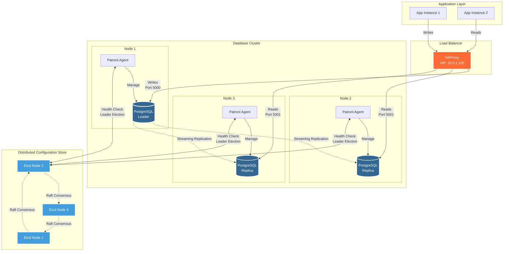
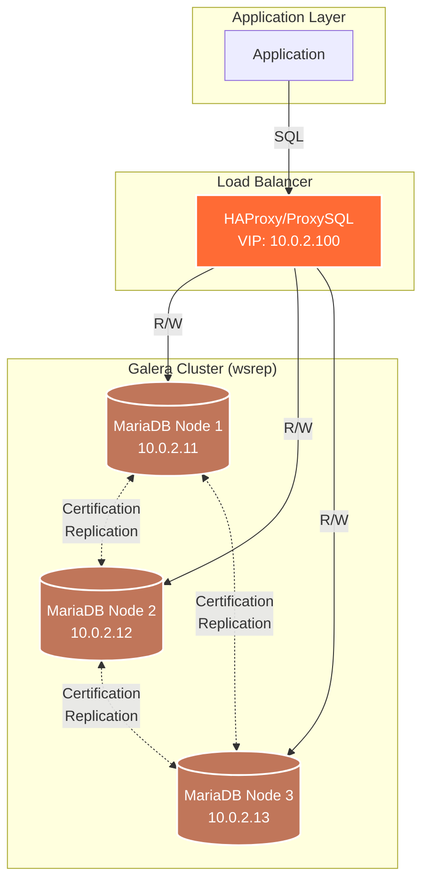
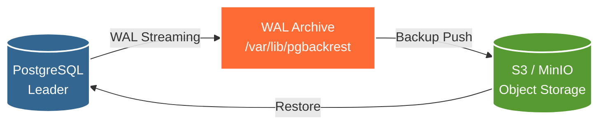

---
tags:
  - postgresql
  - mariadb
  - patroni
  - galera
  - ha
  - pitr
---

# Database High Availability: Patroni & Galera

Transformer la couche de données en service résilient. Failover automatique et zéro perte de données.


---

## Théorie : HA vs DR

### Deux Concepts Distincts et Complémentaires

```
┌─────────────────────────────────────────────────────────────┐
│                  HA (HIGH AVAILABILITY)                      │
├─────────────────────────────────────────────────────────────┤
│                                                              │
│  Objectif : Continuité de service en cas de panne matérielle│
│                                                              │
│  Scénario :                                                 │
│  1. Le serveur DB principal (Leader) tombe en panne        │
│  2. Détection automatique (health check échoue)            │
│  3. Promotion automatique d'un Replica en Leader           │
│  4. L'application continue de fonctionner                   │
│  5. Downtime : 30 secondes max (temps de bascule)          │
│                                                              │
│  Solutions : Patroni (PostgreSQL), Galera (MariaDB)         │
│                                                              │
├─────────────────────────────────────────────────────────────┤
│                  DR (DISASTER RECOVERY)                      │
├─────────────────────────────────────────────────────────────┤
│                                                              │
│  Objectif : Restauration après corruption/suppression       │
│                                                              │
│  Scénario :                                                 │
│  1. Un développeur exécute "DROP TABLE users;" en prod     │
│  2. La commande se réplique sur TOUS les nœuds (HA)        │
│  3. Les backups sont la SEULE solution                     │
│  4. Restauration PITR à 5 minutes avant la catastrophe     │
│  5. Downtime : 15-60 minutes (restauration manuelle)       │
│                                                              │
│  Solutions : pgBackRest, WAL-G, Barman                      │
│                                                              │
└─────────────────────────────────────────────────────────────┘
```

**Principe fondamental :**

> **HA ne protège PAS contre les erreurs humaines. HA + DR sont obligatoires en production.**

| Type de Panne | HA (Patroni/Galera) | DR (Backups/PITR) |
|---------------|---------------------|-------------------|
| **Serveur crash** | ✅ Failover automatique (30s) | ❌ Trop lent (15-60min) |
| **Corruption disque** | ✅ Basculer sur replica sain | ❌ Si tous corrompus |
| **DROP TABLE accidentel** | ❌ Se réplique partout | ✅ Restauration PITR |
| **Ransomware** | ❌ Chiffre tous les nœuds | ✅ Backups offline |
| **Data center détruit** | ✅ Si multi-DC | ✅ Backups distant |

### Le Problème du Split-Brain

```
┌─────────────────────────────────────────────────────────────┐
│                  SPLIT-BRAIN SCENARIO                        │
├─────────────────────────────────────────────────────────────┤
│                                                              │
│  1. Cluster 3 nœuds : Leader (A) + Replica (B) + Replica (C)│
│  2. Panne réseau : A isolé de B+C                           │
│  3. A pense : "B et C sont morts, je reste Leader"          │
│  4. B+C pensent : "A est mort, promouvons B en Leader"      │
│  5. Résultat : 2 Leaders simultanés (CATASTROPHE)           │
│  6. Les applications écrivent sur A ET sur B                │
│  7. Divergence des données (impossible à réconcilier)       │
│                                                              │
│  Solution : QUORUM (majorité stricte)                       │
│                                                              │
│  Cluster 3 nœuds :                                          │
│  - A isolé (1/3) → Ne peut pas obtenir le quorum → Se tue  │
│  - B+C ensemble (2/3) → Ont le quorum → B devient Leader   │
│                                                              │
│  Règle : Nombre de nœuds IMPAIR (3, 5, 7)                  │
│                                                              │
└─────────────────────────────────────────────────────────────┘
```

!!! danger "Split-Brain = Corruption Garantie"
    Sans mécanisme de quorum, vous ALLEZ perdre des données. Les systèmes HA sans protection split-brain (anciennes versions MySQL replication, MongoDB sans replica set) sont **dangereux en production**.

    **Quorum obligatoire :**
    - PostgreSQL : Etcd/Consul avec 3+ membres
    - MariaDB : Galera avec 3+ nœuds (wsrep_cluster_size)
    - MongoDB : Replica Set avec 3+ membres

**Calcul du quorum :**

| Nombre de nœuds | Quorum | Nœuds tolérés en panne |
|-----------------|--------|------------------------|
| 1 | 1 | 0 ❌ (SPOF) |
| 2 | 2 | 0 ❌ (inutile) |
| 3 | 2 | 1 ✅ (minimum production) |
| 5 | 3 | 2 ✅ (multi-DC) |
| 7 | 4 | 3 ✅ (large scale) |

**Recommandation :** 3 nœuds en production (compromis coût/résilience).

---

## PostgreSQL HA : Le Standard (Patroni)

### Architecture : Patroni + Etcd + HAProxy



### Pourquoi Patroni ?

**Patroni = Orchestrateur PostgreSQL qui gère le failover automatique mieux que tout le reste.**

**Comparaison des solutions PostgreSQL HA :**

| Solution | Failover Auto | Fencing | Split-Brain Protection | Complexité |
|----------|---------------|---------|------------------------|------------|
| **Patroni** | ✅ Automatique | ✅ Oui | ✅ Quorum Etcd/Consul | Moyenne |
| **Repmgr** | ⚠️ Semi-auto | ❌ Non | ⚠️ Witness node | Moyenne |
| **Pacemaker/Corosync** | ✅ Automatique | ✅ STONITH | ✅ Quorum | Élevée |
| **Streaming Replication manuelle** | ❌ Manuel | ❌ Non | ❌ Non | Faible |
| **pgpool-II** | ✅ Automatique | ❌ Non | ⚠️ Watchdog | Moyenne |

**Avantages Patroni :**
- ✅ **Fencing automatique** : Tue l'ancien Leader avant de promouvoir un Replica (évite split-brain)
- ✅ **Réinitialisation automatique** : Un nœud défaillant se re-synchronise automatiquement
- ✅ **REST API** : Intégration facile avec Kubernetes, monitoring, scripts
- ✅ **Configuration dynamique** : Modification de `postgresql.conf` sans redémarrage manuel
- ✅ **Communauté active** : Utilisé par Zalando (créateur), GitLab, Criteo

### Composants de l'Architecture

#### 1. Etcd/Consul (DCS - Distributed Configuration Store)

**La source de vérité pour le cluster.**

| Rôle | Description |
|------|-------------|
| **Leader Lock** | Un seul nœud peut obtenir le "leader lock" à la fois |
| **Configuration** | Stocke la config PostgreSQL (patroni.yml) |
| **Health Status** | Chaque Patroni enregistre son état (healthy/unhealthy) |
| **Timeline** | Historique des promotions/failovers |

**Installation Etcd :**

```bash
# Télécharger Etcd
ETCD_VER=v3.5.11
wget https://github.com/etcd-io/etcd/releases/download/${ETCD_VER}/etcd-${ETCD_VER}-linux-amd64.tar.gz
tar xzf etcd-${ETCD_VER}-linux-amd64.tar.gz
sudo mv etcd-${ETCD_VER}-linux-amd64/etcd* /usr/local/bin/

# Créer le service systemd
sudo cat > /etc/systemd/system/etcd.service <<EOF
[Unit]
Description=Etcd Server
After=network.target

[Service]
Type=notify
ExecStart=/usr/local/bin/etcd \\
  --name etcd1 \\
  --data-dir /var/lib/etcd \\
  --listen-client-urls http://10.0.1.11:2379,http://127.0.0.1:2379 \\
  --advertise-client-urls http://10.0.1.11:2379 \\
  --listen-peer-urls http://10.0.1.11:2380 \\
  --initial-advertise-peer-urls http://10.0.1.11:2380 \\
  --initial-cluster etcd1=http://10.0.1.11:2380,etcd2=http://10.0.1.12:2380,etcd3=http://10.0.1.13:2380 \\
  --initial-cluster-state new
Restart=always
RestartSec=10s

[Install]
WantedBy=multi-user.target
EOF

# Démarrer Etcd
sudo systemctl daemon-reload
sudo systemctl enable --now etcd

# Vérifier le cluster
etcdctl member list
etcdctl endpoint health
```

#### 2. Patroni Agent (Sidecar sur chaque nœud)

**Installation :**

```bash
# Installer Patroni (Python)
sudo dnf install -y python3-pip python3-psycopg2  # RHEL/Rocky
# sudo apt install -y python3-pip python3-psycopg2  # Debian/Ubuntu
sudo pip3 install patroni[etcd]

# Créer le fichier de configuration
sudo mkdir -p /etc/patroni
sudo cat > /etc/patroni/patroni.yml <<EOF
scope: postgres-cluster
namespace: /db/
name: node1

restapi:
  listen: 10.0.1.21:8008
  connect_address: 10.0.1.21:8008

etcd:
  hosts: 10.0.1.11:2379,10.0.1.12:2379,10.0.1.13:2379

bootstrap:
  dcs:
    ttl: 30
    loop_wait: 10
    retry_timeout: 10
    maximum_lag_on_failover: 1048576
    postgresql:
      use_pg_rewind: true
      parameters:
        max_connections: 200
        shared_buffers: 256MB
        effective_cache_size: 1GB
        wal_level: replica
        max_wal_senders: 10
        max_replication_slots: 10
        hot_standby: on

  initdb:
    - encoding: UTF8
    - data-checksums

  pg_hba:
    - host replication replicator 10.0.1.0/24 md5
    - host all all 10.0.1.0/24 md5
    - host all all 0.0.0.0/0 reject

postgresql:
  listen: 10.0.1.21:5432
  connect_address: 10.0.1.21:5432
  data_dir: /var/lib/postgresql/15/main
  bin_dir: /usr/lib/postgresql/15/bin
  authentication:
    replication:
      username: replicator
      password: rep_password_change_me
    superuser:
      username: postgres
      password: super_password_change_me

tags:
  nofailover: false
  noloadbalance: false
  clonefrom: false
  nosync: false
EOF

# Créer le service systemd
sudo cat > /etc/systemd/system/patroni.service <<EOF
[Unit]
Description=Patroni (PostgreSQL HA)
After=network.target

[Service]
Type=simple
User=postgres
Group=postgres
ExecStart=/usr/local/bin/patroni /etc/patroni/patroni.yml
Restart=always
RestartSec=10s

[Install]
WantedBy=multi-user.target
EOF

# Démarrer Patroni
sudo systemctl daemon-reload
sudo systemctl enable --now patroni
```

**Vérifier l'état du cluster :**

```bash
# Lister les membres
patronictl -c /etc/patroni/patroni.yml list

# Output attendu :
# + Cluster: postgres-cluster (7123456789012345678) ----+----+-----------+
# | Member | Host        | Role    | State   | TL | Lag in MB |
# +--------+-------------+---------+---------+----+-----------+
# | node1  | 10.0.1.21   | Leader  | running |  1 |           |
# | node2  | 10.0.1.22   | Replica | running |  1 |         0 |
# | node3  | 10.0.1.23   | Replica | running |  1 |         0 |
# +--------+-------------+---------+---------+----+-----------+
```

#### 3. HAProxy (Routage Intelligent)

**Configuration HAProxy pour Patroni :**

```bash
# /etc/haproxy/haproxy.cfg
global
    maxconn 1000
    log /dev/log local0

defaults
    log global
    mode tcp
    timeout connect 10s
    timeout client 30s
    timeout server 30s

# Frontend pour les écritures (Leader uniquement)
listen postgres_write
    bind *:5000
    option httpchk
    http-check expect status 200
    default-server inter 3s fall 3 rise 2 on-marked-down shutdown-sessions
    server node1 10.0.1.21:5432 maxconn 100 check port 8008
    server node2 10.0.1.22:5432 maxconn 100 check port 8008
    server node3 10.0.1.23:5432 maxconn 100 check port 8008

# Frontend pour les lectures (Replicas uniquement)
listen postgres_read
    bind *:5001
    option httpchk GET /replica
    http-check expect status 200
    default-server inter 3s fall 3 rise 2
    server node1 10.0.1.21:5432 maxconn 100 check port 8008
    server node2 10.0.1.22:5432 maxconn 100 check port 8008
    server node3 10.0.1.23:5432 maxconn 100 check port 8008

# Stats
listen stats
    bind *:7000
    stats enable
    stats uri /
    stats refresh 5s
```

**Explication des health checks :**

| Endpoint | Rôle | Retourne 200 si |
|----------|------|-----------------|
| `GET /` | Nœud disponible | Leader OU Replica healthy |
| `GET /leader` | Leader uniquement | Ce nœud est le Leader |
| `GET /replica` | Replica uniquement | Ce nœud est un Replica (pas le Leader) |
| `GET /master` | Alias de /leader | (legacy) |
| `GET /health` | Health check simple | Patroni est vivant |

**Tester HAProxy :**

```bash
# Démarrer HAProxy
sudo systemctl restart haproxy

# Tester l'écriture (vers Leader)
psql -h haproxy-vip -p 5000 -U postgres -c "SELECT pg_is_in_recovery();"
# Output attendu : f (false = Leader)

# Tester la lecture (vers Replicas)
psql -h haproxy-vip -p 5001 -U postgres -c "SELECT pg_is_in_recovery();"
# Output attendu : t (true = Replica)
```

### Opérations Courantes

#### 1. Switchover Manuel (Maintenance)

```bash
# Basculer le Leader de node1 vers node2 (sans downtime)
patronictl -c /etc/patroni/patroni.yml switchover

# Output interactif :
# Master [node1]:
# Candidate ['node2', 'node3'] []: node2
# When should the switchover take place (e.g. 2024-01-01T12:00) [now]:
# Current cluster topology
# + Cluster: postgres-cluster (7123456789012345678) --+----+-----------+
# | Member | Host        | Role    | State   | TL | Lag in MB |
# +--------+-------------+---------+---------+----+-----------+
# | node1  | 10.0.1.21   | Leader  | running |  1 |           |
# | node2  | 10.0.1.22   | Replica | running |  1 |         0 |
# | node3  | 10.0.1.23   | Replica | running |  1 |         0 |
# +--------+-------------+---------+---------+----+-----------+
# Are you sure you want to switchover cluster postgres-cluster, demoting current master node1? [y/N]: y
# 2024-01-15 14:32:11.12345 Successfully switched over to "node2"
# + Cluster: postgres-cluster (7123456789012345678) --+----+-----------+
# | Member | Host        | Role    | State   | TL | Lag in MB |
# +--------+-------------+---------+---------+----+-----------+
# | node1  | 10.0.1.21   | Replica | running |  2 |         0 |
# | node2  | 10.0.1.22   | Leader  | running |  2 |           |
# | node3  | 10.0.1.23   | Replica | running |  2 |         0 |
# +--------+-------------+---------+---------+----+-----------+
```

**Switchover planifié :**

```bash
# Switchover à une date/heure précise (maintenance programmée)
patronictl -c /etc/patroni/patroni.yml switchover --scheduled "2024-01-15 03:00:00+00"
```

#### 2. Failover Automatique (Panne)

**Scénario : Le Leader (node1) crash**

```bash
# Simuler un crash (tuer Patroni sur node1)
sudo systemctl stop patroni  # Sur node1

# Logs sur node2/node3 (environ 30 secondes après) :
# 2024-01-15 14:32:00 INFO: Leader key released
# 2024-01-15 14:32:05 INFO: Acquiring leader lock
# 2024-01-15 14:32:06 INFO: Lock acquired, promoting to leader
# 2024-01-15 14:32:10 INFO: promoted self to leader by acquiring session lock

# Vérifier le nouveau cluster
patronictl -c /etc/patroni/patroni.yml list

# Output :
# + Cluster: postgres-cluster (7123456789012345678) --+----+-----------+
# | Member | Host        | Role    | State   | TL | Lag in MB |
# +--------+-------------+---------+---------+----+-----------+
# | node2  | 10.0.1.22   | Leader  | running |  2 |           |
# | node3  | 10.0.1.23   | Replica | running |  2 |         0 |
# +--------+-------------+---------+---------+----+-----------+
```

**Réintégration automatique de node1 :**

```bash
# Redémarrer Patroni sur node1
sudo systemctl start patroni  # Sur node1

# Patroni détecte automatiquement qu'il est "en retard" et se re-synchronise
# Logs sur node1 :
# 2024-01-15 14:35:00 INFO: Lock owner: node2; I am node1
# 2024-01-15 14:35:01 INFO: trying to bootstrap from leader 'node2'
# 2024-01-15 14:35:05 INFO: replica has been created using basebackup
# 2024-01-15 14:35:10 INFO: establishing a new patroni connection to the postgres cluster

# Vérifier le cluster (node1 réintégré comme Replica)
patronictl -c /etc/patroni/patroni.yml list

# Output :
# + Cluster: postgres-cluster (7123456789012345678) --+----+-----------+
# | Member | Host        | Role    | State   | TL | Lag in MB |
# +--------+-------------+---------+---------+----+-----------+
# | node1  | 10.0.1.21   | Replica | running |  2 |         0 |
# | node2  | 10.0.1.22   | Leader  | running |  2 |           |
# | node3  | 10.0.1.23   | Replica | running |  2 |         0 |
# +--------+-------------+---------+---------+----+-----------+
```

#### 3. Modifier la Configuration PostgreSQL

**Avantage Patroni : Configuration dynamique via Etcd (sans éditer manuellement `postgresql.conf`).**

```bash
# Modifier un paramètre (exemple : augmenter shared_buffers)
patronictl -c /etc/patroni/patroni.yml edit-config

# Éditeur s'ouvre avec la config actuelle (YAML) :
# loop_wait: 10
# maximum_lag_on_failover: 1048576
# postgresql:
#   parameters:
#     max_connections: 200
#     shared_buffers: 256MB  # ← Modifier ici
#     ...

# Sauvegarder et quitter
# Patroni redémarre PostgreSQL sur TOUS les nœuds avec la nouvelle config

# Vérifier
psql -h haproxy-vip -p 5000 -U postgres -c "SHOW shared_buffers;"
# Output : 512MB
```

#### 4. Monitoring avec l'API REST

```bash
# Status d'un nœud (JSON)
curl http://10.0.1.21:8008/

# Output :
# {
#   "state": "running",
#   "postmaster_start_time": "2024-01-15 14:00:00.123456+00:00",
#   "role": "replica",
#   "server_version": 150001,
#   "cluster_unlocked": false,
#   "timeline": 2,
#   "database_system_identifier": "7123456789012345678"
# }

# Health check pour monitoring (Prometheus, Nagios)
curl http://10.0.1.21:8008/health

# Output si OK : 200 OK
# Output si KO : 503 Service Unavailable

# Intégration Prometheus
# GET http://10.0.1.21:8008/metrics (avec postgres_exporter)
```

---

## MariaDB HA : Galera Cluster

### Concept : Réplication Synchrone Multi-Maître

**Galera = Tous les nœuds sont des "Masters" (peuvent recevoir des écritures).**

```
┌─────────────────────────────────────────────────────────────┐
│              RÉPLICATION ASYNCHRONE TRADITIONNELLE           │
├─────────────────────────────────────────────────────────────┤
│                                                              │
│  Master  →  Replica                                         │
│                                                              │
│  1. Client écrit sur Master                                 │
│  2. Master commit la transaction                            │
│  3. Master envoie le binlog au Replica (async)              │
│  4. Replica rejoue la transaction (délai ~100ms)            │
│                                                              │
│  Problème : Le Replica est toujours "en retard"             │
│             Si Master crash avant la réplication,           │
│             les dernières transactions sont PERDUES         │
│                                                              │
├─────────────────────────────────────────────────────────────┤
│              RÉPLICATION SYNCHRONE GALERA                    │
├─────────────────────────────────────────────────────────────┤
│                                                              │
│  Node1 ↔ Node2 ↔ Node3 (tous égaux)                        │
│                                                              │
│  1. Client écrit sur Node1                                  │
│  2. Node1 envoie la transaction à Node2 et Node3            │
│  3. Node2 et Node3 valident (certification)                 │
│  4. Si majorité OK → COMMIT sur les 3 nœuds                 │
│  5. Client reçoit la confirmation                           │
│                                                              │
│  Garantie : Si commit OK, la donnée est sur TOUS les nœuds  │
│             Zéro perte de données (même si Node1 crash)     │
│                                                              │
└─────────────────────────────────────────────────────────────┘
```

**Architecture Galera :**



### Installation Galera Cluster

**Prérequis :**
- MariaDB 10.5+ (Galera 4 intégré)
- Latence réseau < 5ms entre nœuds (critique pour les performances)
- Tables InnoDB uniquement (MyISAM non supporté)

```bash
# Installation MariaDB avec Galera (sur les 3 nœuds)
sudo apt update
sudo apt install -y mariadb-server mariadb-client galera-4 rsync

# Arrêter MariaDB (config avant démarrage)
sudo systemctl stop mariadb
```

**Configuration Galera (Node 1 - 10.0.2.11) :**

```bash
# /etc/mysql/mariadb.conf.d/60-galera.cnf
[mysqld]
# Bindings
bind-address = 10.0.2.11

# Galera Provider Configuration
wsrep_on = ON
wsrep_provider = /usr/lib/galera/libgalera_smm.so

# Cluster Configuration
wsrep_cluster_name = "production_cluster"
wsrep_cluster_address = "gcomm://10.0.2.11,10.0.2.12,10.0.2.13"

# Node Configuration
wsrep_node_name = "node1"
wsrep_node_address = "10.0.2.11"

# Replication Configuration
wsrep_sst_method = rsync  # Ou mariabackup (plus rapide)
wsrep_slave_threads = 4

# InnoDB Configuration (obligatoire)
default_storage_engine = InnoDB
innodb_autoinc_lock_mode = 2
innodb_flush_log_at_trx_commit = 0
innodb_buffer_pool_size = 1G

# Binlog (optionnel pour MySQL 8 compatibility)
binlog_format = ROW
```

**Configuration Node 2 et Node 3 :** Identique sauf `wsrep_node_name` et `wsrep_node_address`.

### Bootstrap : Le Démarrage Initial (DANGEREUX)

!!! danger "Bootstrap : Commande la Plus Dangereuse de Galera"
    **`galera_new_cluster` ne doit être exécuté QU'UNE SEULE FOIS au tout premier démarrage du cluster.**

    **JAMAIS EN PRODUCTION SUR UN CLUSTER EXISTANT** (risque de split-brain et perte de données).

    Si vous bootstrap alors que d'autres nœuds tournent, vous créez un nouveau cluster vide qui écrase les données existantes.

**Premier démarrage (une seule fois) :**

```bash
# Sur Node 1 UNIQUEMENT (pour initialiser le cluster)
sudo galera_new_cluster

# Vérifier que le cluster est créé
sudo mysql -u root -e "SHOW STATUS LIKE 'wsrep_cluster_size';"
# Output :
# +--------------------+-------+
# | Variable_name      | Value |
# +--------------------+-------+
# | wsrep_cluster_size | 1     |
# +--------------------+-------+

# Créer l'utilisateur de réplication
sudo mysql -u root <<EOF
CREATE USER 'replication'@'%' IDENTIFIED BY 'repl_password_change_me';
GRANT REPLICATION SLAVE ON *.* TO 'replication'@'%';
FLUSH PRIVILEGES;
EOF
```

**Démarrer les nœuds 2 et 3 (jointure automatique) :**

```bash
# Sur Node 2
sudo systemctl start mariadb

# Sur Node 3
sudo systemctl start mariadb

# Vérifier le cluster (sur n'importe quel nœud)
sudo mysql -u root -e "SHOW STATUS LIKE 'wsrep_cluster_size';"
# Output :
# +--------------------+-------+
# | Variable_name      | Value |
# +--------------------+-------+
# | wsrep_cluster_size | 3     |
# +--------------------+-------+

# Vérifier l'état de tous les membres
sudo mysql -u root -e "SHOW STATUS LIKE 'wsrep_%';" | grep -E 'cluster_status|cluster_size|ready|connected'

# Output attendu :
# wsrep_cluster_status    | Primary
# wsrep_cluster_size      | 3
# wsrep_ready             | ON
# wsrep_connected         | ON
```

### Contraintes et Limitations

**1. Tables InnoDB Obligatoires**

```sql
-- ✗ NE FONCTIONNE PAS (MyISAM non répliqué)
CREATE TABLE users (
    id INT PRIMARY KEY,
    name VARCHAR(100)
) ENGINE=MyISAM;

-- ✓ CORRECT (InnoDB uniquement)
CREATE TABLE users (
    id INT PRIMARY KEY,
    name VARCHAR(100)
) ENGINE=InnoDB;
```

**2. Latence Réseau Critique**

| Latence | Performance | Recommandation |
|---------|-------------|----------------|
| < 1ms | Excellente | LAN même datacenter ✅ |
| 1-5ms | Acceptable | LAN différents racks ⚠️ |
| 5-20ms | Dégradée | WAN même région ❌ |
| > 20ms | Inutilisable | Multi-région ❌❌❌ |

**Pourquoi ?** Galera attend le quorum avant chaque COMMIT. Si la latence est élevée, chaque transaction devient lente.

**3. Conflits de Transactions (Certification Failure)**

```sql
-- Scénario problématique :
-- Transaction 1 (Node 1) : UPDATE users SET balance = balance - 100 WHERE id = 1;
-- Transaction 2 (Node 2) : UPDATE users SET balance = balance - 50 WHERE id = 1;

-- Si les deux transactions se produisent simultanément :
-- 1. Node 1 envoie sa transaction au cluster
-- 2. Node 2 envoie sa transaction au cluster
-- 3. Galera détecte le conflit (même ligne modifiée)
-- 4. L'une des deux transactions est ROLLBACK (certification failure)
-- 5. L'application reçoit une erreur "DEADLOCK"

-- Solution : Écrire sur un seul nœud (via HAProxy) ou gérer les retry
```

### Récupération après Panne Totale (Tous les Nœuds Arrêtés)

!!! danger "Fichier grastate.dat : La Clé de la Récupération"
    **`/var/lib/mysql/grastate.dat`** contient l'état de chaque nœud. La valeur `safe_to_bootstrap` détermine quel nœud peut redémarrer le cluster.

    **NE JAMAIS éditer ce fichier sans comprendre les conséquences.**

**Scénario : Panne de courant, tous les nœuds sont arrêtés.**

```bash
# Étape 1 : Identifier le nœud le plus à jour (sur chaque nœud)
sudo cat /var/lib/mysql/grastate.dat

# Node 1 :
# # GALERA saved state
# version: 2.1
# uuid:    12345678-1234-1234-1234-123456789012
# seqno:   1234567  # ← Plus haute valeur = plus récent
# safe_to_bootstrap: 0

# Node 2 :
# seqno:   1234560  # ← Plus ancien

# Node 3 :
# seqno:   1234550  # ← Plus ancien

# Étape 2 : Marquer le nœud le plus récent comme safe_to_bootstrap
# Sur Node 1 (seqno le plus élevé)
sudo mysqld_safe --wsrep-recover

# Output :
# WSREP: Recovered position: 12345678-1234-1234-1234-123456789012:1234567

# Éditer grastate.dat (sur Node 1 uniquement)
sudo nano /var/lib/mysql/grastate.dat

# Modifier :
# safe_to_bootstrap: 1  # ← Changer 0 en 1

# Étape 3 : Bootstrap depuis Node 1
sudo galera_new_cluster

# Étape 4 : Démarrer Node 2 et Node 3 (jointure automatique)
# Sur Node 2
sudo systemctl start mariadb

# Sur Node 3
sudo systemctl start mariadb

# Vérifier le cluster
sudo mysql -u root -e "SHOW STATUS LIKE 'wsrep_cluster_size';"
# Output : 3
```

**Commandes de vérification :**

```bash
# Voir l'état du cluster
mysql -u root -e "SHOW STATUS LIKE 'wsrep_%';"

# Variables importantes :
# wsrep_cluster_status     | Primary (ou Non-Primary si problème)
# wsrep_cluster_size       | 3
# wsrep_ready              | ON
# wsrep_connected          | ON
# wsrep_local_state_comment| Synced (ou Donor, Joiner, etc.)
# wsrep_incoming_addresses | 10.0.2.11:3306,10.0.2.12:3306,10.0.2.13:3306

# Voir les événements de certification
mysql -u root -e "SHOW STATUS LIKE 'wsrep_local_cert_failures';"
# Si > 0 : Des transactions ont été rejetées (conflits)
```

---

## Disaster Recovery : PITR avec pgBackRest

### Concept : Point-in-Time Recovery

**PITR = Restaurer la base de données à une seconde précise dans le passé.**

```
┌─────────────────────────────────────────────────────────────┐
│                  SCÉNARIO CATASTROPHE                        │
├─────────────────────────────────────────────────────────────┤
│                                                              │
│  2024-01-15 14:00:00  Backup complet (nuit dernière)        │
│  2024-01-15 14:30:00  Transactions normales (WAL archivés)  │
│  2024-01-15 14:45:23  Développeur : DROP TABLE orders;      │
│  2024-01-15 14:45:24  ☠️ PANIC : 10 000 commandes perdues   │
│                                                              │
│  Solution PITR :                                            │
│  1. Restaurer le backup de 14:00:00                        │
│  2. Rejouer les WAL jusqu'à 14:45:22 (1 seconde avant DROP)│
│  3. Base de données restaurée avec toutes les commandes    │
│                                                              │
└─────────────────────────────────────────────────────────────┘
```

**Architecture pgBackRest :**



### Pourquoi pgBackRest ?

| Solution | Compression | Parallélisme | Chiffrement | S3 Natif | Restauration Partielle |
|----------|-------------|--------------|-------------|----------|------------------------|
| **pgBackRest** | ✅ Zstd/Gzip | ✅ Multi-thread | ✅ AES-256 | ✅ S3/Azure/GCS | ✅ Delta restore |
| **Barman** | ✅ Gzip | ⚠️ Limité | ⚠️ Via rclone | ⚠️ Via rclone | ❌ Non |
| **WAL-G** | ✅ Zstd/Brotli | ✅ Multi-thread | ✅ GPG | ✅ S3/Azure/GCS | ⚠️ Limitée |
| **pg_basebackup** | ❌ Non | ❌ Single-thread | ❌ Non | ❌ Non | ❌ Non |

**Avantages pgBackRest :**
- ✅ **Backup incrémental/différentiel** (seulement les blocs modifiés)
- ✅ **Parallélisme** (backup/restore multi-thread ultra-rapide)
- ✅ **Compression native** (Zstd = meilleur ratio)
- ✅ **Chiffrement S3** (AES-256 server-side)
- ✅ **Rétention automatique** (supprimer les vieux backups)

### Installation et Configuration

```bash
# Installation pgBackRest
sudo apt install -y pgbackrest

# Créer la configuration
sudo mkdir -p /var/log/pgbackrest /var/lib/pgbackrest
sudo chown -R postgres:postgres /var/log/pgbackrest /var/lib/pgbackrest

# Configuration pgBackRest
sudo cat > /etc/pgbackrest.conf <<EOF
[global]
repo1-path=/var/lib/pgbackrest
repo1-retention-full=2
repo1-retention-diff=4
repo1-cipher-type=aes-256-cbc
repo1-cipher-pass=encryption_key_change_me

# S3 (optionnel, recommandé en production)
# repo1-type=s3
# repo1-s3-bucket=my-postgres-backups
# repo1-s3-endpoint=s3.amazonaws.com
# repo1-s3-region=eu-west-1
# repo1-s3-key=AWS_ACCESS_KEY_ID
# repo1-s3-key-secret=AWS_SECRET_ACCESS_KEY

log-level-console=info
log-level-file=debug

[prod-db]
pg1-path=/var/lib/postgresql/15/main
pg1-port=5432
pg1-user=postgres
EOF

# Configuration PostgreSQL pour l'archivage WAL
sudo cat >> /etc/postgresql/15/main/postgresql.conf <<EOF
# WAL Archiving pour pgBackRest
wal_level = replica
archive_mode = on
archive_command = 'pgbackrest --stanza=prod-db archive-push %p'
max_wal_senders = 3
wal_keep_size = 1GB
EOF

# Redémarrer PostgreSQL
sudo systemctl restart postgresql

# Créer le stanza (config pgBackRest)
sudo -u postgres pgbackrest --stanza=prod-db stanza-create

# Vérifier la configuration
sudo -u postgres pgbackrest --stanza=prod-db check

# Output attendu :
# P00   INFO: check command begin
# P00   INFO: WAL segment 000000010000000000000001 successfully archived
# P00   INFO: check command end: completed successfully
```

### Backups : Full, Differential, Incremental

**Types de backups :**

| Type | Taille | Durée | Usage |
|------|--------|-------|-------|
| **Full** | 100% | ~1h (100GB) | Hebdomadaire |
| **Differential** | ~30% | ~20min | Quotidien |
| **Incremental** | ~10% | ~5min | Toutes les 4h |

```bash
# Backup Full (initial)
sudo -u postgres pgbackrest --stanza=prod-db --type=full backup

# Output :
# P00   INFO: backup command begin 2.48: --repo1-cipher-pass=<redacted> --repo1-cipher-type=aes-256-cbc
# P00   INFO: execute non-exclusive backup start: backup begins after the next regular checkpoint completes
# P00   INFO: backup start archive = 000000010000000000000002
# P01   INFO: backup file /var/lib/postgresql/15/main/base/16384/2619 (544KB, 0.4%)
# ...
# P00   INFO: new backup label = 20240115-140000F
# P00   INFO: full backup size = 10.2GB, file total = 12543
# P00   INFO: backup command end: completed successfully

# Backup Differential (basé sur le dernier Full)
sudo -u postgres pgbackrest --stanza=prod-db --type=diff backup

# Backup Incremental (basé sur le dernier Differential ou Full)
sudo -u postgres pgbackrest --stanza=prod-db --type=incr backup

# Lister les backups disponibles
sudo -u postgres pgbackrest --stanza=prod-db info

# Output :
# stanza: prod-db
#     status: ok
#     cipher: aes-256-cbc
#
#     db (current)
#         wal archive min/max (15): 000000010000000000000001/000000010000000000000005
#
#         full backup: 20240115-140000F
#             timestamp start/stop: 2024-01-15 14:00:00 / 2024-01-15 14:15:32
#             wal start/stop: 000000010000000000000002 / 000000010000000000000003
#             database size: 10.2GB, database backup size: 10.2GB
#             repo1: backup set size: 3.1GB, backup size: 3.1GB
#
#         diff backup: 20240115-140000F_20240116-020000D
#             timestamp start/stop: 2024-01-16 02:00:00 / 2024-01-16 02:08:12
#             wal start/stop: 000000010000000000000004 / 000000010000000000000005
#             database size: 10.5GB, database backup size: 512MB
#             repo1: backup set size: 3.2GB, backup size: 150MB
```

### Restauration : Point-in-Time Recovery

**Scénario : Restaurer à 1 seconde avant la catastrophe.**

```bash
# Arrêter PostgreSQL
sudo systemctl stop postgresql

# Restaurer le backup (automatiquement choisit Full + Diff + Incr + WAL)
sudo -u postgres pgbackrest --stanza=prod-db --type=time \
  --target="2024-01-15 14:45:22" \
  --delta restore

# Output :
# P00   INFO: restore command begin 2.48
# P00   INFO: restore backup set 20240115-140000F_20240116-020000D, recovery will start at 2024-01-16 02:00:00
# P01   INFO: restore file /var/lib/postgresql/15/main/base/16384/2619 (544KB, 0.4%)
# ...
# P00   INFO: write updated /var/lib/postgresql/15/main/postgresql.auto.conf
# P00   INFO: restore global/pg_control (performed last to ensure aborted restores cannot be started)
# P00   INFO: restore command end: completed successfully

# pgBackRest a créé recovery.signal et configuré postgresql.auto.conf
# Contenu de postgresql.auto.conf :
# restore_command = 'pgbackrest --stanza=prod-db archive-get %f "%p"'
# recovery_target_time = '2024-01-15 14:45:22'
# recovery_target_action = promote

# Démarrer PostgreSQL (rejoue automatiquement les WAL jusqu'au point cible)
sudo systemctl start postgresql

# Vérifier les logs PostgreSQL
sudo tail -f /var/log/postgresql/postgresql-15-main.log

# Output :
# 2024-01-15 14:50:00 UTC [12345]: LOG: starting point-in-time recovery to 2024-01-15 14:45:22+00
# 2024-01-15 14:50:05 UTC [12345]: LOG: restored log file "000000010000000000000004" from archive
# ...
# 2024-01-15 14:50:30 UTC [12345]: LOG: recovery stopping before commit of transaction 12345, time 2024-01-15 14:45:23
# 2024-01-15 14:50:31 UTC [12345]: LOG: recovery has paused
# 2024-01-15 14:50:32 UTC [12345]: LOG: selected new timeline ID: 2
# 2024-01-15 14:50:33 UTC [12345]: LOG: archive recovery complete
# 2024-01-15 14:50:34 UTC [12345]: LOG: database system is ready to accept connections

# Vérifier les données
psql -U postgres -c "SELECT COUNT(*) FROM orders;"
# Output : 10000 (toutes les commandes récupérées !)
```

**Options de restauration :**

```bash
# Restaurer au backup le plus récent (pas de PITR)
pgbackrest --stanza=prod-db restore

# Restaurer à une date/heure précise (PITR)
pgbackrest --stanza=prod-db --type=time --target="2024-01-15 14:45:22" restore

# Restaurer jusqu'à une transaction spécifique
pgbackrest --stanza=prod-db --type=xid --target="12345678" restore

# Restaurer jusqu'à un nom de point de sauvegarde
pgbackrest --stanza=prod-db --type=name --target="before_migration" restore

# Delta restore (seulement les fichiers modifiés, ultra-rapide)
pgbackrest --stanza=prod-db --delta restore
```

### Automatisation des Backups (Cron)

```bash
# /etc/cron.d/pgbackrest
# Backup Full hebdomadaire (dimanche 2h)
0 2 * * 0 postgres pgbackrest --stanza=prod-db --type=full backup

# Backup Differential quotidien (2h, sauf dimanche)
0 2 * * 1-6 postgres pgbackrest --stanza=prod-db --type=diff backup

# Backup Incremental toutes les 4h
0 */4 * * * postgres pgbackrest --stanza=prod-db --type=incr backup

# Vérification hebdomadaire (lundi 3h)
0 3 * * 1 postgres pgbackrest --stanza=prod-db check
```

---

## Référence Rapide

### Comparaison PostgreSQL vs MariaDB HA

| Critère | PostgreSQL (Patroni) | MariaDB (Galera) |
|---------|----------------------|------------------|
| **Type de réplication** | Asynchrone (streaming) | Synchrone (certification) |
| **Topology** | Leader-Replica (single writer) | Multi-Master (multi writer) |
| **Failover** | Automatique (Patroni) | Automatique (quorum) |
| **Split-Brain Protection** | ✅ Etcd/Consul quorum | ✅ wsrep quorum |
| **Perte de données possible** | ⚠️ Oui (si async) | ❌ Non (sync) |
| **Latence réseau critique** | ⚠️ Moyenne (< 50ms) | ✅ Très critique (< 5ms) |
| **Complexité** | Moyenne (3 composants) | Faible (Galera seul) |
| **Conflit de transactions** | ❌ Impossible (single writer) | ✅ Possible (certification failure) |
| **Cas d'usage** | OLTP général, gros volumes | OLTP faible latence, même DC |

### Checklist de Survie en Cas de Panne Cluster

#### PostgreSQL (Patroni)

```bash
# 1. Identifier le problème
patronictl -c /etc/patroni/patroni.yml list
# Vérifier : Y a-t-il un Leader ? Les Replicas sont-ils connectés ?

# 2. Vérifier Etcd
etcdctl endpoint health
etcdctl member list

# 3. Logs Patroni
sudo journalctl -u patroni -f

# 4. Forcer un switchover si le Leader est zombie
patronictl -c /etc/patroni/patroni.yml switchover --force

# 5. Réinitialiser un Replica défaillant
patronictl -c /etc/patroni/patroni.yml reinit postgres-cluster node2

# 6. En dernier recours : Pause automatique et intervention manuelle
patronictl -c /etc/patroni/patroni.yml pause
# Attention : Plus de failover automatique !
```

#### MariaDB (Galera)

```bash
# 1. Vérifier l'état du cluster
mysql -u root -e "SHOW STATUS LIKE 'wsrep_%';"
# Variables critiques : wsrep_cluster_status, wsrep_cluster_size, wsrep_ready

# 2. Si cluster en état "Non-Primary" (split-brain)
# Sur le nœud à garder :
mysql -u root -e "SET GLOBAL wsrep_provider_options='pc.bootstrap=true';"

# 3. Si tous les nœuds sont arrêtés
# Identifier le nœud le plus récent :
sudo cat /var/lib/mysql/grastate.dat  # Vérifier seqno
sudo mysqld_safe --wsrep-recover

# Bootstrap depuis le nœud le plus récent :
sudo galera_new_cluster  # Sur 1 seul nœud !

# 4. Réintégrer un nœud
sudo systemctl start mariadb
# Galera fait automatiquement un SST (State Snapshot Transfer)

# 5. Vérifier la certification
mysql -u root -e "SHOW STATUS LIKE 'wsrep_local_cert_failures';"
# Si > 0 : Conflits de transactions (revoir l'architecture applicative)
```

### Commandes pgBackRest Essentielles

```bash
# Créer un backup Full
pgbackrest --stanza=prod-db --type=full backup

# Lister les backups
pgbackrest --stanza=prod-db info

# Restaurer le dernier backup
pgbackrest --stanza=prod-db restore

# PITR à une date précise
pgbackrest --stanza=prod-db --type=time --target="2024-01-15 14:45:22" restore

# Vérifier la configuration
pgbackrest --stanza=prod-db check

# Expirer les vieux backups (selon rétention)
pgbackrest --stanza=prod-db expire

# Tester un restore sans écraser la prod (--target-timeline)
pgbackrest --stanza=prod-db --type=time --target="2024-01-15 14:00:00" \
  --pg1-path=/var/lib/postgresql/restore-test restore
```

---

## Pour Aller Plus Loin

### PostgreSQL HA

- [Patroni Documentation](https://patroni.readthedocs.io/)
- [Etcd Documentation](https://etcd.io/docs/)
- [PostgreSQL Streaming Replication](https://www.postgresql.org/docs/current/warm-standby.html)
- [HAProxy Configuration Guide](https://www.haproxy.com/blog/haproxy-configuration-basics-load-balance-your-servers/)

### MariaDB Galera

- [Galera Cluster Documentation](https://galeracluster.com/library/documentation/)
- [MariaDB Galera Cluster](https://mariadb.com/kb/en/galera-cluster/)
- [Galera Troubleshooting](https://galeracluster.com/library/documentation/crash-recovery.html)

### Disaster Recovery

- [pgBackRest Documentation](https://pgbackrest.org/)
- [PostgreSQL PITR](https://www.postgresql.org/docs/current/continuous-archiving.html)
- [Backup Best Practices](https://www.postgresql.org/docs/current/backup.html)

### Monitoring

- [pg_stat_replication](https://www.postgresql.org/docs/current/monitoring-stats.html#MONITORING-PG-STAT-REPLICATION-VIEW)
- [Patroni REST API](https://patroni.readthedocs.io/en/latest/rest_api.html)
- [Galera Monitoring with Prometheus](https://github.com/prometheus/mysqld_exporter)
