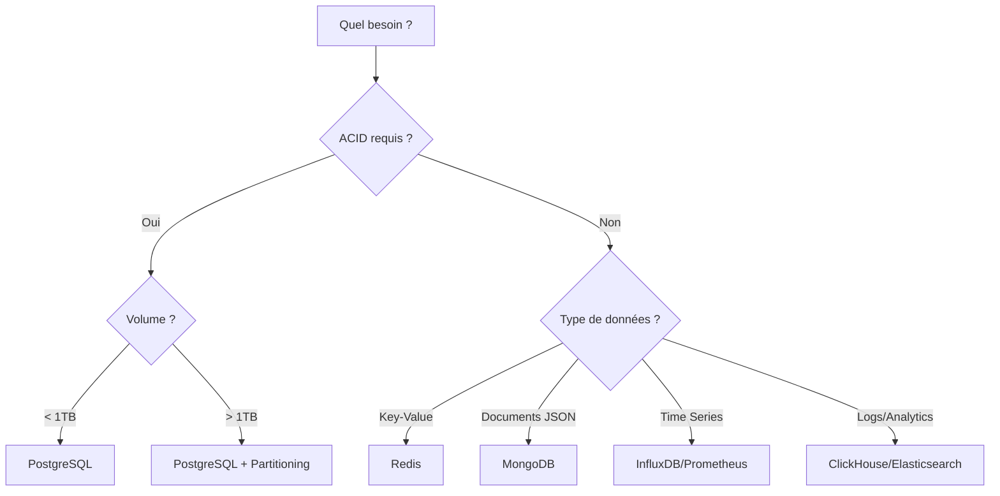

# Bases de Données

Administration, optimisation et haute disponibilité des bases de données.

---

## PostgreSQL

| Article | Description | Niveau |
|---------|-------------|--------|
| [PostgreSQL](postgresql.md) | Administration PostgreSQL complète | :material-star::material-star: |
| [PostgreSQL Cheatsheet](postgresql-cheatsheet.md) | Aide-mémoire PostgreSQL | :material-star: |

## MariaDB / MySQL

| Article | Description | Niveau |
|---------|-------------|--------|
| [MariaDB](mariadb.md) | Administration MariaDB/MySQL | :material-star::material-star: |
| [MariaDB Cheatsheet](mariadb-cheatsheet.md) | Aide-mémoire MariaDB | :material-star: |

## MongoDB

| Article | Description | Niveau |
|---------|-------------|--------|
| [MongoDB](mongodb.md) | Administration MongoDB | :material-star::material-star: |
| [MongoDB Cheatsheet](mongodb-cheatsheet.md) | Aide-mémoire MongoDB | :material-star: |

## Redis

| Article | Description | Niveau |
|---------|-------------|--------|
| [Redis](redis.md) | Administration Redis | :material-star::material-star: |
| [Redis Cheatsheet](redis-cheatsheet.md) | Aide-mémoire Redis | :material-star: |

## Haute Disponibilité

| Article | Description | Niveau |
|---------|-------------|--------|
| [High Availability](high-availability.md) | Patterns HA et failover | :material-star::material-star::material-star: |

---

## Guide de Décision Rapide

| Cas d'usage | Base recommandée | Justification |
|-------------|------------------|---------------|
| Transactions financières | PostgreSQL | ACID, fiabilité |
| Cache applicatif | Redis | Latence < 1ms |
| Sessions utilisateurs | Redis | TTL natif, rapide |
| Logs centralisés | Elasticsearch | Full-text search |
| Métriques/Monitoring | Prometheus | Time series optimisé |
| E-commerce | PostgreSQL + Redis | ACID + cache |
