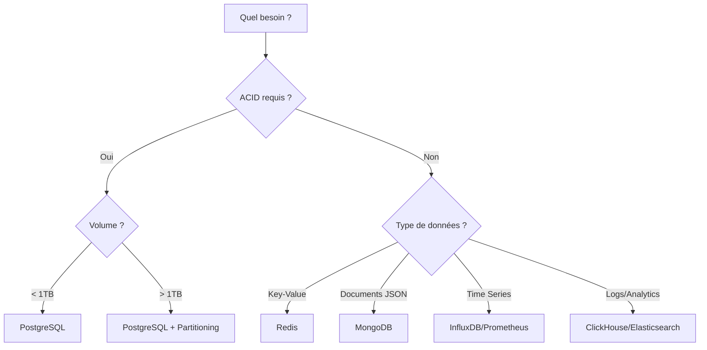

# Bases de Données

Administration, optimisation et haute disponibilité des bases de données.

## Sections

| Section | Description |
|---------|-------------|
| 🐘 **PostgreSQL** | Installation, configuration, tuning et backup |
| 🐬 **MariaDB/MySQL** | Administration et réplication |
| 🍃 **MongoDB** | Documents JSON, aggregation, replica sets |
| 🔴 **Redis** | Cache, sessions et pub/sub |
| 🔄 **Haute Disponibilité** | Patroni, Galera, failover automatique |
| 📊 **Concepts** | Types de BDD, choix d'architecture |

## Guide de Décision Rapide

| Cas d'usage | Base recommandée | Justification |
|-------------|------------------|---------------|
| Transactions financières | PostgreSQL | ACID, fiabilité |
| Cache applicatif | Redis | Latence < 1ms |
| Sessions utilisateurs | Redis | TTL natif, rapide |
| Logs centralisés | Elasticsearch | Full-text search |
| Métriques/Monitoring | Prometheus | Time series optimisé |
| E-commerce | PostgreSQL + Redis | ACID + cache |
