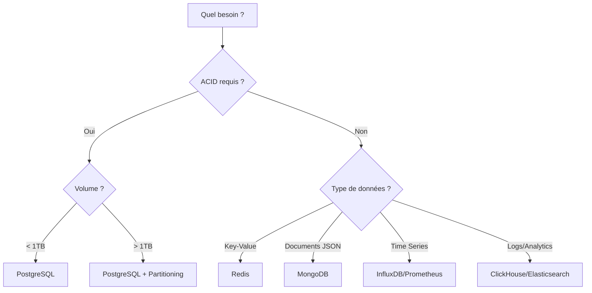

---
tags:
  - databases
  - postgresql
  - mysql
  - nosql
---

# Bases de Données

Administration, optimisation et haute disponibilité des bases de données.

---

## PostgreSQL

| Article | Description | Niveau |
|---------|-------------|--------|
| [PostgreSQL](postgresql.md) | Administration PostgreSQL complète | :material-star::material-star: |
| [PostgreSQL Cheatsheet](postgresql-cheatsheet.md) | Aide-mémoire PostgreSQL | :material-star: |

## MariaDB / MySQL

| Article | Description | Niveau |
|---------|-------------|--------|
| [MariaDB](mariadb.md) | Administration MariaDB/MySQL | :material-star::material-star: |
| [MariaDB Cheatsheet](mariadb-cheatsheet.md) | Aide-mémoire MariaDB | :material-star: |

## MongoDB

| Article | Description | Niveau |
|---------|-------------|--------|
| [MongoDB](mongodb.md) | Administration MongoDB | :material-star::material-star: |
| [MongoDB Cheatsheet](mongodb-cheatsheet.md) | Aide-mémoire MongoDB | :material-star: |

## Redis

| Article | Description | Niveau |
|---------|-------------|--------|
| [Redis](redis.md) | Administration Redis | :material-star::material-star: |
| [Redis Cheatsheet](redis-cheatsheet.md) | Aide-mémoire Redis | :material-star: |

## Haute Disponibilité

| Article | Description | Niveau |
|---------|-------------|--------|
| [High Availability](high-availability.md) | Patterns HA et failover | :material-star::material-star::material-star: |

---

## Concepts Fondamentaux : SQL vs NoSQL

Comprendre pourquoi et quand sortir du modèle relationnel classique.

### Limites du Modèle Relationnel (SQL)
Le modèle relationnel (SGBDR) existe depuis 1970 et repose sur le **Hard State** :
*   **Intégrité stricte** (ACID) garantie par la base.
*   **Schéma rigide** (Tables, Colonnes, Clés) difficile à faire évoluer à chaud.
*   **Scalabilité Verticale** : Pour plus de puissance, on augmente le matériel d'un serveur unique (CPU, RAM). Cela coûte cher et a des limites physiques.

### L'Approche NoSQL
Le NoSQL ("Not Only SQL") émerge avec les géants du Web pour répondre aux **3V** (Volume, Vélocité, Variété) via le **Soft State** :
*   **Flexibilité** : Schéma dynamique ou inexistant ("Schema-less").
*   **Scalabilité Horizontale** : Répartition de la charge sur une multitude de petits serveurs (clusters).
*   **Disponibilité** : Priorité souvent donnée à la disponibilité sur la cohérence immédiate (Théorème CAP).

### Les 4 Familles de NoSQL

| Famille | Modèle de Données | Cas d'Usage Idéal | Exemples |
|---------|-------------------|-------------------|----------|
| **Clé-Valeur** | Dictionnaire géant (Map) | Caching, Sessions, Panier d'achat | **Redis**, Memcached |
| **Documents** | JSON/BSON hiérarchique | Contenu (CMS), Profils utilisateurs, Catalogues | **MongoDB**, CouchDB |
| **Colonnes** | Familles de colonnes (BigTable) | Big Data, Analytics, Séries temporelles massives | Cassandra, HBase |
| **Graphes** | Noeuds et Arcs | Réseaux sociaux, Recommandations, Fraude | Neo4j, OrientDB |

---

## Guide de Décision Rapide

| Cas d'usage | Base recommandée | Justification |
|-------------|------------------|---------------|
| Transactions financières | PostgreSQL | ACID, fiabilité |
| Cache applicatif | Redis | Latence < 1ms |
| Sessions utilisateurs | Redis | TTL natif, rapide |
| Logs centralisés | Elasticsearch | Full-text search |
| Métriques/Monitoring | Prometheus | Time series optimisé |
| E-commerce | PostgreSQL + Redis | ACID + cache |
