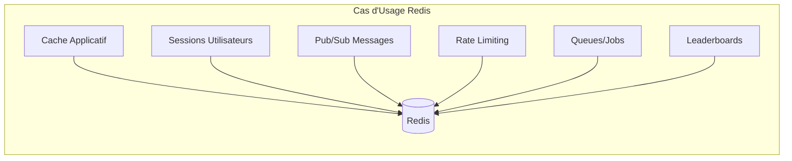

---
tags:
  - redis
  - cache
  - nosql
  - key-value
  - sessions
---

# Redis

Guide d'administration Redis : cache, sessions, pub/sub et haute disponibilité.

---

## Concepts Clés



| Caractéristique | Valeur |
|-----------------|--------|
| Type | Key-Value Store |
| Stockage | In-Memory (RAM) |
| Persistance | RDB (snapshots) / AOF (journal) |
| Latence | < 1ms |
| Protocole | RESP (Redis Serialization Protocol) |

---

## Installation

=== "RHEL/Rocky 9"

    ```bash
    # Depuis les repos EPEL
    sudo dnf install -y epel-release
    sudo dnf install -y redis

    # Ou depuis le repo officiel Redis
    sudo dnf install -y https://rpms.remirepo.net/enterprise/remi-release-9.rpm
    sudo dnf module enable redis:remi-7.2
    sudo dnf install -y redis

    # Démarrer et activer
    sudo systemctl enable --now redis
    ```

=== "Debian/Ubuntu"

    ```bash
    # Ajouter le repo officiel
    curl -fsSL https://packages.redis.io/gpg | sudo gpg --dearmor -o /usr/share/keyrings/redis-archive-keyring.gpg
    echo "deb [signed-by=/usr/share/keyrings/redis-archive-keyring.gpg] https://packages.redis.io/deb $(lsb_release -cs) main" | sudo tee /etc/apt/sources.list.d/redis.list

    sudo apt update
    sudo apt install -y redis

    sudo systemctl enable --now redis-server
    ```

=== "Docker"

    ```bash
    # Lancement simple
    docker run -d \
      --name redis \
      -p 6379:6379 \
      redis:7-alpine

    # Avec persistance et mot de passe
    docker run -d \
      --name redis \
      -p 6379:6379 \
      -v redis_data:/data \
      redis:7-alpine \
      redis-server --requirepass "your_password" --appendonly yes

    # Connexion
    docker exec -it redis redis-cli -a your_password
    ```

### Vérification

```bash
# Test de connexion
redis-cli ping
# Réponse attendue : PONG

# Informations serveur
redis-cli INFO server
```

---

## Configuration

### Fichier de Configuration

```bash
# Emplacement principal
/etc/redis/redis.conf      # Debian/Ubuntu
/etc/redis.conf            # RHEL/Rocky
```

### Configuration Essentielle

```ini
# /etc/redis/redis.conf

# === Réseau ===
bind 127.0.0.1 -::1        # Localhost uniquement (sécurité)
# bind 0.0.0.0              # Toutes les interfaces (avec mot de passe!)
port 6379
protected-mode yes

# === Sécurité ===
requirepass your_strong_password_here

# Renommer les commandes dangereuses
rename-command FLUSHALL ""
rename-command FLUSHDB ""
rename-command CONFIG ""
rename-command DEBUG ""

# === Mémoire ===
maxmemory 2gb
maxmemory-policy allkeys-lru    # Politique d'éviction

# === Persistance RDB (Snapshots) ===
save 900 1      # Snapshot si 1 clé modifiée en 900s
save 300 10     # Snapshot si 10 clés modifiées en 300s
save 60 10000   # Snapshot si 10000 clés modifiées en 60s
dbfilename dump.rdb
dir /var/lib/redis

# === Persistance AOF (Append Only File) ===
appendonly yes
appendfilename "appendonly.aof"
appendfsync everysec    # Bon compromis performance/durabilité
# appendfsync always    # Plus sûr mais plus lent
# appendfsync no        # Plus rapide mais risque de perte

# === Logs ===
loglevel notice
logfile /var/log/redis/redis-server.log

# === Performance ===
tcp-keepalive 300
timeout 0
databases 16
```

### Politiques d'Éviction (maxmemory-policy)

| Politique | Description | Cas d'usage |
|-----------|-------------|-------------|
| `noeviction` | Erreur si mémoire pleine | Données critiques |
| `allkeys-lru` | LRU sur toutes les clés | Cache général |
| `volatile-lru` | LRU sur clés avec TTL | Cache avec expiration |
| `allkeys-lfu` | LFU sur toutes les clés | Cache fréquentiel |
| `volatile-ttl` | Expire les clés TTL les plus proches | Sessions |
| `allkeys-random` | Éviction aléatoire | Test |

---

## Commandes Essentielles

### Strings

```bash
# SET / GET
SET user:1:name "John Doe"
GET user:1:name

# Avec expiration (TTL)
SET session:abc123 "user_data" EX 3600   # Expire dans 1 heure
SETEX session:abc123 3600 "user_data"    # Équivalent

# Incrémenter/Décrémenter
SET counter 0
INCR counter        # 1
INCRBY counter 10   # 11
DECR counter        # 10

# Vérifier l'existence
EXISTS user:1:name  # 1 (existe) ou 0

# Supprimer
DEL user:1:name

# TTL restant
TTL session:abc123  # Secondes restantes, -1 si pas de TTL, -2 si n'existe pas
```

### Hashes

```bash
# Stocker un objet
HSET user:1 name "John" email "john@example.com" age 30

# Récupérer un champ
HGET user:1 name

# Récupérer tout
HGETALL user:1

# Incrémenter un champ
HINCRBY user:1 age 1

# Vérifier l'existence d'un champ
HEXISTS user:1 email
```

### Lists

```bash
# Ajouter des éléments
LPUSH queue:jobs "job1"   # Début de liste
RPUSH queue:jobs "job2"   # Fin de liste

# Récupérer et supprimer (queue)
LPOP queue:jobs   # Premier élément
RPOP queue:jobs   # Dernier élément
BLPOP queue:jobs 30  # Blocking pop (attendre 30s)

# Voir les éléments
LRANGE queue:jobs 0 -1   # Tous
LLEN queue:jobs          # Longueur
```

### Sets

```bash
# Ajouter des membres
SADD tags:post:1 "redis" "database" "cache"

# Membres du set
SMEMBERS tags:post:1

# Vérifier l'appartenance
SISMEMBER tags:post:1 "redis"   # 1 ou 0

# Opérations ensemblistes
SINTER tags:post:1 tags:post:2   # Intersection
SUNION tags:post:1 tags:post:2   # Union
SDIFF tags:post:1 tags:post:2    # Différence
```

### Sorted Sets

```bash
# Leaderboard
ZADD leaderboard 100 "player1" 250 "player2" 180 "player3"

# Top 3
ZREVRANGE leaderboard 0 2 WITHSCORES

# Rang d'un joueur
ZREVRANK leaderboard "player2"   # 0 = premier

# Incrémenter le score
ZINCRBY leaderboard 50 "player1"
```

### Pub/Sub

```bash
# Terminal 1 : S'abonner
SUBSCRIBE channel:notifications

# Terminal 2 : Publier
PUBLISH channel:notifications "New message!"

# Pattern matching
PSUBSCRIBE channel:*
```

---

## Cache Applicatif

### Pattern Cache-Aside

```python
# Python avec redis-py
import redis
import json

r = redis.Redis(host='localhost', port=6379, password='your_password', decode_responses=True)

def get_user(user_id):
    # 1. Chercher dans le cache
    cache_key = f"user:{user_id}"
    cached = r.get(cache_key)

    if cached:
        return json.loads(cached)

    # 2. Cache miss : chercher en base
    user = db.query(f"SELECT * FROM users WHERE id = {user_id}")

    # 3. Stocker dans le cache (TTL 1 heure)
    r.setex(cache_key, 3600, json.dumps(user))

    return user

def invalidate_user_cache(user_id):
    r.delete(f"user:{user_id}")
```

### Sessions PHP

```ini
; php.ini
session.save_handler = redis
session.save_path = "tcp://127.0.0.1:6379?auth=your_password"
```

### Sessions Express.js

```javascript
const session = require('express-session');
const RedisStore = require('connect-redis').default;
const { createClient } = require('redis');

const redisClient = createClient({
    url: 'redis://:your_password@localhost:6379'
});
redisClient.connect();

app.use(session({
    store: new RedisStore({ client: redisClient }),
    secret: 'your-secret-key',
    resave: false,
    saveUninitialized: false,
    cookie: { secure: true, maxAge: 86400000 }
}));
```

---

## Monitoring

### Commandes de Diagnostic

```bash
# Informations complètes
redis-cli INFO

# Sections spécifiques
redis-cli INFO memory
redis-cli INFO stats
redis-cli INFO replication
redis-cli INFO clients

# Métriques clés
redis-cli INFO memory | grep used_memory_human
redis-cli INFO stats | grep instantaneous_ops_per_sec
redis-cli INFO clients | grep connected_clients

# Monitor en temps réel (ATTENTION: impact perf)
redis-cli MONITOR

# Statistiques des commandes
redis-cli INFO commandstats
```

### Métriques Importantes

```bash
# Script de monitoring
cat << 'EOF' > /opt/scripts/redis_check.sh
#!/bin/bash
echo "=== Redis Health Check ==="
redis-cli -a $REDIS_PASSWORD INFO | grep -E "^(used_memory_human|connected_clients|instantaneous_ops_per_sec|keyspace_hits|keyspace_misses|expired_keys|evicted_keys)"

echo -e "\n=== Hit Ratio ==="
HITS=$(redis-cli -a $REDIS_PASSWORD INFO stats | grep keyspace_hits | cut -d: -f2 | tr -d '\r')
MISSES=$(redis-cli -a $REDIS_PASSWORD INFO stats | grep keyspace_misses | cut -d: -f2 | tr -d '\r')
if [ $((HITS + MISSES)) -gt 0 ]; then
    RATIO=$(echo "scale=2; $HITS * 100 / ($HITS + $MISSES)" | bc)
    echo "Cache Hit Ratio: ${RATIO}%"
fi
EOF
chmod +x /opt/scripts/redis_check.sh
```

### Slow Log

```bash
# Configurer le slow log
redis-cli CONFIG SET slowlog-log-slower-than 10000   # 10ms
redis-cli CONFIG SET slowlog-max-len 128

# Voir les requêtes lentes
redis-cli SLOWLOG GET 10

# Nombre d'entrées
redis-cli SLOWLOG LEN

# Reset
redis-cli SLOWLOG RESET
```

---

## Haute Disponibilité

### Redis Sentinel

```ini
# /etc/redis/sentinel.conf

port 26379
sentinel monitor mymaster 10.0.0.1 6379 2
sentinel auth-pass mymaster your_password
sentinel down-after-milliseconds mymaster 5000
sentinel failover-timeout mymaster 60000
sentinel parallel-syncs mymaster 1
```

```bash
# Démarrer Sentinel
redis-sentinel /etc/redis/sentinel.conf

# Vérifier l'état
redis-cli -p 26379 SENTINEL masters
redis-cli -p 26379 SENTINEL slaves mymaster
```

### Redis Cluster

```bash
# Créer un cluster (6 nœuds minimum : 3 masters + 3 replicas)
redis-cli --cluster create \
    10.0.0.1:6379 10.0.0.2:6379 10.0.0.3:6379 \
    10.0.0.4:6379 10.0.0.5:6379 10.0.0.6:6379 \
    --cluster-replicas 1 \
    -a your_password

# Vérifier le cluster
redis-cli -c -a your_password CLUSTER INFO
redis-cli -c -a your_password CLUSTER NODES
```

---

## Sauvegarde et Restauration

### Sauvegarde RDB

```bash
# Déclencher un snapshot
redis-cli BGSAVE

# Vérifier le statut
redis-cli LASTSAVE

# Copier le fichier dump.rdb
cp /var/lib/redis/dump.rdb /backup/redis_$(date +%Y%m%d).rdb
```

### Sauvegarde AOF

```bash
# Réécrire l'AOF (compacter)
redis-cli BGREWRITEAOF

# Copier les fichiers AOF
cp /var/lib/redis/appendonly.aof* /backup/
```

### Restauration

```bash
# 1. Arrêter Redis
sudo systemctl stop redis

# 2. Copier le fichier de backup
cp /backup/redis_20241130.rdb /var/lib/redis/dump.rdb
chown redis:redis /var/lib/redis/dump.rdb

# 3. Redémarrer Redis
sudo systemctl start redis

# 4. Vérifier
redis-cli DBSIZE
```

---

## Sécurité

### Checklist de Sécurité

- [ ] `requirepass` configuré avec un mot de passe fort
- [ ] `bind` restreint (pas 0.0.0.0 sans mot de passe)
- [ ] `protected-mode yes`
- [ ] Commandes dangereuses renommées ou désactivées
- [ ] TLS activé si accès distant
- [ ] Firewall configuré (port 6379)
- [ ] Utilisateur dédié (non-root)

### Configuration TLS

```ini
# redis.conf
tls-port 6380
port 0                  # Désactiver le port non-TLS
tls-cert-file /etc/redis/redis.crt
tls-key-file /etc/redis/redis.key
tls-ca-cert-file /etc/redis/ca.crt
tls-auth-clients yes
```

```bash
# Connexion TLS
redis-cli --tls \
    --cert /etc/redis/client.crt \
    --key /etc/redis/client.key \
    --cacert /etc/redis/ca.crt \
    -p 6380
```

---

## Voir Aussi

- [PostgreSQL](postgresql.md) - Base relationnelle
- [MariaDB](mariadb.md) - Alternative MySQL
- [Haute Disponibilité](high-availability.md) - Architectures HA
- [Concepts BDD](../concepts/databases.md) - Types de bases de données
