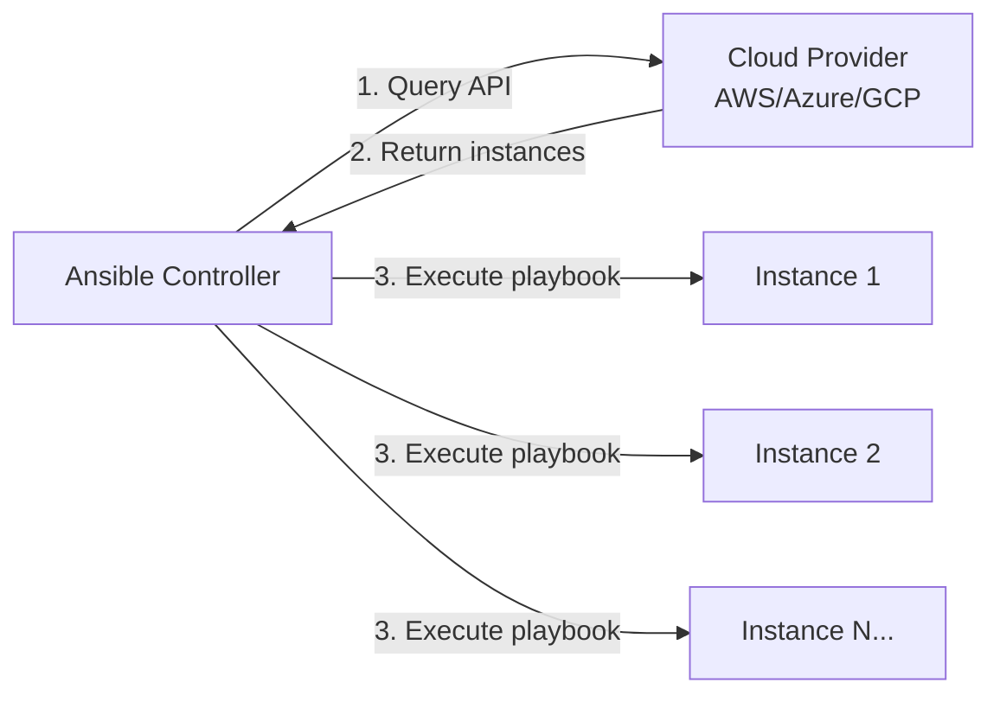
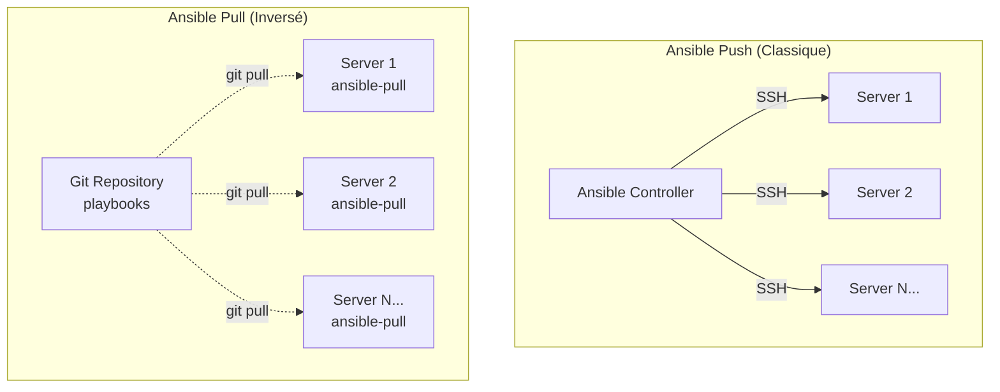

---
tags:
  - ansible
  - cloud
  - docker
  - dynamic-inventory
  - awx
---

# Ansible: Cloud, Docker & Dynamic Inventories

Connecter Ansible aux infrastructures dynamiques et piloter les conteneurs.

---

## Inventaires Dynamiques : Adieu fichiers INI

### Le Problème du Fichier `hosts` Statique

**En environnement classique :**

```ini
# hosts (fichier statique)
[webservers]
web1.example.com
web2.example.com

[databases]
db1.example.com
```

✅ **Fonctionne** pour une infra stable et on-premise.

❌ **Ne fonctionne plus** quand :
- Les serveurs sont créés/détruits automatiquement (Auto-Scaling)
- Les IPs changent à chaque déploiement (Cloud)
- Vous avez 1000+ instances à gérer

### Solution : Inventaires Dynamiques

**Concept :** Ansible interroge une **API cloud** en temps réel pour obtenir la liste des serveurs.



### Configuration : Plugin AWS EC2

!!! info "Prérequis"
    - Collection AWS : `ansible-galaxy collection install amazon.aws`
    - SDK Python : `pip install boto3 botocore`
    - Credentials AWS : `~/.aws/credentials` ou variables d'environnement

**Fichier :** `inventory/aws_ec2.yml`

```yaml
---
# inventory/aws_ec2.yml
plugin: amazon.aws.aws_ec2

# Régions à scanner
regions:
  - eu-west-1
  - eu-west-3

# Filtres (optionnel)
filters:
  # Uniquement les instances running
  instance-state-name: running
  # Uniquement avec le tag Environment=production
  "tag:Environment": production

# Groupes dynamiques basés sur les tags
keyed_groups:
  # Créer un groupe par valeur du tag "Role"
  - key: tags.Role
    prefix: role
    separator: "_"
  # Créer un groupe par type d'instance
  - key: instance_type
    prefix: type
    separator: "_"

# Variables d'hôte
compose:
  # Utiliser l'IP privée pour la connexion
  ansible_host: private_ip_address
  # Extraire le nom depuis les tags
  inventory_hostname: tags.Name

# Utiliser les tags comme variables
hostnames:
  - tag:Name
  - ip-address
```

**Tester l'inventaire :**

```bash
# Visualiser l'inventaire généré
ansible-inventory -i inventory/aws_ec2.yml --graph

# Output exemple :
# @all:
#   |--@aws_ec2:
#   |  |--i-0abc123def456789
#   |  |--i-0def456ghi789012
#   |--@role_webserver:
#   |  |--i-0abc123def456789
#   |--@role_database:
#   |  |--i-0def456ghi789012
#   |--@type_t3_medium:
#   |  |--i-0abc123def456789
#   |--@ungrouped:

# Lister tous les hosts
ansible-inventory -i inventory/aws_ec2.yml --list

# Exécuter un playbook avec l'inventaire dynamique
ansible-playbook -i inventory/aws_ec2.yml deploy.yml
```

### Configuration : Plugin Azure

!!! info "Prérequis"
    - Collection Azure : `ansible-galaxy collection install azure.azcollection`
    - SDK Python : `pip install 'ansible[azure]'`
    - Credentials : `~/.azure/credentials`

**Fichier :** `inventory/azure_rm.yml`

```yaml
---
# inventory/azure_rm.yml
plugin: azure.azcollection.azure_rm

# Inclure les powered-off VMs
include_vm_resource_groups:
  - production-rg
  - staging-rg

# Filtres
auth_source: auto

# Groupes dynamiques
keyed_groups:
  # Par resource group
  - prefix: rg
    key: resource_group
  # Par tag Environment
  - prefix: env
    key: tags.Environment
  # Par région
  - prefix: location
    key: location

# Variables
compose:
  ansible_host: private_ipv4_addresses[0]
  ansible_user: azureuser
```

### Configuration : Plugin GCP

**Fichier :** `inventory/gcp_compute.yml`

```yaml
---
# inventory/gcp_compute.yml
plugin: google.cloud.gcp_compute

# Projet GCP
projects:
  - my-gcp-project-id

# Zones
zones:
  - europe-west1-b
  - europe-west1-c

# Filtres
filters:
  - status = RUNNING
  - labels.environment = production

# Groupes dynamiques
keyed_groups:
  - key: labels.role
    prefix: role
  - key: zone
    prefix: zone

# Variables
compose:
  ansible_host: networkInterfaces[0].networkIP
```

### Inventaire Dynamique Custom (Script)

Pour les APIs non supportées, créer un **script exécutable** qui retourne du JSON :

```python
#!/usr/bin/env python3
# inventory/custom_inventory.py
import json
import requests

def get_inventory():
    # Interroger votre API custom
    response = requests.get("https://cmdb.example.com/api/servers")
    servers = response.json()

    inventory = {
        "_meta": {
            "hostvars": {}
        },
        "all": {
            "children": ["webservers", "databases"]
        },
        "webservers": {
            "hosts": []
        },
        "databases": {
            "hosts": []
        }
    }

    for server in servers:
        group = server["role"]
        inventory[group]["hosts"].append(server["hostname"])
        inventory["_meta"]["hostvars"][server["hostname"]] = {
            "ansible_host": server["ip"],
            "ansible_user": "deploy"
        }

    return inventory

if __name__ == "__main__":
    print(json.dumps(get_inventory(), indent=2))
```

```bash
# Rendre le script exécutable
chmod +x inventory/custom_inventory.py

# Tester
ansible-inventory -i inventory/custom_inventory.py --graph

# Utiliser dans un playbook
ansible-playbook -i inventory/custom_inventory.py deploy.yml
```

---

## Piloter Docker avec Ansible

### Prérequis

!!! warning "Installation Required"
    ```bash
    # Collection Docker
    ansible-galaxy collection install community.docker

    # SDK Python Docker (sur le contrôleur ET les hosts)
    pip install docker

    # Vérifier l'installation
    ansible-galaxy collection list | grep community.docker
    ```

### Module `docker_image` : Gérer les Images

```yaml
---
- name: Docker image management
  hosts: docker_hosts
  become: yes
  tasks:
    # Pull une image depuis Docker Hub
    - name: Pull Nginx image
      community.docker.docker_image:
        name: nginx
        tag: latest
        source: pull
        state: present

    # Pull une image depuis un registry privé
    - name: Pull from private registry
      community.docker.docker_image:
        name: registry.example.com/myapp
        tag: v2.0
        source: pull
        state: present
        username: "{{ registry_user }}"
        password: "{{ registry_password }}"

    # Build une image depuis un Dockerfile
    - name: Build custom image
      community.docker.docker_image:
        name: myapp
        tag: latest
        source: build
        build:
          path: /opt/myapp
          dockerfile: Dockerfile
          pull: yes
          args:
            ENV: production

    # Supprimer une image
    - name: Remove old image
      community.docker.docker_image:
        name: oldapp
        tag: v1.0
        state: absent
```

### Module `docker_container` : Gérer les Conteneurs

**Équivalent de `docker run -d -p 80:80 --name web nginx`**

```yaml
---
- name: Deploy Nginx container
  hosts: docker_hosts
  become: yes
  tasks:
    - name: Run Nginx container
      community.docker.docker_container:
        name: nginx_web
        image: nginx:latest
        state: started
        restart_policy: always
        ports:
          - "80:80"
          - "443:443"
        volumes:
          - /opt/nginx/html:/usr/share/nginx/html:ro
          - /opt/nginx/conf:/etc/nginx/conf.d:ro
        env:
          TZ: "Europe/Paris"
        labels:
          app: "webserver"
          environment: "production"
```

### Exemple Complet : Stack WordPress

```yaml
---
- name: Deploy WordPress stack
  hosts: docker_hosts
  become: yes
  vars:
    mysql_root_password: "{{ vault_mysql_root_password }}"
    wordpress_db_password: "{{ vault_wordpress_db_password }}"
  tasks:
    # Créer un réseau Docker
    - name: Create WordPress network
      community.docker.docker_network:
        name: wordpress_net
        state: present

    # Créer un volume pour MySQL
    - name: Create MySQL volume
      community.docker.docker_volume:
        name: mysql_data
        state: present

    # Déployer MySQL
    - name: Run MySQL container
      community.docker.docker_container:
        name: wordpress_db
        image: mysql:8.0
        state: started
        restart_policy: always
        networks:
          - name: wordpress_net
        volumes:
          - mysql_data:/var/lib/mysql
        env:
          MYSQL_ROOT_PASSWORD: "{{ mysql_root_password }}"
          MYSQL_DATABASE: wordpress
          MYSQL_USER: wordpress
          MYSQL_PASSWORD: "{{ wordpress_db_password }}"
        healthcheck:
          test: ["CMD", "mysqladmin", "ping", "-h", "localhost"]
          interval: 10s
          timeout: 5s
          retries: 5

    # Attendre que MySQL soit prêt
    - name: Wait for MySQL to be ready
      community.docker.docker_container_info:
        name: wordpress_db
      register: mysql_info
      until: mysql_info.container.State.Health.Status == "healthy"
      retries: 10
      delay: 5

    # Déployer WordPress
    - name: Run WordPress container
      community.docker.docker_container:
        name: wordpress_app
        image: wordpress:latest
        state: started
        restart_policy: always
        networks:
          - name: wordpress_net
        ports:
          - "8080:80"
        volumes:
          - /opt/wordpress/html:/var/www/html
        env:
          WORDPRESS_DB_HOST: wordpress_db:3306
          WORDPRESS_DB_NAME: wordpress
          WORDPRESS_DB_USER: wordpress
          WORDPRESS_DB_PASSWORD: "{{ wordpress_db_password }}"
        labels:
          traefik.enable: "true"
          traefik.http.routers.wordpress.rule: "Host(`blog.example.com`)"
```

### Gérer l'État des Conteneurs

```yaml
---
- name: Container lifecycle management
  hosts: docker_hosts
  become: yes
  tasks:
    # Démarrer un conteneur
    - name: Start container
      community.docker.docker_container:
        name: myapp
        state: started

    # Arrêter un conteneur (sans le supprimer)
    - name: Stop container
      community.docker.docker_container:
        name: myapp
        state: stopped

    # Redémarrer un conteneur
    - name: Restart container
      community.docker.docker_container:
        name: myapp
        state: started
        restart: yes

    # Supprimer un conteneur
    - name: Remove container
      community.docker.docker_container:
        name: myapp
        state: absent

    # Recréer un conteneur (force)
    - name: Recreate container
      community.docker.docker_container:
        name: myapp
        image: myapp:latest
        state: started
        recreate: yes
        force_kill: yes
```

### Docker Compose avec Ansible

```yaml
---
- name: Deploy with Docker Compose
  hosts: docker_hosts
  become: yes
  tasks:
    - name: Copy docker-compose.yml
      ansible.builtin.copy:
        src: docker-compose.yml
        dest: /opt/myapp/docker-compose.yml

    - name: Deploy stack with Docker Compose
      community.docker.docker_compose:
        project_src: /opt/myapp
        state: present
        pull: yes
      register: compose_output

    - name: Show output
      ansible.builtin.debug:
        var: compose_output
```

!!! tip "Lien avec le guide Docker"
    Pour aller plus loin sur Docker, consultez le guide [Docker Advanced](../docker-advanced.md) de ShellBook qui couvre :

    - Multi-stage builds
    - Docker Compose avancé
    - Networking et volumes
    - Sécurité des conteneurs

---

## Ansible Pull : Architecture Inversée

### Pull vs Push : Comparaison



| Aspect | Push (Classique) | Pull (Inversé) |
|--------|------------------|----------------|
| **Initiation** | Contrôleur pousse | Serveur tire |
| **Scaling** | Limité par le contrôleur | Linéaire (chaque serveur se gère) |
| **Sécurité** | SSH sortant | Git pull (HTTPS/SSH) |
| **Cas d'Usage** | Infra stable, orchestration | Auto-scaling, postes de travail |

### Cas d'Usage : Ansible Pull

✅ **Auto-Scaling Cloud**
- Les instances EC2/Azure/GCP se configurent automatiquement au boot

✅ **Gestion de Postes de Travail**
- 10,000 laptops qui se configurent au démarrage

✅ **Edge Computing**
- Serveurs distants avec connectivité intermittente

✅ **CI/CD Pipelines**
- Chaque build tire sa config depuis Git

### Configuration d'un Serveur en Ansible Pull

**Étape 1 : Structure Git**

```
ansible-pull-config/
├── local.yml           # Playbook principal
├── inventory/
│   └── localhost       # Inventaire local
└── roles/
    ├── base/
    ├── monitoring/
    └── security/
```

**Fichier :** `local.yml`

```yaml
---
# local.yml
- name: Configure server with Ansible Pull
  hosts: localhost
  connection: local
  become: yes
  vars:
    server_environment: production
  roles:
    - base
    - monitoring
    - security

  tasks:
    - name: Ensure Ansible Pull is scheduled
      ansible.builtin.cron:
        name: "ansible-pull"
        minute: "*/30"
        job: "ansible-pull -U https://github.com/myorg/ansible-pull-config.git -i inventory/localhost local.yml"
        user: root
```

**Étape 2 : Commande Ansible Pull**

```bash
# Exécution manuelle
ansible-pull -U https://github.com/myorg/ansible-pull-config.git

# Avec branche spécifique
ansible-pull -U https://github.com/myorg/ansible-pull-config.git -C production

# Avec inventaire custom
ansible-pull -U https://github.com/myorg/ansible-pull-config.git \
  -i inventory/localhost \
  local.yml

# Mode check (dry-run)
ansible-pull -U https://github.com/myorg/ansible-pull-config.git --check

# Avec tags
ansible-pull -U https://github.com/myorg/ansible-pull-config.git \
  --tags "security,monitoring"
```

**Étape 3 : Automatiser avec Cron**

```bash
# Configurer Ansible Pull au boot (user-data AWS)
#!/bin/bash
# /var/lib/cloud/scripts/per-boot/ansible-pull.sh

# Installer Ansible
apt-get update
apt-get install -y ansible git

# Première exécution
ansible-pull -U https://github.com/myorg/ansible-pull-config.git

# Scheduler toutes les 30 minutes
cat > /etc/cron.d/ansible-pull << EOF
*/30 * * * * root ansible-pull -U https://github.com/myorg/ansible-pull-config.git >> /var/log/ansible-pull.log 2>&1
EOF
```

### Sécurité : Clés de Déploiement

```bash
# Générer une clé SSH dédiée
ssh-keygen -t ed25519 -C "ansible-pull-deploy-key" -f ~/.ssh/ansible_pull_key

# Ajouter la clé publique dans GitHub
# Settings → Deploy Keys → Add deploy key (lecture seule)

# Utiliser la clé dans ansible-pull
ansible-pull -U git@github.com:myorg/ansible-pull-config.git \
  --private-key ~/.ssh/ansible_pull_key
```

!!! danger "Sécurité : Attention aux Secrets"
    Ne jamais stocker de secrets en clair dans Git !

    **Solutions :**
    - Utiliser Ansible Vault pour chiffrer les variables sensibles
    - Utiliser AWS Secrets Manager / Azure Key Vault et les récupérer dynamiquement
    - Utiliser HashiCorp Vault

---

## AWX / Ansible Tower : Interface Centrale

### Qu'est-ce que c'est ?

**Ansible Tower** (commercial) / **AWX** (open-source) = Interface Web + API + Orchestration

```
┌────────────────────────────────────────┐
│          AWX / Ansible Tower           │
│                                        │
│  ┌──────────────┐  ┌──────────────┐  │
│  │  Web UI      │  │  REST API    │  │
│  └──────────────┘  └──────────────┘  │
│                                        │
│  ┌──────────────┐  ┌──────────────┐  │
│  │  Job Queue   │  │  RBAC        │  │
│  └──────────────┘  └──────────────┘  │
│                                        │
│  ┌──────────────┐  ┌──────────────┐  │
│  │  Credentials │  │  Scheduling  │  │
│  │  (Secrets)   │  │  (Cron)      │  │
│  └──────────────┘  └──────────────┘  │
└────────────────────────────────────────┘
           │
           ▼
    ┌──────────────┐
    │  Inventories │ → AWS / Azure / VMware
    └──────────────┘
           │
           ▼
    ┌──────────────┐
    │   Playbooks  │ → Git Repositories
    └──────────────┘
           │
           ▼
    ┌──────────────┐
    │   Servers    │ → Exécution SSH
    └──────────────┘
```

### Fonctionnalités Clés

| Fonctionnalité | Description | Bénéfice |
|----------------|-------------|----------|
| **Web UI** | Interface graphique | Accessibilité aux non-techs |
| **RBAC** | Role-Based Access Control | Délégation sécurisée |
| **Credentials** | Gestion centralisée des secrets | Pas de credentials hardcodés |
| **Job Templates** | Playbooks paramétrables | Réutilisabilité |
| **Scheduling** | Cron-like pour jobs | Automatisation temporelle |
| **Workflows** | Chaînage de playbooks | Orchestration complexe |
| **REST API** | Automatisation externe | Intégration CI/CD |
| **Notifications** | Slack / Email / Webhooks | Alertes en temps réel |
| **Audit Logs** | Traçabilité complète | Conformité / Debug |

### Quand utiliser AWX/Tower ?

✅ **Oui, utilisez AWX/Tower si :**
- Vous avez **plusieurs équipes** qui doivent exécuter des playbooks
- Vous avez besoin de **RBAC** (les devs ne doivent pas voir les credentials prod)
- Vous voulez **déléguer** des exécutions à des non-techs (support, QA)
- Vous avez besoin d'**auditer** qui a exécuté quoi et quand
- Vous voulez **scheduler** des maintenances automatiques
- Vous avez **des workflows complexes** (ex: deploy app → backup DB → smoke tests)

❌ **Non, restez avec Ansible CLI si :**
- Vous êtes une **petite équipe** technique
- Vous avez déjà un **CI/CD robuste** (GitLab CI, Jenkins)
- Vous n'avez **pas besoin de délégation** ou d'interface graphique
- La **simplicité** est prioritaire

### Installation AWX (Docker Compose)

```bash
# Cloner le repo AWX
git clone https://github.com/ansible/awx.git
cd awx

# Installer avec Docker Compose
cd tools/docker-compose
make docker-compose-build

# Lancer AWX
docker-compose up -d

# Accéder à l'interface
# http://localhost:80
# User: admin / Password: password
```

### Alternatives Légères

| Outil | Description | Cas d'Usage |
|-------|-------------|----------|
| **Semaphore UI** | Interface Web open-source pour Ansible | Alternative légère à AWX |
| **ARA** (Ansible Run Analysis) | Enregistre et visualise les exécutions | Logs et debugging |
| **Rundeck** | Orchestrateur générique (pas que Ansible) | Multi-outils (Ansible, scripts, API) |

**Installation Semaphore UI :**

```bash
# Docker
docker run -d \
  -p 3000:3000 \
  -v /opt/semaphore:/tmp/semaphore \
  semaphoreui/semaphore:latest

# Accès : http://localhost:3000
```

**Installation ARA :**

```bash
# Installer ARA
pip install ara

# Configurer Ansible pour utiliser ARA
export ANSIBLE_CALLBACK_PLUGINS=$(python3 -m ara.setup.callback_plugins)

# Lancer le serveur Web ARA
ara-manage runserver

# Accès : http://127.0.0.1:8000
```

---

## Référence Rapide

### Commandes Inventaires Dynamiques

```bash
# Visualiser l'inventaire (arbre)
ansible-inventory -i inventory/aws_ec2.yml --graph

# Lister l'inventaire (JSON)
ansible-inventory -i inventory/aws_ec2.yml --list

# Vérifier un host spécifique
ansible-inventory -i inventory/aws_ec2.yml --host i-0abc123

# Utiliser dans un playbook
ansible-playbook -i inventory/aws_ec2.yml deploy.yml

# Tester la connexion
ansible -i inventory/aws_ec2.yml all -m ping
```

### Commandes Docker

```bash
# Installer la collection Docker
ansible-galaxy collection install community.docker

# Vérifier l'installation
ansible-galaxy collection list | grep docker

# Exécuter un playbook Docker
ansible-playbook -i hosts docker-deploy.yml

# Mode check
ansible-playbook -i hosts docker-deploy.yml --check
```

### Commandes Ansible Pull

```bash
# Exécution basique
ansible-pull -U https://github.com/myorg/ansible-config.git

# Avec branche
ansible-pull -U https://github.com/myorg/ansible-config.git -C production

# Avec playbook spécifique
ansible-pull -U https://github.com/myorg/ansible-config.git local.yml

# Mode check (dry-run)
ansible-pull -U https://github.com/myorg/ansible-config.git --check

# Avec tags
ansible-pull -U https://github.com/myorg/ansible-config.git --tags security

# Avec clé SSH custom
ansible-pull -U git@github.com:myorg/ansible-config.git \
  --private-key ~/.ssh/deploy_key
```

### Collections Utiles

```bash
# Cloud
ansible-galaxy collection install amazon.aws
ansible-galaxy collection install azure.azcollection
ansible-galaxy collection install google.cloud

# Docker
ansible-galaxy collection install community.docker

# Kubernetes
ansible-galaxy collection install kubernetes.core

# Général
ansible-galaxy collection install community.general
ansible-galaxy collection install ansible.posix
```

---

## Ressources Complémentaires

- **Ansible Collections Index** : https://galaxy.ansible.com/
- **AWS Plugin Docs** : https://docs.ansible.com/ansible/latest/collections/amazon/aws/aws_ec2_inventory.html
- **Docker Modules** : https://docs.ansible.com/ansible/latest/collections/community/docker/
- **AWX Project** : https://github.com/ansible/awx
- **Semaphore UI** : https://www.semui.co/
- **ARA Records Ansible** : https://ara.recordsansible.org/

---

!!! tip "Intégrations Avancées"
    **Ce guide couvre les bases. Pour aller plus loin :**

    - Explorez **Terraform + Ansible** : Terraform provisionne l'infra, Ansible la configure
    - Intégrez avec **GitOps** : FluxCD/ArgoCD + Ansible pour K8s
    - Utilisez **Ansible avec Packer** : Créer des AMIs/images préconfigurées

!!! example "Parcours Recommandé"
    Vous avez terminé la section Ansible de ShellBook !

    **Ordre de lecture complet :**
    1. [Fundamentals](fundamentals.md) - Bases et syntaxe
    2. [Playbooks](playbooks.md) - Structure et organisation
    3. [Industrialization](industrialization.md) - Roles, Vault, Galaxy
    4. [Advanced Patterns](advanced-patterns.md) - Logique, performance, stratégies
    5. **[Cloud & Integrations](cloud-integrations.md)** ← Vous êtes ici

    **Prochaine étape :** Pratiquez sur un projet réel (déploiement multi-tier avec Docker et inventaire dynamique) !
