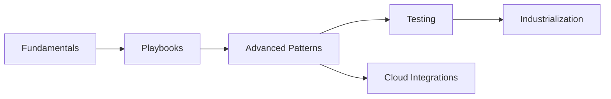

---
tags:
  - devops
  - ansible
  - automation
  - iac
---

# Ansible

Guide complet d'Ansible pour l'automatisation infrastructure et la gestion de configuration.

---

## Guides Disponibles

| Guide | Description | Niveau |
|-------|-------------|--------|
| [Fundamentals](fundamentals.md) | Bases d'Ansible : inventaires, playbooks, modules | :material-star: |
| [Playbooks](playbooks.md) | Écriture de playbooks avancés | :material-star::material-star: |
| [Advanced Patterns](advanced-patterns.md) | Patterns avancés : roles, collections, vault | :material-star::material-star::material-star: |
| [Testing Molecule](testing-molecule.md) | Tests avec Molecule et CI/CD | :material-star::material-star: |
| [Industrialization](industrialization.md) | Industrialisation : AWX/Tower, bonnes pratiques | :material-star::material-star::material-star: |
| [Cloud Integrations](cloud-integrations.md) | Intégrations cloud : AWS, Azure, GCP, ACI | :material-star::material-star: |

---

## Parcours Recommandé

---

## Voir Aussi

- [Formation Ansible Mastery](../../formations/ansible-mastery/index.md) - Formation complète 10h
- [Terraform](../terraform/index.md) - Infrastructure as Code complémentaire
