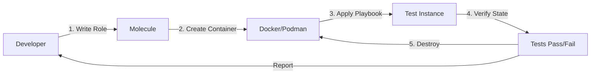
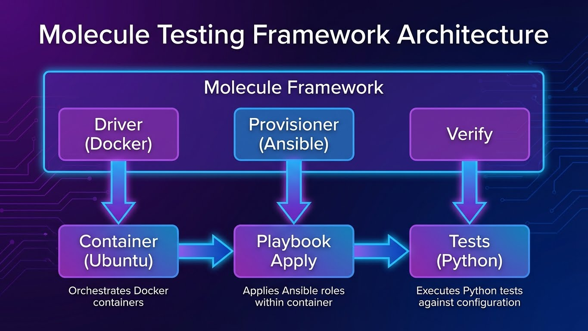

---
tags:
  - ansible
  - testing
  - molecule
  - quality
  - ci
---

# Ansible Testing with Molecule

Ne testez plus en production. Validez vos rôles dans des environnements isolés.

---

## Pourquoi Tester l'Infrastructure ?

### Le Problème : "Ça marche sur ma machine"

**Scénario classique :**

```text
Dev  : "J'ai testé le playbook sur ma VM, ça fonctionne !"
Ops  : "Déploiement en production..."
Ops  : "Ça plante. Pourquoi ?"
Dev  : "Bizarre, chez moi ça marchait..."
```

**Problèmes courants :**
- Différences de versions OS (Ubuntu 20.04 vs 22.04)
- Packages manquants
- Permissions différentes
- Variables d'environnement non définies
- Idempotence non vérifiée (playbook qui change à chaque run)

### La Solution : Molecule

**Molecule = Test Framework pour Ansible**



**Workflow automatisé :**
1. **Create** : Lance un conteneur Docker (ou VM)
2. **Converge** : Applique le playbook Ansible
3. **Idempotence** : Ré-applique et vérifie qu'il n'y a **aucun changement**
4. **Verify** : Exécute des tests (Python/Testinfra)
5. **Destroy** : Nettoie l'environnement

!!! success "Bénéfices"
    ✅ **Tests rapides** : Conteneurs = secondes (vs minutes pour VMs)
    ✅ **Tests reproductibles** : Même image Docker = même résultat
    ✅ **Tests automatisés** : Intégration CI/CD
    ✅ **Multi-plateformes** : Tester Ubuntu, Debian, CentOS, Rocky en parallèle
    ✅ **Idempotence garantie** : Détecte les playbooks qui "drifent"

---

## Architecture Molecule

### Les 3 Composants



```text
┌─────────────────────────────────────────┐
│           Molecule Framework             │
│                                          │
│  ┌────────────┐  ┌────────────┐  ┌────┐│
│  │  Driver    │  │Provisioner │  │Ver-││
│  │ (Docker)   │  │ (Ansible)  │  │ify ││
│  └────────────┘  └────────────┘  └────┘│
└─────────────────────────────────────────┘
         │                │            │
         ▼                ▼            ▼
   ┌──────────┐    ┌──────────┐  ┌─────────┐
   │Container │    │ Playbook │  │  Tests  │
   │ (Ubuntu) │    │  Apply   │  │(Python) │
   └──────────┘    └──────────┘  └─────────┘
```

| Composant | Rôle | Options |
|-----------|------|---------|
| **Driver** | Créer/Détruire l'environnement de test | Docker, Podman, Vagrant, EC2, Azure, GCP |
| **Provisioner** | Appliquer la configuration | Ansible (défaut) |
| **Verifier** | Valider l'état final | Testinfra (Python), Ansible, Goss |

**Driver recommandé :** Docker (rapide, léger, CI-friendly)

---

## Installation & Initialisation

### Prérequis

```bash
# Python 3.8+
python3 --version

# Docker
docker --version

# Ansible
ansible --version
```

### Installation Molecule

```bash
# Installer Molecule avec le driver Docker
pip install "molecule[docker]"

# Ou avec Podman
pip install "molecule[podman]"

# Vérifier l'installation
molecule --version

# Output attendu :
# molecule 6.0.2 using python 3.11
```

**Dépendances Python :**

```bash
# Installer Testinfra (pour les tests)
pip install molecule-plugins[docker] testinfra

# Ou via requirements.txt
cat > requirements.txt <<EOF
ansible>=2.9
molecule>=6.0
molecule-plugins[docker]
testinfra>=9.0
pytest
EOF

pip install -r requirements.txt
```

### Initialisation d'un Nouveau Rôle

**Créer un rôle avec Molecule intégré :**

```bash
# Créer un nouveau rôle "nginx" avec Molecule
molecule init role nginx --driver-name docker

# Structure créée :
# nginx/
# ├── README.md
# ├── defaults/
# │   └── main.yml
# ├── files/
# ├── handlers/
# │   └── main.yml
# ├── meta/
# │   └── main.yml
# ├── molecule/
# │   └── default/
# │       ├── converge.yml        # Playbook de test
# │       ├── molecule.yml        # Configuration Molecule
# │       └── verify.yml          # Tests (si Ansible verifier)
# ├── tasks/
# │   └── main.yml
# ├── templates/
# ├── tests/
# │   ├── test_default.py        # Tests Testinfra
# │   └── __pycache__/
# └── vars/
#     └── main.yml
```

### Initialisation sur un Rôle Existant

**Ajouter Molecule à un rôle existant :**

```bash
# Se placer dans le dossier du rôle
cd roles/my-existing-role

# Initialiser Molecule
molecule init scenario --driver-name docker

# Ou créer un scénario custom
molecule init scenario --driver-name docker --scenario-name production
```

---

## Configuration : `molecule.yml`

**Fichier :** `molecule/default/molecule.yml`

```yaml
---
# Driver : Comment créer l'environnement de test
driver:
  name: docker

# Platforms : Images à tester
platforms:
  - name: instance-ubuntu22
    image: geerlingguy/docker-ubuntu2204-ansible:latest
    pre_build_image: true
    privileged: true
    command: ""
    volumes:
      - /sys/fs/cgroup:/sys/fs/cgroup:rw
    cgroupns_mode: host

  - name: instance-debian12
    image: geerlingguy/docker-debian12-ansible:latest
    pre_build_image: true
    privileged: true
    command: ""
    volumes:
      - /sys/fs/cgroup:/sys/fs/cgroup:rw
    cgroupns_mode: host

# Provisioner : Ansible
provisioner:
  name: ansible
  playbooks:
    converge: converge.yml
  config_options:
    defaults:
      callbacks_enabled: ansible.posix.profile_tasks
  inventory:
    group_vars:
      all:
        nginx_port: 8080

# Verifier : Tests
verifier:
  name: testinfra
  options:
    # Verbose output
    v: 1

# Scénario : Séquence de tests
scenario:
  test_sequence:
    - dependency
    - cleanup
    - destroy
    - syntax
    - create
    - prepare
    - converge
    - idempotence
    - side_effect
    - verify
    - cleanup
    - destroy
```

!!! tip "Images Docker Recommandées"
    Utilisez les images **geerlingguy** - elles sont optimisées pour Molecule :

    - `geerlingguy/docker-ubuntu2204-ansible`
    - `geerlingguy/docker-debian12-ansible`
    - `geerlingguy/docker-rockylinux9-ansible`
    - `geerlingguy/docker-centos8-ansible`

    Ces images ont systemd configuré pour fonctionner dans Docker.

---

## Le Workflow Molecule : Commandes

### Cycle de Vie Complet

```bash
# Lancer le cycle complet de tests
molecule test

# Cycle complet :
# 1. destroy (nettoyage)
# 2. create (créer conteneur)
# 3. converge (appliquer playbook)
# 4. idempotence (ré-appliquer, vérifier aucun changement)
# 5. verify (lancer les tests)
# 6. destroy (nettoyer)
```

### Commandes Individuelles

**Développement itératif :**

```bash
# 1. Créer le conteneur
molecule create

# Output:
# INFO     Running default > create
# INFO     Creating Docker network 'molecule' ...
# INFO     Creating container instance-ubuntu22

# 2. Appliquer le playbook (mode développement)
molecule converge

# 3. Ré-appliquer pour corriger
molecule converge

# 4. Lancer les tests
molecule verify

# 5. Détruire l'environnement
molecule destroy
```

**Commandes de debug :**

```bash
# Lister les instances
molecule list

# Output:
# Instance Name        Driver  Provisioner  State
# instance-ubuntu22    docker  ansible      created

# Se connecter au conteneur (SSH)
molecule login

# Ou spécifier l'instance
molecule login -h instance-ubuntu22

# Lister les scénarios
molecule list scenarios
```

### Test d'Idempotence (CRITIQUE)

**Pourquoi c'est important :**

Un playbook **idempotent** ne change rien quand on le ré-applique.

```bash
# Tester l'idempotence
molecule idempotence

# Si le playbook change des choses à chaque run :
# FAILED! => {"changed": true, "msg": "Changes detected"}

# Si le playbook est idempotent :
# PASSED
```

**Exemple de playbook NON idempotent :**

```yaml
# ❌ MAUVAIS : Utilise shell au lieu de modules
- name: Install nginx
  ansible.builtin.shell: apt-get install -y nginx
  # Problème : apt-get install s'exécute à chaque fois
  # même si nginx est déjà installé
```

**Exemple de playbook idempotent :**

```yaml
# ✅ BON : Utilise un module Ansible
- name: Install nginx
  ansible.builtin.apt:
    name: nginx
    state: present
  # Le module vérifie si nginx est déjà installé
  # avant de faire quoi que ce soit
```

---

## Écrire des Tests : The Verifier

### Option 1 : Testinfra (Recommandé)

**Concept :** Tests en Python avec syntaxe claire.

**Fichier :** `molecule/default/tests/test_default.py`

```python
import os
import testinfra.utils.ansible_runner

# Récupérer l'inventaire Molecule
testinfra_hosts = testinfra.utils.ansible_runner.AnsibleRunner(
    os.environ['MOLECULE_INVENTORY_FILE']
).get_hosts('all')


def test_nginx_installed(host):
    """Vérifie que nginx est installé"""
    nginx = host.package("nginx")
    assert nginx.is_installed


def test_nginx_running(host):
    """Vérifie que nginx tourne"""
    nginx = host.service("nginx")
    assert nginx.is_running
    assert nginx.is_enabled


def test_nginx_listening(host):
    """Vérifie que nginx écoute sur le port 80"""
    assert host.socket("tcp://0.0.0.0:80").is_listening


def test_index_html_exists(host):
    """Vérifie que index.html existe"""
    file = host.file("/var/www/html/index.html")
    assert file.exists
    assert file.is_file
    assert file.user == "root"
    assert file.group == "root"


def test_index_html_content(host):
    """Vérifie le contenu de index.html"""
    file = host.file("/var/www/html/index.html")
    assert file.contains("Welcome to Nginx")


def test_nginx_config_valid(host):
    """Vérifie que la config nginx est valide"""
    cmd = host.run("nginx -t")
    assert cmd.rc == 0
    assert "syntax is ok" in cmd.stderr


def test_http_response(host):
    """Vérifie que HTTP répond"""
    cmd = host.run("curl -s http://localhost")
    assert cmd.rc == 0
    assert "Welcome" in cmd.stdout
```

**Lancer les tests :**

```bash
# Lancer uniquement les tests (sans destroy)
molecule verify

# Output:
# ============================= test session starts ==============================
# collected 7 items
#
# tests/test_default.py::test_nginx_installed PASSED           [ 14%]
# tests/test_default.py::test_nginx_running PASSED             [ 28%]
# tests/test_default.py::test_nginx_listening PASSED           [ 42%]
# tests/test_default.py::test_index_html_exists PASSED         [ 57%]
# tests/test_default.py::test_index_html_content PASSED        [ 71%]
# tests/test_default.py::test_nginx_config_valid PASSED        [ 85%]
# tests/test_default.py::test_http_response PASSED             [100%]
#
# ============================== 7 passed in 2.34s ===============================
```

### Option 2 : Ansible Verifier

**Configuration :** `molecule.yml`

```yaml
verifier:
  name: ansible
```

**Fichier :** `molecule/default/verify.yml`

```yaml
---
- name: Verify
  hosts: all
  gather_facts: false
  tasks:
    # Vérifier que nginx est installé
    - name: Check nginx package
      ansible.builtin.package_facts:
      register: packages

    - name: Assert nginx is installed
      ansible.builtin.assert:
        that:
          - "'nginx' in packages.ansible_facts.packages"
        fail_msg: "Nginx is not installed"

    # Vérifier que nginx tourne
    - name: Check nginx service
      ansible.builtin.service_facts:
      register: services

    - name: Assert nginx is running
      ansible.builtin.assert:
        that:
          - services.ansible_facts.services['nginx.service'].state == 'running'
          - services.ansible_facts.services['nginx.service'].status == 'enabled'

    # Vérifier que le fichier existe
    - name: Check index.html
      ansible.builtin.stat:
        path: /var/www/html/index.html
      register: index_file

    - name: Assert index.html exists
      ansible.builtin.assert:
        that:
          - index_file.stat.exists
          - index_file.stat.isreg

    # Vérifier le contenu
    - name: Read index.html
      ansible.builtin.slurp:
        src: /var/www/html/index.html
      register: index_content

    - name: Assert content is correct
      ansible.builtin.assert:
        that:
          - "'Welcome to Nginx' in (index_content.content | b64decode)"
```

---

## Exemple Complet : Rôle Nginx

### Structure du Rôle

```text
roles/nginx/
├── defaults/
│   └── main.yml
├── handlers/
│   └── main.yml
├── molecule/
│   └── default/
│       ├── converge.yml
│       ├── molecule.yml
│       └── tests/
│           └── test_default.py
├── tasks/
│   └── main.yml
└── templates/
    └── index.html.j2
```

### Playbook : `tasks/main.yml`

```yaml
---
- name: Install nginx
  ansible.builtin.apt:
    name: nginx
    state: present
    update_cache: yes

- name: Deploy custom index.html
  ansible.builtin.template:
    src: index.html.j2
    dest: /var/www/html/index.html
    owner: root
    group: root
    mode: '0644'
  notify: restart nginx

- name: Ensure nginx is running
  ansible.builtin.service:
    name: nginx
    state: started
    enabled: yes
```

### Template : `templates/index.html.j2`

```html
<!DOCTYPE html>
<html>
<head>
    <title>Welcome to Nginx</title>
</head>
<body>
    <h1>Welcome to Nginx</h1>
    <p>Server: {{ inventory_hostname }}</p>
    <p>Deployed by Ansible</p>
</body>
</html>
```

### Converge : `molecule/default/converge.yml`

```yaml
---
- name: Converge
  hosts: all
  become: true
  roles:
    - role: nginx
```

### Tests : `molecule/default/tests/test_default.py`

```python
import os
import testinfra.utils.ansible_runner

testinfra_hosts = testinfra.utils.ansible_runner.AnsibleRunner(
    os.environ['MOLECULE_INVENTORY_FILE']
).get_hosts('all')


def test_nginx_installed(host):
    nginx = host.package("nginx")
    assert nginx.is_installed


def test_nginx_running(host):
    nginx = host.service("nginx")
    assert nginx.is_running
    assert nginx.is_enabled


def test_nginx_listening(host):
    assert host.socket("tcp://0.0.0.0:80").is_listening


def test_index_html_content(host):
    file = host.file("/var/www/html/index.html")
    assert file.exists
    assert file.contains("Welcome to Nginx")
    assert file.contains("Deployed by Ansible")
```

### Exécution

```bash
# Cycle complet
cd roles/nginx
molecule test

# Développement itératif
molecule create
molecule converge
# ... modifier le code ...
molecule converge
molecule verify
molecule destroy
```

---

## Intégration CI/CD : GitHub Actions

**Fichier :** `.github/workflows/molecule.yml`

```yaml
---
name: Molecule Tests

on:
  push:
    branches:
      - main
      - develop
  pull_request:

jobs:
  test:
    name: Molecule Test
    runs-on: ubuntu-latest

    strategy:
      matrix:
        distro:
          - ubuntu2204
          - debian12
          - rockylinux9

    steps:
      # Checkout code
      - name: Checkout code
        uses: actions/checkout@v4

      # Setup Python
      - name: Set up Python
        uses: actions/setup-python@v5
        with:
          python-version: '3.11'

      # Install dependencies
      - name: Install dependencies
        run: |
          python -m pip install --upgrade pip
          pip install molecule molecule-plugins[docker] testinfra pytest

      # Run Molecule tests
      - name: Run Molecule tests
        run: |
          cd roles/nginx
          molecule test
        env:
          PY_COLORS: '1'
          ANSIBLE_FORCE_COLOR: '1'
          MOLECULE_DISTRO: ${{ matrix.distro }}

      # Upload test results
      - name: Upload test results
        if: always()
        uses: actions/upload-artifact@v4
        with:
          name: molecule-results-${{ matrix.distro }}
          path: roles/nginx/molecule/default/

  lint:
    name: Ansible Lint
    runs-on: ubuntu-latest

    steps:
      - name: Checkout code
        uses: actions/checkout@v4

      - name: Set up Python
        uses: actions/setup-python@v5
        with:
          python-version: '3.11'

      - name: Install ansible-lint
        run: pip install ansible-lint

      - name: Run ansible-lint
        run: ansible-lint roles/nginx/
```

**Avec badge dans README.md :**

```markdown
# Nginx Role


Ansible role to install and configure Nginx.

## Testing

```bash
molecule test
```text
```

---

## Debugging & Troubleshooting

### Entrer dans le Conteneur

```bash
# Lancer le conteneur
molecule create

# Se connecter
molecule login

# Ou avec nom d'instance
molecule login -h instance-ubuntu22

# Maintenant vous êtes dans le conteneur :
root@instance-ubuntu22:/# systemctl status nginx
root@instance-ubuntu22:/# cat /var/www/html/index.html
root@instance-ubuntu22:/# exit
```

!!! tip "Debug Tips"
    **Conteneur qui persiste pour debug :**
    ```bash
    # Créer + Converge sans destroy
    molecule create
    molecule converge

    # Debug
    molecule login

    # Nettoyer quand terminé
    molecule destroy
    ```

    **Verbose output :**
    ```bash
    molecule test -vvv
    ```

    **Logs Molecule :**
    ```bash
    tail -f ~/.cache/molecule/nginx/default/
    ```

### Problèmes Courants

**Problème : Systemd ne fonctionne pas dans Docker**

```yaml
# Solution : Utiliser privileged + cgroupv2
platforms:
  - name: instance
    image: geerlingguy/docker-ubuntu2204-ansible
    privileged: true
    command: ""
    volumes:
      - /sys/fs/cgroup:/sys/fs/cgroup:rw
    cgroupns_mode: host
```

**Problème : Tests échouent mais le rôle fonctionne manuellement**

```bash
# Vérifier l'environnement exact
molecule create
molecule converge
molecule login

# Inspecter manuellement
root@instance:/# systemctl status nginx
root@instance:/# nginx -t
root@instance:/# curl http://localhost
```

---

## Référence Rapide

### Cycle de Vie Molecule


```text
┌──────────┐
│ destroy  │ ← Nettoyer
└─────┬────┘
      │
┌─────▼────┐
│  create  │ ← Créer conteneur
└─────┬────┘
      │
┌─────▼────┐
│ prepare  │ ← Préparer (optionnel)
└─────┬────┘
      │
┌─────▼────────┐
│   converge   │ ← Appliquer playbook
└─────┬────────┘
      │
┌─────▼────────────┐
│  idempotence     │ ← Ré-appliquer (aucun changement)
└─────┬────────────┘
      │
┌─────▼────┐
│  verify  │ ← Lancer tests
└─────┬────┘
      │
┌─────▼────┐
│ destroy  │ ← Nettoyer
└──────────┘
```

### Commandes Essentielles

| Commande | Description |
|----------|-------------|
| `molecule test` | Cycle complet (destroy → create → converge → verify → destroy) |
| `molecule create` | Créer les instances |
| `molecule converge` | Appliquer le playbook (mode dev) |
| `molecule verify` | Lancer les tests uniquement |
| `molecule idempotence` | Tester l'idempotence |
| `molecule destroy` | Détruire les instances |
| `molecule login` | Se connecter au conteneur |
| `molecule list` | Lister les instances |
| `molecule reset` | Réinitialiser le scénario |

### Structure de Fichiers

```text
role/
├── molecule/
│   └── default/
│       ├── molecule.yml          # Configuration
│       ├── converge.yml          # Playbook de test
│       ├── prepare.yml           # Préparation (optionnel)
│       ├── verify.yml            # Tests Ansible (si verifier=ansible)
│       └── tests/
│           └── test_default.py   # Tests Testinfra (si verifier=testinfra)
└── ...
```

---

## Ressources Complémentaires

- **Molecule Docs** : https://molecule.readthedocs.io/
- **Testinfra Docs** : https://testinfra.readthedocs.io/
- **Geerlingguy Docker Images** : https://hub.docker.com/u/geerlingguy
- **Ansible Lint** : https://ansible-lint.readthedocs.io/

---

!!! example "Parcours Complet Ansible dans ShellBook"
    **Vous avez maintenant la suite complète :**

    1. [Fundamentals](fundamentals.md) - Bases
    2. [Playbooks](playbooks.md) - Structure
    3. [Industrialization](industrialization.md) - Roles, Vault, Galaxy
    4. [Advanced Patterns](advanced-patterns.md) - Performance, stratégies
    5. [Cloud Integrations](cloud-integrations.md) - Inventaires dynamiques, Docker, AWX
    6. **[Testing with Molecule](testing-molecule.md)** ← Vous êtes ici

    **La section Ansible de ShellBook est maintenant PRODUCTION READY !** 🎯

    **Prochaines étapes :**
    - Testez tous vos rôles avec Molecule
    - Intégrez dans votre CI/CD
    - Documentez vos tests
    - Partagez vos rôles sur Ansible Galaxy avec tests Molecule
