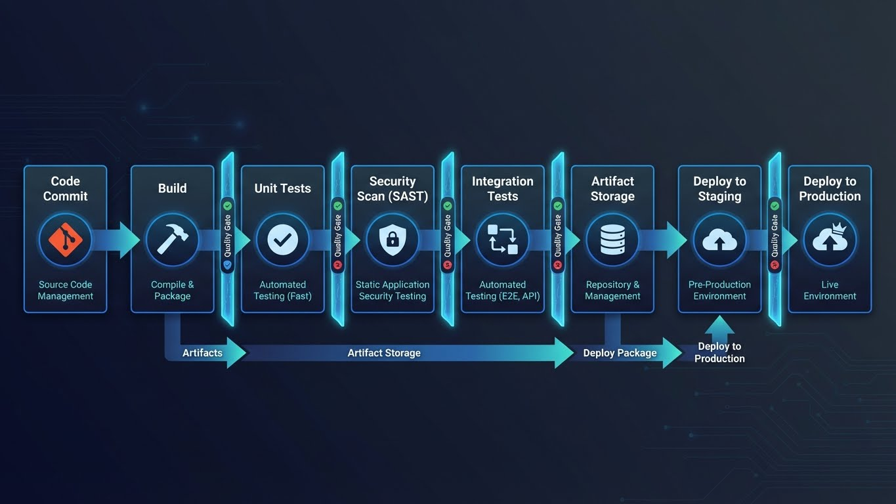
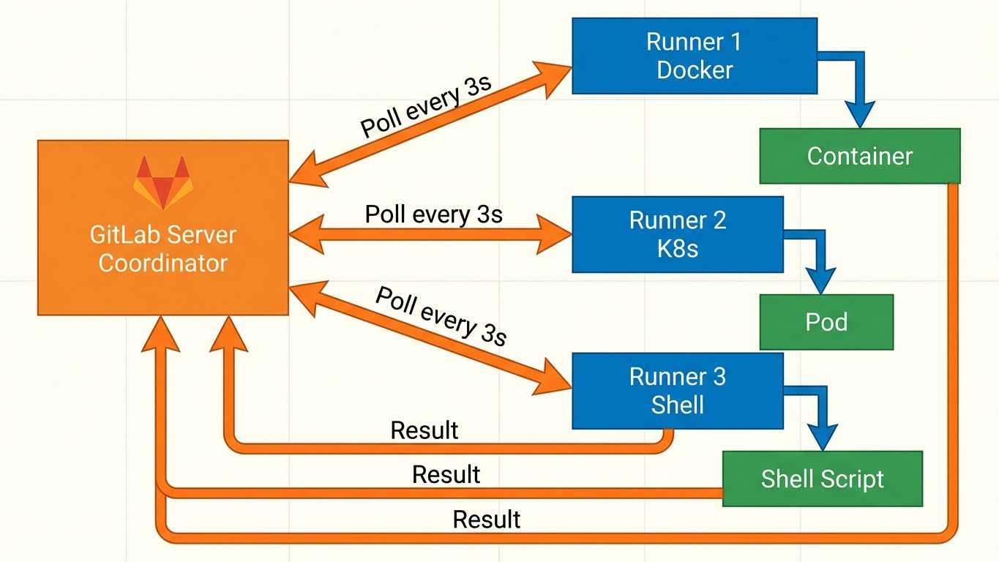
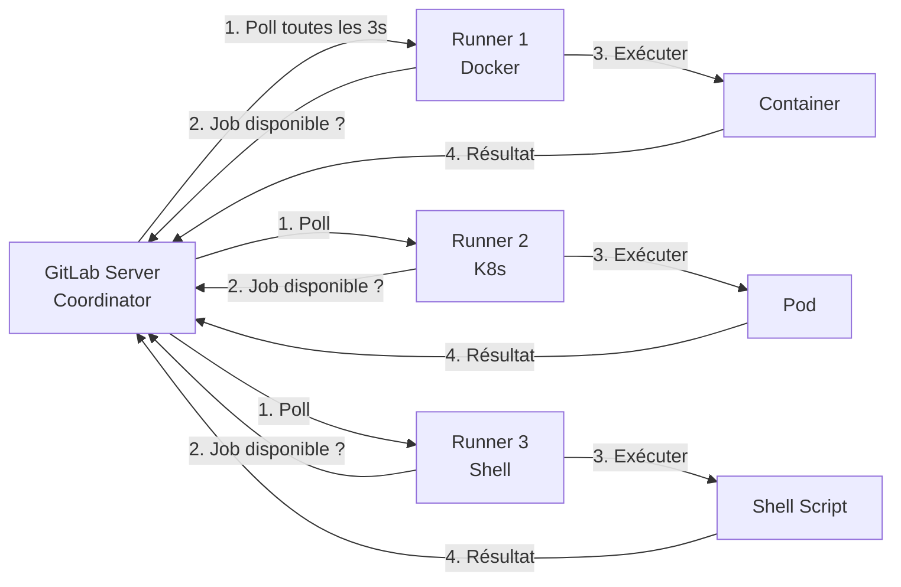
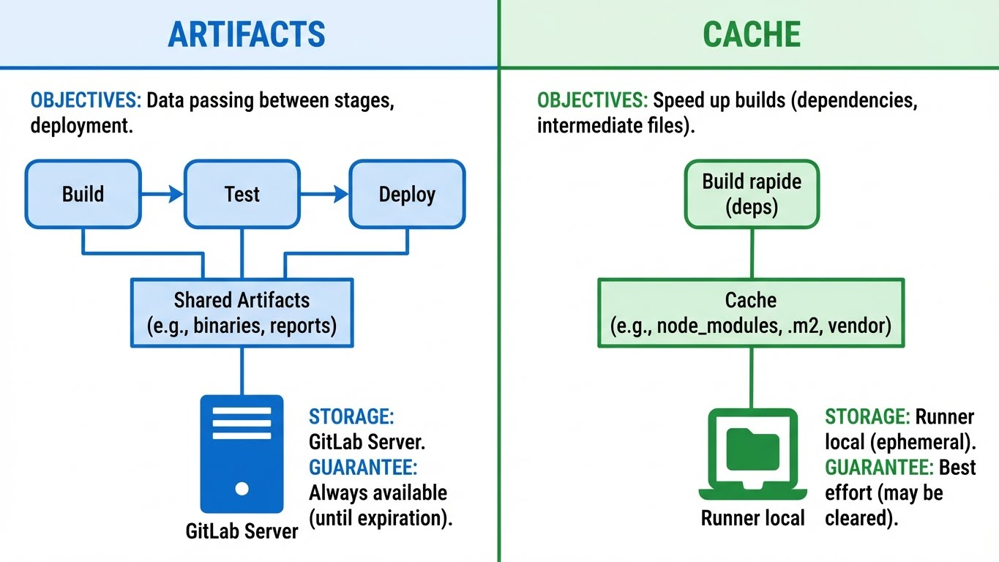

---
tags:
  - gitlab-ci
  - pipeline
  - docker
  - runner
  - yaml
---

# GitLab CI : Le Standard On-Premise

L'usine logicielle souveraine. Du code au déploiement sans sortir du réseau.



---

## Architecture & Runners : L'Infrastructure

### Le Modèle Coordinator-Agent

GitLab CI/CD fonctionne selon un modèle distribué où les tâches sont exécutées par des **Runners** (agents) orchestrés par le **Coordinator** (serveur GitLab).





**Flux d'exécution :**

1. Le Runner **poll** le GitLab Server toutes les 3 secondes
2. Le Coordinator assigne un job si disponible (basé sur les tags)
3. Le Runner exécute le job dans l'environnement configuré
4. Les logs et artifacts sont renvoyés au GitLab Server

---

### Types de Runners

| Type | Exécution | Isolation | Cas d'Usage | Recommandation |
|------|-----------|-----------|-------------|----------------|
| **Shell** | Directement sur l'hôte | ❌ Aucune | Scripts simples, démo | ⚠️ Déconseillé (pollution de l'hôte) |
| **Docker** | Container Docker | ✅ Process | Standard production | ⭐ **Recommandé** |
| **Kubernetes** | Pod K8s | ✅✅ Namespace | Scale horizontal | ⭐ Prod à grande échelle |
| **Docker+Machine** | VM + Docker | ✅✅ VM | Autoscaling cloud | Cloud uniquement |

!!! danger "Ne JAMAIS utiliser Shell en production"
    Un Runner Shell exécute les jobs directement sur l'hôte du runner :

    - ❌ Pas d'isolation (un job peut casser le runner)
    - ❌ Pollution de l'environnement (dépendances qui s'accumulent)
    - ❌ Risque de sécurité (accès filesystem de l'hôte)
    - ❌ Non reproductible (dépend de l'état du runner)

    **Utilisez Docker ou Kubernetes.**

---

### Installation d'un Runner Docker

**Prérequis :**
- Docker installé sur la machine runner
- Accès réseau au GitLab Server

**Étape 1 : Obtenir le token d'enregistrement**

Sur GitLab (Admin ou Projet) :
```
Settings → CI/CD → Runners → Expand
→ Copier le Registration Token
```

**Étape 2 : Lancer le container runner**

```bash
# Pull de l'image officielle
docker pull gitlab/gitlab-runner:latest

# Lancer le runner en mode daemon
docker run -d \
  --name gitlab-runner \
  --restart always \
  -v /srv/gitlab-runner/config:/etc/gitlab-runner \
  -v /var/run/docker.sock:/var/run/docker.sock \
  gitlab/gitlab-runner:latest
```

**Étape 3 : Enregistrer le runner**

```bash
docker exec -it gitlab-runner gitlab-runner register

# Répondre aux questions :
# GitLab instance URL: https://gitlab.company.com
# Registration token: [TOKEN_DEPUIS_GITLAB]
# Description: runner-prod-docker-01
# Tags: docker,prod,linux
# Executor: docker
# Default Docker image: alpine:latest
```

**Vérification :**

```bash
# Voir les runners enregistrés
docker exec gitlab-runner gitlab-runner list

# Logs du runner
docker logs -f gitlab-runner
```

**Configuration manuelle (si nécessaire) :**

```bash
# Éditer /srv/gitlab-runner/config/config.toml
nano /srv/gitlab-runner/config/config.toml
```

```toml
concurrent = 4  # Nombre de jobs parallèles

[[runners]]
  name = "runner-prod-docker-01"
  url = "https://gitlab.company.com"
  token = "RUNNER_TOKEN"
  executor = "docker"

  [runners.docker]
    image = "alpine:latest"
    privileged = false
    volumes = ["/cache"]
    pull_policy = "if-not-present"

  [runners.cache]
    Type = "s3"  # Optionnel : cache distribué
```

---

### Les Tags : Le Routage des Jobs

**Les tags permettent de cibler quel runner exécutera le job.**

```yaml
# Dans .gitlab-ci.yml
build:
  stage: build
  tags:
    - docker      # Utiliser un runner Docker
    - prod        # Runner de production (pas staging)
    - linux       # Runner Linux (pas Windows)
  script:
    - echo "Build sur runner Docker prod"
```

**Stratégies de tagging :**

| Tag | Utilisation |
|-----|-------|
| `docker` / `kubernetes` | Type d'executor |
| `linux` / `windows` | OS |
| `prod` / `staging` / `dev` | Environnement |
| `x86` / `arm64` | Architecture |
| `gpu` | Runner avec GPU (ML) |
| `privileged` | Runner Docker avec privilèges (DinD) |

!!! tip "Bonne Pratique : Tags explicites"
    Toujours spécifier des tags pour éviter qu'un job parte sur n'importe quel runner :

    ```yaml
    # ❌ Mauvais : Peut partir sur n'importe quel runner
    job:
      script: echo "Hello"

    # ✅ Bon : Ciblé et prévisible
    job:
      tags: [docker, linux]
      script: echo "Hello"
    ```

---

## Le Fichier `.gitlab-ci.yml` : Syntaxe Complète

### Squelette de Base

```yaml
# Définir les étapes du pipeline
stages:
  - build
  - test
  - package
  - deploy

# Variables globales (disponibles dans tous les jobs)
variables:
  MAVEN_OPTS: "-Dmaven.repo.local=.m2/repository"
  DOCKER_DRIVER: overlay2

# Image Docker par défaut (si job n'en spécifie pas)
default:
  image: alpine:3.18
  before_script:
    - echo "Exécuté avant chaque job"
  after_script:
    - echo "Exécuté après chaque job"

# Jobs définis ci-dessous...
```

---

### Anatomie d'un Job

```yaml
nom_du_job:
  stage: build                # Stage auquel appartient ce job
  image: node:18-alpine       # Image Docker pour ce job
  tags:
    - docker                  # Tags pour router vers le bon runner
    - linux

  variables:
    NODE_ENV: production      # Variables locales au job

  before_script:
    - npm install             # Exécuté avant script

  script:
    - npm run build           # Commandes principales (REQUIS)
    - npm test

  after_script:
    - echo "Nettoyage"        # Toujours exécuté, même si script échoue

  artifacts:
    paths:
      - dist/                 # Fichiers à conserver
    expire_in: 1 week         # Durée de rétention

  cache:
    key: ${CI_COMMIT_REF_SLUG}  # Clé de cache
    paths:
      - node_modules/         # Répertoires à mettre en cache

  rules:
    - if: '$CI_COMMIT_BRANCH == "main"'  # Condition d'exécution

  retry: 2                    # Réessayer 2 fois en cas d'échec
  timeout: 30m                # Timeout du job
  allow_failure: true         # Ne pas bloquer le pipeline si échec
```

---

### Artifacts vs Cache : La Différence Cruciale



```
┌─────────────────────────────────────────────────────────────┐
│                    ARTIFACTS vs CACHE                        │
├─────────────────────────────────────────────────────────────┤
│                                                              │
│  ARTIFACTS                         CACHE                     │
│  ─────────                         ─────                     │
│  Objectif : Passer des fichiers   Objectif : Accélérer      │
│             entre jobs/stages                 les builds     │
│                                                              │
│  Build → Test → Deploy             Build rapide (deps)       │
│    │       │       │                                         │
│    └───────┴───────┘                                         │
│   (artefacts partagés)                                       │
│                                                              │
│  Stockage : GitLab Server          Stockage : Runner local  │
│  Durée    : Configurable           Durée    : Permanent     │
│  Garantie : Toujours disponible    Garantie : Best effort   │
│                                                              │
└─────────────────────────────────────────────────────────────┘
```

**Exemple Artifacts (Passer le binaire) :**

```yaml
build_job:
  stage: build
  script:
    - mvn clean package
  artifacts:
    paths:
      - target/*.jar      # Le JAR est sauvegardé sur GitLab
    expire_in: 1 day

deploy_job:
  stage: deploy
  script:
    - cp target/*.jar /opt/app/  # Le JAR est automatiquement téléchargé
```

**Exemple Cache (Accélérer npm) :**

```yaml
build_job:
  stage: build
  cache:
    key: ${CI_COMMIT_REF_SLUG}
    paths:
      - node_modules/     # Évite de re-télécharger les dépendances
  script:
    - npm install         # Utilise le cache si disponible
    - npm run build
```

!!! warning "Cache = Optimisation, PAS un moyen de transfert"
    Le cache est **stocké localement sur le runner** et peut être supprimé à tout moment (nettoyage, changement de runner).

    **N'utilisez JAMAIS le cache pour passer des fichiers critiques entre jobs.**

---

### Rules : Contrôler l'Exécution des Jobs

**Les `rules` remplacent les anciens `only`/`except`.**

```yaml
# Exécuter seulement sur la branche main
deploy_prod:
  stage: deploy
  rules:
    - if: '$CI_COMMIT_BRANCH == "main"'
  script:
    - echo "Déploiement production"

# Exécuter sur toutes les branches SAUF main
deploy_staging:
  stage: deploy
  rules:
    - if: '$CI_COMMIT_BRANCH != "main"'
  script:
    - echo "Déploiement staging"

# Exécuter sur Merge Request uniquement
test_mr:
  stage: test
  rules:
    - if: '$CI_PIPELINE_SOURCE == "merge_request_event"'
  script:
    - npm test

# Exécuter si un fichier spécifique a changé
build_frontend:
  stage: build
  rules:
    - changes:
        - frontend/**/*
  script:
    - cd frontend && npm run build

# Combinaison de conditions
deploy_if_tag:
  stage: deploy
  rules:
    - if: '$CI_COMMIT_TAG =~ /^v[0-9]+\.[0-9]+\.[0-9]+$/'  # Tag de version
      when: manual  # Déploiement manuel
  script:
    - echo "Déploiement version $CI_COMMIT_TAG"
```

**Workflow global (empêcher doublons) :**

```yaml
# En haut du fichier .gitlab-ci.yml
workflow:
  rules:
    # Ne pas créer de pipeline pour les branches de merge request
    - if: '$CI_PIPELINE_SOURCE == "merge_request_event"'
      when: never
    # Créer pour les commits sur branches
    - if: '$CI_COMMIT_BRANCH'
    # Créer pour les tags
    - if: '$CI_COMMIT_TAG'
```

---

## Patterns de Production : Docker-in-Docker

### Le Besoin : Builder une Image Docker dans CI

**Scénario typique :**

1. Job CI pull le code
2. Compile l'application
3. **Build une image Docker** avec l'application
4. Push l'image vers un registry

**Problème :** Le job tourne déjà dans un container Docker. Comment exécuter `docker build` ?

---

### La Solution : Docker-in-Docker (DinD)

**Principe :** Lancer un daemon Docker à l'intérieur du container de build via un **service**.

```yaml
variables:
  DOCKER_DRIVER: overlay2
  DOCKER_TLS_CERTDIR: "/certs"  # Activé par défaut depuis Docker 19.03

build_image:
  stage: package
  image: docker:24-cli
  services:
    - docker:24-dind  # Service Docker-in-Docker

  tags:
    - docker
    - privileged      # REQUIS : Le runner doit autoriser privileged

  before_script:
    # Login au GitLab Container Registry
    - echo $CI_REGISTRY_PASSWORD | docker login -u $CI_REGISTRY_USER --password-stdin $CI_REGISTRY

  script:
    # Build de l'image
    - docker build -t $CI_REGISTRY_IMAGE:$CI_COMMIT_SHORT_SHA .
    - docker build -t $CI_REGISTRY_IMAGE:latest .

    # Push vers le registry
    - docker push $CI_REGISTRY_IMAGE:$CI_COMMIT_SHORT_SHA
    - docker push $CI_REGISTRY_IMAGE:latest

  after_script:
    - docker logout $CI_REGISTRY
```

**Configuration Runner (config.toml) :**

```toml
[[runners]]
  [runners.docker]
    privileged = true  # REQUIS pour DinD
```

---

### Sécurité : Les Risques de DinD

```
┌─────────────────────────────────────────────────────────────┐
│                   DOCKER-IN-DOCKER : RISQUES                 │
├─────────────────────────────────────────────────────────────┤
│                                                              │
│  ⚠️  Nécessite le mode PRIVILEGED                           │
│      → Accès root sur l'hôte du runner                      │
│      → Peut échapper du container                           │
│      → Peut lire /var/run/docker.sock de l'hôte             │
│                                                              │
│  ⚠️  Surface d'attaque élevée                               │
│      → Un job malveillant peut compromettre le runner       │
│                                                              │
│  ⚠️  Non conforme SecNumCloud sans isolation supplémentaire │
│                                                              │
└─────────────────────────────────────────────────────────────┘
```

!!! danger "SecNumCloud : Éviter DinD en Production"
    Pour les environnements sensibles (SecNumCloud, Finance, etc.) :

    **Utilisez Kaniko** : Build d'images Docker sans privilèges et sans daemon.

---

### Alternative SecNumCloud : Kaniko

**Kaniko = Build d'images Docker sans daemon Docker.**

```yaml
build_image_secure:
  stage: package
  image:
    name: gcr.io/kaniko-project/executor:latest
    entrypoint: [""]

  tags:
    - docker
    # PAS BESOIN de 'privileged' !

  script:
    # Créer le fichier de config Docker pour le registry
    - mkdir -p /kaniko/.docker
    - echo "{\"auths\":{\"$CI_REGISTRY\":{\"auth\":\"$(printf "%s:%s" "$CI_REGISTRY_USER" "$CI_REGISTRY_PASSWORD" | base64 | tr -d '\n')\"}}}" > /kaniko/.docker/config.json

    # Build et push avec Kaniko
    - /kaniko/executor
      --context $CI_PROJECT_DIR
      --dockerfile $CI_PROJECT_DIR/Dockerfile
      --destination $CI_REGISTRY_IMAGE:$CI_COMMIT_SHORT_SHA
      --destination $CI_REGISTRY_IMAGE:latest
```

**Avantages Kaniko :**

- ✅ Pas de mode privileged requis
- ✅ Build reproductible (pas d'état caché)
- ✅ Conforme SecNumCloud
- ✅ Support multi-stage Dockerfile
- ✅ Cache layers efficace

**Inconvénients :**

- ⚠️ Légèrement plus lent que Docker natif
- ⚠️ Pas de `docker run` interactif (build uniquement)

---

### Registry : Login Automatique

**Variables prédéfinies pour le GitLab Container Registry :**

| Variable | Description | Exemple |
|----------|-------------|---------|
| `$CI_REGISTRY` | URL du registry | `registry.gitlab.com` |
| `$CI_REGISTRY_USER` | Utilisateur | `gitlab-ci-token` |
| `$CI_REGISTRY_PASSWORD` | Token d'accès | `(généré auto)` |
| `$CI_REGISTRY_IMAGE` | Chemin de l'image | `registry.gitlab.com/group/project` |

```yaml
before_script:
  # Login automatique au GitLab Container Registry
  - echo $CI_REGISTRY_PASSWORD | docker login -u $CI_REGISTRY_USER --password-stdin $CI_REGISTRY
```

**Registry externe (Docker Hub, Harbor, etc.) :**

```yaml
# Définir des variables dans GitLab UI :
# Settings → CI/CD → Variables
# DOCKER_HUB_USER (protected, masked)
# DOCKER_HUB_PASSWORD (protected, masked)

before_script:
  - echo $DOCKER_HUB_PASSWORD | docker login -u $DOCKER_HUB_USER --password-stdin
```

---

## Pipeline Multi-Projets : Microservices

### Le Problème

**Scénario :** Architecture microservices avec plusieurs repos Git.

```
Projet "Infrastructure" (Ansible, Terraform)
  ├── deploy.yml
  └── .gitlab-ci.yml

Projet "App-Frontend" (React)
  └── .gitlab-ci.yml  → Build l'image → Déclenche "Infrastructure"

Projet "App-Backend" (Java)
  └── .gitlab-ci.yml  → Build l'image → Déclenche "Infrastructure"
```

**Besoin :** Quand `App-Frontend` termine son build, déclencher le déploiement dans `Infrastructure`.

---

### La Solution : `trigger`

**Dans le projet App-Frontend (.gitlab-ci.yml) :**

```yaml
stages:
  - build
  - trigger_deploy

build_app:
  stage: build
  script:
    - npm run build
    - docker build -t $CI_REGISTRY_IMAGE:$CI_COMMIT_SHORT_SHA .
    - docker push $CI_REGISTRY_IMAGE:$CI_COMMIT_SHORT_SHA

trigger_infrastructure:
  stage: trigger_deploy
  trigger:
    project: devops/infrastructure  # Chemin du projet à déclencher
    branch: main
    strategy: depend  # Attendre que le pipeline déclenché se termine

  variables:
    APP_NAME: "frontend"
    APP_VERSION: $CI_COMMIT_SHORT_SHA

  rules:
    - if: '$CI_COMMIT_BRANCH == "main"'  # Trigger seulement sur main
```

**Dans le projet Infrastructure (.gitlab-ci.yml) :**

```yaml
deploy:
  stage: deploy
  script:
    - echo "Déploiement de $APP_NAME version $APP_VERSION"
    - ansible-playbook deploy.yml -e "app_name=$APP_NAME app_version=$APP_VERSION"

  rules:
    - if: '$CI_PIPELINE_SOURCE == "pipeline"'  # Déclenché par un autre pipeline
```

---

### Multi-Projet avec Token (Sécurité)

**Créer un token de déclenchement :**

```
Projet Infrastructure → Settings → CI/CD → Pipeline triggers
→ Add trigger
→ Copier le token
```

**Utiliser le token dans App-Frontend :**

```yaml
trigger_infrastructure:
  stage: trigger_deploy
  trigger:
    project: devops/infrastructure
    token: $INFRA_TRIGGER_TOKEN  # Défini dans Variables
  variables:
    APP_NAME: "frontend"
    APP_VERSION: $CI_COMMIT_SHORT_SHA
```

---

## Exemple Complet : Pipeline Java Spring Boot

### Objectif

Pipeline complet pour une application Spring Boot :

1. **Build** : Compile avec Maven
2. **Test** : Unit tests + Quality Gate (SonarQube)
3. **Package** : Build image Docker
4. **Deploy** : Déploiement SSH sur serveur

---

### Fichier .gitlab-ci.yml Complet

```yaml
# ============================================================
# Pipeline Spring Boot : Build → Test → Package → Deploy
# ============================================================

stages:
  - build
  - test
  - package
  - deploy

# Variables globales
variables:
  MAVEN_OPTS: "-Dmaven.repo.local=$CI_PROJECT_DIR/.m2/repository"
  DOCKER_DRIVER: overlay2
  APP_NAME: "myapp"

# Cache Maven pour accélérer les builds
.maven_cache: &maven_cache
  cache:
    key: ${CI_COMMIT_REF_SLUG}
    paths:
      - .m2/repository/

# ============================================================
# STAGE 1 : BUILD
# ============================================================

build:
  stage: build
  image: maven:3.9-eclipse-temurin-17
  tags:
    - docker
    - linux

  <<: *maven_cache  # Ancre YAML : Réutilise la config cache

  script:
    - mvn clean compile

  artifacts:
    paths:
      - target/
    expire_in: 1 hour

# ============================================================
# STAGE 2 : TEST
# ============================================================

unit_test:
  stage: test
  image: maven:3.9-eclipse-temurin-17
  tags:
    - docker
    - linux

  <<: *maven_cache

  script:
    - mvn test

  artifacts:
    reports:
      junit:
        - target/surefire-reports/TEST-*.xml
    paths:
      - target/surefire-reports/
    expire_in: 1 week

  coverage: '/Total.*?([0-9]{1,3})%/'  # Extraire la couverture depuis les logs

sonarqube:
  stage: test
  image: maven:3.9-eclipse-temurin-17
  tags:
    - docker
    - linux

  <<: *maven_cache

  variables:
    SONAR_HOST_URL: "https://sonar.company.com"
    SONAR_TOKEN: $SONAR_TOKEN  # Défini dans GitLab Variables

  script:
    - mvn verify sonar:sonar
      -Dsonar.projectKey=$CI_PROJECT_NAME
      -Dsonar.host.url=$SONAR_HOST_URL
      -Dsonar.login=$SONAR_TOKEN

  allow_failure: true  # Ne pas bloquer le pipeline si Quality Gate échoue

  rules:
    - if: '$CI_COMMIT_BRANCH == "main" || $CI_PIPELINE_SOURCE == "merge_request_event"'

# ============================================================
# STAGE 3 : PACKAGE
# ============================================================

build_jar:
  stage: package
  image: maven:3.9-eclipse-temurin-17
  tags:
    - docker
    - linux

  <<: *maven_cache

  script:
    - mvn package -DskipTests

  artifacts:
    paths:
      - target/*.jar
    expire_in: 1 day

build_docker_image:
  stage: package
  image:
    name: gcr.io/kaniko-project/executor:latest
    entrypoint: [""]

  tags:
    - docker
    - linux

  dependencies:
    - build_jar  # Récupérer le JAR du job précédent

  script:
    # Login au registry
    - mkdir -p /kaniko/.docker
    - echo "{\"auths\":{\"$CI_REGISTRY\":{\"auth\":\"$(printf "%s:%s" "$CI_REGISTRY_USER" "$CI_REGISTRY_PASSWORD" | base64 | tr -d '\n')\"}}}" > /kaniko/.docker/config.json

    # Build et push
    - /kaniko/executor
      --context $CI_PROJECT_DIR
      --dockerfile $CI_PROJECT_DIR/Dockerfile
      --destination $CI_REGISTRY_IMAGE:$CI_COMMIT_SHORT_SHA
      --destination $CI_REGISTRY_IMAGE:latest

  rules:
    - if: '$CI_COMMIT_BRANCH == "main"'

# ============================================================
# STAGE 4 : DEPLOY
# ============================================================

deploy_staging:
  stage: deploy
  image: alpine:3.18
  tags:
    - docker
    - linux

  before_script:
    - apk add --no-cache openssh-client
    - eval $(ssh-agent -s)
    - echo "$SSH_PRIVATE_KEY" | tr -d '\r' | ssh-add -
    - mkdir -p ~/.ssh
    - chmod 700 ~/.ssh
    - ssh-keyscan -H $STAGING_SERVER >> ~/.ssh/known_hosts

  script:
    - |
      ssh $DEPLOY_USER@$STAGING_SERVER << EOF
        docker pull $CI_REGISTRY_IMAGE:$CI_COMMIT_SHORT_SHA
        docker stop $APP_NAME || true
        docker rm $APP_NAME || true
        docker run -d \
          --name $APP_NAME \
          --restart always \
          -p 8080:8080 \
          $CI_REGISTRY_IMAGE:$CI_COMMIT_SHORT_SHA
      EOF

  environment:
    name: staging
    url: https://staging.company.com

  rules:
    - if: '$CI_COMMIT_BRANCH == "develop"'

deploy_production:
  stage: deploy
  image: alpine:3.18
  tags:
    - docker
    - linux

  before_script:
    - apk add --no-cache openssh-client ansible
    - eval $(ssh-agent -s)
    - echo "$SSH_PRIVATE_KEY" | tr -d '\r' | ssh-add -

  script:
    - ansible-playbook -i inventory/production deploy.yml
      -e "app_version=$CI_COMMIT_SHORT_SHA"

  environment:
    name: production
    url: https://app.company.com

  when: manual  # Déploiement manuel en production

  rules:
    - if: '$CI_COMMIT_BRANCH == "main"'
```

---

### Dockerfile Spring Boot

```dockerfile
FROM eclipse-temurin:17-jre-alpine

WORKDIR /app

# Copier le JAR depuis le job build
COPY target/*.jar app.jar

# Exposer le port
EXPOSE 8080

# Healthcheck
HEALTHCHECK --interval=30s --timeout=3s --start-period=40s --retries=3 \
  CMD wget --no-verbose --tries=1 --spider http://localhost:8080/actuator/health || exit 1

# Démarrer l'application
ENTRYPOINT ["java", "-jar", "app.jar"]
```

---

### Variables GitLab à Définir

```
Settings → CI/CD → Variables

[Protected] [Masked]
SSH_PRIVATE_KEY         : Clé SSH privée pour déploiement
STAGING_SERVER          : staging.company.com
DEPLOY_USER             : deployer
SONAR_TOKEN             : Token SonarQube
```

---

## DRY : Éviter la Répétition avec `extends`

### Le Problème : Code Dupliqué

```yaml
# ❌ Répétition dans chaque job
build:
  image: node:18
  tags: [docker, linux]
  cache:
    key: ${CI_COMMIT_REF_SLUG}
    paths: [node_modules/]
  before_script:
    - npm install

test:
  image: node:18
  tags: [docker, linux]
  cache:
    key: ${CI_COMMIT_REF_SLUG}
    paths: [node_modules/]
  before_script:
    - npm install
  script:
    - npm test
```

---

### La Solution : Templates avec `extends`

```yaml
# Définir un template réutilisable
.node_template:
  image: node:18
  tags:
    - docker
    - linux
  cache:
    key: ${CI_COMMIT_REF_SLUG}
    paths:
      - node_modules/
  before_script:
    - npm install

# Utiliser le template
build:
  extends: .node_template
  stage: build
  script:
    - npm run build

test:
  extends: .node_template
  stage: test
  script:
    - npm test

lint:
  extends: .node_template
  stage: test
  script:
    - npm run lint
```

!!! tip "Convention : Templates commencent par `.`"
    Les jobs dont le nom commence par `.` sont des **templates** et ne sont pas exécutés.

    Ils servent uniquement à être réutilisés via `extends`.

---

### Ancres YAML (Alternative)

```yaml
# Définir une ancre
.maven_cache: &maven_cache
  cache:
    key: ${CI_COMMIT_REF_SLUG}
    paths:
      - .m2/repository/

# Réutiliser l'ancre
build:
  <<: *maven_cache  # Injecte le contenu de l'ancre
  script:
    - mvn clean compile

test:
  <<: *maven_cache
  script:
    - mvn test
```

**Différence extends vs ancres :**

| Méthode | Syntaxe | Lisibilité | Fusion |
|---------|---------|------------|--------|
| `extends` | GitLab CI natif | ✅ Claire | ✅ Merge intelligent |
| Ancres YAML `&` `*` | YAML standard | ⚠️ Moins claire | ⚠️ Remplacement simple |

**Recommandation :** Préférer `extends` pour la clarté.

---

## Référence Rapide

### Variables Prédéfinies Utiles

```yaml
script:
  # Informations Commit
  - echo $CI_COMMIT_SHA           # Hash complet du commit
  - echo $CI_COMMIT_SHORT_SHA     # Hash court (8 chars)
  - echo $CI_COMMIT_BRANCH        # Nom de la branche
  - echo $CI_COMMIT_TAG           # Nom du tag (si applicable)
  - echo $CI_COMMIT_MESSAGE       # Message du commit

  # Informations Pipeline
  - echo $CI_PIPELINE_ID          # ID unique du pipeline
  - echo $CI_PIPELINE_IID         # ID interne (incrémental)
  - echo $CI_PIPELINE_SOURCE      # push, merge_request_event, schedule, etc.
  - echo $CI_JOB_ID               # ID du job actuel
  - echo $CI_JOB_NAME             # Nom du job
  - echo $CI_JOB_STAGE            # Stage du job

  # Informations Projet
  - echo $CI_PROJECT_NAME         # Nom du projet
  - echo $CI_PROJECT_PATH         # group/project
  - echo $CI_PROJECT_DIR          # Répertoire de travail
  - echo $CI_API_V4_URL           # URL de l'API GitLab

  # Registry
  - echo $CI_REGISTRY             # registry.gitlab.com
  - echo $CI_REGISTRY_IMAGE       # registry.gitlab.com/group/project
  - echo $CI_REGISTRY_USER        # gitlab-ci-token
  - echo $CI_REGISTRY_PASSWORD    # Token d'accès auto

  # Environnement
  - echo $CI_ENVIRONMENT_NAME     # Nom de l'environnement
  - echo $CI_ENVIRONMENT_URL      # URL de l'environnement
```

**Documentation complète :**
https://docs.gitlab.com/ee/ci/variables/predefined_variables.html

---

### Validation du Pipeline

**Avant de commit, valider la syntaxe YAML :**

```bash
# Via l'API GitLab
curl --header "PRIVATE-TOKEN: $GITLAB_TOKEN" \
  --header "Content-Type: application/json" \
  --data "{\"content\": $(cat .gitlab-ci.yml | jq -Rs .)}" \
  "https://gitlab.company.com/api/v4/ci/lint"

# Ou via l'interface Web :
# Projet → CI/CD → Editor → Validate
```

**VS Code Extension :**

Installer l'extension **GitLab Workflow** pour :
- Validation syntaxe en temps réel
- Autocomplétion
- Aperçu du pipeline

---

### Commandes CLI `gitlab-runner`

```bash
# Lister les runners enregistrés
gitlab-runner list

# Vérifier la configuration
gitlab-runner verify

# Lancer un job localement (pour debug)
gitlab-runner exec docker build_job

# Voir les logs d'un runner
gitlab-runner --debug run

# Désinscrire un runner
gitlab-runner unregister --name runner-name

# Désinscrire tous les runners
gitlab-runner unregister --all-runners
```

---

### Debugging : Logs & CI_DEBUG_TRACE

**Activer les logs verbeux :**

```yaml
variables:
  CI_DEBUG_TRACE: "true"  # Active les logs détaillés (ATTENTION : expose les secrets!)
```

!!! danger "CI_DEBUG_TRACE expose les secrets"
    Cette variable affiche **TOUTES** les commandes avec leurs valeurs, incluant les variables masquées.

    **Ne l'utilisez QUE pour déboguer en environnement de développement.**

---

### Pipeline Status Badges

**Afficher le statut du pipeline dans le README :**

```markdown
# Dans README.md

[](https://gitlab.com/group/project/commits/main)

[](https://gitlab.com/group/project/commits/main)
```

---

## Référence Rapide

```yaml
# ============================================================
# STRUCTURE DE BASE
# ============================================================

stages:
  - build
  - test
  - deploy

variables:
  VAR: "value"

# ============================================================
# JOB STANDARD
# ============================================================

job_name:
  stage: build
  image: alpine:latest
  tags: [docker, linux]

  before_script:
    - echo "Setup"

  script:
    - echo "Build"

  after_script:
    - echo "Cleanup"

  artifacts:
    paths: [dist/]
    expire_in: 1 week

  cache:
    key: ${CI_COMMIT_REF_SLUG}
    paths: [node_modules/]

  rules:
    - if: '$CI_COMMIT_BRANCH == "main"'

# ============================================================
# DOCKER-IN-DOCKER
# ============================================================

build_image:
  image: docker:24-cli
  services:
    - docker:24-dind
  tags: [docker, privileged]

  script:
    - docker build -t $CI_REGISTRY_IMAGE:latest .
    - docker push $CI_REGISTRY_IMAGE:latest

# ============================================================
# KANIKO (Sécurisé)
# ============================================================

build_image_secure:
  image:
    name: gcr.io/kaniko-project/executor:latest
    entrypoint: [""]

  script:
    - /kaniko/executor
      --context $CI_PROJECT_DIR
      --dockerfile Dockerfile
      --destination $CI_REGISTRY_IMAGE:latest

# ============================================================
# MULTI-PROJET TRIGGER
# ============================================================

trigger_deploy:
  trigger:
    project: devops/infrastructure
    branch: main
  variables:
    APP_VERSION: $CI_COMMIT_SHORT_SHA

# ============================================================
# TEMPLATE RÉUTILISABLE
# ============================================================

.node_template:
  image: node:18
  tags: [docker, linux]
  cache:
    paths: [node_modules/]

build:
  extends: .node_template
  script:
    - npm run build
```
