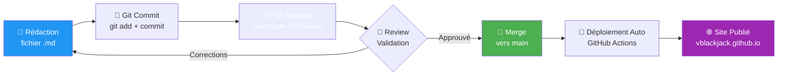

---
tags:
  - markdown
  - documentation
  - git
  - mkdocs
  - contribution
---

# Docs-as-Code & Guide Markdown

**Documentation as Code** : Traiter la documentation comme du code source pour une collaboration moderne et efficace.

---

!!! success "Pourquoi Ce Guide ?"
    Vos collègues peuvent contribuer à ShellBook **sans être développeurs** ! Ce guide explique comment rédiger et soumettre de la documentation en utilisant Markdown et Git.

---

## La Philosophie Docs-as-Code

### Les 3 Piliers

| Pilier | Avantage | Outil |
|--------|----------|-------|
| **📝 Versioning** | Historique complet des modifications | Git |
| **👥 Collaboration** | Revues de code (Pull Requests) | GitHub |
| **🤖 Automation** | Déploiement automatique | GitHub Actions |

### Le Workflow Docs-as-Code



**Avantages vs Documentation Traditionnelle (Word, Confluence) :**

- ✅ **Pas de conflits de versions** : Git gère les fusions automatiquement
- ✅ **Travail hors ligne** : Rédigez sans connexion internet
- ✅ **Revue par les pairs** : Comme pour le code, la documentation est relue
- ✅ **Historique complet** : Qui a modifié quoi et quand (git blame)
- ✅ **Automatisation** : Le site se met à jour automatiquement après merge

---

## Markdown : Les Bases (Cheat Sheet)

### Syntaxe Essentielle

| Élément | Syntaxe Markdown | Rendu |
|---------|------------------|-------|
| **Titre Niveau 1** | `# Titre` | <h1 style="font-size: 1.5em;">Titre</h1> |
| **Titre Niveau 2** | `## Sous-titre` | <h2 style="font-size: 1.2em;">Sous-titre</h2> |
| **Gras** | `**texte gras**` | **texte gras** |
| **Italique** | `*texte italique*` | *texte italique* |
| **Liste non ordonnée** | `- Item 1` | • Item 1 |
| **Liste ordonnée** | `1. Premier` | 1. Premier |
| **Lien** | `[Texte](url)` | [Texte](url) |
| **Code inline** | `` `code` `` | `code` |
| **Séparateur** | `---` | <hr style="border: 1px solid #ccc;"> |

### Bloc de Code

**Syntaxe :**
````markdown
```bash
# Ceci est un commentaire
ls -lah
```text
````

**Rendu :**
```bash
# Ceci est un commentaire
ls -lah
```

**Langages Supportés :** `bash`, `python`, `yaml`, `json`, `powershell`, `dockerfile`, `sql`, etc.

### Tableaux

**Syntaxe :**
```markdown
| Colonne 1 | Colonne 2 | Colonne 3 |
|-----------|-----------|-----------|
| Donnée A  | Donnée B  | Donnée C  |
| Donnée D  | Donnée E  | Donnée F  |
```

**Rendu :**

| Colonne 1 | Colonne 2 | Colonne 3 |
|-----------|-----------|-----------|
| Donnée A  | Donnée B  | Donnée C  |
| Donnée D  | Donnée E  | Donnée F  |

---

## Les "Super-Pouvoirs" MkDocs Material

### Admonitions (Encadrés)

Les admonitions attirent l'attention sur des informations importantes.

#### Types d'Admonitions

**Syntaxe :**
```markdown
!!! tip "Astuce Pratique"
    Contenu de l'astuce...

!!! warning "Attention"
    Contenu de l'avertissement...

!!! danger "Danger - Risque de Perte de Données"
    Contenu critique...

!!! info "Information"
    Contenu informatif...

!!! example "Exemple"
    Contenu de l'exemple...
```

**Rendu :**

!!! tip "Astuce Pratique"
    Utilisez `Ctrl+K` (ou `Cmd+K` sur Mac) pour rechercher rapidement dans la documentation.

!!! warning "Attention"
    Cette commande nécessite des privilèges root. Utilisez `sudo` avec précaution.

!!! danger "Danger - Risque de Perte de Données"
    Cette opération est **irréversible**. Assurez-vous d'avoir une sauvegarde avant de continuer.

!!! info "Information"
    Cette fonctionnalité est disponible depuis Kubernetes 1.28+.

!!! example "Exemple Pratique"
    ```bash
    # Redémarrer un service systemd
    sudo systemctl restart nginx
    ```

#### Admonitions Pliables

**Syntaxe :**
```markdown
??? tip "Astuce Avancée (Cliquez pour Déplier)"
    Contenu masqué par défaut...
```

**Rendu :**

??? tip "Astuce Avancée (Cliquez pour Déplier)"
    Vous pouvez utiliser `git log --oneline --graph --all` pour visualiser l'historique Git en mode graphique dans le terminal.

### Onglets (Tabs)

Parfait pour afficher des variantes (Linux/Windows, Docker/Podman, etc.).

**Syntaxe :**
```markdown
=== "Linux"

    ```bash
    sudo systemctl status sshd
    ```text

=== "Windows"

    ```powershell
    Get-Service -Name sshd
    ```text

=== "macOS"

    ```bash
    sudo launchctl list | grep ssh
    ```text
```

**Rendu :**

=== "Linux"

    ```bash
    sudo systemctl status sshd
    ```

=== "Windows"

    ```powershell
    Get-Service -Name sshd
    ```

=== "macOS"

    ```bash
    sudo launchctl list | grep ssh
    ```

### Diagrammes Mermaid

Créez des diagrammes directement dans le Markdown (flowcharts, séquences, graphes).

**Syntaxe :**
````markdown
```mermaid
graph LR
    A[Client] --> B[Load Balancer]
    B --> C[Server 1]
    B --> D[Server 2]
    B --> E[Server 3]
```text
````

**Rendu :**

```mermaid
graph LR
    A[Client] --> B[Load Balancer]
    B --> C[Server 1]
    B --> D[Server 2]
    B --> E[Server 3]

    style A fill:#2196F3,color:#fff
    style B fill:#f44336,color:#fff
    style C fill:#4CAF50,color:#fff
    style D fill:#4CAF50,color:#fff
    style E fill:#4CAF50,color:#fff
```

**Autres Types de Diagrammes :**

- `flowchart` : Organigrammes
- `sequenceDiagram` : Diagrammes de séquence UML
- `classDiagram` : Diagrammes de classes
- `graph TD` : Graphes orientés (Top-Down)

### Icons & Emojis

**Syntaxe :**
```markdown
:fontawesome-brands-linux: Linux
:material-kubernetes: Kubernetes
:octicons-check-16: Validé
```

**Rendu :**

:fontawesome-brands-linux: Linux
:material-kubernetes: Kubernetes
:octicons-check-16: Validé

**Librairies disponibles :** FontAwesome, Material Design Icons, Octicons

---

## Structure Standard d'une Page ShellBook

### Template Copy-Paste

Utilisez ce modèle pour créer une nouvelle page :

```markdown
---
tags:
  - tag1
  - tag2
  - tag3
---

# Titre Explicite et Descriptif

Description courte du sujet (1-2 phrases). Expliquez POURQUOI cette page existe.

---

## Prérequis

- Prérequis 1
- Prérequis 2

## Section Principale

Contenu détaillé...

### Sous-section

Exemples pratiques...

```bash
# Commande exemple
command --option value
```text

!!! tip "Astuce"
    Conseil pratique lié à cette section.

---

## Dépannage

### Erreur Courante 1

**Symptôme :** Description de l'erreur

**Cause :** Explication

**Solution :**
```bash
# Commande de résolution
fix-command
```text

---

## Référence Rapide

```bash
# === COMMANDES ESSENTIELLES ===
command1 --help          # Description
command2 -v              # Description
```text
```

### Checklist Avant Publication

Avant de soumettre votre Pull Request, vérifiez :

- [ ] **Tags YAML** : Frontmatter avec 3-5 tags pertinents
- [ ] **Titre clair** : Commence par un verbe d'action ou nom descriptif
- [ ] **Description** : Première phrase explique le contexte
- [ ] **Code testé** : Toutes les commandes ont été testées
- [ ] **Admonitions** : Warnings pour les opérations dangereuses
- [ ] **Exemples** : Au moins un exemple concret par section
- [ ] **Référence rapide** : Section finale avec commandes essentielles

---

## Workflow de Contribution Détaillé

### Étape 1 : Cloner le Repo (Une Fois)

```bash
# Cloner le dépôt
git clone https://github.com/VBlackJack/ShellBook.git
cd ShellBook
```

### Étape 2 : Créer une Branche

```bash
# Créer une branche pour votre contribution
git checkout -b docs/nom-de-votre-guide

# Exemple :
git checkout -b docs/add-postgresql-guide
```

### Étape 3 : Rédiger le Contenu

**Option 1 : Nouveau Fichier**

```bash
# Créer le fichier dans le bon dossier
touch docs/linux/votre-guide.md

# Ouvrir avec votre éditeur
code docs/linux/votre-guide.md
```

**Option 2 : Modifier un Fichier Existant**

```bash
# Ouvrir le fichier existant
code docs/linux/ssh-hardening.md
```

### Étape 4 : Prévisualiser Localement (Optionnel)

```bash
# Installer les dépendances (première fois)
pip install -r requirements.txt

# Lancer le serveur de développement
mkdocs serve

# Ouvrir http://localhost:8000 dans votre navigateur
```

!!! tip "Prévisualisation en Temps Réel"
    `mkdocs serve` recharge automatiquement la page à chaque modification. Idéal pour voir le rendu final !

### Étape 5 : Commit & Push

```bash
# Ajouter vos modifications
git add docs/linux/votre-guide.md

# Créer un commit avec un message descriptif
git commit -m "docs(linux): Ajout guide PostgreSQL HA avec Patroni"

# Pousser vers GitHub
git push origin docs/add-postgresql-guide
```

### Étape 6 : Créer une Pull Request

1. Aller sur **https://github.com/VBlackJack/ShellBook/pulls**
2. Cliquer sur **"New Pull Request"**
3. Sélectionner votre branche : `docs/add-postgresql-guide`
4. Remplir le formulaire :
   - **Titre** : `docs(linux): Ajout guide PostgreSQL HA avec Patroni`
   - **Description** : Expliquez ce que vous avez ajouté/modifié

**Exemple de Description de PR :**

```markdown
## Changements

- Ajout d'un nouveau guide PostgreSQL avec Patroni
- Couvre l'installation, la configuration HA et le failover automatique
- Diagrammes Mermaid pour l'architecture

## Checklist

- [x] Code testé sur Ubuntu 22.04
- [x] Admonitions pour les opérations critiques
- [x] Section "Référence Rapide" ajoutée
```

5. Cliquer sur **"Create Pull Request"**

### Étape 7 : Review & Merge

- Un mainteneur va relire votre contribution
- Discussions possibles dans les commentaires
- Une fois approuvé : **Merge** → Déploiement automatique ! 🚀

---

## Outils Recommandés

### Éditeur : Visual Studio Code

**Installation :**

=== "Linux"

    ```bash
    # Snap (Ubuntu/Debian)
    sudo snap install code --classic

    # Arch Linux
    yay -S visual-studio-code-bin
    ```

=== "Windows"

    Télécharger : [https://code.visualstudio.com/](https://code.visualstudio.com/)

=== "macOS"

    ```bash
    brew install --cask visual-studio-code
    ```

### Extensions VS Code Essentielles

| Extension | Description | Installation |
|-----------|-------------|--------------|
| **Markdown All in One** | Autocomplétion, prévisualisation, table des matières | `code --install-extension yzhang.markdown-all-in-one` |
| **Markdown Preview Mermaid** | Prévisualiser diagrammes Mermaid | `code --install-extension bierner.markdown-mermaid` |
| **markdownlint** | Détection d'erreurs de syntaxe | `code --install-extension davidanson.vscode-markdownlint` |
| **GitLens** | Visualiser l'historique Git ligne par ligne | `code --install-extension eamodio.gitlens` |

### Raccourcis VS Code Utiles

| Raccourci | Action |
|-----------|--------|
| `Ctrl+Shift+V` | Prévisualiser Markdown |
| `Ctrl+K V` | Prévisualisation côte-à-côte |
| `Ctrl+Space` | Autocomplétion |
| `Alt+Shift+F` | Formater le document |

### Alternatives

**Éditeurs Markdown :**

- **Typora** : WYSIWYG (ce que vous voyez est ce que vous obtenez)
- **Obsidian** : Parfait pour notes personnelles + Markdown
- **MarkText** : Open-source, léger

**Clients Git GUI :**

- **GitHub Desktop** : Simple, idéal pour débutants
- **GitKraken** : Puissant, visualisation de branches
- **Sourcetree** : Gratuit, interface Atlassian

---

## Exemples Pratiques

### Exemple 1 : Ajouter une Commande Bash

**Objectif :** Documenter la commande `netstat` pour débogage réseau.

**Fichier cible :** `docs/linux/network-management.md`

**Ajout :**

```markdown
### Netstat : Ports en Écoute

```bash
# Lister tous les ports TCP en écoute avec le processus
sudo netstat -tlnp

# Filtrer par port spécifique (ex: port 80)
sudo netstat -tlnp | grep :80
```text

**Explication des options :**

- `-t` : TCP seulement
- `-l` : Ports en écoute (listening)
- `-n` : Afficher les adresses numériques (pas de résolution DNS)
- `-p` : Afficher le PID et nom du processus
```

### Exemple 2 : Ajouter un Scénario de Dépannage

**Objectif :** Documenter une erreur SSH fréquente.

**Fichier cible :** `docs/linux/ssh-hardening.md`

**Ajout :**

```markdown
## Dépannage

### Erreur : "Permission denied (publickey)"

**Symptôme :**

```
ssh user@server
Permission denied (publickey).
```text

**Causes possibles :**

1. Clé publique non présente dans `~/.ssh/authorized_keys` sur le serveur
2. Permissions incorrectes sur le dossier `.ssh` ou le fichier `authorized_keys`
3. Mauvaise clé privée utilisée

**Solutions :**

```bash
# 1. Vérifier que la clé publique est bien sur le serveur
ssh user@server "cat ~/.ssh/authorized_keys"

# 2. Corriger les permissions (sur le serveur)
chmod 700 ~/.ssh
chmod 600 ~/.ssh/authorized_keys

# 3. Spécifier explicitement la clé privée
ssh -i ~/.ssh/id_rsa_custom user@server
```bash

!!! tip "Debugging SSH"
    Utilisez `ssh -vvv user@server` pour obtenir un log détaillé de la connexion.
```

### Exemple 3 : Créer une Nouvelle Page Complète

**Objectif :** Ajouter un guide Redis.

**Fichier :** `docs/linux/redis-server.md`

**Contenu :**

```markdown
---
tags:
  - redis
  - database
  - cache
  - nosql
---

# Redis : Cache & Pub/Sub Haute Performance

Redis est une base de données clé-valeur en mémoire utilisée comme cache, message broker et base de données persistante.

---

## Installation

=== "Ubuntu/Debian"

    ```bash
    sudo apt update
    sudo apt install redis-server
    ```text

=== "RHEL/CentOS"

    ```bash
    sudo dnf install redis
    ```text

## Configuration de Base

```bash
# Fichier de configuration
sudo nano /etc/redis/redis.conf

# Paramètres importants
bind 127.0.0.1            # Écoute localhost uniquement
port 6379                 # Port par défaut
requirepass YourPassword  # Activer l'authentification
maxmemory 256mb           # Limite RAM
maxmemory-policy allkeys-lru  # Éviction LRU
```text

## Commandes Redis Essentielles

```bash
# Connexion au serveur Redis
redis-cli

# Authentification (si requirepass activé)
AUTH YourPassword

# Opérations clé-valeur
SET mykey "Hello Redis"
GET mykey
DEL mykey

# Lister toutes les clés (ATTENTION en production !)
KEYS *

# Statistiques serveur
INFO
```text

!!! warning "KEYS * en Production"
    La commande `KEYS *` bloque le serveur sur des bases volumineuses. Utilisez `SCAN` en production.

## Référence Rapide

```bash
# === GESTION SERVEUR ===
sudo systemctl start redis       # Démarrer
sudo systemctl status redis      # Statut
redis-cli PING                   # Test connectivité (répond PONG)

# === COMMANDES REDIS ===
SET key value                    # Définir clé
GET key                          # Récupérer valeur
DEL key                          # Supprimer clé
EXISTS key                       # Vérifier existence
EXPIRE key seconds               # TTL (expiration)
```text
```

**Ensuite :**

1. Ajouter `docs/linux/redis-server.md` dans `mkdocs.yml` (section Linux)
2. Commit : `git commit -m "docs(linux): Ajout guide Redis server"`
3. Push + Pull Request

---

## FAQ Contributeurs

### "Je ne connais pas Git, c'est compliqué ?"

**Non !** Vous avez besoin de 5 commandes seulement :

```bash
git clone <url>          # Télécharger le projet (1 fois)
git checkout -b <nom>    # Créer une branche
git add <fichier>        # Ajouter vos modifications
git commit -m "message"  # Sauvegarder localement
git push origin <nom>    # Envoyer vers GitHub
```

**Ressource :** Notre guide [Git for SysOps](git-sysops.md) couvre les bases.

### "Et si je casse quelque chose ?"

**Impossible de casser le site en production** ! Votre contribution passe par une Pull Request qui est :

1. **Reviewée** par un mainteneur
2. **Testée** automatiquement par GitHub Actions
3. **Mergée** seulement après validation

### "Je peux contribuer sans installer MkDocs ?"

**Oui !** Vous pouvez :

1. Éditer directement sur GitHub (bouton "Edit" sur chaque page)
2. Utiliser l'éditeur web de GitHub avec prévisualisation Markdown basique
3. Soumettre une Pull Request sans build local

**Inconvénient :** Pas de prévisualisation du rendu final (admonitions, diagrammes).

### "Combien de temps avant que ma contribution soit en ligne ?"

**~5 minutes** après le merge de la Pull Request :

- **Review** : Quelques heures à 2 jours (selon disponibilité)
- **Merge** : Instantané
- **Build & Deploy** : 3-5 minutes automatiques

---

## Bonnes Pratiques

### 1. Écrire pour un Public Technique

✅ **BON :**
```markdown
## Redémarrer Nginx après modification de la configuration

```bash
sudo nginx -t                    # Valider la syntaxe
sudo systemctl reload nginx      # Recharger sans downtime
```text
```

❌ **MAUVAIS :**
```markdown
## Nginx

Vous pouvez redémarrer nginx si vous voulez.
```

### 2. Commandes Testées

✅ **BON :**
```markdown
```bash
# Testé sur Ubuntu 22.04 LTS
sudo apt install postgresql-14
```text
```

❌ **MAUVAIS :**
```markdown
```bash
# Je pense que ça marche
sudo apt install postgres
```text
```

### 3. Contexte Avant l'Action

✅ **BON :**
```markdown
!!! danger "Attention : Perte de Données"
    Cette commande supprime **définitivement** la base de données.

```bash
DROP DATABASE production;
```text
```

❌ **MAUVAIS :**
```markdown
```bash
DROP DATABASE production;
```text
```

### 4. Exemples Réalistes

✅ **BON :**
```markdown
```bash
# Backup de la base "customers" avant migration
pg_dump -U postgres -d customers > customers_backup_$(date +%Y%m%d).sql
```text
```

❌ **MAUVAIS :**
```markdown
```bash
# Backup
pg_dump database > backup.sql
```text
```

---

## Ressources Externes

| Ressource | Description |
|-----------|-------------|
| [Markdown Guide](https://www.markdownguide.org/) | Référence complète Markdown |
| [MkDocs Material](https://squidfunk.github.io/mkdocs-material/) | Documentation officielle du thème |
| [Mermaid Live Editor](https://mermaid.live/) | Éditeur en ligne pour diagrammes |
| [GitHub Docs - Markdown](https://docs.github.com/en/get-started/writing-on-github) | Guide Markdown GitHub |

---

## Référence Rapide

```bash
# === WORKFLOW GIT ===
git clone https://github.com/VBlackJack/ShellBook.git   # Cloner
cd ShellBook
git checkout -b docs/mon-guide                          # Nouvelle branche
# ... Rédiger docs/linux/mon-guide.md ...
git add docs/linux/mon-guide.md
git commit -m "docs(linux): Ajout guide XYZ"
git push origin docs/mon-guide                          # Push vers GitHub
# → Créer Pull Request sur GitHub

# === PRÉVISUALISATION LOCALE ===
pip install -r requirements.txt                         # Installation (1 fois)
mkdocs serve                                            # Serveur local
# Ouvrir http://localhost:8000
```

---

!!! success "Prêt à Contribuer ?"
    Vous avez maintenant toutes les clés pour enrichir ShellBook ! N'hésitez pas à poser des questions dans les Pull Requests.

    **Premier pas recommandé :** Corriger une typo ou ajouter un exemple à une page existante pour vous familiariser avec le workflow.
