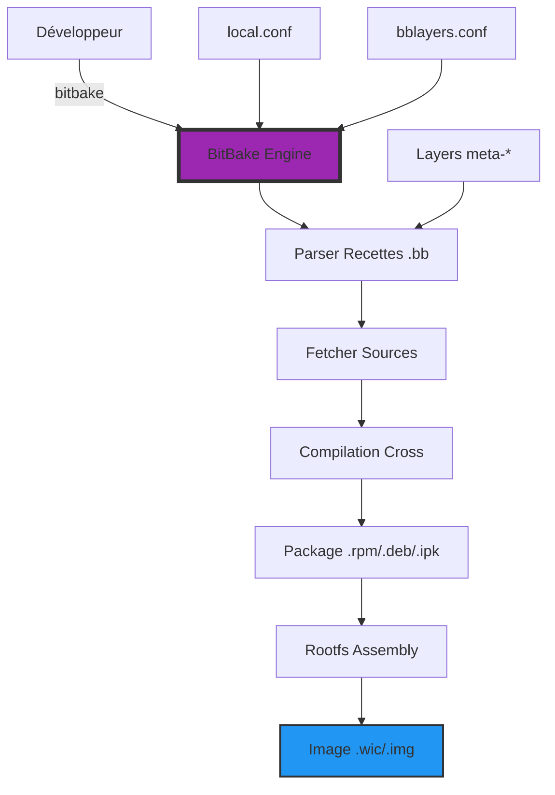

---
tags:
  - embedded
  - yocto
  - linux
  - iot
  - bitbake
---

# Embedded Linux & Yocto Project

Le monde de l'embarqué (IoT, Automobile, Industriel) ne s'administre pas comme des serveurs Web. Ici, on construit son propre OS sur mesure.


## 1. Concepts de l'Embarqué

### Contraintes Spécifiques
*   **Ressources limitées** : CPU faible, peu de RAM (256 Mo), stockage Flash limité (eMMC).
*   **Temps Réel** : Nécessité parfois de patchs `PREEMPT_RT` pour garantir des temps de réponse déterministes.
*   **Robustesse** : Le système doit résister aux coupures de courant brutales (Filesystems Read-Only, A/B Partitioning pour les updates).
*   **Cross-Compilation** : On compile l'OS sur un PC puissant (x86_64) pour une cible faible (ARM, RISC-V).

### Bootloader Spécifique
Pas de GRUB ici. Le roi est **U-Boot**.
*   Initialise le hardware bas niveau (DDR, Clocks).
*   Charge le kernel et le Device Tree (DTB).

---

## 2. Yocto Project : La Factory d'OS

[Yocto](https://www.yoctoproject.org/) n'est pas une distribution Linux. C'est un outil pour **créer** une distribution Linux.

### Architecture du Build System



Le processus complet :
1. **BitBake** parse les recettes et résout les dépendances
2. Les sources sont téléchargées (Git, HTTP, FTP)
3. Cross-compilation avec la toolchain générée
4. Packaging au format souhaité (RPM, DEB, IPK)
5. Assemblage du rootfs avec tous les paquets
6. Génération de l'image finale bootable

### Architecture de Yocto
*   **Poky** : La distribution de référence.
*   **OpenEmbedded** : Le système de build sous-jacent.
*   **BitBake** : Le moteur d'exécution (l'équivalent de `make` mais pour tout un OS).

### Le Concept de "Recette" (Recipe)
Tout est défini dans des fichiers `.bb` (BitBake). Une recette dit :
1.  Où télécharger le code source (Git, Tarball).
2.  Comment le compiler (Autotools, CMake, Meson).
3.  Comment l'installer dans l'image finale.

### Les Layers (Couches)
Yocto fonctionne par couches empilées (`meta-*`).
*   `meta-poky` : Base du système.
*   `meta-raspberrypi` : Support matériel (BSP) pour RPi.
*   `meta-qt5` : Support du framework Qt.
*   `meta-mon-projet` : Vos propres applications et configurations.

> **Avantage** : Modularité totale. On ajoute une couche pour supporter une nouvelle carte électronique sans toucher au reste.

---

## 3. Exemple Complet de Recette BitBake

Voici une recette complète pour une application C simple :

```python
# myapp_1.0.bb
SUMMARY = "Mon application embarquée"
DESCRIPTION = "Application de monitoring système pour devices IoT"
LICENSE = "MIT"
LIC_FILES_CHKSUM = "file://LICENSE;md5=abc123def456"

# Source depuis Git
SRC_URI = "git://github.com/monentreprise/myapp.git;protocol=https;branch=main \
           file://myapp.service \
           file://myapp.conf"

SRCREV = "${AUTOREV}"

S = "${WORKDIR}/git"

# Dépendances de compilation
DEPENDS = "libgpiod systemd"

# Dépendances runtime
RDEPENDS:${PN} = "bash procps"

inherit cmake systemd

# Configuration CMake
EXTRA_OECMAKE = "-DENABLE_TESTS=OFF -DCMAKE_BUILD_TYPE=Release"

# Fichiers systemd
SYSTEMD_SERVICE:${PN} = "myapp.service"
SYSTEMD_AUTO_ENABLE = "enable"

do_install:append() {
    install -d ${D}${sysconfdir}/myapp
    install -m 0644 ${WORKDIR}/myapp.conf ${D}${sysconfdir}/myapp/

    install -d ${D}${systemd_unitdir}/system
    install -m 0644 ${WORKDIR}/myapp.service ${D}${systemd_unitdir}/system
}

FILES:${PN} += "${sysconfdir}/myapp/myapp.conf"
```

---

## 4. Structure d'un Layer Personnalisé

```bash
meta-monprojet/
├── conf/
│   ├── layer.conf                    # Configuration du layer
│   └── machine/
│       └── mondevice.conf            # Configuration machine custom
├── recipes-core/
│   ├── images/
│   │   └── monprojet-image.bb        # Image personnalisée
│   └── packagegroups/
│       └── packagegroup-monprojet.bb # Groupe de paquets
├── recipes-apps/
│   └── myapp/
│       ├── myapp_1.0.bb
│       └── files/
│           ├── myapp.service
│           └── myapp.conf
├── recipes-kernel/
│   └── linux/
│       └── linux-yocto_%.bbappend    # Patch du kernel
└── README.md
```

**Fichier layer.conf minimal** :

```python
# conf/layer.conf
BBPATH .= ":${LAYERDIR}"

BBFILES += "${LAYERDIR}/recipes-*/*/*.bb \
            ${LAYERDIR}/recipes-*/*/*.bbappend"

BBFILE_COLLECTIONS += "monprojet"
BBFILE_PATTERN_monprojet = "^${LAYERDIR}/"
BBFILE_PRIORITY_monprojet = "10"

LAYERDEPENDS_monprojet = "core raspberrypi"
LAYERSERIES_COMPAT_monprojet = "kirkstone langdale"
```

---

## 5. BitBake Commands Avancés

```bash
# Initialiser l'environnement
source oe-init-build-env

# Compiler une image complète
bitbake core-image-minimal

# Compiler seulement un paquet
bitbake strace

# Nettoyer un paquet
bitbake -c clean strace

# Nettoyer complètement (y compris downloads)
bitbake -c cleanall strace

# Ouvrir un shell dans l'environnement de compilation (DevShell)
bitbake -c devshell strace

# Générer le SDK pour les développeurs d'app
bitbake core-image-minimal -c populate_sdk

# Afficher les dépendances
bitbake -g core-image-minimal && dot -Tpng task-depends.dot -o deps.png

# Lister toutes les recettes disponibles
bitbake-layers show-recipes

# Trouver quelle layer fournit une recette
bitbake-layers show-layers
bitbake-layers show-recipes "strace"

# Voir les variables d'une recette
bitbake -e myapp | grep "^WORKDIR="
```

---

## 6. Customisation d'Image via local.conf

Le fichier `conf/local.conf` contrôle la configuration du build :

```bash
# Machine cible
MACHINE = "raspberrypi4-64"

# Optimisations CPU
DEFAULTTUNE = "cortexa72"

# Nombre de threads parallèles
BB_NUMBER_THREADS = "8"
PARALLEL_MAKE = "-j 8"

# Ajouter des paquets à l'image
IMAGE_INSTALL:append = " python3 vim htop nginx"

# Features système
DISTRO_FEATURES:append = " systemd wifi bluetooth"
DISTRO_FEATURES:remove = "sysvinit"

# Utiliser systemd comme init
VIRTUAL-RUNTIME_init_manager = "systemd"
VIRTUAL-RUNTIME_initscripts = "systemd-compat-units"

# Licence acceptée
LICENSE_FLAGS_ACCEPTED = "commercial"

# Partage des téléchargements et cache
DL_DIR = "/mnt/yocto-downloads"
SSTATE_DIR = "/mnt/yocto-sstate-cache"

# Générer SDK avec image
EXTRA_IMAGE_FEATURES += "dev-pkgs tools-sdk debug-tweaks"

# Format de l'image
IMAGE_FSTYPES = "wic.gz wic.bmap tar.xz"
```

---

## 7. Exemple Raspberry Pi

### Setup Complet pour RPi 4

```bash
# 1. Télécharger Poky
git clone -b kirkstone git://git.yoctoproject.org/poky.git
cd poky

# 2. Ajouter le layer Raspberry Pi
git clone -b kirkstone https://github.com/agherzan/meta-raspberrypi.git

# 3. Initialiser l'environnement
source oe-init-build-env rpi-build

# 4. Ajouter le layer à bblayers.conf
bitbake-layers add-layer ../meta-raspberrypi

# 5. Éditer conf/local.conf
cat >> conf/local.conf <<EOF
MACHINE = "raspberrypi4-64"
ENABLE_UART = "1"
ENABLE_I2C = "1"
ENABLE_SPI = "1"
GPU_MEM = "128"
EOF

# 6. Compiler l'image
bitbake rpi-test-image

# 7. Flasher sur carte SD (Linux)
sudo dd if=tmp/deploy/images/raspberrypi4-64/rpi-test-image-raspberrypi4-64.wic.gz \
    | gunzip | sudo dd of=/dev/sdX bs=4M status=progress
```

---

## 8. Debugging Build Issues

### DevShell : Environnement de Debug Interactif

```bash
# Ouvrir un shell dans le contexte de compilation
bitbake -c devshell myapp

# Vous êtes maintenant dans $WORKDIR avec :
# - Sources décompressées dans $S
# - Variables d'environnement de cross-compilation
# - Toolchain configurée

# Compiler manuellement pour tester
cd $S
$CC -o myapp main.c $CFLAGS $LDFLAGS
```

### Analyser les Logs de Build

```bash
# Logs détaillés
cat tmp/work/cortexa72-poky-linux/myapp/1.0-r0/temp/log.do_compile

# Voir toutes les tâches exécutées
bitbake -c listtasks myapp

# Forcer la recompilation d'une tâche
bitbake -c compile -f myapp

# Variables d'environnement complètes
bitbake -e myapp > myapp-env.txt
```

### Problèmes Courants

| Erreur | Cause | Solution |
|--------|-------|----------|
| `No provider for 'xyz'` | Dépendance manquante | Ajouter le layer contenant la recette |
| `Checksum mismatch` | Source modifiée | Recalculer avec `md5sum` et mettre à jour |
| `QA Issue: Files/directories were installed but not shipped` | `FILES` incomplet | Ajouter chemins dans `FILES:${PN}` |
| `Task do_fetch failed` | Problème réseau/Git | Vérifier `SRC_URI`, credentials Git |

---

## 9. Buildroot : Alternative Légère

### Comparaison Yocto vs Buildroot

| Critère | Yocto Project | Buildroot |
|---------|--------------|-----------|
| **Complexité** | Élevée (courbe d'apprentissage) | Simple (Makefile, menuconfig) |
| **Flexibilité** | Maximale (layers, recipes) | Limitée |
| **Updates runtime** | Supporté (mender, swupdate) | Plus complexe |
| **Taille communauté** | Très large (industrie) | Moyenne |
| **Cas d'usage** | Produits commerciaux, maintenance long terme | Prototypes, projets simples |

### Quick Start Buildroot

```bash
# Télécharger Buildroot
git clone https://github.com/buildroot/buildroot.git
cd buildroot

# Choisir une configuration pré-définie
make raspberrypi4_64_defconfig

# Menuconfig pour customiser
make menuconfig

# Compiler (plus rapide que Yocto)
make -j$(nproc)

# Image dans output/images/
ls -lh output/images/sdcard.img
```

---

## 10. Cross-Compilation SDK

### Génération du SDK

Le SDK permet aux développeurs d'applications de compiler sans installer tout Yocto :

```bash
# Générer le SDK depuis une image
bitbake core-image-minimal -c populate_sdk

# SDK généré dans :
# tmp/deploy/sdk/poky-glibc-x86_64-core-image-minimal-cortexa72-raspberrypi4-64-toolchain-4.0.sh

# Installer le SDK
./poky-glibc-x86_64-*-toolchain-*.sh
# Installation dans /opt/poky/4.0/
```

### Utilisation du SDK

```bash
# Sourcer l'environnement SDK
source /opt/poky/4.0/environment-setup-cortexa72-poky-linux

# Les variables sont automatiquement configurées :
echo $CC              # aarch64-poky-linux-gcc
echo $CXX             # aarch64-poky-linux-g++
echo $CFLAGS          # Flags optimisés pour la cible
echo $LDFLAGS         # Linker flags
echo $PKG_CONFIG_PATH # Pour trouver les libs

# Compiler une application
$CC -o hello hello.c

# CMake avec SDK
cmake -DCMAKE_TOOLCHAIN_FILE=$OECORE_NATIVE_SYSROOT/usr/share/cmake/OEToolchainConfig.cmake ..
make

# Déployer sur la cible
scp hello root@192.168.1.100:/usr/local/bin/
```

---

## 11. Best Practices

### Organisation des Layers

```bash
# ✅ GOOD : Séparation claire
meta-monentreprise/          # Company layer
├── recipes-connectivity/     # Networking apps
├── recipes-industrial/       # Industrial protocols (Modbus, OPC-UA)
└── recipes-security/         # Hardening, certificates

meta-monprojet-bsp/          # Hardware-specific
├── conf/machine/
└── recipes-bsp/

meta-monprojet-app/          # Applications métier
└── recipes-apps/

# ❌ BAD : Tout dans un seul layer
meta-fourretout/
└── recipes-*/
    ├── kernel/
    ├── apps/
    └── drivers/  # Mélange BSP + App = maintenance difficile
```

### Reproducibilité des Builds

```bash
# Fixer les versions Git avec SRCREV (pas AUTOREV en prod)
SRCREV = "a1b2c3d4e5f6..."

# Utiliser des tags Git plutôt que branches
SRC_URI = "git://...;tag=v1.2.3"

# Documenter les versions des layers
cat > manifest.xml <<EOF
<manifest>
  <project name="poky" revision="kirkstone" />
  <project name="meta-raspberrypi" revision="kirkstone" />
</manifest>
EOF

# Utiliser repo tool de Google pour synchroniser
repo init -u https://git.example.com/manifest.git
repo sync
```

### Sécurité et Hardening

```bash
# local.conf : Enable security features
EXTRA_IMAGE_FEATURES += "read-only-rootfs"

# Supprimer les outils de debug en production
IMAGE_FEATURES:remove = "debug-tweaks tools-debug"

# Activer les protections de compilation
SECURITY_CFLAGS = "-fstack-protector-strong -D_FORTIFY_SOURCE=2"
SECURITY_LDFLAGS = "-Wl,-z,relro,-z,now"

# Scanner les CVE connus
inherit cve-check
```

### Performance et Optimisation

```bash
# Cache partagé entre builds
SSTATE_DIR = "/mnt/fast-ssd/sstate-cache"
DL_DIR = "/mnt/fast-ssd/downloads"

# Parallélisation maximale
BB_NUMBER_THREADS = "${@oe.utils.cpu_count()}"
PARALLEL_MAKE = "-j ${@oe.utils.cpu_count()}"

# Désactiver la génération de paquets si non utilisés
PACKAGE_CLASSES = "package_ipk"  # Au lieu de "package_ipk package_rpm package_deb"

# Monitoring du build
bitbake -g -u taskexp core-image-minimal  # Interface graphique des tasks
```

---

## Ressources

*   [Yocto Project Documentation](https://docs.yoctoproject.org/)
*   [OpenEmbedded Layer Index](https://layers.openembedded.org/)
*   [Buildroot Manual](https://buildroot.org/docs.html)
*   [U-Boot Documentation](https://u-boot.readthedocs.io/)
*   [Embedded Linux Wiki](https://elinux.org/)
