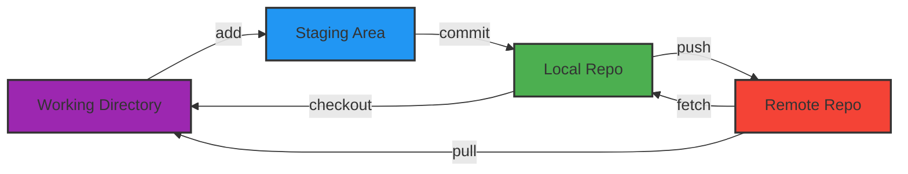

---
tags:
  - git
  - cheatsheet
  - version-control
---

# Git Cheatsheet Visuelle

Une référence rapide pour les commandes Git, organisée par flux de travail.

## 1. Démarrage & Configuration

| Action | Commande | Description |
|--------|----------|-------------|
| **Initialiser** | `git init` | Créer un dépôt local dans le dossier actuel. |
| **Cloner** | `git clone <url>` | Copier un dépôt distant. |
| **Identité** | `git config --global user.name "Moi"` | Définir son nom. |
| **Email** | `git config --global user.email "moi@mail.com"` | Définir son email. |
| **Lister Config** | `git config --list` | Voir tous les paramètres. |

## 2. Le Cycle de Vie (Workflow)

| Zone | Action | Commande |
|------|--------|----------|
| **Préparer** | Stage | `git add <fichier>` ou `git add .` |
| **Valider** | Commit | `git commit -m "Message"` |
| **Corriger** | Amend | `git commit --amend` (Modifie le dernier commit) |
| **Annuler** | Unstage | `git restore --staged <fichier>` |
| **Jeter** | Discard | `git restore <fichier>` (Perte des modifs !) |

## 3. Branches & Fusion

| Action | Commande |
|--------|----------|
| **Lister** | `git branch` (Locales) / `git branch -a` (Toutes) |
| **Créer** | `git branch <nom>` |
| **Changer** | `git checkout <nom>` ou `git switch <nom>` |
| **Créer+Changer**| `git checkout -b <nom>` |
| **Fusionner** | `git merge <branche>` (Fusionne <branche> DANS courante) |
| **Supprimer** | `git branch -d <nom>` (Safe) / `-D` (Force) |

## 4. Dépôts Distants (Remote)

| Action | Commande |
|--------|----------|
| **Lier** | `git remote add origin <url>` |
| **Vérifier** | `git remote -v` |
| **Envoyer** | `git push -u origin main` (Premier push) |
| **Mettre à jour**| `git pull` (Fetch + Merge) |
| **Récupérer** | `git fetch` (Télécharge sans fusionner) |

## 5. Inspection & Historique

| Action | Commande |
|--------|----------|
| **État** | `git status` (À faire tout le temps !) |
| **Différences** | `git diff` (Non-stagé) / `git diff --staged` (Stagé) |
| **Historique** | `git log --oneline --graph` |
| **Qui a fait ça?**| `git blame <fichier>` |

---

## Mémo : Les 3 États d'un Fichier

1.  **Modified** : Modifié mais pas encore prêt à être commité.
2.  **Staged** : Marqué pour le prochain commit.
3.  **Committed** : Sauvegardé en sécurité dans la base locale.
