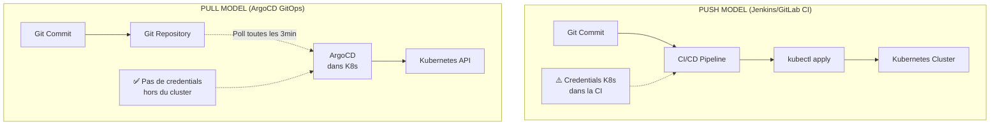

---
tags:
  - gitops
  - argocd
  - helm
  - kubernetes
  - cd
---

# GitOps: ArgoCD & Helm

La source de vérité est Git. Le cluster se synchronise tout seul. Fini les `kubectl apply` manuels.


---

## Concepts GitOps : La Théorie

### État Désiré vs État Actuel

**GitOps = Réconciliation continue entre Git (source de vérité) et Kubernetes (réalité).**


| Avant (ClickOps) | Après (GitOps) |
|------------------|----------------|
| ❌ Qui a fait quoi ? | ✅ Git = Source de vérité unique |
| ❌ Impossible de rollback | ✅ Rollback trivial (git revert) |
| ❌ Pas d'audit trail | ✅ Audit natif (git log) |
| ❌ État réel ≠ documenté | ✅ Self-healing automatique |

---

### Pull vs Push : La Différence Sécuritaire



**Pourquoi Pull est plus sécurisé :**

| Aspect | Push (CI/CD) | Pull (GitOps) |
|--------|--------------|---------------|
| **Credentials K8s** | ❌ Stockés dans CI (Jenkins, GitLab) | ✅ Restent dans le cluster |
| **Surface d'attaque** | ❌ CI compromise = Cluster compromise | ✅ CI compromise ≠ Cluster compromise |
| **Accès réseau** | ❌ CI doit accéder au cluster | ✅ Cluster pull depuis Git (one-way) |
| **Audit** | ⚠️ Logs CI + Logs K8s | ✅ Git history uniquement |
| **Conformité** | ⚠️ Secrets éparpillés | ✅ Principe du moindre privilège |

!!! tip "GitOps = Security by Design"
    Dans un modèle GitOps pur :

    - **Personne** ne fait de `kubectl apply` manuel
    - **Personne** (même les admins) n'a les credentials K8s en dehors du cluster
    - **Seul** ArgoCD (qui tourne dans K8s) peut modifier le cluster
    - **Tout** passe par Git → Code review → Merge → Déploiement automatique

---

### Les 4 Principes du GitOps

1. **Déclaratif** : Décrivez l'état désiré (YAML), pas les étapes
2. **Versionné** : Git comme source de vérité unique
3. **Pull automatique** : Un agent dans le cluster synchronise l'état
4. **Réconciliation continue** : Correction automatique de la dérive

### Boucle de Synchronisation GitOps


---

## Packaging avec Helm : Ne Réinventez pas la Roue

### Pourquoi Helm ?

**Helm = Package manager pour Kubernetes (comme apt pour Debian, yum pour RHEL).**


---

### Structure d'un Chart Helm

```bash
mychart/
├── Chart.yaml              # Métadonnées du chart
├── values.yaml             # Valeurs par défaut
├── values-dev.yaml         # Override pour dev
├── values-prod.yaml        # Override pour prod
├── charts/                 # Dépendances (sous-charts)
└── templates/              # Templates YAML
    ├── deployment.yaml
    ├── service.yaml
    ├── ingress.yaml
    ├── configmap.yaml
    ├── _helpers.tpl        # Fonctions réutilisables
    └── NOTES.txt           # Message affiché après install
```

---

### Chart.yaml (Métadonnées)

```yaml
apiVersion: v2
name: myapp
description: Application web Nginx custom
type: application
version: 1.0.0        # Version du chart (incrémentée à chaque changement)
appVersion: "1.23.0"  # Version de l'application packagée

maintainers:
  - name: DevOps Team
    email: devops@company.com

dependencies:
  - name: postgresql
    version: 12.1.0
    repository: https://charts.bitnami.com/bitnami
    condition: postgresql.enabled
```

---

### values.yaml (Configuration)

```yaml
# Valeurs par défaut (modifiables par values-dev.yaml, values-prod.yaml)

replicaCount: 2

image:
  repository: nginx
  tag: "1.23-alpine"
  pullPolicy: IfNotPresent

service:
  type: ClusterIP
  port: 80

ingress:
  enabled: true
  className: nginx
  hosts:
    - host: myapp.company.com
      paths:
        - path: /
          pathType: Prefix
  tls:
    - secretName: myapp-tls
      hosts:
        - myapp.company.com

resources:
  limits:
    cpu: 500m
    memory: 512Mi
  requests:
    cpu: 250m
    memory: 256Mi

autoscaling:
  enabled: false
  minReplicas: 2
  maxReplicas: 10
  targetCPUUtilizationPercentage: 80
```

---

### templates/deployment.yaml (Template)

```yaml
apiVersion: apps/v1
kind: Deployment
metadata:
  name: {{ include "myapp.fullname" . }}
  labels:
    {{- include "myapp.labels" . | nindent 4 }}
spec:
  {{- if not .Values.autoscaling.enabled }}
  replicas: {{ .Values.replicaCount }}
  {{- end }}
  selector:
    matchLabels:
      {{- include "myapp.selectorLabels" . | nindent 6 }}
  template:
    metadata:
      labels:
        {{- include "myapp.selectorLabels" . | nindent 8 }}
    spec:
      containers:
      - name: {{ .Chart.Name }}
        image: "{{ .Values.image.repository }}:{{ .Values.image.tag | default .Chart.AppVersion }}"
        imagePullPolicy: {{ .Values.image.pullPolicy }}
        ports:
        - name: http
          containerPort: 80
          protocol: TCP
        resources:
          {{- toYaml .Values.resources | nindent 10 }}
```

---

### Commandes Helm Essentielles

```bash
# ============================================================
# CRÉER UN CHART
# ============================================================

# Créer un nouveau chart depuis un template
helm create myapp

# ============================================================
# DÉVELOPPEMENT & DEBUG
# ============================================================

# Générer le YAML final (sans déployer)
helm template myapp ./myapp

# Générer avec des values spécifiques
helm template myapp ./myapp -f values-prod.yaml

# Vérifier la syntaxe (lint)
helm lint ./myapp

# Voir les différences avant upgrade
helm diff upgrade myapp ./myapp -f values-prod.yaml

# ============================================================
# INSTALLATION
# ============================================================

# Installer le chart
helm install myapp ./myapp

# Installer avec override de values
helm install myapp ./myapp -f values-prod.yaml

# Installer avec values inline
helm install myapp ./myapp --set replicaCount=5

# Installer en mode dry-run (simulation)
helm install myapp ./myapp --dry-run --debug

# ============================================================
# GESTION
# ============================================================

# Lister les releases installées
helm list
helm list -n production

# Voir l'historique des déploiements
helm history myapp

# Upgrader une release
helm upgrade myapp ./myapp -f values-prod.yaml

# Rollback vers une révision précédente
helm rollback myapp 3

# Désinstaller
helm uninstall myapp

# ============================================================
# REGISTRY (Artifact Hub)
# ============================================================

# Rechercher un chart
helm search hub nginx

# Ajouter un repo
helm repo add bitnami https://charts.bitnami.com/bitnami

# Installer depuis un repo
helm install mypostgres bitnami/postgresql

# Lister les repos configurés
helm repo list

# Mettre à jour les repos
helm repo update
```

!!! tip "Debug avec `helm template`"
    **Toujours** utiliser `helm template` pour voir le YAML généré avant de déployer :

    ```bash
    helm template myapp ./myapp -f values-prod.yaml > output.yaml
    less output.yaml  # Vérifier le résultat
    ```

    Cela évite les surprises et permet de déboguer les erreurs de templating.

---

## ArgoCD : The GitOps Engine

### Qu'est-ce qu'ArgoCD ?

**ArgoCD = Continuous Delivery pour Kubernetes via GitOps.**


---

### Installation d'ArgoCD

```bash
# Créer le namespace
kubectl create namespace argocd

# Installer ArgoCD (version stable)
kubectl apply -n argocd -f https://raw.githubusercontent.com/argoproj/argo-cd/stable/manifests/install.yaml

# Attendre que tous les pods soient prêts
kubectl wait --for=condition=ready pod --all -n argocd --timeout=300s

# Récupérer le mot de passe admin initial
kubectl -n argocd get secret argocd-initial-admin-secret -o jsonpath="{.data.password}" | base64 -d

# Port-forward pour accéder à l'UI
kubectl port-forward svc/argocd-server -n argocd 8080:443

# Accéder à l'UI : https://localhost:8080
# Username: admin
# Password: (mot de passe récupéré ci-dessus)
```

!!! tip "Accès à l'Interface Web"
    L'UI ArgoCD est **indispensable** pour :

    - Visualiser l'état des applications (synced, out-of-sync)
    - Voir les différences entre Git et le cluster (diff)
    - Déclencher un sync manuel
    - Voir l'historique des déploiements
    - Diagnostiquer les problèmes (logs, events)

    **Port-forward** est pratique pour le développement :
    ```bash
    kubectl port-forward svc/argocd-server -n argocd 8080:443
    ```

    **Production** : Exposer via Ingress avec certificat TLS.

---

### Le Concept d'Application ArgoCD

**Une Application ArgoCD = Lien entre Git (source) et K8s (destination).**

```yaml
apiVersion: argoproj.io/v1alpha1
kind: Application
metadata:
  name: myapp-production
  namespace: argocd
spec:
  # SOURCE : Où se trouve le code ?
  source:
    repoURL: https://github.com/company/myapp.git
    targetRevision: main         # Branche, tag, ou commit SHA
    path: k8s/overlays/prod      # Chemin dans le repo

    # Si Helm chart
    helm:
      valueFiles:
        - values-prod.yaml
      parameters:
        - name: replicaCount
          value: "5"

  # DESTINATION : Où déployer ?
  destination:
    server: https://kubernetes.default.svc  # Cluster K8s
    namespace: production

  # SYNC POLICY : Comment synchroniser ?
  syncPolicy:
    automated:
      prune: true      # Supprimer les ressources retirées de Git
      selfHeal: true   # Corriger les modifications manuelles

    syncOptions:
      - CreateNamespace=true  # Créer le namespace si absent

  # PROJECT : Isolation logique (RBAC)
  project: default
```

---

### Sync Policy : Les 3 Options Critiques

```yaml
syncPolicy:
  automated:
    prune: true      # 🗑️ PRUNE
    selfHeal: true   # 🩹 SELF-HEAL
```

**1. Automated (Continuous Deployment)**

```yaml
automated: {}
```

- ✅ ArgoCD sync automatiquement dès qu'un commit est push sur Git
- ✅ Pas besoin de cliquer "Sync" manuellement
- ⚠️ Attention en production (préférer manual pour contrôle)

---

**2. SelfHeal (Killer Feature)**

```yaml
automated:
  selfHeal: true
```

**Scénario :**

```bash
# Un dev impatient fait un kubectl edit deployment...
kubectl edit deployment myapp -n production
# Change replicas: 2 → replicas: 10

# 3 minutes plus tard, ArgoCD détecte la dérive
# ArgoCD : "Git dit replicas: 2, cluster dit replicas: 10"
# ArgoCD → Rollback automatique vers replicas: 2

# Résultat : Self-healing automatique
```

**Avantages :**

- ✅ Empêche la dérive de configuration
- ✅ Force la discipline (tout passe par Git)
- ✅ Pas de "hotfix" qui restent en prod

**Quand désactiver :**

- ⚠️ Environnements de développement (laisser les devs expérimenter)
- ⚠️ Debugging en production (temporairement)

---

**3. Prune (Nettoyage Automatique)**

```yaml
automated:
  prune: true
```

**Scénario :**

```bash
# Étape 1 : Git contient
deployment.yaml
service.yaml
configmap.yaml

# Étape 2 : Dev supprime configmap.yaml de Git et commit
git rm configmap.yaml
git commit -m "Remove unused configmap"

# Étape 3 : ArgoCD sync
# Sans prune: ConfigMap reste dans le cluster (orphelin)
# Avec prune: ConfigMap est SUPPRIMÉ du cluster
```

**Avantages :**

- ✅ Cluster propre (pas de ressources orphelines)
- ✅ Git = source de vérité absolue

**Dangers :**

- ⚠️ Peut supprimer des ressources critiques si mal configuré
- ⚠️ Activer **UNIQUEMENT** si vous êtes sûr de votre config

!!! danger "Prune avec Précaution"
    `prune: true` peut être **destructif**.

    **Recommandation :**
    - Dev/Staging : `prune: true` (liberté d'expérimentation)
    - Production : `prune: false` (sécurité avant tout)

---

### Créer une Application ArgoCD

**Méthode 1 : Via l'UI**

1. Se connecter à ArgoCD UI
2. Cliquer sur "+ NEW APP"
3. Remplir le formulaire
4. Cliquer sur "CREATE"

**Méthode 2 : Via CLI (Recommandé)**

```bash
# Installer le CLI ArgoCD
curl -sSL -o /usr/local/bin/argocd https://github.com/argoproj/argo-cd/releases/latest/download/argocd-linux-amd64
chmod +x /usr/local/bin/argocd

# Login
argocd login localhost:8080 --username admin --password <PASSWORD>

# Créer une application
argocd app create myapp \
  --repo https://github.com/company/myapp.git \
  --path k8s/overlays/prod \
  --dest-server https://kubernetes.default.svc \
  --dest-namespace production \
  --sync-policy automated \
  --auto-prune \
  --self-heal
```

**Méthode 3 : Via Manifeste YAML (GitOps pur)**

```yaml
# application.yaml
apiVersion: argoproj.io/v1alpha1
kind: Application
metadata:
  name: myapp
  namespace: argocd
spec:
  source:
    repoURL: https://github.com/company/myapp.git
    targetRevision: main
    path: k8s/overlays/prod
  destination:
    server: https://kubernetes.default.svc
    namespace: production
  syncPolicy:
    automated:
      prune: true
      selfHeal: true
    syncOptions:
      - CreateNamespace=true
```

```bash
# Appliquer l'Application
kubectl apply -f application.yaml
```

---

## Pattern "App of Apps" : Production Scale

### Le Problème

**Scénario :** Microservices avec 50 applications.

```
frontend → Application ArgoCD
backend-api → Application ArgoCD
backend-worker → Application ArgoCD
database → Application ArgoCD
cache → Application ArgoCD
...
(45 autres applications)
```

**Problème :**

- ❌ Créer 50 applications à la main dans ArgoCD UI ? Fastidieux.
- ❌ Maintenir 50 manifestes `Application` individuels ? Galère.

---

### La Solution : App of Apps

**Principe :** Une "Application Mère" qui pointe vers un dossier Git contenant les définitions des "Applications Filles".


---

### Implémentation : Structure du Repo Git

```bash
gitops-repo/
├── apps/                       # Définitions des applications
│   ├── frontend.yaml
│   ├── backend-api.yaml
│   ├── backend-worker.yaml
│   └── database.yaml
│
├── charts/                     # Helm charts (optionnel)
│   ├── frontend/
│   ├── backend-api/
│   └── backend-worker/
│
└── bootstrap/                  # App of Apps
    └── root-app.yaml
```

---

### bootstrap/root-app.yaml (App of Apps)

```yaml
apiVersion: argoproj.io/v1alpha1
kind: Application
metadata:
  name: root-app
  namespace: argocd
spec:
  source:
    repoURL: https://github.com/company/gitops-repo.git
    targetRevision: main
    path: apps/  # Pointe vers le dossier contenant les applications filles

  destination:
    server: https://kubernetes.default.svc
    namespace: argocd  # Les applications sont créées dans argocd namespace

  syncPolicy:
    automated:
      prune: true      # Supprimer les apps retirées du dossier apps/
      selfHeal: true
```

---

### apps/frontend.yaml (Application Fille)

```yaml
apiVersion: argoproj.io/v1alpha1
kind: Application
metadata:
  name: frontend
  namespace: argocd
spec:
  source:
    repoURL: https://github.com/company/gitops-repo.git
    targetRevision: main
    path: charts/frontend
    helm:
      valueFiles:
        - values-prod.yaml

  destination:
    server: https://kubernetes.default.svc
    namespace: production

  syncPolicy:
    automated:
      prune: true
      selfHeal: true
    syncOptions:
      - CreateNamespace=true
```

---

### apps/backend-api.yaml (Application Fille)

```yaml
apiVersion: argoproj.io/v1alpha1
kind: Application
metadata:
  name: backend-api
  namespace: argocd
spec:
  source:
    repoURL: https://github.com/company/gitops-repo.git
    targetRevision: main
    path: charts/backend-api
    helm:
      valueFiles:
        - values-prod.yaml

  destination:
    server: https://kubernetes.default.svc
    namespace: production

  syncPolicy:
    automated:
      prune: true
      selfHeal: true
    syncOptions:
      - CreateNamespace=true
```

---

### Bootstrap du Cluster

```bash
# Étape 1 : Installer ArgoCD
kubectl create namespace argocd
kubectl apply -n argocd -f https://raw.githubusercontent.com/argoproj/argo-cd/stable/manifests/install.yaml

# Étape 2 : Appliquer l'App of Apps
kubectl apply -f bootstrap/root-app.yaml

# Étape 3 : Attendre que ArgoCD déploie toutes les applications
kubectl get applications -n argocd

# Output attendu :
# NAME           SYNC STATUS   HEALTH STATUS
# root-app       Synced        Healthy
# frontend       Synced        Healthy
# backend-api    Synced        Healthy
# backend-worker Synced        Healthy
# database       Synced        Healthy
```

**Résultat :** En appliquant **une seule** Application (root-app), ArgoCD déploie automatiquement toutes les applications définies dans `apps/`.

---

### Avantages du Pattern "App of Apps"

| Avantage | Description |
|----------|-------------|
| **Scalabilité** | Gérer 100+ applications aussi facilement qu'une seule |
| **GitOps pur** | Ajouter une nouvelle app = commit un YAML dans `apps/` |
| **Bootstrap rapide** | Reconstruire un cluster = `kubectl apply -f root-app.yaml` |
| **Isolation** | Chaque équipe peut avoir son propre sous-dossier `apps/team-A/` |
| **Rollback global** | `git revert` pour annuler un déploiement de plusieurs apps |

---

## Exemple Complet : De A à Z

### Objectif

Déployer une application Nginx custom avec ArgoCD et Helm.

**Architecture :**

1. Repo Git avec un Chart Helm
2. Application ArgoCD qui pointe vers ce chart
3. Déploiement automatique dans le cluster

---

### Étape 1 : Créer le Chart Helm

```bash
# Créer un chart Helm
helm create nginx-custom

cd nginx-custom
```

**Structure générée :**

```
nginx-custom/
├── Chart.yaml
├── values.yaml
└── templates/
    ├── deployment.yaml
    ├── service.yaml
    ├── ingress.yaml
    └── _helpers.tpl
```

**Éditer `values.yaml` :**

```yaml
replicaCount: 3

image:
  repository: nginx
  tag: "1.25-alpine"
  pullPolicy: IfNotPresent

service:
  type: ClusterIP
  port: 80

ingress:
  enabled: true
  className: nginx
  hosts:
    - host: nginx.company.local
      paths:
        - path: /
          pathType: Prefix

resources:
  limits:
    cpu: 200m
    memory: 256Mi
  requests:
    cpu: 100m
    memory: 128Mi
```

---

### Étape 2 : Pousser le Chart vers Git

```bash
git init
git add .
git commit -m "Initial commit: Nginx custom chart"
git remote add origin https://github.com/company/nginx-custom.git
git push -u origin main
```

---

### Étape 3 : Créer l'Application ArgoCD

**Fichier `argocd-application.yaml` :**

```yaml
apiVersion: argoproj.io/v1alpha1
kind: Application
metadata:
  name: nginx-custom
  namespace: argocd
spec:
  # SOURCE : Git repository
  source:
    repoURL: https://github.com/company/nginx-custom.git
    targetRevision: main
    path: .  # Chart Helm à la racine du repo

    helm:
      valueFiles:
        - values.yaml

  # DESTINATION : Cluster K8s
  destination:
    server: https://kubernetes.default.svc
    namespace: default

  # SYNC POLICY
  syncPolicy:
    automated:
      prune: true
      selfHeal: true
    syncOptions:
      - CreateNamespace=true

  # PROJECT
  project: default
```

---

### Étape 4 : Déployer l'Application

```bash
# Appliquer l'Application ArgoCD
kubectl apply -f argocd-application.yaml

# Vérifier l'état
kubectl get application -n argocd nginx-custom

# Output attendu :
# NAME           SYNC STATUS   HEALTH STATUS
# nginx-custom   Synced        Healthy
```

---

### Étape 5 : Vérifier le Déploiement

```bash
# Vérifier les ressources créées
kubectl get all -n default

# Output attendu :
# NAME                                READY   STATUS    RESTARTS   AGE
# pod/nginx-custom-5d4f8c6b7d-abc12   1/1     Running   0          2m
# pod/nginx-custom-5d4f8c6b7d-def34   1/1     Running   0          2m
# pod/nginx-custom-5d4f8c6b7d-ghi56   1/1     Running   0          2m
#
# NAME                   TYPE        CLUSTER-IP      EXTERNAL-IP   PORT(S)
# service/nginx-custom   ClusterIP   10.96.123.45    <none>        80/TCP
#
# NAME                           READY   UP-TO-DATE   AVAILABLE   AGE
# deployment.apps/nginx-custom   3/3     3            3           2m
```

---

### Étape 6 : Tester le Self-Heal

```bash
# Simuler une modification manuelle
kubectl scale deployment nginx-custom --replicas=10

# Attendre 3 minutes (intervalle de sync ArgoCD)
# ArgoCD détecte que replicas: 10 != replicas: 3 (Git)
# ArgoCD rollback automatique vers replicas: 3

# Vérifier
kubectl get deployment nginx-custom
# READY   UP-TO-DATE   AVAILABLE   AGE
# 3/3     3            3           5m
```

**Résultat :** Self-healing automatique !

---

### Étape 7 : Modifier l'Application (GitOps)

```bash
# Modifier values.yaml
sed -i 's/replicaCount: 3/replicaCount: 5/' values.yaml

# Commit et push
git add values.yaml
git commit -m "Scale to 5 replicas"
git push

# ArgoCD détecte le changement automatiquement (3 minutes max)
# Déploiement automatique vers 5 replicas

# Vérifier
kubectl get deployment nginx-custom
# READY   UP-TO-DATE   AVAILABLE   AGE
# 5/5     5            5           10m
```

**Résultat :** Déploiement 100% GitOps, zéro `kubectl apply` manuel !

---

## Référence Rapide

### CLI ArgoCD

```bash
# ============================================================
# AUTHENTIFICATION
# ============================================================

# Login
argocd login <ARGOCD_SERVER> --username admin --password <PASSWORD>

# Changer le mot de passe
argocd account update-password

# ============================================================
# GESTION DES APPLICATIONS
# ============================================================

# Lister les applications
argocd app list

# Voir les détails d'une application
argocd app get myapp

# Créer une application
argocd app create myapp \
  --repo https://github.com/company/myapp.git \
  --path k8s/ \
  --dest-server https://kubernetes.default.svc \
  --dest-namespace production

# Synchroniser une application
argocd app sync myapp

# Forcer la synchronisation (même si synced)
argocd app sync myapp --force

# Voir la différence entre Git et le cluster
argocd app diff myapp

# Voir l'historique
argocd app history myapp

# Rollback vers une révision précédente
argocd app rollback myapp 3

# Supprimer une application
argocd app delete myapp

# ============================================================
# LOGS & DEBUG
# ============================================================

# Voir les logs d'une application
argocd app logs myapp

# Voir les événements
argocd app events myapp

# ============================================================
# SYNC POLICY
# ============================================================

# Activer le sync automatique
argocd app set myapp --sync-policy automated

# Activer self-heal
argocd app set myapp --self-heal

# Activer prune
argocd app set myapp --auto-prune
```

---

### CLI Helm

```bash
# ============================================================
# CHARTS
# ============================================================

# Créer un chart
helm create myapp

# Valider un chart
helm lint ./myapp

# Générer le YAML final
helm template myapp ./myapp
helm template myapp ./myapp -f values-prod.yaml

# ============================================================
# INSTALLATION
# ============================================================

# Installer
helm install myapp ./myapp
helm install myapp ./myapp -f values-prod.yaml
helm install myapp ./myapp --set replicaCount=5

# Dry-run
helm install myapp ./myapp --dry-run --debug

# ============================================================
# GESTION
# ============================================================

# Lister les releases
helm list
helm list -n production

# Voir l'historique
helm history myapp

# Upgrader
helm upgrade myapp ./myapp -f values-prod.yaml

# Rollback
helm rollback myapp 3

# Désinstaller
helm uninstall myapp

# ============================================================
# REPOSITORIES
# ============================================================

# Ajouter un repo
helm repo add bitnami https://charts.bitnami.com/bitnami

# Rechercher un chart
helm search hub nginx
helm search repo nginx

# Mettre à jour les repos
helm repo update

# Installer depuis un repo
helm install mydb bitnami/postgresql
```

---

### Variables Helm dans Templates

```yaml
# Accéder aux valeurs de values.yaml
{{ .Values.replicaCount }}
{{ .Values.image.repository }}
{{ .Values.service.port }}

# Accéder aux métadonnées du chart
{{ .Chart.Name }}
{{ .Chart.Version }}
{{ .Chart.AppVersion }}

# Accéder aux informations de la release
{{ .Release.Name }}
{{ .Release.Namespace }}
{{ .Release.Service }}

# Fonctions utiles
{{ .Values.replicaCount | quote }}           # Ajouter des quotes
{{ .Values.resources | toYaml | nindent 10 }} # Convertir en YAML et indenter
{{ include "myapp.fullname" . }}             # Appeler un helper

# Conditions
{{- if .Values.ingress.enabled }}
  # Contenu si enabled=true
{{- end }}

# Boucles
{{- range .Values.hosts }}
- host: {{ . }}
{{- end }}
```

---

### Référence Rapide Complète

```bash
# ============================================================
# ARGOCD : INSTALLATION
# ============================================================

kubectl create namespace argocd
kubectl apply -n argocd -f https://raw.githubusercontent.com/argoproj/argo-cd/stable/manifests/install.yaml
kubectl port-forward svc/argocd-server -n argocd 8080:443

# Mot de passe admin
kubectl -n argocd get secret argocd-initial-admin-secret -o jsonpath="{.data.password}" | base64 -d

# ============================================================
# ARGOCD : CRÉER UNE APPLICATION
# ============================================================

kubectl apply -f - <<EOF
apiVersion: argoproj.io/v1alpha1
kind: Application
metadata:
  name: myapp
  namespace: argocd
spec:
  source:
    repoURL: https://github.com/company/myapp.git
    targetRevision: main
    path: k8s/
  destination:
    server: https://kubernetes.default.svc
    namespace: production
  syncPolicy:
    automated:
      prune: true
      selfHeal: true
EOF

# ============================================================
# HELM : CRÉER & DÉPLOYER
# ============================================================

helm create myapp
helm install myapp ./myapp -f values-prod.yaml
helm list
helm upgrade myapp ./myapp -f values-prod.yaml
helm rollback myapp 2

# ============================================================
# GITOPS WORKFLOW
# ============================================================

# 1. Modifier le code
vim values.yaml

# 2. Commit & Push
git add values.yaml
git commit -m "Update config"
git push

# 3. ArgoCD sync automatique (3 min max)
# Ou manuel :
argocd app sync myapp

# 4. Vérifier
kubectl get all -n production
```
