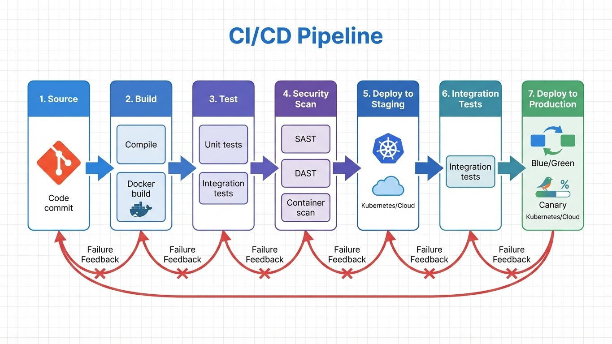

---
tags:
  - devops
  - automation
  - containers
  - infrastructure-as-code
---

# DevOps & Automatisation

Pratiques DevOps, conteneurisation, orchestration et Infrastructure as Code.

## Pipeline CI/CD

---

    - 🛠️ Méthodologie:
      - [Méthodologies (Lean/Agile)](methodologies.md)
      - [Git SysOps](git-sysops.md)
      - [Docs-as-Code](docs-as-code.md)
      - [Outils IT](productivity-it-tools.md)

## Conteneurs

| Article | Description | Niveau |
|---------|-------------|--------|
| [Docker Advanced](docker-advanced.md) | Docker avancé : multi-stage, optimisation | :material-star::material-star: |
| [Podman Containers](podman-containers.md) | Conteneurs rootless avec Podman | :material-star::material-star: |

## Kubernetes

| Article | Description | Niveau |
|---------|-------------|--------|
| [Kubernetes Survival](kubernetes-survival.md) | Guide de survie Kubernetes | :material-star: |
| [Kubernetes CKA](kubernetes-cka.md) | Préparation certification CKA | :material-star::material-star::material-star: |
| [Kubernetes Networking](kubernetes-networking.md) | Réseau Kubernetes en détail | :material-star::material-star::material-star: |
| [Kubernetes Helm](kubernetes-helm.md) | Package manager Helm | :material-star::material-star: |
| [Kubernetes Kustomize](kubernetes-kustomize.md) | Customisation avec Kustomize | :material-star::material-star: |
| [Kubernetes Operators](kubernetes-operators.md) | Développement d'opérateurs | :material-star::material-star::material-star: |

## CI/CD & GitOps

| Article | Description | Niveau |
|---------|-------------|--------|
| [CI/CD GitLab](cicd-gitlab.md) | Pipelines GitLab CI/CD | :material-star::material-star: |
| [CI/CD GitHub Actions](cicd-github-actions.md) | Workflows GitHub Actions | :material-star::material-star: |
| [GitOps ArgoCD](gitops-argocd.md) | GitOps avec ArgoCD | :material-star::material-star::material-star: |

## Observabilité

| Article | Description | Niveau |
|---------|-------------|--------|
| [Observability Stack](observability-stack.md) | Stack complète d'observabilité | :material-star::material-star: |
| [Observability Advanced](observability-advanced.md) | Observabilité avancée | :material-star::material-star::material-star: |
| [Loki Logging](loki-logging.md) | Centralisation logs avec Loki | :material-star::material-star: |

## Architecture & Réseau

| Article | Description | Niveau |
|---------|-------------|--------|
| [Load Balancing](load-balancing.md) | Répartition de charge | :material-star::material-star: |
| [Modern Networking](modern-networking.md) | Réseau moderne et SDN | :material-star::material-star::material-star: |

---

## Sous-sections

- [Ansible](ansible/index.md) - Automatisation avec Ansible
- [Terraform](terraform/index.md) - Infrastructure as Code
- [Pipelines CI/CD](pipelines/index.md) - Templates et guides CI/CD

## Voir Aussi

- [Scripts Bash](../scripts/bash/index.md)
- [Scripts Python](../scripts/python/index.md)
- [Formation DevOps Foundation](../formations/devops-foundation/index.md)
