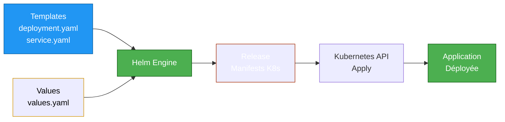

---
tags:
  - helm
  - kubernetes
  - charts
  - templating
  - packaging
---

# Helm : Package Management

## Helm : Le Gestionnaire de Paquets Kubernetes

**Helm** est l'équivalent de `apt`, `yum` ou `brew` pour Kubernetes. Il permet de packager des applications complexes (Deployment + Service + ConfigMap + ...) en **Charts** réutilisables et versionnés.

### Architecture Helm



**Concepts clés :**

- **Chart** : Package (comme un `.deb` ou `.rpm`)
- **Template** : Manifests YAML avec variables Go Template
- **Values** : Fichier de configuration (valeurs par défaut + overrides)
- **Release** : Instance déployée d'un Chart (ex: `nginx-prod`, `nginx-staging`)

## Installation

```bash
# Sur Linux (via script officiel)
curl https://raw.githubusercontent.com/helm/helm/main/scripts/get-helm-3 | bash

# Sur macOS
brew install helm

# Sur Windows
choco install kubernetes-helm

# Vérifier
helm version
# version.BuildInfo{Version:"v3.14.0", ...}
```

## Gestion des Repos (Analogie apt/yum)

### Ajouter un Repo

```bash
# Ajouter le repo officiel Bitnami
helm repo add bitnami https://charts.bitnami.com/bitnami

# Ajouter le repo Prometheus
helm repo add prometheus-community https://prometheus-community.github.io/helm-charts

# Lister les repos configurés
helm repo list
# NAME                	URL
# bitnami             	https://charts.bitnami.com/bitnami
# prometheus-community	https://prometheus-community.github.io/helm-charts

# Mettre à jour les repos (comme apt update)
helm repo update
```

### Rechercher un Chart

```bash
# Chercher un chart dans tous les repos
helm search repo nginx
# NAME                 	CHART VERSION	APP VERSION	DESCRIPTION
# bitnami/nginx        	15.5.3       	1.25.3     	NGINX Open Source is a web server...

# Chercher avec regex
helm search repo database
# postgresql, mysql, mongodb, ...

# Voir les versions disponibles
helm search repo nginx --versions
```

### Télécharger un Chart (Sans Installer)

```bash
# Télécharger un chart (comme apt download)
helm pull bitnami/nginx

# Extraire l'archive
tar -xzf nginx-15.5.3.tgz

# Structure du chart :
ls nginx/
# Chart.yaml  values.yaml  templates/  charts/  README.md
```

## Installer une Application

### Installation Basique

```bash
# Installer nginx depuis le repo Bitnami
helm install my-nginx bitnami/nginx

# Résultat :
# NAME: my-nginx
# LAST DEPLOYED: Mon Jan 15 10:00:00 2025
# NAMESPACE: default
# STATUS: deployed
# REVISION: 1

# Vérifier le déploiement
kubectl get pods -l app.kubernetes.io/instance=my-nginx
# NAME                        READY   STATUS    RESTARTS   AGE
# my-nginx-5d7f8c9b6d-abcde   1/1     Running   0          30s
```

### Installation avec Values Personnalisés

```bash
# Voir les valeurs par défaut
helm show values bitnami/nginx > values-default.yaml

# Créer un fichier de values custom
cat > values-custom.yaml <<EOF
replicaCount: 3

resources:
  limits:
    cpu: 200m
    memory: 256Mi
  requests:
    cpu: 100m
    memory: 128Mi

service:
  type: LoadBalancer

ingress:
  enabled: true
  hostname: nginx.example.com
EOF

# Installer avec les values custom
helm install my-nginx bitnami/nginx -f values-custom.yaml

# Ou override une seule valeur
helm install my-nginx bitnami/nginx --set replicaCount=5
```

### Installation dans un Namespace Spécifique

```bash
# Créer le namespace
kubectl create namespace production

# Installer dans le namespace
helm install my-nginx bitnami/nginx \
  -f values-prod.yaml \
  --namespace production \
  --create-namespace
```

## Gestion du Cycle de Vie

### Lister les Releases

```bash
# Lister toutes les releases
helm list
# NAME     	NAMESPACE	REVISION	UPDATED                               	STATUS  	CHART        	APP VERSION
# my-nginx 	default  	1       	2025-01-15 10:00:00.123456 +0100 CET	deployed	nginx-15.5.3 	1.25.3

# Lister dans tous les namespaces
helm list --all-namespaces

# Lister avec filtres
helm list --filter 'nginx'
```

### Mettre à Jour une Release

```bash
# Modifier les values
vim values-custom.yaml
# replicaCount: 5  # Augmenté de 3 à 5

# Upgrade
helm upgrade my-nginx bitnami/nginx -f values-custom.yaml

# Vérifier
helm list
# REVISION : 2  (incrémenté)

kubectl get pods -l app.kubernetes.io/instance=my-nginx
# 5 pods maintenant
```

### Rollback

```bash
# Voir l'historique
helm history my-nginx
# REVISION	UPDATED                  	STATUS    	CHART        	APP VERSION	DESCRIPTION
# 1       	Mon Jan 15 10:00:00 2025	superseded	nginx-15.5.3 	1.25.3     	Install complete
# 2       	Mon Jan 15 10:30:00 2025	deployed  	nginx-15.5.3 	1.25.3     	Upgrade complete

# Rollback vers la révision précédente
helm rollback my-nginx 1

# Rollback automatique (dernière version fonctionnelle)
helm rollback my-nginx
```

### Désinstaller

```bash
# Supprimer la release
helm uninstall my-nginx

# Garder l'historique (pour debug)
helm uninstall my-nginx --keep-history

# Lister les releases supprimées
helm list --uninstalled
```

## Créer un Chart Custom

### Initialiser un Chart

```bash
# Créer la structure du chart
helm create myapp

# Structure générée :
tree myapp/
# myapp/
# ├── Chart.yaml          # Métadonnées du chart
# ├── values.yaml         # Valeurs par défaut
# ├── charts/             # Dépendances (sous-charts)
# ├── templates/          # Templates YAML
# │   ├── deployment.yaml
# │   ├── service.yaml
# │   ├── ingress.yaml
# │   ├── _helpers.tpl    # Fonctions réutilisables
# │   └── NOTES.txt       # Message post-install
# └── .helmignore
```

### Chart.yaml : Métadonnées

```yaml
apiVersion: v2
name: myapp
description: Application web custom
type: application
version: 0.1.0        # Version du chart
appVersion: "1.0.0"   # Version de l'application

maintainers:
  - name: DevOps Team
    email: devops@example.com

dependencies:
  - name: postgresql
    version: 12.x.x
    repository: https://charts.bitnami.com/bitnami
```

### values.yaml : Configuration

```yaml
replicaCount: 2

image:
  repository: nginx
  pullPolicy: IfNotPresent
  tag: "1.25.3"

service:
  type: ClusterIP
  port: 80

ingress:
  enabled: false
  className: nginx
  hosts:
    - host: myapp.example.com
      paths:
        - path: /
          pathType: Prefix

resources:
  limits:
    cpu: 100m
    memory: 128Mi
  requests:
    cpu: 50m
    memory: 64Mi
```

### templates/deployment.yaml : Template

```yaml
apiVersion: apps/v1
kind: Deployment
metadata:
  name: {{ include "myapp.fullname" . }}
  labels:
    {{- include "myapp.labels" . | nindent 4 }}
spec:
  replicas: {{ .Values.replicaCount }}
  selector:
    matchLabels:
      {{- include "myapp.selectorLabels" . | nindent 6 }}
  template:
    metadata:
      labels:
        {{- include "myapp.selectorLabels" . | nindent 8 }}
    spec:
      containers:
      - name: {{ .Chart.Name }}
        image: "{{ .Values.image.repository }}:{{ .Values.image.tag | default .Chart.AppVersion }}"
        imagePullPolicy: {{ .Values.image.pullPolicy }}
        ports:
        - name: http
          containerPort: 80
          protocol: TCP
        resources:
          {{- toYaml .Values.resources | nindent 10 }}
```

### Syntaxe Go Template

```yaml
# Variables
{{ .Values.replicaCount }}           # Accès à values.yaml
{{ .Chart.Name }}                    # Accès à Chart.yaml
{{ .Release.Name }}                  # Nom de la release

# Conditions
{{- if .Values.ingress.enabled }}
kind: Ingress
{{- end }}

# Boucles
{{- range .Values.ingress.hosts }}
- host: {{ .host }}
{{- end }}

# Fonctions
{{ include "myapp.fullname" . }}     # Appel fonction helper
{{ .Values.image.tag | default "latest" }}  # Pipe avec défaut
{{ .Values.resources | toYaml | nindent 10 }}  # Indent YAML
```

## Debugger & Valider

### Lint : Vérifier la Syntaxe

```bash
# Linter le chart
helm lint myapp/

# Résultat :
# ==> Linting myapp/
# [INFO] Chart.yaml: icon is recommended
# [INFO] values.yaml: file does not appear to be a valid YAML
#
# 1 chart(s) linted, 1 chart(s) failed
```

### Template : Voir le Rendu

```bash
# Afficher les manifests générés (sans installer)
helm template myapp myapp/

# Avec des values custom
helm template myapp myapp/ -f values-prod.yaml

# Voir seulement le deployment
helm template myapp myapp/ --show-only templates/deployment.yaml

# Sortir dans un fichier (pour review)
helm template myapp myapp/ > manifests.yaml
```

### Dry-Run : Simuler l'Installation

```bash
# Simuler l'install (envoie à l'API K8s mais n'applique pas)
helm install myapp myapp/ --dry-run --debug

# Sortie : Manifests + Messages de debug
```

## Best Practices

### 1. Versioning Sémantique

```yaml
# Chart.yaml
version: 1.2.3  # MAJOR.MINOR.PATCH
# MAJOR : Breaking changes
# MINOR : Nouvelles features (backward-compatible)
# PATCH : Bug fixes

appVersion: "2.5.1"  # Version de l'app (indépendante du chart)
```

### 2. Gestion des Secrets

#### Option 1 : Helm Secrets (avec SOPS)

```bash
# Installer le plugin
helm plugin install https://github.com/jkroepke/helm-secrets

# Chiffrer un fichier values
helm secrets enc values-secrets.yaml
# Crée values-secrets.yaml.dec (chiffré avec SOPS)

# Installer avec secrets
helm secrets install myapp myapp/ -f values-secrets.yaml
```

#### Option 2 : External Secrets Operator

```yaml
# values.yaml
externalSecrets:
  enabled: true
  backend: vault  # Ou AWS Secrets Manager, Azure Key Vault
  path: secret/data/myapp
```

#### Option 3 : Sealed Secrets

```bash
# Créer un secret sealed (safe pour Git)
kubectl create secret generic myapp-secret \
  --from-literal=password=supersecret \
  --dry-run=client -o yaml | \
  kubeseal -o yaml > sealed-secret.yaml

# Le sealed-secret peut être commité
git add sealed-secret.yaml
```

### 3. Structure de Values Multi-Environnements

```bash
# Structure de fichiers
myapp/
├── values.yaml         # Valeurs communes
├── values-dev.yaml     # Override dev
├── values-staging.yaml # Override staging
└── values-prod.yaml    # Override prod

# Déploiement dev
helm install myapp myapp/ -f myapp/values-dev.yaml

# Déploiement prod
helm install myapp myapp/ -f myapp/values-prod.yaml
```

### 4. Testing avec Helm Test

```yaml
# templates/tests/test-connection.yaml
apiVersion: v1
kind: Pod
metadata:
  name: "{{ include "myapp.fullname" . }}-test-connection"
  annotations:
    "helm.sh/hook": test
spec:
  containers:
  - name: wget
    image: busybox
    command: ['wget']
    args: ['{{ include "myapp.fullname" . }}:{{ .Values.service.port }}']
  restartPolicy: Never
```

```bash
# Lancer les tests
helm test myapp

# Résultat :
# NAME: myapp
# TEST SUITE:     myapp-test-connection
# Last Started:   Mon Jan 15 10:00:00 2025
# Last Completed: Mon Jan 15 10:00:05 2025
# Phase:          Succeeded
```

### 5. Hooks : Actions Pré/Post Déploiement

```yaml
# templates/pre-install-job.yaml
apiVersion: batch/v1
kind: Job
metadata:
  name: "{{ .Release.Name }}-db-migration"
  annotations:
    "helm.sh/hook": pre-install,pre-upgrade
    "helm.sh/hook-weight": "-5"
    "helm.sh/hook-delete-policy": before-hook-creation
spec:
  template:
    spec:
      containers:
      - name: migration
        image: myapp-migrations:latest
        command: ["python", "manage.py", "migrate"]
      restartPolicy: Never
```

**Types de hooks :**
- `pre-install` : Avant install
- `post-install` : Après install
- `pre-upgrade` : Avant upgrade
- `post-upgrade` : Après upgrade
- `pre-delete` : Avant delete
- `post-delete` : Après delete

## Chart Repository

### Packager un Chart

```bash
# Créer une archive
helm package myapp/
# Successfully packaged chart and saved it to: myapp-0.1.0.tgz

# Avec signature GPG
helm package myapp/ --sign --key 'DevOps Team' --keyring ~/.gnupg/secring.gpg
```

### Publier sur ChartMuseum

```bash
# Installer ChartMuseum
helm install chartmuseum chartmuseum/chartmuseum

# Upload un chart
curl --data-binary "@myapp-0.1.0.tgz" http://chartmuseum.example.com/api/charts

# Ajouter le repo
helm repo add mycompany http://chartmuseum.example.com
helm repo update

# Installer depuis le repo custom
helm install myapp mycompany/myapp
```

### Publier sur GitHub Pages

```bash
# Créer le repo
mkdir helm-charts
cd helm-charts
helm create mychart

# Packager
helm package mychart/

# Créer l'index
helm repo index . --url https://mycompany.github.io/helm-charts

# Push sur GitHub
git add .
git commit -m "Add mychart"
git push

# Activer GitHub Pages (Settings → Pages → Branch: main, Folder: / (root))

# Utiliser le repo
helm repo add mycompany https://mycompany.github.io/helm-charts
helm install mychart mycompany/mychart
```

## Dépannage

### Voir les Manifests d'une Release

```bash
# Manifests appliqués actuellement
helm get manifest my-nginx

# Voir toutes les informations
helm get all my-nginx
```

### Helm Status

```bash
# État de la release
helm status my-nginx

# Avec les resources K8s
helm status my-nginx --show-resources
```

### Logs des Hooks

```bash
# Si un hook échoue, voir les logs
kubectl logs job/myapp-pre-install-hook
```

## Checklist Production

```bash
# 1. Helm 3 installé (pas Helm 2 deprecated)
helm version | grep "v3"

# 2. Chart linté
helm lint myapp/

# 3. Template validé
helm template myapp myapp/ | kubectl apply --dry-run=client -f -

# 4. Tests définis
ls myapp/templates/tests/

# 5. Values multi-envs séparés
ls myapp/values-*.yaml

# 6. Secrets externalisés (pas de mots de passe en clair)
grep -r "password:" myapp/values.yaml  # Doit être vide

# 7. Resources limits/requests définis
helm template myapp myapp/ | grep -A 3 "resources:"
```

## Liens Utiles

- [Helm Documentation](https://helm.sh/docs/)
- [Artifact Hub (Charts)](https://artifacthub.io/)
- [Helm Best Practices](https://helm.sh/docs/chart_best_practices/)
- [Helm Secrets Plugin](https://github.com/jkroepke/helm-secrets)
