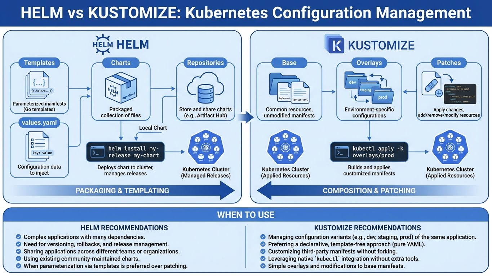
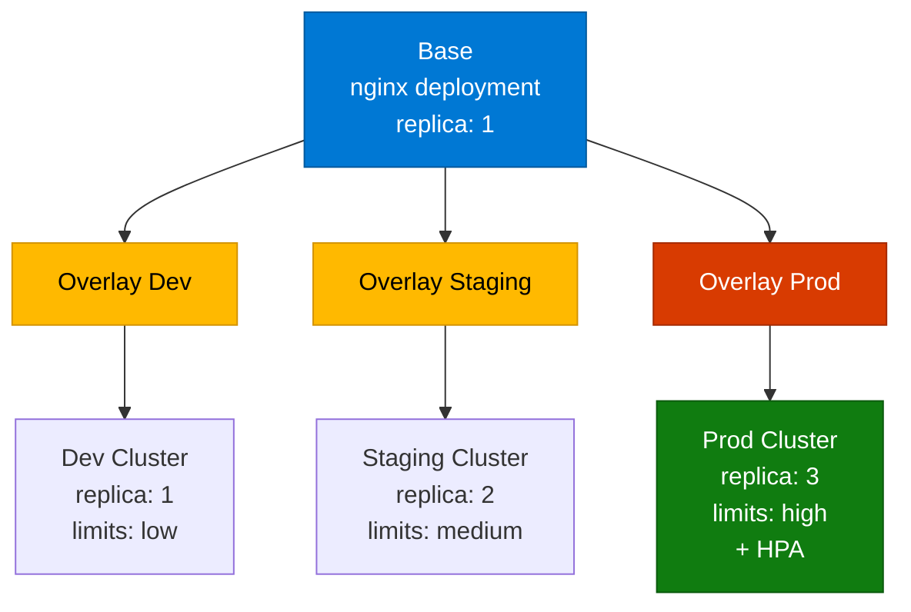

---
tags:
  - kustomize
  - kubernetes
  - overlays
  - gitops
  - dry
---

# Kustomize : Configuration Management



## Kustomize : Configuration sans Template

**Kustomize** est un outil de gestion de configuration Kubernetes natif (intégré à `kubectl`). Contrairement à Helm qui utilise des **templates**, Kustomize fonctionne par **overlays** (superposition de patchs).

### Philosophie : Template vs Overlay

| Critère | Helm (Template) | Kustomize (Overlay) |
|---------|-----------------|---------------------|
| **Approche** | Variables + Go Templates | Manifests YAML purs + Patchs |
| **Complexité** | Courbe d'apprentissage (Go Template) | Simple (patchs JSON/YAML) |
| **Réutilisabilité** | Charts partagés (Artifact Hub) | Bases réutilisables (Git) |
| **GitOps** | Nécessite render (helm template) | Natif (manifests versionnés) |
| **Customisation** | values.yaml (limité aux variables exposées) | Patchs libres (tout peut être modifié) |
| **Use Case** | Packaging d'apps tierces | Config multi-envs (dev/staging/prod) |

!!! tip "Helm ET Kustomize ?"
    Ils sont **complémentaires** ! Approche courante :

    - **Helm** : Déployer des apps tierces (PostgreSQL, Nginx, Prometheus)
    - **Kustomize** : Gérer les configs de vos apps custom (dev/staging/prod)

## Architecture Kustomize



## Installation

```bash
# Kustomize est intégré à kubectl (1.14+)
kubectl version --client
# Si kubectl >= 1.14, kustomize est disponible via -k

# Ou installer kustomize standalone
curl -s "https://raw.githubusercontent.com/kubernetes-sigs/kustomize/master/hack/install_kustomize.sh" | bash

# macOS
brew install kustomize

# Vérifier
kustomize version
# v5.3.0
```

## Structure de Base

### Créer une Base

```bash
# Créer la structure
mkdir -p myapp/base
cd myapp/base

# Créer un deployment
cat > deployment.yaml <<EOF
apiVersion: apps/v1
kind: Deployment
metadata:
  name: nginx
spec:
  replicas: 1
  selector:
    matchLabels:
      app: nginx
  template:
    metadata:
      labels:
        app: nginx
    spec:
      containers:
      - name: nginx
        image: nginx:1.25
        ports:
        - containerPort: 80
        resources:
          requests:
            cpu: 50m
            memory: 64Mi
EOF

# Créer un service
cat > service.yaml <<EOF
apiVersion: v1
kind: Service
metadata:
  name: nginx
spec:
  selector:
    app: nginx
  ports:
  - port: 80
    targetPort: 80
EOF

# Créer le kustomization.yaml
cat > kustomization.yaml <<EOF
apiVersion: kustomize.config.k8s.io/v1beta1
kind: Kustomization

resources:
  - deployment.yaml
  - service.yaml

commonLabels:
  managed-by: kustomize
EOF
```

### Visualiser la Base

```bash
# Voir les manifests générés
kustomize build base/
# Ou avec kubectl
kubectl kustomize base/

# Sortie : deployment.yaml + service.yaml avec les labels ajoutés
```

## Overlays : Multi-Environnements

### Créer un Overlay Dev

```bash
mkdir -p myapp/overlays/dev

cat > myapp/overlays/dev/kustomization.yaml <<EOF
apiVersion: kustomize.config.k8s.io/v1beta1
kind: Kustomization

# Référencer la base
bases:
  - ../../base

# Ajouter un suffix au nom des ressources
nameSuffix: -dev

# Ajouter des labels spécifiques à dev
commonLabels:
  environment: dev

# Pas besoin de changer les replicas (1 en dev = OK)
EOF

# Voir le résultat
kubectl kustomize myapp/overlays/dev/
# Les ressources s'appellent maintenant : nginx-dev
# Labels : environment=dev, managed-by=kustomize
```

### Créer un Overlay Prod

```bash
mkdir -p myapp/overlays/prod

# Créer un patch pour augmenter les replicas
cat > myapp/overlays/prod/replica-patch.yaml <<EOF
apiVersion: apps/v1
kind: Deployment
metadata:
  name: nginx
spec:
  replicas: 3
EOF

# Créer un patch pour les resources
cat > myapp/overlays/prod/resources-patch.yaml <<EOF
apiVersion: apps/v1
kind: Deployment
metadata:
  name: nginx
spec:
  template:
    spec:
      containers:
      - name: nginx
        resources:
          requests:
            cpu: 100m
            memory: 128Mi
          limits:
            cpu: 200m
            memory: 256Mi
EOF

# Kustomization prod
cat > myapp/overlays/prod/kustomization.yaml <<EOF
apiVersion: kustomize.config.k8s.io/v1beta1
kind: Kustomization

bases:
  - ../../base

nameSuffix: -prod

commonLabels:
  environment: prod

# Appliquer les patchs
patchesStrategicMerge:
  - replica-patch.yaml
  - resources-patch.yaml

# Changer l'image (tag prod)
images:
  - name: nginx
    newTag: 1.25-alpine

# Ajouter un HPA (Horizontal Pod Autoscaler)
resources:
  - hpa.yaml
EOF

# Créer le HPA
cat > myapp/overlays/prod/hpa.yaml <<EOF
apiVersion: autoscaling/v2
kind: HorizontalPodAutoscaler
metadata:
  name: nginx
spec:
  scaleTargetRef:
    apiVersion: apps/v1
    kind: Deployment
    name: nginx
  minReplicas: 3
  maxReplicas: 10
  metrics:
  - type: Resource
    resource:
      name: cpu
      target:
        type: Utilization
        averageUtilization: 80
EOF

# Voir le résultat prod
kubectl kustomize myapp/overlays/prod/
```

## Fichier kustomization.yaml : Analyse

### Champs Principaux

```yaml
apiVersion: kustomize.config.k8s.io/v1beta1
kind: Kustomization

# 1. RESOURCES : Fichiers YAML à inclure
resources:
  - deployment.yaml
  - service.yaml
  - https://raw.githubusercontent.com/example/manifests/main/configmap.yaml  # URL

# 2. BASES : Référencer d'autres kustomizations (héritage)
bases:
  - ../../base
  - github.com/mycompany/k8s-commons/nginx?ref=v1.2.3  # Remote

# 3. COMMON LABELS/ANNOTATIONS
commonLabels:
  app: nginx
  team: platform
commonAnnotations:
  managed-by: kustomize

# 4. NAME/NAMESPACE TRANSFORMERS
namePrefix: staging-
nameSuffix: -v2
namespace: production

# 5. IMAGES : Modifier les images (tag, registry)
images:
  - name: nginx
    newName: registry.example.com/nginx
    newTag: 1.25-alpine

# 6. REPLICAS : Override replicas
replicas:
  - name: nginx
    count: 5

# 7. PATCHES
patchesStrategicMerge:
  - patch-deployment.yaml

patchesJson6902:
  - target:
      group: apps
      version: v1
      kind: Deployment
      name: nginx
    patch: |-
      - op: replace
        path: /spec/replicas
        value: 10

# 8. CONFIG/SECRET GENERATORS
configMapGenerator:
  - name: app-config
    files:
      - config.properties
    literals:
      - LOG_LEVEL=info

secretGenerator:
  - name: app-secret
    files:
      - credentials.txt
    literals:
      - DB_PASSWORD=supersecret

# 9. GENERATORS OPTIONS
generatorOptions:
  disableNameSuffixHash: false  # Ajoute un hash au nom (pour rolling updates)
```

### Types de Patchs

#### Strategic Merge Patch (Recommandé)

```yaml
# patch-deployment.yaml
apiVersion: apps/v1
kind: Deployment
metadata:
  name: nginx
spec:
  template:
    spec:
      containers:
      - name: nginx
        env:
        - name: LOG_LEVEL
          value: debug
```

#### JSON Patch (RFC 6902)

```yaml
patchesJson6902:
  - target:
      kind: Deployment
      name: nginx
    patch: |-
      - op: add
        path: /spec/template/spec/containers/0/env
        value:
          - name: LOG_LEVEL
            value: debug
```

#### JSON Merge Patch (RFC 7386)

```yaml
patchesStrategicMerge:
  - |-
    apiVersion: apps/v1
    kind: Deployment
    metadata:
      name: nginx
    spec:
      replicas: 5
```

## ConfigMap/Secret Generators

### ConfigMap depuis Fichiers

```bash
# Créer un fichier de config
cat > myapp/overlays/prod/app.properties <<EOF
database.host=postgres.prod.svc.cluster.local
database.port=5432
cache.enabled=true
EOF

# Kustomization
cat >> myapp/overlays/prod/kustomization.yaml <<EOF
configMapGenerator:
  - name: app-config
    files:
      - app.properties
EOF

# Résultat :
kubectl kustomize myapp/overlays/prod/ | grep -A 10 "kind: ConfigMap"
# apiVersion: v1
# kind: ConfigMap
# metadata:
#   name: app-config-6ft4b8m2k9  # Hash ajouté automatiquement
# data:
#   app.properties: |
#     database.host=postgres.prod.svc.cluster.local
#     database.port=5432
#     cache.enabled=true
```

### Secret depuis Literals

```yaml
secretGenerator:
  - name: db-credentials
    type: Opaque
    literals:
      - username=admin
      - password=supersecret
```

!!! danger "Secrets en Clair dans Git ?"
    **JAMAIS !** Les secrets doivent être :

    - **Chiffrés** : SOPS, Sealed Secrets, git-crypt
    - **Externalisés** : Vault, AWS Secrets Manager, Azure Key Vault
    - **Générés** : External Secrets Operator

## Déploiement

### Avec kubectl

```bash
# Dev
kubectl apply -k myapp/overlays/dev/

# Prod
kubectl apply -k myapp/overlays/prod/

# Voir le diff avant d'appliquer
kubectl diff -k myapp/overlays/prod/

# Supprimer
kubectl delete -k myapp/overlays/prod/
```

### Avec kustomize + kubectl

```bash
# Générer les manifests et appliquer
kustomize build myapp/overlays/prod/ | kubectl apply -f -

# Sauvegarder les manifests générés (pour audit)
kustomize build myapp/overlays/prod/ > manifests-prod.yaml
git add manifests-prod.yaml
```

## GitOps avec ArgoCD/Flux

### ArgoCD Application

```yaml
apiVersion: argoproj.io/v1alpha1
kind: Application
metadata:
  name: myapp-prod
  namespace: argocd
spec:
  project: default
  source:
    repoURL: https://github.com/mycompany/k8s-apps
    targetRevision: main
    path: myapp/overlays/prod  # Pointer vers l'overlay
  destination:
    server: https://kubernetes.default.svc
    namespace: production
  syncPolicy:
    automated:
      prune: true
      selfHeal: true
```

### Flux Kustomization

```yaml
apiVersion: kustomize.toolkit.fluxcd.io/v1
kind: Kustomization
metadata:
  name: myapp-prod
  namespace: flux-system
spec:
  interval: 5m
  path: ./myapp/overlays/prod
  prune: true
  sourceRef:
    kind: GitRepository
    name: k8s-apps
```

## Exemple Concret : Application 3-Tiers

### Structure Complète

```
myapp/
├── base/
│   ├── kustomization.yaml
│   ├── frontend/
│   │   ├── deployment.yaml
│   │   ├── service.yaml
│   │   └── ingress.yaml
│   ├── backend/
│   │   ├── deployment.yaml
│   │   ├── service.yaml
│   │   └── configmap.yaml
│   └── database/
│       ├── statefulset.yaml
│       ├── service.yaml
│       └── pvc.yaml
├── overlays/
│   ├── dev/
│   │   ├── kustomization.yaml
│   │   ├── frontend-replica-patch.yaml
│   │   └── database-storage-patch.yaml
│   ├── staging/
│   │   ├── kustomization.yaml
│   │   └── resources-patch.yaml
│   └── prod/
│       ├── kustomization.yaml
│       ├── frontend-hpa.yaml
│       ├── backend-hpa.yaml
│       ├── database-backup-cronjob.yaml
│       └── network-policy.yaml
```

### Base : kustomization.yaml

```yaml
apiVersion: kustomize.config.k8s.io/v1beta1
kind: Kustomization

resources:
  - frontend/deployment.yaml
  - frontend/service.yaml
  - frontend/ingress.yaml
  - backend/deployment.yaml
  - backend/service.yaml
  - backend/configmap.yaml
  - database/statefulset.yaml
  - database/service.yaml
  - database/pvc.yaml

commonLabels:
  app: myapp
  managed-by: kustomize
```

### Overlay Prod : kustomization.yaml

```yaml
apiVersion: kustomize.config.k8s.io/v1beta1
kind: Kustomization

bases:
  - ../../base

namespace: production
nameSuffix: -prod

commonLabels:
  environment: prod

replicas:
  - name: frontend
    count: 3
  - name: backend
    count: 2

images:
  - name: frontend
    newTag: v2.5.1
  - name: backend
    newTag: v1.8.3

resources:
  - frontend-hpa.yaml
  - backend-hpa.yaml
  - database-backup-cronjob.yaml
  - network-policy.yaml

configMapGenerator:
  - name: backend-config
    files:
      - prod-config.yaml

secretGenerator:
  - name: db-credentials
    literals:
      - username=produser
      - password=changeme  # ⚠️ À chiffrer avec SOPS !
```

## Best Practices

### 1. Structure DRY (Don't Repeat Yourself)

```bash
# Mauvais : Dupliquer les manifests dans chaque overlay
overlays/
├── dev/
│   ├── deployment.yaml (copie complète)
│   └── service.yaml (copie complète)
└── prod/
    ├── deployment.yaml (copie complète)
    └── service.yaml (copie complète)

# Bon : Base + Patchs
base/
├── deployment.yaml
└── service.yaml
overlays/
├── dev/
│   ├── kustomization.yaml (référence base + patchs minimes)
│   └── replica-patch.yaml
└── prod/
    ├── kustomization.yaml (référence base + patchs)
    └── resources-patch.yaml
```

### 2. Versionner les Bases Externes

```yaml
# Mauvais : Pointer vers main (instable)
bases:
  - github.com/mycompany/k8s-commons/nginx

# Bon : Pointer vers un tag/commit
bases:
  - github.com/mycompany/k8s-commons/nginx?ref=v1.2.3
```

### 3. Utiliser les Generators pour ConfigMap/Secret

```yaml
# Mauvais : Définir manuellement
resources:
  - configmap.yaml  # Hash manuel, pas de rolling update auto

# Bon : Utiliser le generator
configMapGenerator:
  - name: app-config
    files:
      - config.properties
# Hash auto, rolling update déclenché si le contenu change
```

### 4. Séparer Secrets de la Config

```bash
# Structure
myapp/
├── base/
│   └── kustomization.yaml
└── overlays/
    └── prod/
        ├── kustomization.yaml
        ├── config.yaml          # Config non sensible (versionnée)
        └── secrets.enc.yaml     # Secrets chiffrés (SOPS/Sealed Secrets)
```

## Dépannage

### Voir les Différences entre Overlays

```bash
# Comparer dev vs prod
diff <(kubectl kustomize myapp/overlays/dev/) \
     <(kubectl kustomize myapp/overlays/prod/)
```

### Valider avant Apply

```bash
# Dry-run avec validation
kubectl apply -k myapp/overlays/prod/ --dry-run=server --validate=true
```

### Debug

```bash
# Verbose
kustomize build myapp/overlays/prod/ --enable-alpha-plugins --enable-helm

# Voir les transformations appliquées
kustomize build myapp/overlays/prod/ --reorder legacy
```

## Checklist Production

```bash
# 1. Structure DRY (base + overlays)
ls -R myapp/

# 2. Pas de secrets en clair
grep -r "password" myapp/  # Doit retourner des secrets chiffrés ou générés

# 3. Images taguées (pas :latest)
grep "image:" myapp/overlays/prod/*.yaml
# Doit avoir des tags versionnés (v1.2.3, sha256:abc...)

# 4. Resources limits/requests définis
kubectl kustomize myapp/overlays/prod/ | grep -A 3 "resources:"

# 5. HPA ou replicas adaptés
kubectl kustomize myapp/overlays/prod/ | grep -E "replicas:|kind: HorizontalPodAutoscaler"

# 6. Validité des manifests
kubectl kustomize myapp/overlays/prod/ | kubectl apply --dry-run=server -f -
```

## Liens Utiles

- [Kustomize Documentation](https://kustomize.io/)
- [Kubernetes Kustomize](https://kubernetes.io/docs/tasks/manage-kubernetes-objects/kustomization/)
- [Kustomize GitHub Examples](https://github.com/kubernetes-sigs/kustomize/tree/master/examples)
- [GitOps with Kustomize (ArgoCD)](https://argo-cd.readthedocs.io/en/stable/user-guide/kustomize/)
