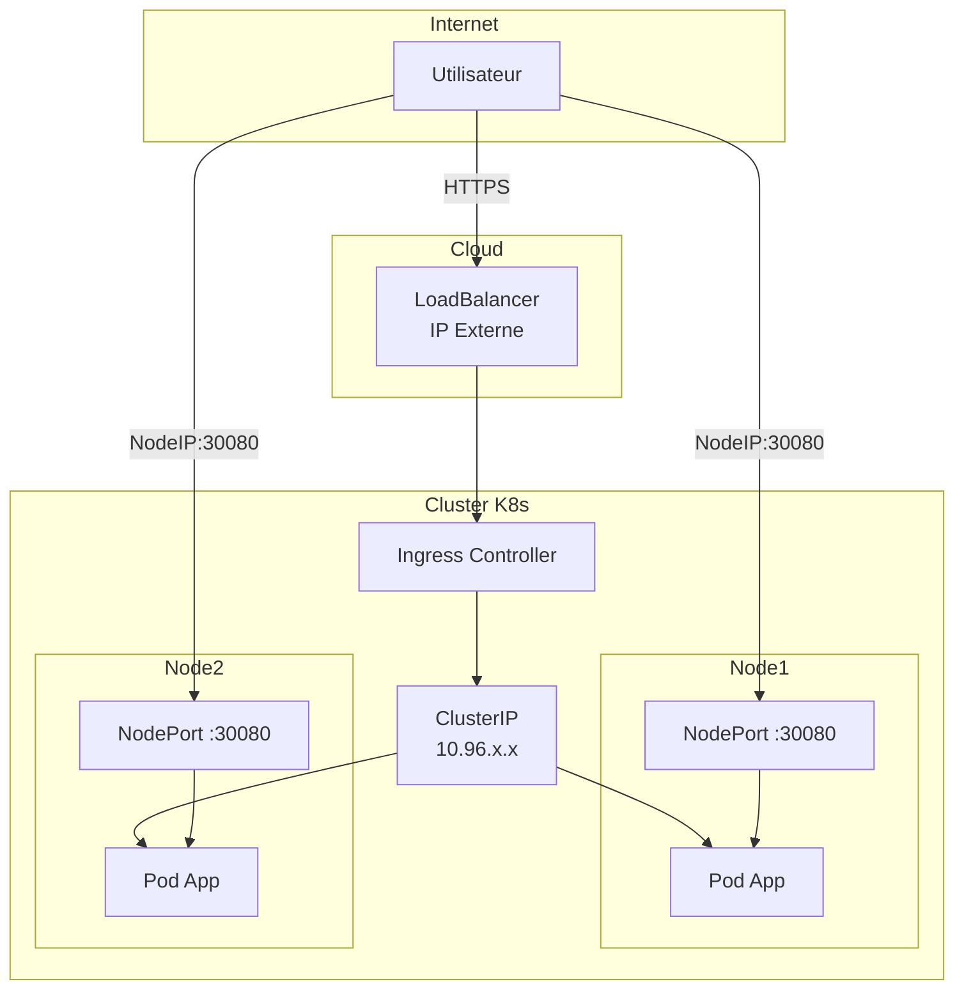

# K8s Services & Ingress

`#service` `#ingress` `#dns` `#coredns` `#networking`

Exposition des applications et réseau interne Kubernetes.

---

## Les 4 Types de Services

### Vue d'Ensemble



### Comparatif

| Type | Accessibilité | Port | Use Case |
|------|---------------|------|----------|
| **ClusterIP** | Interne uniquement | Service port | Communication inter-pods |
| **NodePort** | Node IP + Port fixe | 30000-32767 | Dev, on-prem sans LB |
| **LoadBalancer** | IP externe cloud | Service port | Production cloud |
| **ExternalName** | Alias DNS | - | Service externe (AWS RDS) |

### ClusterIP (Défaut)

Accessible uniquement depuis l'intérieur du cluster.

```yaml
apiVersion: v1
kind: Service
metadata:
  name: backend-api
spec:
  type: ClusterIP    # Défaut, peut être omis
  selector:
    app: backend
  ports:
    - port: 80         # Port du service
      targetPort: 8080 # Port du container
```

```bash
# Accessible depuis un autre pod :
curl http://backend-api.default.svc.cluster.local
curl http://backend-api    # Même namespace
```

### NodePort

Ouvre un port sur **tous les nodes** du cluster.

```yaml
apiVersion: v1
kind: Service
metadata:
  name: frontend
spec:
  type: NodePort
  selector:
    app: frontend
  ports:
    - port: 80
      targetPort: 80
      nodePort: 30080    # Optionnel (auto-assigné si omis)
```

```bash
# Accessible via n'importe quel Node IP :
curl http://<NODE_IP>:30080
```

!!! warning "NodePort en production"
    Rarement utilisé en production :

    - Ports non standards (30000-32767)
    - Nécessite de connaître les IPs des nodes
    - Pas de load balancing externe

### LoadBalancer

Provisionne un Load Balancer cloud (AWS ELB, GCP LB, Azure LB).

```yaml
apiVersion: v1
kind: Service
metadata:
  name: webapp
  annotations:
    # AWS-specific
    service.beta.kubernetes.io/aws-load-balancer-type: "nlb"
spec:
  type: LoadBalancer
  selector:
    app: webapp
  ports:
    - port: 443
      targetPort: 8443
```

```bash
# Récupérer l'IP externe
kubectl get svc webapp

# NAME    TYPE           EXTERNAL-IP      PORT(S)
# webapp  LoadBalancer   52.123.45.67     443:31234/TCP
```

### ExternalName

Crée un alias DNS (CNAME) vers un service externe.

```yaml
apiVersion: v1
kind: Service
metadata:
  name: database
spec:
  type: ExternalName
  externalName: prod-db.abc123.us-east-1.rds.amazonaws.com
```

```bash
# Depuis un pod, le DNS "database" résout vers le CNAME
nslookup database
# → prod-db.abc123.us-east-1.rds.amazonaws.com
```

---

## Ingress : La Porte d'Entrée

### Concept

Ingress gère le routage HTTP/HTTPS (Layer 7) basé sur :

- **Host** : `api.example.com` vs `app.example.com`
- **Path** : `/api/*` vs `/admin/*`

```
                    ┌─────────────────────────────┐
                    │      Ingress Controller     │
  Internet ──────►  │    (Nginx, Traefik...)      │
                    └─────────────────────────────┘
                               │
              ┌────────────────┼────────────────┐
              │                │                │
              ▼                ▼                ▼
       ┌──────────┐     ┌──────────┐     ┌──────────┐
       │  /api/*  │     │    /     │     │ /admin/* │
       │ api-svc  │     │ web-svc  │     │admin-svc │
       └──────────┘     └──────────┘     └──────────┘
```

### Ingress Controller (Prérequis)

!!! danger "La ressource Ingress ne fait RIEN sans Controller"
    L'Ingress est juste une configuration. Il faut un Controller pour l'appliquer.

| Controller | Description |
|------------|-------------|
| **ingress-nginx** | Officiel NGINX, le plus commun |
| **Traefik** | Cloud-native, dashboard intégré |
| **HAProxy** | Performance |
| **AWS ALB** | Natif AWS |
| **GKE Ingress** | Natif GCP |

```bash
# Installer nginx-ingress (Helm)
helm repo add ingress-nginx https://kubernetes.github.io/ingress-nginx
helm install ingress-nginx ingress-nginx/ingress-nginx

# Vérifier
kubectl get pods -n ingress-nginx
kubectl get svc -n ingress-nginx
```

### Exemple Ingress avec TLS

```yaml
apiVersion: networking.k8s.io/v1
kind: Ingress
metadata:
  name: main-ingress
  annotations:
    nginx.ingress.kubernetes.io/rewrite-target: /
    nginx.ingress.kubernetes.io/ssl-redirect: "true"
spec:
  ingressClassName: nginx
  tls:
    - hosts:
        - app.example.com
        - api.example.com
      secretName: tls-secret    # Secret contenant le certificat
  rules:
    # Rule 1 : app.example.com
    - host: app.example.com
      http:
        paths:
          - path: /
            pathType: Prefix
            backend:
              service:
                name: frontend-svc
                port:
                  number: 80
    # Rule 2 : api.example.com
    - host: api.example.com
      http:
        paths:
          - path: /v1
            pathType: Prefix
            backend:
              service:
                name: api-v1-svc
                port:
                  number: 80
          - path: /v2
            pathType: Prefix
            backend:
              service:
                name: api-v2-svc
                port:
                  number: 80
```

### Créer le Secret TLS

```bash
# À partir de certificats existants
kubectl create secret tls tls-secret \
    --cert=fullchain.pem \
    --key=privkey.pem

# Avec cert-manager (automatique Let's Encrypt)
# Voir docs cert-manager
```

### Annotations Utiles (nginx-ingress)

```yaml
annotations:
  # Redirection HTTP → HTTPS
  nginx.ingress.kubernetes.io/ssl-redirect: "true"

  # Réécriture de path
  nginx.ingress.kubernetes.io/rewrite-target: /$1

  # Timeout
  nginx.ingress.kubernetes.io/proxy-read-timeout: "3600"

  # Limite de taille upload
  nginx.ingress.kubernetes.io/proxy-body-size: "50m"

  # Auth basique
  nginx.ingress.kubernetes.io/auth-type: basic
  nginx.ingress.kubernetes.io/auth-secret: basic-auth

  # Whitelist IP
  nginx.ingress.kubernetes.io/whitelist-source-range: "10.0.0.0/8,192.168.0.0/16"
```

---

## Troubleshooting DNS (CoreDNS)

### Format DNS Kubernetes

```
<service>.<namespace>.svc.cluster.local

# Exemples :
postgres.database.svc.cluster.local
backend-api.default.svc.cluster.local
```

### Le Problème Classique

```
Mon app ne trouve pas la BDD !

Error: NXDOMAIN - postgres not found
```

### Debug avec un Pod dnsutils

```bash
# Lancer un pod de debug
kubectl run dnsutils --image=tutum/dnsutils --restart=Never -- sleep 3600

# Ou avec busybox
kubectl run debug --image=busybox:1.28 --restart=Never -- sleep 3600

# Entrer dans le pod
kubectl exec -it dnsutils -- /bin/sh
```

### Vérifier la Résolution DNS

```bash
# Dans le pod de debug :

# Résolution basique
nslookup postgres
nslookup postgres.database
nslookup postgres.database.svc.cluster.local

# Avec dig (plus détaillé)
dig postgres.database.svc.cluster.local

# Vérifier le serveur DNS utilisé
cat /etc/resolv.conf

# Output typique :
# nameserver 10.96.0.10
# search default.svc.cluster.local svc.cluster.local cluster.local
# options ndots:5
```

### Le Piège ndots:5

```bash
# /etc/resolv.conf
options ndots:5
```

Avec `ndots:5`, si le nom a **moins de 5 points**, Kubernetes ajoute les suffixes de recherche AVANT de résoudre.

```
nslookup postgres
# Essaie dans l'ordre :
# 1. postgres.default.svc.cluster.local
# 2. postgres.svc.cluster.local
# 3. postgres.cluster.local
# 4. postgres (domaine absolu)
```

!!! tip "Forcer la résolution absolue"
    Ajoutez un point final pour éviter les recherches :
    ```
    postgres.database.svc.cluster.local.
    ```

### Vérifier CoreDNS

```bash
# Pods CoreDNS
kubectl get pods -n kube-system -l k8s-app=kube-dns

# Logs CoreDNS
kubectl logs -n kube-system -l k8s-app=kube-dns

# ConfigMap CoreDNS
kubectl get configmap coredns -n kube-system -o yaml

# Service DNS
kubectl get svc -n kube-system kube-dns
# → 10.96.0.10 (doit matcher /etc/resolv.conf des pods)
```

### Checklist DNS

| Problème | Vérification |
|----------|--------------|
| Service existe ? | `kubectl get svc -A` |
| Endpoints ? | `kubectl get endpoints <svc>` |
| Pod DNS fonctionne ? | `nslookup kubernetes.default` |
| CoreDNS running ? | `kubectl get pods -n kube-system -l k8s-app=kube-dns` |
| Bon namespace ? | `nslookup svc.namespace` |

---

## Quick Reference

```bash
# === SERVICES ===
kubectl get svc -A
kubectl describe svc myservice
kubectl get endpoints myservice

# Types :
# ClusterIP  → Interne
# NodePort   → Node:30000-32767
# LoadBalancer → IP externe cloud
# ExternalName → CNAME externe

# === INGRESS ===
kubectl get ingress -A
kubectl describe ingress myingress

# === DNS DEBUG ===
kubectl run debug --image=busybox:1.28 --restart=Never -- sleep 3600
kubectl exec -it debug -- nslookup myservice.mynamespace
kubectl exec -it debug -- cat /etc/resolv.conf

# CoreDNS
kubectl logs -n kube-system -l k8s-app=kube-dns

# === FORMAT DNS ===
# <service>.<namespace>.svc.cluster.local
# postgres.database.svc.cluster.local
```
