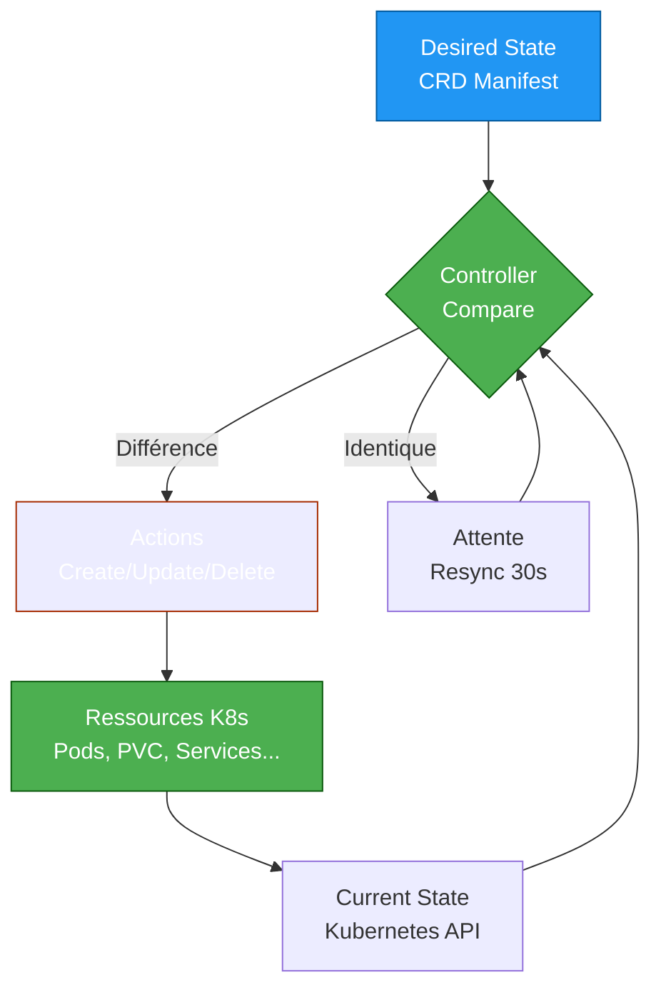

---
tags:
  - operators
  - crd
  - controller
  - stateful
  - automation
---

# Operators & CRD

## Operators : Automatiser l'Opérationnel

Un **Operator** est un pattern Kubernetes qui étend l'API pour gérer des applications **stateful** complexes (bases de données, middlewares, systèmes distribués) avec la même simplicité qu'un Deployment.

### Le Problème sans Operators

```bash
# Déployer PostgreSQL "à la main" :
kubectl apply -f postgresql-deployment.yaml
kubectl apply -f postgresql-service.yaml
kubectl apply -f postgresql-configmap.yaml
kubectl apply -f postgresql-secret.yaml
kubectl apply -f postgresql-pvc.yaml

# Puis gérer manuellement :
# - Backup quotidien
# - Restauration en cas d'incident
# - Montée de version (migration schéma)
# - Réplication master/slave
# - Monitoring
# - Rotation des logs

# = 50 commandes kubectl + scripts bash + cronjobs
```

### La Solution : Operator

```yaml
# Avec PostgreSQL Operator, un seul manifest :
apiVersion: postgresql.cnpg.io/v1
kind: Cluster
metadata:
  name: my-postgres
spec:
  instances: 3  # Réplication auto
  storage:
    size: 10Gi
  backup:
    enabled: true
    schedule: "0 2 * * *"  # Backup auto chaque nuit
  monitoring:
    enabled: true  # Métriques Prometheus auto
```

**Résultat :** L'Operator gère automatiquement backup, réplication, failover, monitoring, upgrades.

## Pattern Controller : La Boucle de Réconciliation



**Principe :**

1. **Desired State** : L'utilisateur crée une ressource custom (ex: `PostgreSQL`)
2. **Observe** : Le controller watch l'API Kubernetes
3. **Analyze** : Compare l'état actuel vs désiré
4. **Act** : Crée/modifie/supprime des ressources pour converger
5. **Repeat** : Boucle infinie (toutes les 30s)

## CRD : Custom Resource Definition

Une **CRD** étend l'API Kubernetes en définissant un nouveau type de ressource (comme `Deployment`, `Service`, mais custom).

### Créer une CRD Simple

```yaml
apiVersion: apiextensions.k8s.io/v1
kind: CustomResourceDefinition
metadata:
  name: databases.example.com
spec:
  group: example.com
  versions:
    - name: v1
      served: true
      storage: true
      schema:
        openAPIV3Schema:
          type: object
          properties:
            spec:
              type: object
              properties:
                engine:
                  type: string
                  enum: ["postgresql", "mysql", "mongodb"]
                size:
                  type: string
                  pattern: '^[0-9]+Gi$'
                replicas:
                  type: integer
                  minimum: 1
                  maximum: 10
  scope: Namespaced
  names:
    plural: databases
    singular: database
    kind: Database
    shortNames:
    - db
```

```bash
# Appliquer la CRD
kubectl apply -f database-crd.yaml

# Vérifier
kubectl get crd databases.example.com
# NAME                    CREATED AT
# databases.example.com   2025-01-15T10:00:00Z

# Maintenant, on peut créer des objets "Database" !
```

### Utiliser la CRD

```yaml
apiVersion: example.com/v1
kind: Database
metadata:
  name: my-postgres
  namespace: production
spec:
  engine: postgresql
  size: 20Gi
  replicas: 3
```

```bash
# Créer l'instance
kubectl apply -f my-postgres.yaml

# Lister les databases
kubectl get databases
# NAME          ENGINE        SIZE   REPLICAS   AGE
# my-postgres   postgresql    20Gi   3          5m

# Raccourci
kubectl get db
```

!!! note "CRD vs ConfigMap"
    **CRD** : Typage fort, validation, versioning, watch API
    **ConfigMap** : Clé-valeur simple, pas de logique métier

## Operators Populaires

### Prometheus Operator (Le Standard)

```bash
# Installer via Helm
helm repo add prometheus-community https://prometheus-community.github.io/helm-charts
helm install prometheus prometheus-community/kube-prometheus-stack

# CRDs créées :
kubectl get crd | grep monitoring.coreos.com
# prometheuses.monitoring.coreos.com
# servicemonitors.monitoring.coreos.com
# podmonitors.monitoring.coreos.com
# prometheusrules.monitoring.coreos.com
```

#### Exemple : ServiceMonitor

```yaml
apiVersion: monitoring.coreos.com/v1
kind: ServiceMonitor
metadata:
  name: myapp-monitor
  namespace: monitoring
spec:
  selector:
    matchLabels:
      app: myapp
  endpoints:
  - port: metrics
    interval: 30s
    path: /metrics
```

**Résultat :** Prometheus se reconfigure **automatiquement** pour scraper `myapp`.

### PostgreSQL Operator (CloudNativePG)

```bash
# Installer l'operator
kubectl apply -f https://raw.githubusercontent.com/cloudnative-pg/cloudnative-pg/release-1.22/releases/cnpg-1.22.0.yaml

# Déployer une instance
cat > postgres-cluster.yaml <<EOF
apiVersion: postgresql.cnpg.io/v1
kind: Cluster
metadata:
  name: my-postgres
spec:
  instances: 3
  storage:
    size: 10Gi
    storageClass: fast-ssd
  bootstrap:
    initdb:
      database: myapp
      owner: appuser
  backup:
    barmanObjectStore:
      destinationPath: s3://backups/postgres
      s3Credentials:
        accessKeyId:
          name: aws-creds
          key: ACCESS_KEY_ID
        secretAccessKey:
          name: aws-creds
          key: SECRET_ACCESS_KEY
    retentionPolicy: "30d"
EOF

kubectl apply -f postgres-cluster.yaml

# Vérifier
kubectl get cluster
# NAME          AGE   INSTANCES   READY   STATUS
# my-postgres   5m    3           3       Cluster in healthy state

# L'operator a créé automatiquement :
kubectl get pods -l cnpg.io/cluster=my-postgres
# my-postgres-1  (primary)
# my-postgres-2  (replica)
# my-postgres-3  (replica)
```

### MySQL Operator (Percona)

```bash
# Installer
kubectl apply -f https://raw.githubusercontent.com/percona/percona-xtradb-cluster-operator/main/deploy/bundle.yaml

# Créer un cluster MySQL
apiVersion: pxc.percona.com/v1
kind: PerconaXtraDBCluster
metadata:
  name: my-mysql
spec:
  pxc:
    size: 3
    image: percona/percona-xtradb-cluster:8.0
    resources:
      requests:
        memory: 1Gi
        cpu: 500m
  haproxy:
    enabled: true
    size: 2
  backup:
    enabled: true
    schedule: "0 2 * * *"
```

### Elastic Operator (ECK)

```bash
# Installer
kubectl apply -f https://download.elastic.co/downloads/eck/2.11.0/crds.yaml
kubectl apply -f https://download.elastic.co/downloads/eck/2.11.0/operator.yaml

# Créer Elasticsearch
apiVersion: elasticsearch.k8s.elastic.co/v1
kind: Elasticsearch
metadata:
  name: my-elastic
spec:
  version: 8.12.0
  nodeSets:
  - name: default
    count: 3
    config:
      node.store.allow_mmap: false
```

### Kafka Operator (Strimzi)

```bash
# Installer
kubectl apply -f https://strimzi.io/install/latest?namespace=kafka

# Créer un cluster Kafka
apiVersion: kafka.strimzi.io/v1beta2
kind: Kafka
metadata:
  name: my-kafka
spec:
  kafka:
    version: 3.6.0
    replicas: 3
    storage:
      type: persistent-claim
      size: 100Gi
  zookeeper:
    replicas: 3
    storage:
      type: persistent-claim
      size: 10Gi
```

## OperatorHub : Catalogue d'Operators

**OperatorHub.io** est le "Docker Hub" des Operators.

```bash
# Explorer sur https://operatorhub.io/

# Exemples populaires :
# - Redis Operator
# - RabbitMQ Operator
# - MongoDB Operator
# - Vault Operator
# - Cert-Manager (gestion certificats TLS)
# - External Secrets Operator
```

### Installer avec OLM (Operator Lifecycle Manager)

```bash
# Installer OLM
curl -sL https://github.com/operator-framework/operator-lifecycle-manager/releases/download/v0.27.0/install.sh | bash -s v0.27.0

# Installer un operator depuis OperatorHub
kubectl apply -f https://operatorhub.io/install/redis-operator.yaml

# Vérifier
kubectl get csv -n operators
# NAME                    DISPLAY          VERSION   PHASE
# redis-operator.v1.2.3   Redis Operator   1.2.3     Succeeded
```

## Exemple Pratique : Prometheus Operator

### 1. Installer Prometheus Operator

```bash
helm repo add prometheus-community https://prometheus-community.github.io/helm-charts
helm repo update

helm install prometheus prometheus-community/kube-prometheus-stack \
  --namespace monitoring \
  --create-namespace
```

### 2. Déployer une Application avec Métriques

```yaml
apiVersion: apps/v1
kind: Deployment
metadata:
  name: myapp
spec:
  replicas: 2
  selector:
    matchLabels:
      app: myapp
  template:
    metadata:
      labels:
        app: myapp
    spec:
      containers:
      - name: app
        image: myapp:latest
        ports:
        - name: metrics
          containerPort: 9090
---
apiVersion: v1
kind: Service
metadata:
  name: myapp
  labels:
    app: myapp
spec:
  selector:
    app: myapp
  ports:
  - name: metrics
    port: 9090
    targetPort: 9090
```

### 3. Créer un ServiceMonitor

```yaml
apiVersion: monitoring.coreos.com/v1
kind: ServiceMonitor
metadata:
  name: myapp-monitor
  namespace: monitoring
  labels:
    release: prometheus  # Important : label selector de Prometheus
spec:
  selector:
    matchLabels:
      app: myapp
  namespaceSelector:
    matchNames:
    - default
  endpoints:
  - port: metrics
    interval: 30s
    path: /metrics
```

```bash
# Appliquer
kubectl apply -f myapp-servicemonitor.yaml

# Vérifier que Prometheus a détecté la target
kubectl port-forward -n monitoring svc/prometheus-kube-prometheus-prometheus 9090:9090
# Aller sur http://localhost:9090/targets
# → myapp/myapp/0 (UP)
```

### 4. Créer une Alerte

```yaml
apiVersion: monitoring.coreos.com/v1
kind: PrometheusRule
metadata:
  name: myapp-alerts
  namespace: monitoring
  labels:
    release: prometheus
spec:
  groups:
  - name: myapp
    interval: 30s
    rules:
    - alert: MyAppDown
      expr: up{job="myapp"} == 0
      for: 5m
      labels:
        severity: critical
      annotations:
        summary: "MyApp is down"
        description: "MyApp has been down for more than 5 minutes"

    - alert: MyAppHighLatency
      expr: http_request_duration_seconds{job="myapp",quantile="0.99"} > 1
      for: 10m
      labels:
        severity: warning
      annotations:
        summary: "MyApp high latency"
        description: "P99 latency > 1s for 10 minutes"
```

## Build Custom Operator : Introduction

### Avec Operator SDK

```bash
# Installer Operator SDK
brew install operator-sdk

# Créer un operator Go
operator-sdk init --domain=example.com --repo=github.com/mycompany/myapp-operator

# Créer une API (CRD + Controller)
operator-sdk create api --group=apps --version=v1 --kind=MyApp --resource --controller

# Structure générée :
tree
# ├── api/v1/myapp_types.go       # CRD definition
# ├── controllers/myapp_controller.go  # Controller logic
# ├── config/                      # Kustomize manifests
# └── main.go

# Implémenter la logique dans myapp_controller.go
# Puis build et deploy
make docker-build docker-push IMG=mycompany/myapp-operator:v1.0.0
make deploy IMG=mycompany/myapp-operator:v1.0.0
```

### Avec Kubebuilder

```bash
# Installer Kubebuilder
curl -L -o kubebuilder https://go.kubebuilder.io/dl/latest/$(go env GOOS)/$(go env GOARCH)
chmod +x kubebuilder && mv kubebuilder /usr/local/bin/

# Créer un projet
kubebuilder init --domain=example.com

# Créer une API
kubebuilder create api --group=apps --version=v1 --kind=Database

# Implémenter, tester, déployer
make manifests
make install
make run
```

!!! tip "Quand Créer un Operator Custom ?"
    Seulement si :

    - Votre app a une logique **stateful** complexe (pas juste un Deployment)
    - Vous gérez des opérations **Day 2** (backup, restore, upgrade, scaling)
    - Vous voulez **standardiser** l'exploitation (self-service pour les devs)

    Sinon, utiliser Helm/Kustomize suffit.

## Best Practices

### 1. Limiter les Permissions (RBAC)

```yaml
# ServiceAccount de l'operator
apiVersion: v1
kind: ServiceAccount
metadata:
  name: myapp-operator
---
# Role minimal (pas cluster-admin)
apiVersion: rbac.authorization.k8s.io/v1
kind: Role
metadata:
  name: myapp-operator
rules:
- apiGroups: ["apps"]
  resources: ["deployments", "statefulsets"]
  verbs: ["get", "list", "watch", "create", "update", "delete"]
- apiGroups: [""]
  resources: ["services", "configmaps", "secrets"]
  verbs: ["get", "list", "watch", "create", "update"]
```

### 2. Utiliser Finalizers

```yaml
# Empêcher la suppression d'une CR tant que le cleanup n'est pas terminé
apiVersion: example.com/v1
kind: Database
metadata:
  name: my-db
  finalizers:
  - database.example.com/cleanup
spec:
  ...
```

### 3. Status Subresource

```yaml
# Dans la CRD
status:
  conditions:
  - type: Ready
    status: "True"
    lastTransitionTime: "2025-01-15T10:30:00Z"
    reason: AllPodsRunning
    message: "All 3 replicas are ready"
  phase: Running
  observedGeneration: 5
```

### 4. Webhooks de Validation

```yaml
# Valider avant création/modification
apiVersion: admissionregistration.k8s.io/v1
kind: ValidatingWebhookConfiguration
metadata:
  name: database-validator
webhooks:
- name: validate.database.example.com
  rules:
  - operations: ["CREATE", "UPDATE"]
    apiGroups: ["example.com"]
    apiVersions: ["v1"]
    resources: ["databases"]
  clientConfig:
    service:
      name: webhook-service
      namespace: operators
      path: /validate
```

## Dépannage

### Voir les Events de la CR

```bash
kubectl describe database my-postgres
# Events:
#   Type    Reason           Age   From                Message
#   ----    ------           ----  ----                -------
#   Normal  SuccessfulCreate 5m    database-controller Created pod my-postgres-0
#   Normal  SuccessfulCreate 4m    database-controller Created service my-postgres
#   Warning FailedMount      3m    kubelet             Unable to mount volume
```

### Logs de l'Operator

```bash
# Trouver le pod de l'operator
kubectl get pods -n operators -l app=postgresql-operator

# Voir les logs
kubectl logs -n operators postgresql-operator-abc123 -f

# Avec verbosité
kubectl logs -n operators postgresql-operator-abc123 --tail=100 --timestamps
```

### Vérifier les CRDs

```bash
# Lister toutes les CRDs
kubectl get crd

# Voir la spec d'une CRD
kubectl get crd databases.example.com -o yaml

# Vérifier si la CRD est servie
kubectl get crd databases.example.com -o jsonpath='{.status.conditions[?(@.type=="Established")].status}'
# True
```

## Checklist Production

```bash
# 1. CRDs installées
kubectl get crd | grep example.com

# 2. Operator déployé et running
kubectl get pods -n operators

# 3. RBAC configuré (pas cluster-admin)
kubectl get role,rolebinding -n operators

# 4. Monitoring de l'operator
kubectl top pod -n operators  # CPU/RAM usage

# 5. Logs centralisés
kubectl logs -n operators -l app=myapp-operator --tail=10

# 6. Backup des CRs
kubectl get databases -A -o yaml > backup-databases.yaml

# 7. Stratégie upgrade operator
helm list -n operators
# Versionner les releases Helm
```

## Comparaison : Helm vs Kustomize vs Operators

| Critère | Helm | Kustomize | Operators |
|---------|------|-----------|-----------|
| **Use Case** | Package apps tierces | Config multi-envs | Apps stateful complexes |
| **Complexité** | Moyenne | Faible | Élevée |
| **Logique Métier** | Non (templates statiques) | Non | Oui (controller Go/Python) |
| **Day 2 Operations** | Manuel | Manuel | Automatique |
| **Exemple** | Nginx, Redis (stateless) | MyApp dev/staging/prod | PostgreSQL (backup, failover) |

**Recommandation :** Les 3 sont complémentaires !

- **Helm** : Installer Prometheus Operator
- **Operators** : Créer une instance Prometheus via CRD
- **Kustomize** : Customiser les ServiceMonitors par environnement

## Liens Utiles

- [OperatorHub.io](https://operatorhub.io/)
- [Operator SDK](https://sdk.operatorframework.io/)
- [Kubebuilder Book](https://book.kubebuilder.io/)
- [Prometheus Operator](https://prometheus-operator.dev/)
- [PostgreSQL Operator (CloudNativePG)](https://cloudnative-pg.io/)
- [Kubernetes Operator Pattern](https://kubernetes.io/docs/concepts/extend-kubernetes/operator/)
