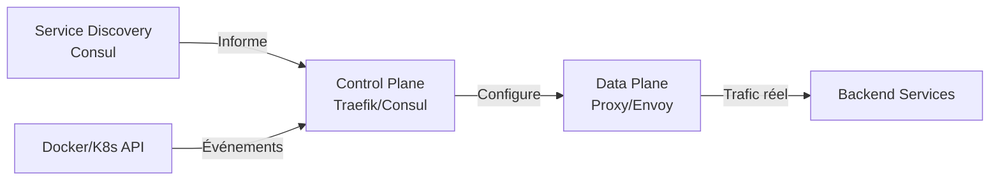
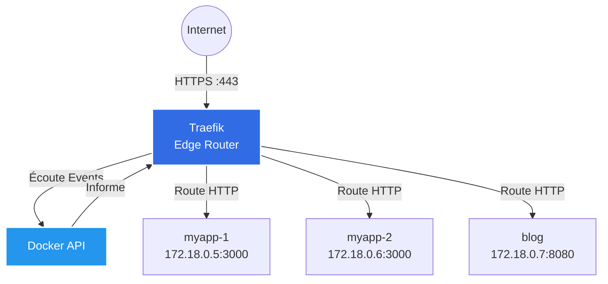
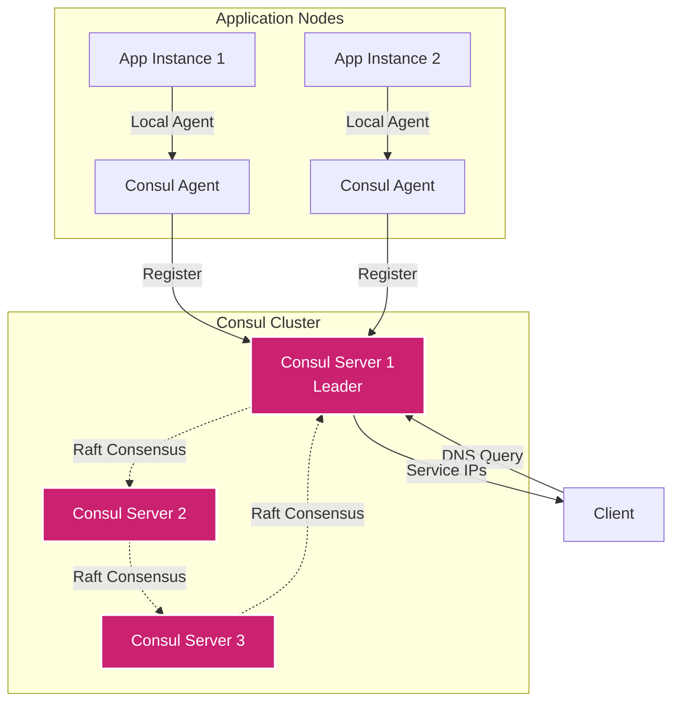
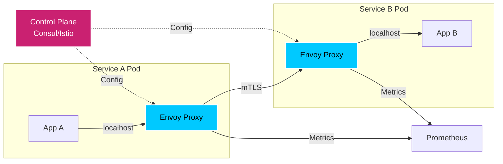

# Modern Networking: Traefik & Consul

`#traefik` `#consul` `#service-mesh` `#proxy` `#discovery`

Gérer le trafic quand les IPs changent chaque minute. Routing dynamique et Service Discovery pour environnements Docker/Kubernetes.

---

## Le Problème du Statique

### Nginx/HAProxy Classique : Le Cauchemar des Conteneurs

```
┌─────────────────────────────────────────────────────────────┐
│                  APPROCHE STATIQUE (LEGACY)                  │
├─────────────────────────────────────────────────────────────┤
│                                                              │
│  1. Déployer un conteneur "myapp" (IP : 172.18.0.5)         │
│  2. Écrire la config Nginx :                                │
│     upstream myapp {                                        │
│       server 172.18.0.5:3000;                               │
│     }                                                       │
│  3. Reload Nginx                                            │
│  4. ✓ Ça fonctionne !                                       │
│                                                              │
│  ... 5 minutes plus tard ...                                │
│                                                              │
│  5. Docker scale myapp=3 (nouvelles IPs: .6, .7)            │
│  6. Nginx envoie toujours le trafic vers .5 uniquement      │
│  7. ✗ Les nouvelles instances ne reçoivent rien             │
│  8. Il faut MANUELLEMENT :                                  │
│     - Récupérer les nouvelles IPs                           │
│     - Modifier nginx.conf                                   │
│     - Reload Nginx                                          │
│     - Répéter à chaque déploiement                          │
│                                                              │
│  Résultat : Chaos en production                             │
│                                                              │
├─────────────────────────────────────────────────────────────┤
│                  APPROCHE DYNAMIQUE (MODERNE)                │
├─────────────────────────────────────────────────────────────┤
│                                                              │
│  1. Déployer un conteneur "myapp" avec des LABELS Docker   │
│  2. Traefik détecte automatiquement le conteneur (API)     │
│  3. Traefik crée la route automatiquement                  │
│  4. ✓ Ça fonctionne !                                       │
│                                                              │
│  5. Docker scale myapp=3                                    │
│  6. Traefik détecte les 3 instances (en temps réel)        │
│  7. Load balancing automatique vers les 3                  │
│  8. ✓ Aucune intervention manuelle                          │
│                                                              │
│  Résultat : Infrastructure qui s'adapte automatiquement     │
│                                                              │
└─────────────────────────────────────────────────────────────┘
```

### Control Plane vs Data Plane

**Concept fondamental du modern networking :**



| Composant | Rôle | Exemple |
|-----------|------|---------|
| **Control Plane** | Décisions de routing, Configuration dynamique | Traefik, Consul |
| **Data Plane** | Traitement du trafic réseau réel | Envoy, Nginx (proxy mode) |
| **Service Discovery** | Registre des services disponibles | Consul, etcd, Eureka |

**En résumé :**
- **Control Plane** : "Envoie le trafic vers l'instance X"
- **Data Plane** : "J'exécute la décision et transfère les paquets"

---

## Traefik (Edge Router)

### Architecture : Reverse Proxy Auto-Configurant



**Traefik = Reverse Proxy qui se configure automatiquement en lisant les labels Docker/K8s**

### Configuration Statique vs Dynamique

**Deux niveaux de configuration dans Traefik :**

#### 1. Configuration Statique (traefik.yml)

**Définit COMMENT Traefik fonctionne (ports, providers, logs).**

```yaml
# traefik.yml
# Configuration statique (chargée au démarrage)

# EntryPoints : Ports d'écoute
entryPoints:
  web:
    address: ":80"
  websecure:
    address: ":443"

# Providers : Où chercher les services
providers:
  docker:
    endpoint: "unix:///var/run/docker.sock"
    exposedByDefault: false  # Sécurité : opt-in explicite
  file:
    filename: "/etc/traefik/dynamic.yml"
    watch: true

# API & Dashboard
api:
  dashboard: true
  insecure: true  # Dashboard sur :8080 (DEV uniquement)

# Logs
log:
  level: INFO

# Access Logs
accessLog: {}
```

#### 2. Configuration Dynamique (Labels Docker)

**Définit QUELS services router (règles métier).**

```yaml
# docker-compose.yml
version: '3.8'

services:
  traefik:
    image: traefik:v3.0
    container_name: traefik
    ports:
      - "80:80"
      - "443:443"
      - "8080:8080"  # Dashboard
    volumes:
      - /var/run/docker.sock:/var/run/docker.sock:ro
      - ./traefik.yml:/etc/traefik/traefik.yml:ro
    networks:
      - web

  # Application exemple
  whoami:
    image: traefik/whoami:latest
    container_name: whoami
    labels:
      # Activer Traefik pour ce conteneur
      - "traefik.enable=true"

      # Règle de routing : Host-based
      - "traefik.http.routers.whoami.rule=Host(`whoami.localhost`)"

      # EntryPoint à utiliser
      - "traefik.http.routers.whoami.entrypoints=web"

      # Port du conteneur (si non standard)
      - "traefik.http.services.whoami.loadbalancer.server.port=80"
    networks:
      - web

networks:
  web:
    external: false
```

**Tester :**

```bash
# Démarrer la stack
docker-compose up -d

# Accéder au service
curl -H "Host: whoami.localhost" http://localhost

# Output attendu :
# Hostname: whoami
# IP: 172.18.0.3
# GET / HTTP/1.1
# Host: whoami.localhost
```

### Exemple Concret : Stack Multi-Services

**Scénario :** 3 applications (frontend, API, blog) avec routing automatique.

```yaml
# docker-compose.yml
version: '3.8'

services:
  traefik:
    image: traefik:v3.0
    container_name: traefik
    command:
      - "--api.dashboard=true"
      - "--api.insecure=true"
      - "--providers.docker=true"
      - "--providers.docker.exposedbydefault=false"
      - "--entrypoints.web.address=:80"
      - "--entrypoints.websecure.address=:443"
    ports:
      - "80:80"
      - "443:443"
      - "8080:8080"
    volumes:
      - /var/run/docker.sock:/var/run/docker.sock:ro
    networks:
      - web

  frontend:
    image: nginx:alpine
    container_name: frontend
    labels:
      - "traefik.enable=true"
      - "traefik.http.routers.frontend.rule=Host(`app.localhost`)"
      - "traefik.http.routers.frontend.entrypoints=web"
    networks:
      - web

  api:
    image: httpd:alpine
    container_name: api
    labels:
      - "traefik.enable=true"
      # Routing basé sur le path
      - "traefik.http.routers.api.rule=Host(`app.localhost`) && PathPrefix(`/api`)"
      - "traefik.http.routers.api.entrypoints=web"
      # Middleware pour retirer le préfixe /api
      - "traefik.http.middlewares.api-strip.stripprefix.prefixes=/api"
      - "traefik.http.routers.api.middlewares=api-strip"
    networks:
      - web

  blog:
    image: ghost:alpine
    container_name: blog
    labels:
      - "traefik.enable=true"
      - "traefik.http.routers.blog.rule=Host(`blog.localhost`)"
      - "traefik.http.routers.blog.entrypoints=web"
      - "traefik.http.services.blog.loadbalancer.server.port=2368"
    networks:
      - web

networks:
  web:
    driver: bridge
```

**Routing résultant :**

| URL | Backend | Port Conteneur |
|-----|---------|----------------|
| `http://app.localhost` | frontend (Nginx) | 80 |
| `http://app.localhost/api` | api (httpd) | 80 |
| `http://blog.localhost` | blog (Ghost) | 2368 |

**Tester :**

```bash
# Démarrer la stack
docker-compose up -d

# Tester le frontend
curl -H "Host: app.localhost" http://localhost

# Tester l'API
curl -H "Host: app.localhost" http://localhost/api

# Tester le blog
curl -H "Host: blog.localhost" http://localhost

# Dashboard Traefik : http://localhost:8080
```

!!! tip "Dashboard Traefik : Outil de Debug Visuel Incroyable"
    Le dashboard Traefik (port 8080) affiche en temps réel :

    - **Tous les routers actifs** (règles de routing)
    - **Tous les services détectés** (backends)
    - **Tous les middlewares** (BasicAuth, CORS, etc.)
    - **Statistiques de trafic** (requêtes/s, erreurs)

    **Usage en production :** Sécuriser le dashboard avec BasicAuth ou désactiver complètement (`api.insecure=false`).

### Middlewares : Sécuriser les Routes

**Les middlewares = Intercepteurs de requêtes (auth, rate limit, headers, etc.)**

#### 1. BasicAuth (Protection par mot de passe)

```yaml
# docker-compose.yml (extrait)
services:
  admin-panel:
    image: nginx:alpine
    labels:
      - "traefik.enable=true"
      - "traefik.http.routers.admin.rule=Host(`admin.localhost`)"

      # Middleware BasicAuth
      - "traefik.http.middlewares.admin-auth.basicauth.users=admin:$$apr1$$H6uskkkW$$IgXLP6ewTrSuBkTrqE8wj/"
      - "traefik.http.routers.admin.middlewares=admin-auth"
```

**Générer le hash de mot de passe :**

```bash
# Utiliser htpasswd (Apache Utils)
htpasswd -nb admin mypassword

# Output :
# admin:$apr1$H6uskkkW$IgXLP6ewTrSuBkTrqE8wj/

# IMPORTANT : Doubler les $ dans docker-compose.yml ($$)
```

#### 2. IPWhitelist (Restriction par IP)

```yaml
services:
  internal-api:
    image: httpd:alpine
    labels:
      - "traefik.enable=true"
      - "traefik.http.routers.internal.rule=Host(`internal.localhost`)"

      # Middleware IPWhitelist
      - "traefik.http.middlewares.internal-whitelist.ipwhitelist.sourcerange=10.0.0.0/8,192.168.0.0/16"
      - "traefik.http.routers.internal.middlewares=internal-whitelist"
```

#### 3. RateLimit (Protection DDoS)

```yaml
services:
  public-api:
    image: nginx:alpine
    labels:
      - "traefik.enable=true"
      - "traefik.http.routers.public.rule=Host(`api.localhost`)"

      # Middleware RateLimit (100 req/s par IP)
      - "traefik.http.middlewares.api-ratelimit.ratelimit.average=100"
      - "traefik.http.middlewares.api-ratelimit.ratelimit.burst=50"
      - "traefik.http.routers.public.middlewares=api-ratelimit"
```

#### 4. Headers (Sécurité HTTP)

```yaml
services:
  webapp:
    image: nginx:alpine
    labels:
      - "traefik.enable=true"
      - "traefik.http.routers.webapp.rule=Host(`app.localhost`)"

      # Middleware Headers (Security)
      - "traefik.http.middlewares.security-headers.headers.framedeny=true"
      - "traefik.http.middlewares.security-headers.headers.sslredirect=true"
      - "traefik.http.middlewares.security-headers.headers.stsSeconds=31536000"
      - "traefik.http.middlewares.security-headers.headers.contentTypeNosniff=true"
      - "traefik.http.routers.webapp.middlewares=security-headers"
```

**Chaîner plusieurs middlewares :**

```yaml
labels:
  - "traefik.http.routers.secure-api.middlewares=api-ratelimit,api-auth,security-headers"
```

### HTTPS : Let's Encrypt Automatique

**Traefik peut obtenir automatiquement des certificats SSL via Let's Encrypt (Challenge HTTP-01).**

```yaml
# traefik.yml (configuration statique)
entryPoints:
  web:
    address: ":80"
    http:
      redirections:
        entryPoint:
          to: websecure
          scheme: https
  websecure:
    address: ":443"

# Let's Encrypt
certificatesResolvers:
  letsencrypt:
    acme:
      email: admin@example.com
      storage: /letsencrypt/acme.json
      httpChallenge:
        entryPoint: web
```

```yaml
# docker-compose.yml
version: '3.8'

services:
  traefik:
    image: traefik:v3.0
    container_name: traefik
    ports:
      - "80:80"
      - "443:443"
    volumes:
      - /var/run/docker.sock:/var/run/docker.sock:ro
      - ./traefik.yml:/etc/traefik/traefik.yml:ro
      - ./letsencrypt:/letsencrypt
    networks:
      - web

  myapp:
    image: nginx:alpine
    labels:
      - "traefik.enable=true"
      - "traefik.http.routers.myapp.rule=Host(`myapp.example.com`)"
      - "traefik.http.routers.myapp.entrypoints=websecure"

      # Activer Let's Encrypt
      - "traefik.http.routers.myapp.tls.certresolver=letsencrypt"
    networks:
      - web

networks:
  web:
    driver: bridge
```

**Résultat :**
1. Traefik détecte le conteneur `myapp`
2. Traefik demande un certificat Let's Encrypt pour `myapp.example.com`
3. Traefik répond au challenge HTTP-01 (via port 80)
4. Certificat obtenu et stocké dans `/letsencrypt/acme.json`
5. HTTPS automatiquement activé sur `https://myapp.example.com`

**Permissions du fichier acme.json :**

```bash
# IMPORTANT : acme.json doit être en mode 600
touch letsencrypt/acme.json
chmod 600 letsencrypt/acme.json
```

---

## Consul (Service Discovery)

### Concept : DNS Dynamique pour Microservices

**Consul = Registre centralisé des services disponibles + Health Checks + KV Store**

```
┌─────────────────────────────────────────────────────────────┐
│                  PROBLÈME SANS SERVICE DISCOVERY             │
├─────────────────────────────────────────────────────────────┤
│                                                              │
│  Frontend veut appeler l'API :                              │
│  1. Quelle est l'IP de l'API ? (Hardcoder 192.168.1.10 ?)  │
│  2. Si l'API scale à 3 instances, lesquelles choisir ?     │
│  3. Si une instance crash, comment l'éviter ?              │
│                                                              │
│  Solution legacy : HAProxy avec conf statique              │
│  Problème : Nécessite reload à chaque changement           │
│                                                              │
├─────────────────────────────────────────────────────────────┤
│                  SOLUTION : CONSUL SERVICE DISCOVERY         │
├─────────────────────────────────────────────────────────────┤
│                                                              │
│  1. L'API s'enregistre dans Consul au démarrage            │
│  2. Frontend demande à Consul : "Où est l'API ?"           │
│  3. Consul répond : "3 instances : .10, .11, .12"          │
│  4. Frontend appelle .10                                    │
│  5. .10 crash → Health Check échoue                        │
│  6. Consul retire .10 du registre immédiatement            │
│  7. Frontend demande à nouveau → Reçoit seulement .11, .12 │
│                                                              │
│  Résultat : Découverte automatique + Self-healing          │
│                                                              │
└─────────────────────────────────────────────────────────────┘
```

### Architecture : Server + Agents



**Composants :**

| Composant | Rôle | Nombre |
|-----------|------|--------|
| **Consul Server** | Stocke l'état du cluster (services, health checks, KV) | 3 ou 5 (consensus Raft) |
| **Consul Agent** | S'exécute sur chaque node application, enregistre les services | 1 par node |
| **Consul Client** | Application qui interroge Consul (via DNS ou HTTP API) | N |

### Déploiement Consul : Docker Compose

```yaml
# docker-compose.yml
version: '3.8'

services:
  # Consul Server (mode dev single-node)
  consul-server:
    image: hashicorp/consul:latest
    container_name: consul
    command: agent -server -ui -bootstrap-expect=1 -client=0.0.0.0
    ports:
      - "8500:8500"  # HTTP API + UI
      - "8600:8600/udp"  # DNS
    environment:
      - CONSUL_BIND_INTERFACE=eth0
    volumes:
      - consul-data:/consul/data
    networks:
      - consul-net

  # Application exemple (auto-registration)
  api-service:
    image: nginx:alpine
    container_name: api-1
    labels:
      - "consul.service.name=api"
      - "consul.service.port=80"
    networks:
      - consul-net
    depends_on:
      - consul-server

volumes:
  consul-data:

networks:
  consul-net:
    driver: bridge
```

**Accéder à Consul UI :**

```bash
# Démarrer Consul
docker-compose up -d

# Accéder à l'interface web
# http://localhost:8500
```

### Service Registration : Enregistrer un Service

**Deux méthodes : API HTTP ou Fichier JSON.**

#### Méthode 1 : API HTTP

```bash
# Enregistrer un service "web" avec health check
curl -X PUT http://localhost:8500/v1/agent/service/register \
  -d '{
    "ID": "web-1",
    "Name": "web",
    "Tags": ["frontend", "v1.0"],
    "Address": "192.168.1.10",
    "Port": 80,
    "Check": {
      "HTTP": "http://192.168.1.10:80/health",
      "Interval": "10s",
      "Timeout": "5s"
    }
  }'

# Lister les services enregistrés
curl http://localhost:8500/v1/catalog/services

# Output :
# {
#   "consul": [],
#   "web": ["frontend", "v1.0"]
# }

# Résoudre le service via DNS
dig @127.0.0.1 -p 8600 web.service.consul

# Output :
# ;; ANSWER SECTION:
# web.service.consul.    0    IN    A    192.168.1.10
```

#### Méthode 2 : Fichier JSON (Auto-registration)

```json
// /etc/consul.d/web.json
{
  "service": {
    "id": "web-1",
    "name": "web",
    "tags": ["frontend", "v1.0"],
    "address": "192.168.1.10",
    "port": 80,
    "check": {
      "http": "http://192.168.1.10:80/health",
      "interval": "10s",
      "timeout": "5s"
    }
  }
}
```

```bash
# Recharger la configuration Consul
consul reload

# Le service est automatiquement enregistré
```

### Health Checks : Self-Healing Automatique

**Les Health Checks permettent à Consul de retirer automatiquement les instances défaillantes.**

**Types de Health Checks :**

| Type | Description | Exemple |
|------|-------------|---------|
| **HTTP** | GET sur un endpoint (code 2xx = OK) | `http://api:80/health` |
| **TCP** | Connexion TCP réussie | `tcp://db:5432` |
| **Script** | Exécute un script (exit 0 = OK) | `/usr/local/bin/check.sh` |
| **TTL** | L'application doit envoyer un heartbeat | Interval: 30s |
| **gRPC** | Appel gRPC health check | `grpc://service:50051` |

**Exemple : HTTP Health Check**

```json
{
  "service": {
    "name": "api",
    "port": 3000,
    "check": {
      "http": "http://localhost:3000/health",
      "interval": "10s",
      "timeout": "2s"
    }
  }
}
```

**Comportement :**
1. Consul appelle `GET http://localhost:3000/health` toutes les 10 secondes
2. Si la réponse est 200-299 → Service OK (dans le registre)
3. Si la réponse est 4xx, 5xx ou timeout → Service CRITICAL (retiré du DNS)

**Tester avec une API réelle :**

```yaml
# docker-compose.yml
version: '3.8'

services:
  consul:
    image: hashicorp/consul:latest
    command: agent -server -ui -bootstrap-expect=1 -client=0.0.0.0
    ports:
      - "8500:8500"
      - "8600:8600/udp"
    networks:
      - consul-net

  api-healthy:
    image: traefik/whoami:latest
    container_name: api-healthy
    networks:
      - consul-net

  api-failing:
    image: nginx:alpine
    container_name: api-failing
    # Aucun serveur web actif → Health check va échouer
    command: sh -c "exit 1"
    networks:
      - consul-net

networks:
  consul-net:
```

**Enregistrer les services avec health checks :**

```bash
# Service sain
curl -X PUT http://localhost:8500/v1/agent/service/register -d '{
  "ID": "api-healthy",
  "Name": "api",
  "Address": "api-healthy",
  "Port": 80,
  "Check": {
    "HTTP": "http://api-healthy:80",
    "Interval": "5s"
  }
}'

# Service défaillant
curl -X PUT http://localhost:8500/v1/agent/service/register -d '{
  "ID": "api-failing",
  "Name": "api",
  "Address": "api-failing",
  "Port": 80,
  "Check": {
    "HTTP": "http://api-failing:80",
    "Interval": "5s"
  }
}'

# Interroger Consul DNS après 10 secondes
dig @127.0.0.1 -p 8600 api.service.consul

# Output : Seul api-healthy apparaît (api-failing retiré)
```

### KV Store : Configuration Dynamique

**Consul KV = Base clé-valeur distribuée pour stocker la config des applications.**

**Cas d'usage :**
- Feature flags (activer/désactiver des fonctionnalités)
- Configuration dynamique (DB connection string, API keys)
- Coordination distribuée (leader election)

**Opérations de base :**

```bash
# Écrire une clé
consul kv put config/db/host postgres.example.com
consul kv put config/db/port 5432
consul kv put config/feature/new-ui true

# Lire une clé
consul kv get config/db/host
# Output : postgres.example.com

# Lister toutes les clés
consul kv get -recurse config/

# Output :
# config/db/host:postgres.example.com
# config/db/port:5432
# config/feature/new-ui:true

# Supprimer une clé
consul kv delete config/feature/new-ui

# Watch (surveiller les changements)
consul watch -type=key -key=config/feature/new-ui /usr/local/bin/reload-app.sh
```

**Utilisation dans une application (API HTTP) :**

```python
# app.py (Python Flask exemple)
import consul
import os

# Connexion à Consul
c = consul.Consul(host='consul-server', port=8500)

# Lire la configuration depuis Consul KV
def get_config(key):
    index, data = c.kv.get(key)
    if data:
        return data['Value'].decode('utf-8')
    return None

# Exemple : Récupérer l'hôte de la DB
db_host = get_config('config/db/host')
print(f"Connecting to database at {db_host}")

# Watch : Réagir aux changements
index = None
while True:
    index, data = c.kv.get('config/feature/new-ui', index=index)
    if data:
        new_ui_enabled = data['Value'].decode('utf-8') == 'true'
        print(f"New UI feature flag: {new_ui_enabled}")
```

**Avantages :**
- ✅ Configuration centralisée (pas de fichiers .env dispersés)
- ✅ Hot-reload sans redémarrage (watch les changements)
- ✅ Versioning (Consul KV garde l'historique)
- ✅ Haute disponibilité (réplication Raft)

---

## Pattern Service Mesh (Intro)

### Le Problème de la Communication Microservices

```
┌─────────────────────────────────────────────────────────────┐
│                  SANS SERVICE MESH                           │
├─────────────────────────────────────────────────────────────┤
│                                                              │
│  Problèmes :                                                │
│  ✗ Trafic non chiffré entre services (HTTP plaintext)      │
│  ✗ Pas d'authentification mutuelle (n'importe qui appelle) │
│  ✗ Pas de métriques (impossible de voir les appels)        │
│  ✗ Retry/Timeout gérés dans chaque app (duplication code)  │
│  ✗ Circuit breaker à implémenter partout                   │
│                                                              │
│  Résultat : Chaque équipe dev réinvente la roue            │
│                                                              │
├─────────────────────────────────────────────────────────────┤
│                  AVEC SERVICE MESH                           │
├─────────────────────────────────────────────────────────────┤
│                                                              │
│  Solutions :                                                │
│  ✓ mTLS automatique (chiffrement + authent mutuelle)       │
│  ✓ Observabilité native (traces, métriques, logs)          │
│  ✓ Retry/Timeout configurables (sans toucher le code)      │
│  ✓ Circuit breaker centralisé                              │
│  ✓ Traffic splitting (canary, A/B testing)                 │
│                                                              │
│  Résultat : Fonctionnalités réseau déléguées à la plateforme │
│                                                              │
└─────────────────────────────────────────────────────────────┘
```

### Architecture Service Mesh



**Concept clé : Sidecar Proxy**

Chaque service a un proxy (Envoy) déployé à côté qui :
1. Intercepte tout le trafic entrant/sortant
2. Applique les règles de sécurité (mTLS)
3. Collecte les métriques
4. Gère les retry/timeout

**L'application ne sait même pas que le mesh existe (transparent).**

### Consul Connect : Service Mesh Natif

**Consul Connect = Extension de Consul pour transformer le Service Discovery en Service Mesh complet.**

**Fonctionnalités :**

| Fonctionnalité | Description |
|----------------|-------------|
| **mTLS Automatique** | Certificats générés automatiquement, rotation automatique |
| **Intentions** | ACLs déclaratives ("Service A peut appeler Service B") |
| **Traffic Splitting** | Canary deployments (90% v1, 10% v2) |
| **Observabilité** | Métriques exportées vers Prometheus |
| **L7 Traffic Management** | Routing basé sur les headers HTTP |

**Exemple : Activer Consul Connect**

```yaml
# docker-compose.yml
version: '3.8'

services:
  consul:
    image: hashicorp/consul:latest
    command: agent -server -ui -bootstrap-expect=1 -client=0.0.0.0
    ports:
      - "8500:8500"
    environment:
      - CONSUL_BIND_INTERFACE=eth0
    networks:
      - mesh

  # Service A avec sidecar proxy
  web:
    image: nginx:alpine
    networks:
      - mesh
    depends_on:
      - consul

  # Sidecar Envoy pour web
  web-sidecar-proxy:
    image: envoyproxy/envoy:v1.28-latest
    command: >
      envoy -c /etc/envoy/envoy.yaml
    volumes:
      - ./envoy-web.yaml:/etc/envoy/envoy.yaml
    networks:
      - mesh
    depends_on:
      - consul

networks:
  mesh:
    driver: bridge
```

**Configuration Envoy (géré par Consul Connect) :**

```yaml
# envoy-web.yaml (simplifié)
static_resources:
  listeners:
    - name: listener_0
      address:
        socket_address:
          address: 0.0.0.0
          port_value: 20000
      filter_chains:
        - filters:
            - name: envoy.filters.network.http_connection_manager
              typed_config:
                "@type": type.googleapis.com/envoy.extensions.filters.network.http_connection_manager.v3.HttpConnectionManager
                stat_prefix: ingress_http
                route_config:
                  name: local_route
                  virtual_hosts:
                    - name: backend
                      domains: ["*"]
                      routes:
                        - match:
                            prefix: "/"
                          route:
                            cluster: local_app
                http_filters:
                  - name: envoy.filters.http.router

  clusters:
    - name: local_app
      connect_timeout: 0.25s
      type: STATIC
      load_assignment:
        cluster_name: local_app
        endpoints:
          - lb_endpoints:
              - endpoint:
                  address:
                    socket_address:
                      address: 127.0.0.1
                      port_value: 80
```

**Intentions (ACLs) :**

```bash
# Autoriser "web" à appeler "api"
consul intention create web api

# Refuser "public" à appeler "internal"
consul intention create -deny public internal

# Lister toutes les intentions
consul intention list
```

**Avantages Consul Connect :**
- ✅ Pas besoin de changer le code applicatif
- ✅ mTLS automatique (zéro config)
- ✅ Segmentation réseau fine (intentions)
- ✅ Compatible avec Kubernetes et VMs

**Alternatives :**
- **Istio** (plus complexe, plus de fonctionnalités)
- **Linkerd** (plus simple, orienté Kubernetes)
- **AWS App Mesh** (cloud AWS uniquement)

---

## Référence Rapide

### Traefik

**Ports :**

| Port | Usage |
|------|-------|
| 80 | HTTP (entrypoint web) |
| 443 | HTTPS (entrypoint websecure) |
| 8080 | Dashboard (dev mode) |

**Commandes :**

```bash
# Afficher les routers actifs
docker exec traefik traefik healthcheck

# Logs en temps réel
docker logs -f traefik

# Tester un routing
curl -H "Host: myapp.localhost" http://localhost

# Dashboard
http://localhost:8080/dashboard/
```

**Labels Docker clés :**

```yaml
labels:
  # Activer Traefik
  - "traefik.enable=true"

  # Routing
  - "traefik.http.routers.<name>.rule=Host(`example.com`)"
  - "traefik.http.routers.<name>.entrypoints=websecure"

  # HTTPS
  - "traefik.http.routers.<name>.tls.certresolver=letsencrypt"

  # Middleware
  - "traefik.http.routers.<name>.middlewares=auth,ratelimit"

  # Port backend
  - "traefik.http.services.<name>.loadbalancer.server.port=8080"
```

### Consul

**Ports :**

| Port | Usage |
|------|-------|
| 8500 | HTTP API + UI |
| 8600 | DNS (UDP) |
| 8300 | Server RPC (cluster) |
| 8301 | LAN Gossip (Serf) |
| 8302 | WAN Gossip (multi-DC) |

**Commandes :**

```bash
# Membres du cluster
consul members

# Services enregistrés
consul catalog services

# Health checks
consul catalog nodes -service=web -detailed

# KV Store
consul kv put config/app/version 1.0
consul kv get config/app/version

# DNS Query
dig @127.0.0.1 -p 8600 web.service.consul
dig @127.0.0.1 -p 8600 web.service.consul SRV  # Avec port

# API HTTP
curl http://localhost:8500/v1/catalog/services
curl http://localhost:8500/v1/health/service/web

# UI
http://localhost:8500
```

**Service Registration (API) :**

```bash
curl -X PUT http://localhost:8500/v1/agent/service/register -d '{
  "Name": "myapp",
  "Address": "192.168.1.10",
  "Port": 8080,
  "Check": {
    "HTTP": "http://192.168.1.10:8080/health",
    "Interval": "10s"
  }
}'
```

**De-register :**

```bash
curl -X PUT http://localhost:8500/v1/agent/service/deregister/myapp
```

---

## Comparaison : Quand Utiliser Quoi ?

| Besoin | Solution | Pourquoi |
|--------|----------|----------|
| **Reverse proxy simple (statique)** | Nginx/HAProxy | Config simple, performant, bien connu |
| **Reverse proxy dynamique (Docker)** | Traefik | Auto-découverte via labels Docker |
| **Reverse proxy K8s** | Traefik/Nginx Ingress | Intégration native K8s Ingress |
| **Service Discovery** | Consul | DNS dynamique + Health checks |
| **Service Mesh (mTLS)** | Consul Connect/Istio | Sécurité inter-services automatique |
| **API Gateway** | Kong/Traefik | Rate limiting, auth, plugins |
| **Load Balancer L4** | HAProxy/Nginx | Performance maximale (TCP/UDP) |
| **Load Balancer L7** | Traefik/Envoy | Routing HTTP avancé (headers, path) |

**Recommandations :**

- **Startup/PME** : Traefik + Docker (simplicité)
- **Entreprise (VMs)** : Consul + HAProxy (stabilité)
- **Kubernetes** : Traefik Ingress + Consul (ou Istio si besoin mesh)
- **Microservices critiques** : Service Mesh (Consul Connect/Istio/Linkerd)

---

## Pour Aller Plus Loin

### Traefik

- [Documentation Officielle](https://doc.traefik.io/traefik/)
- [Traefik Labs Blog](https://traefik.io/blog/)
- [Traefik Plugins](https://plugins.traefik.io/)

### Consul

- [Documentation Officielle](https://developer.hashicorp.com/consul)
- [Consul Architecture](https://developer.hashicorp.com/consul/docs/architecture)
- [Consul Connect](https://developer.hashicorp.com/consul/docs/connect)

### Service Mesh

- [Istio Documentation](https://istio.io/latest/docs/)
- [Linkerd](https://linkerd.io/)
- [Service Mesh Comparison](https://servicemesh.es/)
