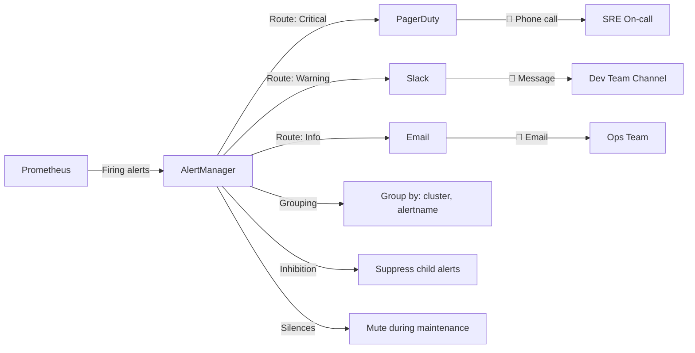
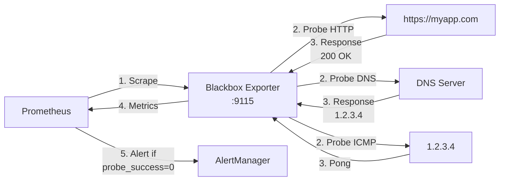

# Advanced Observability: Alerting & ELK

`#alertmanager` `#blackbox` `#elk` `#sre` `#monitoring`

Passer de la visualisation passive à l'action proactive. Gestion des astreintes et logs à grande échelle.

---

## AlertManager : Le Cerveau des Alertes

### Pourquoi Prometheus ne Suffit Pas ?

**Prometheus = Collecte + Évaluation des alertes**
**AlertManager = Déduplication + Groupement + Routage + Silence**

```
┌─────────────────────────────────────────────────────────────┐
│              SANS ALERTMANAGER (Chaos)                       │
├─────────────────────────────────────────────────────────────┤
│                                                              │
│  Datacenter down → 50 serveurs down                         │
│                                                              │
│  Prometheus envoie :                                        │
│  ├── 50 emails "Server down"                                │
│  ├── 50 SMS                                                 │
│  └── 50 appels PagerDuty                                    │
│                                                              │
│  SRE on-call :                                              │
│  └── 📱💥💥💥 (150 notifications en 1 minute)               │
│                                                              │
├─────────────────────────────────────────────────────────────┤
│              AVEC ALERTMANAGER (Intelligence)                │
├─────────────────────────────────────────────────────────────┤
│                                                              │
│  Datacenter down → 50 serveurs down                         │
│                                                              │
│  AlertManager :                                             │
│  ├── Groupe les 50 alertes similaires                       │
│  ├── Applique inhibition (datacenter down > serveurs)       │
│  └── Envoie 1 seule notification :                          │
│      "Datacenter Paris DOWN - 50 serveurs affectés"         │
│                                                              │
│  SRE on-call :                                              │
│  └── 📱 (1 notification claire et actionnable)              │
│                                                              │
└─────────────────────────────────────────────────────────────┘
```

**Fonctionnalités clés d'AlertManager :**

| Fonctionnalité | Description | Valeur |
|----------------|-------------|--------|
| **Déduplication** | Fusionne les alertes identiques | Évite les doublons |
| **Groupement** | Groupe les alertes similaires | 1 notification pour N alertes |
| **Routage** | Envoie à la bonne équipe/canal | Critical → PagerDuty, Warning → Slack |
| **Inhibition** | Supprime les alertes dérivées | Datacenter down > Serveurs down |
| **Silences** | Mute temporairement | Maintenance planifiée |
| **Repeat Interval** | Re-notifie si non résolu | Évite l'oubli |

---

### Architecture AlertManager



---

### Configuration AlertManager

**Structure du fichier `alertmanager.yml` :**

```yaml
# ============================================================
# CONFIGURATION ALERTMANAGER
# ============================================================

global:
  # Résolution par défaut
  resolve_timeout: 5m

  # Config Slack globale
  slack_api_url: 'https://hooks.slack.com/services/T00000000/B00000000/XXXXXXXXXXXXXXXXXXXX'

# ============================================================
# TEMPLATES (Personnalisation des messages)
# ============================================================

templates:
  - '/etc/alertmanager/templates/*.tmpl'

# ============================================================
# ROUTE TREE (L'Arbre de Décision)
# ============================================================

route:
  # Route racine (catch-all)
  receiver: 'default-receiver'

  # Groupement des alertes
  group_by: ['cluster', 'alertname']

  # Attendre 30s avant d'envoyer (pour grouper)
  group_wait: 30s

  # Attendre 5min avant de grouper à nouveau
  group_interval: 5m

  # Re-notifier toutes les 4h si non résolu
  repeat_interval: 4h

  # Routes enfants (matching spécifique)
  routes:
    # ──────────────────────────────────────────────────────
    # ROUTE 1 : Alertes CRITICAL → PagerDuty
    # ──────────────────────────────────────────────────────
    - match:
        severity: critical
      receiver: 'pagerduty-critical'
      group_wait: 10s          # Envoyer rapidement (10s)
      repeat_interval: 1h      # Re-notifier toutes les heures

      routes:
        # Sous-route : Database critical → Équipe DB
        - match:
            team: database
          receiver: 'pagerduty-db-team'

    # ──────────────────────────────────────────────────────
    # ROUTE 2 : Alertes WARNING → Slack
    # ──────────────────────────────────────────────────────
    - match:
        severity: warning
      receiver: 'slack-warnings'
      group_wait: 1m
      repeat_interval: 12h

    # ──────────────────────────────────────────────────────
    # ROUTE 3 : Alertes INFO → Email (low priority)
    # ──────────────────────────────────────────────────────
    - match:
        severity: info
      receiver: 'email-ops'
      group_wait: 5m
      repeat_interval: 24h

    # ──────────────────────────────────────────────────────
    # ROUTE 4 : Environnement DEV → Discord (pas de pagerduty)
    # ──────────────────────────────────────────────────────
    - match:
        environment: dev
      receiver: 'discord-dev'

# ============================================================
# RECEIVERS (Canaux de Notification)
# ============================================================

receivers:
  # ──────────────────────────────────────────────────────
  # DEFAULT : Slack général
  # ──────────────────────────────────────────────────────
  - name: 'default-receiver'
    slack_configs:
      - channel: '#alerts'
        title: '🚨 Alert: {{ .GroupLabels.alertname }}'
        text: |
          *Summary:* {{ .CommonAnnotations.summary }}
          *Description:* {{ .CommonAnnotations.description }}
          *Severity:* {{ .CommonLabels.severity }}
          *Cluster:* {{ .CommonLabels.cluster }}

  # ──────────────────────────────────────────────────────
  # PAGERDUTY : Alertes critiques
  # ──────────────────────────────────────────────────────
  - name: 'pagerduty-critical'
    pagerduty_configs:
      - service_key: '<PAGERDUTY_SERVICE_KEY>'
        description: '{{ .CommonAnnotations.summary }}'
        severity: '{{ .CommonLabels.severity }}'

  # ──────────────────────────────────────────────────────
  # PAGERDUTY : Équipe Database
  # ──────────────────────────────────────────────────────
  - name: 'pagerduty-db-team'
    pagerduty_configs:
      - service_key: '<PAGERDUTY_DB_TEAM_KEY>'
        description: '[DB] {{ .CommonAnnotations.summary }}'

  # ──────────────────────────────────────────────────────
  # SLACK : Warnings
  # ──────────────────────────────────────────────────────
  - name: 'slack-warnings'
    slack_configs:
      - channel: '#alerts-warnings'
        icon_emoji: ':warning:'
        title: '⚠️ Warning: {{ .GroupLabels.alertname }}'
        text: |
          *Summary:* {{ .CommonAnnotations.summary }}
          *Cluster:* {{ .CommonLabels.cluster }}
          *Instances:* {{ .Alerts | len }} affected

  # ──────────────────────────────────────────────────────
  # DISCORD : Environnement Dev
  # ──────────────────────────────────────────────────────
  - name: 'discord-dev'
    webhook_configs:
      - url: 'https://discord.com/api/webhooks/XXXXXXXXXX/YYYYYYYYYYYYYYYYYY'
        send_resolved: true

  # ──────────────────────────────────────────────────────
  # EMAIL : Ops Team
  # ──────────────────────────────────────────────────────
  - name: 'email-ops'
    email_configs:
      - to: 'ops-team@company.com'
        from: 'alertmanager@company.com'
        smarthost: 'smtp.company.com:587'
        auth_username: 'alertmanager@company.com'
        auth_password: '<SMTP_PASSWORD>'
        headers:
          Subject: '[AlertManager] {{ .GroupLabels.alertname }}'

# ============================================================
# INHIBITION RULES (Suppression d'Alertes Dérivées)
# ============================================================

inhibit_rules:
  # ──────────────────────────────────────────────────────
  # RÈGLE 1 : Datacenter down > Serveurs down
  # ──────────────────────────────────────────────────────
  - source_match:
      alertname: 'DatacenterDown'
      severity: 'critical'
    target_match:
      alertname: 'ServerDown'
    equal: ['datacenter']  # Même datacenter

  # ──────────────────────────────────────────────────────
  # RÈGLE 2 : Node down > Services down
  # ──────────────────────────────────────────────────────
  - source_match:
      alertname: 'NodeDown'
    target_match_re:
      alertname: '(ServiceDown|HighMemory|HighCPU)'
    equal: ['instance']

  # ──────────────────────────────────────────────────────
  # RÈGLE 3 : Critical supprime Warning sur même instance
  # ──────────────────────────────────────────────────────
  - source_match:
      severity: 'critical'
    target_match:
      severity: 'warning'
    equal: ['instance', 'alertname']
```

---

### Exemples de Receivers

**Slack (le plus utilisé) :**

```yaml
- name: 'slack-production'
  slack_configs:
    - api_url: 'https://hooks.slack.com/services/T00000000/B00000000/XXXX'
      channel: '#alerts-prod'
      username: 'AlertManager'
      icon_emoji: ':fire:'

      title: |-
        [{{ .Status | toUpper }}{{ if eq .Status "firing" }}:{{ .Alerts.Firing | len }}{{ end }}] {{ .GroupLabels.alertname }}

      text: |-
        {{ range .Alerts }}
        *Alert:* {{ .Annotations.summary }}
        *Description:* {{ .Annotations.description }}
        *Severity:* `{{ .Labels.severity }}`
        *Instance:* `{{ .Labels.instance }}`
        {{ end }}

      send_resolved: true
```

**Discord :**

```yaml
- name: 'discord-dev'
  webhook_configs:
    - url: 'https://discord.com/api/webhooks/123456789/ABCDEFGHIJKLMNOPQRSTUVWXYZ'
      send_resolved: true
      http_config:
        follow_redirects: true
```

**Microsoft Teams :**

```yaml
- name: 'teams-ops'
  webhook_configs:
    - url: 'https://outlook.office.com/webhook/xxxxxxxx-xxxx-xxxx-xxxx-xxxxxxxxxxxx@xxxxxxxx-xxxx-xxxx-xxxx-xxxxxxxxxxxx/IncomingWebhook/yyyyyyyyyyyyyyyyyyyyyyyyyyyyyyyy/zzzzzzzz-zzzz-zzzz-zzzz-zzzzzzzzzzzz'
      send_resolved: true
```

---

### Tester AlertManager

```bash
# Créer une alerte de test
curl -X POST http://localhost:9093/api/v1/alerts -d '[
  {
    "labels": {
      "alertname": "TestAlert",
      "severity": "critical",
      "instance": "localhost:9090"
    },
    "annotations": {
      "summary": "Test alert from curl",
      "description": "This is a test alert"
    }
  }
]'

# Voir les alertes actives
curl http://localhost:9093/api/v1/alerts

# Créer un silence (mute pendant maintenance)
curl -X POST http://localhost:9093/api/v1/silences -d '{
  "matchers": [
    {
      "name": "instance",
      "value": "localhost:9090",
      "isRegex": false
    }
  ],
  "startsAt": "2024-01-20T10:00:00Z",
  "endsAt": "2024-01-20T12:00:00Z",
  "createdBy": "admin",
  "comment": "Maintenance planifiée"
}'
```

---

## Blackbox Exporter : Sondes Synthétiques

### Le Besoin

**Problème :** Votre serveur Nginx tourne (CPU/RAM OK), mais votre site est-il accessible ?

```
┌─────────────────────────────────────────────────────────────┐
│           MONITORING TRADITIONNEL (Insuffisant)              │
├─────────────────────────────────────────────────────────────┤
│                                                              │
│  Node Exporter :                                            │
│  ✅ CPU: 20%                                                │
│  ✅ RAM: 40%                                                │
│  ✅ Disk: 60%                                               │
│                                                              │
│  Mais...                                                    │
│  ❌ Le site web retourne-t-il 200 OK ?                     │
│  ❌ Le certificat SSL est-il valide ?                       │
│  ❌ Le DNS résout-il correctement ?                         │
│  ❌ La latence est-elle acceptable ?                        │
│                                                              │
├─────────────────────────────────────────────────────────────┤
│           BLACKBOX EXPORTER (Monitoring Synthétique)         │
├─────────────────────────────────────────────────────────────┤
│                                                              │
│  Simule un client réel :                                    │
│  ✅ HTTP GET https://myapp.com → 200 OK                     │
│  ✅ TLS cert expiry → Valide 89 jours                       │
│  ✅ DNS lookup myapp.com → 1.2.3.4                          │
│  ✅ ICMP ping 1.2.3.4 → 12ms                                │
│                                                              │
│  Alerte si :                                                │
│  - Code HTTP != 200                                         │
│  - Latence > 2s                                             │
│  - Cert expire < 30j                                        │
│  - DNS timeout                                              │
│                                                              │
└─────────────────────────────────────────────────────────────┘
```

---

### Architecture Blackbox Exporter



**Flux d'exécution :**

1. Prometheus appelle Blackbox Exporter avec une target en paramètre
2. Blackbox fait la requête (HTTP/DNS/ICMP) vers la target
3. Blackbox retourne les métriques (success, duration, status_code)
4. Prometheus stocke et évalue les règles d'alerte
5. AlertManager notifie si problème

---

### Configuration Blackbox Exporter

**Fichier `blackbox.yml` :**

```yaml
modules:
  # ──────────────────────────────────────────────────────
  # MODULE 1 : HTTP 2xx (Vérifier code retour 200)
  # ──────────────────────────────────────────────────────
  http_2xx:
    prober: http
    timeout: 5s
    http:
      valid_http_versions: ["HTTP/1.1", "HTTP/2.0"]
      valid_status_codes: [200]  # Accepter seulement 200
      method: GET
      follow_redirects: true
      preferred_ip_protocol: "ip4"

      # Vérifier la présence d'un texte dans la réponse
      fail_if_body_not_matches_regexp:
        - "Welcome"

      # Vérifier le certificat TLS
      tls_config:
        insecure_skip_verify: false

  # ──────────────────────────────────────────────────────
  # MODULE 2 : HTTP POST (API health check)
  # ──────────────────────────────────────────────────────
  http_post_2xx:
    prober: http
    http:
      method: POST
      headers:
        Content-Type: application/json
      body: '{"status":"check"}'

  # ──────────────────────────────────────────────────────
  # MODULE 3 : ICMP Ping
  # ──────────────────────────────────────────────────────
  icmp:
    prober: icmp
    timeout: 5s
    icmp:
      preferred_ip_protocol: "ip4"

  # ──────────────────────────────────────────────────────
  # MODULE 4 : DNS Lookup
  # ──────────────────────────────────────────────────────
  dns:
    prober: dns
    timeout: 5s
    dns:
      query_name: "myapp.com"
      query_type: "A"
      valid_rcodes:
        - NOERROR
      validate_answer_rrs:
        fail_if_not_matches_regexp:
          - "1\\.2\\.3\\.4"  # Vérifier que le DNS résout bien vers cette IP

  # ──────────────────────────────────────────────────────
  # MODULE 5 : TCP Port Check
  # ──────────────────────────────────────────────────────
  tcp_connect:
    prober: tcp
    timeout: 5s
    tcp:
      preferred_ip_protocol: "ip4"
```

---

### Configuration Prometheus (Le Trick du Relabeling)

**Problème :** Blackbox Exporter ne scrape pas directement les targets. Il faut passer la target en paramètre d'URL.

**Solution :** Relabeling dans Prometheus.

```yaml
# ============================================================
# PROMETHEUS : Job Blackbox Exporter
# ============================================================

scrape_configs:
  # ──────────────────────────────────────────────────────
  # JOB 1 : HTTP Probes
  # ──────────────────────────────────────────────────────
  - job_name: 'blackbox-http'
    metrics_path: /probe
    params:
      module: [http_2xx]  # Utiliser le module http_2xx

    static_configs:
      - targets:
          - https://myapp.com
          - https://api.company.com/health
          - https://admin.company.com

    relabel_configs:
      # Étape 1 : Sauvegarder la target originale dans __param_target
      - source_labels: [__address__]
        target_label: __param_target

      # Étape 2 : Remplacer __address__ par l'adresse du Blackbox Exporter
      - source_labels: [__param_target]
        target_label: instance

      - target_label: __address__
        replacement: blackbox-exporter:9115  # Adresse du Blackbox Exporter

  # ──────────────────────────────────────────────────────
  # JOB 2 : ICMP Probes (Ping)
  # ──────────────────────────────────────────────────────
  - job_name: 'blackbox-icmp'
    metrics_path: /probe
    params:
      module: [icmp]

    static_configs:
      - targets:
          - 8.8.8.8        # Google DNS
          - 1.1.1.1        # Cloudflare DNS
          - 192.168.1.1    # Gateway interne

    relabel_configs:
      - source_labels: [__address__]
        target_label: __param_target
      - source_labels: [__param_target]
        target_label: instance
      - target_label: __address__
        replacement: blackbox-exporter:9115

  # ──────────────────────────────────────────────────────
  # JOB 3 : DNS Probes
  # ──────────────────────────────────────────────────────
  - job_name: 'blackbox-dns'
    metrics_path: /probe
    params:
      module: [dns]

    static_configs:
      - targets:
          - 8.8.8.8        # Résoudre via Google DNS
          - 1.1.1.1        # Résoudre via Cloudflare DNS

    relabel_configs:
      - source_labels: [__address__]
        target_label: __param_target
      - source_labels: [__param_target]
        target_label: instance
      - target_label: __address__
        replacement: blackbox-exporter:9115
```

!!! warning "Le Relabeling est INDISPENSABLE"
    Sans le relabeling, Prometheus essaiera de scraper directement `https://myapp.com/metrics`, ce qui échouera.

    Le relabeling transforme :
    ```
    https://myapp.com
    ```
    En :
    ```
    http://blackbox-exporter:9115/probe?target=https://myapp.com&module=http_2xx
    ```

---

### Métriques Blackbox Essentielles

```promql
# Probe réussie (1) ou échouée (0)
probe_success{job="blackbox-http"}

# Durée de la requête HTTP
probe_http_duration_seconds{job="blackbox-http"}

# Code de statut HTTP
probe_http_status_code{job="blackbox-http"}

# Expiration du certificat SSL (en secondes)
probe_ssl_earliest_cert_expiry{job="blackbox-http"}

# Durée du ping ICMP
probe_icmp_duration_seconds{job="blackbox-icmp"}

# Résolution DNS réussie
probe_dns_lookup_time_seconds{job="blackbox-dns"}
```

---

### Règles d'Alerte Blackbox

```yaml
# prometheus-rules.yml

groups:
  - name: blackbox-alerts
    interval: 30s
    rules:
      # ──────────────────────────────────────────────────────
      # ALERTE 1 : Site web down
      # ──────────────────────────────────────────────────────
      - alert: WebsiteDown
        expr: probe_success{job="blackbox-http"} == 0
        for: 2m
        labels:
          severity: critical
        annotations:
          summary: "Site web {{ $labels.instance }} est DOWN"
          description: "Le site {{ $labels.instance }} ne répond pas depuis 2 minutes."

      # ──────────────────────────────────────────────────────
      # ALERTE 2 : Latence HTTP élevée
      # ──────────────────────────────────────────────────────
      - alert: HighHTTPLatency
        expr: probe_http_duration_seconds{job="blackbox-http"} > 2
        for: 5m
        labels:
          severity: warning
        annotations:
          summary: "Latence HTTP élevée sur {{ $labels.instance }}"
          description: "La latence est de {{ $value }}s (seuil: 2s)"

      # ──────────────────────────────────────────────────────
      # ALERTE 3 : Certificat SSL expire bientôt
      # ──────────────────────────────────────────────────────
      - alert: SSLCertExpiringSoon
        expr: (probe_ssl_earliest_cert_expiry - time()) / 86400 < 30
        for: 1h
        labels:
          severity: warning
        annotations:
          summary: "Certificat SSL expire dans {{ $value }} jours"
          description: "Le certificat de {{ $labels.instance }} expire bientôt."

      # ──────────────────────────────────────────────────────
      # ALERTE 4 : Ping élevé (réseau lent)
      # ──────────────────────────────────────────────────────
      - alert: HighPingLatency
        expr: probe_icmp_duration_seconds{job="blackbox-icmp"} > 0.1
        for: 5m
        labels:
          severity: warning
        annotations:
          summary: "Ping élevé vers {{ $labels.instance }}"
          description: "Latence ICMP: {{ $value }}s (seuil: 100ms)"
```

---

## La Stack ELK : Elasticsearch, Logstash, Kibana

### ELK vs Loki : Quand Utiliser Quoi ?

| Aspect | ELK (Elasticsearch, Logstash, Kibana) | Loki (Grafana Loki) |
|--------|---------------------------------------|---------------------|
| **Indexation** | Full-text search (tous les champs) | Labels uniquement (comme Prometheus) |
| **Stockage** | Lourd (indexe tout) | Léger (indexe les labels) |
| **Requêtes** | Complexes (regex, agrégations) | Simples (grep distribué) |
| **Performance** | Excellent pour recherche complexe | Excellent pour logs corrélés aux métriques |
| **Coût** | Élevé (CPU, RAM, Disk) | Faible |
| **Cas d'usage** | Analyse forensic, Compliance, SIEM | Debugging DevOps, Corrélation métriques |
| **Intégration** | Kibana (UI dédiée) | Grafana (UI unifiée métriques + logs) |

**Recommandation :**

- **ELK** : Logs applicatifs lourds, recherche full-text, compliance (audit trail)
- **Loki** : Logs système/container, debugging DevOps, corrélation avec Prometheus

!!! tip "Pourquoi pas les deux ?"
    Beaucoup d'organisations utilisent **Loki** pour les logs quotidiens (debugging, monitoring) et **ELK** pour l'archivage long-terme et l'analyse forensic.

---

### Architecture ELK

```
┌─────────────────────────────────────────────────────────────┐
│                      PIPELINE ELK                            │
├─────────────────────────────────────────────────────────────┤
│                                                              │
│  Application                                                │
│  ├── app.log                                                │
│  │                                                           │
│  ▼                                                           │
│  Filebeat (Agent léger)                                     │
│  ├── Lit les logs                                           │
│  ├── Envoie vers Logstash ou directement ES                 │
│  │                                                           │
│  ▼                                                           │
│  Logstash (ETL)                                             │
│  ├── Parse (Grok)                                           │
│  ├── Enrich (GeoIP, User-Agent)                             │
│  ├── Filter                                                 │
│  │                                                           │
│  ▼                                                           │
│  Elasticsearch (Stockage)                                   │
│  ├── Indexe les logs                                        │
│  ├── Recherche full-text                                    │
│  │                                                           │
│  ▼                                                           │
│  Kibana (Visualisation)                                     │
│  └── Dashboards, Recherche, Alertes                         │
│                                                              │
└─────────────────────────────────────────────────────────────┘
```

---

### Stack ELK avec Docker Compose

**Fichier `docker-compose.yml` (Stack minimale) :**

```yaml
version: '3.8'

services:
  # ============================================================
  # ELASTICSEARCH (Stockage)
  # ============================================================
  elasticsearch:
    image: docker.elastic.co/elasticsearch/elasticsearch:8.11.3
    container_name: elasticsearch
    environment:
      - discovery.type=single-node         # Mode single-node (dev/test)
      - xpack.security.enabled=false       # Désactiver la sécurité (dev uniquement)
      - "ES_JAVA_OPTS=-Xms512m -Xmx512m"   # Heap size
    ports:
      - "9200:9200"
    volumes:
      - es_data:/usr/share/elasticsearch/data
    networks:
      - elk

  # ============================================================
  # KIBANA (Interface Web)
  # ============================================================
  kibana:
    image: docker.elastic.co/kibana/kibana:8.11.3
    container_name: kibana
    environment:
      - ELASTICSEARCH_HOSTS=http://elasticsearch:9200
    ports:
      - "5601:5601"
    depends_on:
      - elasticsearch
    networks:
      - elk

  # ============================================================
  # LOGSTASH (ETL)
  # ============================================================
  logstash:
    image: docker.elastic.co/logstash/logstash:8.11.3
    container_name: logstash
    volumes:
      - ./logstash/pipeline:/usr/share/logstash/pipeline
      - ./logstash/config/logstash.yml:/usr/share/logstash/config/logstash.yml
    ports:
      - "5044:5044"  # Beats input
      - "9600:9600"  # Logstash API
    environment:
      - "LS_JAVA_OPTS=-Xms256m -Xmx256m"
    depends_on:
      - elasticsearch
    networks:
      - elk

  # ============================================================
  # FILEBEAT (Agent)
  # ============================================================
  filebeat:
    image: docker.elastic.co/beats/filebeat:8.11.3
    container_name: filebeat
    user: root
    volumes:
      - ./filebeat/filebeat.yml:/usr/share/filebeat/filebeat.yml:ro
      - /var/lib/docker/containers:/var/lib/docker/containers:ro
      - /var/run/docker.sock:/var/run/docker.sock:ro
    command: filebeat -e -strict.perms=false
    depends_on:
      - logstash
    networks:
      - elk

volumes:
  es_data:
    driver: local

networks:
  elk:
    driver: bridge
```

---

### Configuration Logstash (Pipeline)

**Fichier `logstash/pipeline/logstash.conf` :**

```ruby
# ============================================================
# LOGSTASH PIPELINE
# ============================================================

# ──────────────────────────────────────────────────────
# INPUT : Recevoir depuis Filebeat
# ──────────────────────────────────────────────────────
input {
  beats {
    port => 5044
  }
}

# ──────────────────────────────────────────────────────
# FILTER : Parser et enrichir
# ──────────────────────────────────────────────────────
filter {
  # Parser les logs JSON
  if [message] =~ /^\{/ {
    json {
      source => "message"
    }
  }

  # Parser les logs Nginx (format combined)
  if [fields][log_type] == "nginx" {
    grok {
      match => { "message" => '%{IPORHOST:clientip} - %{USER:ident} \[%{HTTPDATE:timestamp}\] "%{WORD:method} %{DATA:request} HTTP/%{NUMBER:httpversion}" %{NUMBER:response:int} (?:-|%{NUMBER:bytes:int}) %{QS:referrer} %{QS:agent}' }
    }

    # Convertir la date
    date {
      match => [ "timestamp", "dd/MMM/yyyy:HH:mm:ss Z" ]
      target => "@timestamp"
    }

    # GeoIP sur l'IP client
    geoip {
      source => "clientip"
      target => "geoip"
    }

    # Parser le User-Agent
    useragent {
      source => "agent"
      target => "user_agent"
    }
  }

  # Parser les logs applicatifs (format standard)
  if [fields][log_type] == "application" {
    grok {
      match => { "message" => "%{TIMESTAMP_ISO8601:timestamp} %{LOGLEVEL:level} \[%{DATA:thread}\] %{DATA:logger} - %{GREEDYDATA:log_message}" }
    }
  }

  # Ajouter des tags
  mutate {
    add_field => { "environment" => "production" }
    remove_field => [ "message" ]  # Supprimer le message brut si parsé
  }
}

# ──────────────────────────────────────────────────────
# OUTPUT : Envoyer vers Elasticsearch
# ──────────────────────────────────────────────────────
output {
  elasticsearch {
    hosts => ["elasticsearch:9200"]
    index => "logs-%{[fields][log_type]}-%{+YYYY.MM.dd}"
  }

  # Debug : Afficher dans stdout
  stdout {
    codec => rubydebug
  }
}
```

---

### Configuration Filebeat

**Fichier `filebeat/filebeat.yml` :**

```yaml
filebeat.inputs:
  # ──────────────────────────────────────────────────────
  # INPUT 1 : Logs Docker containers
  # ──────────────────────────────────────────────────────
  - type: container
    paths:
      - '/var/lib/docker/containers/*/*.log'
    fields:
      log_type: docker
    fields_under_root: true

  # ──────────────────────────────────────────────────────
  # INPUT 2 : Logs Nginx
  # ──────────────────────────────────────────────────────
  - type: log
    enabled: true
    paths:
      - /var/log/nginx/access.log
    fields:
      log_type: nginx
    fields_under_root: true

  # ──────────────────────────────────────────────────────
  # INPUT 3 : Logs application
  # ──────────────────────────────────────────────────────
  - type: log
    enabled: true
    paths:
      - /var/log/myapp/*.log
    fields:
      log_type: application
    fields_under_root: true
    multiline.pattern: '^[0-9]{4}-[0-9]{2}-[0-9]{2}'
    multiline.negate: true
    multiline.match: after

# ──────────────────────────────────────────────────────
# OUTPUT : Envoyer vers Logstash
# ──────────────────────────────────────────────────────
output.logstash:
  hosts: ["logstash:5044"]

# ──────────────────────────────────────────────────────
# LOGGING
# ──────────────────────────────────────────────────────
logging.level: info
logging.to_files: true
logging.files:
  path: /var/log/filebeat
  name: filebeat
  keepfiles: 7
  permissions: 0644
```

---

### Lancer la Stack ELK

```bash
# Démarrer la stack
docker-compose up -d

# Attendre qu'Elasticsearch soit prêt (30s-1min)
curl -X GET "localhost:9200/_cluster/health?wait_for_status=yellow&timeout=50s&pretty"

# Accéder à Kibana
# http://localhost:5601

# Vérifier les indices créés
curl -X GET "localhost:9200/_cat/indices?v"

# Rechercher des logs
curl -X GET "localhost:9200/logs-*/_search?pretty"
```

---

## SRE Golden Signals : Les 4 Métriques qui Comptent

### Théorie Google SRE

**Les 4 signaux dorés = Les 4 métriques essentielles pour monitorer n'importe quel système.**

```
┌─────────────────────────────────────────────────────────────┐
│                   GOLDEN SIGNALS (Google)                    │
├─────────────────────────────────────────────────────────────┤
│                                                              │
│  1. LATENCY (Latence)                                       │
│     Temps de réponse d'une requête                          │
│     Outil : Blackbox Exporter, Application metrics          │
│     Alerte : P95 > 2s                                       │
│                                                              │
│  2. TRAFFIC (Trafic)                                        │
│     Charge sur le système (req/s, connexions/s)             │
│     Outil : Nginx metrics, HAProxy metrics                  │
│     Alerte : Augmentation soudaine > 200%                   │
│                                                              │
│  3. ERRORS (Erreurs)                                        │
│     Taux d'erreur (5xx, failed requests)                    │
│     Outil : Blackbox Exporter, Logs (ELK)                   │
│     Alerte : Error rate > 5%                                │
│                                                              │
│  4. SATURATION (Saturation)                                 │
│     Utilisation des ressources (CPU, RAM, Disk, Network)    │
│     Outil : Node Exporter                                   │
│     Alerte : CPU > 80%, RAM > 90%, Disk > 85%               │
│                                                              │
└─────────────────────────────────────────────────────────────┘
```

---

### Mapping avec nos Outils

| Golden Signal | Métrique Prometheus | Outil |
|---------------|---------------------|-------|
| **Latency** | `probe_http_duration_seconds` | Blackbox Exporter |
| | `http_request_duration_seconds` | Application (Instrumentation) |
| **Traffic** | `nginx_http_requests_total` | Nginx Exporter |
| | `haproxy_frontend_connections_total` | HAProxy Exporter |
| **Errors** | `probe_success == 0` | Blackbox Exporter |
| | `http_requests_total{code=~"5.."}` | Application (Instrumentation) |
| **Saturation** | `node_cpu_seconds_total` | Node Exporter |
| | `node_memory_MemAvailable_bytes` | Node Exporter |
| | `node_filesystem_avail_bytes` | Node Exporter |

---

### Exemple de Dashboard SRE

**Requêtes PromQL pour un Dashboard Golden Signals :**

```promql
# ──────────────────────────────────────────────────────
# 1. LATENCY (P95 des 5 dernières minutes)
# ──────────────────────────────────────────────────────
histogram_quantile(0.95,
  rate(http_request_duration_seconds_bucket[5m])
)

# Ou pour Blackbox
probe_http_duration_seconds{job="blackbox-http"}

# ──────────────────────────────────────────────────────
# 2. TRAFFIC (Requêtes par seconde)
# ──────────────────────────────────────────────────────
rate(nginx_http_requests_total[1m])

# ──────────────────────────────────────────────────────
# 3. ERRORS (Taux d'erreur 5xx)
# ──────────────────────────────────────────────────────
sum(rate(http_requests_total{code=~"5.."}[5m]))
/
sum(rate(http_requests_total[5m])) * 100

# Ou pour Blackbox
avg_over_time(probe_success{job="blackbox-http"}[5m]) * 100

# ──────────────────────────────────────────────────────
# 4. SATURATION (Utilisation CPU)
# ──────────────────────────────────────────────────────
100 - (avg(irate(node_cpu_seconds_total{mode="idle"}[5m])) * 100)

# Saturation RAM
100 - ((node_memory_MemAvailable_bytes / node_memory_MemTotal_bytes) * 100)

# Saturation Disk
100 - ((node_filesystem_avail_bytes / node_filesystem_size_bytes) * 100)
```

---

## Quick Reference

### Ports par Défaut

| Service | Port | Description |
|---------|------|-------------|
| **AlertManager** | 9093 | API et UI AlertManager |
| **Blackbox Exporter** | 9115 | Metrics endpoint |
| **Elasticsearch** | 9200 | API HTTP |
| **Elasticsearch** | 9300 | Communication inter-nœuds |
| **Kibana** | 5601 | Interface Web |
| **Logstash** | 5044 | Beats input |
| **Logstash** | 9600 | Monitoring API |

---

### Commandes de Test

```bash
# ============================================================
# ALERTMANAGER
# ============================================================

# Vérifier l'état
curl http://localhost:9093/-/healthy

# Lister les alertes actives
curl http://localhost:9093/api/v1/alerts

# Créer une alerte de test
curl -X POST http://localhost:9093/api/v1/alerts -d '[
  {
    "labels": {"alertname": "TestAlert", "severity": "critical"},
    "annotations": {"summary": "Test"}
  }
]'

# ============================================================
# BLACKBOX EXPORTER
# ============================================================

# Vérifier l'état
curl http://localhost:9115/metrics

# Tester un probe HTTP
curl "http://localhost:9115/probe?target=https://google.com&module=http_2xx"

# Tester un probe ICMP
curl "http://localhost:9115/probe?target=8.8.8.8&module=icmp"

# ============================================================
# ELASTICSEARCH
# ============================================================

# Vérifier l'état du cluster
curl http://localhost:9200/_cluster/health?pretty

# Lister les indices
curl http://localhost:9200/_cat/indices?v

# Rechercher des logs
curl -X GET "http://localhost:9200/logs-*/_search?pretty" -H 'Content-Type: application/json' -d'
{
  "query": {
    "match": {
      "level": "ERROR"
    }
  }
}'

# ============================================================
# KIBANA
# ============================================================

# Vérifier l'état
curl http://localhost:5601/api/status

# Accéder à l'UI
# http://localhost:5601
```

---

### Référence Rapide Complète

```yaml
# ============================================================
# ALERTMANAGER : Routage
# ============================================================

route:
  receiver: 'default'
  group_by: ['alertname', 'cluster']
  routes:
    - match:
        severity: critical
      receiver: 'pagerduty'

receivers:
  - name: 'slack'
    slack_configs:
      - channel: '#alerts'

# ============================================================
# BLACKBOX : Probe HTTP
# ============================================================

# prometheus.yml
- job_name: 'blackbox-http'
  metrics_path: /probe
  params:
    module: [http_2xx]
  static_configs:
    - targets: ['https://myapp.com']
  relabel_configs:
    - source_labels: [__address__]
      target_label: __param_target
    - target_label: __address__
      replacement: blackbox:9115

# ============================================================
# ELK : Docker Compose
# ============================================================

version: '3.8'
services:
  elasticsearch:
    image: docker.elastic.co/elasticsearch/elasticsearch:8.11.3
    environment:
      - discovery.type=single-node
    ports:
      - "9200:9200"

  kibana:
    image: docker.elastic.co/kibana/kibana:8.11.3
    ports:
      - "5601:5601"
```
