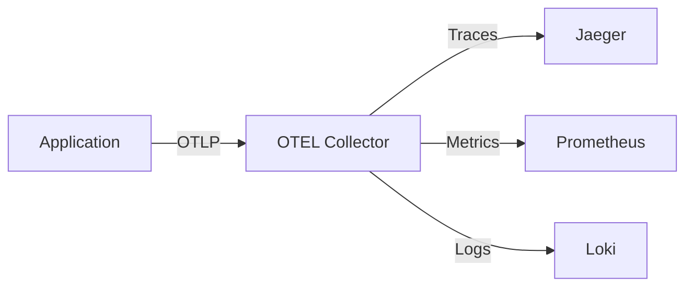

---
tags:
  - observability
  - tracing
  - opentelemetry
  - jaeger
  - monitoring
---

# Observabilité : Le Tracing Distribué

"Pourquoi c'est lent ?" est la question la plus difficile en microservices.
Les logs disent "Il y a une erreur". Les métriques disent "C'est lent". Le **Tracing** dit **OÙ**.

## 1. Les 3 Piliers de l'Observabilité

1.  **Logs** (Événements) : "Une erreur s'est produite à 10:00." (Elasticsearch, Loki).
2.  **Métriques** (Chiffres) : "Le CPU est à 90%." (Prometheus, Datadog).
3.  **Traces** (Contexte) : "La requête A a appelé B, qui a attendu 2s la réponse de C." (Jaeger, Tempo).

## 2. OpenTelemetry (OTEL)

C'est le standard mondial (CNCF) pour collecter ces données.
Avant, il fallait un agent par outil (un pour Jaeger, un pour Prometheus...).
Aujourd'hui, le **Collector OpenTelemetry** reçoit tout, et l'envoie où vous voulez.



## 3. Le Concept de Trace & Span

*   **Trace** : Le voyage complet d'une requête utilisateur (ex: "Achat d'un panier").
*   **Span** : Une étape unitaire (ex: "Requête SQL", "Appel API Stripe").

Une trace est une collection de spans avec une relation parent-enfant.

```
Trace ID: abc1234
├── Span A (Frontend) - 500ms
│   ├── Span B (Auth Service) - 50ms
│   └── Span C (Order Service) - 400ms
│       └── Span D (Database SELECT) - 350ms  <-- C'est là que ça coince !
```

## 4. Jaeger : Visualiser les Traces

Jaeger est l'interface open-source la plus populaire pour visualiser ces cascades.

### Installation Rapide (Docker)
```bash
docker run -d --name jaeger \
  -e COLLECTOR_ZIPKIN_HOST_PORT=:9411 \
  -p 5775:5775/udp \
  -p 6831:6831/udp \
  -p 6832:6832/udp \
  -p 5778:5778 \
  -p 16686:16686 \
  -p 14268:14268 \
  -p 14250:14250 \
  -p 9411:9411 \
  jaegertracing/all-in-one:1.6
```
Accès : `http://localhost:16686`

## 5. Instrumentation (Python)

Comment dire à mon code d'envoyer des traces ?

**Automatique (Zero-code) :**
```bash
opentelemetry-instrument --traces_exporter console python myapp.py
```

**Manuelle :**
```python
from opentelemetry import trace

tracer = trace.get_tracer(__name__)

with tracer.start_as_current_span("operation_lourde"):
    faire_un_truc()
```

```