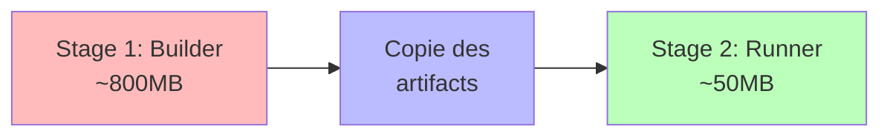

---
tags:
  - devops
  - docker
  - dockerfile
  - security
  - optimization
---

# Dockerfile Golden (Multi-Stage)

Template Dockerfile optimisé avec build multi-stage, sécurité renforcée et healthcheck intégré.

---

## Informations

| Propriété | Valeur |
|-----------|--------|
| **Format** | Dockerfile |
| **Niveau** | :material-star::material-star::material-star: Avancé |
| **Fonctionnalités** | Multi-stage, Non-root, Distroless, Healthcheck |

---

## Description

Ce template Dockerfile représente les meilleures pratiques pour la création d'images de production :

- **Multi-stage build** : Sépare l'environnement de build du runtime
- **Image finale minimale** : Alpine ou Distroless pour réduire la surface d'attaque
- **Utilisateur non-root** : L'application ne tourne jamais en root
- **Healthcheck intégré** : Vérification de santé native Docker
- **Labels OCI** : Métadonnées standardisées

---

## Pourquoi Multi-Stage ?



| Aspect | Single-Stage | Multi-Stage |
|--------|--------------|-------------|
| **Taille image** | 500-1000 MB | 50-150 MB |
| **Surface d'attaque** | Élevée (compilateurs, outils) | Minimale |
| **Secrets de build** | Risque de fuite | Isolés au builder |
| **Temps de pull** | Long | Rapide |

---

## Template Python (FastAPI/Flask)

```dockerfile
# =============================================================================
# Golden Dockerfile - Python Application
# Multi-stage build with security hardening
# =============================================================================

# -----------------------------------------------------------------------------
# STAGE 1: Builder
# Install dependencies and build application
# -----------------------------------------------------------------------------
FROM python:3.11-slim AS builder

# Set build-time environment variables
ENV PYTHONDONTWRITEBYTECODE=1 \
    PYTHONUNBUFFERED=1 \
    PIP_NO_CACHE_DIR=1 \
    PIP_DISABLE_PIP_VERSION_CHECK=1

# Install build dependencies (will not be in final image)
RUN apt-get update && apt-get install -y --no-install-recommends \
    build-essential \
    libpq-dev \
    && rm -rf /var/lib/apt/lists/*

# Create virtual environment
RUN python -m venv /opt/venv
ENV PATH="/opt/venv/bin:$PATH"

# Copy and install Python dependencies first (layer caching)
WORKDIR /build
COPY requirements.txt .
RUN pip install --no-cache-dir -r requirements.txt

# Copy application source code
COPY . .

# Build/compile if needed (e.g., Cython, static assets)
# RUN python setup.py build_ext --inplace

# -----------------------------------------------------------------------------
# STAGE 2: Runner (Production)
# Minimal image with only runtime dependencies
# -----------------------------------------------------------------------------
FROM python:3.11-slim AS runner

# Labels following OCI specification
LABEL org.opencontainers.image.title="My Application" \
      org.opencontainers.image.description="Production-ready Python application" \
      org.opencontainers.image.authors="team@example.com" \
      org.opencontainers.image.source="https://github.com/org/repo" \
      org.opencontainers.image.version="1.0.0"

# Runtime environment variables
ENV PYTHONDONTWRITEBYTECODE=1 \
    PYTHONUNBUFFERED=1 \
    PYTHONFAULTHANDLER=1 \
    PATH="/opt/venv/bin:$PATH" \
    APP_HOME=/app

# Install runtime dependencies only (no build tools)
RUN apt-get update && apt-get install -y --no-install-recommends \
    libpq5 \
    curl \
    && rm -rf /var/lib/apt/lists/* \
    && apt-get clean

# Create non-root user for security
RUN groupadd --gid 1000 appgroup \
    && useradd --uid 1000 --gid appgroup --shell /bin/false --create-home appuser

# Set working directory
WORKDIR $APP_HOME

# Copy virtual environment from builder
COPY --from=builder /opt/venv /opt/venv

# Copy application code
COPY --from=builder --chown=appuser:appgroup /build/app ./app
COPY --from=builder --chown=appuser:appgroup /build/main.py .

# Switch to non-root user
USER appuser

# Expose application port
EXPOSE 8000

# Health check - verify application is responding
HEALTHCHECK --interval=30s --timeout=10s --start-period=5s --retries=3 \
    CMD curl --fail http://localhost:8000/health || exit 1

# Run application
CMD ["uvicorn", "main:app", "--host", "0.0.0.0", "--port", "8000"]
```

---

## Template Node.js (Express/NestJS)

```dockerfile
# =============================================================================
# Golden Dockerfile - Node.js Application
# Multi-stage build with security hardening
# =============================================================================

# -----------------------------------------------------------------------------
# STAGE 1: Dependencies
# Install all dependencies including devDependencies
# -----------------------------------------------------------------------------
FROM node:20-alpine AS deps

# Install build tools for native modules
RUN apk add --no-cache python3 make g++

WORKDIR /build

# Copy package files first for layer caching
COPY package*.json ./

# Install all dependencies (including dev for building)
RUN npm ci --include=dev

# -----------------------------------------------------------------------------
# STAGE 2: Builder
# Build the application (TypeScript compilation, bundling, etc.)
# -----------------------------------------------------------------------------
FROM node:20-alpine AS builder

WORKDIR /build

# Copy node_modules from deps stage
COPY --from=deps /build/node_modules ./node_modules

# Copy source code
COPY . .

# Build application (TypeScript, webpack, etc.)
RUN npm run build

# Remove devDependencies after build
RUN npm prune --production

# -----------------------------------------------------------------------------
# STAGE 3: Runner (Production)
# Minimal image with only production dependencies
# -----------------------------------------------------------------------------
FROM node:20-alpine AS runner

# Labels
LABEL org.opencontainers.image.title="My Node.js Application" \
      org.opencontainers.image.version="1.0.0"

# Production environment
ENV NODE_ENV=production \
    APP_HOME=/app

# Install runtime dependencies only
RUN apk add --no-cache \
    curl \
    dumb-init \
    && rm -rf /var/cache/apk/*

# Create non-root user
RUN addgroup --system --gid 1001 nodejs \
    && adduser --system --uid 1001 nodejs

WORKDIR $APP_HOME

# Copy production dependencies
COPY --from=builder --chown=nodejs:nodejs /build/node_modules ./node_modules

# Copy built application
COPY --from=builder --chown=nodejs:nodejs /build/dist ./dist
COPY --from=builder --chown=nodejs:nodejs /build/package.json .

# Switch to non-root user
USER nodejs

# Expose port
EXPOSE 3000

# Health check
HEALTHCHECK --interval=30s --timeout=10s --start-period=10s --retries=3 \
    CMD curl -f http://localhost:3000/health || exit 1

# Use dumb-init for proper signal handling
ENTRYPOINT ["dumb-init", "--"]

# Run application
CMD ["node", "dist/main.js"]
```

---

## Template Go (Distroless)

```dockerfile
# =============================================================================
# Golden Dockerfile - Go Application
# Multi-stage with Distroless for minimal attack surface
# =============================================================================

# -----------------------------------------------------------------------------
# STAGE 1: Builder
# Compile Go binary
# -----------------------------------------------------------------------------
FROM golang:1.21-alpine AS builder

# Install build dependencies
RUN apk add --no-cache git ca-certificates tzdata

WORKDIR /build

# Copy go mod files first for caching
COPY go.mod go.sum ./
RUN go mod download && go mod verify

# Copy source code
COPY . .

# Build static binary
RUN CGO_ENABLED=0 GOOS=linux GOARCH=amd64 go build \
    -ldflags="-w -s -X main.version=$(git describe --tags --always)" \
    -o /app ./cmd/server

# -----------------------------------------------------------------------------
# STAGE 2: Runner (Distroless)
# Google's Distroless image - no shell, no package manager
# -----------------------------------------------------------------------------
FROM gcr.io/distroless/static-debian12:nonroot AS runner

# Labels
LABEL org.opencontainers.image.title="My Go Application"

# Copy timezone data and CA certificates
COPY --from=builder /usr/share/zoneinfo /usr/share/zoneinfo
COPY --from=builder /etc/ssl/certs/ca-certificates.crt /etc/ssl/certs/

# Copy binary
COPY --from=builder /app /app

# Distroless images run as nonroot (65532) by default
USER nonroot:nonroot

# Expose port
EXPOSE 8080

# Health check is not available in distroless (no curl/wget)
# Use orchestrator health checks instead (Kubernetes probes)

# Run binary
ENTRYPOINT ["/app"]
```

---

## Bonnes Pratiques

### 1. Ordre des Instructions (Cache)

```dockerfile
# ❌ MAUVAIS - Invalide le cache à chaque changement de code
COPY . .
RUN pip install -r requirements.txt

# ✅ BON - Les dépendances sont cachées séparément
COPY requirements.txt .
RUN pip install -r requirements.txt
COPY . .
```

### 2. Réduction des Layers

```dockerfile
# ❌ MAUVAIS - 3 layers
RUN apt-get update
RUN apt-get install -y curl
RUN rm -rf /var/lib/apt/lists/*

# ✅ BON - 1 layer
RUN apt-get update \
    && apt-get install -y --no-install-recommends curl \
    && rm -rf /var/lib/apt/lists/*
```

### 3. .dockerignore

Créez un fichier `.dockerignore` :

```text
# Git
.git
.gitignore

# Build artifacts
dist/
build/
*.egg-info/
node_modules/

# IDE
.vscode/
.idea/

# Environment files
.env
.env.local
*.pem

# Documentation
docs/
*.md
!README.md

# Tests
tests/
__pycache__/
.pytest_cache/
coverage/
```

---

## Healthcheck

| Paramètre | Description | Recommandation |
|-----------|-------------|----------------|
| `--interval` | Fréquence des checks | 30s en prod, 10s en dev |
| `--timeout` | Temps max pour répondre | 10s |
| `--start-period` | Délai avant premier check | Temps de démarrage de l'app |
| `--retries` | Échecs avant "unhealthy" | 3 |

```dockerfile
# Application web standard
HEALTHCHECK --interval=30s --timeout=10s --start-period=5s --retries=3 \
    CMD curl --fail http://localhost:8000/health || exit 1

# Application sans curl (wget)
HEALTHCHECK --interval=30s --timeout=10s --retries=3 \
    CMD wget --no-verbose --tries=1 --spider http://localhost:8000/health || exit 1

# Application Node.js (sans outils externes)
HEALTHCHECK --interval=30s --timeout=10s --retries=3 \
    CMD node -e "require('http').get('http://localhost:3000/health', (r) => process.exit(r.statusCode === 200 ? 0 : 1))"
```

---

## Sécurité

### Utilisateur Non-Root

```dockerfile
# Créer un utilisateur dédié
RUN groupadd --gid 1000 appgroup \
    && useradd --uid 1000 --gid appgroup --shell /bin/false appuser

# Définir les permissions
COPY --chown=appuser:appgroup ./app /app

# Basculer vers l'utilisateur
USER appuser
```

### Images de Base Recommandées

| Type | Image | Taille | Shell | Sécurité |
|------|-------|--------|-------|----------|
| **Distroless** | `gcr.io/distroless/static` | ~2 MB | Non | Maximale |
| **Alpine** | `python:3.11-alpine` | ~50 MB | Oui | Élevée |
| **Slim** | `python:3.11-slim` | ~120 MB | Oui | Standard |
| **Full** | `python:3.11` | ~900 MB | Oui | Basse |

---

!!! danger "Secrets dans le Dockerfile"
    **JAMAIS** de secrets dans le Dockerfile ou les layers :

    ```dockerfile
    # ❌ MAUVAIS - Le secret reste dans l'historique des layers
    ARG API_KEY
    RUN curl -H "Authorization: $API_KEY" https://api.example.com

    # ✅ BON - Utiliser Docker secrets ou variables d'environnement au runtime
    ENV API_KEY_FILE=/run/secrets/api_key
    CMD ["./app"]
    ```

!!! tip "Scan de Vulnérabilités"
    Scannez toujours vos images avant déploiement :

    ```bash
    # Avec Trivy
    trivy image myapp:latest

    # Avec Docker Scout
    docker scout cves myapp:latest
    ```

---

## Voir Aussi

- [GitLab CI Ultimate](gitlab-ci-ultimate.md) - Pipeline avec build Docker
- [GitHub Actions Workflow](github-actions-workflow.md) - Workflow avec push GHCR
- [docker_cleaner_pro.py](../../scripts/python/docker_cleaner_pro.md) - Nettoyage Docker
