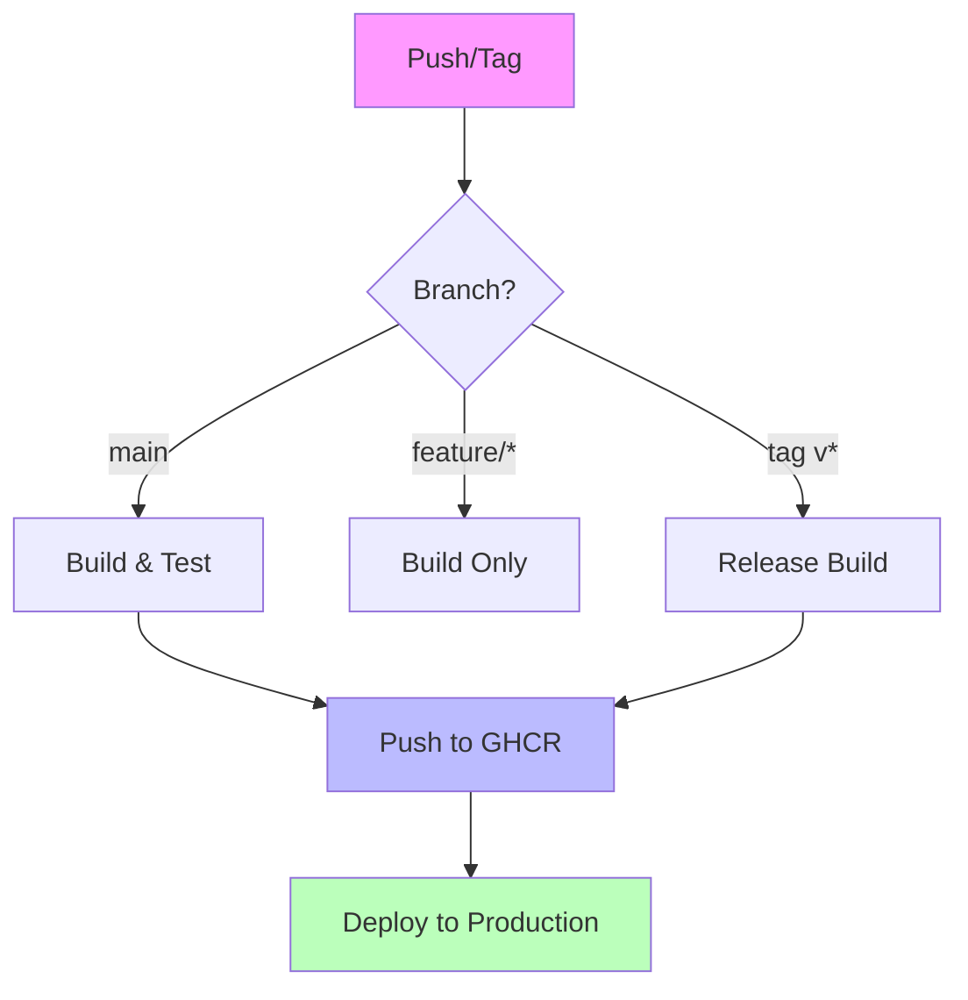

---
tags:
  - devops
  - github
  - ci-cd
  - docker
  - actions
---

# Workflow GitHub Actions Production

Template `.github/workflows/deploy.yml` standardisé pour build, push et déploiement automatisé.

---

## Informations

| Propriété | Valeur |
|-----------|--------|
| **Plateforme** | GitHub Actions |
| **Niveau** | :material-star::material-star::material-star: Avancé |
| **Fonctionnalités** | Docker Build, Multi-platform, SSH Deploy |

---

## Description

Ce workflow GitHub Actions implémente un pipeline CI/CD complet pour applications containerisées :

- **Trigger intelligent** : branches et tags
- **Build Docker multi-plateforme** (amd64/arm64)
- **Push vers GitHub Container Registry** (ghcr.io)
- **Déploiement SSH** vers serveur de production
- **Gestion sécurisée des secrets**

---

## Architecture du Workflow



---

## Prérequis

### Secrets GitHub à Configurer

Dans **Settings > Secrets and variables > Actions** :

| Secret | Description |
|--------|-------------|
| `DEPLOY_HOST` | Adresse IP/hostname du serveur |
| `DEPLOY_USER` | Utilisateur SSH pour déploiement |
| `DEPLOY_SSH_KEY` | Clé SSH privée (format PEM) |
| `DEPLOY_PATH` | Chemin sur le serveur (/opt/app) |

!!! danger "Sécurité des Secrets"
    **Règles critiques pour les secrets GitHub Actions :**

    1. **Ne JAMAIS** afficher les secrets dans les logs
       ```yaml
       # MAUVAIS - Le secret sera masqué mais c'est risqué
       run: echo ${{ secrets.API_KEY }}

       # BON - Utiliser comme variable d'environnement
       env:
         API_KEY: ${{ secrets.API_KEY }}
       run: ./script.sh
       ```

    2. **Utiliser des tokens à portée limitée**
       - `GITHUB_TOKEN` est automatiquement fourni avec des permissions limitées
       - Pour ghcr.io, `GITHUB_TOKEN` suffit (pas besoin de PAT)

    3. **Rotation régulière** des clés SSH et tokens

    4. **Limiter l'accès** aux secrets via les environnements :
       ```yaml
       environment:
         name: production
         url: https://example.com
       ```

---

## Workflow Complet

```yaml
# =============================================================================
# GitHub Actions Production Workflow
# Build, Test, Push to GHCR, and Deploy via SSH
# =============================================================================

name: Build and Deploy

# -----------------------------------------------------------------------------
# Triggers
# -----------------------------------------------------------------------------
on:
  push:
    branches:
      - main
      - develop
    tags:
      - 'v*.*.*'
    paths-ignore:
      - '**.md'
      - 'docs/**'
      - '.gitignore'

  pull_request:
    branches:
      - main

  # Allow manual trigger
  workflow_dispatch:
    inputs:
      deploy_env:
        description: 'Deployment environment'
        required: true
        default: 'staging'
        type: choice
        options:
          - staging
          - production

# -----------------------------------------------------------------------------
# Environment Variables
# -----------------------------------------------------------------------------
env:
  REGISTRY: ghcr.io
  IMAGE_NAME: ${{ github.repository }}

# -----------------------------------------------------------------------------
# Jobs
# -----------------------------------------------------------------------------
jobs:
  # ===========================================================================
  # JOB 1: Build and Push Docker Image
  # ===========================================================================
  build:
    name: Build & Push
    runs-on: ubuntu-latest

    # Required permissions for GHCR
    permissions:
      contents: read
      packages: write

    outputs:
      image_tag: ${{ steps.meta.outputs.tags }}
      image_digest: ${{ steps.build.outputs.digest }}

    steps:
      # -----------------------------------------------------------------------
      # Checkout and Setup
      # -----------------------------------------------------------------------
      - name: Checkout repository
        uses: actions/checkout@v4

      - name: Set up QEMU
        # Required for multi-platform builds
        uses: docker/setup-qemu-action@v3

      - name: Set up Docker Buildx
        uses: docker/setup-buildx-action@v3

      # -----------------------------------------------------------------------
      # Authentication
      # -----------------------------------------------------------------------
      - name: Log in to Container Registry
        uses: docker/login-action@v3
        with:
          registry: ${{ env.REGISTRY }}
          username: ${{ github.actor }}
          password: ${{ secrets.GITHUB_TOKEN }}

      # -----------------------------------------------------------------------
      # Metadata for Tags and Labels
      # -----------------------------------------------------------------------
      - name: Extract Docker metadata
        id: meta
        uses: docker/metadata-action@v5
        with:
          images: ${{ env.REGISTRY }}/${{ env.IMAGE_NAME }}
          tags: |
            # Tag with branch name
            type=ref,event=branch
            # Tag with PR number
            type=ref,event=pr
            # Tag with semver (v1.0.0 -> 1.0.0, latest)
            type=semver,pattern={{version}}
            type=semver,pattern={{major}}.{{minor}}
            type=semver,pattern={{major}}
            # Tag with short SHA
            type=sha,prefix=
            # Tag as 'latest' for default branch
            type=raw,value=latest,enable=${{ github.ref == format('refs/heads/{0}', github.event.repository.default_branch) }}

      # -----------------------------------------------------------------------
      # Build and Push
      # -----------------------------------------------------------------------
      - name: Build and push Docker image
        id: build
        uses: docker/build-push-action@v5
        with:
          context: .
          file: ./Dockerfile
          # Multi-platform build
          platforms: linux/amd64,linux/arm64
          # Push only if not a PR
          push: ${{ github.event_name != 'pull_request' }}
          tags: ${{ steps.meta.outputs.tags }}
          labels: ${{ steps.meta.outputs.labels }}
          # Cache layers for faster builds
          cache-from: type=gha
          cache-to: type=gha,mode=max
          # Build arguments
          build-args: |
            BUILD_DATE=${{ github.event.head_commit.timestamp }}
            VCS_REF=${{ github.sha }}
            VERSION=${{ steps.meta.outputs.version }}

      # -----------------------------------------------------------------------
      # Security Scan
      # -----------------------------------------------------------------------
      - name: Run Trivy vulnerability scanner
        uses: aquasecurity/trivy-action@master
        if: github.event_name != 'pull_request'
        with:
          image-ref: ${{ env.REGISTRY }}/${{ env.IMAGE_NAME }}:${{ steps.meta.outputs.version }}
          format: 'sarif'
          output: 'trivy-results.sarif'
          severity: 'CRITICAL,HIGH'

      - name: Upload Trivy scan results
        uses: github/codeql-action/upload-sarif@v2
        if: github.event_name != 'pull_request'
        with:
          sarif_file: 'trivy-results.sarif'

  # ===========================================================================
  # JOB 2: Deploy to Server
  # ===========================================================================
  deploy:
    name: Deploy to Production
    runs-on: ubuntu-latest
    needs: build

    # Only deploy on main branch or version tags
    if: |
      github.ref == 'refs/heads/main' ||
      startsWith(github.ref, 'refs/tags/v')

    # Use production environment for approvals and secrets
    environment:
      name: production
      url: https://${{ secrets.DEPLOY_HOST }}

    steps:
      # -----------------------------------------------------------------------
      # SSH Deploy
      # -----------------------------------------------------------------------
      - name: Deploy via SSH
        uses: appleboy/ssh-action@v1.0.0
        with:
          host: ${{ secrets.DEPLOY_HOST }}
          username: ${{ secrets.DEPLOY_USER }}
          key: ${{ secrets.DEPLOY_SSH_KEY }}
          port: 22
          script: |
            # Navigate to application directory
            cd ${{ secrets.DEPLOY_PATH }}

            # Pull latest image
            echo "Pulling latest image..."
            docker compose pull

            # Restart services with zero-downtime
            echo "Restarting services..."
            docker compose up -d --remove-orphans

            # Cleanup old images
            echo "Cleaning up..."
            docker image prune -f

            # Health check
            echo "Running health check..."
            sleep 10
            curl -f http://localhost:8080/health || exit 1

            echo "Deployment successful!"

      # -----------------------------------------------------------------------
      # Notification (Optional)
      # -----------------------------------------------------------------------
      - name: Notify on success
        if: success()
        run: |
          echo "🚀 Deployment successful!"
          echo "Image: ${{ needs.build.outputs.image_tag }}"
          echo "Digest: ${{ needs.build.outputs.image_digest }}"

      - name: Notify on failure
        if: failure()
        run: |
          echo "❌ Deployment failed!"
          # Add Slack/Discord notification here

  # ===========================================================================
  # JOB 3: Cleanup (Optional)
  # ===========================================================================
  cleanup:
    name: Cleanup Old Images
    runs-on: ubuntu-latest
    needs: deploy
    if: always()

    permissions:
      packages: write

    steps:
      - name: Delete old container images
        uses: actions/delete-package-versions@v4
        with:
          package-name: ${{ github.event.repository.name }}
          package-type: container
          min-versions-to-keep: 10
          delete-only-untagged-versions: true
```

---

## Variantes

### Déploiement vers AWS ECS

```yaml
deploy-ecs:
  name: Deploy to AWS ECS
  runs-on: ubuntu-latest
  needs: build

  steps:
    - name: Configure AWS credentials
      uses: aws-actions/configure-aws-credentials@v4
      with:
        aws-access-key-id: ${{ secrets.AWS_ACCESS_KEY_ID }}
        aws-secret-access-key: ${{ secrets.AWS_SECRET_ACCESS_KEY }}
        aws-region: eu-west-1

    - name: Update ECS service
      run: |
        aws ecs update-service \
          --cluster production \
          --service my-app \
          --force-new-deployment
```

### Déploiement vers Kubernetes

```yaml
deploy-k8s:
  name: Deploy to Kubernetes
  runs-on: ubuntu-latest
  needs: build

  steps:
    - name: Set up kubectl
      uses: azure/setup-kubectl@v3

    - name: Configure kubeconfig
      run: |
        mkdir -p ~/.kube
        echo "${{ secrets.KUBE_CONFIG }}" | base64 -d > ~/.kube/config

    - name: Deploy to cluster
      run: |
        kubectl set image deployment/my-app \
          app=${{ env.REGISTRY }}/${{ env.IMAGE_NAME }}:${{ github.sha }} \
          -n production

        kubectl rollout status deployment/my-app -n production
```

### Avec Docker Compose Remote

```yaml
deploy-compose:
  name: Deploy with Docker Compose
  runs-on: ubuntu-latest
  needs: build

  steps:
    - name: Checkout for compose file
      uses: actions/checkout@v4

    - name: Copy files to server
      uses: appleboy/scp-action@v0.1.4
      with:
        host: ${{ secrets.DEPLOY_HOST }}
        username: ${{ secrets.DEPLOY_USER }}
        key: ${{ secrets.DEPLOY_SSH_KEY }}
        source: "docker-compose.yml,docker-compose.prod.yml"
        target: ${{ secrets.DEPLOY_PATH }}

    - name: Deploy via SSH
      uses: appleboy/ssh-action@v1.0.0
      with:
        host: ${{ secrets.DEPLOY_HOST }}
        username: ${{ secrets.DEPLOY_USER }}
        key: ${{ secrets.DEPLOY_SSH_KEY }}
        script: |
          cd ${{ secrets.DEPLOY_PATH }}
          docker compose -f docker-compose.yml -f docker-compose.prod.yml pull
          docker compose -f docker-compose.yml -f docker-compose.prod.yml up -d
```

---

## Tokens et Permissions

### GITHUB_TOKEN (Automatique)

| Permission | Accès |
|------------|-------|
| `contents: read` | Lire le code source |
| `packages: write` | Push vers ghcr.io |
| `actions: read` | Lire les workflows |

### Permissions Minimales

```yaml
permissions:
  contents: read
  packages: write
  security-events: write  # Pour Trivy SARIF
```

---

!!! tip "Cache Docker BuildX"
    Le cache GitHub Actions (`type=gha`) stocke les layers Docker entre les builds.
    Cela peut réduire le temps de build de 50-80% pour les builds répétés.

    ```yaml
    cache-from: type=gha
    cache-to: type=gha,mode=max
    ```

!!! warning "Multi-Platform Builds"
    Les builds multi-plateforme (amd64 + arm64) prennent plus de temps.
    Pour les PR, vous pouvez désactiver arm64 :

    ```yaml
    platforms: ${{ github.event_name == 'pull_request' && 'linux/amd64' || 'linux/amd64,linux/arm64' }}
    ```

---

## Voir Aussi

- [GitLab CI Ultimate](gitlab-ci-ultimate.md) - Équivalent GitLab
- [Dockerfile Golden](dockerfile-golden.md) - Template Dockerfile optimisé
- [container-net-debug.sh](../../scripts/bash/container-net-debug.md) - Debug réseau conteneurs
