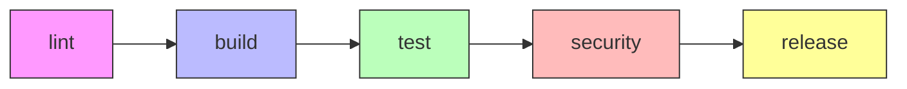

---
tags:
  - devops
  - gitlab
  - ci-cd
  - docker
  - pipeline
---

# Template GitLab CI Ultime

Template `.gitlab-ci.yml` modulaire et prêt pour la production avec build Docker, tests, scan de sécurité et déploiement.

---

## Informations

| Propriété | Valeur |
|-----------|--------|
| **Plateforme** | GitLab CI/CD |
| **Niveau** | :material-star::material-star::material-star: Avancé |
| **Fonctionnalités** | Docker-in-Docker, Cache, Security Scan, Multi-env |

---

## Description

Ce template représente une configuration GitLab CI complète et modulaire, conçue pour des projets containerisés en production. Il implémente les meilleures pratiques DevOps :

- **5 stages** : lint, build, test, security, release
- **Docker-in-Docker** pour build d'images
- **Cache intelligent** pour accélérer les builds
- **Scan de sécurité** avec Trivy
- **Règles conditionnelles** : tests sur MR, deploy sur tags/main

---

## Architecture du Pipeline



---

## Prérequis

### Variables CI/CD à Configurer

Dans **Settings > CI/CD > Variables** :

| Variable | Type | Description |
|----------|------|-------------|
| `CI_REGISTRY_USER` | Variable | Utilisateur du registry Docker |
| `CI_REGISTRY_PASSWORD` | Variable (Masked) | Token/Password du registry |
| `DEPLOY_SSH_KEY` | File | Clé SSH pour déploiement |
| `DEPLOY_HOST` | Variable | Adresse du serveur de déploiement |

!!! danger "Sécurité des Credentials"
    **Ne JAMAIS** stocker les credentials en clair dans le fichier `.gitlab-ci.yml` !

    Pour le GitLab Container Registry intégré, les variables `CI_REGISTRY_USER` et `CI_REGISTRY_PASSWORD`
    sont automatiquement fournies via `CI_REGISTRY_PASSWORD` ou utilisez un **Deploy Token** :

    1. Allez dans **Settings > Repository > Deploy Tokens**
    2. Créez un token avec les scopes `read_registry` et `write_registry`
    3. Utilisez ce token comme `CI_REGISTRY_PASSWORD`

    Pour un registry externe (Docker Hub, AWS ECR, etc.) :

    - Créez des **Access Tokens** dédiés au CI (pas vos credentials personnels)
    - Activez l'option **Masked** pour cacher la valeur dans les logs
    - Activez l'option **Protected** si le déploiement est réservé aux branches protégées

---

## Template Complet

```yaml
# =============================================================================
# GitLab CI/CD Ultimate Template
# Production-ready pipeline for containerized applications
# =============================================================================

# -----------------------------------------------------------------------------
# Global Configuration
# -----------------------------------------------------------------------------

# Define pipeline stages in execution order
stages:
  - lint
  - build
  - test
  - security
  - release

# Default settings for all jobs
default:
  # Use Docker-in-Docker image for container operations
  image: docker:24-cli

  # Retry failed jobs (network issues, etc.)
  retry:
    max: 2
    when:
      - runner_system_failure
      - stuck_or_timeout_failure

  # Interruptible: cancel running jobs when new commit is pushed
  interruptible: true

# Global variables available to all jobs
variables:
  # Docker configuration
  DOCKER_HOST: tcp://docker:2376
  DOCKER_TLS_CERTDIR: "/certs"
  DOCKER_CERT_PATH: "/certs/client"
  DOCKER_TLS_VERIFY: 1

  # Image naming convention
  IMAGE_NAME: $CI_REGISTRY_IMAGE
  IMAGE_TAG: $CI_COMMIT_SHORT_SHA

  # Cache configuration
  PIP_CACHE_DIR: "$CI_PROJECT_DIR/.cache/pip"
  NPM_CONFIG_CACHE: "$CI_PROJECT_DIR/.cache/npm"

# -----------------------------------------------------------------------------
# Cache Configuration
# -----------------------------------------------------------------------------

# Global cache for dependencies
.cache_template: &cache_config
  cache:
    key:
      files:
        - package-lock.json
        - requirements.txt
        - Pipfile.lock
    paths:
      - .cache/
      - node_modules/
      - .venv/
    policy: pull-push

# -----------------------------------------------------------------------------
# Service Templates
# -----------------------------------------------------------------------------

# Docker-in-Docker service for building images
.dind_service: &dind_service
  services:
    - name: docker:24-dind
      alias: docker
      command: ["--tls=true", "--tlscacert=/certs/ca.pem", "--tlscert=/certs/server-cert.pem", "--tlskey=/certs/server-key.pem"]

# -----------------------------------------------------------------------------
# Rule Templates
# -----------------------------------------------------------------------------

# Run on merge requests
.rules_merge_request: &rules_mr
  rules:
    - if: $CI_PIPELINE_SOURCE == "merge_request_event"

# Run on main branch or tags
.rules_main_or_tag: &rules_release
  rules:
    - if: $CI_COMMIT_BRANCH == $CI_DEFAULT_BRANCH
    - if: $CI_COMMIT_TAG

# Run on all branches except main
.rules_feature_branch: &rules_feature
  rules:
    - if: $CI_COMMIT_BRANCH && $CI_COMMIT_BRANCH != $CI_DEFAULT_BRANCH

# =============================================================================
# STAGE 1: LINT
# =============================================================================

lint:hadolint:
  stage: lint
  image: hadolint/hadolint:latest-debian
  <<: *rules_mr
  script:
    - echo "Linting Dockerfile..."
    - hadolint Dockerfile --format json > hadolint-report.json || true
    - hadolint Dockerfile
  artifacts:
    reports:
      codequality: hadolint-report.json
    expire_in: 1 week
  allow_failure: true

lint:yaml:
  stage: lint
  image: python:3.11-slim
  <<: *rules_mr
  before_script:
    - pip install yamllint --quiet
  script:
    - echo "Linting YAML files..."
    - yamllint . -f colored
  allow_failure: true

# =============================================================================
# STAGE 2: BUILD
# =============================================================================

build:docker:
  stage: build
  <<: *dind_service
  <<: *cache_config
  rules:
    - if: $CI_PIPELINE_SOURCE == "merge_request_event"
    - if: $CI_COMMIT_BRANCH == $CI_DEFAULT_BRANCH
    - if: $CI_COMMIT_TAG
  before_script:
    # Authenticate to container registry
    - echo "Logging into $CI_REGISTRY..."
    - echo "$CI_REGISTRY_PASSWORD" | docker login -u "$CI_REGISTRY_USER" --password-stdin $CI_REGISTRY
  script:
    - echo "Building Docker image..."

    # Build with cache from previous builds
    - |
      docker build \
        --cache-from $IMAGE_NAME:latest \
        --build-arg BUILDKIT_INLINE_CACHE=1 \
        --tag $IMAGE_NAME:$IMAGE_TAG \
        --tag $IMAGE_NAME:$CI_COMMIT_REF_SLUG \
        --file Dockerfile \
        .

    # Push image to registry
    - echo "Pushing image to registry..."
    - docker push $IMAGE_NAME:$IMAGE_TAG
    - docker push $IMAGE_NAME:$CI_COMMIT_REF_SLUG

    # Tag as latest if on main branch
    - |
      if [ "$CI_COMMIT_BRANCH" == "$CI_DEFAULT_BRANCH" ]; then
        docker tag $IMAGE_NAME:$IMAGE_TAG $IMAGE_NAME:latest
        docker push $IMAGE_NAME:latest
      fi
  after_script:
    - docker logout $CI_REGISTRY || true

# =============================================================================
# STAGE 3: TEST
# =============================================================================

test:unit:
  stage: test
  image: $IMAGE_NAME:$IMAGE_TAG
  <<: *rules_mr
  <<: *cache_config
  variables:
    # Disable Docker for unit tests
    DOCKER_HOST: ""
  script:
    - echo "Running unit tests..."
    # Adapt to your project (Python, Node, Go, etc.)
    # - pytest tests/ --junitxml=report.xml --cov=app --cov-report=xml
    # - npm test -- --coverage
    - echo "Tests passed!"
  artifacts:
    reports:
      junit: report.xml
      coverage_report:
        coverage_format: cobertura
        path: coverage.xml
    expire_in: 1 week
  coverage: '/TOTAL.*\s+(\d+%)/'

test:integration:
  stage: test
  <<: *dind_service
  <<: *rules_mr
  needs:
    - build:docker
  script:
    - echo "Running integration tests..."
    # Start application container
    - docker run -d --name app-test $IMAGE_NAME:$IMAGE_TAG
    # Run integration tests against it
    - docker exec app-test echo "Integration tests passed!"
  after_script:
    - docker stop app-test || true
    - docker rm app-test || true

# =============================================================================
# STAGE 4: SECURITY
# =============================================================================

security:trivy:
  stage: security
  image:
    name: aquasec/trivy:latest
    entrypoint: [""]
  rules:
    - if: $CI_PIPELINE_SOURCE == "merge_request_event"
    - if: $CI_COMMIT_BRANCH == $CI_DEFAULT_BRANCH
  needs:
    - build:docker
  variables:
    # Scan the image we just built
    FULL_IMAGE_NAME: $IMAGE_NAME:$IMAGE_TAG
    TRIVY_USERNAME: $CI_REGISTRY_USER
    TRIVY_PASSWORD: $CI_REGISTRY_PASSWORD
  script:
    - echo "Scanning $FULL_IMAGE_NAME for vulnerabilities..."

    # Generate JSON report for GitLab integration
    - trivy image --exit-code 0 --format json --output trivy-report.json $FULL_IMAGE_NAME

    # Human-readable table output
    - trivy image --exit-code 0 --severity HIGH,CRITICAL $FULL_IMAGE_NAME

    # Fail on critical vulnerabilities (optional)
    # - trivy image --exit-code 1 --severity CRITICAL $FULL_IMAGE_NAME
  artifacts:
    reports:
      container_scanning: trivy-report.json
    paths:
      - trivy-report.json
    expire_in: 1 week
  allow_failure: true

security:secrets:
  stage: security
  image:
    name: trufflesecurity/trufflehog:latest
    entrypoint: [""]
  <<: *rules_mr
  script:
    - echo "Scanning for secrets in code..."
    - trufflehog git file://. --only-verified --fail
  allow_failure: true

# =============================================================================
# STAGE 5: RELEASE
# =============================================================================

release:tag:
  stage: release
  image: docker:24-cli
  <<: *dind_service
  rules:
    # Only run on version tags (v1.0.0, v2.1.3, etc.)
    - if: $CI_COMMIT_TAG =~ /^v\d+\.\d+\.\d+$/
  before_script:
    - echo "$CI_REGISTRY_PASSWORD" | docker login -u "$CI_REGISTRY_USER" --password-stdin $CI_REGISTRY
  script:
    - echo "Releasing version $CI_COMMIT_TAG..."

    # Pull the image built from this commit
    - docker pull $IMAGE_NAME:$CI_COMMIT_SHORT_SHA

    # Tag with version number
    - docker tag $IMAGE_NAME:$CI_COMMIT_SHORT_SHA $IMAGE_NAME:$CI_COMMIT_TAG
    - docker tag $IMAGE_NAME:$CI_COMMIT_SHORT_SHA $IMAGE_NAME:stable

    # Push versioned tags
    - docker push $IMAGE_NAME:$CI_COMMIT_TAG
    - docker push $IMAGE_NAME:stable
  after_script:
    - docker logout $CI_REGISTRY || true

release:deploy:
  stage: release
  image: alpine:latest
  <<: *rules_release
  needs:
    - security:trivy
  environment:
    name: production
    url: https://$DEPLOY_HOST
  before_script:
    - apk add --no-cache openssh-client
    - eval $(ssh-agent -s)
    - echo "$DEPLOY_SSH_KEY" | tr -d '\r' | ssh-add -
    - mkdir -p ~/.ssh
    - chmod 700 ~/.ssh
    - ssh-keyscan -H $DEPLOY_HOST >> ~/.ssh/known_hosts
  script:
    - echo "Deploying to production..."
    - |
      ssh deploy@$DEPLOY_HOST << 'EOF'
        cd /opt/app
        docker compose pull
        docker compose up -d --remove-orphans
        docker image prune -f
      EOF
  when: manual
  allow_failure: false

# =============================================================================
# OPTIONAL: Scheduled Jobs
# =============================================================================

# Weekly security scan of latest image
security:weekly-scan:
  stage: security
  image:
    name: aquasec/trivy:latest
    entrypoint: [""]
  rules:
    - if: $CI_PIPELINE_SOURCE == "schedule"
  script:
    - trivy image --severity HIGH,CRITICAL $IMAGE_NAME:latest
  allow_failure: true
```

---

## Personnalisation

### Pour un Projet Python

```yaml
test:unit:
  stage: test
  image: python:3.11-slim
  before_script:
    - pip install -r requirements.txt -r requirements-dev.txt
  script:
    - pytest tests/ --junitxml=report.xml --cov=app --cov-report=xml
  coverage: '/TOTAL.*\s+(\d+%)/'
```

### Pour un Projet Node.js

```yaml
test:unit:
  stage: test
  image: node:20-alpine
  before_script:
    - npm ci
  script:
    - npm test -- --coverage --reporters=default --reporters=jest-junit
  coverage: '/All files[^|]*\|[^|]*\s+([\d\.]+)/'
```

### Pour un Projet Go

```yaml
test:unit:
  stage: test
  image: golang:1.21-alpine
  script:
    - go test -v -cover ./...
  coverage: '/coverage: \d+\.\d+% of statements/'
```

---

## Variables Prédéfinies GitLab

| Variable | Description |
|----------|-------------|
| `CI_REGISTRY` | URL du registry GitLab |
| `CI_REGISTRY_IMAGE` | Chemin complet de l'image |
| `CI_COMMIT_SHORT_SHA` | SHA court du commit |
| `CI_COMMIT_REF_SLUG` | Nom de branche URL-safe |
| `CI_COMMIT_TAG` | Tag Git (si présent) |
| `CI_DEFAULT_BRANCH` | Branche par défaut (main/master) |

---

!!! tip "Optimisation du Cache"
    Le cache est configuré pour stocker :

    - Dépendances Python (`pip`)
    - Dépendances Node.js (`node_modules`)
    - Environnements virtuels (`.venv`)

    La clé de cache est basée sur les fichiers de lock pour invalider
    automatiquement quand les dépendances changent.

!!! warning "Docker-in-Docker (DinD)"
    DinD nécessite le mode **privileged** sur le runner GitLab.
    Si vous utilisez des shared runners, vérifiez qu'ils supportent DinD.

    Alternative : utiliser **Kaniko** pour builds rootless :
    ```yaml
    build:kaniko:
      image:
        name: gcr.io/kaniko-project/executor:v1.9.0-debug
        entrypoint: [""]
      script:
        - /kaniko/executor --context $CI_PROJECT_DIR --dockerfile Dockerfile --destination $IMAGE_NAME:$IMAGE_TAG
    ```

---

## Voir Aussi

- [GitHub Actions Workflow](github-actions-workflow.md) - Équivalent GitHub
- [Dockerfile Golden](dockerfile-golden.md) - Template Dockerfile optimisé
- [docker_cleaner_pro.py](../../scripts/python/docker_cleaner_pro.md) - Nettoyage Docker
