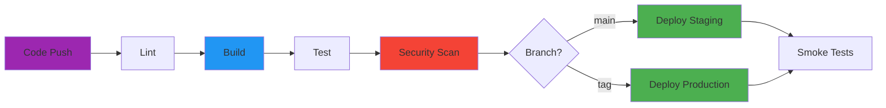

---
tags:
  - devops
  - ci-cd
  - docker
  - pipelines
---

# Pipelines CI/CD

Templates "Golden Standard" pour l'intégration et le déploiement continu.

---

## Vue d'Ensemble

Cette section contient des templates de production pour les pipelines CI/CD et la containerisation. Chaque template est conçu pour être :

- **Prêt pour la production** : Testé en conditions réelles
- **Sécurisé** : Bonnes pratiques de sécurité intégrées
- **Modulaire** : Facilement adaptable à vos projets
- **Documenté** : Explications détaillées de chaque section

---

## Templates Disponibles

| Template | Plateforme | Description |
|----------|------------|-------------|
| [GitLab CI Ultimate](gitlab-ci-ultimate.md) | GitLab | Pipeline complet avec DinD, Trivy, multi-env |
| [GitHub Actions Workflow](github-actions-workflow.md) | GitHub | Build multi-arch, GHCR, déploiement SSH |
| [Dockerfile Golden](dockerfile-golden.md) | Docker | Multi-stage, non-root, healthcheck |

---

## Architecture Type



---

## Comparaison des Plateformes

| Fonctionnalité | GitLab CI | GitHub Actions |
|----------------|-----------|----------------|
| **Registry intégré** | ✅ GitLab Container Registry | ✅ GitHub Container Registry |
| **Runners** | Self-hosted ou Shared | Self-hosted ou GitHub-hosted |
| **Cache** | Natif avec `cache:` | Via actions (actions/cache) |
| **Secrets** | Variables CI/CD | Repository Secrets |
| **Environnements** | Environments avec review | Environments avec approvals |
| **DAG** | `needs:` | `needs:` |
| **Matrix builds** | `parallel: matrix` | `strategy: matrix` |

---

## Bonnes Pratiques Communes

### 1. Secrets et Credentials

```yaml
# ❌ JAMAIS en clair
docker login -u admin -p password123

# ✅ Toujours via variables/secrets
docker login -u $CI_REGISTRY_USER -p $CI_REGISTRY_PASSWORD
```

### 2. Tags d'Images

```yaml
# Stratégie de tagging recommandée
tags:
  - latest          # Branche principale uniquement
  - v1.2.3          # Tags sémantiques
  - sha-abc123      # SHA pour traçabilité
  - main            # Nom de branche
```

### 3. Cache des Dépendances

```yaml
# Clé de cache basée sur les fichiers de lock
cache:
  key:
    files:
      - package-lock.json
      - requirements.txt
```

---

## Voir Aussi

- [Scripts Container](../../scripts/bash/container-net-debug.md) - Debug réseau
- [Docker Cleaner](../../scripts/python/docker_cleaner_pro.md) - Nettoyage Docker
- [Kubernetes Pod Inspector](../../scripts/bash/k8s-pod-inspector.md) - Diagnostic K8s
