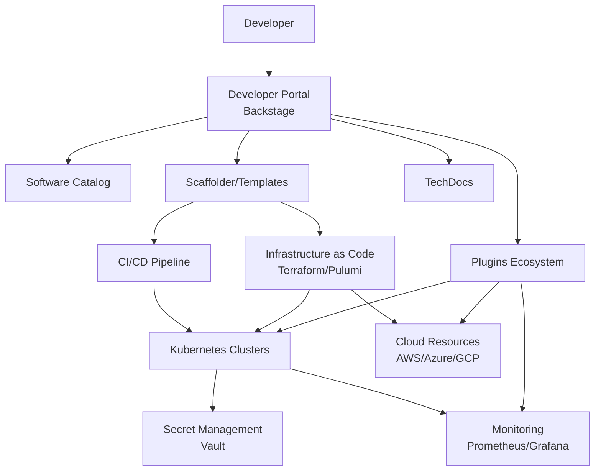

---
tags:
  - platform-engineering
  - idp
  - developer-experience
  - backstage
---

# Platform Engineering & DevEx

Après le DevOps ("You build it, you run it"), voici le Platform Engineering.
Le problème du DevOps pur : la **Charge Cognitive** (Cognitive Load). On demande aux dévs de connaître Python + Docker + K8s + Terraform + AWS + Sécurité... C'est trop.


## 1. Qu'est-ce que le Platform Engineering ?

### Définition

Le **Platform Engineering** est une discipline qui consiste à concevoir et maintenir une plateforme interne (Internal Developer Platform - IDP) qui permet aux équipes de développement de livrer leurs applications de manière autonome, avec des outils standardisés et des bonnes pratiques intégrées.

**Objectif principal** : Réduire la charge cognitive des développeurs en leur fournissant un chemin simple et sécurisé pour déployer et gérer leurs applications.

### Différence avec DevOps

| Aspect | DevOps | Platform Engineering |
|--------|--------|---------------------|
| **Focus** | Culture et collaboration | Produit et outillage |
| **Responsabilité** | "You build it, you run it" | "We build the platform, you build the product" |
| **Approche** | Chaque équipe gère son infra | Plateforme centralisée en self-service |
| **Charge cognitive** | Élevée (dev = ops) | Réduite (abstraction de la complexité) |
| **Standardisation** | Variable selon les équipes | Golden Paths partagés |

Le Platform Engineering ne remplace pas DevOps, il l'**industrialise** en créant des abstractions réutilisables.

## 2. Internal Developer Platform (IDP)

L'équipe Platform ne construit pas le produit final. Elle construit **l'usine** qui permet aux autres équipes de construire le produit.

**L'objectif** : Le Self-Service.
Un développeur ne doit pas ouvrir un ticket Jira "J'ai besoin d'une base de données". Il doit cliquer sur un bouton, et l'obtenir en 5 minutes, avec les bonnes pratiques de sécurité déjà appliquées.

### Composants d'un IDP



### Architecture de l'IDP

1. **Developer Portal** : Interface web unifiée (Backstage, Port, Humanitec)
2. **Service Catalog** : Inventaire de tous les services, APIs, bibliothèques
3. **Golden Paths** : Templates pré-configurés pour créer de nouveaux services
4. **CI/CD Intégré** : Pipelines automatisés pour build/test/deploy
5. **Infrastructure as Code** : Provisionnement automatisé des ressources
6. **Observabilité** : Monitoring, logs, traces intégrés par défaut
7. **Gestion des secrets** : Vault, Sealed Secrets
8. **Documentation centralisée** : Docs-as-Code avec versioning

## 3. Golden Paths (Paved Roads)

### Concept

Les **Golden Paths** sont des chemins pré-pavés qui guident les développeurs vers les bonnes pratiques sans les contraindre.

**Philosophie** :
- "Tu peux faire ton infra à la main, mais tu te débrouilles pour la sécu et le monitoring."
- "Si tu utilises notre **Golden Path** (le template standard), tu as le monitoring, les logs, le HTTPS et la CI/CD gratuits et configurés par défaut."

### Exemples de Golden Paths

1. **Créer un microservice Node.js** :
   - Template avec TypeScript, Express, tests Jest
   - Dockerfile optimisé avec multi-stage build
   - CI/CD configuré (lint, test, build, deploy)
   - Helm chart pour Kubernetes
   - Service mesh (Istio) pré-configuré
   - Monitoring Prometheus + Grafana dashboards

2. **Déployer une base PostgreSQL** :
   - Operator Kubernetes pour gérer le cycle de vie
   - Backups automatiques vers S3
   - Chiffrement au repos
   - Credentials injectés via Vault
   - Alertes configurées (connexions, CPU, stockage)

3. **Créer une API REST Python** :
   - Template FastAPI avec OpenAPI auto-généré
   - Tests avec pytest et coverage
   - Pipeline CI/CD avec déploiement Canary
   - Rate limiting et authentification OAuth2

### Bénéfices

- **Vitesse** : Nouveau service en production en quelques heures au lieu de quelques jours
- **Qualité** : Bonnes pratiques intégrées (tests, sécurité, observabilité)
- **Conformité** : Respect automatique des standards de l'entreprise
- **Autonomie** : Développeurs moins dépendants des équipes platform/ops
- **Réduction des coûts** : Moins de duplication, mutualisation des efforts

## 4. Backstage : Le Portail Unifié

### Vue d'ensemble

Projet open-source (créé par Spotify) qui est devenu le standard des IDP. Backstage est un framework pour construire des portails développeurs.

**Site officiel** : [https://backstage.io](https://backstage.io)

### Fonctionnalités principales

1. **Software Catalog** : Annuaire centralisé de tous les composants logiciels
2. **Scaffolder** : Générateur de projets à partir de templates
3. **TechDocs** : Documentation technique versionnée avec le code
4. **Plugins** : Écosystème extensible (Kubernetes, GitHub, PagerDuty, etc.)
5. **Search** : Recherche unifiée à travers tous les services et docs
6. **RBAC** : Gestion des permissions et des accès

### Architecture Backstage

- **Frontend** : React avec Material-UI
- **Backend** : Node.js (Express) avec architecture plugin
- **Base de données** : PostgreSQL (ou SQLite en dev)
- **Authentification** : OAuth2, SAML, LDAP, GitHub, Google

## 5. Installation Pratique avec Docker Compose

### Fichier `docker-compose.yml`

```yaml
version: '3.8'

services:
  postgres:
    image: postgres:15-alpine
    container_name: backstage-postgres
    environment:
      POSTGRES_USER: backstage
      POSTGRES_PASSWORD: backstage_secret
      POSTGRES_DB: backstage
    volumes:
      - postgres-data:/var/lib/postgresql/data
    ports:
      - "5432:5432"
    healthcheck:
      test: ["CMD-SHELL", "pg_isready -U backstage"]
      interval: 10s
      timeout: 5s
      retries: 5

  backstage:
    image: spotify/backstage:latest
    container_name: backstage-app
    ports:
      - "3000:3000"
      - "7007:7007"
    environment:
      # Base configuration
      APP_CONFIG_app_baseUrl: http://localhost:3000
      APP_CONFIG_backend_baseUrl: http://localhost:7007
      APP_CONFIG_backend_listen_port: 7007

      # Database
      POSTGRES_HOST: postgres
      POSTGRES_PORT: 5432
      POSTGRES_USER: backstage
      POSTGRES_PASSWORD: backstage_secret

      # GitHub integration (optionnel)
      GITHUB_TOKEN: ${GITHUB_TOKEN}

    depends_on:
      postgres:
        condition: service_healthy
    volumes:
      - ./backstage-app:/app
      - ./examples:/examples
    command: ["node", "packages/backend"]

volumes:
  postgres-data:
```

### Configuration `app-config.yaml`

```yaml
app:
  title: My Company IDP
  baseUrl: http://localhost:3000

organization:
  name: My Company

backend:
  baseUrl: http://localhost:7007
  listen:
    port: 7007
  database:
    client: pg
    connection:
      host: ${POSTGRES_HOST}
      port: ${POSTGRES_PORT}
      user: ${POSTGRES_USER}
      password: ${POSTGRES_PASSWORD}
  cors:
    origin: http://localhost:3000
    methods: [GET, POST, PUT, DELETE]
    credentials: true

catalog:
  rules:
    - allow: [Component, System, API, Resource, Location]
  locations:
    - type: file
      target: /examples/catalog-info.yaml

techdocs:
  builder: 'local'
  generator:
    runIn: 'local'
  publisher:
    type: 'local'
```

## 6. Software Catalog

### Exemple de `catalog-info.yaml`

Le Software Catalog référence tous les composants de votre système.

```yaml
apiVersion: backstage.io/v1alpha1
kind: Component
metadata:
  name: payment-service
  title: Payment Service
  description: Microservice pour la gestion des paiements
  annotations:
    github.com/project-slug: mycompany/payment-service
    backstage.io/techdocs-ref: dir:.
    pagerduty.com/integration-key: ABCD1234
    grafana/dashboard-selector: payment-service
  tags:
    - java
    - spring-boot
    - payments
    - critical
  links:
    - url: https://dashboard.example.com
      title: Dashboard Production
      icon: dashboard
    - url: https://docs.example.com/payment-service
      title: API Documentation
      icon: docs
spec:
  type: service
  lifecycle: production
  owner: team-payments
  system: payment-system
  dependsOn:
    - resource:payment-db
    - component:notification-service
  providesApis:
    - payment-api
  consumesApis:
    - user-api

---
apiVersion: backstage.io/v1alpha1
kind: API
metadata:
  name: payment-api
  description: REST API pour les paiements
spec:
  type: openapi
  lifecycle: production
  owner: team-payments
  definition: |
    openapi: 3.0.0
    info:
      title: Payment API
      version: 1.0.0
    paths:
      /payments:
        post:
          summary: Create payment
          responses:
            '201':
              description: Payment created

---
apiVersion: backstage.io/v1alpha1
kind: Resource
metadata:
  name: payment-db
  description: PostgreSQL database for payments
spec:
  type: database
  owner: team-payments
  system: payment-system
```

## 7. Templates (Scaffolder)

### Exemple de `template.yaml` pour créer un nouveau service

```yaml
apiVersion: scaffolder.backstage.io/v1beta3
kind: Template
metadata:
  name: nodejs-microservice
  title: Node.js Microservice
  description: Créer un nouveau microservice Node.js avec Express et TypeScript
  tags:
    - nodejs
    - typescript
    - microservice
spec:
  owner: platform-team
  type: service

  parameters:
    - title: Informations du service
      required:
        - name
        - owner
      properties:
        name:
          title: Nom du service
          type: string
          description: Nom unique du service (lowercase, avec tirets)
          pattern: '^[a-z0-9-]+$'
        description:
          title: Description
          type: string
          description: Description courte du service
        owner:
          title: Équipe propriétaire
          type: string
          ui:field: OwnerPicker
          ui:options:
            allowedKinds:
              - Group

    - title: Configuration technique
      required:
        - port
      properties:
        port:
          title: Port HTTP
          type: number
          default: 3000
          minimum: 3000
          maximum: 9999
        database:
          title: Base de données nécessaire ?
          type: boolean
          default: false
        databaseType:
          title: Type de base
          type: string
          enum:
            - postgresql
            - mongodb
            - mysql
          enumNames:
            - PostgreSQL
            - MongoDB
            - MySQL
          default: postgresql

  steps:
    - id: fetch-template
      name: Récupération du template
      action: fetch:template
      input:
        url: ./skeleton
        values:
          name: ${{ parameters.name }}
          description: ${{ parameters.description }}
          owner: ${{ parameters.owner }}
          port: ${{ parameters.port }}
          database: ${{ parameters.database }}
          databaseType: ${{ parameters.databaseType }}

    - id: publish-github
      name: Publication sur GitHub
      action: publish:github
      input:
        allowedHosts: ['github.com']
        description: ${{ parameters.description }}
        repoUrl: github.com?owner=mycompany&repo=${{ parameters.name }}
        defaultBranch: main
        repoVisibility: internal

    - id: register-catalog
      name: Enregistrement dans le Catalog
      action: catalog:register
      input:
        repoContentsUrl: ${{ steps['publish-github'].output.repoContentsUrl }}
        catalogInfoPath: '/catalog-info.yaml'

    - id: create-k8s-namespace
      name: Création du namespace Kubernetes
      action: kubernetes:create-namespace
      input:
        name: ${{ parameters.name }}
        cluster: dev-cluster

  output:
    links:
      - title: Repository
        url: ${{ steps['publish-github'].output.remoteUrl }}
      - title: Catalog Entry
        icon: catalog
        entityRef: ${{ steps['register-catalog'].output.entityRef }}
```

## 8. TechDocs - Documentation as Code

### Configuration

TechDocs permet d'avoir la documentation technique directement dans les repositories, versionnée avec le code.

**Format** : Markdown + MkDocs

### Structure du projet

```text
payment-service/
├── catalog-info.yaml
├── mkdocs.yml
└── docs/
    ├── index.md
    ├── architecture.md
    ├── api.md
    └── runbook.md
```

### Fichier `mkdocs.yml`

```yaml
site_name: Payment Service Documentation
site_description: Documentation technique du service de paiement

nav:
  - Accueil: index.md
  - Architecture: architecture.md
  - API: api.md
  - Runbook: runbook.md

plugins:
  - techdocs-core

theme:
  name: material
  palette:
    primary: indigo
```

### Annotation dans `catalog-info.yaml`

```yaml
metadata:
  annotations:
    backstage.io/techdocs-ref: dir:.
```

La documentation est automatiquement construite et publiée dans Backstage lors du commit.

## 9. Écosystème de Plugins

Backstage dispose d'un riche écosystème de plugins pour intégrer différents outils.

### Plugins principaux

#### Kubernetes Plugin

Visualise l'état des pods, services, deployments directement dans Backstage.

```yaml
# catalog-info.yaml
metadata:
  annotations:
    backstage.io/kubernetes-id: payment-service
    backstage.io/kubernetes-namespace: production
```

#### ArgoCD Plugin

Affiche l'état des applications ArgoCD et permet de synchroniser.

```yaml
metadata:
  annotations:
    argocd/app-name: payment-service
    argocd/instance-name: argocd-prod
```

#### GitHub Actions Plugin

Visualise les workflows CI/CD et leurs statuts.

```yaml
metadata:
  annotations:
    github.com/project-slug: mycompany/payment-service
```

#### Grafana Plugin

Intègre des dashboards Grafana directement dans la vue du service.

```yaml
metadata:
  annotations:
    grafana/dashboard-selector: payment-service
    grafana/alert-label-selector: service=payment
```

#### PagerDuty Plugin

Affiche les incidents et les on-call.

```yaml
metadata:
  annotations:
    pagerduty.com/integration-key: ABCD1234
    pagerduty.com/service-id: SERVICE123
```

#### SonarQube Plugin

Affiche la qualité du code et la couverture de tests.

```yaml
metadata:
  annotations:
    sonarqube.org/project-key: payment-service
```

### Installation de plugins

```bash
# Dans votre app Backstage
yarn add --cwd packages/app @backstage/plugin-kubernetes
yarn add --cwd packages/app @backstage/plugin-github-actions
yarn add --cwd packages/app @backstage/plugin-grafana
```

## 10. Comparaison : Platform Engineering vs DevOps vs SRE

| Critère | DevOps | Platform Engineering | SRE |
|---------|--------|---------------------|-----|
| **Origine** | 2008-2010 | 2020+ | Google (2003) |
| **Objectif principal** | Collaboration Dev+Ops | Developer Experience | Fiabilité à grande échelle |
| **Approche** | Culture & processus | Produit & self-service | Ingénierie & métriques |
| **Qui fait quoi ?** | Dev = Ops | Platform team pour tous | SRE team pour production |
| **Outils typiques** | Jenkins, Docker, K8s | Backstage, Terraform | Prometheus, SLO/SLI/SLA |
| **Focus** | Livraison rapide | Productivité développeur | Disponibilité & performance |
| **Standardisation** | Variable | Forte (Golden Paths) | Forte (Runbooks) |
| **Charge cognitive** | Élevée | Réduite | Moyenne |
| **Métrique de succès** | Deployment frequency | Time to first deployment | MTTR, uptime, error budget |
| **Scalabilité** | Difficile (chaque équipe) | Excellente (plateforme) | Excellente (automatisation) |

### Comment ils coexistent

- **DevOps** : La culture et les principes de base
- **Platform Engineering** : L'outillage pour rendre DevOps scalable
- **SRE** : Les pratiques pour garantir la fiabilité en production

**Exemple concret** :
1. **Culture DevOps** : "Les développeurs sont responsables de leurs services"
2. **Platform Engineering** : "Voici un IDP pour déployer facilement"
3. **SRE** : "Voici comment mesurer et maintenir la fiabilité"

## 11. Platform as a Product

L'équipe Platform doit traiter les développeurs comme des **clients**.

### Bonnes pratiques

- **Recherche utilisateur** : "Qu'est-ce qui vous ralentit ?"
- **Roadmap publique** : Transparence sur les prochaines fonctionnalités
- **Support** : Slack channel, documentation, office hours
- **Métriques** : Adoption des Golden Paths, time-to-production, satisfaction
- **Marketing interne** : Demos, workshops, success stories

**Attention** : Si la plateforme est nulle, les développeurs feront du "Shadow IT" (contourner la plateforme).

### Indicateurs de succès d'un IDP

- **Time to First Deployment** : Temps pour un nouveau dev de déployer
- **Deployment Frequency** : Nombre de déploiements par jour/semaine
- **Lead Time for Changes** : Temps entre commit et production
- **Mean Time to Recovery (MTTR)** : Temps pour résoudre un incident
- **Developer Satisfaction (DevEx)** : Enquêtes régulières
- **Platform Adoption Rate** : % d'équipes utilisant les Golden Paths
- **Self-Service Success Rate** : % de demandes résolues sans intervention manuelle

---

**Ressources** :
- [Backstage.io](https://backstage.io)
- [Platform Engineering Roadmap](https://roadmap.sh/devops)
- [Team Topologies](https://teamtopologies.com/) (livre de référence)
- [CNCF Platforms White Paper](https://tag-app-delivery.cncf.io/whitepapers/platforms/)
