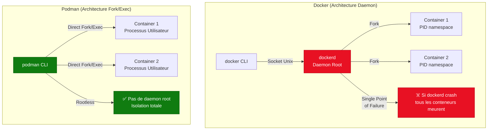

---
tags:
  - podman
  - containers
  - security
  - rootless
  - buildah
---

# Podman : Docker sans Daemon

## Pourquoi Podman sur RHEL ?

**Podman** (Pod Manager) est le remplaçant officiel de Docker sur **RHEL 8+** et **Fedora**. Red Hat a choisi Podman pour des raisons de sécurité et d'architecture.

### Architecture : Docker vs Podman



### Avantages de Podman

| Critère | Docker | Podman |
|---------|--------|--------|
| **Daemon** | Oui (root) | Non (fork/exec direct) |
| **Rootless** | Expérimental | Natif et stable |
| **Systemd** | Non intégré | Génération d'unités native |
| **Pods** | Non (Swarm différent) | Oui (compatible Kubernetes) |
| **API Docker** | Oui | Compatible via socket |
| **SELinux** | Complexe | Intégré (RHEL) |
| **Image Build** | Intégré | Buildah (séparé) |

## Installation

```bash
# Sur RHEL 8/9, Rocky, AlmaLinux
dnf install podman -y

# Vérifier la version
podman --version
# podman version 4.x.x

# Installer les outils complémentaires
dnf install podman-compose buildah skopeo -y
```

## Transition Docker → Podman

### Alias Transparent

```bash
# Ajouter dans ~/.bashrc ou /etc/bashrc
alias docker=podman
alias docker-compose=podman-compose

# Recharger
source ~/.bashrc

# Maintenant, toutes les commandes docker fonctionnent !
docker run hello-world
docker ps
docker images
```

### Différences Clés à Connaître

| Commande Docker | Équivalent Podman | Notes |
|-----------------|-------------------|-------|
| `docker run -d nginx` | `podman run -d nginx` | Identique |
| `docker ps` | `podman ps` | Identique |
| `docker-compose up` | `podman-compose up` | Nécessite `podman-compose` |
| `docker build -t img .` | `podman build -t img .` | Ou `buildah bud` |
| `docker network create` | `podman network create` | Identique |
| `docker volume create` | `podman volume create` | Identique |
| `systemctl restart docker` | ⚠️ **N'existe pas** | Pas de daemon |

!!! warning "Pas de Daemon = Pas de Systemctl"
    Podman n'a **pas de daemon global**. Chaque conteneur est un processus indépendant. Pour démarrer au boot, utiliser `podman generate systemd` (voir plus bas).

## Rootless Containers : Le Game Changer

### Concept

Un utilisateur **non-root** peut lancer des conteneurs **sans sudo**, avec isolation complète via **user namespaces**.

```bash
# En tant qu'utilisateur normal (pas de sudo !)
podman run -d --name web -p 8080:80 nginx

# Vérifier
podman ps
# CONTAINER ID  IMAGE   COMMAND  PORTS                 NAMES
# abc123def456  nginx   ...      0.0.0.0:8080->80/tcp  web

# Tester
curl http://localhost:8080
# Welcome to nginx!
```

### Configuration Rootless

#### 1. User Namespaces (subuid/subgid)

```bash
# Vérifier les mappings utilisateur
cat /etc/subuid
# user1:100000:65536

cat /etc/subgid
# user1:100000:65536

# Si absent, ajouter manuellement
sudo usermod --add-subuids 100000-165535 user1
sudo usermod --add-subgids 100000-165535 user1
```

#### 2. Limites de Ports (<1024)

Par défaut, les utilisateurs non-root ne peuvent pas binder sur les ports < 1024. **Solution** :

```bash
# Option 1 : Utiliser des ports > 1024 et un reverse proxy
podman run -d -p 8080:80 nginx  # OK

# Option 2 : Autoriser les low ports (RHEL 8+)
sudo sysctl net.ipv4.ip_unprivileged_port_start=80
# Persistant :
echo "net.ipv4.ip_unprivileged_port_start=80" | sudo tee /etc/sysctl.d/podman-ports.conf
sudo sysctl -p /etc/sysctl.d/podman-ports.conf

# Option 3 : Utiliser CAP_NET_BIND_SERVICE (rootful)
sudo setcap cap_net_bind_service=+ep /usr/bin/podman
```

#### 3. Stockage Rootless

```bash
# Les images/conteneurs rootless sont stockés dans le home
ls ~/.local/share/containers/storage/

# Lister les images (rootless)
podman images

# Comparer avec les images root
sudo podman images
# ⚠️ Différent ! Root et rootless ont des storages séparés
```

### Sécurité : Rootless vs Rootful

```bash
# Rootless : Le conteneur tourne sous l'UID de l'utilisateur
podman run --rm alpine id
# uid=0(root) gid=0(root)  # ⚠️ root DANS le conteneur

# Mais sur l'hôte, c'est mappé à l'UID user
ps aux | grep alpine
# user1  12345  ... /usr/bin/conmon --api-version 2 ...

# Rootful : Le conteneur est réellement root
sudo podman run --rm alpine id
# uid=0(root) gid=0(root)  # Root aussi sur l'hôte
```

!!! tip "SecNumCloud : Privilégier Rootless"
    Les conteneurs **rootless** offrent une isolation supplémentaire. Si un attaquant échappe du conteneur, il est **user1** sur l'hôte, pas **root**.

## Pods : Le Concept Kubernetes en Local

Un **Pod** est un groupe de conteneurs partageant le même namespace réseau (comme dans Kubernetes).

### Créer un Pod Multi-Conteneurs

```bash
# Créer un pod (crée automatiquement un conteneur "infra" pause)
podman pod create --name webapp -p 8080:80

# Ajouter un conteneur nginx dans le pod
podman run -d --pod webapp --name web nginx

# Ajouter un conteneur PHP-FPM dans le même pod
podman run -d --pod webapp --name php php:fpm

# Les 2 conteneurs partagent localhost !
# Nginx peut atteindre PHP via localhost:9000

# Lister les pods
podman pod ps
# POD ID     NAME    STATUS   CREATED   # OF CONTAINERS
# abc123...  webapp  Running  5m ago    3

# Voir les conteneurs du pod
podman ps --pod
# CONTAINER ID  POD ID    IMAGE        NAMES
# def456...     abc123... nginx        web
# ghi789...     abc123... php:fpm      php
# jkl012...     abc123... pause:3.5    abc123-infra
```

### Exporter un Pod en YAML Kubernetes

```bash
# Générer le YAML
podman generate kube webapp > webapp-pod.yaml

# Contenu (compatible Kubernetes)
cat webapp-pod.yaml
# apiVersion: v1
# kind: Pod
# metadata:
#   name: webapp
# spec:
#   containers:
#   - name: web
#     image: nginx
#   - name: php
#     image: php:fpm

# Recréer le pod depuis le YAML
podman play kube webapp-pod.yaml
```

## Systemd Integration : Auto-Start au Boot

Podman peut générer des **unités systemd** pour démarrer les conteneurs automatiquement.

### Générer une Unité Systemd

```bash
# Lancer un conteneur
podman run -d --name nginx-prod -p 8080:80 nginx

# Générer l'unité systemd (rootless)
podman generate systemd --name nginx-prod --files --new
# Crée : container-nginx-prod.service

# Copier dans le répertoire utilisateur
mkdir -p ~/.config/systemd/user/
mv container-nginx-prod.service ~/.config/systemd/user/

# Recharger systemd
systemctl --user daemon-reload

# Activer au boot (nécessite lingering)
loginctl enable-linger $USER

# Activer le service
systemctl --user enable container-nginx-prod.service
systemctl --user start container-nginx-prod.service

# Vérifier
systemctl --user status container-nginx-prod.service
```

### Systemd Rootful (Admin Système)

```bash
# Lancer un conteneur root
sudo podman run -d --name nginx-prod -p 80:80 nginx

# Générer l'unité
sudo podman generate systemd --name nginx-prod --files --new

# Copier dans systemd système
sudo mv container-nginx-prod.service /etc/systemd/system/

# Activer
sudo systemctl daemon-reload
sudo systemctl enable container-nginx-prod.service
sudo systemctl start container-nginx-prod.service
```

### Gérer un Pod avec Systemd

```bash
# Créer un pod
podman pod create --name webapp -p 8080:80
podman run -d --pod webapp --name web nginx
podman run -d --pod webapp --name php php:fpm

# Générer les unités pour TOUT le pod
podman generate systemd --name webapp --files --new
# Crée : pod-webapp.service
#        container-webapp-web.service
#        container-webapp-php.service

# Copier
mkdir -p ~/.config/systemd/user/
mv pod-webapp.service container-*.service ~/.config/systemd/user/

# Activer le pod (active automatiquement les conteneurs)
systemctl --user enable pod-webapp.service
systemctl --user start pod-webapp.service
```

## Build d'Images : Podman vs Buildah

### Avec Podman (Compatible Dockerfile)

```bash
# Créer un Dockerfile
cat > Dockerfile <<'EOF'
FROM nginx:alpine
COPY index.html /usr/share/nginx/html/
EXPOSE 80
EOF

# Build
podman build -t my-nginx:v1 .

# Run
podman run -d -p 8080:80 my-nginx:v1
```

### Avec Buildah (Approche Scriptée)

```bash
# Créer un conteneur de travail
ctr=$(buildah from alpine)

# Installer des paquets
buildah run $ctr apk add nginx

# Copier des fichiers
buildah copy $ctr index.html /usr/share/nginx/html/

# Configurer
buildah config --entrypoint '["nginx", "-g", "daemon off;"]' $ctr
buildah config --port 80 $ctr

# Commit l'image
buildah commit $ctr my-nginx:buildah

# Lister
buildah images
podman images  # Même registry !
```

## Networking

```bash
# Lister les réseaux
podman network ls
# podman (default bridge)

# Créer un réseau custom
podman network create mynet

# Lancer des conteneurs sur le réseau
podman run -d --name web --network mynet nginx
podman run -d --name db --network mynet postgres

# Les conteneurs peuvent se pinguer par nom !
podman exec web ping db
```

## Registries & Skopeo

```bash
# Chercher une image
podman search nginx

# Pull depuis un registry
podman pull docker.io/library/nginx

# Push vers un registry privé
podman tag nginx localhost:5000/my-nginx
podman push localhost:5000/my-nginx

# Skopeo : Inspecter/Copier sans pull
skopeo inspect docker://docker.io/nginx
skopeo copy docker://nginx:latest docker://localhost:5000/nginx:latest
```

## Dépannage

```bash
# Logs d'un conteneur
podman logs -f container_name

# Inspecter
podman inspect container_name

# Entrer dans un conteneur
podman exec -it container_name /bin/bash

# Stats ressources
podman stats

# Voir les events
podman events

# Vérifier les permissions rootless
podman unshare cat /proc/self/uid_map
```

## Checklist Production

```bash
# 1. Podman installé
podman --version

# 2. Rootless configuré (subuid/subgid)
grep $USER /etc/subuid

# 3. Lingering activé pour auto-start
loginctl show-user $USER | grep Linger
# Linger=yes

# 4. Systemd units générées
systemctl --user list-unit-files | grep container

# 5. Images locales listées
podman images

# 6. Conteneurs en run
podman ps

# 7. Pods actifs
podman pod ps
```

## Liens Utiles

- [Podman Documentation](https://docs.podman.io/)
- [Transition from Docker to Podman](https://developers.redhat.com/blog/2020/11/19/transitioning-from-docker-to-podman)
- [Buildah Tutorials](https://github.com/containers/buildah/tree/main/docs/tutorials)
- [Podman Systemd Guide](https://www.redhat.com/sysadmin/podman-systemd-integration)
