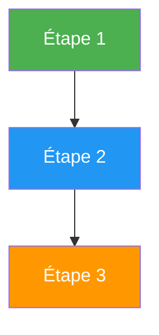

---
tags:
  - guidelines
  - style
  - contribution
---

# Guide de Style ShellBook

Ce guide définit les conventions d'écriture pour maintenir la cohérence du projet.

---

## 1. Structure des Fichiers

### Frontmatter YAML Obligatoire

```yaml
---
tags:
  - formation          # OBLIGATOIRE pour les modules de formation
  - [domaine]          # linux, windows, devops, security, etc.
  - [sujet]            # kubernetes, ansible, docker, etc.
---
```

### Titre Principal

```markdown
# Module X : Titre Explicite

# ✅ Correct
# Module 1 : Architecture et Concepts

# ❌ Incorrect
# Module 01 - Architecture et Concepts
```

**Règles :**
- Numérotation simple (1, 2, 3...) sans zéro devant
- Deux-points `:` comme séparateur (pas de tiret)
- Titre explicite et descriptif

---

## 2. Sections Standard d'un Module

```markdown
# Module X : Titre

[Introduction contextuelle - 2-3 phrases]

## Objectifs du Module

- Objectif 1
- Objectif 2
- Objectif 3

**Durée estimée :** X heures

---

## 1. Première Section

### Sous-section

Contenu...

---

## 2. Deuxième Section

Contenu...

---

## Exercice Pratique

!!! example "Exercice : Titre"
    **Objectif** : Description

    **Étapes** :
    1. Étape 1
    2. Étape 2

??? quote "Solution"
    ```bash
    # Code solution
    ```

---

## Points Clés à Retenir

- Point 1
- Point 2
- Point 3

---

## Ressources

- [Lien 1](url)
- [Lien 2](url)
```

---

## 3. Admonitions

Utiliser les admonitions MkDocs Material de manière cohérente :

| Type | Usage | Exemple |
|------|-------|---------|
| `!!! tip` | Conseils pratiques | Bonnes pratiques, raccourcis |
| `!!! info` | Information contextuelle | Explications supplémentaires |
| `!!! warning` | Attention importante | Risques, précautions |
| `!!! danger` | Danger réel | Perte de données, sécurité |
| `!!! example` | Exercices | TP, mises en situation |
| `!!! success` | Réussite/Validation | Confirmations, checks |
| `??? quote` | Solution collapsible | Corrections d'exercices |

**Syntaxe :**

```markdown
!!! tip "Titre du conseil"
    Contenu du conseil sur plusieurs lignes
    si nécessaire.

??? quote "Solution (cliquer pour révéler)"
    ```bash
    # Code de la solution
    ```
```

---

## 4. Blocs de Code

### Toujours spécifier le langage

```markdown
# ✅ Correct
```bash
echo "Hello World"
```

# ❌ Incorrect
```
echo "Hello World"
```
```

### Langages courants

| Langage | Tag |
|---------|-----|
| Shell/Bash | `bash` |
| PowerShell | `powershell` |
| Python | `python` |
| YAML | `yaml` |
| JSON | `json` |
| INI/Config | `ini` |
| SQL | `sql` |
| Dockerfile | `dockerfile` |
| HCL (Terraform) | `hcl` |
| Texte brut | `text` |

### Commentaires dans le code

```bash
# Style 1 : Commentaire explicatif
command --option value

# Style 2 : Étapes numérotées
# 1. Première étape
command1
# 2. Deuxième étape
command2
```

---

## 5. Tableaux

### Format standard

```markdown
| Colonne 1 | Colonne 2 | Colonne 3 |
|-----------|-----------|-----------|
| Valeur 1  | Valeur 2  | Valeur 3  |
```

**Règles :**
- Maximum 4-5 colonnes
- Alignement par défaut (gauche)
- Contenu concis

---

## 6. Diagrammes Mermaid

### Palette de couleurs ShellBook

```markdown

```

| Niveau | Couleur | Hex |
|--------|---------|-----|
| Débutant | Vert | `#4CAF50` |
| Intermédiaire | Bleu | `#2196F3` |
| Avancé | Orange | `#FF9800` |
| Expert | Violet | `#9C27B0` |
| Warning | Rouge | `#f44336` |

---

## 7. Ton et Langue

### Style d'écriture

- **Professionnel** mais accessible
- **Direct** : éviter les formulations passives
- **Français technique** : utiliser les termes techniques anglais quand ils sont standards (container, cluster, pod)
- **Tutoiement** acceptable dans les formations

### À éviter

- Ton trop casual ("Hello!", "Let's go!")
- Anglicismes inutiles quand le français existe
- Phrases trop longues (max 2 lignes)
- Jargon sans explication

### Exemples

```markdown
# ✅ Correct
Créez un fichier `config.yaml` avec le contenu suivant :

# ❌ Incorrect
Ok, maintenant on va créer un fichier config.yaml, let's go !
```

---

## 8. Liens et Références

### Liens internes

```markdown
# Relatif au fichier courant
[Guide Ansible](../devops/ansible/index.md)

# Depuis la racine docs/
[Formation Linux](../../formations/linux-mastery/index.md)
```

### Liens externes

```markdown
# Avec titre descriptif
[Documentation officielle Kubernetes](https://kubernetes.io/docs/)
```

---

## 9. Checklist de Validation

Avant de soumettre un module, vérifiez :

- [ ] Frontmatter YAML complet avec tag `formation`
- [ ] Titre au format `# Module X : Titre`
- [ ] Section "Objectifs du Module" présente
- [ ] Durée estimée indiquée
- [ ] Blocs de code avec langage spécifié
- [ ] Au moins un exercice avec solution
- [ ] Section "Points Clés" ou conclusion
- [ ] Liens internes fonctionnels
- [ ] Orthographe et grammaire vérifiées

---

## Ressources

- [MkDocs Material - Reference](https://squidfunk.github.io/mkdocs-material/reference/)
- [Guide Docs-as-Code ShellBook](../../devops/docs-as-code.md)
