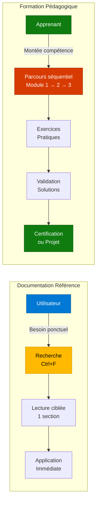

---
tags:
  - formation
  - template
  - module
  - pedagogie
---

# Module 1 : Concepts & Théorie

## Objectif du Module

Comprendre la différence entre une **documentation de référence** (comme les guides ShellBook classiques) et une **formation pédagogique** (comme cette section).

**Durée :** 30 minutes

## Concept : Référence vs Pédagogie

### Documentation de Référence

**Caractéristiques :**

- 📚 **Complète** : Couvre toutes les fonctionnalités
- 🔍 **Consultative** : On y cherche une info précise (Ctrl+F)
- 🔄 **Non-séquentielle** : Pas d'ordre de lecture obligatoire
- 🛠️ **Orientée tâche** : "Comment faire X ?"

**Exemple :** Le guide [Firewalld & NetworkManager](../../linux/rhel-networking.md)

### Formation Pédagogique

**Caractéristiques :**

- 🎯 **Progressive** : Du simple au complexe
- 📖 **Séquentielle** : Module 1 → 2 → 3 (ordre imposé)
- 🧪 **Pratique** : Exercices avec solutions
- 🎓 **Orientée compétence** : "Savoir utiliser X en production"

**Exemple :** Cette formation Template

### Diagramme Comparatif



## Pratique : Structure d'un Module

### Anatomie d'un Module Formation

Chaque module doit contenir ces sections dans cet ordre :

```markdown
# Module X : Titre Explicite

## Objectif du Module
Une phrase claire sur ce que l'apprenant va apprendre.

## Concept : Nom du Concept
Explication théorique avec diagrammes Mermaid.

## Pratique : Mise en Application
Commandes ou configurations à exécuter.

## Exercice : À Vous de Jouer
Mise en situation avec admonition `!!! example`.

## Solution : Correction Détaillée
Correction avec admonition collapsible `??? quote`.

## Points Clés à Retenir
Bullet points des takeaways.
```

### Exemple de Code Block

```yaml
# Configuration MkDocs pour une formation
nav:
  - 🎓 Formations:
    - 📘 Ma Formation:
      - Introduction: formations/ma-formation/index.md
      - Module 1: formations/ma-formation/01-module.md
      - Module 2: formations/ma-formation/02-module.md
```

### Utilisation des Admonitions

!!! note "Note"
    Les **admonitions** sont des blocs colorés pour mettre en valeur une information.

!!! tip "Conseil"
    Utilisez les admonitions avec parcimonie pour ne pas surcharger visuellement.

!!! warning "Attention"
    Les exercices doivent être **faisables** et **réalistes**. Pas de questions pièges.

!!! danger "Erreur Fréquente"
    Ne jamais mettre la solution juste après l'énoncé. Utilisez le collapsible `???`.

## Exercice : Créer un Module Formation

!!! example "À Vous de Jouer"
    **Contexte :** Vous devez créer un module "Introduction à Docker" pour une formation DevOps.

    **Consigne :**

    1. Définir **l'objectif** du module en une phrase
    2. Expliquer le **concept** : Qu'est-ce qu'un conteneur vs une VM ?
    3. Fournir un **exemple pratique** : La commande `docker run hello-world`
    4. Créer un **exercice** : Demander à l'apprenant de lancer un conteneur nginx
    5. Rédiger la **solution** avec les commandes exactes

    **Livrable :** Un fichier `01-intro-docker.md` structuré selon le template.

    **Durée estimée :** 15 minutes

    **Critères de réussite :**

    - ✅ Objectif clair et mesurable
    - ✅ Diagramme Mermaid présent (VM vs Conteneur)
    - ✅ Commande pratique testée et fonctionnelle
    - ✅ Exercice réaliste avec contexte métier
    - ✅ Solution détaillée avec explications

## Solution : Correction de l'Exercice

??? quote "Solution Détaillée"
    ### Fichier `01-intro-docker.md`

    ```markdown
    ---
    tags:
      - docker
      - conteneurs
      - devops
    ---

    # Module 1 : Introduction à Docker

    ## Objectif du Module

    Comprendre la différence entre conteneurs et VMs, et lancer son premier conteneur Docker.

    ## Concept : Conteneur vs Machine Virtuelle

    ### Diagramme Comparatif

    \`\`\`mermaid
    graph TD
        subgraph "Machine Virtuelle"
            A1[Hypervisor] --> B1[VM 1<br/>OS Complet]
            A1 --> B2[VM 2<br/>OS Complet]
            B1 --> C1[App 1]
            B2 --> C2[App 2]
        end

        subgraph "Conteneur Docker"
            D1[Docker Engine] --> E1[Container 1<br/>Libs seulement]
            D1 --> E2[Container 2<br/>Libs seulement]
            E1 --> F1[App 1]
            E2 --> F2[App 2]
        end

        style B1 fill:#e81123,stroke:#b00016,color:#fff
        style E1 fill:#107c10,stroke:#0b5a0d,color:#fff
    \`\`\`

    **Différences clés :**

    | Critère | VM | Conteneur |
    |---------|-----|-----------|
    | Taille | Go (OS complet) | Mo (libs seulement) |
    | Démarrage | Minutes | Secondes |
    | Isolation | Forte (kernel séparé) | Processus (kernel partagé) |

    ## Pratique : Premier Conteneur

    \`\`\`bash
    # Vérifier que Docker est installé
    docker --version
    # Docker version 24.0.7

    # Lancer le conteneur hello-world
    docker run hello-world

    # Résultat attendu :
    # Hello from Docker!
    # This message shows that your installation appears to be working correctly.

    # Lister les conteneurs
    docker ps -a
    # CONTAINER ID   IMAGE         COMMAND    CREATED         STATUS
    # abc123def456   hello-world   "/hello"   5 seconds ago   Exited (0)
    \`\`\`

    ## Exercice : Lancer Nginx

    !!! example "À Vous de Jouer"
        **Contexte :** Vous devez tester rapidement un serveur web pour une démo.

        **Tâche :**

        1. Lancer un conteneur nginx en mode détaché (background)
        2. Mapper le port 8080 de l'hôte vers le port 80 du conteneur
        3. Vérifier que nginx est accessible via `curl http://localhost:8080`
        4. Arrêter et supprimer le conteneur

        **Indices :**

        - `docker run -d` : Mode détaché
        - `-p 8080:80` : Mapping de port
        - `docker stop` et `docker rm` : Arrêter et supprimer

    ## Solution : Correction

    ??? quote "Solution Détaillée"
        \`\`\`bash
        # 1. Lancer nginx en background sur le port 8080
        docker run -d -p 8080:80 --name my-nginx nginx

        # Résultat :
        # abcdef123456 (ID du conteneur)

        # 2. Vérifier que le conteneur tourne
        docker ps
        # CONTAINER ID   IMAGE   COMMAND                  PORTS
        # abcdef123456   nginx   "nginx -g 'daemon of…"   0.0.0.0:8080->80/tcp

        # 3. Tester l'accès
        curl http://localhost:8080
        # <!DOCTYPE html>
        # <html>
        # <head>
        # <title>Welcome to nginx!</title>

        # 4. Arrêter le conteneur
        docker stop my-nginx
        # my-nginx

        # 5. Supprimer le conteneur
        docker rm my-nginx
        # my-nginx

        # Vérification
        docker ps -a | grep my-nginx
        # (Vide = conteneur bien supprimé)
        \`\`\`

        **Explications :**

        - `-d` : Détache le conteneur (retourne la main au terminal)
        - `-p 8080:80` : Port hôte 8080 → port conteneur 80
        - `--name my-nginx` : Nomme le conteneur (plus facile à gérer)
        - `nginx` : Image Docker Hub officielle
    \`\`\`

    **Points Clés :**

    - Les conteneurs sont **légers** (pas d'OS complet)
    - Démarrage **rapide** (< 1 seconde)
    - Isolation au niveau **processus** (pas VM)
    - Port mapping pour exposer les services

    **Prochaine étape :** [Module 2 : Dockerfile & Build](#)

## Points Clés à Retenir

**Ce module vous a appris :**

- 📚 **Différence Référence/Formation** : Consultation vs Apprentissage séquentiel
- 🏗️ **Structure d'un Module** : Objectif → Concept → Pratique → Exercice → Solution
- 🎨 **Admonitions MkDocs** : `note`, `tip`, `warning`, `danger`, `example`, `quote`
- 📊 **Diagrammes Mermaid** : Illustrer visuellement les concepts
- ✅ **Solutions Collapsibles** : `??? quote` pour ne pas spoiler

**Prochaine étape :** [Module 2 : Diagrammes & Visualisation](#) (en cours de rédaction)

---

**Retour au :** [Programme de la Formation](index.md) | [Catalogue](../index.md)
