---
tags:
  - formation
  - ansible
  - automation
  - devops
  - infrastructure-as-code
  - configuration-management
---

# Module 1 : Architecture & Premiers Pas

## Objectif du Module

Comprendre l'architecture agentless d'Ansible, maîtriser les concepts fondamentaux (inventory, modules), et exécuter vos premières commandes ad-hoc pour gérer des serveurs à distance.

**Durée :** 2 heures

## Introduction : Automatiser ou Disparaître

### Le Paradoxe de l'Échelle

> **"Automate or die trying."**
> — Loi de survie du DevOps

**Le problème de l'administration manuelle :**

Imaginez cette situation quotidienne :

```bash
# Lundi 09h : Votre manager demande
"Peux-tu installer Nginx sur nos 3 serveurs web ? Et mettre à jour OpenSSH sur les 5 serveurs de prod ? Ah, et vérifier l'espace disque partout."

# Votre approche manuelle (avant Ansible)
ssh web1.company.com
sudo apt update && sudo apt install nginx -y
exit

ssh web2.company.com
sudo apt update && sudo apt install nginx -y
exit

ssh web3.company.com
sudo apt update && sudo apt install nginx -y
exit

# Répéter 5 fois pour OpenSSH...
# Puis 8 fois pour vérifier l'espace disque...
# Total : 16 connexions SSH manuelles
# Temps : 45 minutes (si aucune erreur)
# Risque d'erreur humaine : ÉLEVÉ
```

**Maintenant, imaginez gérer 100 serveurs. Ou 1000.**

### La Réalité du DevOps Moderne

**Statistiques de l'industrie :**

- **Temps moyen d'un déploiement manuel sur 10 serveurs :** 2-3 heures
- **Temps avec Ansible :** 5-10 minutes
- **Taux d'erreur manuelle :** 15-20% (oubli, typo, mauvais serveur)
- **Taux d'erreur Ansible :** <1% (reproductibilité garantie)

**Ce que vous allez apprendre :**

```bash
# Avec Ansible (APRÈS ce module)
ansible web -b -m apt -a "name=nginx state=present"
# 3 serveurs configurés en 10 secondes ✅

ansible all -b -m apt -a "name=openssh-server state=latest"
# 8 serveurs mis à jour en parallèle ✅

ansible all -m shell -a "df -h /"
# Espace disque vérifié partout instantanément ✅

# Total : 3 commandes, 30 secondes
```

**Ansible = Multiplicateur de force** pour les équipes Ops/DevOps.

---

## Concept : L'Architecture Ansible

### Architecture Agentless - La Force d'Ansible

**Différence fondamentale avec les autres outils (Puppet, Chef, Salt) :**

| **Aspect** | **Ansible** | **Puppet/Chef/Salt** |
|------------|-------------|---------------------|
| **Agent sur serveurs cibles** | ❌ **NON** (Agentless) | ✅ OUI (agent daemon) |
| **Communication** | SSH (Linux) / WinRM (Windows) | Agent → Master (port custom) |
| **Installation cible** | ❌ Rien à installer | ✅ Package agent + config |
| **Maintenance** | ❌ Aucune (pas d'agent) | ✅ Mise à jour agents |
| **Overhead serveur** | ❌ Minimal (SSH déjà présent) | ✅ CPU/RAM pour agent |
| **Firewall** | ✅ Port 22 SSH (déjà ouvert) | ⚠️ Ports customs (1024+) |
| **Complexité** | ✅ **Simple** | ⚠️ Infrastructure Master/Slave |

**Pourquoi "Agentless" est révolutionnaire :**

1. **Aucune préparation des serveurs** : Si SSH fonctionne, Ansible fonctionne
2. **Pas de "chicken-and-egg"** : Pas besoin d'installer un agent avant d'automatiser
3. **Sécurité native** : Utilise SSH (déjà durci dans le Module Hardening Linux)
4. **Pas de maintenance supplémentaire** : Aucun agent à mettre à jour

**Architecture en Image :**

```mermaid
flowchart LR
    A[💻 Control Node<br/>Ansible installé<br/>localhost] -->|SSH 22| B[🖥️ Managed Node 1<br/>web1.company.com]
    A -->|SSH 22| C[🖥️ Managed Node 2<br/>web2.company.com]
    A -->|SSH 22| D[🖥️ Managed Node 3<br/>db1.company.com]

    A -->|1. Lit| I[📋 Inventory<br/>hosts.ini]
    A -->|2. Exécute| M[⚙️ Module<br/>apt/copy/service]
    A -->|3. Logs| L[📊 Résultats<br/>SUCCESS/FAILED]

    style A fill:#e1f5ff
    style I fill:#fff9c4
    style M fill:#c8e6c9
    style L fill:#ffccbc
```



**Flux d'exécution typique :**

1. **Control Node (votre machine)** : Vous exécutez `ansible ...`
2. **Ansible lit l'Inventory** : Liste des serveurs cibles
3. **Connexion SSH** : Ansible se connecte aux serveurs (en parallèle)
4. **Transfert du module Python** : Copie temporaire dans `/tmp/` sur la cible
5. **Exécution** : Le module s'exécute (ex: installer nginx)
6. **Retour des résultats** : SUCCESS (green) ou FAILED (red)
7. **Nettoyage** : Suppression du fichier temporaire sur la cible

**Prérequis des Managed Nodes :**

- Python 3.x (ou Python 2.7 pour anciennes versions Ansible)
- SSH activé (ce que vous avez fait au Module Hardening Linux !)
- Utilisateur avec droits sudo (ex: alice)

C'est tout. **Rien d'autre à installer.**

---

### Inventory - La Liste des Cibles

**Qu'est-ce qu'un Inventory ?**

L'inventory est le fichier qui définit **sur quels serveurs Ansible va agir**.

**Formats supportés :**

1. **INI** (simple, recommandé pour débuter)
2. **YAML** (plus structuré)
3. **Dynamic Inventory** (scripts Python/JSON pour cloud AWS/Azure/GCP)

#### Exemple d'Inventory Statique (INI)

**Fichier `hosts.ini` :**

```ini
# Serveurs individuels (sans groupe)
mail.company.com

[web]
# Groupe "web" : serveurs web
web1.company.com
web2.company.com
web3.company.com

[db]
# Groupe "db" : bases de données
db1.company.com ansible_user=dbadmin
db2.company.com ansible_user=dbadmin

[monitoring]
# Serveur de monitoring
grafana.company.com ansible_port=2222

[production:children]
# Groupe de groupes (meta-groupe)
web
db
monitoring
```

**Syntaxe des variables d'inventory :**

- `ansible_user` : Utilisateur SSH à utiliser (par défaut: utilisateur courant)
- `ansible_port` : Port SSH (par défaut: 22)
- `ansible_host` : IP réelle si le nom est un alias
- `ansible_python_interpreter` : Chemin Python sur la cible

**Exemple avec variables :**

```ini
[web]
webserver1 ansible_host=192.168.1.10 ansible_user=deploy ansible_port=2222
webserver2 ansible_host=192.168.1.11 ansible_user=deploy
```

#### Groupes Spéciaux Ansible

- **`all`** : TOUS les serveurs de l'inventory (implicite)
- **`ungrouped`** : Serveurs sans groupe explicite

**Exemple de ciblage :**

```bash
ansible all -m ping           # Tous les serveurs
ansible web -m ping           # Uniquement groupe "web"
ansible db -m ping            # Uniquement groupe "db"
ansible production -m ping    # Tous les groupes dans "production" (web+db+monitoring)
```

#### Inventory Dynamique (Mention)

**Pour les infrastructures cloud :**

Au lieu d'un fichier statique, un **script** interroge l'API du cloud provider et génère l'inventory en temps réel.

**Exemples :**

- AWS EC2 : `aws_ec2.yml` (plugin officiel)
- Azure : `azure_rm.yml`
- GCP : `gcp_compute.yml`
- VMware vSphere : `vmware_vm_inventory.yml`

**Avantage :** Les serveurs ajoutés/supprimés dans le cloud sont automatiquement pris en compte.

**Note :** Nous verrons les inventaires dynamiques dans un module avancé. Pour débuter, l'inventory statique est parfait.

---

### Modules - Les Outils de la Boîte

**Qu'est-ce qu'un Module Ansible ?**

Un module est une **unité de travail réutilisable** : installer un package, copier un fichier, redémarrer un service, etc.

**Ansible inclut 3000+ modules** couvrant tous les cas d'usage.

#### Modules Essentiels (Top 10)

| **Module** | **Fonction** | **Exemple** |
|------------|-------------|-------------|
| `ping` | Tester la connectivité | `ansible all -m ping` |
| `shell` | Exécuter une commande shell | `ansible all -m shell -a "uptime"` |
| `command` | Exécuter commande (sans shell) | `ansible all -m command -a "ls -la"` |
| `apt` | Gérer packages Debian/Ubuntu | `ansible all -m apt -a "name=nginx state=present"` |
| `yum` / `dnf` | Gérer packages RHEL/CentOS | `ansible all -m yum -a "name=httpd state=present"` |
| `copy` | Copier fichier local → distant | `ansible all -m copy -a "src=file.txt dest=/tmp/"` |
| `file` | Gérer fichiers/répertoires | `ansible all -m file -a "path=/tmp/test state=directory"` |
| `service` / `systemd` | Gérer services | `ansible all -m service -a "name=nginx state=started"` |
| `user` | Gérer utilisateurs | `ansible all -m user -a "name=alice state=present"` |
| `template` | Déployer template Jinja2 | `ansible all -m template -a "src=nginx.j2 dest=/etc/nginx/nginx.conf"` |

#### Idempotence - Le Superpouvoir des Modules

**Définition :** Un module idempotent peut être exécuté plusieurs fois **sans effet secondaire** si l'état cible est déjà atteint.

**Exemple avec le module `apt` :**

```bash
# Première exécution
ansible web -b -m apt -a "name=nginx state=present"
# Résultat : CHANGED (nginx installé)

# Deuxième exécution (nginx déjà installé)
ansible web -b -m apt -a "name=nginx state=present"
# Résultat : SUCCESS (OK, déjà installé, rien à faire)
```

**Avantage :**

- ✅ Pas de double installation
- ✅ Pas d'erreur si déjà fait
- ✅ Sûr de ré-exécuter (convergence vers état désiré)

**Contre-exemple avec `shell` (NON idempotent) :**

```bash
# Première exécution
ansible all -m shell -a "echo 'test' >> /tmp/file.txt"
# Résultat : CHANGED (ligne ajoutée)

# Deuxième exécution
ansible all -m shell -a "echo 'test' >> /tmp/file.txt"
# Résultat : CHANGED (ligne ajoutée ENCORE → doublon!)
```

**Règle d'or :** Préférer les modules dédiés (`apt`, `copy`, `service`) au module `shell` pour garantir l'idempotence.

---

## Pratique : La CLI Ad-Hoc

### Installation d'Ansible

**Prérequis :**

- Python 3.8+ installé
- Pip (gestionnaire de packages Python)

**Installation via pip (recommandé) :**

```bash
# Installer Ansible
pip install ansible

# Vérifier l'installation
ansible --version
# ansible [core 2.16.0]
#   config file = None
#   python version = 3.11.0
```

**OU via package manager :**

=== "RHEL/Rocky"

    ```bash
    sudo dnf install ansible -y
    ```

=== "Debian/Ubuntu"

    ```bash
    sudo apt update
    sudo apt install ansible -y
    ```

=== "macOS"

    ```bash
    brew install ansible
    ```

**Vérification :**

```bash
ansible --version
ansible-playbook --version
ansible-inventory --version
```

---

### Configuration de l'Inventory

**Créer un répertoire de travail :**

```bash
mkdir ~/ansible-lab
cd ~/ansible-lab
```

**Créer un fichier inventory simple (`hosts.ini`) :**

```bash
nano hosts.ini
```

**Contenu pour un lab local (simulation avec localhost) :**

```ini
[local]
localhost ansible_connection=local

[web]
web1 ansible_host=localhost ansible_connection=local
web2 ansible_host=localhost ansible_connection=local

[db]
database ansible_host=localhost ansible_connection=local
```

**Explication :**

- `ansible_connection=local` : Ne pas utiliser SSH, exécuter en local (simulation)
- En production, vous utiliseriez de vraies IPs/hostnames

---

### Le Ping - Le "Hello World" d'Ansible

**Commande :**

```bash
ansible all -m ping -i hosts.ini
```

**Décomposition :**

- `ansible` : Commande ad-hoc
- `all` : Cible tous les serveurs de l'inventory
- `-m ping` : Utilise le module `ping`
- `-i hosts.ini` : Chemin vers l'inventory

**Sortie attendue :**

```json
localhost | SUCCESS => {
    "changed": false,
    "ping": "pong"
}
web1 | SUCCESS => {
    "changed": false,
    "ping": "pong"
}
web2 | SUCCESS => {
    "changed": false,
    "ping": "pong"
}
database | SUCCESS => {
    "changed": false,
    "ping": "pong"
}
```

**Interprétation :**

- ✅ **SUCCESS** : Connectivité OK
- **"changed": false** : Rien n'a été modifié (ping est une vérification)
- **"ping": "pong"** : Réponse du module

**Si vous voyez ça, Ansible fonctionne ! 🎉**

---

### Exécuter des Commandes Ad-Hoc

#### 1. Vérifier l'Uptime

```bash
ansible all -m shell -a "uptime" -i hosts.ini
```

**Sortie :**

```
localhost | CHANGED | rc=0 >>
 10:23:45 up 2 days,  3:14,  1 user,  load average: 0.52, 0.58, 0.59

web1 | CHANGED | rc=0 >>
 10:23:45 up 2 days,  3:14,  1 user,  load average: 0.52, 0.58, 0.59
```

#### 2. Vérifier l'Espace Disque

```bash
ansible all -m shell -a "df -h /" -i hosts.ini
```

**Sortie :**

```
localhost | CHANGED | rc=0 >>
Filesystem      Size  Used Avail Use% Mounted on
/dev/sda1        50G   28G   20G  59% /
```

#### 3. Lister les Utilisateurs Connectés

```bash
ansible all -m shell -a "who" -i hosts.ini
```

#### 4. Créer un Fichier (Module `file`)

```bash
ansible all -m file -a "path=/tmp/ansible-test state=touch" -i hosts.ini
```

**Sortie :**

```
localhost | CHANGED => {
    "changed": true,
    "dest": "/tmp/ansible-test",
    "state": "file"
}
```

**Vérification :**

```bash
ls -la /tmp/ansible-test
# -rw-r--r-- 1 user user 0 Nov 22 10:30 /tmp/ansible-test
```

#### 5. Installer un Package (Nécessite sudo)

```bash
ansible web -b -m apt -a "name=htop state=present" -i hosts.ini
```

**Options :**

- `-b` : Become (utiliser sudo)
- `name=htop` : Package à installer
- `state=present` : S'assurer qu'il est installé

**Note :** En local, cela installera htop sur votre machine.

---

### Options Importantes des Commandes Ad-Hoc

| **Option** | **Fonction** | **Exemple** |
|------------|-------------|-------------|
| `-i` | Spécifier l'inventory | `-i hosts.ini` |
| `-m` | Spécifier le module | `-m ping` |
| `-a` | Arguments du module | `-a "name=nginx"` |
| `-b` | Become (sudo) | `-b` |
| `--become-user` | Devenir un utilisateur spécifique | `--become-user=postgres` |
| `-u` | Utilisateur SSH | `-u alice` |
| `-k` | Demander le mot de passe SSH | `-k` |
| `-K` | Demander le mot de passe sudo | `-K` |
| `--limit` | Limiter à certains hosts | `--limit web1` |
| `-v`, `-vv`, `-vvv` | Verbosité (debug) | `-vvv` |

**Exemples d'utilisation :**

```bash
# Installer nginx sur le groupe web avec sudo
ansible web -b -m apt -a "name=nginx state=present" -i hosts.ini

# Redémarrer nginx (en tant qu'utilisateur alice via sudo)
ansible web -b -u alice -m service -a "name=nginx state=restarted" -i hosts.ini

# Copier un fichier sur database uniquement
ansible database -m copy -a "src=backup.sql dest=/tmp/" --limit database -i hosts.ini

# Debug mode (voir les détails SSH)
ansible all -m ping -i hosts.ini -vvv
```

---

## Exercice : Hello Ansible

### Scénario

Vous allez créer un lab Ansible minimal pour gérer 2 "serveurs" simulés :

- **Groupe `web`** : 2 serveurs web (web1, web2)
- **Groupe `db`** : 1 serveur de base de données (database)

**Simulation :** Tous pointent vers `localhost` (votre machine) pour faciliter le lab.

**Objectif :** Maîtriser l'inventory, la configuration Ansible, et les commandes ad-hoc.

---

### Étapes de l'Exercice

#### Étape 1 : Créer l'Inventory

**Fichier `inventory.ini` :**

Créez ce fichier avec le contenu suivant :

```ini
[web]
web1 ansible_host=localhost ansible_connection=local
web2 ansible_host=localhost ansible_connection=local

[db]
database ansible_host=localhost ansible_connection=local

[all:vars]
ansible_python_interpreter=/usr/bin/python3
```

**Explication :**

- `[web]` : Groupe de serveurs web
- `[db]` : Groupe de base de données
- `[all:vars]` : Variables appliquées à tous les hosts (ici, l'interpréteur Python)

---

#### Étape 2 : Configurer `ansible.cfg`

**Pourquoi ?**

Par défaut, Ansible vérifie les clés SSH des hosts (host key checking). En lab local, cela génère des erreurs. On le désactive.

**Fichier `ansible.cfg` :**

```ini
[defaults]
inventory = inventory.ini
host_key_checking = False
deprecation_warnings = False

[privilege_escalation]
become = True
become_method = sudo
become_user = root
become_ask_pass = False
```

**Explication :**

- `inventory = inventory.ini` : Inventory par défaut (plus besoin de `-i`)
- `host_key_checking = False` : Désactiver vérification clés SSH (LAB UNIQUEMENT)
- `become = True` : Utiliser sudo par défaut
- `become_ask_pass = False` : Ne pas demander le mot de passe sudo (si NOPASSWD configuré)

**⚠️ IMPORTANT :** En production, **ne jamais désactiver** `host_key_checking` (risque MITM).

---

#### Étape 3 : Tester la Connectivité

**Ping le groupe `web` :**

```bash
ansible web -m ping
```

**Résultat attendu :**

```json
web1 | SUCCESS => {
    "changed": false,
    "ping": "pong"
}
web2 | SUCCESS => {
    "changed": false,
    "ping": "pong"
}
```

**Ping TOUS les serveurs :**

```bash
ansible all -m ping
```

**Résultat attendu :**

```json
web1 | SUCCESS => { ... }
web2 | SUCCESS => { ... }
database | SUCCESS => { ... }
```

---

#### Étape 4 : Vérifier l'Espace Disque

**Commande ad-hoc pour vérifier `/` sur tous les serveurs :**

```bash
ansible all -m shell -a "df -h /"
```

**OU avec le module `command` :**

```bash
ansible all -m command -a "df -h /"
```

**Résultat attendu :**

```
web1 | CHANGED | rc=0 >>
Filesystem      Size  Used Avail Use% Mounted on
/dev/sda1        50G   28G   20G  59% /

web2 | CHANGED | rc=0 >>
Filesystem      Size  Used Avail Use% Mounted on
/dev/sda1        50G   28G   20G  59% /

database | CHANGED | rc=0 >>
Filesystem      Size  Used Avail Use% Mounted on
/dev/sda1        50G   28G   20G  59% /
```

---

#### Étape 5 : Vérifier l'Uptime

```bash
ansible all -m shell -a "uptime"
```

---

#### Étape 6 : Créer un Fichier de Test

**Créer `/tmp/hello-ansible.txt` sur le groupe `web` uniquement :**

```bash
ansible web -m file -a "path=/tmp/hello-ansible.txt state=touch"
```

**Vérifier la création :**

```bash
ls -la /tmp/hello-ansible.txt
```

---

#### Étape 7 : Installer un Package (Bonus)

**Installer `htop` sur le groupe `db` :**

```bash
ansible db -m apt -a "name=htop state=present"
```

**Vérifier l'installation :**

```bash
which htop
# /usr/bin/htop
```

---

### Questions de Validation

1. **Quelle est la différence entre `ansible all -m ping` et `ping google.com` ?**
2. **Pourquoi désactive-t-on `host_key_checking` en lab (et pourquoi c'est dangereux en production) ?**
3. **Quelle est la différence entre le module `shell` et le module `command` ?**
4. **Que se passe-t-il si on exécute `ansible web -m apt -a "name=nginx state=present"` deux fois ?**

---

## Solution

??? quote "Solution Complète - Hello Ansible"

    ### Fichiers de Configuration

    **1. Fichier `inventory.ini` :**

    ```ini
    [web]
    web1 ansible_host=localhost ansible_connection=local
    web2 ansible_host=localhost ansible_connection=local

    [db]
    database ansible_host=localhost ansible_connection=local

    [all:vars]
    ansible_python_interpreter=/usr/bin/python3
    ```

    ---

    **2. Fichier `ansible.cfg` :**

    ```ini
    [defaults]
    inventory = inventory.ini
    host_key_checking = False
    deprecation_warnings = False
    stdout_callback = yaml

    [privilege_escalation]
    become = True
    become_method = sudo
    become_user = root
    become_ask_pass = False
    ```

    ---

    ### Commandes Exécutées

    **Étape 3 : Ping**

    ```bash
    # Ping groupe web
    ansible web -m ping

    # Ping tous les serveurs
    ansible all -m ping
    ```

    **Sortie attendue :**

    ```yaml
    web1:
      changed: false
      ping: pong
    web2:
      changed: false
      ping: pong
    database:
      changed: false
      ping: pong
    ```

    ---

    **Étape 4 : Vérifier l'Espace Disque**

    ```bash
    ansible all -m shell -a "df -h /"
    ```

    **Sortie attendue :**

    ```yaml
    web1:
      changed: true
      cmd: df -h /
      rc: 0
      stdout: |-
        Filesystem      Size  Used Avail Use% Mounted on
        /dev/sda1        50G   28G   20G  59% /
    ```

    ---

    **Étape 5 : Vérifier l'Uptime**

    ```bash
    ansible all -m shell -a "uptime"
    ```

    **Sortie attendue :**

    ```yaml
    web1:
      changed: true
      cmd: uptime
      stdout: ' 10:45:23 up 2 days,  3:36,  1 user,  load average: 0.45, 0.50, 0.52'
    ```

    ---

    **Étape 6 : Créer Fichier de Test**

    ```bash
    ansible web -m file -a "path=/tmp/hello-ansible.txt state=touch"
    ```

    **Sortie attendue :**

    ```yaml
    web1:
      changed: true
      dest: /tmp/hello-ansible.txt
      state: file
    ```

    **Vérification :**

    ```bash
    ls -la /tmp/hello-ansible.txt
    # -rw-r--r-- 1 user user 0 Nov 22 10:50 /tmp/hello-ansible.txt
    ```

    ---

    **Étape 7 : Installer Package**

    ```bash
    ansible db -m apt -a "name=htop state=present"
    ```

    **Sortie attendue (première exécution) :**

    ```yaml
    database:
      changed: true
      stderr: ''
      stdout: |-
        Reading package lists...
        Building dependency tree...
        The following NEW packages will be installed:
          htop
    ```

    **Sortie attendue (deuxième exécution - idempotence) :**

    ```yaml
    database:
      changed: false
      msg: 'htop is already installed'
    ```

    ---

    ### Réponses aux Questions de Validation

    **1. Différence entre `ansible all -m ping` et `ping google.com` ?**

    - `ping google.com` : Ping ICMP réseau (teste connectivité IP)
    - `ansible all -m ping` : Module Ansible qui :
      - Teste connectivité SSH
      - Vérifie que Python fonctionne sur la cible
      - Valide que Ansible peut exécuter des modules
    - **Ce ne sont PAS la même chose !**

    ---

    **2. Pourquoi désactiver `host_key_checking` en lab ?**

    **En lab :**
    - Les "serveurs" sont simulés (localhost)
    - Pas de vraies clés SSH à valider
    - Évite les erreurs lors des tests rapides

    **Pourquoi c'est DANGEREUX en production :**
    - Désactiver cette vérification expose aux attaques **Man-in-the-Middle (MITM)**
    - Un attaquant pourrait intercepter la connexion SSH
    - **EN PRODUCTION : TOUJOURS LAISSER ACTIVÉ**

    ---

    **3. Différence entre `shell` et `command` ?**

    | **Aspect** | **`shell`** | **`command`** |
    |------------|-------------|---------------|
    | **Interpréteur** | Utilise `/bin/sh` | Exécute directement |
    | **Variables shell** | ✅ Supportées (`$HOME`, `~`, etc.) | ❌ Non supportées |
    | **Pipes/Redirections** | ✅ Supportés (`\|`, `>`, `<`) | ❌ Non supportés |
    | **Sécurité** | ⚠️ Risque injection | ✅ Plus sûr |
    | **Performance** | ⚠️ Légèrement plus lent | ✅ Plus rapide |

    **Exemples :**

    ```bash
    # ✅ OK avec shell
    ansible all -m shell -a "echo $HOME"

    # ❌ KO avec command (pas de variable shell)
    ansible all -m command -a "echo $HOME"
    # Résultat : "$HOME" (littéral)

    # ✅ OK avec shell (pipe)
    ansible all -m shell -a "cat /etc/passwd | grep root"

    # ❌ KO avec command (pas de pipe)
    ansible all -m command -a "cat /etc/passwd | grep root"
    # Résultat : Erreur
    ```

    **Règle :** Préférer `command` par défaut (sécurité), utiliser `shell` uniquement si nécessaire.

    ---

    **4. Exécuter `ansible web -m apt -a "name=nginx state=present"` deux fois ?**

    **Première exécution :**

    ```yaml
    web1:
      changed: true
      msg: 'nginx installed'
    ```

    → Nginx installé, état **CHANGED** (modifié)

    **Deuxième exécution :**

    ```yaml
    web1:
      changed: false
      msg: 'nginx is already installed'
    ```

    → Nginx déjà présent, état **SUCCESS** mais **changed: false**

    **C'est l'idempotence !** Le module détecte que l'état désiré est déjà atteint et ne fait rien.

    ---

    ### Structure Finale du Lab

    ```
    ~/ansible-lab/
    ├── inventory.ini       ← Liste des serveurs
    ├── ansible.cfg         ← Configuration Ansible
    └── /tmp/hello-ansible.txt  ← Fichier créé par l'exercice
    ```

    ---

    ### Commandes de Nettoyage

    ```bash
    # Supprimer le fichier de test
    ansible web -m file -a "path=/tmp/hello-ansible.txt state=absent"

    # Désinstaller htop
    ansible db -m apt -a "name=htop state=absent"
    ```

## Conclusion du Module

### Ce que Vous Avez Appris

✅ **Architecture Agentless** : Ansible utilise SSH, aucun agent à installer sur les cibles

✅ **Inventory** : Définir des groupes de serveurs (statique INI/YAML, dynamique pour cloud)

✅ **Modules** : Unités de travail réutilisables (ping, shell, apt, copy, service...)

✅ **Idempotence** : Les modules garantissent la convergence vers l'état désiré sans effet secondaire

✅ **CLI Ad-Hoc** : Exécuter des commandes rapides sans écrire de playbook

✅ **Configuration** : `ansible.cfg` pour personnaliser le comportement

### Commandes Clés à Retenir

```bash
# Installation
pip install ansible

# Ping tous les serveurs
ansible all -m ping -i hosts.ini

# Exécuter une commande shell
ansible all -m shell -a "uptime" -i hosts.ini

# Installer un package avec sudo
ansible web -b -m apt -a "name=nginx state=present"

# Copier un fichier
ansible all -m copy -a "src=file.txt dest=/tmp/"

# Vérifier l'inventory
ansible-inventory --list -i hosts.ini

# Mode debug
ansible all -m ping -vvv
```

### Différence Shell vs Command vs Module Dédié

| **Besoin** | ❌ **Mauvais** | ✅ **Bon** |
|------------|--------------|----------|
| Installer nginx | `shell: apt install nginx -y` | `apt: name=nginx state=present` |
| Créer fichier | `shell: touch /tmp/file` | `file: path=/tmp/file state=touch` |
| Redémarrer service | `shell: systemctl restart nginx` | `service: name=nginx state=restarted` |
| Uptime | `shell: uptime` | `shell: uptime` (OK, pas de module dédié) |

**Règle d'or :** Toujours chercher un module dédié avant d'utiliser `shell`.

### Prochaines Étapes

**Ce module couvre les commandes ad-hoc. Limites :**

- ❌ Pas de réutilisabilité (commandes à retaper)
- ❌ Pas de gestion de l'ordre d'exécution complexe
- ❌ Pas de conditionnelles/boucles

**Module 2 : Playbooks** résoudra ces limites avec l'Infrastructure as Code.

### Ressources Complémentaires

**Documentation officielle :**

- [Ansible Module Index](https://docs.ansible.com/ansible/latest/collections/index_module.html)
- [Ansible Ad-Hoc Commands](https://docs.ansible.com/ansible/latest/user_guide/intro_adhoc.html)
- [Ansible Configuration](https://docs.ansible.com/ansible/latest/reference_appendices/config.html)

**Bonnes pratiques :**

- Toujours utiliser un inventory explicite (ne jamais modifier `/etc/ansible/hosts`)
- Préférer les modules dédiés à `shell`/`command`
- Utiliser `--check` (dry-run) avant exécution critique
- Activer `host_key_checking` en production
- Documenter vos inventories (commentaires)

---

**Félicitations ! Vous maîtrisez les fondamentaux d'Ansible et pouvez gérer des serveurs avec des commandes ad-hoc.** 🎉

**Prochaine étape : Module 2 - Playbooks pour automatiser des workflows complets !**
