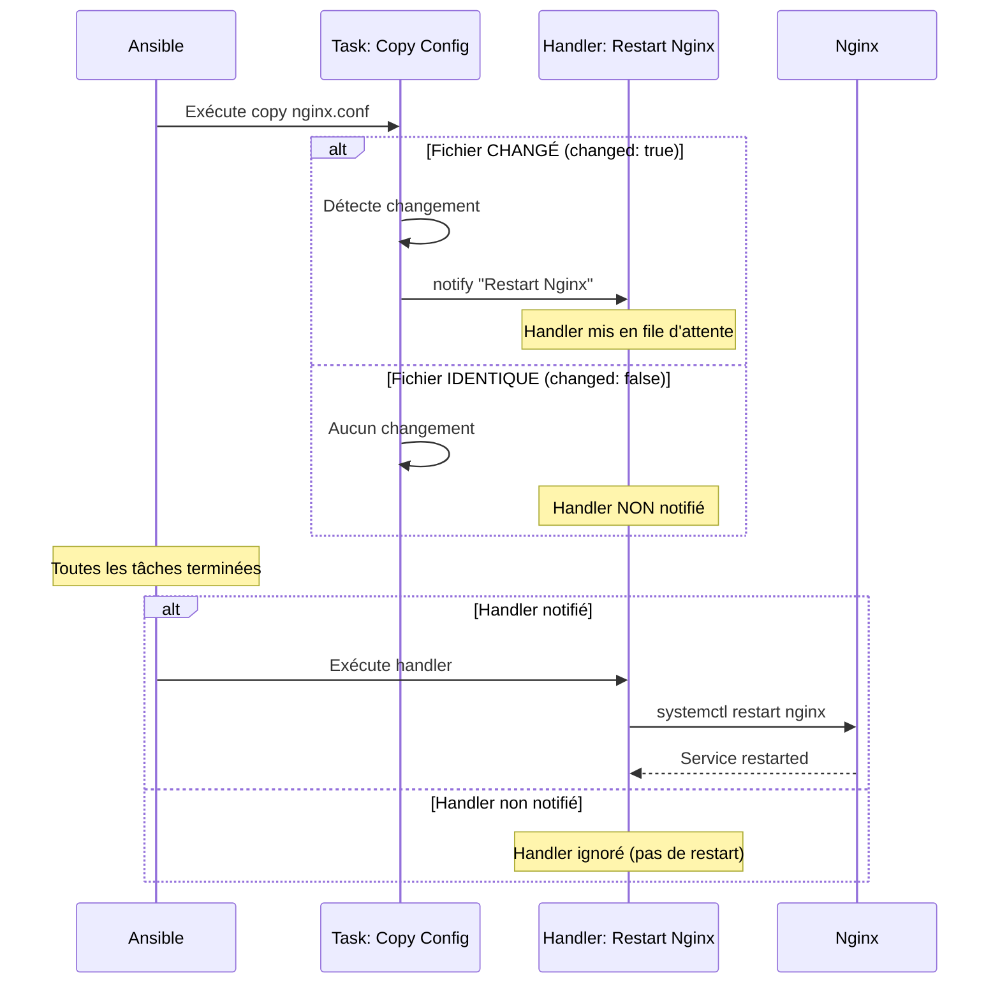

---
tags:
  - formation
  - ansible
  - playbooks
  - yaml
  - automation
  - infrastructure-as-code
  - devops
---

# Module 2 : Playbooks - L'Art de l'Automatisation

## Objectif du Module

Maîtriser l'écriture de playbooks Ansible pour automatiser des workflows complets, comprendre la syntaxe YAML, gérer les handlers intelligemment, et transformer vos commandes ad-hoc en code réutilisable et versionnable.

**Durée :** 2h30

## Introduction : De l'Ad-Hoc à la Production

### Le Passage Obligatoire

> **"Ad-Hoc is for testing. Playbooks are for production."**
> — Principe fondamental Ansible

**Ce que vous avez appris au Module 1 :**

```bash
# Commandes ad-hoc : Rapides, pratiques... mais limitées
ansible web -b -m apt -a "name=nginx state=present"
ansible web -m copy -a "src=index.html dest=/var/www/html/"
ansible web -b -m service -a "name=nginx state=started enabled=yes"

# Problèmes :
# ❌ Pas de réutilisabilité (commandes à retaper)
# ❌ Pas d'ordre d'exécution garanti
# ❌ Pas de versionnement Git facile
# ❌ Pas de documentation intégrée
# ❌ Pas de gestion d'erreur avancée
```

**Avec les Playbooks :**

```yaml
# install_nginx.yml - UN fichier, TOUT le workflow
---
- name: Installer et configurer Nginx
  hosts: web
  become: yes

  tasks:
    - name: Installer Nginx
      apt:
        name: nginx
        state: present

    - name: Copier page personnalisée
      copy:
        src: index.html
        dest: /var/www/html/
      notify: Restart Nginx

    - name: Démarrer Nginx
      service:
        name: nginx
        state: started
        enabled: yes

  handlers:
    - name: Restart Nginx
      service:
        name: nginx
        state: restarted
```

**Avantages :**

- ✅ **Réutilisable** : `ansible-playbook install_nginx.yml`
- ✅ **Versionné** : Git commit + push
- ✅ **Documenté** : `name:` explique chaque tâche
- ✅ **Idempotent** : Exécutable 100 fois, effet identique
- ✅ **Intelligent** : Handlers = actions conditionnelles

### Statistiques de l'Industrie

**Migration Ad-Hoc → Playbooks :**

- **Temps de configuration initial** : +20% (écriture du playbook)
- **Temps de re-déploiement** : -90% (1 commande vs 10+)
- **Taux d'erreur** : -95% (plus d'oubli de commande)
- **Onboarding nouveaux admins** : -70% (playbook = documentation)

**Exemple concret :**

| **Action** | **Ad-Hoc (10 serveurs)** | **Playbook (10 serveurs)** |
|------------|------------------------|--------------------------|
| Écriture initiale | 5 min | 20 min |
| Exécution 1ère fois | 15 min (10 commandes) | 2 min (1 commande) |
| Exécution 2ème fois | 15 min (re-taper) | 2 min (même commande) |
| **Total 10 exécutions** | **155 min** | **38 min** (-75%) |

**Playbooks = ROI immédiat dès la 2ème exécution.**

---

## Concept : YAML & Structure des Playbooks

### YAML Basics - Le Langage d'Ansible

**YAML (YAML Ain't Markup Language)** est un format de sérialisation de données lisible par l'humain.

#### Règles d'Indentation Critiques

**⚠️ YAML est STRICT sur l'indentation (comme Python).**

```yaml
# ✅ CORRECT - Indentation 2 espaces
- name: Tâche principale
  apt:
    name: nginx
    state: present

# ❌ INCORRECT - Indentation 4 espaces (mélange)
- name: Tâche principale
    apt:
      name: nginx
      state: present

# ❌ INCORRECT - Tabulations (JAMAIS!)
- name: Tâche principale
→apt:  # ← Tabulation = ERREUR YAML
  name: nginx
```

**Règle d'or :** **2 espaces par niveau d'indentation**, **jamais de tabulations**.

#### Structures de Données YAML

##### 1. Listes (Arrays)

**Syntaxe : Tiret `-` suivi d'un espace**

```yaml
# Liste de packages
packages:
  - nginx
  - git
  - curl
  - htop

# Liste de tâches
tasks:
  - name: Installer Nginx
    apt: name=nginx state=present

  - name: Démarrer Nginx
    service: name=nginx state=started
```

##### 2. Dictionnaires (Key-Value)

**Syntaxe : Clé `:` valeur**

```yaml
# Dictionnaire simple
user:
  name: alice
  uid: 1001
  shell: /bin/bash

# Dictionnaire de module
apt:
  name: nginx
  state: present
  update_cache: yes
```

##### 3. Combinaison Listes + Dictionnaires

```yaml
# Liste de dictionnaires (cas le plus courant dans Ansible)
users:
  - name: alice
    uid: 1001
    groups: sudo

  - name: bob
    uid: 1002
    groups: docker
```

#### Validation YAML

**Avant d'exécuter un playbook, vérifier la syntaxe :**

```bash
# Vérifier syntaxe YAML
ansible-playbook --syntax-check playbook.yml

# ✅ Sortie si OK
# playbook: playbook.yml

# ❌ Sortie si KO
# ERROR! Syntax Error while loading YAML.
#   found character that cannot start any token
```

---

### Anatomie d'un Playbook


**Structure minimale d'un playbook :**

```yaml
---
- name: Nom du Play (optionnel mais recommandé)
  hosts: groupe_cible
  become: yes/no

  vars:
    variable1: valeur1

  tasks:
    - name: Description de la tâche 1
      module_name:
        param1: value1

    - name: Description de la tâche 2
      module_name:
        param1: value1

  handlers:
    - name: Handler déclenché par notify
      module_name:
        param1: value1
```

#### Éléments Clés

##### 1. `---` (Triple tiret)

**Marqueur de début de document YAML** (optionnel mais bonne pratique).

##### 2. `- name:` (Nom du Play)

**Description du play entier** (ensemble de tâches).

```yaml
- name: Configuration complète serveur web
```

**Pourquoi :** Lors de l'exécution, Ansible affiche ce nom :

```
PLAY [Configuration complète serveur web] ********************************
```

##### 3. `hosts:` (Cible)

**Groupe d'hôtes de l'inventory** sur lesquels exécuter les tâches.

```yaml
hosts: web          # Groupe [web] de l'inventory
hosts: all          # Tous les serveurs
hosts: db:!prod     # Groupe db SAUF ceux taggés prod
hosts: web[0]       # Premier serveur du groupe web
```

##### 4. `become:` (Élévation de privilèges)

**Utiliser sudo pour exécuter les tâches.**

```yaml
become: yes         # Toutes les tâches en sudo
become: no          # Aucune tâche en sudo (par défaut)
```

**OU au niveau d'une tâche spécifique :**

```yaml
tasks:
  - name: Installer Nginx (nécessite sudo)
    apt: name=nginx state=present
    become: yes

  - name: Créer fichier utilisateur (pas de sudo)
    copy: src=file.txt dest=/home/alice/
    become: no
```

##### 5. `vars:` (Variables)

**Définir des variables utilisables dans le playbook.**

```yaml
vars:
  nginx_port: 8080
  app_name: myapp

tasks:
  - name: Copier config Nginx
    template:
      src: nginx.conf.j2
      dest: /etc/nginx/sites-available/{{ app_name }}
```

##### 6. `tasks:` (Tâches)

**Liste ordonnée d'actions à exécuter** (le cœur du playbook).

**Chaque tâche = 1 module + paramètres**

```yaml
tasks:
  - name: Installer Nginx
    apt:
      name: nginx
      state: present
      update_cache: yes
```

**Formats équivalents (syntaxe compacte) :**

```yaml
# Format dictionnaire (recommandé pour lisibilité)
- name: Installer Nginx
  apt:
    name: nginx
    state: present

# Format inline (acceptable si 1-2 paramètres)
- name: Installer Nginx
  apt: name=nginx state=present
```

##### 7. `handlers:` (Gestionnaires)

**Tâches spéciales déclenchées uniquement si notifiées** (voir section dédiée).

---

### Handlers - Les Actions Intelligentes

#### Le Problème Sans Handlers

**Scénario :** Vous modifiez la configuration Nginx (`/etc/nginx/nginx.conf`).

**Question :** Quand faut-il redémarrer Nginx ?

**Réponse naïve (sans handlers) :**

```yaml
tasks:
  - name: Copier nouvelle config Nginx
    copy:
      src: nginx.conf
      dest: /etc/nginx/nginx.conf

  - name: Redémarrer Nginx (TOUJOURS)
    service:
      name: nginx
      state: restarted
```

**Problème :**

- ✅ 1ère exécution : Config changée → Nginx redémarré ✅
- ❌ 2ème exécution : Config identique → Nginx redémarré **INUTILEMENT** ❌
- ❌ 100ème exécution : Config identique → Nginx redémarré **INUTILEMENT** ❌

**Conséquence :** Interruption de service inutile (quelques secondes de downtime).

#### La Solution : Handlers avec `notify`

**Principe :** Redémarrer Nginx **UNIQUEMENT si la config a changé**.

```yaml
tasks:
  - name: Copier nouvelle config Nginx
    copy:
      src: nginx.conf
      dest: /etc/nginx/nginx.conf
    notify: Restart Nginx  # ← Notifie le handler SI changed=true

handlers:
  - name: Restart Nginx
    service:
      name: nginx
      state: restarted
```

**Flux d'exécution :**

1. **Tâche `copy` exécutée**
   - Si fichier identique → `changed: false` → **notify ignoré**
   - Si fichier différent → `changed: true` → **notify déclenché**

2. **Handler `Restart Nginx` exécuté** (uniquement si notifié)
   - Exécuté **à la fin du play** (après toutes les tâches)

#### Mermaid Sequence Diagram - Handlers



#### Exemple Complet avec Plusieurs Handlers

```yaml
---
- name: Configuration Web Server
  hosts: web
  become: yes

  tasks:
    - name: Installer Nginx
      apt:
        name: nginx
        state: present

    - name: Copier config principale Nginx
      copy:
        src: nginx.conf
        dest: /etc/nginx/nginx.conf
      notify:
        - Validate Nginx Config
        - Restart Nginx

    - name: Copier page index.html
      copy:
        src: index.html
        dest: /var/www/html/
      notify: Reload Nginx  # Reload suffit (pas de restart)

  handlers:
    - name: Validate Nginx Config
      command: nginx -t

    - name: Restart Nginx
      service:
        name: nginx
        state: restarted

    - name: Reload Nginx
      service:
        name: nginx
        state: reloaded
```

**Différence `restart` vs `reload` :**

- **`restart`** : Arrêt complet + redémarrage (quelques secondes de downtime)
- **`reload`** : Rechargement config sans arrêt (zero downtime)

**Règle :** Utiliser `reload` pour changements mineurs (HTML), `restart` pour config système.

#### Caractéristiques Importantes des Handlers

1. **Exécution EN FIN de play** (pas immédiatement)
2. **Exécution 1 SEULE FOIS** même si notifié plusieurs fois
3. **Exécution dans l'ORDRE de définition** (handlers: ...)

**Exemple :**

```yaml
tasks:
  - name: Modifier config 1
    copy: ...
    notify: Restart Nginx

  - name: Modifier config 2
    copy: ...
    notify: Restart Nginx

  - name: Modifier config 3
    copy: ...
    notify: Restart Nginx

handlers:
  - name: Restart Nginx
    service: name=nginx state=restarted
```

**Résultat :** Nginx redémarré **1 seule fois** à la fin (même si notifié 3 fois).

---

## Pratique : Écrire Votre Premier Playbook

### Objectif

Créer un playbook `install_nginx.yml` qui :

1. Installe Nginx
2. Copie une page HTML personnalisée
3. S'assure que le service est démarré
4. Redémarre Nginx uniquement si la config change

### Préparation

**Créer un répertoire de travail :**

```bash
mkdir ~/ansible-playbooks
cd ~/ansible-playbooks
```

**Créer la structure :**

```bash
ansible-playbooks/
├── inventory.ini          # Inventory (du Module 1)
├── ansible.cfg            # Configuration (du Module 1)
├── install_nginx.yml      # Notre playbook
└── files/
    └── index.html         # Page HTML personnalisée
```

### Étape 1 : Créer la Page HTML

**Fichier `files/index.html` :**

```bash
mkdir files
nano files/index.html
```

**Contenu :**

```html
<!DOCTYPE html>
<html>
<head>
    <title>Ansible Demo</title>
    <style>
        body {
            font-family: Arial, sans-serif;
            background: linear-gradient(135deg, #667eea 0%, #764ba2 100%);
            color: white;
            display: flex;
            justify-content: center;
            align-items: center;
            height: 100vh;
            margin: 0;
        }
        .container {
            text-align: center;
            background: rgba(255,255,255,0.1);
            padding: 50px;
            border-radius: 20px;
            backdrop-filter: blur(10px);
        }
        h1 { font-size: 3em; margin: 0; }
        p { font-size: 1.5em; margin-top: 20px; }
    </style>
</head>
<body>
    <div class="container">
        <h1>🚀 Déployé par Ansible</h1>
        <p>Ce serveur a été configuré automatiquement</p>
        <p><small>Playbook: install_nginx.yml</small></p>
    </div>
</body>
</html>
```

### Étape 2 : Écrire le Playbook

**Fichier `install_nginx.yml` :**

```yaml
---
- name: Installer et configurer Nginx
  hosts: web
  become: yes

  tasks:
    - name: Installer Nginx
      apt:
        name: nginx
        state: present
        update_cache: yes
      tags:
        - install

    - name: Copier page index.html personnalisée
      copy:
        src: files/index.html
        dest: /var/www/html/index.html
        owner: www-data
        group: www-data
        mode: '0644'
      notify: Reload Nginx
      tags:
        - deploy

    - name: S'assurer que Nginx est démarré et activé
      service:
        name: nginx
        state: started
        enabled: yes
      tags:
        - service

  handlers:
    - name: Reload Nginx
      service:
        name: nginx
        state: reloaded
```

**Explication ligne par ligne :**

```yaml
---                          # Marqueur YAML
- name: Installer et configurer Nginx   # Nom du play
  hosts: web                 # Cible : groupe [web] de l'inventory
  become: yes                # Utiliser sudo pour toutes les tâches

  tasks:                     # Début de la liste des tâches
    - name: Installer Nginx  # Description tâche 1
      apt:                   # Module apt (gestion packages Debian/Ubuntu)
        name: nginx          # Package à installer
        state: present       # S'assurer qu'il est installé
        update_cache: yes    # Équivalent de apt update
      tags:                  # Tag pour exécution sélective
        - install
```

**Tags** : Permettent d'exécuter uniquement certaines tâches :

```bash
# Exécuter uniquement les tâches taggées "deploy"
ansible-playbook install_nginx.yml --tags deploy

# Exécuter tout SAUF les tâches taggées "install"
ansible-playbook install_nginx.yml --skip-tags install
```

### Étape 3 : Vérifier la Syntaxe

```bash
# Vérifier la syntaxe YAML
ansible-playbook --syntax-check install_nginx.yml

# Résultat attendu si OK
# playbook: install_nginx.yml
```

**En cas d'erreur :**

```
ERROR! Syntax Error while loading YAML.
  mapping values are not allowed in this context

The error appears to be in 'install_nginx.yml': line 12, column 15
```

**Correction :** Vérifier l'indentation ligne 12.

### Étape 4 : Mode Dry-Run (Check)

**Exécuter en mode simulation** (aucune modification réelle) :

```bash
ansible-playbook install_nginx.yml --check
```

**Sortie attendue :**

```
PLAY [Installer et configurer Nginx] **************************************

TASK [Gathering Facts] ****************************************************
ok: [web1]
ok: [web2]

TASK [Installer Nginx] ****************************************************
changed: [web1]
changed: [web2]

TASK [Copier page index.html personnalisée] *******************************
changed: [web1]
changed: [web2]

TASK [S'assurer que Nginx est démarré et activé] **************************
changed: [web1]
changed: [web2]

RUNNING HANDLER [Reload Nginx] ********************************************
changed: [web1]
changed: [web2]

PLAY RECAP ****************************************************************
web1                       : ok=5    changed=4    unreachable=0    failed=0
web2                       : ok=5    changed=4    unreachable=0    failed=0
```

**Interprétation :**

- **ok=5** : 5 tâches exécutées avec succès (dont "Gathering Facts" automatique)
- **changed=4** : 4 tâches ont modifié l'état du système
- **failed=0** : Aucune erreur

### Étape 5 : Exécution Réelle

```bash
ansible-playbook install_nginx.yml
```

**Sortie avec verbosité :**

```bash
ansible-playbook install_nginx.yml -v
```

### Étape 6 : Vérification

**Ouvrir un navigateur et accéder à :**

```
http://localhost/       # Si simulation localhost
http://192.168.1.10/    # IP du serveur web1
```

**Vous devriez voir la page HTML personnalisée : "🚀 Déployé par Ansible"**

### Étape 7 : Tester l'Idempotence

**Ré-exécuter le playbook :**

```bash
ansible-playbook install_nginx.yml
```

**Sortie attendue (2ème exécution) :**

```
PLAY RECAP ****************************************************************
web1                       : ok=4    changed=0    unreachable=0    failed=0
web2                       : ok=4    changed=0    unreachable=0    failed=0
```

**Observation :**

- **changed=0** : Aucune modification (état déjà conforme)
- **Handler Reload Nginx NON exécuté** (fichier index.html identique)

**C'est l'idempotence !** ✅

### Étape 8 : Tester le Handler

**Modifier `files/index.html` :**

```bash
nano files/index.html
# Changer "Déployé par Ansible" en "Déployé par Ansible v2"
```

**Ré-exécuter le playbook :**

```bash
ansible-playbook install_nginx.yml
```

**Sortie attendue :**

```
TASK [Copier page index.html personnalisée] *******************************
changed: [web1]   ← Fichier modifié!

RUNNING HANDLER [Reload Nginx] ********************************************
changed: [web1]   ← Handler déclenché!
```

**Vérifier dans le navigateur :** La page affiche maintenant "v2".

---

## Exercice : De Ad-Hoc à Playbook

### Scénario

Vous avez précédemment installé des packages manuellement avec des commandes ad-hoc :

```bash
ansible all -b -m apt -a "name=git state=present"
ansible all -b -m apt -a "name=curl state=present"
ansible all -b -m user -a "name=deploy state=present shell=/bin/bash"
ansible all -b -m file -a "path=/opt/app state=directory owner=deploy"
```

**Problème :** Ces commandes ne sont pas versionnées, réutilisables, ni documentées.

**Mission :** Convertir ces commandes ad-hoc en un playbook `site.yml`.

### Objectif

Créer un playbook qui :

1. **Installe les packages** : `git` et `curl`
2. **Crée l'utilisateur** : `deploy` avec shell `/bin/bash`
3. **Crée le répertoire** : `/opt/app` propriété de `deploy`

### Contraintes

- **Nom du fichier :** `site.yml`
- **Groupe cible :** `all` (tous les serveurs)
- **Élévation sudo :** `become: yes`
- **Noms de tâches** : Descriptions claires en français
- **Idempotence :** Le playbook doit être exécutable plusieurs fois sans effet secondaire

### Étapes

1. **Créer le fichier** `site.yml`
2. **Définir le play** (name, hosts, become)
3. **Ajouter les tâches** dans l'ordre logique :
   - Task 1 : Installer `git`
   - Task 2 : Installer `curl`
   - Task 3 : Créer utilisateur `deploy`
   - Task 4 : Créer répertoire `/opt/app`
4. **Tester la syntaxe** : `ansible-playbook --syntax-check site.yml`
5. **Exécuter en dry-run** : `ansible-playbook --check site.yml`
6. **Exécuter** : `ansible-playbook site.yml`
7. **Vérifier l'idempotence** : Ré-exécuter et vérifier `changed=0`

### Indices

**Modules à utiliser :**

- **`apt`** : Installer packages (Debian/Ubuntu)
- **`user`** : Gérer utilisateurs
- **`file`** : Gérer fichiers/répertoires

**Syntaxe des modules :**

```yaml
# Module apt
- name: Installer un package
  apt:
    name: nom_package
    state: present

# Module user
- name: Créer un utilisateur
  user:
    name: nom_user
    state: present
    shell: /bin/bash

# Module file
- name: Créer un répertoire
  file:
    path: /chemin/repertoire
    state: directory
    owner: proprietaire
    group: groupe
    mode: '0755'
```

### Validation

**Commandes de vérification après exécution :**

```bash
# Vérifier que git est installé
which git
# /usr/bin/git

# Vérifier que curl est installé
which curl
# /usr/bin/curl

# Vérifier que l'utilisateur deploy existe
id deploy
# uid=1001(deploy) gid=1001(deploy) groups=1001(deploy)

# Vérifier que le répertoire /opt/app existe
ls -ld /opt/app
# drwxr-xr-x 2 deploy deploy 4096 Nov 22 15:30 /opt/app
```

---

## Solution

??? quote "Solution Complète - Playbook site.yml"

    ### Fichier `site.yml`

    ```yaml
    ---
    - name: Configuration de base des serveurs
      hosts: all
      become: yes

      tasks:
        - name: Installer Git
          apt:
            name: git
            state: present
            update_cache: yes
          tags:
            - packages

        - name: Installer cURL
          apt:
            name: curl
            state: present
          tags:
            - packages

        - name: Créer l'utilisateur deploy
          user:
            name: deploy
            state: present
            shell: /bin/bash
            create_home: yes
            comment: "Utilisateur de déploiement"
          tags:
            - users

        - name: Créer le répertoire /opt/app
          file:
            path: /opt/app
            state: directory
            owner: deploy
            group: deploy
            mode: '0755'
          tags:
            - filesystem
    ```

    ---

    ### Explication Détaillée

    **Ligne par ligne :**

    ```yaml
    ---
    # Marqueur de début YAML (bonne pratique)

    - name: Configuration de base des serveurs
      # Nom du play : affiché lors de l'exécution

      hosts: all
      # Cible : TOUS les serveurs de l'inventory

      become: yes
      # Élévation sudo pour toutes les tâches

      tasks:
        # Début de la liste des tâches

        - name: Installer Git
          # Description de la tâche 1

          apt:
            # Module de gestion de packages Debian/Ubuntu

            name: git
            # Package à installer

            state: present
            # S'assurer qu'il est installé

            update_cache: yes
            # Équivalent de "apt update" avant installation
            # Recommandé pour la première tâche apt

          tags:
            - packages
            # Tag pour exécution sélective
    ```

    **Tâche 2 : Installer cURL**

    ```yaml
        - name: Installer cURL
          apt:
            name: curl
            state: present
          # Pas de "update_cache: yes" ici (déjà fait à la tâche 1)
    ```

    **Tâche 3 : Créer utilisateur deploy**

    ```yaml
        - name: Créer l'utilisateur deploy
          user:
            name: deploy
            # Nom de l'utilisateur

            state: present
            # S'assurer qu'il existe

            shell: /bin/bash
            # Shell par défaut

            create_home: yes
            # Créer /home/deploy automatiquement

            comment: "Utilisateur de déploiement"
            # Description (visible dans /etc/passwd)
    ```

    **Tâche 4 : Créer répertoire /opt/app**

    ```yaml
        - name: Créer le répertoire /opt/app
          file:
            path: /opt/app
            # Chemin du répertoire

            state: directory
            # Type : répertoire (vs file, link, absent)

            owner: deploy
            # Propriétaire : utilisateur deploy

            group: deploy
            # Groupe : groupe deploy

            mode: '0755'
            # Permissions : rwxr-xr-x
            # ⚠️ Toujours entre quotes pour éviter conversion octale
    ```

    ---

    ### Commandes d'Exécution

    **1. Vérifier la syntaxe**

    ```bash
    ansible-playbook --syntax-check site.yml
    ```

    **Sortie attendue :**

    ```
    playbook: site.yml
    ```

    ---

    **2. Dry-run (simulation)**

    ```bash
    ansible-playbook --check site.yml
    ```

    **Sortie attendue (1ère exécution) :**

    ```
    PLAY [Configuration de base des serveurs] *********************************

    TASK [Gathering Facts] ****************************************************
    ok: [web1]
    ok: [web2]
    ok: [database]

    TASK [Installer Git] ******************************************************
    changed: [web1]
    changed: [web2]
    changed: [database]

    TASK [Installer cURL] *****************************************************
    changed: [web1]
    changed: [web2]
    changed: [database]

    TASK [Créer l'utilisateur deploy] *****************************************
    changed: [web1]
    changed: [web2]
    changed: [database]

    TASK [Créer le répertoire /opt/app] ***************************************
    changed: [web1]
    changed: [web2]
    changed: [database]

    PLAY RECAP ****************************************************************
    web1                       : ok=5    changed=4    unreachable=0    failed=0
    web2                       : ok=5    changed=4    unreachable=0    failed=0
    database                   : ok=5    changed=4    unreachable=0    failed=0
    ```

    ---

    **3. Exécution réelle**

    ```bash
    ansible-playbook site.yml
    ```

    **Sortie avec verbosité :**

    ```bash
    ansible-playbook site.yml -v
    ```

    ---

    **4. Tester l'idempotence (2ème exécution)**

    ```bash
    ansible-playbook site.yml
    ```

    **Sortie attendue (2ème exécution) :**

    ```
    PLAY RECAP ****************************************************************
    web1                       : ok=5    changed=0    unreachable=0    failed=0
    web2                       : ok=5    changed=0    unreachable=0    failed=0
    database                   : ok=5    changed=0    unreachable=0    failed=0
    ```

    **Observation :**

    - **changed=0** : Aucune modification (état déjà conforme)
    - **Idempotence validée** ✅

    ---

    ### Vérifications Post-Exécution

    **Vérifier que Git est installé :**

    ```bash
    ansible all -m command -a "which git"
    ```

    **Sortie :**

    ```
    web1 | CHANGED | rc=0 >>
    /usr/bin/git

    web2 | CHANGED | rc=0 >>
    /usr/bin/git
    ```

    ---

    **Vérifier que cURL est installé :**

    ```bash
    ansible all -m command -a "curl --version"
    ```

    ---

    **Vérifier que l'utilisateur deploy existe :**

    ```bash
    ansible all -m command -a "id deploy"
    ```

    **Sortie :**

    ```
    web1 | CHANGED | rc=0 >>
    uid=1001(deploy) gid=1001(deploy) groups=1001(deploy)
    ```

    ---

    **Vérifier que le répertoire /opt/app existe :**

    ```bash
    ansible all -m command -a "ls -ld /opt/app"
    ```

    **Sortie :**

    ```
    web1 | CHANGED | rc=0 >>
    drwxr-xr-x 2 deploy deploy 4096 Nov 22 15:30 /opt/app
    ```

    **Validation :**

    - **Propriétaire** : `deploy` ✅
    - **Groupe** : `deploy` ✅
    - **Permissions** : `755` (rwxr-xr-x) ✅

    ---

    ### Variantes et Améliorations

    **Variante 1 : Installer plusieurs packages en une tâche**

    ```yaml
    - name: Installer Git et cURL
      apt:
        name:
          - git
          - curl
        state: present
        update_cache: yes
    ```

    **Avantage :** Moins de tâches, plus concis

    ---

    **Variante 2 : Utiliser des variables**

    ```yaml
    ---
    - name: Configuration de base des serveurs
      hosts: all
      become: yes

      vars:
        packages:
          - git
          - curl
        deploy_user: deploy
        app_directory: /opt/app

      tasks:
        - name: Installer les packages requis
          apt:
            name: "{{ packages }}"
            state: present
            update_cache: yes

        - name: Créer l'utilisateur de déploiement
          user:
            name: "{{ deploy_user }}"
            state: present
            shell: /bin/bash
            create_home: yes

        - name: Créer le répertoire applicatif
          file:
            path: "{{ app_directory }}"
            state: directory
            owner: "{{ deploy_user }}"
            group: "{{ deploy_user }}"
            mode: '0755'
    ```

    **Avantages :**

    - ✅ Configuration centralisée (vars:)
    - ✅ Réutilisabilité (changer 1 variable au lieu de N endroits)
    - ✅ Lisibilité accrue

    ---

    **Variante 3 : Ajouter un handler (bonus)**

    Si vous voulez être notifié quand l'utilisateur est créé :

    ```yaml
    tasks:
      - name: Créer l'utilisateur deploy
        user:
          name: deploy
          state: present
          shell: /bin/bash
          create_home: yes
        notify: Display Deploy Info

    handlers:
      - name: Display Deploy Info
        debug:
          msg: "Utilisateur deploy créé avec succès!"
    ```

    ---

    ### Exécution Sélective avec Tags

    **Exécuter uniquement les tâches de packages :**

    ```bash
    ansible-playbook site.yml --tags packages
    ```

    **Exécuter tout SAUF la création d'utilisateur :**

    ```bash
    ansible-playbook site.yml --skip-tags users
    ```

    **Lister les tags disponibles :**

    ```bash
    ansible-playbook site.yml --list-tags
    ```

    **Sortie :**

    ```
    playbook: site.yml

      play #1 (all): Configuration de base des serveurs    TAGS: []
          TASK TAGS: [filesystem, packages, users]
    ```

## Conclusion du Module

### Ce que Vous Avez Appris

✅ **Syntaxe YAML** : Indentation 2 espaces, listes `-`, dictionnaires `:`

✅ **Anatomie d'un playbook** : `hosts`, `become`, `tasks`, `vars`, `handlers`

✅ **Handlers** : Actions conditionnelles déclenchées par `notify` (optimisation restarts)

✅ **Écriture de playbooks** : De la commande ad-hoc au code IaC versionnable

✅ **Idempotence** : Playbooks exécutables N fois avec effet identique

✅ **Tags** : Exécution sélective de tâches (`--tags`, `--skip-tags`)

✅ **Dry-run** : Mode `--check` pour simulation sans modification

### Commandes Clés à Retenir

```bash
# Vérifier syntaxe YAML
ansible-playbook --syntax-check playbook.yml

# Dry-run (simulation)
ansible-playbook --check playbook.yml

# Exécution normale
ansible-playbook playbook.yml

# Exécution avec verbosité
ansible-playbook playbook.yml -v / -vv / -vvv

# Exécution sélective (tags)
ansible-playbook playbook.yml --tags deploy
ansible-playbook playbook.yml --skip-tags install

# Lister les tags
ansible-playbook playbook.yml --list-tags

# Lister les tâches
ansible-playbook playbook.yml --list-tasks

# Limiter à certains hosts
ansible-playbook playbook.yml --limit web1
```

### Best Practices

**1. Toujours nommer vos plays et tâches**

```yaml
# ✅ BON
- name: Installer Nginx
  apt: name=nginx state=present

# ❌ MAUVAIS (pas de name)
- apt: name=nginx state=present
```

**2. Utiliser `update_cache: yes` pour la 1ère tâche apt**

```yaml
- name: Première installation
  apt:
    name: nginx
    update_cache: yes  # Équivalent apt update
```

**3. Préférer les handlers aux restarts systématiques**

```yaml
# ✅ BON
tasks:
  - name: Copy config
    copy: ...
    notify: Restart Service

handlers:
  - name: Restart Service
    service: ...

# ❌ MAUVAIS (restart à chaque exécution)
tasks:
  - name: Copy config
    copy: ...
  - name: Restart Service
    service: state=restarted
```

**4. Utiliser des variables pour valeurs répétées**

```yaml
# ✅ BON
vars:
  app_port: 8080

tasks:
  - template: src=nginx.j2 dest=/etc/nginx.conf
  - template: src=app.j2 dest=/opt/app/config
  # Changer le port une seule fois dans vars
```

**5. Toujours tester avec `--check` avant production**

```bash
# 1. Syntaxe
ansible-playbook --syntax-check playbook.yml

# 2. Dry-run
ansible-playbook --check playbook.yml

# 3. Exécution sur 1 serveur test
ansible-playbook playbook.yml --limit test-server

# 4. Exécution production
ansible-playbook playbook.yml
```

### Différence Ad-Hoc vs Playbooks

| **Aspect** | **Ad-Hoc** | **Playbooks** |
|------------|-----------|--------------|
| **Cas d'usage** | Tests rapides, one-shot | Production, workflows |
| **Réutilisabilité** | ❌ Non (commandes à retaper) | ✅ Oui (fichiers versionnés) |
| **Documentation** | ❌ Aucune | ✅ Intégrée (`name:`) |
| **Gestion d'erreur** | ⚠️ Basique | ✅ Avancée (rescue, ignore_errors) |
| **Ordre d'exécution** | ⚠️ Non garanti | ✅ Séquentiel (tasks) |
| **Handlers** | ❌ Non disponibles | ✅ Oui |
| **Variables** | ⚠️ Via -e uniquement | ✅ Multiples sources (vars:, vars_files:) |
| **Versionnement Git** | ❌ Impossible | ✅ Facile (fichiers YAML) |

**Règle d'or :** Ad-Hoc pour tester, Playbooks pour produire.

### Prochaines Étapes

**Module 3 (à venir) : Roles & Templates**

- Organisation du code en rôles réutilisables
- Templating Jinja2 pour configurations dynamiques
- Ansible Galaxy (partage de rôles)
- Variables avancées (group_vars, host_vars)

**Module 4 (à venir) : Sécurité & Secrets**

- Ansible Vault (chiffrement des secrets)
- Gestion des credentials
- Intégration HashiCorp Vault
- Best practices sécurité

### Ressources Complémentaires

**Documentation officielle :**

- [Ansible Playbooks](https://docs.ansible.com/ansible/latest/user_guide/playbooks.html)
- [YAML Syntax](https://docs.ansible.com/ansible/latest/reference_appendices/YAMLSyntax.html)
- [Handlers](https://docs.ansible.com/ansible/latest/user_guide/playbooks_handlers.html)

**Bonnes pratiques :**

- Structurer vos playbooks par fonction (web.yml, db.yml, monitoring.yml)
- Utiliser un playbook principal `site.yml` qui importe les autres
- Toujours versionner vos playbooks dans Git
- Documenter les variables requises en commentaires
- Utiliser `--check` et `--diff` avant déploiement production

---

**Félicitations ! Vous maîtrisez les playbooks Ansible et pouvez automatiser des workflows complets en mode Infrastructure as Code.** 🎉

**Prochaine étape : Module 3 - Roles & Templates pour une architecture production-ready !**

---

## Navigation

| | |
|:---|---:|
| [← Module 1 : Architecture & Premiers Pas](01-module.md) | [Module 3 : Roles & Templates - L'Indu... →](03-module.md) |

[Retour au Programme](index.md){ .md-button }
