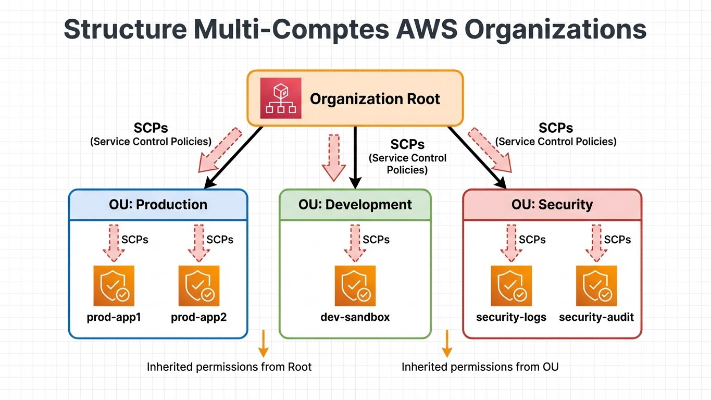
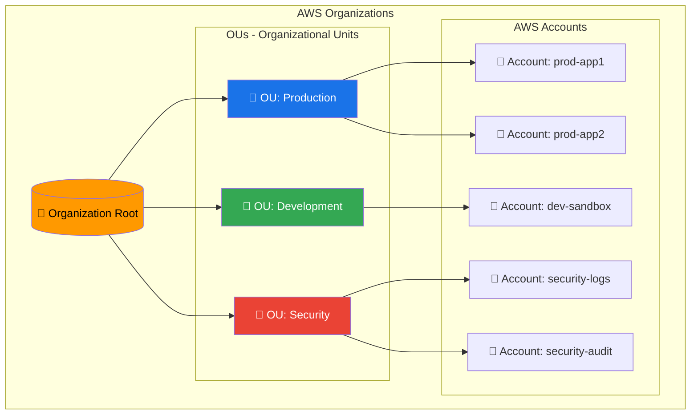
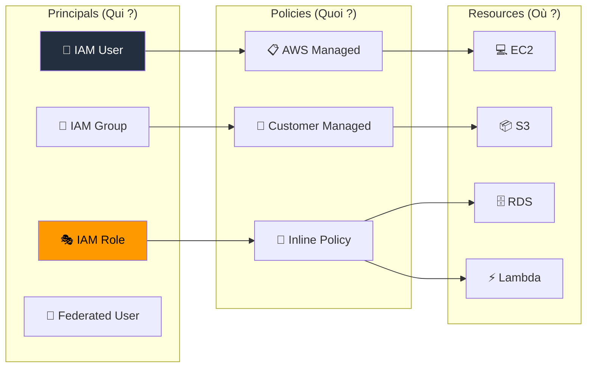
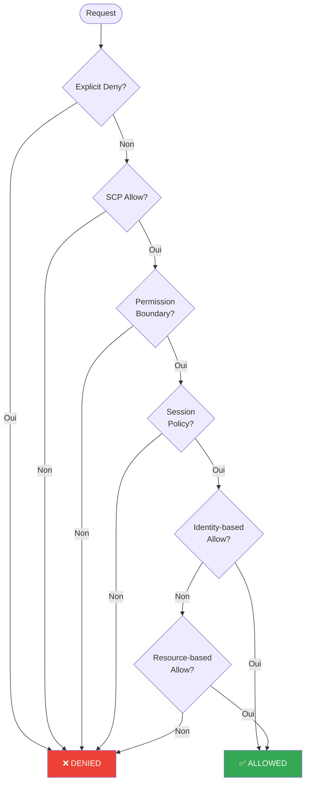
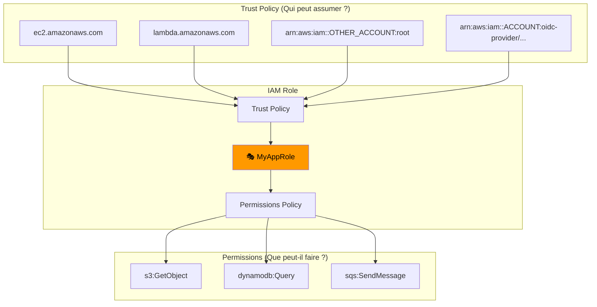
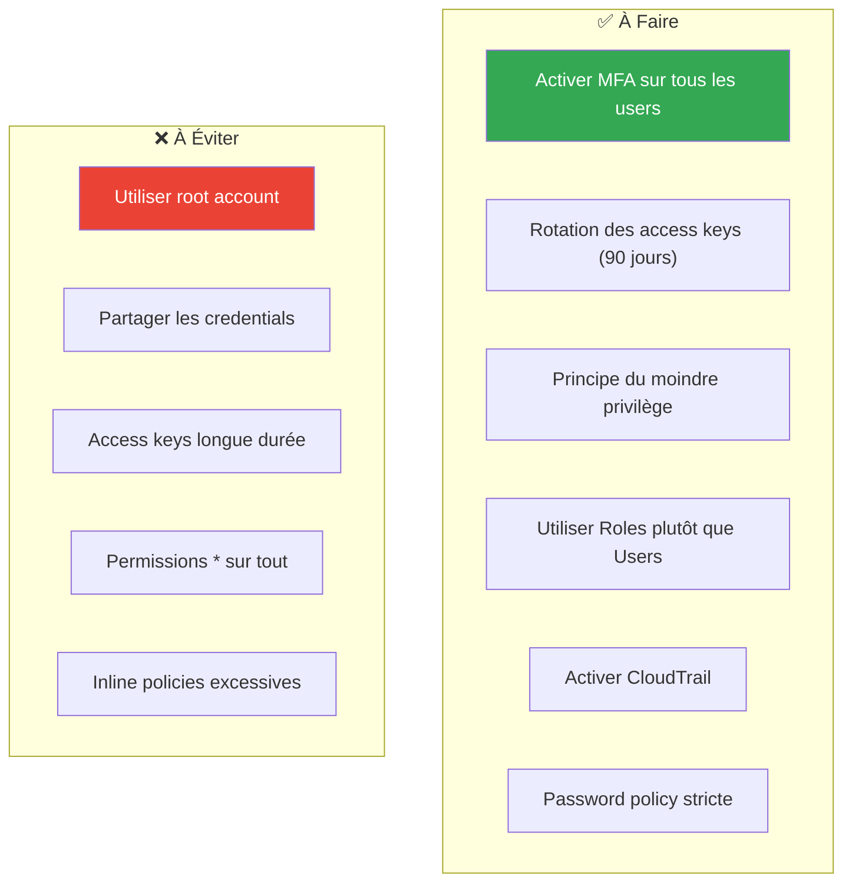

---
tags:
  - formation
  - aws
  - amazon-web-services
  - cloud
  - iam
---

# Module 1 : Console AWS, Comptes & IAM

## Objectifs du Module

À la fin de ce module, vous serez capable de :

- :material-aws: Naviguer efficacement dans la Console AWS
- :fontawesome-solid-sitemap: Comprendre la hiérarchie AWS Organizations
- :fontawesome-solid-user-shield: Configurer IAM (Users, Groups, Roles, Policies)
- :fontawesome-solid-robot: Créer et gérer des Service Roles pour les applications
- :fontawesome-solid-terminal: Utiliser AWS CLI pour l'automatisation

## Prérequis

- Compte AWS avec accès administrateur
- Connaissances Linux de base
- Familiarité avec les concepts d'authentification

---

## 1. Découverte de la Console AWS

### 1.1 Accès à la Console

La Console AWS est l'interface web principale pour gérer vos ressources.

**URL :** [https://console.aws.amazon.com](https://console.aws.amazon.com)

```text
Types de connexion :
├── Root Account (email + password)     → À éviter pour les tâches quotidiennes
├── IAM User (username + password)      → Recommandé pour les admins
├── IAM Identity Center (SSO)           → Recommandé pour les entreprises
└── Federated (SAML/OIDC)              → Intégration AD/Okta/etc.
```

### 1.2 Navigation dans la Console

**Éléments clés :**

| Élément | Description |
|---------|-------------|
| **Region Selector** | En haut à droite, sélectionne la région AWS active |
| **Services Menu** | Accès à tous les services (450+) |
| **CloudShell** | Terminal intégré avec AWS CLI préinstallé |
| **Resource Groups** | Organiser les ressources par tags |
| **AWS Organizations** | Gérer plusieurs comptes AWS |

### 1.3 AWS CloudShell

CloudShell est un terminal basé navigateur avec AWS CLI préconfiguré :

```bash
# CloudShell est déjà authentifié avec vos credentials
aws sts get-caller-identity

# Stockage persistant (1 Go par région)
ls ~/

# Outils préinstallés
aws --version
python3 --version
node --version
git --version
```

---

## 2. Hiérarchie AWS Organizations

### 2.1 Structure Multi-Comptes





### 2.2 Service Control Policies (SCPs)


Les SCPs définissent les permissions maximales pour les comptes d'une OU :

```json
{
    "Version": "2012-10-17",
    "Statement": [
        {
            "Sid": "DenyRootUser",
            "Effect": "Deny",
            "Action": "*",
            "Resource": "*",
            "Condition": {
                "StringLike": {
                    "aws:PrincipalArn": "arn:aws:iam::*:root"
                }
            }
        },
        {
            "Sid": "RequireIMDSv2",
            "Effect": "Deny",
            "Action": "ec2:RunInstances",
            "Resource": "arn:aws:ec2:*:*:instance/*",
            "Condition": {
                "StringNotEquals": {
                    "ec2:MetadataHttpTokens": "required"
                }
            }
        }
    ]
}
```

---

## 3. IAM - Identity and Access Management

### 3.1 Concepts Fondamentaux



### 3.2 Flux de Décision IAM



### 3.3 Créer un IAM User

=== "Console"

    1. IAM → Users → Create user
    2. User name: `admin-john`
    3. Provide user access to AWS Management Console ✓
    4. Attach policies: `AdministratorAccess` (ou custom)
    5. Download credentials

=== "AWS CLI"

    ```bash
    # Créer l'utilisateur
    aws iam create-user --user-name admin-john

    # Créer les credentials console
    aws iam create-login-profile \
        --user-name admin-john \
        --password "TempPassword123!" \
        --password-reset-required

    # Créer les access keys (CLI)
    aws iam create-access-key --user-name admin-john

    # Attacher une policy
    aws iam attach-user-policy \
        --user-name admin-john \
        --policy-arn arn:aws:iam::aws:policy/PowerUserAccess
    ```

### 3.4 IAM Groups

Les groupes simplifient la gestion des permissions :

```bash
# Créer un groupe
aws iam create-group --group-name Developers

# Attacher une policy au groupe
aws iam attach-group-policy \
    --group-name Developers \
    --policy-arn arn:aws:iam::aws:policy/PowerUserAccess

# Ajouter un utilisateur au groupe
aws iam add-user-to-group \
    --group-name Developers \
    --user-name admin-john

# Lister les groupes d'un utilisateur
aws iam list-groups-for-user --user-name admin-john
```

### 3.5 IAM Policies

**Structure d'une policy :**

```json
{
    "Version": "2012-10-17",
    "Statement": [
        {
            "Sid": "AllowEC2ReadOnly",
            "Effect": "Allow",
            "Action": [
                "ec2:Describe*",
                "ec2:Get*"
            ],
            "Resource": "*"
        },
        {
            "Sid": "AllowS3BucketAccess",
            "Effect": "Allow",
            "Action": [
                "s3:GetObject",
                "s3:PutObject",
                "s3:ListBucket"
            ],
            "Resource": [
                "arn:aws:s3:::my-app-bucket",
                "arn:aws:s3:::my-app-bucket/*"
            ]
        },
        {
            "Sid": "DenyDeleteProduction",
            "Effect": "Deny",
            "Action": [
                "ec2:TerminateInstances",
                "rds:DeleteDBInstance"
            ],
            "Resource": "*",
            "Condition": {
                "StringEquals": {
                    "aws:ResourceTag/Environment": "production"
                }
            }
        }
    ]
}
```

**Créer une policy personnalisée :**

```bash
# Créer la policy depuis un fichier JSON
aws iam create-policy \
    --policy-name DeveloperPolicy \
    --policy-document file://developer-policy.json \
    --description "Policy for development team"

# Attacher à un groupe
aws iam attach-group-policy \
    --group-name Developers \
    --policy-arn arn:aws:iam::123456789012:policy/DeveloperPolicy
```

---

## 4. IAM Roles

### 4.1 Pourquoi les Roles ?

Les Roles permettent de déléguer des permissions sans partager de credentials :

| Use Case | Type de Role |
|----------|--------------|
| EC2 accède à S3 | EC2 Instance Profile |
| Lambda accède à DynamoDB | Lambda Execution Role |
| Cross-account access | Cross-Account Role |
| SSO depuis AD | SAML 2.0 Federation Role |
| GitHub Actions déploie sur AWS | OIDC Provider Role |

### 4.2 Architecture des Roles



### 4.3 Créer un Role pour EC2

```bash
# 1. Créer le trust policy
cat > ec2-trust-policy.json << 'EOF'
{
    "Version": "2012-10-17",
    "Statement": [
        {
            "Effect": "Allow",
            "Principal": {
                "Service": "ec2.amazonaws.com"
            },
            "Action": "sts:AssumeRole"
        }
    ]
}
EOF

# 2. Créer le role
aws iam create-role \
    --role-name EC2-S3-ReadOnly \
    --assume-role-policy-document file://ec2-trust-policy.json \
    --description "Allows EC2 to read S3 buckets"

# 3. Attacher les permissions
aws iam attach-role-policy \
    --role-name EC2-S3-ReadOnly \
    --policy-arn arn:aws:iam::aws:policy/AmazonS3ReadOnlyAccess

# 4. Créer l'instance profile (requis pour EC2)
aws iam create-instance-profile \
    --instance-profile-name EC2-S3-ReadOnly-Profile

# 5. Ajouter le role à l'instance profile
aws iam add-role-to-instance-profile \
    --instance-profile-name EC2-S3-ReadOnly-Profile \
    --role-name EC2-S3-ReadOnly
```

### 4.4 Assumer un Role (Cross-Account)

```bash
# Depuis le compte source, assumer un role dans le compte cible
aws sts assume-role \
    --role-arn arn:aws:iam::TARGET_ACCOUNT:role/CrossAccountRole \
    --role-session-name MySession \
    --duration-seconds 3600

# Utiliser les credentials temporaires
export AWS_ACCESS_KEY_ID="ASIA..."
export AWS_SECRET_ACCESS_KEY="..."
export AWS_SESSION_TOKEN="..."

# Vérifier l'identité
aws sts get-caller-identity
```

---

## 5. AWS CLI

### 5.1 Installation

=== "Linux"

    ```bash
    # Installation via curl
    curl "https://awscli.amazonaws.com/awscli-exe-linux-x86_64.zip" -o "awscliv2.zip"
    unzip awscliv2.zip
    sudo ./aws/install

    # Vérification
    aws --version
    ```

=== "macOS"

    ```bash
    # Via Homebrew
    brew install awscli

    # Ou package officiel
    curl "https://awscli.amazonaws.com/AWSCLIV2.pkg" -o "AWSCLIV2.pkg"
    sudo installer -pkg AWSCLIV2.pkg -target /
    ```

=== "Windows"

    ```powershell
    # Via MSI installer
    msiexec.exe /i https://awscli.amazonaws.com/AWSCLIV2.msi

    # Via Chocolatey
    choco install awscli
    ```

### 5.2 Configuration

```bash
# Configuration interactive
aws configure
# AWS Access Key ID: AKIA...
# AWS Secret Access Key: ...
# Default region name: eu-west-1
# Default output format: json

# Profils multiples
aws configure --profile production
aws configure --profile development

# Utiliser un profil
aws s3 ls --profile production
export AWS_PROFILE=production

# Fichiers de configuration
cat ~/.aws/credentials
cat ~/.aws/config
```

**Configuration avancée (~/.aws/config) :**

```ini
[default]
region = eu-west-1
output = json

[profile production]
region = eu-west-1
role_arn = arn:aws:iam::123456789012:role/AdminRole
source_profile = default
mfa_serial = arn:aws:iam::123456789012:mfa/admin-john

[profile development]
region = eu-west-1
sso_start_url = https://mycompany.awsapps.com/start
sso_region = eu-west-1
sso_account_id = 987654321098
sso_role_name = DeveloperAccess
```

### 5.3 Commandes Essentielles

```bash
# Identité actuelle
aws sts get-caller-identity

# Lister les régions
aws ec2 describe-regions --query 'Regions[].RegionName' --output table

# IAM - Users
aws iam list-users
aws iam get-user --user-name admin-john

# IAM - Policies attachées
aws iam list-attached-user-policies --user-name admin-john
aws iam list-attached-group-policies --group-name Developers

# IAM - Roles
aws iam list-roles --query 'Roles[].RoleName'

# Simulation de policy (vérifier les permissions)
aws iam simulate-principal-policy \
    --policy-source-arn arn:aws:iam::123456789012:user/admin-john \
    --action-names s3:GetObject ec2:DescribeInstances \
    --output table
```

---

## 6. Sécurité IAM - Best Practices

### 6.1 Checklist Sécurité



### 6.2 Configurer le MFA

```bash
# Activer MFA pour un user (nécessite la console ou un device)
# 1. Créer le virtual MFA device
aws iam create-virtual-mfa-device \
    --virtual-mfa-device-name admin-john-mfa \
    --outfile /tmp/QRCode.png \
    --bootstrap-method QRCodePNG

# 2. Activer le MFA (après scan du QR code)
aws iam enable-mfa-device \
    --user-name admin-john \
    --serial-number arn:aws:iam::123456789012:mfa/admin-john-mfa \
    --authentication-code1 123456 \
    --authentication-code2 789012
```

### 6.3 Password Policy

```bash
# Configurer une password policy stricte
aws iam update-account-password-policy \
    --minimum-password-length 14 \
    --require-symbols \
    --require-numbers \
    --require-uppercase-characters \
    --require-lowercase-characters \
    --allow-users-to-change-password \
    --max-password-age 90 \
    --password-reuse-prevention 12
```

### 6.4 IAM Access Analyzer

```bash
# Créer un analyzer pour détecter les accès externes
aws accessanalyzer create-analyzer \
    --analyzer-name MyAccountAnalyzer \
    --type ACCOUNT

# Lister les findings (ressources accessibles publiquement)
aws accessanalyzer list-findings \
    --analyzer-arn arn:aws:access-analyzer:eu-west-1:123456789012:analyzer/MyAccountAnalyzer
```

---

## Exercice : À Vous de Jouer

!!! example "Mise en Pratique"
    **Objectif** : Configurer un environnement IAM sécurisé et complet pour une équipe de développement

    **Contexte** : Vous êtes administrateur AWS d'une startup qui démarre son infrastructure cloud. L'équipe se compose de 3 développeurs, 1 ops, et 1 auditeur externe. Vous devez mettre en place une structure IAM sécurisée suivant les best practices AWS.

    **Tâches à réaliser** :

    1. Créer 5 utilisateurs IAM : `dev-alice`, `dev-bob`, `dev-charlie`, `ops-daniel`, `auditor-eve`
    2. Créer 3 groupes avec les permissions appropriées : `Developers`, `Operations`, `Auditors`
    3. Assigner les utilisateurs aux groupes correspondants
    4. Créer une policy personnalisée `DeveloperAccess` donnant accès complet à EC2, Lambda, S3 mais lecture seule sur RDS
    5. Créer un role IAM `EC2-ReadS3` permettant aux instances EC2 d'accéder en lecture à S3
    6. Configurer une policy de mot de passe stricte (14 caractères minimum, rotation 90 jours)
    7. Activer MFA pour tous les utilisateurs administrateurs
    8. Créer un rapport d'audit IAM et identifier les risques potentiels

    **Critères de validation** :

    - [ ] Les 5 utilisateurs sont créés avec accès console
    - [ ] Les groupes ont les bonnes policies attachées
    - [ ] La policy `DeveloperAccess` est fonctionnelle et respecte le principe du moindre privilège
    - [ ] Le role EC2 peut être assumé par les instances et accéder à S3
    - [ ] La password policy est configurée selon les exigences
    - [ ] Le rapport IAM Credential Report est généré et analysé
    - [ ] Aucun utilisateur avec Action:* et Resource:* simultanément
    - [ ] Toutes les access keys ont moins de 90 jours

??? quote "Solution"

    **Étape 1 : Création des utilisateurs**

    ```bash
    # Créer les 5 utilisateurs
    for user in dev-alice dev-bob dev-charlie ops-daniel auditor-eve; do
        aws iam create-user --user-name $user
        aws iam create-login-profile \
            --user-name $user \
            --password "ChangeMe2024!" \
            --password-reset-required
        echo "✅ Utilisateur $user créé"
    done
    ```

    **Étape 2 : Création des groupes et attribution**

    ```bash
    # Créer les groupes
    aws iam create-group --group-name Developers
    aws iam create-group --group-name Operations
    aws iam create-group --group-name Auditors

    # Assigner les utilisateurs
    aws iam add-user-to-group --group-name Developers --user-name dev-alice
    aws iam add-user-to-group --group-name Developers --user-name dev-bob
    aws iam add-user-to-group --group-name Developers --user-name dev-charlie
    aws iam add-user-to-group --group-name Operations --user-name ops-daniel
    aws iam add-user-to-group --group-name Auditors --user-name auditor-eve
    ```

    **Étape 3 : Policy personnalisée pour les développeurs**

    ```bash
    cat > developer-policy.json << 'EOF'
    {
        "Version": "2012-10-17",
        "Statement": [
            {
                "Sid": "FullAccessCompute",
                "Effect": "Allow",
                "Action": [
                    "ec2:*",
                    "lambda:*",
                    "s3:*"
                ],
                "Resource": "*"
            },
            {
                "Sid": "ReadOnlyDatabase",
                "Effect": "Allow",
                "Action": [
                    "rds:Describe*",
                    "rds:List*"
                ],
                "Resource": "*"
            },
            {
                "Sid": "DenyIAMChanges",
                "Effect": "Deny",
                "Action": [
                    "iam:*",
                    "organizations:*"
                ],
                "Resource": "*"
            }
        ]
    }
    EOF

    aws iam create-policy \
        --policy-name DeveloperAccess \
        --policy-document file://developer-policy.json

    # Attacher au groupe Developers
    ACCOUNT_ID=$(aws sts get-caller-identity --query Account --output text)
    aws iam attach-group-policy \
        --group-name Developers \
        --policy-arn arn:aws:iam::${ACCOUNT_ID}:policy/DeveloperAccess
    ```

    **Étape 4 : Role pour EC2 avec accès S3**

    ```bash
    # Trust policy
    cat > ec2-trust-policy.json << 'EOF'
    {
        "Version": "2012-10-17",
        "Statement": [{
            "Effect": "Allow",
            "Principal": {"Service": "ec2.amazonaws.com"},
            "Action": "sts:AssumeRole"
        }]
    }
    EOF

    # Créer le role
    aws iam create-role \
        --role-name EC2-ReadS3 \
        --assume-role-policy-document file://ec2-trust-policy.json

    # Attacher la policy S3 ReadOnly
    aws iam attach-role-policy \
        --role-name EC2-ReadS3 \
        --policy-arn arn:aws:iam::aws:policy/AmazonS3ReadOnlyAccess

    # Créer l'instance profile
    aws iam create-instance-profile --instance-profile-name EC2-ReadS3-Profile
    aws iam add-role-to-instance-profile \
        --instance-profile-name EC2-ReadS3-Profile \
        --role-name EC2-ReadS3
    ```

    **Étape 5 : Configuration password policy**

    ```bash
    aws iam update-account-password-policy \
        --minimum-password-length 14 \
        --require-symbols \
        --require-numbers \
        --require-uppercase-characters \
        --require-lowercase-characters \
        --allow-users-to-change-password \
        --max-password-age 90 \
        --password-reuse-prevention 12 \
        --hard-expiry

    echo "✅ Password policy configurée"
    ```

    **Étape 6 : Policy MFA obligatoire**

    ```bash
    cat > mfa-required-policy.json << 'EOF'
    {
        "Version": "2012-10-17",
        "Statement": [
            {
                "Sid": "AllowViewAccountInfo",
                "Effect": "Allow",
                "Action": [
                    "iam:GetAccountPasswordPolicy",
                    "iam:ListVirtualMFADevices"
                ],
                "Resource": "*"
            },
            {
                "Sid": "AllowManageOwnMFA",
                "Effect": "Allow",
                "Action": [
                    "iam:CreateVirtualMFADevice",
                    "iam:EnableMFADevice",
                    "iam:ResyncMFADevice"
                ],
                "Resource": [
                    "arn:aws:iam::*:mfa/${aws:username}",
                    "arn:aws:iam::*:user/${aws:username}"
                ]
            },
            {
                "Sid": "DenyAllExceptMFAWithoutMFA",
                "Effect": "Deny",
                "NotAction": [
                    "iam:CreateVirtualMFADevice",
                    "iam:EnableMFADevice",
                    "iam:GetUser",
                    "iam:ListMFADevices",
                    "iam:ListVirtualMFADevices",
                    "iam:ResyncMFADevice",
                    "sts:GetSessionToken"
                ],
                "Resource": "*",
                "Condition": {
                    "BoolIfExists": {
                        "aws:MultiFactorAuthPresent": "false"
                    }
                }
            }
        ]
    }
    EOF

    aws iam create-policy \
        --policy-name RequireMFA \
        --policy-document file://mfa-required-policy.json

    # Attacher à tous les groupes
    for group in Developers Operations Auditors; do
        aws iam attach-group-policy \
            --group-name $group \
            --policy-arn arn:aws:iam::${ACCOUNT_ID}:policy/RequireMFA
    done
    ```

    **Étape 7 : Audit de sécurité IAM**

    ```bash
    #!/bin/bash
    # Script d'audit IAM

    echo "=== 🔍 Audit IAM de Sécurité ==="
    echo ""

    # 1. Users sans MFA
    echo "1️⃣ Utilisateurs sans MFA :"
    for user in $(aws iam list-users --query 'Users[].UserName' --output text); do
        mfa=$(aws iam list-mfa-devices --user-name $user --query 'MFADevices' --output text)
        if [ -z "$mfa" ]; then
            echo "   ❌ $user - Aucun MFA configuré"
        else
            echo "   ✅ $user - MFA activé"
        fi
    done

    # 2. Access keys anciennes
    echo ""
    echo "2️⃣ Access keys > 90 jours :"
    for user in $(aws iam list-users --query 'Users[].UserName' --output text); do
        aws iam list-access-keys --user-name $user \
            --query "AccessKeyMetadata[?CreateDate<='$(date -d '90 days ago' --iso-8601)'].[UserName,AccessKeyId,CreateDate]" \
            --output table 2>/dev/null | grep -v "^---" | grep -v "^|"
    done

    # 3. Policies dangereuses
    echo ""
    echo "3️⃣ Policies avec Action:* et Resource:* :"
    for policy_arn in $(aws iam list-policies --scope Local --query 'Policies[].Arn' --output text); do
        version=$(aws iam get-policy --policy-arn $policy_arn --query 'Policy.DefaultVersionId' --output text)
        doc=$(aws iam get-policy-version --policy-arn $policy_arn --version-id $version --query 'PolicyVersion.Document' --output json)

        if echo "$doc" | grep -q '"Action": "\*"' && echo "$doc" | grep -q '"Resource": "\*"'; then
            echo "   ⚠️  $(basename $policy_arn)"
        fi
    done

    # 4. Credential Report
    echo ""
    echo "4️⃣ Génération du IAM Credential Report :"
    aws iam generate-credential-report
    sleep 5
    aws iam get-credential-report --query 'Content' --output text | base64 -d > iam-report.csv
    echo "   ✅ Rapport sauvegardé dans iam-report.csv"

    echo ""
    echo "=== 📊 Résumé de l'audit ==="
    echo "Total utilisateurs : $(aws iam list-users --query 'Users | length(@)')"
    echo "Total groupes : $(aws iam list-groups --query 'Groups | length(@)')"
    echo "Total policies : $(aws iam list-policies --scope Local --query 'Policies | length(@)')"
    ```

    **Vérification finale :**

    ```bash
    # Vérifier tous les critères
    echo "=== ✅ Vérification des critères ==="
    aws iam list-users --query 'Users[].UserName'
    aws iam list-groups --query 'Groups[].GroupName'
    aws iam get-policy --policy-arn arn:aws:iam::${ACCOUNT_ID}:policy/DeveloperAccess
    aws iam get-role --role-name EC2-ReadS3
    aws iam get-account-password-policy
    ```

---

## 8. Résumé

| Concept | Description | Commande clé |
|---------|-------------|--------------|
| **IAM User** | Identité permanente avec credentials | `aws iam create-user` |
| **IAM Group** | Regroupement d'users pour policies communes | `aws iam create-group` |
| **IAM Role** | Identité assumable temporairement | `aws iam create-role` |
| **Policy** | Document JSON définissant les permissions | `aws iam create-policy` |
| **MFA** | Authentification multi-facteurs | `aws iam enable-mfa-device` |
| **Access Keys** | Credentials pour CLI/API | `aws iam create-access-key` |
| **SCP** | Guardrails au niveau Organization | Console Organizations |

---

## Navigation

| Précédent | Suivant |
|-----------|---------|
| [↩️ Introduction](index.md) | [Module 2 : EC2 - Compute →](02-module.md) |

---

## Navigation

| | |
|:---|---:|
| [← Programme](index.md) | [Module 2 : EC2 - Compute dans le Cloud →](02-module.md) |

[Retour au Programme](index.md){ .md-button }
