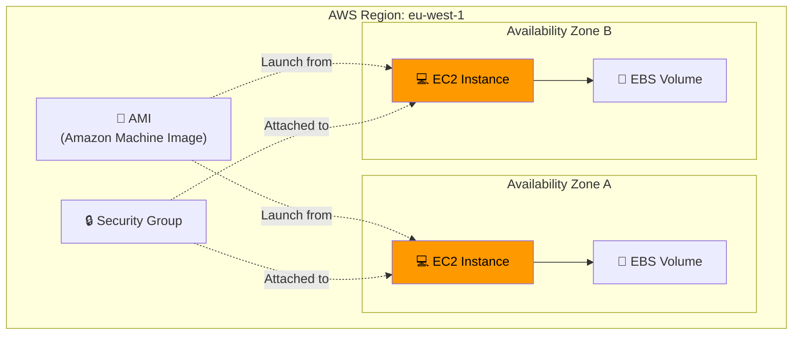
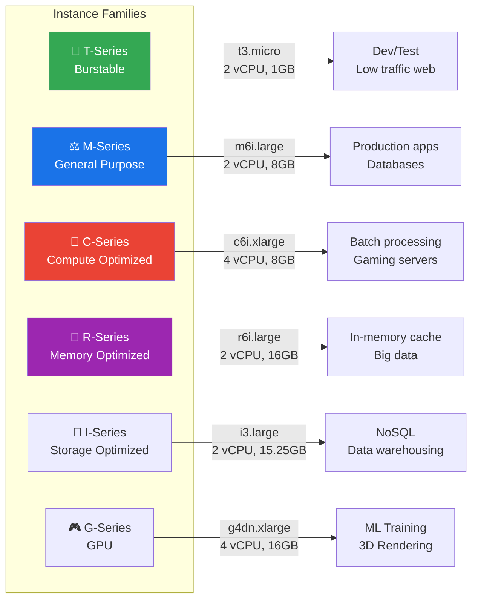
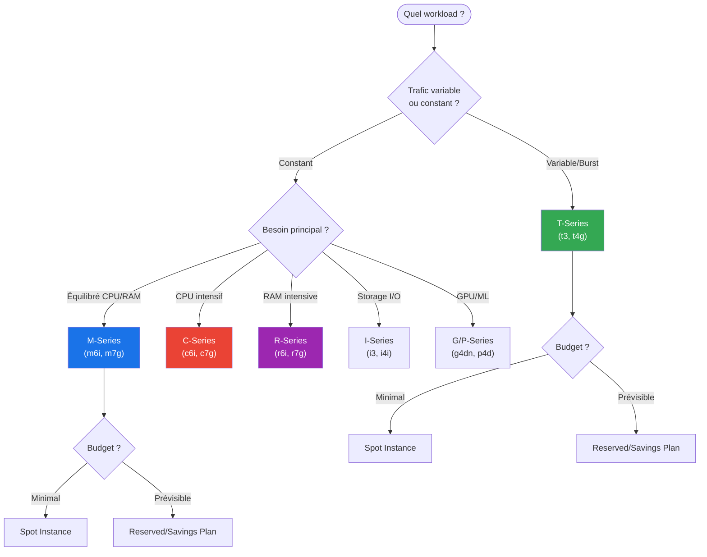
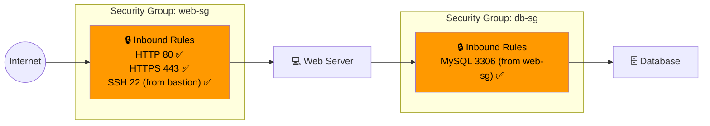
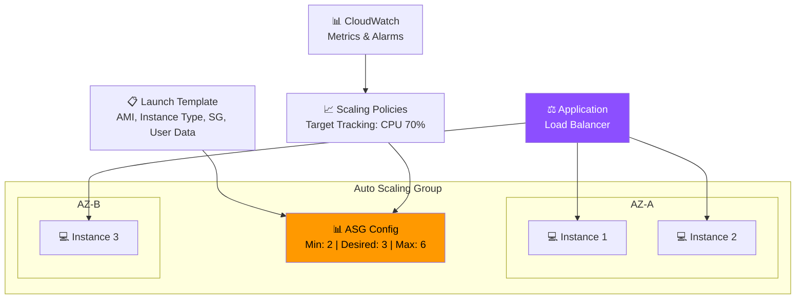
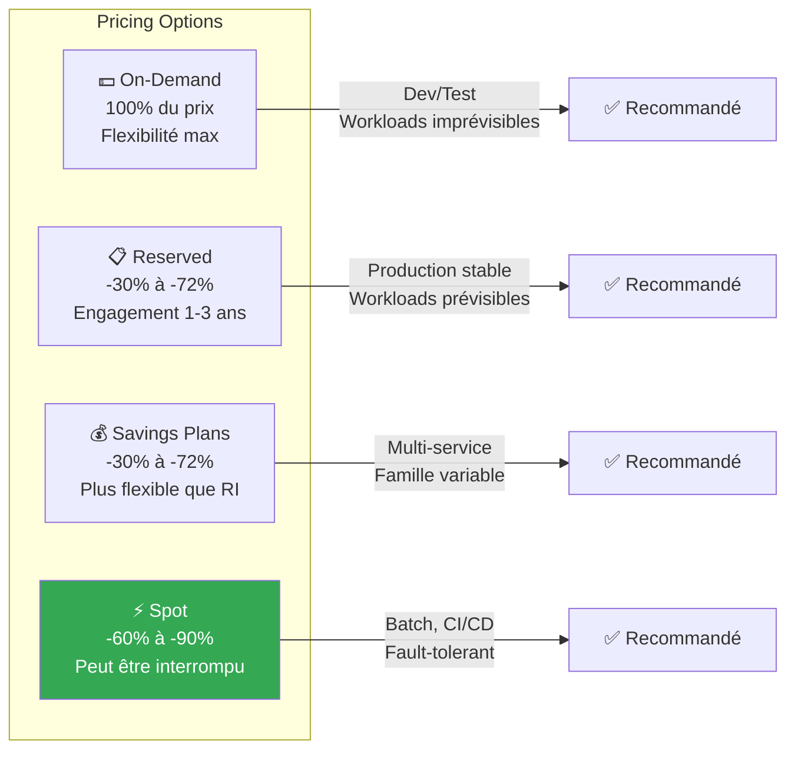

---
tags:
  - formation
  - aws
  - ec2
  - compute
  - cloud
---

# Module 2 : EC2 - Compute dans le Cloud

## Objectifs du Module

À la fin de ce module, vous serez capable de :

- :fontawesome-solid-server: Créer et configurer des instances EC2
- :fontawesome-solid-hard-drive: Gérer les volumes EBS (Elastic Block Store)
- :fontawesome-solid-image: Créer des AMIs personnalisées
- :fontawesome-solid-layer-group: Configurer Auto Scaling Groups
- :fontawesome-solid-money-bill: Optimiser les coûts (Spot, Reserved, Savings Plans)

## Prérequis

- Module 1 complété (IAM, AWS CLI configuré)
- Compréhension des concepts de virtualisation
- Notions de networking (IP, ports, SSH)

---

## 1. Concepts Fondamentaux EC2

### 1.1 Qu'est-ce qu'EC2 ?

**EC2 (Elastic Compute Cloud)** = Machines virtuelles à la demande dans le cloud AWS.



### 1.2 Familles d'Instances



**Nomenclature des instances :**

```text
m6i.2xlarge
│││  │
││└──┼── Generation (6ème génération)
│└───┼── Processor type (i = Intel, a = AMD, g = Graviton)
└────┼── Family (m = General Purpose)
     └── Size (xlarge, 2xlarge, 4xlarge...)
```

### 1.3 Arbre de Décision - Choix d'Instance



---

## 2. Lancer une Instance EC2

### 2.1 Via la Console

1. **EC2 Dashboard** → Launch Instance
2. **Name and Tags** : `web-server-prod`
3. **AMI** : Amazon Linux 2023 (Free tier eligible)
4. **Instance type** : t3.micro
5. **Key pair** : Créer ou sélectionner une clé SSH
6. **Network settings** : VPC, Subnet, Security Group
7. **Storage** : 8 GB gp3 (par défaut)
8. **Advanced details** : User data (optionnel)

### 2.2 Via AWS CLI

```bash
# Lister les AMIs Amazon Linux 2023 récentes
aws ec2 describe-images \
    --owners amazon \
    --filters "Name=name,Values=al2023-ami-2023*-x86_64" \
    --query 'Images | sort_by(@, &CreationDate) | [-1].[ImageId,Name]' \
    --output table

# Créer une key pair
aws ec2 create-key-pair \
    --key-name my-key \
    --query 'KeyMaterial' \
    --output text > my-key.pem

chmod 400 my-key.pem

# Lancer une instance
aws ec2 run-instances \
    --image-id ami-0123456789abcdef0 \
    --instance-type t3.micro \
    --key-name my-key \
    --security-group-ids sg-0123456789abcdef0 \
    --subnet-id subnet-0123456789abcdef0 \
    --tag-specifications 'ResourceType=instance,Tags=[{Key=Name,Value=web-server-prod},{Key=Environment,Value=production}]' \
    --user-data file://startup-script.sh \
    --iam-instance-profile Name=EC2-S3-ReadOnly-Profile

# Vérifier le statut
aws ec2 describe-instances \
    --filters "Name=tag:Name,Values=web-server-prod" \
    --query 'Reservations[].Instances[].[InstanceId,State.Name,PublicIpAddress]' \
    --output table
```

### 2.3 User Data (Startup Script)

```bash
#!/bin/bash
# startup-script.sh - Exécuté au premier boot

# Mise à jour système
dnf update -y

# Installation de packages
dnf install -y httpd php php-mysqlnd

# Démarrage du service
systemctl enable --now httpd

# Page de test
cat > /var/www/html/index.html << 'EOF'
<!DOCTYPE html>
<html>
<head><title>EC2 Web Server</title></head>
<body>
<h1>Hello from EC2!</h1>
<p>Instance ID: $(curl -s http://169.254.169.254/latest/meta-data/instance-id)</p>
<p>Availability Zone: $(curl -s http://169.254.169.254/latest/meta-data/placement/availability-zone)</p>
</body>
</html>
EOF

# Signal de completion (pour CloudFormation/ASG)
/opt/aws/bin/cfn-signal -e $? --stack ${AWS::StackName} --resource WebServer --region ${AWS::Region}
```

---

## 3. Instance Metadata Service (IMDS)

### 3.1 IMDSv2 (Recommandé)

```bash
# Obtenir un token de session (valide 6h max)
TOKEN=$(curl -X PUT "http://169.254.169.254/latest/api/token" \
    -H "X-aws-ec2-metadata-token-ttl-seconds: 21600")

# Utiliser le token pour les requêtes
curl -H "X-aws-ec2-metadata-token: $TOKEN" \
    http://169.254.169.254/latest/meta-data/

# Informations utiles
curl -H "X-aws-ec2-metadata-token: $TOKEN" \
    http://169.254.169.254/latest/meta-data/instance-id

curl -H "X-aws-ec2-metadata-token: $TOKEN" \
    http://169.254.169.254/latest/meta-data/local-ipv4

curl -H "X-aws-ec2-metadata-token: $TOKEN" \
    http://169.254.169.254/latest/meta-data/public-ipv4

curl -H "X-aws-ec2-metadata-token: $TOKEN" \
    http://169.254.169.254/latest/meta-data/iam/security-credentials/

# Récupérer les credentials du role attaché
curl -H "X-aws-ec2-metadata-token: $TOKEN" \
    http://169.254.169.254/latest/meta-data/iam/security-credentials/EC2-S3-ReadOnly
```

### 3.2 Forcer IMDSv2

```bash
# Lors de la création
aws ec2 run-instances \
    --metadata-options "HttpTokens=required,HttpPutResponseHopLimit=1,HttpEndpoint=enabled" \
    ...

# Sur une instance existante
aws ec2 modify-instance-metadata-options \
    --instance-id i-0123456789abcdef0 \
    --http-tokens required \
    --http-put-response-hop-limit 1 \
    --http-endpoint enabled
```

---

## 4. Security Groups

### 4.1 Concept

Les Security Groups sont des **firewalls stateful** au niveau de l'instance :



### 4.2 Création et Configuration

```bash
# Créer un Security Group
aws ec2 create-security-group \
    --group-name web-server-sg \
    --description "Security group for web servers" \
    --vpc-id vpc-0123456789abcdef0

# Autoriser HTTP depuis Internet
aws ec2 authorize-security-group-ingress \
    --group-id sg-0123456789abcdef0 \
    --protocol tcp \
    --port 80 \
    --cidr 0.0.0.0/0

# Autoriser HTTPS depuis Internet
aws ec2 authorize-security-group-ingress \
    --group-id sg-0123456789abcdef0 \
    --protocol tcp \
    --port 443 \
    --cidr 0.0.0.0/0

# Autoriser SSH depuis un Security Group spécifique (bastion)
aws ec2 authorize-security-group-ingress \
    --group-id sg-0123456789abcdef0 \
    --protocol tcp \
    --port 22 \
    --source-group sg-bastion123456789

# Lister les règles
aws ec2 describe-security-groups \
    --group-ids sg-0123456789abcdef0 \
    --query 'SecurityGroups[].IpPermissions'
```

---

## 5. EBS - Elastic Block Store

### 5.1 Types de Volumes

| Type | Use Case | IOPS | Throughput | Prix |
|------|----------|------|------------|------|
| **gp3** | Usage général, boot volumes | 3,000-16,000 | 125-1,000 MB/s | $0.08/GB |
| **gp2** | Legacy, burstable | 100-16,000 | 128-250 MB/s | $0.10/GB |
| **io2** | Bases de données critiques | 64,000 | 1,000 MB/s | $0.125/GB |
| **st1** | Big data, logs | 500 | 500 MB/s | $0.045/GB |
| **sc1** | Archives, cold data | 250 | 250 MB/s | $0.025/GB |

### 5.2 Gestion des Volumes

```bash
# Créer un volume
aws ec2 create-volume \
    --availability-zone eu-west-1a \
    --size 100 \
    --volume-type gp3 \
    --iops 4000 \
    --throughput 250 \
    --tag-specifications 'ResourceType=volume,Tags=[{Key=Name,Value=data-volume}]'

# Attacher à une instance
aws ec2 attach-volume \
    --volume-id vol-0123456789abcdef0 \
    --instance-id i-0123456789abcdef0 \
    --device /dev/xvdf

# Sur l'instance Linux : formater et monter
sudo mkfs -t xfs /dev/xvdf
sudo mkdir /data
sudo mount /dev/xvdf /data

# Ajouter au fstab pour persistance
echo "/dev/xvdf /data xfs defaults,nofail 0 2" | sudo tee -a /etc/fstab

# Étendre un volume (online resize depuis 2019)
aws ec2 modify-volume \
    --volume-id vol-0123456789abcdef0 \
    --size 200

# Sur l'instance : étendre le filesystem
sudo xfs_growfs /data  # Pour XFS
# sudo resize2fs /dev/xvdf  # Pour ext4
```

### 5.3 Snapshots

```bash
# Créer un snapshot
aws ec2 create-snapshot \
    --volume-id vol-0123456789abcdef0 \
    --description "Daily backup $(date +%Y-%m-%d)" \
    --tag-specifications 'ResourceType=snapshot,Tags=[{Key=Name,Value=daily-backup}]'

# Copier un snapshot vers une autre région (DR)
aws ec2 copy-snapshot \
    --source-region eu-west-1 \
    --source-snapshot-id snap-0123456789abcdef0 \
    --destination-region us-east-1 \
    --description "DR copy"

# Créer un volume depuis un snapshot
aws ec2 create-volume \
    --snapshot-id snap-0123456789abcdef0 \
    --availability-zone eu-west-1b \
    --volume-type gp3

# Lifecycle policy automatique (via DLM)
aws dlm create-lifecycle-policy \
    --description "Daily EBS snapshots, retain 7 days" \
    --state ENABLED \
    --execution-role-arn arn:aws:iam::123456789012:role/AWSDataLifecycleManagerDefaultRole \
    --policy-details file://dlm-policy.json
```

---

## 6. AMIs - Amazon Machine Images

### 6.1 Créer une AMI Custom

```bash
# Depuis une instance existante (avec arrêt)
aws ec2 create-image \
    --instance-id i-0123456789abcdef0 \
    --name "web-server-v1.0-$(date +%Y%m%d)" \
    --description "Web server with Apache, PHP, configured monitoring" \
    --no-reboot  # Ne pas arrêter l'instance (risque de données corrompues)

# Attendre que l'AMI soit disponible
aws ec2 describe-images \
    --image-ids ami-0123456789abcdef0 \
    --query 'Images[].State'

# Partager avec un autre compte
aws ec2 modify-image-attribute \
    --image-id ami-0123456789abcdef0 \
    --launch-permission "Add=[{UserId=111111111111}]"

# Copier vers une autre région
aws ec2 copy-image \
    --source-region eu-west-1 \
    --source-image-id ami-0123456789abcdef0 \
    --region us-east-1 \
    --name "web-server-v1.0-us-copy"
```

### 6.2 AMI avec EC2 Image Builder

```bash
# Infrastructure configuration
aws imagebuilder create-infrastructure-configuration \
    --name "web-server-infra" \
    --instance-profile-name EC2ImageBuilderRole \
    --instance-types t3.medium \
    --subnet-id subnet-0123456789abcdef0 \
    --security-group-ids sg-0123456789abcdef0

# Distribution configuration
aws imagebuilder create-distribution-configuration \
    --name "web-server-distribution" \
    --distributions '[
        {
            "region": "eu-west-1",
            "amiDistributionConfiguration": {
                "name": "web-server-{{imagebuilder:buildDate}}"
            }
        }
    ]'

# Image recipe (composants à installer)
# Voir console pour création visuelle des composants
```

---

## 7. Auto Scaling

### 7.1 Architecture Auto Scaling



### 7.2 Créer un Launch Template

```bash
# Launch Template avec toute la configuration
aws ec2 create-launch-template \
    --launch-template-name web-server-template \
    --version-description "Initial version" \
    --launch-template-data '{
        "ImageId": "ami-0123456789abcdef0",
        "InstanceType": "t3.micro",
        "KeyName": "my-key",
        "SecurityGroupIds": ["sg-0123456789abcdef0"],
        "IamInstanceProfile": {
            "Name": "EC2-S3-ReadOnly-Profile"
        },
        "BlockDeviceMappings": [
            {
                "DeviceName": "/dev/xvda",
                "Ebs": {
                    "VolumeSize": 20,
                    "VolumeType": "gp3",
                    "DeleteOnTermination": true
                }
            }
        ],
        "MetadataOptions": {
            "HttpTokens": "required",
            "HttpPutResponseHopLimit": 1
        },
        "UserData": "'$(base64 -w0 startup-script.sh)'"
    }'

# Créer une nouvelle version
aws ec2 create-launch-template-version \
    --launch-template-name web-server-template \
    --source-version 1 \
    --launch-template-data '{"InstanceType": "t3.small"}'
```

### 7.3 Créer un Auto Scaling Group

```bash
# Créer l'ASG
aws autoscaling create-auto-scaling-group \
    --auto-scaling-group-name web-asg \
    --launch-template LaunchTemplateName=web-server-template,Version='$Latest' \
    --min-size 2 \
    --max-size 6 \
    --desired-capacity 3 \
    --vpc-zone-identifier "subnet-aaaaa,subnet-bbbbb" \
    --target-group-arns arn:aws:elasticloadbalancing:eu-west-1:123456789012:targetgroup/web-tg/1234567890123456 \
    --health-check-type ELB \
    --health-check-grace-period 300 \
    --tags '[
        {"Key": "Name", "Value": "web-server", "PropagateAtLaunch": true},
        {"Key": "Environment", "Value": "production", "PropagateAtLaunch": true}
    ]'

# Target Tracking Scaling Policy (CPU 70%)
aws autoscaling put-scaling-policy \
    --auto-scaling-group-name web-asg \
    --policy-name cpu-target-tracking \
    --policy-type TargetTrackingScaling \
    --target-tracking-configuration '{
        "PredefinedMetricSpecification": {
            "PredefinedMetricType": "ASGAverageCPUUtilization"
        },
        "TargetValue": 70.0,
        "ScaleOutCooldown": 300,
        "ScaleInCooldown": 300
    }'

# Step Scaling Policy (exemple)
aws autoscaling put-scaling-policy \
    --auto-scaling-group-name web-asg \
    --policy-name scale-out-high-cpu \
    --policy-type StepScaling \
    --adjustment-type ChangeInCapacity \
    --step-adjustments '[
        {"MetricIntervalLowerBound": 0, "MetricIntervalUpperBound": 20, "ScalingAdjustment": 1},
        {"MetricIntervalLowerBound": 20, "ScalingAdjustment": 2}
    ]'
```

### 7.4 Scheduled Scaling

```bash
# Scale up tous les matins à 8h (UTC)
aws autoscaling put-scheduled-update-group-action \
    --auto-scaling-group-name web-asg \
    --scheduled-action-name morning-scale-up \
    --recurrence "0 8 * * MON-FRI" \
    --min-size 4 \
    --max-size 10 \
    --desired-capacity 6

# Scale down le soir à 20h
aws autoscaling put-scheduled-update-group-action \
    --auto-scaling-group-name web-asg \
    --scheduled-action-name evening-scale-down \
    --recurrence "0 20 * * MON-FRI" \
    --min-size 2 \
    --max-size 6 \
    --desired-capacity 2
```

---

## 8. Optimisation des Coûts

### 8.1 Comparaison des Options



### 8.2 Spot Instances

```bash
# Lancer une Spot Instance
aws ec2 run-instances \
    --image-id ami-0123456789abcdef0 \
    --instance-type c5.xlarge \
    --instance-market-options 'MarketType=spot,SpotOptions={SpotInstanceType=persistent,InstanceInterruptionBehavior=stop}' \
    --count 1

# Spot Fleet (multiple instances)
aws ec2 request-spot-fleet \
    --spot-fleet-request-config '{
        "IamFleetRole": "arn:aws:iam::123456789012:role/aws-ec2-spot-fleet-role",
        "TargetCapacity": 10,
        "SpotPrice": "0.05",
        "AllocationStrategy": "lowestPrice",
        "LaunchSpecifications": [
            {
                "ImageId": "ami-0123456789abcdef0",
                "InstanceType": "c5.large",
                "SubnetId": "subnet-aaaaa"
            },
            {
                "ImageId": "ami-0123456789abcdef0",
                "InstanceType": "c5.xlarge",
                "SubnetId": "subnet-bbbbb"
            }
        ]
    }'

# Voir les prix Spot actuels
aws ec2 describe-spot-price-history \
    --instance-types c5.large c5.xlarge \
    --product-descriptions "Linux/UNIX" \
    --start-time $(date -u +%Y-%m-%dT%H:%M:%SZ) \
    --output table
```

### 8.3 Savings Plans

```bash
# Lister les recommandations
aws savingsplans describe-savings-plans-offering-rates \
    --savings-plan-offering-ids sp-1234567890abcdef0

# Voir les Savings Plans actifs
aws savingsplans describe-savings-plans

# L'achat se fait via la console ou AWS Cost Explorer
```

---

## 9. Exercices Pratiques

### Exercice 1 : Déploiement Web Server

!!! example "Objectif"
    Déployer un serveur web Apache avec une page personnalisée.

**Tâches :**

1. Lancer une instance t3.micro avec Amazon Linux 2023
2. Configurer un Security Group (HTTP 80, SSH 22)
3. Installer Apache via User Data
4. Attacher un volume EBS de 20 GB pour les logs
5. Créer une AMI de l'instance configurée

??? quote "Solution"

    ```bash
    # 1. Créer le Security Group
    SG_ID=$(aws ec2 create-security-group \
        --group-name web-server-sg \
        --description "Web server security group" \
        --vpc-id vpc-0123456789abcdef0 \
        --query 'GroupId' --output text)

    aws ec2 authorize-security-group-ingress \
        --group-id $SG_ID \
        --protocol tcp --port 80 --cidr 0.0.0.0/0

    aws ec2 authorize-security-group-ingress \
        --group-id $SG_ID \
        --protocol tcp --port 22 --cidr $(curl -s ifconfig.me)/32

    # 2. User Data script
    cat > userdata.sh << 'EOF'
    #!/bin/bash
    dnf update -y
    dnf install -y httpd
    systemctl enable --now httpd

    # Page personnalisée
    INSTANCE_ID=$(curl -s http://169.254.169.254/latest/meta-data/instance-id)
    AZ=$(curl -s http://169.254.169.254/latest/meta-data/placement/availability-zone)

    cat > /var/www/html/index.html << HTMLEOF
    <!DOCTYPE html>
    <html>
    <head><title>AWS EC2 Web Server</title></head>
    <body>
        <h1>Hello from EC2!</h1>
        <p>Instance ID: $INSTANCE_ID</p>
        <p>Availability Zone: $AZ</p>
        <p>Deployed: $(date)</p>
    </body>
    </html>
    HTMLEOF

    # Monter le volume pour les logs
    while [ ! -e /dev/xvdf ]; do sleep 1; done
    mkfs -t xfs /dev/xvdf
    mkdir /var/log/httpd-archive
    mount /dev/xvdf /var/log/httpd-archive
    echo "/dev/xvdf /var/log/httpd-archive xfs defaults,nofail 0 2" >> /etc/fstab
    EOF

    # 3. Récupérer la dernière AMI Amazon Linux 2023
    AMI_ID=$(aws ec2 describe-images \
        --owners amazon \
        --filters "Name=name,Values=al2023-ami-2023*-x86_64" \
        --query 'Images | sort_by(@, &CreationDate) | [-1].ImageId' \
        --output text)

    # 4. Lancer l'instance
    INSTANCE_ID=$(aws ec2 run-instances \
        --image-id $AMI_ID \
        --instance-type t3.micro \
        --key-name my-key \
        --security-group-ids $SG_ID \
        --subnet-id subnet-0123456789abcdef0 \
        --user-data file://userdata.sh \
        --tag-specifications 'ResourceType=instance,Tags=[{Key=Name,Value=web-server-demo}]' \
        --query 'Instances[0].InstanceId' --output text)

    echo "Instance ID: $INSTANCE_ID"

    # 5. Créer et attacher le volume EBS
    VOLUME_ID=$(aws ec2 create-volume \
        --availability-zone $(aws ec2 describe-instances --instance-ids $INSTANCE_ID --query 'Reservations[0].Instances[0].Placement.AvailabilityZone' --output text) \
        --size 20 \
        --volume-type gp3 \
        --tag-specifications 'ResourceType=volume,Tags=[{Key=Name,Value=web-logs}]' \
        --query 'VolumeId' --output text)

    # Attendre que l'instance soit running
    aws ec2 wait instance-running --instance-ids $INSTANCE_ID

    aws ec2 attach-volume \
        --volume-id $VOLUME_ID \
        --instance-id $INSTANCE_ID \
        --device /dev/xvdf

    # 6. Récupérer l'IP publique
    PUBLIC_IP=$(aws ec2 describe-instances \
        --instance-ids $INSTANCE_ID \
        --query 'Reservations[0].Instances[0].PublicIpAddress' --output text)

    echo "Web server available at: http://$PUBLIC_IP"

    # 7. Créer l'AMI (après quelques minutes pour que tout soit configuré)
    sleep 120
    aws ec2 create-image \
        --instance-id $INSTANCE_ID \
        --name "web-server-golden-$(date +%Y%m%d)" \
        --description "Golden AMI with Apache configured"
    ```

### Exercice 2 : Auto Scaling avec Load Balancer

!!! example "Objectif"
    Configurer un Auto Scaling Group derrière un Application Load Balancer.

**Tâches :**

1. Créer un Launch Template basé sur votre AMI
2. Créer un Application Load Balancer
3. Créer un Auto Scaling Group (min: 2, max: 4)
4. Configurer une Target Tracking Policy sur CPU 70%
5. Tester le scaling avec stress

??? quote "Solution"

    ```bash
    # Variables
    VPC_ID="vpc-0123456789abcdef0"
    SUBNET_A="subnet-aaaaa"
    SUBNET_B="subnet-bbbbb"
    AMI_ID="ami-golden123"  # Votre AMI du TP1

    # 1. Launch Template
    aws ec2 create-launch-template \
        --launch-template-name web-lt \
        --launch-template-data '{
            "ImageId": "'$AMI_ID'",
            "InstanceType": "t3.micro",
            "KeyName": "my-key",
            "SecurityGroupIds": ["'$SG_ID'"],
            "MetadataOptions": {"HttpTokens": "required"}
        }'

    # 2. ALB Security Group
    ALB_SG=$(aws ec2 create-security-group \
        --group-name alb-sg \
        --description "ALB security group" \
        --vpc-id $VPC_ID \
        --query 'GroupId' --output text)

    aws ec2 authorize-security-group-ingress \
        --group-id $ALB_SG \
        --protocol tcp --port 80 --cidr 0.0.0.0/0

    # 3. Créer l'ALB
    ALB_ARN=$(aws elbv2 create-load-balancer \
        --name web-alb \
        --subnets $SUBNET_A $SUBNET_B \
        --security-groups $ALB_SG \
        --scheme internet-facing \
        --type application \
        --query 'LoadBalancers[0].LoadBalancerArn' --output text)

    # 4. Target Group
    TG_ARN=$(aws elbv2 create-target-group \
        --name web-tg \
        --protocol HTTP \
        --port 80 \
        --vpc-id $VPC_ID \
        --health-check-path "/" \
        --health-check-interval-seconds 30 \
        --healthy-threshold-count 2 \
        --query 'TargetGroups[0].TargetGroupArn' --output text)

    # 5. Listener
    aws elbv2 create-listener \
        --load-balancer-arn $ALB_ARN \
        --protocol HTTP \
        --port 80 \
        --default-actions Type=forward,TargetGroupArn=$TG_ARN

    # 6. Auto Scaling Group
    aws autoscaling create-auto-scaling-group \
        --auto-scaling-group-name web-asg \
        --launch-template LaunchTemplateName=web-lt,Version='$Latest' \
        --min-size 2 \
        --max-size 4 \
        --desired-capacity 2 \
        --vpc-zone-identifier "$SUBNET_A,$SUBNET_B" \
        --target-group-arns $TG_ARN \
        --health-check-type ELB \
        --health-check-grace-period 300

    # 7. Scaling Policy
    aws autoscaling put-scaling-policy \
        --auto-scaling-group-name web-asg \
        --policy-name cpu-tracking \
        --policy-type TargetTrackingScaling \
        --target-tracking-configuration '{
            "PredefinedMetricSpecification": {
                "PredefinedMetricType": "ASGAverageCPUUtilization"
            },
            "TargetValue": 70.0
        }'

    # 8. Test de charge (sur une instance)
    # SSH sur une instance et exécuter:
    # sudo amazon-linux-extras install epel -y
    # sudo yum install stress -y
    # stress --cpu 4 --timeout 300

    # Observer le scaling
    watch -n 10 "aws autoscaling describe-auto-scaling-groups \
        --auto-scaling-group-names web-asg \
        --query 'AutoScalingGroups[0].[MinSize,DesiredCapacity,MaxSize,Instances[].InstanceId]'"
    ```

### Exercice 3 : Optimisation des Coûts

!!! example "Objectif"
    Analyser et optimiser les coûts EC2 d'un environnement.

**Scénario :**
Vous avez :
- 10 instances `m5.xlarge` en production (24/7)
- 5 instances `c5.large` pour batch jobs (8h/jour, weekdays)
- 20 instances `t3.medium` pour dev/test (10h/jour)

**Calculer les économies potentielles avec Spot et Savings Plans.**

??? quote "Solution"

    ```text
    === Analyse des coûts actuels (On-Demand, eu-west-1) ===

    Production (m5.xlarge) : 10 × $0.192/h × 730h = $1,401.60/mois
    Batch (c5.large)       : 5 × $0.085/h × 176h = $74.80/mois
    Dev/Test (t3.medium)   : 20 × $0.0416/h × 220h = $183.04/mois

    TOTAL On-Demand: $1,659.44/mois

    === Optimisation proposée ===

    1. Production → Compute Savings Plan (3 ans, All Upfront)
       Réduction: ~60%
       Nouveau coût: $1,401.60 × 0.40 = $560.64/mois

    2. Batch → Spot Instances (c5.large ~$0.025/h)
       Réduction: ~70%
       Nouveau coût: 5 × $0.025 × 176h = $22.00/mois

    3. Dev/Test → Spot + arrêt automatique
       Réduction: ~80% (Spot + pas de gaspillage)
       Nouveau coût: 20 × $0.012 × 150h = $36.00/mois

    === Résumé ===

    Avant: $1,659.44/mois
    Après: $618.64/mois

    ÉCONOMIES: $1,040.80/mois (63%)
              $12,489.60/an

    === Actions à implémenter ===

    1. Acheter Compute Savings Plan 3 ans ($20,182 upfront)
       → Amortissement: 16 mois

    2. Migrer batch vers Spot Fleet avec diversification
       - c5.large, c5a.large, c5n.large
       - Interruption handler dans le code

    3. Script d'arrêt automatique dev/test
       - Lambda + CloudWatch Events
       - Arrêt 19h, démarrage 9h
    ```

---

## 10. Résumé

| Concept | Description | Commande clé |
|---------|-------------|--------------|
| **Instance** | VM dans le cloud | `aws ec2 run-instances` |
| **AMI** | Image machine | `aws ec2 create-image` |
| **EBS** | Stockage bloc persistant | `aws ec2 create-volume` |
| **Security Group** | Firewall stateful | `aws ec2 create-security-group` |
| **Launch Template** | Configuration réutilisable | `aws ec2 create-launch-template` |
| **Auto Scaling** | Scaling automatique | `aws autoscaling create-auto-scaling-group` |
| **Spot** | Instances à prix réduit | `--instance-market-options` |

---

## Navigation

| Précédent | Suivant |
|-----------|---------|
| [← Module 1 : Console & IAM](01-module.md) | [Module 3 : VPC & Networking →](03-module.md) |
