---
tags:
  - formation
  - aws
  - ec2
  - compute
  - cloud
---

# Module 2 : EC2 - Compute dans le Cloud

## Objectifs du Module

À la fin de ce module, vous serez capable de :

- :fontawesome-solid-server: Créer et configurer des instances EC2
- :fontawesome-solid-hard-drive: Gérer les volumes EBS (Elastic Block Store)
- :fontawesome-solid-image: Créer des AMIs personnalisées
- :fontawesome-solid-layer-group: Configurer Auto Scaling Groups
- :fontawesome-solid-money-bill: Optimiser les coûts (Spot, Reserved, Savings Plans)

## Prérequis

- Module 1 complété (IAM, AWS CLI configuré)
- Compréhension des concepts de virtualisation
- Notions de networking (IP, ports, SSH)

---

## 1. Concepts Fondamentaux EC2

### 1.1 Qu'est-ce qu'EC2 ?

**EC2 (Elastic Compute Cloud)** = Machines virtuelles à la demande dans le cloud AWS.

```mermaid
graph TD
    subgraph "AWS Region: eu-west-1"
        subgraph "Availability Zone A"
            EC2_1["💻 EC2 Instance"]
            EBS_1["💾 EBS Volume"]
            EC2_1 --> EBS_1
        end

        subgraph "Availability Zone B"
            EC2_2["💻 EC2 Instance"]
            EBS_2["💾 EBS Volume"]
            EC2_2 --> EBS_2
        end

        AMI["📀 AMI<br/>(Amazon Machine Image)"]
        SG["🔒 Security Group"]

        AMI -.->|Launch from| EC2_1
        AMI -.->|Launch from| EC2_2
        SG -.->|Attached to| EC2_1
        SG -.->|Attached to| EC2_2
    end

    style EC2_1 fill:#ff9900,color:#000
    style EC2_2 fill:#ff9900,color:#000
```




### 1.2 Familles d'Instances

```mermaid
graph LR
    subgraph "Instance Families"
        T["🔋 T-Series<br/>Burstable"]
        M["⚖️ M-Series<br/>General Purpose"]
        C["🚀 C-Series<br/>Compute Optimized"]
        R["🧠 R-Series<br/>Memory Optimized"]
        I["💾 I-Series<br/>Storage Optimized"]
        G["🎮 G-Series<br/>GPU"]
    end

    T -->|"t3.micro<br/>2 vCPU, 1GB"| USE_T["Dev/Test<br/>Low traffic web"]
    M -->|"m6i.large<br/>2 vCPU, 8GB"| USE_M["Production apps<br/>Databases"]
    C -->|"c6i.xlarge<br/>4 vCPU, 8GB"| USE_C["Batch processing<br/>Gaming servers"]
    R -->|"r6i.large<br/>2 vCPU, 16GB"| USE_R["In-memory cache<br/>Big data"]
    I -->|"i3.large<br/>2 vCPU, 15.25GB"| USE_I["NoSQL<br/>Data warehousing"]
    G -->|"g4dn.xlarge<br/>4 vCPU, 16GB"| USE_G["ML Training<br/>3D Rendering"]

    style T fill:#34a853,color:#fff
    style M fill:#1a73e8,color:#fff
    style C fill:#ea4335,color:#fff
    style R fill:#9c27b0,color:#fff
```




**Nomenclature des instances :**

```text
m6i.2xlarge
│││  │
││└──┼── Generation (6ème génération)
│└───┼── Processor type (i = Intel, a = AMD, g = Graviton)
└────┼── Family (m = General Purpose)
     └── Size (xlarge, 2xlarge, 4xlarge...)
```

### 1.3 Arbre de Décision - Choix d'Instance


---

## 2. Lancer une Instance EC2

### 2.1 Via la Console

1. **EC2 Dashboard** → Launch Instance
2. **Name and Tags** : `web-server-prod`
3. **AMI** : Amazon Linux 2023 (Free tier eligible)
4. **Instance type** : t3.micro
5. **Key pair** : Créer ou sélectionner une clé SSH
6. **Network settings** : VPC, Subnet, Security Group
7. **Storage** : 8 GB gp3 (par défaut)
8. **Advanced details** : User data (optionnel)

### 2.2 Via AWS CLI

```bash
# Lister les AMIs Amazon Linux 2023 récentes
aws ec2 describe-images \
    --owners amazon \
    --filters "Name=name,Values=al2023-ami-2023*-x86_64" \
    --query 'Images | sort_by(@, &CreationDate) | [-1].[ImageId,Name]' \
    --output table

# Créer une key pair
aws ec2 create-key-pair \
    --key-name my-key \
    --query 'KeyMaterial' \
    --output text > my-key.pem

chmod 400 my-key.pem

# Lancer une instance
aws ec2 run-instances \
    --image-id ami-0123456789abcdef0 \
    --instance-type t3.micro \
    --key-name my-key \
    --security-group-ids sg-0123456789abcdef0 \
    --subnet-id subnet-0123456789abcdef0 \
    --tag-specifications 'ResourceType=instance,Tags=[{Key=Name,Value=web-server-prod},{Key=Environment,Value=production}]' \
    --user-data file://startup-script.sh \
    --iam-instance-profile Name=EC2-S3-ReadOnly-Profile

# Vérifier le statut
aws ec2 describe-instances \
    --filters "Name=tag:Name,Values=web-server-prod" \
    --query 'Reservations[].Instances[].[InstanceId,State.Name,PublicIpAddress]' \
    --output table
```

### 2.3 User Data (Startup Script)

```bash
#!/bin/bash
# startup-script.sh - Exécuté au premier boot

# Mise à jour système
dnf update -y

# Installation de packages
dnf install -y httpd php php-mysqlnd

# Démarrage du service
systemctl enable --now httpd

# Page de test
cat > /var/www/html/index.html << 'EOF'
<!DOCTYPE html>
<html>
<head><title>EC2 Web Server</title></head>
<body>
<h1>Hello from EC2!</h1>
<p>Instance ID: $(curl -s http://169.254.169.254/latest/meta-data/instance-id)</p>
<p>Availability Zone: $(curl -s http://169.254.169.254/latest/meta-data/placement/availability-zone)</p>
</body>
</html>
EOF

# Signal de completion (pour CloudFormation/ASG)
/opt/aws/bin/cfn-signal -e $? --stack ${AWS::StackName} --resource WebServer --region ${AWS::Region}
```

---

## 3. Instance Metadata Service (IMDS)

### 3.1 IMDSv2 (Recommandé)

```bash
# Obtenir un token de session (valide 6h max)
TOKEN=$(curl -X PUT "http://169.254.169.254/latest/api/token" \
    -H "X-aws-ec2-metadata-token-ttl-seconds: 21600")

# Utiliser le token pour les requêtes
curl -H "X-aws-ec2-metadata-token: $TOKEN" \
    http://169.254.169.254/latest/meta-data/

# Informations utiles
curl -H "X-aws-ec2-metadata-token: $TOKEN" \
    http://169.254.169.254/latest/meta-data/instance-id

curl -H "X-aws-ec2-metadata-token: $TOKEN" \
    http://169.254.169.254/latest/meta-data/local-ipv4

curl -H "X-aws-ec2-metadata-token: $TOKEN" \
    http://169.254.169.254/latest/meta-data/public-ipv4

curl -H "X-aws-ec2-metadata-token: $TOKEN" \
    http://169.254.169.254/latest/meta-data/iam/security-credentials/

# Récupérer les credentials du role attaché
curl -H "X-aws-ec2-metadata-token: $TOKEN" \
    http://169.254.169.254/latest/meta-data/iam/security-credentials/EC2-S3-ReadOnly
```

### 3.2 Forcer IMDSv2

```bash
# Lors de la création
aws ec2 run-instances \
    --metadata-options "HttpTokens=required,HttpPutResponseHopLimit=1,HttpEndpoint=enabled" \
    ...

# Sur une instance existante
aws ec2 modify-instance-metadata-options \
    --instance-id i-0123456789abcdef0 \
    --http-tokens required \
    --http-put-response-hop-limit 1 \
    --http-endpoint enabled
```

---

## 4. Security Groups

### 4.1 Concept

Les Security Groups sont des **firewalls stateful** au niveau de l'instance :

```mermaid
graph LR
    INTERNET((Internet)) --> SG_WEB

    subgraph "Security Group: web-sg"
        SG_WEB["🔒 Inbound Rules<br/>HTTP 80 ✅<br/>HTTPS 443 ✅<br/>SSH 22 (from bastion) ✅"]
    end

    SG_WEB --> EC2_WEB["💻 Web Server"]

    EC2_WEB --> SG_DB

    subgraph "Security Group: db-sg"
        SG_DB["🔒 Inbound Rules<br/>MySQL 3306 (from web-sg) ✅"]
    end

    SG_DB --> RDS["🗄️ Database"]

    style SG_WEB fill:#ff9900,color:#000
    style SG_DB fill:#ff9900,color:#000
```



### 4.2 Création et Configuration

```bash
# Créer un Security Group
aws ec2 create-security-group \
    --group-name web-server-sg \
    --description "Security group for web servers" \
    --vpc-id vpc-0123456789abcdef0

# Autoriser HTTP depuis Internet
aws ec2 authorize-security-group-ingress \
    --group-id sg-0123456789abcdef0 \
    --protocol tcp \
    --port 80 \
    --cidr 0.0.0.0/0

# Autoriser HTTPS depuis Internet
aws ec2 authorize-security-group-ingress \
    --group-id sg-0123456789abcdef0 \
    --protocol tcp \
    --port 443 \
    --cidr 0.0.0.0/0

# Autoriser SSH depuis un Security Group spécifique (bastion)
aws ec2 authorize-security-group-ingress \
    --group-id sg-0123456789abcdef0 \
    --protocol tcp \
    --port 22 \
    --source-group sg-bastion123456789

# Lister les règles
aws ec2 describe-security-groups \
    --group-ids sg-0123456789abcdef0 \
    --query 'SecurityGroups[].IpPermissions'
```

---

## 5. EBS - Elastic Block Store

### 5.1 Types de Volumes

| Type | Use Case | IOPS | Throughput | Prix |
|------|----------|------|------------|------|
| **gp3** | Usage général, boot volumes | 3,000-16,000 | 125-1,000 MB/s | $0.08/GB |
| **gp2** | Legacy, burstable | 100-16,000 | 128-250 MB/s | $0.10/GB |
| **io2** | Bases de données critiques | 64,000 | 1,000 MB/s | $0.125/GB |
| **st1** | Big data, logs | 500 | 500 MB/s | $0.045/GB |
| **sc1** | Archives, cold data | 250 | 250 MB/s | $0.025/GB |

### 5.2 Gestion des Volumes

```bash
# Créer un volume
aws ec2 create-volume \
    --availability-zone eu-west-1a \
    --size 100 \
    --volume-type gp3 \
    --iops 4000 \
    --throughput 250 \
    --tag-specifications 'ResourceType=volume,Tags=[{Key=Name,Value=data-volume}]'

# Attacher à une instance
aws ec2 attach-volume \
    --volume-id vol-0123456789abcdef0 \
    --instance-id i-0123456789abcdef0 \
    --device /dev/xvdf

# Sur l'instance Linux : formater et monter
sudo mkfs -t xfs /dev/xvdf
sudo mkdir /data
sudo mount /dev/xvdf /data

# Ajouter au fstab pour persistance
echo "/dev/xvdf /data xfs defaults,nofail 0 2" | sudo tee -a /etc/fstab

# Étendre un volume (online resize depuis 2019)
aws ec2 modify-volume \
    --volume-id vol-0123456789abcdef0 \
    --size 200

# Sur l'instance : étendre le filesystem
sudo xfs_growfs /data  # Pour XFS
# sudo resize2fs /dev/xvdf  # Pour ext4
```

### 5.3 Snapshots

```bash
# Créer un snapshot
aws ec2 create-snapshot \
    --volume-id vol-0123456789abcdef0 \
    --description "Daily backup $(date +%Y-%m-%d)" \
    --tag-specifications 'ResourceType=snapshot,Tags=[{Key=Name,Value=daily-backup}]'

# Copier un snapshot vers une autre région (DR)
aws ec2 copy-snapshot \
    --source-region eu-west-1 \
    --source-snapshot-id snap-0123456789abcdef0 \
    --destination-region us-east-1 \
    --description "DR copy"

# Créer un volume depuis un snapshot
aws ec2 create-volume \
    --snapshot-id snap-0123456789abcdef0 \
    --availability-zone eu-west-1b \
    --volume-type gp3

# Lifecycle policy automatique (via DLM)
aws dlm create-lifecycle-policy \
    --description "Daily EBS snapshots, retain 7 days" \
    --state ENABLED \
    --execution-role-arn arn:aws:iam::123456789012:role/AWSDataLifecycleManagerDefaultRole \
    --policy-details file://dlm-policy.json
```

---

## 6. AMIs - Amazon Machine Images

### 6.1 Créer une AMI Custom

```bash
# Depuis une instance existante (avec arrêt)
aws ec2 create-image \
    --instance-id i-0123456789abcdef0 \
    --name "web-server-v1.0-$(date +%Y%m%d)" \
    --description "Web server with Apache, PHP, configured monitoring" \
    --no-reboot  # Ne pas arrêter l'instance (risque de données corrompues)

# Attendre que l'AMI soit disponible
aws ec2 describe-images \
    --image-ids ami-0123456789abcdef0 \
    --query 'Images[].State'

# Partager avec un autre compte
aws ec2 modify-image-attribute \
    --image-id ami-0123456789abcdef0 \
    --launch-permission "Add=[{UserId=111111111111}]"

# Copier vers une autre région
aws ec2 copy-image \
    --source-region eu-west-1 \
    --source-image-id ami-0123456789abcdef0 \
    --region us-east-1 \
    --name "web-server-v1.0-us-copy"
```

### 6.2 AMI avec EC2 Image Builder

```bash
# Infrastructure configuration
aws imagebuilder create-infrastructure-configuration \
    --name "web-server-infra" \
    --instance-profile-name EC2ImageBuilderRole \
    --instance-types t3.medium \
    --subnet-id subnet-0123456789abcdef0 \
    --security-group-ids sg-0123456789abcdef0

# Distribution configuration
aws imagebuilder create-distribution-configuration \
    --name "web-server-distribution" \
    --distributions '[
        {
            "region": "eu-west-1",
            "amiDistributionConfiguration": {
                "name": "web-server-{{imagebuilder:buildDate}}"
            }
        }
    ]'

# Image recipe (composants à installer)
# Voir console pour création visuelle des composants
```

---

## 7. Auto Scaling

### 7.1 Architecture Auto Scaling

```mermaid
graph TB
    subgraph "Auto Scaling Group"
        ASG["📊 ASG Config<br/>Min: 2 | Desired: 3 | Max: 6"]

        subgraph "AZ-A"
            EC2_A1["💻 Instance 1"]
            EC2_A2["💻 Instance 2"]
        end

        subgraph "AZ-B"
            EC2_B1["💻 Instance 3"]
        end
    end

    LT["📋 Launch Template<br/>AMI, Instance Type, SG, User Data"]
    ALB["⚖️ Application<br/>Load Balancer"]
    POLICY["📈 Scaling Policies<br/>Target Tracking: CPU 70%"]

    LT --> ASG
    POLICY --> ASG
    ALB --> EC2_A1
    ALB --> EC2_A2
    ALB --> EC2_B1

    CW["📊 CloudWatch<br/>Metrics & Alarms"] --> POLICY

    style ASG fill:#ff9900,color:#000
    style ALB fill:#8c4fff,color:#fff
```




### 7.2 Créer un Launch Template

```bash
# Launch Template avec toute la configuration
aws ec2 create-launch-template \
    --launch-template-name web-server-template \
    --version-description "Initial version" \
    --launch-template-data '{
        "ImageId": "ami-0123456789abcdef0",
        "InstanceType": "t3.micro",
        "KeyName": "my-key",
        "SecurityGroupIds": ["sg-0123456789abcdef0"],
        "IamInstanceProfile": {
            "Name": "EC2-S3-ReadOnly-Profile"
        },
        "BlockDeviceMappings": [
            {
                "DeviceName": "/dev/xvda",
                "Ebs": {
                    "VolumeSize": 20,
                    "VolumeType": "gp3",
                    "DeleteOnTermination": true
                }
            }
        ],
        "MetadataOptions": {
            "HttpTokens": "required",
            "HttpPutResponseHopLimit": 1
        },
        "UserData": "'$(base64 -w0 startup-script.sh)'"
    }'

# Créer une nouvelle version
aws ec2 create-launch-template-version \
    --launch-template-name web-server-template \
    --source-version 1 \
    --launch-template-data '{"InstanceType": "t3.small"}'
```

### 7.3 Créer un Auto Scaling Group

```bash
# Créer l'ASG
aws autoscaling create-auto-scaling-group \
    --auto-scaling-group-name web-asg \
    --launch-template LaunchTemplateName=web-server-template,Version='$Latest' \
    --min-size 2 \
    --max-size 6 \
    --desired-capacity 3 \
    --vpc-zone-identifier "subnet-aaaaa,subnet-bbbbb" \
    --target-group-arns arn:aws:elasticloadbalancing:eu-west-1:123456789012:targetgroup/web-tg/1234567890123456 \
    --health-check-type ELB \
    --health-check-grace-period 300 \
    --tags '[
        {"Key": "Name", "Value": "web-server", "PropagateAtLaunch": true},
        {"Key": "Environment", "Value": "production", "PropagateAtLaunch": true}
    ]'

# Target Tracking Scaling Policy (CPU 70%)
aws autoscaling put-scaling-policy \
    --auto-scaling-group-name web-asg \
    --policy-name cpu-target-tracking \
    --policy-type TargetTrackingScaling \
    --target-tracking-configuration '{
        "PredefinedMetricSpecification": {
            "PredefinedMetricType": "ASGAverageCPUUtilization"
        },
        "TargetValue": 70.0,
        "ScaleOutCooldown": 300,
        "ScaleInCooldown": 300
    }'

# Step Scaling Policy (exemple)
aws autoscaling put-scaling-policy \
    --auto-scaling-group-name web-asg \
    --policy-name scale-out-high-cpu \
    --policy-type StepScaling \
    --adjustment-type ChangeInCapacity \
    --step-adjustments '[
        {"MetricIntervalLowerBound": 0, "MetricIntervalUpperBound": 20, "ScalingAdjustment": 1},
        {"MetricIntervalLowerBound": 20, "ScalingAdjustment": 2}
    ]'
```

### 7.4 Scheduled Scaling

```bash
# Scale up tous les matins à 8h (UTC)
aws autoscaling put-scheduled-update-group-action \
    --auto-scaling-group-name web-asg \
    --scheduled-action-name morning-scale-up \
    --recurrence "0 8 * * MON-FRI" \
    --min-size 4 \
    --max-size 10 \
    --desired-capacity 6

# Scale down le soir à 20h
aws autoscaling put-scheduled-update-group-action \
    --auto-scaling-group-name web-asg \
    --scheduled-action-name evening-scale-down \
    --recurrence "0 20 * * MON-FRI" \
    --min-size 2 \
    --max-size 6 \
    --desired-capacity 2
```

---

## 8. Optimisation des Coûts

### 8.1 Comparaison des Options

```mermaid
graph LR
    subgraph "Pricing Options"
        OD["💵 On-Demand<br/>100% du prix<br/>Flexibilité max"]
        RI["📋 Reserved<br/>-30% à -72%<br/>Engagement 1-3 ans"]
        SP["💰 Savings Plans<br/>-30% à -72%<br/>Plus flexible que RI"]
        SPOT["⚡ Spot<br/>-60% à -90%<br/>Peut être interrompu"]
    end

    OD -->|"Dev/Test<br/>Workloads imprévisibles"| USE_OD["✅ Recommandé"]
    RI -->|"Production stable<br/>Workloads prévisibles"| USE_RI["✅ Recommandé"]
    SP -->|"Multi-service<br/>Famille variable"| USE_SP["✅ Recommandé"]
    SPOT -->|"Batch, CI/CD<br/>Fault-tolerant"| USE_SPOT["✅ Recommandé"]

    style SPOT fill:#34a853,color:#fff
```



### 8.2 Spot Instances

```bash
# Lancer une Spot Instance
aws ec2 run-instances \
    --image-id ami-0123456789abcdef0 \
    --instance-type c5.xlarge \
    --instance-market-options 'MarketType=spot,SpotOptions={SpotInstanceType=persistent,InstanceInterruptionBehavior=stop}' \
    --count 1

# Spot Fleet (multiple instances)
aws ec2 request-spot-fleet \
    --spot-fleet-request-config '{
        "IamFleetRole": "arn:aws:iam::123456789012:role/aws-ec2-spot-fleet-role",
        "TargetCapacity": 10,
        "SpotPrice": "0.05",
        "AllocationStrategy": "lowestPrice",
        "LaunchSpecifications": [
            {
                "ImageId": "ami-0123456789abcdef0",
                "InstanceType": "c5.large",
                "SubnetId": "subnet-aaaaa"
            },
            {
                "ImageId": "ami-0123456789abcdef0",
                "InstanceType": "c5.xlarge",
                "SubnetId": "subnet-bbbbb"
            }
        ]
    }'

# Voir les prix Spot actuels
aws ec2 describe-spot-price-history \
    --instance-types c5.large c5.xlarge \
    --product-descriptions "Linux/UNIX" \
    --start-time $(date -u +%Y-%m-%dT%H:%M:%SZ) \
    --output table
```

### 8.3 Savings Plans

```bash
# Lister les recommandations
aws savingsplans describe-savings-plans-offering-rates \
    --savings-plan-offering-ids sp-1234567890abcdef0

# Voir les Savings Plans actifs
aws savingsplans describe-savings-plans

# L'achat se fait via la console ou AWS Cost Explorer
```

---

## Exercice : À Vous de Jouer

!!! example "Mise en Pratique"
    **Objectif** : Déployer une infrastructure web haute disponibilité avec Auto Scaling et optimisation des coûts

    **Contexte** : Vous devez déployer une application web pour une startup e-commerce. L'application doit être hautement disponible, scalable automatiquement selon la charge, et optimisée pour les coûts. Le trafic est variable avec des pics entre 12h-14h et 18h-20h.

    **Tâches à réaliser** :

    1. Créer un Security Group sécurisé autorisant HTTP/HTTPS depuis Internet et SSH depuis votre IP
    2. Lancer une instance EC2 t3.micro avec Amazon Linux 2023 et installer un serveur web via User Data
    3. Attacher un volume EBS gp3 de 20 GB pour stocker les logs applicatifs
    4. Créer une AMI "golden" de votre instance configurée
    5. Créer un Launch Template basé sur cette AMI avec IMDSv2 obligatoire
    6. Déployer un Application Load Balancer dans 2 AZs minimum
    7. Créer un Auto Scaling Group (min:2, desired:3, max:6) avec politique de scaling CPU 70%
    8. Configurer un scaling planifié pour les heures de pointe
    9. Analyser les coûts et proposer une optimisation avec Reserved Instances ou Savings Plans

    **Critères de validation** :

    - [ ] Le serveur web est accessible via l'ALB et affiche les métadonnées de l'instance
    - [ ] Le Security Group suit le principe du moindre privilège
    - [ ] L'AMI golden est créée avec toutes les configurations
    - [ ] L'Auto Scaling Group maintient au moins 2 instances en permanence
    - [ ] Le scaling automatique fonctionne lors d'un test de charge
    - [ ] Les volumes EBS sont chiffrés
    - [ ] IMDSv2 est obligatoire sur toutes les instances
    - [ ] Un plan d'optimisation des coûts est documenté

??? quote "Solution"

    **Étape 1 : Création du Security Group**

    ```bash
    # Récupérer l'ID du VPC par défaut
    VPC_ID=$(aws ec2 describe-vpcs --filters "Name=isDefault,Values=true" --query 'Vpcs[0].VpcId' --output text)

    # Créer le Security Group
    SG_ID=$(aws ec2 create-security-group \
        --group-name web-server-sg \
        --description "Security group for web servers" \
        --vpc-id $VPC_ID \
        --query 'GroupId' --output text)

    # Autoriser HTTP depuis Internet
    aws ec2 authorize-security-group-ingress \
        --group-id $SG_ID \
        --protocol tcp --port 80 --cidr 0.0.0.0/0

    # Autoriser HTTPS depuis Internet
    aws ec2 authorize-security-group-ingress \
        --group-id $SG_ID \
        --protocol tcp --port 443 --cidr 0.0.0.0/0

    # Autoriser SSH depuis votre IP uniquement
    MY_IP=$(curl -s ifconfig.me)
    aws ec2 authorize-security-group-ingress \
        --group-id $SG_ID \
        --protocol tcp --port 22 --cidr ${MY_IP}/32

    echo "✅ Security Group créé : $SG_ID"
    ```

    **Étape 2 : Script User Data**

    ```bash
    cat > userdata.sh << 'EOF'
    #!/bin/bash
    # Mise à jour du système
    dnf update -y

    # Installation Apache et outils
    dnf install -y httpd php amazon-cloudwatch-agent

    # Configuration Apache
    systemctl enable httpd
    systemctl start httpd

    # Page web avec métadonnées
    TOKEN=$(curl -X PUT "http://169.254.169.254/latest/api/token" -H "X-aws-ec2-metadata-token-ttl-seconds: 21600")
    INSTANCE_ID=$(curl -H "X-aws-ec2-metadata-token: $TOKEN" http://169.254.169.254/latest/meta-data/instance-id)
    AZ=$(curl -H "X-aws-ec2-metadata-token: $TOKEN" http://169.254.169.254/latest/meta-data/placement/availability-zone)
    INSTANCE_TYPE=$(curl -H "X-aws-ec2-metadata-token: $TOKEN" http://169.254.169.254/latest/meta-data/instance-type)

    cat > /var/www/html/index.html << HTMLEOF
    <!DOCTYPE html>
    <html>
    <head>
        <title>E-Commerce Platform</title>
        <style>
            body { font-family: Arial; margin: 50px; background: #f0f0f0; }
            .info { background: white; padding: 20px; border-radius: 8px; }
            h1 { color: #ff9900; }
        </style>
    </head>
    <body>
        <div class="info">
            <h1>🚀 E-Commerce Platform - Running on AWS</h1>
            <h3>Instance Metadata:</h3>
            <ul>
                <li><strong>Instance ID:</strong> $INSTANCE_ID</li>
                <li><strong>Availability Zone:</strong> $AZ</li>
                <li><strong>Instance Type:</strong> $INSTANCE_TYPE</li>
                <li><strong>Deployed:</strong> $(date)</li>
            </ul>
        </div>
    </body>
    </html>
    HTMLEOF

    # Préparer le montage du volume de logs
    while [ ! -e /dev/xvdf ]; do sleep 1; done
    mkfs -t xfs /dev/xvdf
    mkdir /var/log/app-logs
    mount /dev/xvdf /var/log/app-logs
    echo "/dev/xvdf /var/log/app-logs xfs defaults,nofail 0 2" >> /etc/fstab

    # Configuration CloudWatch Agent
    cat > /opt/aws/amazon-cloudwatch-agent/etc/config.json << 'CWEOF'
    {
        "metrics": {
            "namespace": "WebApp",
            "metrics_collected": {
                "mem": {
                    "measurement": [{"name": "mem_used_percent"}]
                },
                "disk": {
                    "measurement": [{"name": "disk_used_percent"}],
                    "resources": ["*"]
                }
            }
        }
    }
    CWEOF

    /opt/aws/amazon-cloudwatch-agent/bin/amazon-cloudwatch-agent-ctl \
        -a fetch-config -m ec2 -s \
        -c file:/opt/aws/amazon-cloudwatch-agent/etc/config.json
    EOF
    ```

    **Étape 3 : Lancer l'instance avec EBS chiffré**

    ```bash
    # Obtenir la dernière AMI Amazon Linux 2023
    AMI_ID=$(aws ec2 describe-images \
        --owners amazon \
        --filters "Name=name,Values=al2023-ami-2023*-x86_64" \
        --query 'Images | sort_by(@, &CreationDate) | [-1].ImageId' \
        --output text)

    # Obtenir un subnet dans la première AZ
    SUBNET_ID=$(aws ec2 describe-subnets \
        --filters "Name=vpc-id,Values=$VPC_ID" \
        --query 'Subnets[0].SubnetId' --output text)

    # Lancer l'instance
    INSTANCE_ID=$(aws ec2 run-instances \
        --image-id $AMI_ID \
        --instance-type t3.micro \
        --key-name my-key \
        --security-group-ids $SG_ID \
        --subnet-id $SUBNET_ID \
        --user-data file://userdata.sh \
        --metadata-options "HttpTokens=required,HttpPutResponseHopLimit=1,HttpEndpoint=enabled" \
        --block-device-mappings '[{"DeviceName":"/dev/xvda","Ebs":{"VolumeSize":8,"VolumeType":"gp3","Encrypted":true,"DeleteOnTermination":true}}]' \
        --tag-specifications 'ResourceType=instance,Tags=[{Key=Name,Value=web-server-golden}]' \
        --query 'Instances[0].InstanceId' --output text)

    echo "✅ Instance lancée : $INSTANCE_ID"

    # Attendre que l'instance soit running
    aws ec2 wait instance-running --instance-ids $INSTANCE_ID

    # Créer et attacher le volume EBS chiffré pour les logs
    AZ=$(aws ec2 describe-instances --instance-ids $INSTANCE_ID \
        --query 'Reservations[0].Instances[0].Placement.AvailabilityZone' --output text)

    VOLUME_ID=$(aws ec2 create-volume \
        --availability-zone $AZ \
        --size 20 \
        --volume-type gp3 \
        --iops 3000 \
        --encrypted \
        --tag-specifications 'ResourceType=volume,Tags=[{Key=Name,Value=app-logs}]' \
        --query 'VolumeId' --output text)

    # Attendre que le volume soit disponible
    aws ec2 wait volume-available --volume-ids $VOLUME_ID

    aws ec2 attach-volume \
        --volume-id $VOLUME_ID \
        --instance-id $INSTANCE_ID \
        --device /dev/xvdf

    echo "✅ Volume EBS attaché : $VOLUME_ID"
    ```

    **Étape 4 : Créer l'AMI Golden**

    ```bash
    # Attendre que le serveur web soit configuré (2 minutes)
    sleep 120

    # Créer l'AMI
    AMI_GOLDEN=$(aws ec2 create-image \
        --instance-id $INSTANCE_ID \
        --name "web-server-golden-$(date +%Y%m%d-%H%M)" \
        --description "Golden AMI with Apache, CloudWatch Agent, and app logs volume" \
        --no-reboot \
        --query 'ImageId' --output text)

    echo "✅ AMI Golden créée : $AMI_GOLDEN"

    # Attendre que l'AMI soit disponible
    aws ec2 wait image-available --image-ids $AMI_GOLDEN
    ```

    **Étape 5 : Launch Template**

    ```bash
    aws ec2 create-launch-template \
        --launch-template-name web-app-lt \
        --version-description "v1.0 - Initial release" \
        --launch-template-data '{
            "ImageId": "'$AMI_GOLDEN'",
            "InstanceType": "t3.micro",
            "KeyName": "my-key",
            "SecurityGroupIds": ["'$SG_ID'"],
            "IamInstanceProfile": {"Name": "EC2-CloudWatch-Role"},
            "BlockDeviceMappings": [{
                "DeviceName": "/dev/xvda",
                "Ebs": {
                    "VolumeSize": 8,
                    "VolumeType": "gp3",
                    "Encrypted": true,
                    "DeleteOnTermination": true
                }
            }],
            "MetadataOptions": {
                "HttpTokens": "required",
                "HttpPutResponseHopLimit": 1,
                "HttpEndpoint": "enabled"
            },
            "Monitoring": {"Enabled": true},
            "TagSpecifications": [{
                "ResourceType": "instance",
                "Tags": [
                    {"Key": "Name", "Value": "web-app-asg"},
                    {"Key": "Environment", "Value": "production"}
                ]
            }]
        }'

    echo "✅ Launch Template créé"
    ```

    **Étape 6-7 : ALB et Auto Scaling Group**

    ```bash
    # Obtenir les subnets dans au moins 2 AZs
    SUBNETS=$(aws ec2 describe-subnets \
        --filters "Name=vpc-id,Values=$VPC_ID" \
        --query 'Subnets[0:2].SubnetId' --output text | tr '\t' ',')

    # Security Group pour ALB
    ALB_SG=$(aws ec2 create-security-group \
        --group-name alb-sg \
        --description "ALB security group" \
        --vpc-id $VPC_ID \
        --query 'GroupId' --output text)

    aws ec2 authorize-security-group-ingress \
        --group-id $ALB_SG \
        --protocol tcp --port 80 --cidr 0.0.0.0/0

    # Créer l'ALB
    ALB_ARN=$(aws elbv2 create-load-balancer \
        --name web-app-alb \
        --subnets ${SUBNETS//,/ } \
        --security-groups $ALB_SG \
        --scheme internet-facing \
        --type application \
        --query 'LoadBalancers[0].LoadBalancerArn' --output text)

    # Target Group
    TG_ARN=$(aws elbv2 create-target-group \
        --name web-app-tg \
        --protocol HTTP \
        --port 80 \
        --vpc-id $VPC_ID \
        --health-check-path "/" \
        --health-check-interval-seconds 30 \
        --healthy-threshold-count 2 \
        --unhealthy-threshold-count 3 \
        --query 'TargetGroups[0].TargetGroupArn' --output text)

    # Listener
    aws elbv2 create-listener \
        --load-balancer-arn $ALB_ARN \
        --protocol HTTP \
        --port 80 \
        --default-actions Type=forward,TargetGroupArn=$TG_ARN

    # Auto Scaling Group
    aws autoscaling create-auto-scaling-group \
        --auto-scaling-group-name web-app-asg \
        --launch-template LaunchTemplateName=web-app-lt,Version='$Latest' \
        --min-size 2 \
        --max-size 6 \
        --desired-capacity 3 \
        --vpc-zone-identifier "$SUBNETS" \
        --target-group-arns $TG_ARN \
        --health-check-type ELB \
        --health-check-grace-period 300

    echo "✅ ALB et ASG créés"
    ```

    **Étape 8 : Scaling Policies**

    ```bash
    # Target Tracking - CPU 70%
    aws autoscaling put-scaling-policy \
        --auto-scaling-group-name web-app-asg \
        --policy-name cpu-target-tracking \
        --policy-type TargetTrackingScaling \
        --target-tracking-configuration '{
            "PredefinedMetricSpecification": {
                "PredefinedMetricType": "ASGAverageCPUUtilization"
            },
            "TargetValue": 70.0
        }'

    # Scheduled Scaling - Peak hours (12h-14h)
    aws autoscaling put-scheduled-update-group-action \
        --auto-scaling-group-name web-app-asg \
        --scheduled-action-name lunch-peak \
        --recurrence "0 11 * * *" \
        --min-size 4 \
        --max-size 8 \
        --desired-capacity 6

    # Scheduled Scaling - Evening peak (18h-20h)
    aws autoscaling put-scheduled-update-group-action \
        --auto-scaling-group-name web-app-asg \
        --scheduled-action-name evening-peak \
        --recurrence "0 17 * * *" \
        --min-size 4 \
        --max-size 8 \
        --desired-capacity 6

    # Scheduled Scaling - Off-peak
    aws autoscaling put-scheduled-update-group-action \
        --auto-scaling-group-name web-app-asg \
        --scheduled-action-name off-peak \
        --recurrence "0 21 * * *" \
        --min-size 2 \
        --max-size 6 \
        --desired-capacity 3

    echo "✅ Policies de scaling configurées"
    ```

    **Étape 9 : Analyse des coûts**

    ```bash
    cat > cost-analysis.md << 'EOF'
    # Analyse d'Optimisation des Coûts

    ## Configuration Actuelle (On-Demand)

    - Instances : t3.micro
    - Moyenne : 3 instances en permanence
    - Pics : 6 instances pendant 4h/jour
    - Coût t3.micro eu-west-1 : $0.0104/h

    ### Calcul mensuel (730h)
    - Base : 3 × $0.0104 × 730h = $22.78/mois
    - Pics : 3 × $0.0104 × 120h = $3.74/mois
    - **TOTAL : $26.52/mois**

    ## Optimisation Proposée

    ### Option 1 : Savings Plans (Compute, 1 an, No Upfront)
    - Réduction : ~40%
    - Nouveau coût : $26.52 × 0.60 = $15.91/mois
    - **Économie : $10.61/mois ($127/an)**

    ### Option 2 : Reserved Instances (1 an, Partial Upfront)
    - Upfront : $55 (pour 2 instances)
    - Mensuel : 2 × $0.0063 × 730h = $9.20/mois
    - Pics (On-Demand) : $3.74/mois
    - **Total Year 1 : $55 + $155 = $210 vs $318 On-Demand**
    - **Économie : $108/an (34%)**

    ### Option 3 : Spot Instances pour pics
    - Base : 2 Reserved (comme Option 2)
    - Pic : Spot à ~$0.003/h
    - Pics (Spot) : 3 × $0.003 × 120h = $1.08/mois
    - **Total : $55 upfront + $9.20 + $1.08 = $177/an**
    - **Économie : $141/an (44%)**

    ## Recommandation

    **Stratégie Hybride Option 3 :**
    1. Réserver 2 instances t3.micro (1 an, Partial Upfront)
    2. Utiliser Spot pour les instances de pic
    3. Implémenter graceful shutdown sur Spot interruption

    ### Actions
    ```bash
    # Acheter les RIs
    aws ec2 purchase-reserved-instances-offering \
        --reserved-instances-offering-id xxx \
        --instance-count 2

    # Modifier l'ASG pour utiliser Spot en priorité
    aws autoscaling update-auto-scaling-group \
        --auto-scaling-group-name web-app-asg \
        --mixed-instances-policy '{
            "InstancesDistribution": {
                "OnDemandBaseCapacity": 2,
                "OnDemandPercentageAboveBaseCapacity": 0,
                "SpotAllocationStrategy": "lowest-price"
            },
            "LaunchTemplate": {
                "LaunchTemplateSpecification": {
                    "LaunchTemplateName": "web-app-lt",
                    "Version": "$Latest"
                },
                "Overrides": [
                    {"InstanceType": "t3.micro"},
                    {"InstanceType": "t3a.micro"}
                ]
            }
        }'
    ```
    EOF

    cat cost-analysis.md
    ```

    **Vérification finale :**

    ```bash
    # Récupérer l'URL de l'ALB
    ALB_DNS=$(aws elbv2 describe-load-balancers \
        --load-balancer-arns $ALB_ARN \
        --query 'LoadBalancers[0].DNSName' --output text)

    echo "=== ✅ Déploiement Terminé ==="
    echo "Application URL : http://$ALB_DNS"
    echo "Security Group : $SG_ID"
    echo "AMI Golden : $AMI_GOLDEN"
    echo "ASG : web-app-asg"
    echo ""
    echo "Testez avec : curl http://$ALB_DNS"
    ```

---

## 10. Résumé

| Concept | Description | Commande clé |
|---------|-------------|--------------|
| **Instance** | VM dans le cloud | `aws ec2 run-instances` |
| **AMI** | Image machine | `aws ec2 create-image` |
| **EBS** | Stockage bloc persistant | `aws ec2 create-volume` |
| **Security Group** | Firewall stateful | `aws ec2 create-security-group` |
| **Launch Template** | Configuration réutilisable | `aws ec2 create-launch-template` |
| **Auto Scaling** | Scaling automatique | `aws autoscaling create-auto-scaling-group` |
| **Spot** | Instances à prix réduit | `--instance-market-options` |

---

## Navigation

| Précédent | Suivant |
|-----------|---------|
| [← Module 1 : Console & IAM](01-module.md) | [Module 3 : VPC & Networking →](03-module.md) |

---

## Navigation

| | |
|:---|---:|
| [← Module 1 : Console AWS, Comptes & IAM](01-module.md) | [Module 3 : VPC & Networking →](03-module.md) |

[Retour au Programme](index.md){ .md-button }
