---
tags:
  - formation
  - aws
  - vpc
  - networking
  - cloud
---

# Module 3 : VPC & Networking

## Objectifs du Module

À la fin de ce module, vous serez capable de :

- :fontawesome-solid-network-wired: Concevoir et créer des VPCs multi-AZ
- :fontawesome-solid-shield-halved: Configurer les Security Groups et NACLs
- :fontawesome-solid-route: Gérer les tables de routage et Internet Gateway
- :fontawesome-solid-lock: Implémenter NAT Gateway pour les subnets privés
- :fontawesome-solid-link: Configurer VPC Peering et Transit Gateway

## Prérequis

- Module 2 complété (EC2)
- Connaissances TCP/IP, CIDR, subnetting
- Compréhension des concepts de routage

---

## 1. Concepts Fondamentaux VPC

### 1.1 Qu'est-ce qu'un VPC ?

**VPC (Virtual Private Cloud)** = Réseau virtuel isolé dans le cloud AWS.

```mermaid
graph TB
    subgraph "AWS Region: eu-west-1"
        subgraph "VPC: 10.0.0.0/16"
            subgraph "Availability Zone A"
                PUB_A["🌐 Public Subnet<br/>10.0.1.0/24"]
                PRIV_A["🔒 Private Subnet<br/>10.0.10.0/24"]
                DB_A["🗄️ Database Subnet<br/>10.0.20.0/24"]
            end

            subgraph "Availability Zone B"
                PUB_B["🌐 Public Subnet<br/>10.0.2.0/24"]
                PRIV_B["🔒 Private Subnet<br/>10.0.11.0/24"]
                DB_B["🗄️ Database Subnet<br/>10.0.21.0/24"]
            end

            IGW["🚪 Internet Gateway"]
            NAT_A["📡 NAT Gateway A"]
            NAT_B["📡 NAT Gateway B"]
        end
    end

    INTERNET((Internet)) <--> IGW
    IGW <--> PUB_A
    IGW <--> PUB_B
    PUB_A --> NAT_A
    PUB_B --> NAT_B
    NAT_A --> PRIV_A
    NAT_B --> PRIV_B
    PRIV_A --> DB_A
    PRIV_B --> DB_B

    style IGW fill:#ff9900,color:#000
    style NAT_A fill:#34a853,color:#fff
    style NAT_B fill:#34a853,color:#fff
```



### 1.2 Composants Clés

| Composant | Description | Scope |
|-----------|-------------|-------|
| **VPC** | Réseau virtuel isolé | Région |
| **Subnet** | Segment réseau dans une AZ | AZ |
| **Route Table** | Règles de routage | Subnet |
| **Internet Gateway** | Accès Internet bidirectionnel | VPC |
| **NAT Gateway** | Accès Internet sortant uniquement | AZ |
| **Security Group** | Firewall stateful | Instance |
| **NACL** | Firewall stateless | Subnet |
| **VPC Endpoint** | Accès privé aux services AWS | VPC |

### 1.3 CIDR Planning

```text
VPC: 10.0.0.0/16 (65,536 IPs)
│
├── Public Subnets (Web tier)
│   ├── 10.0.1.0/24  (AZ-A) - 251 IPs
│   ├── 10.0.2.0/24  (AZ-B) - 251 IPs
│   └── 10.0.3.0/24  (AZ-C) - 251 IPs
│
├── Private Subnets (App tier)
│   ├── 10.0.10.0/24 (AZ-A) - 251 IPs
│   ├── 10.0.11.0/24 (AZ-B) - 251 IPs
│   └── 10.0.12.0/24 (AZ-C) - 251 IPs
│
├── Database Subnets
│   ├── 10.0.20.0/24 (AZ-A) - 251 IPs
│   ├── 10.0.21.0/24 (AZ-B) - 251 IPs
│   └── 10.0.22.0/24 (AZ-C) - 251 IPs
│
└── Reserved (future use)
    └── 10.0.100.0/22 - 1,024 IPs

Note: AWS réserve 5 IPs par subnet:
- .0 = Network address
- .1 = VPC router
- .2 = DNS server
- .3 = Future use
- .255 = Broadcast (non utilisé mais réservé)
```

---

## 2. Créer un VPC

### 2.1 VPC avec Wizard (Console)

La console propose un wizard "VPC and more" qui crée automatiquement :
- VPC
- Subnets publics et privés
- Internet Gateway
- NAT Gateway
- Route Tables

### 2.2 VPC avec AWS CLI

```bash
# 1. Créer le VPC
VPC_ID=$(aws ec2 create-vpc \
    --cidr-block 10.0.0.0/16 \
    --tag-specifications 'ResourceType=vpc,Tags=[{Key=Name,Value=prod-vpc}]' \
    --query 'Vpc.VpcId' --output text)

# Activer DNS hostnames
aws ec2 modify-vpc-attribute \
    --vpc-id $VPC_ID \
    --enable-dns-hostnames '{"Value": true}'

# 2. Créer l'Internet Gateway
IGW_ID=$(aws ec2 create-internet-gateway \
    --tag-specifications 'ResourceType=internet-gateway,Tags=[{Key=Name,Value=prod-igw}]' \
    --query 'InternetGateway.InternetGatewayId' --output text)

# Attacher au VPC
aws ec2 attach-internet-gateway \
    --internet-gateway-id $IGW_ID \
    --vpc-id $VPC_ID

# 3. Créer les subnets publics
PUB_SUBNET_A=$(aws ec2 create-subnet \
    --vpc-id $VPC_ID \
    --cidr-block 10.0.1.0/24 \
    --availability-zone eu-west-1a \
    --tag-specifications 'ResourceType=subnet,Tags=[{Key=Name,Value=pub-subnet-a}]' \
    --query 'Subnet.SubnetId' --output text)

PUB_SUBNET_B=$(aws ec2 create-subnet \
    --vpc-id $VPC_ID \
    --cidr-block 10.0.2.0/24 \
    --availability-zone eu-west-1b \
    --tag-specifications 'ResourceType=subnet,Tags=[{Key=Name,Value=pub-subnet-b}]' \
    --query 'Subnet.SubnetId' --output text)

# Auto-assign public IP sur les subnets publics
aws ec2 modify-subnet-attribute \
    --subnet-id $PUB_SUBNET_A \
    --map-public-ip-on-launch

aws ec2 modify-subnet-attribute \
    --subnet-id $PUB_SUBNET_B \
    --map-public-ip-on-launch

# 4. Créer les subnets privés
PRIV_SUBNET_A=$(aws ec2 create-subnet \
    --vpc-id $VPC_ID \
    --cidr-block 10.0.10.0/24 \
    --availability-zone eu-west-1a \
    --tag-specifications 'ResourceType=subnet,Tags=[{Key=Name,Value=priv-subnet-a}]' \
    --query 'Subnet.SubnetId' --output text)

PRIV_SUBNET_B=$(aws ec2 create-subnet \
    --vpc-id $VPC_ID \
    --cidr-block 10.0.11.0/24 \
    --availability-zone eu-west-1b \
    --tag-specifications 'ResourceType=subnet,Tags=[{Key=Name,Value=priv-subnet-b}]' \
    --query 'Subnet.SubnetId' --output text)

# 5. Route Table publique
PUB_RT=$(aws ec2 create-route-table \
    --vpc-id $VPC_ID \
    --tag-specifications 'ResourceType=route-table,Tags=[{Key=Name,Value=pub-rt}]' \
    --query 'RouteTable.RouteTableId' --output text)

# Route vers Internet Gateway
aws ec2 create-route \
    --route-table-id $PUB_RT \
    --destination-cidr-block 0.0.0.0/0 \
    --gateway-id $IGW_ID

# Associer aux subnets publics
aws ec2 associate-route-table --subnet-id $PUB_SUBNET_A --route-table-id $PUB_RT
aws ec2 associate-route-table --subnet-id $PUB_SUBNET_B --route-table-id $PUB_RT

# 6. NAT Gateway (dans subnet public)
EIP_ID=$(aws ec2 allocate-address \
    --domain vpc \
    --tag-specifications 'ResourceType=elastic-ip,Tags=[{Key=Name,Value=nat-eip-a}]' \
    --query 'AllocationId' --output text)

NAT_GW=$(aws ec2 create-nat-gateway \
    --subnet-id $PUB_SUBNET_A \
    --allocation-id $EIP_ID \
    --tag-specifications 'ResourceType=natgateway,Tags=[{Key=Name,Value=nat-gw-a}]' \
    --query 'NatGateway.NatGatewayId' --output text)

# Attendre que le NAT Gateway soit available
aws ec2 wait nat-gateway-available --nat-gateway-ids $NAT_GW

# 7. Route Table privée
PRIV_RT=$(aws ec2 create-route-table \
    --vpc-id $VPC_ID \
    --tag-specifications 'ResourceType=route-table,Tags=[{Key=Name,Value=priv-rt}]' \
    --query 'RouteTable.RouteTableId' --output text)

# Route vers NAT Gateway
aws ec2 create-route \
    --route-table-id $PRIV_RT \
    --destination-cidr-block 0.0.0.0/0 \
    --nat-gateway-id $NAT_GW

# Associer aux subnets privés
aws ec2 associate-route-table --subnet-id $PRIV_SUBNET_A --route-table-id $PRIV_RT
aws ec2 associate-route-table --subnet-id $PRIV_SUBNET_B --route-table-id $PRIV_RT

echo "VPC Created: $VPC_ID"
```

---

## 3. Security Groups vs NACLs

### 3.1 Comparaison

```mermaid
graph TB
    subgraph "Network ACL (Subnet level)"
        NACL["📋 NACL<br/>Stateless<br/>Rules: Allow/Deny<br/>Evaluated in order"]
    end

    subgraph "Security Group (Instance level)"
        SG["🔒 Security Group<br/>Stateful<br/>Rules: Allow only<br/>All rules evaluated"]
    end

    INTERNET((Internet)) --> NACL
    NACL --> SG
    SG --> EC2["💻 EC2"]

    style NACL fill:#ff9900,color:#000
    style SG fill:#1a73e8,color:#fff
```



| Critère | Security Group | NACL |
|---------|---------------|------|
| **Scope** | Instance/ENI | Subnet |
| **State** | Stateful | Stateless |
| **Rules** | Allow only | Allow + Deny |
| **Evaluation** | Toutes les règles | Par ordre (numéro) |
| **Default** | Deny all inbound | Allow all |
| **Association** | Multiple SG par instance | 1 NACL par subnet |

### 3.2 Configuration Security Group

```bash
# Créer un SG pour les serveurs web
WEB_SG=$(aws ec2 create-security-group \
    --group-name web-servers-sg \
    --description "Security group for web servers" \
    --vpc-id $VPC_ID \
    --query 'GroupId' --output text)

# Règles Inbound
aws ec2 authorize-security-group-ingress \
    --group-id $WEB_SG \
    --ip-permissions '[
        {"IpProtocol": "tcp", "FromPort": 80, "ToPort": 80, "IpRanges": [{"CidrIp": "0.0.0.0/0", "Description": "HTTP from Internet"}]},
        {"IpProtocol": "tcp", "FromPort": 443, "ToPort": 443, "IpRanges": [{"CidrIp": "0.0.0.0/0", "Description": "HTTPS from Internet"}]},
        {"IpProtocol": "tcp", "FromPort": 22, "ToPort": 22, "IpRanges": [{"CidrIp": "10.0.0.0/16", "Description": "SSH from VPC"}]}
    ]'

# SG pour les serveurs d'application (référence un autre SG)
APP_SG=$(aws ec2 create-security-group \
    --group-name app-servers-sg \
    --description "Security group for app servers" \
    --vpc-id $VPC_ID \
    --query 'GroupId' --output text)

# Autoriser le trafic depuis le SG web uniquement
aws ec2 authorize-security-group-ingress \
    --group-id $APP_SG \
    --protocol tcp \
    --port 8080 \
    --source-group $WEB_SG

# SG pour les bases de données
DB_SG=$(aws ec2 create-security-group \
    --group-name database-sg \
    --description "Security group for databases" \
    --vpc-id $VPC_ID \
    --query 'GroupId' --output text)

# Autoriser MySQL depuis le SG app uniquement
aws ec2 authorize-security-group-ingress \
    --group-id $DB_SG \
    --protocol tcp \
    --port 3306 \
    --source-group $APP_SG
```

### 3.3 Configuration NACL

```bash
# Créer une NACL pour les subnets publics
PUB_NACL=$(aws ec2 create-network-acl \
    --vpc-id $VPC_ID \
    --tag-specifications 'ResourceType=network-acl,Tags=[{Key=Name,Value=pub-nacl}]' \
    --query 'NetworkAcl.NetworkAclId' --output text)

# Règles Inbound
aws ec2 create-network-acl-entry \
    --network-acl-id $PUB_NACL \
    --rule-number 100 \
    --protocol tcp \
    --port-range From=80,To=80 \
    --cidr-block 0.0.0.0/0 \
    --rule-action allow \
    --ingress

aws ec2 create-network-acl-entry \
    --network-acl-id $PUB_NACL \
    --rule-number 110 \
    --protocol tcp \
    --port-range From=443,To=443 \
    --cidr-block 0.0.0.0/0 \
    --rule-action allow \
    --ingress

# Ephemeral ports (pour les réponses)
aws ec2 create-network-acl-entry \
    --network-acl-id $PUB_NACL \
    --rule-number 120 \
    --protocol tcp \
    --port-range From=1024,To=65535 \
    --cidr-block 0.0.0.0/0 \
    --rule-action allow \
    --ingress

# Règles Outbound
aws ec2 create-network-acl-entry \
    --network-acl-id $PUB_NACL \
    --rule-number 100 \
    --protocol tcp \
    --port-range From=80,To=80 \
    --cidr-block 0.0.0.0/0 \
    --rule-action allow \
    --egress

aws ec2 create-network-acl-entry \
    --network-acl-id $PUB_NACL \
    --rule-number 110 \
    --protocol tcp \
    --port-range From=443,To=443 \
    --cidr-block 0.0.0.0/0 \
    --rule-action allow \
    --egress

aws ec2 create-network-acl-entry \
    --network-acl-id $PUB_NACL \
    --rule-number 120 \
    --protocol tcp \
    --port-range From=1024,To=65535 \
    --cidr-block 0.0.0.0/0 \
    --rule-action allow \
    --egress

# Associer aux subnets
aws ec2 replace-network-acl-association \
    --association-id $(aws ec2 describe-network-acls --network-acl-ids $PUB_NACL --query 'NetworkAcls[0].Associations[0].NetworkAclAssociationId' --output text) \
    --network-acl-id $PUB_NACL
```

---

## 4. VPC Endpoints

### 4.1 Types d'Endpoints

```mermaid
graph LR
    subgraph "VPC"
        EC2["💻 EC2 Instance"]

        subgraph "Gateway Endpoint (Free)"
            GW_EP["🚪 Gateway Endpoint"]
        end

        subgraph "Interface Endpoint (ENI)"
            IF_EP["🔌 Interface Endpoint<br/>(PrivateLink)"]
        end
    end

    S3["📦 S3"]
    DDB["🗄️ DynamoDB"]
    SSM["⚙️ SSM"]
    ECR["🐳 ECR"]
    CW["📊 CloudWatch"]

    EC2 --> GW_EP
    GW_EP --> S3
    GW_EP --> DDB

    EC2 --> IF_EP
    IF_EP --> SSM
    IF_EP --> ECR
    IF_EP --> CW

    style GW_EP fill:#34a853,color:#fff
    style IF_EP fill:#1a73e8,color:#fff
```



### 4.2 Gateway Endpoint (S3, DynamoDB)

```bash
# Créer un Gateway Endpoint pour S3
aws ec2 create-vpc-endpoint \
    --vpc-id $VPC_ID \
    --service-name com.amazonaws.eu-west-1.s3 \
    --route-table-ids $PRIV_RT \
    --tag-specifications 'ResourceType=vpc-endpoint,Tags=[{Key=Name,Value=s3-endpoint}]'

# Créer un Gateway Endpoint pour DynamoDB
aws ec2 create-vpc-endpoint \
    --vpc-id $VPC_ID \
    --service-name com.amazonaws.eu-west-1.dynamodb \
    --route-table-ids $PRIV_RT \
    --tag-specifications 'ResourceType=vpc-endpoint,Tags=[{Key=Name,Value=dynamodb-endpoint}]'
```

### 4.3 Interface Endpoint (PrivateLink)

```bash
# Security Group pour les endpoints
EP_SG=$(aws ec2 create-security-group \
    --group-name vpc-endpoints-sg \
    --description "SG for VPC endpoints" \
    --vpc-id $VPC_ID \
    --query 'GroupId' --output text)

aws ec2 authorize-security-group-ingress \
    --group-id $EP_SG \
    --protocol tcp \
    --port 443 \
    --cidr 10.0.0.0/16

# Interface Endpoint pour SSM (Session Manager)
aws ec2 create-vpc-endpoint \
    --vpc-id $VPC_ID \
    --vpc-endpoint-type Interface \
    --service-name com.amazonaws.eu-west-1.ssm \
    --subnet-ids $PRIV_SUBNET_A $PRIV_SUBNET_B \
    --security-group-ids $EP_SG \
    --private-dns-enabled \
    --tag-specifications 'ResourceType=vpc-endpoint,Tags=[{Key=Name,Value=ssm-endpoint}]'

# Endpoints requis pour SSM complet
for svc in ssmmessages ec2messages; do
    aws ec2 create-vpc-endpoint \
        --vpc-id $VPC_ID \
        --vpc-endpoint-type Interface \
        --service-name com.amazonaws.eu-west-1.$svc \
        --subnet-ids $PRIV_SUBNET_A $PRIV_SUBNET_B \
        --security-group-ids $EP_SG \
        --private-dns-enabled \
        --tag-specifications "ResourceType=vpc-endpoint,Tags=[{Key=Name,Value=$svc-endpoint}]"
done

# Interface Endpoint pour ECR
for svc in ecr.api ecr.dkr; do
    aws ec2 create-vpc-endpoint \
        --vpc-id $VPC_ID \
        --vpc-endpoint-type Interface \
        --service-name com.amazonaws.eu-west-1.$svc \
        --subnet-ids $PRIV_SUBNET_A $PRIV_SUBNET_B \
        --security-group-ids $EP_SG \
        --private-dns-enabled \
        --tag-specifications "ResourceType=vpc-endpoint,Tags=[{Key=Name,Value=$svc-endpoint}]"
done
```

---

## 5. Load Balancing

### 5.1 Types de Load Balancers


### 5.2 Application Load Balancer

```bash
# 1. Créer l'ALB
ALB_ARN=$(aws elbv2 create-load-balancer \
    --name web-alb \
    --subnets $PUB_SUBNET_A $PUB_SUBNET_B \
    --security-groups $ALB_SG \
    --scheme internet-facing \
    --type application \
    --ip-address-type ipv4 \
    --query 'LoadBalancers[0].LoadBalancerArn' --output text)

# 2. Créer le Target Group
TG_ARN=$(aws elbv2 create-target-group \
    --name web-targets \
    --protocol HTTP \
    --port 80 \
    --vpc-id $VPC_ID \
    --target-type instance \
    --health-check-protocol HTTP \
    --health-check-path /health \
    --health-check-interval-seconds 30 \
    --health-check-timeout-seconds 5 \
    --healthy-threshold-count 2 \
    --unhealthy-threshold-count 3 \
    --query 'TargetGroups[0].TargetGroupArn' --output text)

# 3. Créer le Listener HTTP (redirect vers HTTPS)
aws elbv2 create-listener \
    --load-balancer-arn $ALB_ARN \
    --protocol HTTP \
    --port 80 \
    --default-actions '[{
        "Type": "redirect",
        "RedirectConfig": {
            "Protocol": "HTTPS",
            "Port": "443",
            "StatusCode": "HTTP_301"
        }
    }]'

# 4. Créer le Listener HTTPS
aws elbv2 create-listener \
    --load-balancer-arn $ALB_ARN \
    --protocol HTTPS \
    --port 443 \
    --certificates CertificateArn=arn:aws:acm:eu-west-1:123456789012:certificate/xxx \
    --ssl-policy ELBSecurityPolicy-TLS13-1-2-2021-06 \
    --default-actions Type=forward,TargetGroupArn=$TG_ARN

# 5. Ajouter des règles de routage (path-based)
aws elbv2 create-rule \
    --listener-arn $LISTENER_ARN \
    --priority 10 \
    --conditions '[{"Field": "path-pattern", "Values": ["/api/*"]}]' \
    --actions Type=forward,TargetGroupArn=$API_TG_ARN

# Host-based routing
aws elbv2 create-rule \
    --listener-arn $LISTENER_ARN \
    --priority 20 \
    --conditions '[{"Field": "host-header", "Values": ["api.example.com"]}]' \
    --actions Type=forward,TargetGroupArn=$API_TG_ARN

# 6. Enregistrer des targets
aws elbv2 register-targets \
    --target-group-arn $TG_ARN \
    --targets Id=i-0123456789abcdef0 Id=i-0123456789abcdef1
```

### 5.3 Network Load Balancer

```bash
# NLB avec IP statique
NLB_ARN=$(aws elbv2 create-load-balancer \
    --name tcp-nlb \
    --subnets $PUB_SUBNET_A $PUB_SUBNET_B \
    --scheme internet-facing \
    --type network \
    --query 'LoadBalancers[0].LoadBalancerArn' --output text)

# Target Group TCP
TCP_TG=$(aws elbv2 create-target-group \
    --name tcp-targets \
    --protocol TCP \
    --port 9000 \
    --vpc-id $VPC_ID \
    --target-type instance \
    --health-check-protocol TCP \
    --query 'TargetGroups[0].TargetGroupArn' --output text)

# Listener TCP
aws elbv2 create-listener \
    --load-balancer-arn $NLB_ARN \
    --protocol TCP \
    --port 9000 \
    --default-actions Type=forward,TargetGroupArn=$TCP_TG
```

---

## 6. Connectivité Hybride

### 6.1 VPC Peering

```mermaid
graph LR
    subgraph "VPC A: 10.0.0.0/16"
        EC2_A["💻 EC2"]
    end

    subgraph "VPC B: 10.1.0.0/16"
        EC2_B["💻 EC2"]
    end

    PEER["🔗 VPC Peering<br/>Connection"]

    EC2_A <--> PEER
    PEER <--> EC2_B

    style PEER fill:#ff9900,color:#000
```



```bash
# 1. Créer la demande de peering
PEERING_ID=$(aws ec2 create-vpc-peering-connection \
    --vpc-id $VPC_A_ID \
    --peer-vpc-id $VPC_B_ID \
    --peer-owner-id 123456789012 \
    --peer-region eu-west-1 \
    --query 'VpcPeeringConnection.VpcPeeringConnectionId' --output text)

# 2. Accepter la demande (depuis le compte/VPC peer)
aws ec2 accept-vpc-peering-connection \
    --vpc-peering-connection-id $PEERING_ID

# 3. Ajouter les routes dans chaque VPC
# VPC A → VPC B
aws ec2 create-route \
    --route-table-id $VPC_A_RT \
    --destination-cidr-block 10.1.0.0/16 \
    --vpc-peering-connection-id $PEERING_ID

# VPC B → VPC A
aws ec2 create-route \
    --route-table-id $VPC_B_RT \
    --destination-cidr-block 10.0.0.0/16 \
    --vpc-peering-connection-id $PEERING_ID

# 4. Mettre à jour les Security Groups pour autoriser le trafic
```

### 6.2 Transit Gateway

```mermaid
graph TB
    TGW["🔀 Transit Gateway"]

    subgraph "VPC A"
        EC2_A["💻 App"]
    end

    subgraph "VPC B"
        EC2_B["💻 App"]
    end

    subgraph "VPC C"
        EC2_C["💻 App"]
    end

    subgraph "On-Premise"
        DC["🏢 Data Center"]
    end

    EC2_A <--> TGW
    EC2_B <--> TGW
    EC2_C <--> TGW
    DC <-->|VPN/Direct Connect| TGW

    style TGW fill:#ff9900,color:#000
```



```bash
# 1. Créer le Transit Gateway
TGW_ID=$(aws ec2 create-transit-gateway \
    --description "Central hub for VPC connectivity" \
    --options '{
        "AmazonSideAsn": 64512,
        "AutoAcceptSharedAttachments": "enable",
        "DefaultRouteTableAssociation": "enable",
        "DefaultRouteTablePropagation": "enable",
        "VpnEcmpSupport": "enable",
        "DnsSupport": "enable"
    }' \
    --tag-specifications 'ResourceType=transit-gateway,Tags=[{Key=Name,Value=central-tgw}]' \
    --query 'TransitGateway.TransitGatewayId' --output text)

# 2. Attacher les VPCs
aws ec2 create-transit-gateway-vpc-attachment \
    --transit-gateway-id $TGW_ID \
    --vpc-id $VPC_A_ID \
    --subnet-ids $PRIV_SUBNET_A $PRIV_SUBNET_B \
    --tag-specifications 'ResourceType=transit-gateway-attachment,Tags=[{Key=Name,Value=vpc-a-attachment}]'

# 3. Ajouter les routes vers le TGW
aws ec2 create-route \
    --route-table-id $PRIV_RT \
    --destination-cidr-block 10.0.0.0/8 \
    --transit-gateway-id $TGW_ID
```

### 6.3 Site-to-Site VPN

```bash
# 1. Créer le Customer Gateway (votre routeur on-premise)
CGW_ID=$(aws ec2 create-customer-gateway \
    --type ipsec.1 \
    --public-ip 203.0.113.50 \
    --bgp-asn 65000 \
    --tag-specifications 'ResourceType=customer-gateway,Tags=[{Key=Name,Value=on-prem-router}]' \
    --query 'CustomerGateway.CustomerGatewayId' --output text)

# 2. Créer le Virtual Private Gateway
VGW_ID=$(aws ec2 create-vpn-gateway \
    --type ipsec.1 \
    --amazon-side-asn 64512 \
    --tag-specifications 'ResourceType=vpn-gateway,Tags=[{Key=Name,Value=aws-vpn-gw}]' \
    --query 'VpnGateway.VpnGatewayId' --output text)

# 3. Attacher au VPC
aws ec2 attach-vpn-gateway \
    --vpn-gateway-id $VGW_ID \
    --vpc-id $VPC_ID

# 4. Activer la propagation des routes
aws ec2 enable-vgw-route-propagation \
    --route-table-id $PRIV_RT \
    --gateway-id $VGW_ID

# 5. Créer la connexion VPN
VPN_ID=$(aws ec2 create-vpn-connection \
    --type ipsec.1 \
    --customer-gateway-id $CGW_ID \
    --vpn-gateway-id $VGW_ID \
    --options '{"StaticRoutesOnly": false}' \
    --tag-specifications 'ResourceType=vpn-connection,Tags=[{Key=Name,Value=on-prem-vpn}]' \
    --query 'VpnConnection.VpnConnectionId' --output text)

# 6. Télécharger la configuration pour votre routeur
aws ec2 describe-vpn-connections \
    --vpn-connection-ids $VPN_ID \
    --query 'VpnConnections[0].CustomerGatewayConfiguration' \
    --output text > vpn-config.xml
```

---

## 7. VPC Flow Logs

### 7.1 Activer Flow Logs

```bash
# Créer un log group CloudWatch
aws logs create-log-group --log-group-name /vpc/flow-logs

# IAM Role pour Flow Logs
cat > flow-logs-trust.json << 'EOF'
{
    "Version": "2012-10-17",
    "Statement": [
        {
            "Effect": "Allow",
            "Principal": {
                "Service": "vpc-flow-logs.amazonaws.com"
            },
            "Action": "sts:AssumeRole"
        }
    ]
}
EOF

aws iam create-role \
    --role-name VPCFlowLogsRole \
    --assume-role-policy-document file://flow-logs-trust.json

aws iam attach-role-policy \
    --role-name VPCFlowLogsRole \
    --policy-arn arn:aws:iam::aws:policy/CloudWatchLogsFullAccess

# Activer Flow Logs sur le VPC
aws ec2 create-flow-logs \
    --resource-type VPC \
    --resource-ids $VPC_ID \
    --traffic-type ALL \
    --log-destination-type cloud-watch-logs \
    --log-group-name /vpc/flow-logs \
    --deliver-logs-permission-arn arn:aws:iam::123456789012:role/VPCFlowLogsRole \
    --max-aggregation-interval 60 \
    --tag-specifications 'ResourceType=vpc-flow-log,Tags=[{Key=Name,Value=vpc-flow-logs}]'
```

### 7.2 Analyser les Flow Logs

```bash
# Format des logs:
# version account-id interface-id srcaddr dstaddr srcport dstport protocol packets bytes start end action log-status

# Requête CloudWatch Insights - Top talkers
aws logs start-query \
    --log-group-name /vpc/flow-logs \
    --start-time $(date -d '1 hour ago' +%s) \
    --end-time $(date +%s) \
    --query-string '
        fields @timestamp, srcAddr, dstAddr, bytes
        | stats sum(bytes) as totalBytes by srcAddr
        | sort totalBytes desc
        | limit 10
    '

# Connexions rejetées
aws logs start-query \
    --log-group-name /vpc/flow-logs \
    --start-time $(date -d '1 hour ago' +%s) \
    --end-time $(date +%s) \
    --query-string '
        fields @timestamp, srcAddr, dstAddr, dstPort, action
        | filter action = "REJECT"
        | stats count() as rejectedCount by srcAddr, dstAddr, dstPort
        | sort rejectedCount desc
        | limit 20
    '
```

---

## Exercice : À Vous de Jouer

!!! example "Mise en Pratique"
    **Objectif** : Déployer une architecture réseau 3-tier hautement disponible et sécurisée

    **Contexte** : Votre entreprise lance une nouvelle application web critique nécessitant une architecture réseau robuste. L'application comprend un frontend web (niveau public), une couche applicative (niveau privé), et une base de données (niveau database). L'architecture doit être multi-AZ pour la haute disponibilité, avec des mesures de sécurité strictes et des VPC Endpoints pour minimiser les coûts de transfert de données.

    **Tâches à réaliser** :

    1. Créer un VPC avec CIDR 10.0.0.0/16 et activer DNS hostnames et DNS resolution
    2. Créer 9 subnets répartis sur 3 AZs : 3 publics (/24), 3 privés (/24), 3 database (/24)
    3. Déployer un Internet Gateway et l'attacher au VPC
    4. Créer 3 NAT Gateways (un par AZ) pour la haute disponibilité
    5. Configurer les route tables appropriées pour chaque tier
    6. Déployer des VPC Endpoints pour S3 et DynamoDB (Gateway type)
    7. Créer des NACLs personnalisées pour le tier database (deny all par défaut)
    8. Configurer VPC Flow Logs vers CloudWatch pour l'audit
    9. Créer un VPC Peering avec un VPC de management et configurer le routage

    **Critères de validation** :

    - [ ] Le VPC couvre 3 AZs avec 9 subnets correctement taggés
    - [ ] Les subnets publics peuvent accéder à Internet via IGW
    - [ ] Les subnets privés peuvent accéder à Internet via NAT Gateway
    - [ ] Les subnets database n'ont aucun accès Internet direct
    - [ ] Les VPC Endpoints sont fonctionnels (testez avec S3)
    - [ ] Les NACLs du tier database bloquent tout sauf le trafic depuis le tier privé
    - [ ] Les Flow Logs sont actifs et envoient les données à CloudWatch
    - [ ] Le VPC Peering fonctionne et le routage est correct
    - [ ] L'architecture respecte les best practices de sécurité AWS

??? quote "Solution"

    **Étape 1 : Création du VPC**

    ```bash
    #!/bin/bash
    # Script: create-3tier-vpc.sh
    # Description: Déploiement d'un VPC 3-tier hautement disponible

    set -e

    REGION="eu-west-1"
    VPC_CIDR="10.0.0.0/16"
    VPC_NAME="production-vpc"

    echo "=== Création du VPC ==="

    # Créer le VPC
    VPC_ID=$(aws ec2 create-vpc \
        --cidr-block $VPC_CIDR \
        --tag-specifications "ResourceType=vpc,Tags=[{Key=Name,Value=$VPC_NAME},{Key=Environment,Value=production}]" \
        --query 'Vpc.VpcId' --output text)

    # Activer DNS
    aws ec2 modify-vpc-attribute --vpc-id $VPC_ID --enable-dns-hostnames '{"Value":true}'
    aws ec2 modify-vpc-attribute --vpc-id $VPC_ID --enable-dns-support '{"Value":true}'

    echo "✅ VPC créé : $VPC_ID"
    ```

    **Étape 2 : Création des Subnets (9 subnets sur 3 AZs)**

    ```bash
    declare -A SUBNETS
    AZS=("a" "b" "c")

    echo "=== Création des Subnets ==="

    # Subnets Publics (10.0.1.0/24, 10.0.2.0/24, 10.0.3.0/24)
    for i in "${!AZS[@]}"; do
        az_letter=${AZS[$i]}
        cidr_octet=$((i+1))

        SUBNET_ID=$(aws ec2 create-subnet \
            --vpc-id $VPC_ID \
            --cidr-block "10.0.${cidr_octet}.0/24" \
            --availability-zone "${REGION}${az_letter}" \
            --tag-specifications "ResourceType=subnet,Tags=[{Key=Name,Value=public-${az_letter}},{Key=Tier,Value=public},{Key=AZ,Value=${az_letter}}]" \
            --query 'Subnet.SubnetId' --output text)

        aws ec2 modify-subnet-attribute --subnet-id $SUBNET_ID --map-public-ip-on-launch
        SUBNETS["public_$az_letter"]=$SUBNET_ID
        echo "✅ Public Subnet ${az_letter}: $SUBNET_ID"
    done

    # Subnets Privés (10.0.10.0/24, 10.0.11.0/24, 10.0.12.0/24)
    for i in "${!AZS[@]}"; do
        az_letter=${AZS[$i]}
        cidr_octet=$((i+10))

        SUBNET_ID=$(aws ec2 create-subnet \
            --vpc-id $VPC_ID \
            --cidr-block "10.0.${cidr_octet}.0/24" \
            --availability-zone "${REGION}${az_letter}" \
            --tag-specifications "ResourceType=subnet,Tags=[{Key=Name,Value=private-${az_letter}},{Key=Tier,Value=private},{Key=AZ,Value=${az_letter}}]" \
            --query 'Subnet.SubnetId' --output text)

        SUBNETS["private_$az_letter"]=$SUBNET_ID
        echo "✅ Private Subnet ${az_letter}: $SUBNET_ID"
    done

    # Subnets Database (10.0.20.0/24, 10.0.21.0/24, 10.0.22.0/24)
    for i in "${!AZS[@]}"; do
        az_letter=${AZS[$i]}
        cidr_octet=$((i+20))

        SUBNET_ID=$(aws ec2 create-subnet \
            --vpc-id $VPC_ID \
            --cidr-block "10.0.${cidr_octet}.0/24" \
            --availability-zone "${REGION}${az_letter}" \
            --tag-specifications "ResourceType=subnet,Tags=[{Key=Name,Value=database-${az_letter}},{Key=Tier,Value=database},{Key=AZ,Value=${az_letter}}]" \
            --query 'Subnet.SubnetId' --output text)

        SUBNETS["database_$az_letter"]=$SUBNET_ID
        echo "✅ Database Subnet ${az_letter}: $SUBNET_ID"
    done
    ```

    **Étape 3-4 : Internet Gateway et NAT Gateways**

    ```bash
    echo "=== Création Internet Gateway ==="

    # Internet Gateway
    IGW_ID=$(aws ec2 create-internet-gateway \
        --tag-specifications 'ResourceType=internet-gateway,Tags=[{Key=Name,Value=production-igw}]' \
        --query 'InternetGateway.InternetGatewayId' --output text)

    aws ec2 attach-internet-gateway --internet-gateway-id $IGW_ID --vpc-id $VPC_ID
    echo "✅ Internet Gateway: $IGW_ID"

    echo "=== Création des NAT Gateways (3 AZs) ==="

    declare -A NAT_GWS
    declare -A EIPs

    for az_letter in "${AZS[@]}"; do
        # Allouer une Elastic IP
        EIP_ID=$(aws ec2 allocate-address \
            --domain vpc \
            --tag-specifications "ResourceType=elastic-ip,Tags=[{Key=Name,Value=nat-eip-${az_letter}}]" \
            --query 'AllocationId' --output text)
        EIPs[$az_letter]=$EIP_ID

        # Créer NAT Gateway
        NAT_GW=$(aws ec2 create-nat-gateway \
            --subnet-id ${SUBNETS["public_$az_letter"]} \
            --allocation-id $EIP_ID \
            --tag-specifications "ResourceType=natgateway,Tags=[{Key=Name,Value=nat-${az_letter}}]" \
            --query 'NatGateway.NatGatewayId' --output text)

        NAT_GWS[$az_letter]=$NAT_GW
        echo "✅ NAT Gateway ${az_letter}: $NAT_GW (EIP: $EIP_ID)"
    done

    echo "⏳ Attente de disponibilité des NAT Gateways..."
    for nat_gw in "${NAT_GWS[@]}"; do
        aws ec2 wait nat-gateway-available --nat-gateway-ids $nat_gw
    done
    echo "✅ Tous les NAT Gateways sont disponibles"
    ```

    **Étape 5 : Configuration des Route Tables**

    ```bash
    echo "=== Configuration des Route Tables ==="

    # Route Table Publique (commune à tous les subnets publics)
    PUBLIC_RT=$(aws ec2 create-route-table \
        --vpc-id $VPC_ID \
        --tag-specifications 'ResourceType=route-table,Tags=[{Key=Name,Value=public-rt}]' \
        --query 'RouteTable.RouteTableId' --output text)

    aws ec2 create-route \
        --route-table-id $PUBLIC_RT \
        --destination-cidr-block 0.0.0.0/0 \
        --gateway-id $IGW_ID

    # Associer tous les subnets publics
    for az_letter in "${AZS[@]}"; do
        aws ec2 associate-route-table \
            --subnet-id ${SUBNETS["public_$az_letter"]} \
            --route-table-id $PUBLIC_RT
    done

    echo "✅ Route Table publique configurée"

    # Route Tables Privées (une par AZ avec son NAT Gateway)
    for az_letter in "${AZS[@]}"; do
        PRIVATE_RT=$(aws ec2 create-route-table \
            --vpc-id $VPC_ID \
            --tag-specifications "ResourceType=route-table,Tags=[{Key=Name,Value=private-rt-${az_letter}}]" \
            --query 'RouteTable.RouteTableId' --output text)

        aws ec2 create-route \
            --route-table-id $PRIVATE_RT \
            --destination-cidr-block 0.0.0.0/0 \
            --nat-gateway-id ${NAT_GWS[$az_letter]}

        # Associer subnet privé
        aws ec2 associate-route-table \
            --subnet-id ${SUBNETS["private_$az_letter"]} \
            --route-table-id $PRIVATE_RT

        echo "✅ Route Table privée ${az_letter} configurée"
    done

    # Route Table Database (isolée, pas de route vers Internet)
    DATABASE_RT=$(aws ec2 create-route-table \
        --vpc-id $VPC_ID \
        --tag-specifications 'ResourceType=route-table,Tags=[{Key=Name,Value=database-rt}]' \
        --query 'RouteTable.RouteTableId' --output text)

    for az_letter in "${AZS[@]}"; do
        aws ec2 associate-route-table \
            --subnet-id ${SUBNETS["database_$az_letter"]} \
            --route-table-id $DATABASE_RT
    done

    echo "✅ Route Table database configurée (isolée)"
    ```

    **Étape 6 : VPC Endpoints**

    ```bash
    echo "=== Création des VPC Endpoints ==="

    # Collecter toutes les route tables privées pour les endpoints
    PRIVATE_RTS=$(aws ec2 describe-route-tables \
        --filters "Name=vpc-id,Values=$VPC_ID" "Name=tag:Name,Values=private-rt-*" \
        --query 'RouteTables[].RouteTableId' --output text)

    # VPC Endpoint S3
    S3_ENDPOINT=$(aws ec2 create-vpc-endpoint \
        --vpc-id $VPC_ID \
        --service-name com.amazonaws.${REGION}.s3 \
        --route-table-ids $PRIVATE_RTS $DATABASE_RT \
        --tag-specifications 'ResourceType=vpc-endpoint,Tags=[{Key=Name,Value=s3-endpoint}]' \
        --query 'VpcEndpoint.VpcEndpointId' --output text)

    echo "✅ S3 VPC Endpoint: $S3_ENDPOINT"

    # VPC Endpoint DynamoDB
    DDB_ENDPOINT=$(aws ec2 create-vpc-endpoint \
        --vpc-id $VPC_ID \
        --service-name com.amazonaws.${REGION}.dynamodb \
        --route-table-ids $PRIVATE_RTS $DATABASE_RT \
        --tag-specifications 'ResourceType=vpc-endpoint,Tags=[{Key=Name,Value=dynamodb-endpoint}]' \
        --query 'VpcEndpoint.VpcEndpointId' --output text)

    echo "✅ DynamoDB VPC Endpoint: $DDB_ENDPOINT"
    ```

    **Étape 7 : NACLs pour Database Tier**

    ```bash
    echo "=== Configuration NACLs Database Tier ==="

    # Créer NACL personnalisée pour database
    DB_NACL=$(aws ec2 create-network-acl \
        --vpc-id $VPC_ID \
        --tag-specifications 'ResourceType=network-acl,Tags=[{Key=Name,Value=database-nacl}]' \
        --query 'NetworkAcl.NetworkAclId' --output text)

    # Autoriser trafic entrant depuis les subnets privés (port PostgreSQL 5432)
    RULE_NUMBER=100
    for i in "${!AZS[@]}"; do
        cidr_octet=$((i+10))
        aws ec2 create-network-acl-entry \
            --network-acl-id $DB_NACL \
            --rule-number $RULE_NUMBER \
            --protocol tcp \
            --port-range From=5432,To=5432 \
            --cidr-block "10.0.${cidr_octet}.0/24" \
            --rule-action allow \
            --ingress
        ((RULE_NUMBER+=10))
    done

    # Autoriser réponses sortantes (ephemeral ports)
    aws ec2 create-network-acl-entry \
        --network-acl-id $DB_NACL \
        --rule-number 100 \
        --protocol tcp \
        --port-range From=1024,To=65535 \
        --cidr-block "10.0.0.0/16" \
        --rule-action allow \
        --egress

    # Associer aux subnets database
    for az_letter in "${AZS[@]}"; do
        # D'abord, trouver l'association actuelle
        ASSOC_ID=$(aws ec2 describe-network-acls \
            --filters "Name=association.subnet-id,Values=${SUBNETS[database_$az_letter]}" \
            --query 'NetworkAcls[0].Associations[?SubnetId==`'${SUBNETS[database_$az_letter]}'`].NetworkAclAssociationId' \
            --output text)

        # Remplacer l'association
        aws ec2 replace-network-acl-association \
            --association-id $ASSOC_ID \
            --network-acl-id $DB_NACL
    done

    echo "✅ NACLs database configurées (deny all par défaut)"
    ```

    **Étape 8 : VPC Flow Logs**

    ```bash
    echo "=== Configuration VPC Flow Logs ==="

    # Créer un log group CloudWatch
    LOG_GROUP="/aws/vpc/flowlogs/${VPC_NAME}"
    aws logs create-log-group --log-group-name $LOG_GROUP

    # Créer le rôle IAM pour Flow Logs
    cat > flow-logs-trust-policy.json << 'EOF'
    {
        "Version": "2012-10-17",
        "Statement": [{
            "Effect": "Allow",
            "Principal": {"Service": "vpc-flow-logs.amazonaws.com"},
            "Action": "sts:AssumeRole"
        }]
    }
    EOF

    FLOW_LOGS_ROLE=$(aws iam create-role \
        --role-name VPCFlowLogsRole \
        --assume-role-policy-document file://flow-logs-trust-policy.json \
        --query 'Role.Arn' --output text)

    # Policy pour écrire dans CloudWatch
    cat > flow-logs-policy.json << 'EOF'
    {
        "Version": "2012-10-17",
        "Statement": [{
            "Effect": "Allow",
            "Action": [
                "logs:CreateLogGroup",
                "logs:CreateLogStream",
                "logs:PutLogEvents",
                "logs:DescribeLogGroups",
                "logs:DescribeLogStreams"
            ],
            "Resource": "*"
        }]
    }
    EOF

    aws iam put-role-policy \
        --role-name VPCFlowLogsRole \
        --policy-name VPCFlowLogsPolicy \
        --policy-document file://flow-logs-policy.json

    # Attendre que le rôle se propage
    sleep 10

    # Activer Flow Logs
    aws ec2 create-flow-logs \
        --resource-type VPC \
        --resource-ids $VPC_ID \
        --traffic-type ALL \
        --log-destination-type cloud-watch-logs \
        --log-group-name $LOG_GROUP \
        --deliver-logs-permission-arn $FLOW_LOGS_ROLE \
        --tag-specifications 'ResourceType=vpc-flow-log,Tags=[{Key=Name,Value=production-flow-logs}]'

    echo "✅ VPC Flow Logs activés vers CloudWatch"
    ```

    **Étape 9 : VPC Peering (optionnel)**

    ```bash
    echo "=== Configuration VPC Peering ==="

    # Supposons un VPC de management existant
    MGMT_VPC_ID="vpc-management123"  # À remplacer
    MGMT_VPC_CIDR="10.1.0.0/16"

    # Créer la connexion peering
    PEERING_ID=$(aws ec2 create-vpc-peering-connection \
        --vpc-id $VPC_ID \
        --peer-vpc-id $MGMT_VPC_ID \
        --tag-specifications 'ResourceType=vpc-peering-connection,Tags=[{Key=Name,Value=prod-to-mgmt}]' \
        --query 'VpcPeeringConnection.VpcPeeringConnectionId' --output text)

    # Accepter la connexion (si même compte)
    aws ec2 accept-vpc-peering-connection --vpc-peering-connection-id $PEERING_ID

    # Ajouter routes dans les route tables privées vers le VPC management
    for rt_id in $PRIVATE_RTS; do
        aws ec2 create-route \
            --route-table-id $rt_id \
            --destination-cidr-block $MGMT_VPC_CIDR \
            --vpc-peering-connection-id $PEERING_ID
    done

    echo "✅ VPC Peering configuré avec VPC management"
    ```

    **Vérification finale :**

    ```bash
    cat << EOF

    ===========================================
    ✅ Déploiement VPC 3-Tier Terminé
    ===========================================

    VPC ID: $VPC_ID
    CIDR: $VPC_CIDR

    Subnets Publics:
      - AZ-A: ${SUBNETS[public_a]}
      - AZ-B: ${SUBNETS[public_b]}
      - AZ-C: ${SUBNETS[public_c]}

    Subnets Privés:
      - AZ-A: ${SUBNETS[private_a]}
      - AZ-B: ${SUBNETS[private_b]}
      - AZ-C: ${SUBNETS[private_c]}

    Subnets Database:
      - AZ-A: ${SUBNETS[database_a]}
      - AZ-B: ${SUBNETS[database_b]}
      - AZ-C: ${SUBNETS[database_c]}

    NAT Gateways:
      - AZ-A: ${NAT_GWS[a]}
      - AZ-B: ${NAT_GWS[b]}
      - AZ-C: ${NAT_GWS[c]}

    VPC Endpoints:
      - S3: $S3_ENDPOINT
      - DynamoDB: $DDB_ENDPOINT

    Flow Logs: $LOG_GROUP

    ========================================= ==

    # Test de connectivité S3 via VPC Endpoint
    echo "Test: Listez vos buckets S3 depuis une instance dans un subnet privé"
    echo "aws s3 ls  # Ne devrait PAS passer par Internet"

    EOF
    ```

---

## 9. Résumé

| Composant | Description | Commande clé |
|-----------|-------------|--------------|
| **VPC** | Réseau isolé | `aws ec2 create-vpc` |
| **Subnet** | Segment par AZ | `aws ec2 create-subnet` |
| **Internet Gateway** | Accès Internet public | `aws ec2 create-internet-gateway` |
| **NAT Gateway** | Accès Internet privé | `aws ec2 create-nat-gateway` |
| **Route Table** | Règles de routage | `aws ec2 create-route-table` |
| **Security Group** | Firewall instance | `aws ec2 create-security-group` |
| **NACL** | Firewall subnet | `aws ec2 create-network-acl` |
| **VPC Endpoint** | Accès privé AWS | `aws ec2 create-vpc-endpoint` |
| **VPC Peering** | Connexion inter-VPC | `aws ec2 create-vpc-peering-connection` |
| **Transit Gateway** | Hub multi-VPC | `aws ec2 create-transit-gateway` |

---

## Navigation

| Précédent | Suivant |
|-----------|---------|
| [← Module 2 : EC2](02-module.md) | [Module 4 : Storage & Databases →](04-module.md) |
