---
tags:
  - formation
  - aws
  - s3
  - rds
  - storage
  - cloud
---

# Module 4 : Storage & Databases

## Objectifs du Module

À la fin de ce module, vous serez capable de :

- :fontawesome-solid-bucket: Créer et gérer des buckets S3 avec politiques de sécurité
- :fontawesome-solid-hard-drive: Configurer les différents types de stockage EBS
- :fontawesome-solid-database: Déployer des bases de données RDS et Aurora
- :fontawesome-solid-clock-rotate-left: Implémenter des stratégies de backup et lifecycle
- :fontawesome-solid-shield-halved: Sécuriser les données avec encryption et IAM

## Prérequis

- Module 3 complété (VPC)
- Compréhension des concepts de stockage
- Notions de bases de données relationnelles

---

## 1. Amazon S3 - Object Storage

### 1.1 Concepts Fondamentaux

```mermaid
graph TB
    subgraph "S3 Structure"
        BUCKET["🪣 Bucket<br/>my-app-bucket"]

        subgraph "Objects"
            OBJ1["📄 index.html"]
            OBJ2["📁 images/logo.png"]
            OBJ3["📁 data/report.csv"]
        end

        BUCKET --> OBJ1
        BUCKET --> OBJ2
        BUCKET --> OBJ3
    end

    subgraph "Storage Classes"
        STD["Standard<br/>Frequently accessed"]
        IA["Standard-IA<br/>Infrequent access"]
        GLA["Glacier<br/>Archive"]
        DEEP["Glacier Deep<br/>Long-term archive"]
    end

    OBJ1 --> STD
    OBJ2 --> IA
    OBJ3 --> GLA

    style BUCKET fill:#569a31,color:#fff
    style STD fill:#ff9900,color:#000
```



### 1.2 Classes de Stockage

| Classe | Use Case | Durabilité | Disponibilité | Prix (GB/mois) |
|--------|----------|------------|---------------|----------------|
| **Standard** | Données fréquemment accédées | 99.999999999% | 99.99% | $0.023 |
| **Standard-IA** | Données moins fréquentes | 99.999999999% | 99.9% | $0.0125 |
| **One Zone-IA** | Données recréables | 99.999999999% | 99.5% | $0.01 |
| **Glacier Instant** | Archive accès immédiat | 99.999999999% | 99.9% | $0.004 |
| **Glacier Flexible** | Archive 1-12h retrieval | 99.999999999% | 99.99% | $0.0036 |
| **Glacier Deep** | Archive 12-48h retrieval | 99.999999999% | 99.99% | $0.00099 |

### 1.3 Créer et Gérer des Buckets

```bash
# Créer un bucket (nom globalement unique)
aws s3 mb s3://my-company-app-prod-$(date +%s) --region eu-west-1

# Ou via l'API
aws s3api create-bucket \
    --bucket my-company-app-prod-123456 \
    --region eu-west-1 \
    --create-bucket-configuration LocationConstraint=eu-west-1

# Activer le versioning
aws s3api put-bucket-versioning \
    --bucket my-company-app-prod-123456 \
    --versioning-configuration Status=Enabled

# Bloquer l'accès public (best practice)
aws s3api put-public-access-block \
    --bucket my-company-app-prod-123456 \
    --public-access-block-configuration '{
        "BlockPublicAcls": true,
        "IgnorePublicAcls": true,
        "BlockPublicPolicy": true,
        "RestrictPublicBuckets": true
    }'

# Lister les buckets
aws s3 ls

# Lister le contenu d'un bucket
aws s3 ls s3://my-company-app-prod-123456/ --recursive --human-readable
```

### 1.4 Upload et Download

```bash
# Upload un fichier
aws s3 cp local-file.txt s3://my-bucket/path/file.txt

# Upload avec storage class
aws s3 cp large-archive.zip s3://my-bucket/archives/ --storage-class GLACIER

# Upload un répertoire entier
aws s3 sync ./local-folder/ s3://my-bucket/folder/ --exclude "*.tmp"

# Download
aws s3 cp s3://my-bucket/file.txt ./local-file.txt

# Sync bidirectionnel
aws s3 sync s3://my-bucket/folder/ ./local-folder/ --delete

# Copie entre buckets
aws s3 sync s3://source-bucket/ s3://dest-bucket/ --source-region eu-west-1 --region us-east-1

# Presigned URL (accès temporaire)
aws s3 presign s3://my-bucket/private-file.pdf --expires-in 3600
```

### 1.5 Bucket Policies

```json
{
    "Version": "2012-10-17",
    "Statement": [
        {
            "Sid": "AllowCloudFrontAccess",
            "Effect": "Allow",
            "Principal": {
                "Service": "cloudfront.amazonaws.com"
            },
            "Action": "s3:GetObject",
            "Resource": "arn:aws:s3:::my-bucket/*",
            "Condition": {
                "StringEquals": {
                    "AWS:SourceArn": "arn:aws:cloudfront::123456789012:distribution/EXAMPLE"
                }
            }
        },
        {
            "Sid": "DenyUnencryptedUploads",
            "Effect": "Deny",
            "Principal": "*",
            "Action": "s3:PutObject",
            "Resource": "arn:aws:s3:::my-bucket/*",
            "Condition": {
                "StringNotEquals": {
                    "s3:x-amz-server-side-encryption": "aws:kms"
                }
            }
        },
        {
            "Sid": "EnforceTLS",
            "Effect": "Deny",
            "Principal": "*",
            "Action": "s3:*",
            "Resource": [
                "arn:aws:s3:::my-bucket",
                "arn:aws:s3:::my-bucket/*"
            ],
            "Condition": {
                "Bool": {
                    "aws:SecureTransport": "false"
                }
            }
        }
    ]
}
```

```bash
# Appliquer la policy
aws s3api put-bucket-policy \
    --bucket my-bucket \
    --policy file://bucket-policy.json
```

### 1.6 Lifecycle Policies

```bash
# Créer une lifecycle policy
cat > lifecycle.json << 'EOF'
{
    "Rules": [
        {
            "ID": "MoveToIAAfter30Days",
            "Status": "Enabled",
            "Filter": {
                "Prefix": "logs/"
            },
            "Transitions": [
                {
                    "Days": 30,
                    "StorageClass": "STANDARD_IA"
                },
                {
                    "Days": 90,
                    "StorageClass": "GLACIER"
                },
                {
                    "Days": 365,
                    "StorageClass": "DEEP_ARCHIVE"
                }
            ],
            "Expiration": {
                "Days": 730
            }
        },
        {
            "ID": "DeleteOldVersions",
            "Status": "Enabled",
            "Filter": {},
            "NoncurrentVersionExpiration": {
                "NoncurrentDays": 30
            },
            "AbortIncompleteMultipartUpload": {
                "DaysAfterInitiation": 7
            }
        }
    ]
}
EOF

aws s3api put-bucket-lifecycle-configuration \
    --bucket my-bucket \
    --lifecycle-configuration file://lifecycle.json
```

### 1.7 S3 Encryption

```bash
# Activer l'encryption par défaut (SSE-S3)
aws s3api put-bucket-encryption \
    --bucket my-bucket \
    --server-side-encryption-configuration '{
        "Rules": [
            {
                "ApplyServerSideEncryptionByDefault": {
                    "SSEAlgorithm": "AES256"
                },
                "BucketKeyEnabled": true
            }
        ]
    }'

# Encryption avec KMS
aws s3api put-bucket-encryption \
    --bucket my-bucket \
    --server-side-encryption-configuration '{
        "Rules": [
            {
                "ApplyServerSideEncryptionByDefault": {
                    "SSEAlgorithm": "aws:kms",
                    "KMSMasterKeyID": "arn:aws:kms:eu-west-1:123456789012:key/xxx"
                },
                "BucketKeyEnabled": true
            }
        ]
    }'
```

---

## 2. Amazon EBS - Block Storage

### 2.1 Types de Volumes (Rappel)

```mermaid
graph LR
    subgraph "SSD-backed"
        GP3["gp3<br/>General Purpose<br/>3,000-16,000 IOPS"]
        IO2["io2<br/>Provisioned IOPS<br/>Up to 64,000 IOPS"]
    end

    subgraph "HDD-backed"
        ST1["st1<br/>Throughput Optimized<br/>500 MB/s"]
        SC1["sc1<br/>Cold HDD<br/>250 MB/s"]
    end

    GP3 -->|"Boot volumes<br/>Databases<br/>Dev/Test"| USE_GP3["✅"]
    IO2 -->|"Critical databases<br/>I/O intensive"| USE_IO2["✅"]
    ST1 -->|"Big data<br/>Log processing"| USE_ST1["✅"]
    SC1 -->|"Infrequent access<br/>Archives"| USE_SC1["✅"]

    style GP3 fill:#ff9900,color:#000
    style IO2 fill:#1a73e8,color:#fff
```



### 2.2 Opérations Avancées

```bash
# Créer un volume gp3 avec IOPS et throughput personnalisés
aws ec2 create-volume \
    --availability-zone eu-west-1a \
    --size 500 \
    --volume-type gp3 \
    --iops 10000 \
    --throughput 500 \
    --encrypted \
    --kms-key-id alias/ebs-key \
    --tag-specifications 'ResourceType=volume,Tags=[{Key=Name,Value=data-volume}]'

# Modifier un volume existant (online resize)
aws ec2 modify-volume \
    --volume-id vol-0123456789abcdef0 \
    --size 1000 \
    --iops 16000 \
    --throughput 1000

# Vérifier l'état de la modification
aws ec2 describe-volumes-modifications \
    --volume-ids vol-0123456789abcdef0

# Sur l'instance : étendre le filesystem
# XFS
sudo xfs_growfs /data
# ext4
sudo resize2fs /dev/xvdf
```

### 2.3 Snapshots Multi-Volume

```bash
# Créer des snapshots cohérents multi-volume
aws ec2 create-snapshots \
    --instance-specification InstanceId=i-0123456789abcdef0 \
    --description "Consistent backup $(date +%Y-%m-%d)" \
    --copy-tags-from-source volume

# Data Lifecycle Manager pour automatisation
aws dlm create-lifecycle-policy \
    --description "Daily EBS snapshots" \
    --state ENABLED \
    --execution-role-arn arn:aws:iam::123456789012:role/AWSDataLifecycleManagerDefaultRole \
    --policy-details '{
        "PolicyType": "EBS_SNAPSHOT_MANAGEMENT",
        "ResourceTypes": ["VOLUME"],
        "TargetTags": [{"Key": "Backup", "Value": "daily"}],
        "Schedules": [{
            "Name": "DailySnapshots",
            "CreateRule": {
                "Interval": 24,
                "IntervalUnit": "HOURS",
                "Times": ["03:00"]
            },
            "RetainRule": {
                "Count": 7
            },
            "CopyTags": true
        }]
    }'
```

---

## 3. Amazon EFS - Elastic File System

### 3.1 Création et Montage

```bash
# Créer un filesystem EFS
EFS_ID=$(aws efs create-file-system \
    --performance-mode generalPurpose \
    --throughput-mode bursting \
    --encrypted \
    --kms-key-id alias/efs-key \
    --tags Key=Name,Value=shared-data \
    --query 'FileSystemId' --output text)

# Créer un mount target dans chaque AZ
for SUBNET in subnet-aaaaa subnet-bbbbb; do
    aws efs create-mount-target \
        --file-system-id $EFS_ID \
        --subnet-id $SUBNET \
        --security-groups sg-efs-mount
done

# Sur les instances EC2 :
# Installer le client
sudo yum install -y amazon-efs-utils

# Monter avec le helper (TLS activé)
sudo mount -t efs -o tls $EFS_ID:/ /mnt/efs

# Ou dans fstab
echo "$EFS_ID:/ /mnt/efs efs _netdev,tls 0 0" | sudo tee -a /etc/fstab
```

### 3.2 Access Points

```bash
# Créer un Access Point pour une application
aws efs create-access-point \
    --file-system-id $EFS_ID \
    --posix-user Uid=1000,Gid=1000 \
    --root-directory "Path=/app-data,CreationInfo={OwnerUid=1000,OwnerGid=1000,Permissions=755}" \
    --tags Key=Name,Value=app-access-point

# Monter via Access Point
sudo mount -t efs -o tls,accesspoint=fsap-0123456789abcdef0 $EFS_ID:/ /mnt/app-data
```

---

## 4. Amazon RDS

### 4.1 Architecture Multi-AZ

```mermaid
graph TB
    subgraph "Region: eu-west-1"
        subgraph "AZ-A"
            PRIMARY["🗄️ RDS Primary<br/>db.r6g.large<br/>Read/Write"]
            EBS_P["💾 EBS Volume<br/>gp3 500GB"]
        end

        subgraph "AZ-B"
            STANDBY["🗄️ RDS Standby<br/>Synchronous Replication<br/>Automatic Failover"]
            EBS_S["💾 EBS Volume<br/>gp3 500GB"]
        end

        subgraph "AZ-C (Optional)"
            REPLICA["📖 Read Replica<br/>Async Replication<br/>Read-only"]
        end
    end

    APP["💻 Application"] --> PRIMARY
    APP -.->|Read traffic| REPLICA
    PRIMARY --> EBS_P
    STANDBY --> EBS_S
    PRIMARY <-->|Sync| STANDBY

    style PRIMARY fill:#ff9900,color:#000
    style STANDBY fill:#34a853,color:#fff
    style REPLICA fill:#1a73e8,color:#fff
```



### 4.2 Créer une Instance RDS

```bash
# Créer un subnet group
aws rds create-db-subnet-group \
    --db-subnet-group-name prod-db-subnets \
    --db-subnet-group-description "Production database subnets" \
    --subnet-ids subnet-db-a subnet-db-b subnet-db-c

# Créer un parameter group personnalisé
aws rds create-db-parameter-group \
    --db-parameter-group-name prod-postgres-params \
    --db-parameter-group-family postgres15 \
    --description "Production PostgreSQL parameters"

# Modifier les paramètres
aws rds modify-db-parameter-group \
    --db-parameter-group-name prod-postgres-params \
    --parameters '[
        {"ParameterName": "shared_buffers", "ParameterValue": "{DBInstanceClassMemory/4}", "ApplyMethod": "pending-reboot"},
        {"ParameterName": "max_connections", "ParameterValue": "200", "ApplyMethod": "pending-reboot"},
        {"ParameterName": "log_statement", "ParameterValue": "ddl", "ApplyMethod": "immediate"}
    ]'

# Créer l'instance RDS
aws rds create-db-instance \
    --db-instance-identifier prod-postgres \
    --db-instance-class db.r6g.large \
    --engine postgres \
    --engine-version 15.4 \
    --master-username admin \
    --master-user-password "SecurePassword123!" \
    --allocated-storage 100 \
    --storage-type gp3 \
    --storage-throughput 125 \
    --iops 3000 \
    --multi-az \
    --db-subnet-group-name prod-db-subnets \
    --vpc-security-group-ids sg-database \
    --db-parameter-group-name prod-postgres-params \
    --backup-retention-period 7 \
    --preferred-backup-window "03:00-04:00" \
    --preferred-maintenance-window "sun:04:00-sun:05:00" \
    --storage-encrypted \
    --kms-key-id alias/rds-key \
    --enable-performance-insights \
    --performance-insights-retention-period 7 \
    --deletion-protection \
    --tags Key=Environment,Value=production

# Attendre que l'instance soit disponible
aws rds wait db-instance-available --db-instance-identifier prod-postgres
```

### 4.3 Read Replicas

```bash
# Créer un read replica (même région)
aws rds create-db-instance-read-replica \
    --db-instance-identifier prod-postgres-replica-1 \
    --source-db-instance-identifier prod-postgres \
    --db-instance-class db.r6g.large \
    --availability-zone eu-west-1c

# Créer un read replica cross-region (DR)
aws rds create-db-instance-read-replica \
    --db-instance-identifier prod-postgres-replica-dr \
    --source-db-instance-identifier arn:aws:rds:eu-west-1:123456789012:db:prod-postgres \
    --db-instance-class db.r6g.large \
    --region us-east-1 \
    --kms-key-id alias/rds-key-us

# Promouvoir un replica en standalone (pour DR)
aws rds promote-read-replica \
    --db-instance-identifier prod-postgres-replica-dr \
    --region us-east-1
```

### 4.4 Snapshots et Restore

```bash
# Créer un snapshot manuel
aws rds create-db-snapshot \
    --db-instance-identifier prod-postgres \
    --db-snapshot-identifier prod-postgres-$(date +%Y%m%d)

# Copier un snapshot vers une autre région
aws rds copy-db-snapshot \
    --source-db-snapshot-identifier arn:aws:rds:eu-west-1:123456789012:snapshot:prod-postgres-20240101 \
    --target-db-snapshot-identifier prod-postgres-dr-copy \
    --kms-key-id alias/rds-key-us \
    --region us-east-1

# Restaurer depuis un snapshot
aws rds restore-db-instance-from-db-snapshot \
    --db-instance-identifier prod-postgres-restored \
    --db-snapshot-identifier prod-postgres-20240101 \
    --db-instance-class db.r6g.large \
    --db-subnet-group-name prod-db-subnets \
    --vpc-security-group-ids sg-database

# Point-in-time recovery
aws rds restore-db-instance-to-point-in-time \
    --source-db-instance-identifier prod-postgres \
    --target-db-instance-identifier prod-postgres-pitr \
    --restore-time "2024-01-15T10:30:00Z" \
    --db-instance-class db.r6g.large \
    --db-subnet-group-name prod-db-subnets
```

---

## 5. Amazon Aurora

### 5.1 Architecture Aurora

```mermaid
graph TB
    subgraph "Aurora Cluster"
        WRITER["✏️ Writer Instance<br/>Primary endpoint"]
        READER1["📖 Reader 1"]
        READER2["📖 Reader 2"]

        CLUSTER_EP["🔗 Cluster Endpoint<br/>Write operations"]
        READER_EP["🔗 Reader Endpoint<br/>Read operations"]
    end

    subgraph "Shared Storage Layer"
        STORAGE["💾 Aurora Storage<br/>6 copies across 3 AZs<br/>Auto-scaling up to 128TB"]
    end

    APP["💻 Application"]

    APP -->|Writes| CLUSTER_EP
    APP -->|Reads| READER_EP

    CLUSTER_EP --> WRITER
    READER_EP --> READER1
    READER_EP --> READER2

    WRITER --> STORAGE
    READER1 --> STORAGE
    READER2 --> STORAGE

    style WRITER fill:#ff9900,color:#000
    style STORAGE fill:#34a853,color:#fff
```



### 5.2 Créer un Cluster Aurora

```bash
# Créer le cluster Aurora
aws rds create-db-cluster \
    --db-cluster-identifier prod-aurora-cluster \
    --engine aurora-postgresql \
    --engine-version 15.4 \
    --master-username admin \
    --master-user-password "SecurePassword123!" \
    --db-subnet-group-name prod-db-subnets \
    --vpc-security-group-ids sg-database \
    --storage-encrypted \
    --kms-key-id alias/aurora-key \
    --backup-retention-period 7 \
    --preferred-backup-window "03:00-04:00" \
    --preferred-maintenance-window "sun:04:00-sun:05:00" \
    --enable-cloudwatch-logs-exports '["postgresql"]' \
    --deletion-protection \
    --tags Key=Environment,Value=production

# Créer l'instance writer
aws rds create-db-instance \
    --db-instance-identifier prod-aurora-writer \
    --db-cluster-identifier prod-aurora-cluster \
    --db-instance-class db.r6g.large \
    --engine aurora-postgresql

# Créer les instances reader
for i in 1 2; do
    aws rds create-db-instance \
        --db-instance-identifier prod-aurora-reader-$i \
        --db-cluster-identifier prod-aurora-cluster \
        --db-instance-class db.r6g.large \
        --engine aurora-postgresql
done

# Récupérer les endpoints
aws rds describe-db-clusters \
    --db-cluster-identifier prod-aurora-cluster \
    --query 'DBClusters[0].[Endpoint,ReaderEndpoint]'
```

### 5.3 Aurora Serverless v2

```bash
# Créer un cluster Aurora Serverless v2
aws rds create-db-cluster \
    --db-cluster-identifier prod-aurora-serverless \
    --engine aurora-postgresql \
    --engine-version 15.4 \
    --master-username admin \
    --master-user-password "SecurePassword123!" \
    --db-subnet-group-name prod-db-subnets \
    --vpc-security-group-ids sg-database \
    --serverless-v2-scaling-configuration MinCapacity=0.5,MaxCapacity=16 \
    --storage-encrypted

# Créer une instance serverless
aws rds create-db-instance \
    --db-instance-identifier prod-aurora-serverless-1 \
    --db-cluster-identifier prod-aurora-serverless \
    --db-instance-class db.serverless \
    --engine aurora-postgresql
```

### 5.4 Aurora Global Database

```bash
# Créer un global database (pour DR cross-region)
aws rds create-global-cluster \
    --global-cluster-identifier prod-global-aurora \
    --source-db-cluster-identifier arn:aws:rds:eu-west-1:123456789012:cluster:prod-aurora-cluster

# Ajouter une région secondaire
aws rds create-db-cluster \
    --db-cluster-identifier prod-aurora-us-cluster \
    --engine aurora-postgresql \
    --engine-version 15.4 \
    --global-cluster-identifier prod-global-aurora \
    --db-subnet-group-name prod-db-subnets-us \
    --region us-east-1

# Failover vers la région secondaire
aws rds failover-global-cluster \
    --global-cluster-identifier prod-global-aurora \
    --target-db-cluster-identifier arn:aws:rds:us-east-1:123456789012:cluster:prod-aurora-us-cluster
```

---

## 6. DynamoDB - NoSQL

### 6.1 Concepts Clés

```mermaid
graph LR
    subgraph "DynamoDB Table"
        TABLE["📊 Table: Orders"]
        PK["🔑 Partition Key: OrderId"]
        SK["🔑 Sort Key: Timestamp"]
    end

    subgraph "Capacity Modes"
        PROV["📈 Provisioned<br/>RCU/WCU définies"]
        OD["🔄 On-Demand<br/>Auto-scale"]
    end

    subgraph "Features"
        GSI["📇 Global Secondary Index"]
        LSI["📇 Local Secondary Index"]
        STREAMS["📡 DynamoDB Streams"]
        TTL["⏰ Time to Live"]
    end

    TABLE --> PK
    TABLE --> SK
    TABLE --> GSI
    TABLE --> STREAMS

    style TABLE fill:#2d72d9,color:#fff
```



### 6.2 Créer et Gérer une Table

```bash
# Créer une table avec On-Demand capacity
aws dynamodb create-table \
    --table-name Orders \
    --attribute-definitions \
        AttributeName=OrderId,AttributeType=S \
        AttributeName=CustomerId,AttributeType=S \
        AttributeName=OrderDate,AttributeType=S \
    --key-schema \
        AttributeName=OrderId,KeyType=HASH \
    --global-secondary-indexes '[
        {
            "IndexName": "CustomerOrders",
            "KeySchema": [
                {"AttributeName": "CustomerId", "KeyType": "HASH"},
                {"AttributeName": "OrderDate", "KeyType": "RANGE"}
            ],
            "Projection": {"ProjectionType": "ALL"}
        }
    ]' \
    --billing-mode PAY_PER_REQUEST \
    --tags Key=Environment,Value=production

# Activer Point-in-time recovery
aws dynamodb update-continuous-backups \
    --table-name Orders \
    --point-in-time-recovery-specification PointInTimeRecoveryEnabled=true

# Activer DynamoDB Streams
aws dynamodb update-table \
    --table-name Orders \
    --stream-specification StreamEnabled=true,StreamViewType=NEW_AND_OLD_IMAGES

# Activer TTL
aws dynamodb update-time-to-live \
    --table-name Orders \
    --time-to-live-specification Enabled=true,AttributeName=ExpirationTime
```

### 6.3 CRUD Operations

```bash
# Put Item
aws dynamodb put-item \
    --table-name Orders \
    --item '{
        "OrderId": {"S": "ORD-001"},
        "CustomerId": {"S": "CUST-123"},
        "OrderDate": {"S": "2024-01-15"},
        "Amount": {"N": "150.00"},
        "Status": {"S": "PENDING"}
    }'

# Get Item
aws dynamodb get-item \
    --table-name Orders \
    --key '{"OrderId": {"S": "ORD-001"}}'

# Query (avec index)
aws dynamodb query \
    --table-name Orders \
    --index-name CustomerOrders \
    --key-condition-expression "CustomerId = :cid AND OrderDate BETWEEN :start AND :end" \
    --expression-attribute-values '{
        ":cid": {"S": "CUST-123"},
        ":start": {"S": "2024-01-01"},
        ":end": {"S": "2024-01-31"}
    }'

# Update Item
aws dynamodb update-item \
    --table-name Orders \
    --key '{"OrderId": {"S": "ORD-001"}}' \
    --update-expression "SET #s = :status, UpdatedAt = :now" \
    --expression-attribute-names '{"#s": "Status"}' \
    --expression-attribute-values '{
        ":status": {"S": "COMPLETED"},
        ":now": {"S": "2024-01-15T14:30:00Z"}
    }'

# Delete Item
aws dynamodb delete-item \
    --table-name Orders \
    --key '{"OrderId": {"S": "ORD-001"}}'
```

---

## 7. Exercices Pratiques

### Exercice 1 : Architecture de Stockage Multi-Tier

!!! example "Objectif"
    Créer une architecture de stockage complète avec S3, EBS et EFS.

**Tâches :**

1. Créer un bucket S3 avec lifecycle policy (Standard → IA → Glacier)
2. Configurer un volume EBS gp3 de 100GB avec snapshots automatiques
3. Créer un EFS partagé entre 2 instances EC2
4. Implémenter les politiques de sécurité (encryption, accès)

??? quote "Solution"

    ```bash
    #!/bin/bash
    # multi-tier-storage.sh

    # Variables
    BUCKET_NAME="my-app-storage-$(date +%s)"
    VPC_ID="vpc-0123456789abcdef0"

    # === S3 ===
    # Créer le bucket
    aws s3api create-bucket \
        --bucket $BUCKET_NAME \
        --region eu-west-1 \
        --create-bucket-configuration LocationConstraint=eu-west-1

    # Activer versioning et encryption
    aws s3api put-bucket-versioning \
        --bucket $BUCKET_NAME \
        --versioning-configuration Status=Enabled

    aws s3api put-bucket-encryption \
        --bucket $BUCKET_NAME \
        --server-side-encryption-configuration '{
            "Rules": [{"ApplyServerSideEncryptionByDefault": {"SSEAlgorithm": "AES256"}}]
        }'

    # Lifecycle policy
    cat > lifecycle.json << 'EOF'
    {
        "Rules": [
            {
                "ID": "TransitionToGlacier",
                "Status": "Enabled",
                "Filter": {"Prefix": ""},
                "Transitions": [
                    {"Days": 30, "StorageClass": "STANDARD_IA"},
                    {"Days": 90, "StorageClass": "GLACIER"},
                    {"Days": 365, "StorageClass": "DEEP_ARCHIVE"}
                ],
                "NoncurrentVersionExpiration": {"NoncurrentDays": 30}
            }
        ]
    }
    EOF
    aws s3api put-bucket-lifecycle-configuration \
        --bucket $BUCKET_NAME \
        --lifecycle-configuration file://lifecycle.json

    # === EBS ===
    # Créer le volume
    VOLUME_ID=$(aws ec2 create-volume \
        --availability-zone eu-west-1a \
        --size 100 \
        --volume-type gp3 \
        --iops 3000 \
        --throughput 125 \
        --encrypted \
        --tag-specifications 'ResourceType=volume,Tags=[{Key=Name,Value=app-data},{Key=Backup,Value=daily}]' \
        --query 'VolumeId' --output text)

    # DLM Policy
    aws dlm create-lifecycle-policy \
        --description "Daily EBS snapshots" \
        --state ENABLED \
        --execution-role-arn arn:aws:iam::$(aws sts get-caller-identity --query Account --output text):role/AWSDataLifecycleManagerDefaultRole \
        --policy-details '{
            "PolicyType": "EBS_SNAPSHOT_MANAGEMENT",
            "ResourceTypes": ["VOLUME"],
            "TargetTags": [{"Key": "Backup", "Value": "daily"}],
            "Schedules": [{
                "Name": "DailySnapshots",
                "CreateRule": {"Interval": 24, "IntervalUnit": "HOURS", "Times": ["03:00"]},
                "RetainRule": {"Count": 7}
            }]
        }'

    # === EFS ===
    # Security Group
    EFS_SG=$(aws ec2 create-security-group \
        --group-name efs-sg \
        --description "EFS mount targets" \
        --vpc-id $VPC_ID \
        --query 'GroupId' --output text)

    aws ec2 authorize-security-group-ingress \
        --group-id $EFS_SG \
        --protocol tcp \
        --port 2049 \
        --cidr 10.0.0.0/16

    # Créer EFS
    EFS_ID=$(aws efs create-file-system \
        --performance-mode generalPurpose \
        --encrypted \
        --tags Key=Name,Value=shared-storage \
        --query 'FileSystemId' --output text)

    # Mount targets
    for SUBNET in subnet-priv-a subnet-priv-b; do
        aws efs create-mount-target \
            --file-system-id $EFS_ID \
            --subnet-id $SUBNET \
            --security-groups $EFS_SG
    done

    echo "=== Storage Created ==="
    echo "S3 Bucket: $BUCKET_NAME"
    echo "EBS Volume: $VOLUME_ID"
    echo "EFS: $EFS_ID"
    ```

### Exercice 2 : RDS Multi-AZ avec Read Replica

!!! example "Objectif"
    Déployer une architecture RDS production-ready avec haute disponibilité.

**Tâches :**

1. Créer une instance RDS PostgreSQL Multi-AZ
2. Ajouter un read replica
3. Configurer les backups et monitoring
4. Tester le failover

??? quote "Solution"

    ```bash
    # Voir section 4 pour les commandes détaillées
    # Points clés :

    # 1. Instance principale Multi-AZ
    aws rds create-db-instance \
        --db-instance-identifier prod-postgres \
        --multi-az \
        --backup-retention-period 7 \
        --deletion-protection \
        --enable-performance-insights \
        ...

    # 2. Read replica
    aws rds create-db-instance-read-replica \
        --db-instance-identifier prod-postgres-replica \
        --source-db-instance-identifier prod-postgres \
        ...

    # 3. Tester failover
    aws rds reboot-db-instance \
        --db-instance-identifier prod-postgres \
        --force-failover

    # 4. Vérifier les événements
    aws rds describe-events \
        --source-identifier prod-postgres \
        --source-type db-instance \
        --duration 60
    ```

### Exercice 3 : Migration de Données

!!! example "Objectif"
    Migrer des données d'un système on-premise vers AWS.

**Scénario :**
- 500 GB de fichiers à migrer vers S3
- Base PostgreSQL 50 GB à migrer vers RDS

??? quote "Solution"

    ```bash
    # === Migration fichiers vers S3 ===

    # Option 1: AWS CLI (pour < 1TB, bonne connexion)
    aws s3 sync /data/files/ s3://my-bucket/migrated/ \
        --storage-class STANDARD_IA

    # Option 2: S3 Transfer Acceleration
    aws s3api put-bucket-accelerate-configuration \
        --bucket my-bucket \
        --accelerate-configuration Status=Enabled

    aws s3 cp /data/large-file.zip s3://my-bucket/ \
        --endpoint-url https://my-bucket.s3-accelerate.amazonaws.com

    # Option 3: AWS DataSync (pour gros volumes)
    # Nécessite un agent on-premise

    # === Migration PostgreSQL vers RDS ===

    # 1. Créer l'instance RDS cible
    # (voir exercice précédent)

    # 2. Exporter depuis la source
    pg_dump -h source-server -U admin -Fc mydb > mydb.dump

    # 3. Restaurer sur RDS
    pg_restore -h prod-postgres.xxx.eu-west-1.rds.amazonaws.com \
        -U admin -d mydb mydb.dump

    # Alternative: AWS DMS pour migration continue
    aws dms create-replication-instance \
        --replication-instance-identifier my-dms-instance \
        --replication-instance-class dms.r5.large \
        --allocated-storage 100

    # Créer les endpoints source et cible, puis la tâche de migration
    ```

---

## 8. Résumé

| Service | Use Case | Commande clé |
|---------|----------|--------------|
| **S3** | Object storage, backups, static files | `aws s3 cp` / `aws s3 sync` |
| **EBS** | Block storage for EC2 | `aws ec2 create-volume` |
| **EFS** | Shared file storage | `aws efs create-file-system` |
| **RDS** | Managed relational databases | `aws rds create-db-instance` |
| **Aurora** | High-performance MySQL/PostgreSQL | `aws rds create-db-cluster` |
| **DynamoDB** | NoSQL, serverless | `aws dynamodb create-table` |

---

## Navigation

| Précédent | Suivant |
|-----------|---------|
| [← Module 3 : VPC & Networking](03-module.md) | [Module 5 : EKS & Containers →](05-module.md) |
