---
tags:
  - formation
  - aws
  - eks
  - kubernetes
  - containers
---

# Module 5 : EKS & Containers

## Objectifs du Module

À la fin de ce module, vous serez capable de :

- :material-kubernetes: Créer et configurer des clusters EKS
- :fontawesome-brands-docker: Gérer des images avec ECR (Elastic Container Registry)
- :fontawesome-solid-cubes: Déployer des applications sur Kubernetes
- :fontawesome-solid-shield-halved: Configurer IAM Roles for Service Accounts (IRSA)
- :fontawesome-solid-chart-line: Implémenter l'autoscaling (HPA, Cluster Autoscaler)

## Prérequis

- Module 4 complété (Storage)
- Connaissance des concepts Docker de base
- Notions de Kubernetes (pods, deployments, services)

---

## 1. Introduction à EKS

### 1.1 Architecture EKS

```mermaid
graph TB
    subgraph "AWS Managed"
        CP["🎛️ Control Plane<br/>API Server, etcd, Scheduler<br/>Multi-AZ managed"]
    end

    subgraph "Customer Managed (VPC)"
        subgraph "Node Group AZ-A"
            NODE_A1["💻 Worker Node 1"]
            NODE_A2["💻 Worker Node 2"]
        end

        subgraph "Node Group AZ-B"
            NODE_B1["💻 Worker Node 3"]
            NODE_B2["💻 Worker Node 4"]
        end

        subgraph "Pods"
            POD1["📦 App Pod"]
            POD2["📦 App Pod"]
            POD3["📦 DB Pod"]
        end
    end

    subgraph "AWS Services"
        ECR["🐳 ECR"]
        ALB["⚖️ ALB"]
        EBS["💾 EBS CSI"]
        CW["📊 CloudWatch"]
    end

    CP --> NODE_A1
    CP --> NODE_A2
    CP --> NODE_B1
    CP --> NODE_B2

    NODE_A1 --> POD1
    NODE_A2 --> POD2
    NODE_B1 --> POD3

    ECR -.-> POD1
    ALB --> POD1
    ALB --> POD2
    EBS --> POD3
    NODE_A1 --> CW

    style CP fill:#ff9900,color:#000
```



### 1.2 Types de Nodes

| Type | Description | Use Case | Gestion |
|------|-------------|----------|---------|
| **Managed Node Groups** | EC2 managés par AWS | Production standard | AWS gère AMI, updates |
| **Self-managed Nodes** | EC2 que vous gérez | Customisation avancée | Vous gérez tout |
| **Fargate** | Serverless containers | Workloads sporadiques | Aucune gestion nodes |

---

## 2. Elastic Container Registry (ECR)

### 2.1 Créer un Repository

```bash
# Créer un repository privé
aws ecr create-repository \
    --repository-name my-app \
    --image-scanning-configuration scanOnPush=true \
    --encryption-configuration encryptionType=AES256 \
    --tags Key=Environment,Value=production

# Lifecycle policy (garder seulement les 10 dernières images)
aws ecr put-lifecycle-policy \
    --repository-name my-app \
    --lifecycle-policy-text '{
        "rules": [
            {
                "rulePriority": 1,
                "description": "Keep last 10 images",
                "selection": {
                    "tagStatus": "any",
                    "countType": "imageCountMoreThan",
                    "countNumber": 10
                },
                "action": {"type": "expire"}
            }
        ]
    }'

# Repository policy (cross-account access)
aws ecr set-repository-policy \
    --repository-name my-app \
    --policy-text '{
        "Version": "2012-10-17",
        "Statement": [
            {
                "Sid": "AllowPull",
                "Effect": "Allow",
                "Principal": {"AWS": "arn:aws:iam::OTHER_ACCOUNT:root"},
                "Action": ["ecr:GetDownloadUrlForLayer", "ecr:BatchGetImage"]
            }
        ]
    }'
```

### 2.2 Push une Image

```bash
# Récupérer le login ECR
aws ecr get-login-password --region eu-west-1 | \
    docker login --username AWS --password-stdin \
    123456789012.dkr.ecr.eu-west-1.amazonaws.com

# Build et tag
docker build -t my-app:v1.0 .
docker tag my-app:v1.0 123456789012.dkr.ecr.eu-west-1.amazonaws.com/my-app:v1.0
docker tag my-app:v1.0 123456789012.dkr.ecr.eu-west-1.amazonaws.com/my-app:latest

# Push
docker push 123456789012.dkr.ecr.eu-west-1.amazonaws.com/my-app:v1.0
docker push 123456789012.dkr.ecr.eu-west-1.amazonaws.com/my-app:latest

# Lister les images
aws ecr describe-images \
    --repository-name my-app \
    --query 'imageDetails[*].[imageTags,imagePushedAt,imageSizeInBytes]' \
    --output table
```

---

## 3. Créer un Cluster EKS

### 3.1 Avec eksctl (Recommandé)

```bash
# Installer eksctl
curl --silent --location "https://github.com/weaveworks/eksctl/releases/latest/download/eksctl_$(uname -s)_amd64.tar.gz" | tar xz -C /tmp
sudo mv /tmp/eksctl /usr/local/bin

# Créer un cluster complet
eksctl create cluster \
    --name prod-cluster \
    --version 1.28 \
    --region eu-west-1 \
    --zones eu-west-1a,eu-west-1b,eu-west-1c \
    --nodegroup-name prod-nodes \
    --node-type t3.medium \
    --nodes 3 \
    --nodes-min 2 \
    --nodes-max 6 \
    --managed \
    --asg-access \
    --with-oidc \
    --ssh-access \
    --ssh-public-key my-key \
    --alb-ingress-access \
    --external-dns-access \
    --full-ecr-access

# Vérifier le cluster
kubectl get nodes
kubectl get pods -A
```

### 3.2 Avec AWS CLI (Détaillé)

```bash
# 1. Créer le rôle IAM pour le cluster
cat > eks-cluster-trust.json << 'EOF'
{
    "Version": "2012-10-17",
    "Statement": [
        {
            "Effect": "Allow",
            "Principal": {"Service": "eks.amazonaws.com"},
            "Action": "sts:AssumeRole"
        }
    ]
}
EOF

aws iam create-role \
    --role-name EKSClusterRole \
    --assume-role-policy-document file://eks-cluster-trust.json

aws iam attach-role-policy \
    --role-name EKSClusterRole \
    --policy-arn arn:aws:iam::aws:policy/AmazonEKSClusterPolicy

# 2. Créer le cluster
aws eks create-cluster \
    --name prod-cluster \
    --role-arn arn:aws:iam::123456789012:role/EKSClusterRole \
    --resources-vpc-config subnetIds=subnet-a,subnet-b,subnet-c,securityGroupIds=sg-cluster \
    --kubernetes-version 1.28 \
    --logging '{"clusterLogging":[{"types":["api","audit","authenticator","controllerManager","scheduler"],"enabled":true}]}'

# Attendre la création (~10-15 min)
aws eks wait cluster-active --name prod-cluster

# 3. Configurer kubectl
aws eks update-kubeconfig --name prod-cluster --region eu-west-1

# 4. Créer le rôle pour les nodes
cat > eks-node-trust.json << 'EOF'
{
    "Version": "2012-10-17",
    "Statement": [
        {
            "Effect": "Allow",
            "Principal": {"Service": "ec2.amazonaws.com"},
            "Action": "sts:AssumeRole"
        }
    ]
}
EOF

aws iam create-role \
    --role-name EKSNodeRole \
    --assume-role-policy-document file://eks-node-trust.json

for policy in AmazonEKSWorkerNodePolicy AmazonEC2ContainerRegistryReadOnly AmazonEKS_CNI_Policy; do
    aws iam attach-role-policy \
        --role-name EKSNodeRole \
        --policy-arn arn:aws:iam::aws:policy/$policy
done

# 5. Créer le node group
aws eks create-nodegroup \
    --cluster-name prod-cluster \
    --nodegroup-name prod-nodes \
    --node-role arn:aws:iam::123456789012:role/EKSNodeRole \
    --subnets subnet-a subnet-b subnet-c \
    --instance-types t3.medium \
    --scaling-config minSize=2,maxSize=6,desiredSize=3 \
    --disk-size 50 \
    --ami-type AL2_x86_64

aws eks wait nodegroup-active --cluster-name prod-cluster --nodegroup-name prod-nodes
```

### 3.3 EKS avec Fargate

```bash
# Créer un profil Fargate
aws eks create-fargate-profile \
    --cluster-name prod-cluster \
    --fargate-profile-name fp-default \
    --pod-execution-role-arn arn:aws:iam::123456789012:role/EKSFargatePodRole \
    --subnets subnet-priv-a subnet-priv-b \
    --selectors namespace=default namespace=kube-system

# Les pods dans ces namespaces seront automatiquement sur Fargate
```

---

## 4. IAM Roles for Service Accounts (IRSA)

### 4.1 Concept

```mermaid
graph LR
    subgraph "Kubernetes"
        SA["🔑 Service Account<br/>my-app-sa"]
        POD["📦 Pod<br/>my-app"]
    end

    subgraph "AWS"
        OIDC["🔐 OIDC Provider"]
        ROLE["🎭 IAM Role<br/>my-app-role"]
        S3["📦 S3"]
        DDB["🗄️ DynamoDB"]
    end

    SA --> POD
    SA --> OIDC
    OIDC --> ROLE
    ROLE --> S3
    ROLE --> DDB

    style SA fill:#326ce5,color:#fff
    style ROLE fill:#ff9900,color:#000
```



### 4.2 Configuration IRSA

```bash
# 1. Associer OIDC provider au cluster
eksctl utils associate-iam-oidc-provider \
    --cluster prod-cluster \
    --approve

# 2. Créer le rôle et service account
eksctl create iamserviceaccount \
    --cluster prod-cluster \
    --namespace default \
    --name my-app-sa \
    --attach-policy-arn arn:aws:iam::aws:policy/AmazonS3ReadOnlyAccess \
    --attach-policy-arn arn:aws:iam::aws:policy/AmazonDynamoDBReadOnlyAccess \
    --approve

# 3. Utiliser dans un déploiement
cat << 'EOF' | kubectl apply -f -
apiVersion: apps/v1
kind: Deployment
metadata:
  name: my-app
spec:
  replicas: 3
  selector:
    matchLabels:
      app: my-app
  template:
    metadata:
      labels:
        app: my-app
    spec:
      serviceAccountName: my-app-sa  # IRSA
      containers:
      - name: app
        image: 123456789012.dkr.ecr.eu-west-1.amazonaws.com/my-app:latest
        env:
        - name: AWS_REGION
          value: eu-west-1
EOF
```

---

## 5. AWS Load Balancer Controller

### 5.1 Installation

```bash
# Policy IAM pour le controller
curl -o iam_policy.json https://raw.githubusercontent.com/kubernetes-sigs/aws-load-balancer-controller/main/docs/install/iam_policy.json

aws iam create-policy \
    --policy-name AWSLoadBalancerControllerIAMPolicy \
    --policy-document file://iam_policy.json

# Service account pour le controller
eksctl create iamserviceaccount \
    --cluster prod-cluster \
    --namespace kube-system \
    --name aws-load-balancer-controller \
    --attach-policy-arn arn:aws:iam::123456789012:policy/AWSLoadBalancerControllerIAMPolicy \
    --approve

# Installer avec Helm
helm repo add eks https://aws.github.io/eks-charts
helm repo update

helm install aws-load-balancer-controller eks/aws-load-balancer-controller \
    -n kube-system \
    --set clusterName=prod-cluster \
    --set serviceAccount.create=false \
    --set serviceAccount.name=aws-load-balancer-controller
```

### 5.2 Ingress avec ALB

```yaml
# ingress.yaml
apiVersion: networking.k8s.io/v1
kind: Ingress
metadata:
  name: my-app-ingress
  annotations:
    kubernetes.io/ingress.class: alb
    alb.ingress.kubernetes.io/scheme: internet-facing
    alb.ingress.kubernetes.io/target-type: ip
    alb.ingress.kubernetes.io/listen-ports: '[{"HTTPS":443}]'
    alb.ingress.kubernetes.io/certificate-arn: arn:aws:acm:eu-west-1:123456789012:certificate/xxx
    alb.ingress.kubernetes.io/ssl-policy: ELBSecurityPolicy-TLS13-1-2-2021-06
    alb.ingress.kubernetes.io/healthcheck-path: /health
spec:
  rules:
  - host: app.example.com
    http:
      paths:
      - path: /
        pathType: Prefix
        backend:
          service:
            name: my-app
            port:
              number: 80
      - path: /api
        pathType: Prefix
        backend:
          service:
            name: api-service
            port:
              number: 8080
```

---

## 6. EBS CSI Driver

### 6.1 Installation

```bash
# Créer le service account
eksctl create iamserviceaccount \
    --cluster prod-cluster \
    --namespace kube-system \
    --name ebs-csi-controller-sa \
    --attach-policy-arn arn:aws:iam::aws:policy/service-role/AmazonEBSCSIDriverPolicy \
    --approve

# Installer l'addon EBS CSI
aws eks create-addon \
    --cluster-name prod-cluster \
    --addon-name aws-ebs-csi-driver \
    --service-account-role-arn arn:aws:iam::123456789012:role/AmazonEKS_EBS_CSI_DriverRole
```

### 6.2 StorageClass et PVC

```yaml
# storageclass.yaml
apiVersion: storage.k8s.io/v1
kind: StorageClass
metadata:
  name: ebs-gp3
provisioner: ebs.csi.aws.com
volumeBindingMode: WaitForFirstConsumer
parameters:
  type: gp3
  iops: "3000"
  throughput: "125"
  encrypted: "true"
  kmsKeyId: alias/ebs-key
---
# pvc.yaml
apiVersion: v1
kind: PersistentVolumeClaim
metadata:
  name: data-pvc
spec:
  accessModes:
    - ReadWriteOnce
  storageClassName: ebs-gp3
  resources:
    requests:
      storage: 50Gi
---
# pod with pvc
apiVersion: v1
kind: Pod
metadata:
  name: app-with-storage
spec:
  containers:
  - name: app
    image: nginx
    volumeMounts:
    - name: data
      mountPath: /data
  volumes:
  - name: data
    persistentVolumeClaim:
      claimName: data-pvc
```

---

## 7. Autoscaling

### 7.1 Horizontal Pod Autoscaler (HPA)

```yaml
# hpa.yaml
apiVersion: autoscaling/v2
kind: HorizontalPodAutoscaler
metadata:
  name: my-app-hpa
spec:
  scaleTargetRef:
    apiVersion: apps/v1
    kind: Deployment
    name: my-app
  minReplicas: 2
  maxReplicas: 20
  metrics:
  - type: Resource
    resource:
      name: cpu
      target:
        type: Utilization
        averageUtilization: 70
  - type: Resource
    resource:
      name: memory
      target:
        type: Utilization
        averageUtilization: 80
  behavior:
    scaleDown:
      stabilizationWindowSeconds: 300
      policies:
      - type: Percent
        value: 10
        periodSeconds: 60
    scaleUp:
      stabilizationWindowSeconds: 0
      policies:
      - type: Percent
        value: 100
        periodSeconds: 15
```

### 7.2 Cluster Autoscaler

```bash
# Installer Cluster Autoscaler
eksctl create iamserviceaccount \
    --cluster prod-cluster \
    --namespace kube-system \
    --name cluster-autoscaler \
    --attach-policy-arn arn:aws:iam::123456789012:policy/ClusterAutoscalerPolicy \
    --approve

kubectl apply -f https://raw.githubusercontent.com/kubernetes/autoscaler/master/cluster-autoscaler/cloudprovider/aws/examples/cluster-autoscaler-autodiscover.yaml

# Configurer pour votre cluster
kubectl -n kube-system edit deployment cluster-autoscaler
# Ajouter: --node-group-auto-discovery=asg:tag=k8s.io/cluster-autoscaler/enabled,k8s.io/cluster-autoscaler/prod-cluster
```

### 7.3 Karpenter (Alternative moderne)

```bash
# Karpenter est plus efficace que Cluster Autoscaler
# Il provisionne les nodes optimaux pour vos workloads

# NodePool configuration
cat << 'EOF' | kubectl apply -f -
apiVersion: karpenter.sh/v1beta1
kind: NodePool
metadata:
  name: default
spec:
  template:
    spec:
      requirements:
        - key: kubernetes.io/arch
          operator: In
          values: ["amd64"]
        - key: karpenter.sh/capacity-type
          operator: In
          values: ["spot", "on-demand"]
        - key: node.kubernetes.io/instance-type
          operator: In
          values: ["t3.medium", "t3.large", "t3.xlarge", "m5.large", "m5.xlarge"]
      nodeClassRef:
        name: default
  limits:
    cpu: 1000
  disruption:
    consolidationPolicy: WhenEmpty
    consolidateAfter: 30s
EOF
```

---

## 8. Exercices Pratiques

### Exercice 1 : Déployer une Application sur EKS

!!! example "Objectif"
    Déployer une application 3-tier sur EKS avec ALB, storage persistant et autoscaling.

??? quote "Solution"

    ```bash
    # 1. Build et push l'image
    docker build -t my-app:v1 .
    aws ecr get-login-password | docker login --username AWS --password-stdin 123456789012.dkr.ecr.eu-west-1.amazonaws.com
    docker tag my-app:v1 123456789012.dkr.ecr.eu-west-1.amazonaws.com/my-app:v1
    docker push 123456789012.dkr.ecr.eu-west-1.amazonaws.com/my-app:v1

    # 2. Déployer
    kubectl apply -f - << 'EOF'
    apiVersion: apps/v1
    kind: Deployment
    metadata:
      name: web-app
    spec:
      replicas: 3
      selector:
        matchLabels:
          app: web
      template:
        metadata:
          labels:
            app: web
        spec:
          serviceAccountName: my-app-sa
          containers:
          - name: web
            image: 123456789012.dkr.ecr.eu-west-1.amazonaws.com/my-app:v1
            ports:
            - containerPort: 80
            resources:
              requests:
                cpu: 100m
                memory: 128Mi
              limits:
                cpu: 500m
                memory: 512Mi
    ---
    apiVersion: v1
    kind: Service
    metadata:
      name: web-service
    spec:
      selector:
        app: web
      ports:
      - port: 80
        targetPort: 80
    ---
    apiVersion: networking.k8s.io/v1
    kind: Ingress
    metadata:
      name: web-ingress
      annotations:
        kubernetes.io/ingress.class: alb
        alb.ingress.kubernetes.io/scheme: internet-facing
        alb.ingress.kubernetes.io/target-type: ip
    spec:
      rules:
      - http:
          paths:
          - path: /
            pathType: Prefix
            backend:
              service:
                name: web-service
                port:
                  number: 80
    ---
    apiVersion: autoscaling/v2
    kind: HorizontalPodAutoscaler
    metadata:
      name: web-hpa
    spec:
      scaleTargetRef:
        apiVersion: apps/v1
        kind: Deployment
        name: web-app
      minReplicas: 3
      maxReplicas: 10
      metrics:
      - type: Resource
        resource:
          name: cpu
          target:
            type: Utilization
            averageUtilization: 70
    EOF

    # 3. Vérifier
    kubectl get pods,svc,ingress,hpa
    kubectl get ingress web-ingress -o jsonpath='{.status.loadBalancer.ingress[0].hostname}'
    ```

---

## Exercice : À Vous de Jouer

!!! example "Mise en Pratique"
    **Objectif** : Déployer une application microservices complète sur EKS avec haute disponibilité et sécurité IRSA

    **Contexte** : Vous devez déployer une plateforme e-commerce composée de trois microservices (frontend, API, base de données) sur EKS. L'API doit pouvoir accéder à S3 pour stocker les images produits et à DynamoDB pour le catalogue, le tout avec les bonnes pratiques de sécurité.

    **Tâches à réaliser** :

    1. Créer un cluster EKS avec eksctl en multi-AZ (3 zones minimum)
    2. Configurer ECR et pousser les images Docker des trois microservices
    3. Installer et configurer AWS Load Balancer Controller
    4. Créer les IRSA (IAM Roles for Service Accounts) pour l'accès sécurisé à S3 et DynamoDB
    5. Déployer les trois microservices avec leurs Deployments, Services et Ingress
    6. Configurer le stockage persistant avec EBS CSI Driver pour la base de données
    7. Mettre en place l'autoscaling (HPA) sur l'API avec des seuils à 70% CPU
    8. Tester l'accès externe via l'ALB et vérifier les permissions AWS depuis les pods

    **Critères de validation** :

    - [ ] Le cluster EKS est opérationnel avec 3 nodes minimum répartis sur 3 AZ
    - [ ] Les 3 images sont stockées dans ECR avec scan de vulnérabilités activé
    - [ ] L'Ingress crée automatiquement un ALB accessible depuis Internet
    - [ ] Les pods de l'API peuvent lire/écrire dans S3 sans clés AWS en dur
    - [ ] Le HPA scale automatiquement le nombre de pods API selon la charge CPU
    - [ ] La base de données utilise un PVC avec EBS gp3 de 20GB chiffré
    - [ ] Tous les services communiquent correctement entre eux
    - [ ] Les logs des applications sont visibles via `kubectl logs`

??? quote "Solution"

    **Étape 1 : Créer le cluster EKS**

    Nous allons utiliser eksctl pour simplifier la création du cluster avec toutes les bonnes pratiques.

    ```bash
    # Créer le cluster avec managed node group multi-AZ
    eksctl create cluster \
        --name ecommerce-cluster \
        --version 1.28 \
        --region eu-west-1 \
        --zones eu-west-1a,eu-west-1b,eu-west-1c \
        --nodegroup-name standard-workers \
        --node-type t3.medium \
        --nodes 3 \
        --nodes-min 3 \
        --nodes-max 9 \
        --managed \
        --with-oidc \
        --full-ecr-access \
        --alb-ingress-access

    # Vérifier que le cluster est bien créé
    kubectl get nodes -o wide
    ```

    **Étape 2 : Créer les repositories ECR et pousser les images**

    ```bash
    # Créer les 3 repositories ECR
    for service in frontend api database; do
        aws ecr create-repository \
            --repository-name ecommerce-$service \
            --image-scanning-configuration scanOnPush=true \
            --encryption-configuration encryptionType=AES256
    done

    # Se connecter à ECR
    aws ecr get-login-password --region eu-west-1 | \
        docker login --username AWS --password-stdin \
        123456789012.dkr.ecr.eu-west-1.amazonaws.com

    # Build et push les images (exemple pour l'API)
    docker build -t ecommerce-api:v1.0 ./api
    docker tag ecommerce-api:v1.0 \
        123456789012.dkr.ecr.eu-west-1.amazonaws.com/ecommerce-api:v1.0
    docker push 123456789012.dkr.ecr.eu-west-1.amazonaws.com/ecommerce-api:v1.0

    # Répéter pour frontend et database
    ```

    **Étape 3 : Installer AWS Load Balancer Controller**

    ```bash
    # Télécharger la policy IAM
    curl -o iam_policy.json https://raw.githubusercontent.com/kubernetes-sigs/aws-load-balancer-controller/main/docs/install/iam_policy.json

    # Créer la policy
    aws iam create-policy \
        --policy-name AWSLoadBalancerControllerIAMPolicy \
        --policy-document file://iam_policy.json

    # Créer le service account avec IRSA
    eksctl create iamserviceaccount \
        --cluster=ecommerce-cluster \
        --namespace=kube-system \
        --name=aws-load-balancer-controller \
        --attach-policy-arn=arn:aws:iam::123456789012:policy/AWSLoadBalancerControllerIAMPolicy \
        --approve

    # Installer le controller via Helm
    helm repo add eks https://aws.github.io/eks-charts
    helm repo update
    helm install aws-load-balancer-controller eks/aws-load-balancer-controller \
        -n kube-system \
        --set clusterName=ecommerce-cluster \
        --set serviceAccount.create=false \
        --set serviceAccount.name=aws-load-balancer-controller
    ```

    **Étape 4 : Créer les IRSA pour S3 et DynamoDB**

    ```bash
    # Créer la policy IAM pour S3 et DynamoDB
    cat > api-policy.json << 'EOF'
    {
        "Version": "2012-10-17",
        "Statement": [
            {
                "Effect": "Allow",
                "Action": [
                    "s3:GetObject",
                    "s3:PutObject",
                    "s3:DeleteObject"
                ],
                "Resource": "arn:aws:s3:::ecommerce-product-images/*"
            },
            {
                "Effect": "Allow",
                "Action": [
                    "dynamodb:GetItem",
                    "dynamodb:PutItem",
                    "dynamodb:Query",
                    "dynamodb:Scan"
                ],
                "Resource": "arn:aws:dynamodb:eu-west-1:123456789012:table/ProductCatalog"
            }
        ]
    }
    EOF

    aws iam create-policy \
        --policy-name EcommerceAPIPolicy \
        --policy-document file://api-policy.json

    # Créer le service account avec IRSA
    eksctl create iamserviceaccount \
        --cluster=ecommerce-cluster \
        --namespace=default \
        --name=ecommerce-api-sa \
        --attach-policy-arn=arn:aws:iam::123456789012:policy/EcommerceAPIPolicy \
        --approve
    ```

    **Étape 5 : Installer EBS CSI Driver**

    ```bash
    # Créer le service account pour EBS CSI
    eksctl create iamserviceaccount \
        --cluster=ecommerce-cluster \
        --namespace=kube-system \
        --name=ebs-csi-controller-sa \
        --attach-policy-arn=arn:aws:iam::aws:policy/service-role/AmazonEBSCSIDriverPolicy \
        --approve

    # Installer l'addon EBS CSI
    eksctl create addon \
        --cluster=ecommerce-cluster \
        --name=aws-ebs-csi-driver \
        --service-account-role-arn=arn:aws:iam::123456789012:role/AmazonEKS_EBS_CSI_DriverRole

    # Créer une StorageClass gp3
    kubectl apply -f - << 'EOF'
    apiVersion: storage.k8s.io/v1
    kind: StorageClass
    metadata:
      name: ebs-gp3-encrypted
    provisioner: ebs.csi.aws.com
    volumeBindingMode: WaitForFirstConsumer
    parameters:
      type: gp3
      encrypted: "true"
      iops: "3000"
    EOF
    ```

    **Étape 6 : Déployer les microservices**

    ```bash
    kubectl apply -f - << 'EOF'
    ---
    # Database avec PVC
    apiVersion: v1
    kind: PersistentVolumeClaim
    metadata:
      name: database-pvc
    spec:
      accessModes:
        - ReadWriteOnce
      storageClassName: ebs-gp3-encrypted
      resources:
        requests:
          storage: 20Gi
    ---
    apiVersion: apps/v1
    kind: Deployment
    metadata:
      name: database
    spec:
      replicas: 1
      selector:
        matchLabels:
          app: database
      template:
        metadata:
          labels:
            app: database
        spec:
          containers:
          - name: postgres
            image: 123456789012.dkr.ecr.eu-west-1.amazonaws.com/ecommerce-database:v1.0
            ports:
            - containerPort: 5432
            volumeMounts:
            - name: data
              mountPath: /var/lib/postgresql/data
            env:
            - name: POSTGRES_DB
              value: ecommerce
            resources:
              requests:
                cpu: 250m
                memory: 512Mi
              limits:
                cpu: 500m
                memory: 1Gi
          volumes:
          - name: data
            persistentVolumeClaim:
              claimName: database-pvc
    ---
    apiVersion: v1
    kind: Service
    metadata:
      name: database-service
    spec:
      selector:
        app: database
      ports:
      - port: 5432
        targetPort: 5432
    ---
    # API avec IRSA
    apiVersion: apps/v1
    kind: Deployment
    metadata:
      name: api
    spec:
      replicas: 3
      selector:
        matchLabels:
          app: api
      template:
        metadata:
          labels:
            app: api
        spec:
          serviceAccountName: ecommerce-api-sa
          containers:
          - name: api
            image: 123456789012.dkr.ecr.eu-west-1.amazonaws.com/ecommerce-api:v1.0
            ports:
            - containerPort: 8080
            env:
            - name: DB_HOST
              value: database-service
            - name: AWS_REGION
              value: eu-west-1
            resources:
              requests:
                cpu: 200m
                memory: 256Mi
              limits:
                cpu: 500m
                memory: 512Mi
    ---
    apiVersion: v1
    kind: Service
    metadata:
      name: api-service
    spec:
      selector:
        app: api
      ports:
      - port: 80
        targetPort: 8080
    ---
    # Frontend
    apiVersion: apps/v1
    kind: Deployment
    metadata:
      name: frontend
    spec:
      replicas: 2
      selector:
        matchLabels:
          app: frontend
      template:
        metadata:
          labels:
            app: frontend
        spec:
          containers:
          - name: frontend
            image: 123456789012.dkr.ecr.eu-west-1.amazonaws.com/ecommerce-frontend:v1.0
            ports:
            - containerPort: 80
            env:
            - name: API_URL
              value: http://api-service
            resources:
              requests:
                cpu: 100m
                memory: 128Mi
              limits:
                cpu: 200m
                memory: 256Mi
    ---
    apiVersion: v1
    kind: Service
    metadata:
      name: frontend-service
    spec:
      selector:
        app: frontend
      ports:
      - port: 80
        targetPort: 80
    ---
    # Ingress avec ALB
    apiVersion: networking.k8s.io/v1
    kind: Ingress
    metadata:
      name: ecommerce-ingress
      annotations:
        kubernetes.io/ingress.class: alb
        alb.ingress.kubernetes.io/scheme: internet-facing
        alb.ingress.kubernetes.io/target-type: ip
        alb.ingress.kubernetes.io/healthcheck-path: /health
    spec:
      rules:
      - http:
          paths:
          - path: /api
            pathType: Prefix
            backend:
              service:
                name: api-service
                port:
                  number: 80
          - path: /
            pathType: Prefix
            backend:
              service:
                name: frontend-service
                port:
                  number: 80
    ---
    # HPA pour l'API
    apiVersion: autoscaling/v2
    kind: HorizontalPodAutoscaler
    metadata:
      name: api-hpa
    spec:
      scaleTargetRef:
        apiVersion: apps/v1
        kind: Deployment
        name: api
      minReplicas: 3
      maxReplicas: 10
      metrics:
      - type: Resource
        resource:
          name: cpu
          target:
            type: Utilization
            averageUtilization: 70
    EOF
    ```

    **Étape 7 : Vérification et tests**

    ```bash
    # Vérifier que tous les pods sont en Running
    kubectl get pods -o wide

    # Vérifier le HPA
    kubectl get hpa

    # Récupérer l'URL de l'ALB
    ALB_URL=$(kubectl get ingress ecommerce-ingress -o jsonpath='{.status.loadBalancer.ingress[0].hostname}')
    echo "Application accessible sur: http://$ALB_URL"

    # Tester l'accès
    curl http://$ALB_URL/health
    curl http://$ALB_URL/api/products

    # Vérifier les permissions AWS depuis un pod API
    kubectl exec -it deployment/api -- aws s3 ls s3://ecommerce-product-images/

    # Vérifier les logs
    kubectl logs -l app=api --tail=50

    # Tester l'autoscaling avec un load test
    kubectl run -i --tty load-generator --rm --image=busybox --restart=Never -- /bin/sh -c "while sleep 0.01; do wget -q -O- http://api-service; done"
    # Dans un autre terminal, observer le scale-up
    kubectl get hpa api-hpa --watch
    ```

    Votre application e-commerce est maintenant déployée sur EKS avec toutes les bonnes pratiques : haute disponibilité, sécurité IRSA, autoscaling, stockage persistant chiffré et exposition via ALB !

---

## 9. Résumé

| Composant | Description | Commande clé |
|-----------|-------------|--------------|
| **EKS Cluster** | Control plane managé | `eksctl create cluster` |
| **ECR** | Registry Docker privé | `aws ecr create-repository` |
| **Node Group** | Workers EC2 managés | `eksctl create nodegroup` |
| **Fargate** | Serverless containers | `aws eks create-fargate-profile` |
| **IRSA** | IAM pour pods | `eksctl create iamserviceaccount` |
| **ALB Controller** | Ingress avec ALB | Helm install |
| **EBS CSI** | Storage persistant | EKS Addon |
| **HPA** | Pod autoscaling | `kubectl apply` |

---

## Navigation

| Précédent | Suivant |
|-----------|---------|
| [← Module 4 : Storage](04-module.md) | [Module 6 : TP Final →](06-tp-final.md) |
