---
tags:
  - formation
  - aws
  - eks
  - kubernetes
  - containers
---

# Module 5 : EKS & Containers

## Objectifs du Module

À la fin de ce module, vous serez capable de :

- :material-kubernetes: Créer et configurer des clusters EKS
- :fontawesome-brands-docker: Gérer des images avec ECR (Elastic Container Registry)
- :fontawesome-solid-cubes: Déployer des applications sur Kubernetes
- :fontawesome-solid-shield-halved: Configurer IAM Roles for Service Accounts (IRSA)
- :fontawesome-solid-chart-line: Implémenter l'autoscaling (HPA, Cluster Autoscaler)

## Prérequis

- Module 4 complété (Storage)
- Connaissance des concepts Docker de base
- Notions de Kubernetes (pods, deployments, services)

---

## 1. Introduction à EKS

### 1.1 Architecture EKS

```mermaid
graph TB
    subgraph "AWS Managed"
        CP["🎛️ Control Plane<br/>API Server, etcd, Scheduler<br/>Multi-AZ managed"]
    end

    subgraph "Customer Managed (VPC)"
        subgraph "Node Group AZ-A"
            NODE_A1["💻 Worker Node 1"]
            NODE_A2["💻 Worker Node 2"]
        end

        subgraph "Node Group AZ-B"
            NODE_B1["💻 Worker Node 3"]
            NODE_B2["💻 Worker Node 4"]
        end

        subgraph "Pods"
            POD1["📦 App Pod"]
            POD2["📦 App Pod"]
            POD3["📦 DB Pod"]
        end
    end

    subgraph "AWS Services"
        ECR["🐳 ECR"]
        ALB["⚖️ ALB"]
        EBS["💾 EBS CSI"]
        CW["📊 CloudWatch"]
    end

    CP --> NODE_A1
    CP --> NODE_A2
    CP --> NODE_B1
    CP --> NODE_B2

    NODE_A1 --> POD1
    NODE_A2 --> POD2
    NODE_B1 --> POD3

    ECR -.-> POD1
    ALB --> POD1
    ALB --> POD2
    EBS --> POD3
    NODE_A1 --> CW

    style CP fill:#ff9900,color:#000
```



### 1.2 Types de Nodes

| Type | Description | Use Case | Gestion |
|------|-------------|----------|---------|
| **Managed Node Groups** | EC2 managés par AWS | Production standard | AWS gère AMI, updates |
| **Self-managed Nodes** | EC2 que vous gérez | Customisation avancée | Vous gérez tout |
| **Fargate** | Serverless containers | Workloads sporadiques | Aucune gestion nodes |

---

## 2. Elastic Container Registry (ECR)

### 2.1 Créer un Repository

```bash
# Créer un repository privé
aws ecr create-repository \
    --repository-name my-app \
    --image-scanning-configuration scanOnPush=true \
    --encryption-configuration encryptionType=AES256 \
    --tags Key=Environment,Value=production

# Lifecycle policy (garder seulement les 10 dernières images)
aws ecr put-lifecycle-policy \
    --repository-name my-app \
    --lifecycle-policy-text '{
        "rules": [
            {
                "rulePriority": 1,
                "description": "Keep last 10 images",
                "selection": {
                    "tagStatus": "any",
                    "countType": "imageCountMoreThan",
                    "countNumber": 10
                },
                "action": {"type": "expire"}
            }
        ]
    }'

# Repository policy (cross-account access)
aws ecr set-repository-policy \
    --repository-name my-app \
    --policy-text '{
        "Version": "2012-10-17",
        "Statement": [
            {
                "Sid": "AllowPull",
                "Effect": "Allow",
                "Principal": {"AWS": "arn:aws:iam::OTHER_ACCOUNT:root"},
                "Action": ["ecr:GetDownloadUrlForLayer", "ecr:BatchGetImage"]
            }
        ]
    }'
```

### 2.2 Push une Image

```bash
# Récupérer le login ECR
aws ecr get-login-password --region eu-west-1 | \
    docker login --username AWS --password-stdin \
    123456789012.dkr.ecr.eu-west-1.amazonaws.com

# Build et tag
docker build -t my-app:v1.0 .
docker tag my-app:v1.0 123456789012.dkr.ecr.eu-west-1.amazonaws.com/my-app:v1.0
docker tag my-app:v1.0 123456789012.dkr.ecr.eu-west-1.amazonaws.com/my-app:latest

# Push
docker push 123456789012.dkr.ecr.eu-west-1.amazonaws.com/my-app:v1.0
docker push 123456789012.dkr.ecr.eu-west-1.amazonaws.com/my-app:latest

# Lister les images
aws ecr describe-images \
    --repository-name my-app \
    --query 'imageDetails[*].[imageTags,imagePushedAt,imageSizeInBytes]' \
    --output table
```

---

## 3. Créer un Cluster EKS

### 3.1 Avec eksctl (Recommandé)

```bash
# Installer eksctl
curl --silent --location "https://github.com/weaveworks/eksctl/releases/latest/download/eksctl_$(uname -s)_amd64.tar.gz" | tar xz -C /tmp
sudo mv /tmp/eksctl /usr/local/bin

# Créer un cluster complet
eksctl create cluster \
    --name prod-cluster \
    --version 1.28 \
    --region eu-west-1 \
    --zones eu-west-1a,eu-west-1b,eu-west-1c \
    --nodegroup-name prod-nodes \
    --node-type t3.medium \
    --nodes 3 \
    --nodes-min 2 \
    --nodes-max 6 \
    --managed \
    --asg-access \
    --with-oidc \
    --ssh-access \
    --ssh-public-key my-key \
    --alb-ingress-access \
    --external-dns-access \
    --full-ecr-access

# Vérifier le cluster
kubectl get nodes
kubectl get pods -A
```

### 3.2 Avec AWS CLI (Détaillé)

```bash
# 1. Créer le rôle IAM pour le cluster
cat > eks-cluster-trust.json << 'EOF'
{
    "Version": "2012-10-17",
    "Statement": [
        {
            "Effect": "Allow",
            "Principal": {"Service": "eks.amazonaws.com"},
            "Action": "sts:AssumeRole"
        }
    ]
}
EOF

aws iam create-role \
    --role-name EKSClusterRole \
    --assume-role-policy-document file://eks-cluster-trust.json

aws iam attach-role-policy \
    --role-name EKSClusterRole \
    --policy-arn arn:aws:iam::aws:policy/AmazonEKSClusterPolicy

# 2. Créer le cluster
aws eks create-cluster \
    --name prod-cluster \
    --role-arn arn:aws:iam::123456789012:role/EKSClusterRole \
    --resources-vpc-config subnetIds=subnet-a,subnet-b,subnet-c,securityGroupIds=sg-cluster \
    --kubernetes-version 1.28 \
    --logging '{"clusterLogging":[{"types":["api","audit","authenticator","controllerManager","scheduler"],"enabled":true}]}'

# Attendre la création (~10-15 min)
aws eks wait cluster-active --name prod-cluster

# 3. Configurer kubectl
aws eks update-kubeconfig --name prod-cluster --region eu-west-1

# 4. Créer le rôle pour les nodes
cat > eks-node-trust.json << 'EOF'
{
    "Version": "2012-10-17",
    "Statement": [
        {
            "Effect": "Allow",
            "Principal": {"Service": "ec2.amazonaws.com"},
            "Action": "sts:AssumeRole"
        }
    ]
}
EOF

aws iam create-role \
    --role-name EKSNodeRole \
    --assume-role-policy-document file://eks-node-trust.json

for policy in AmazonEKSWorkerNodePolicy AmazonEC2ContainerRegistryReadOnly AmazonEKS_CNI_Policy; do
    aws iam attach-role-policy \
        --role-name EKSNodeRole \
        --policy-arn arn:aws:iam::aws:policy/$policy
done

# 5. Créer le node group
aws eks create-nodegroup \
    --cluster-name prod-cluster \
    --nodegroup-name prod-nodes \
    --node-role arn:aws:iam::123456789012:role/EKSNodeRole \
    --subnets subnet-a subnet-b subnet-c \
    --instance-types t3.medium \
    --scaling-config minSize=2,maxSize=6,desiredSize=3 \
    --disk-size 50 \
    --ami-type AL2_x86_64

aws eks wait nodegroup-active --cluster-name prod-cluster --nodegroup-name prod-nodes
```

### 3.3 EKS avec Fargate

```bash
# Créer un profil Fargate
aws eks create-fargate-profile \
    --cluster-name prod-cluster \
    --fargate-profile-name fp-default \
    --pod-execution-role-arn arn:aws:iam::123456789012:role/EKSFargatePodRole \
    --subnets subnet-priv-a subnet-priv-b \
    --selectors namespace=default namespace=kube-system

# Les pods dans ces namespaces seront automatiquement sur Fargate
```

---

## 4. IAM Roles for Service Accounts (IRSA)

### 4.1 Concept

```mermaid
graph LR
    subgraph "Kubernetes"
        SA["🔑 Service Account<br/>my-app-sa"]
        POD["📦 Pod<br/>my-app"]
    end

    subgraph "AWS"
        OIDC["🔐 OIDC Provider"]
        ROLE["🎭 IAM Role<br/>my-app-role"]
        S3["📦 S3"]
        DDB["🗄️ DynamoDB"]
    end

    SA --> POD
    SA --> OIDC
    OIDC --> ROLE
    ROLE --> S3
    ROLE --> DDB

    style SA fill:#326ce5,color:#fff
    style ROLE fill:#ff9900,color:#000
```



### 4.2 Configuration IRSA

```bash
# 1. Associer OIDC provider au cluster
eksctl utils associate-iam-oidc-provider \
    --cluster prod-cluster \
    --approve

# 2. Créer le rôle et service account
eksctl create iamserviceaccount \
    --cluster prod-cluster \
    --namespace default \
    --name my-app-sa \
    --attach-policy-arn arn:aws:iam::aws:policy/AmazonS3ReadOnlyAccess \
    --attach-policy-arn arn:aws:iam::aws:policy/AmazonDynamoDBReadOnlyAccess \
    --approve

# 3. Utiliser dans un déploiement
cat << 'EOF' | kubectl apply -f -
apiVersion: apps/v1
kind: Deployment
metadata:
  name: my-app
spec:
  replicas: 3
  selector:
    matchLabels:
      app: my-app
  template:
    metadata:
      labels:
        app: my-app
    spec:
      serviceAccountName: my-app-sa  # IRSA
      containers:
      - name: app
        image: 123456789012.dkr.ecr.eu-west-1.amazonaws.com/my-app:latest
        env:
        - name: AWS_REGION
          value: eu-west-1
EOF
```

---

## 5. AWS Load Balancer Controller

### 5.1 Installation

```bash
# Policy IAM pour le controller
curl -o iam_policy.json https://raw.githubusercontent.com/kubernetes-sigs/aws-load-balancer-controller/main/docs/install/iam_policy.json

aws iam create-policy \
    --policy-name AWSLoadBalancerControllerIAMPolicy \
    --policy-document file://iam_policy.json

# Service account pour le controller
eksctl create iamserviceaccount \
    --cluster prod-cluster \
    --namespace kube-system \
    --name aws-load-balancer-controller \
    --attach-policy-arn arn:aws:iam::123456789012:policy/AWSLoadBalancerControllerIAMPolicy \
    --approve

# Installer avec Helm
helm repo add eks https://aws.github.io/eks-charts
helm repo update

helm install aws-load-balancer-controller eks/aws-load-balancer-controller \
    -n kube-system \
    --set clusterName=prod-cluster \
    --set serviceAccount.create=false \
    --set serviceAccount.name=aws-load-balancer-controller
```

### 5.2 Ingress avec ALB

```yaml
# ingress.yaml
apiVersion: networking.k8s.io/v1
kind: Ingress
metadata:
  name: my-app-ingress
  annotations:
    kubernetes.io/ingress.class: alb
    alb.ingress.kubernetes.io/scheme: internet-facing
    alb.ingress.kubernetes.io/target-type: ip
    alb.ingress.kubernetes.io/listen-ports: '[{"HTTPS":443}]'
    alb.ingress.kubernetes.io/certificate-arn: arn:aws:acm:eu-west-1:123456789012:certificate/xxx
    alb.ingress.kubernetes.io/ssl-policy: ELBSecurityPolicy-TLS13-1-2-2021-06
    alb.ingress.kubernetes.io/healthcheck-path: /health
spec:
  rules:
  - host: app.example.com
    http:
      paths:
      - path: /
        pathType: Prefix
        backend:
          service:
            name: my-app
            port:
              number: 80
      - path: /api
        pathType: Prefix
        backend:
          service:
            name: api-service
            port:
              number: 8080
```

---

## 6. EBS CSI Driver

### 6.1 Installation

```bash
# Créer le service account
eksctl create iamserviceaccount \
    --cluster prod-cluster \
    --namespace kube-system \
    --name ebs-csi-controller-sa \
    --attach-policy-arn arn:aws:iam::aws:policy/service-role/AmazonEBSCSIDriverPolicy \
    --approve

# Installer l'addon EBS CSI
aws eks create-addon \
    --cluster-name prod-cluster \
    --addon-name aws-ebs-csi-driver \
    --service-account-role-arn arn:aws:iam::123456789012:role/AmazonEKS_EBS_CSI_DriverRole
```

### 6.2 StorageClass et PVC

```yaml
# storageclass.yaml
apiVersion: storage.k8s.io/v1
kind: StorageClass
metadata:
  name: ebs-gp3
provisioner: ebs.csi.aws.com
volumeBindingMode: WaitForFirstConsumer
parameters:
  type: gp3
  iops: "3000"
  throughput: "125"
  encrypted: "true"
  kmsKeyId: alias/ebs-key
---
# pvc.yaml
apiVersion: v1
kind: PersistentVolumeClaim
metadata:
  name: data-pvc
spec:
  accessModes:
    - ReadWriteOnce
  storageClassName: ebs-gp3
  resources:
    requests:
      storage: 50Gi
---
# pod with pvc
apiVersion: v1
kind: Pod
metadata:
  name: app-with-storage
spec:
  containers:
  - name: app
    image: nginx
    volumeMounts:
    - name: data
      mountPath: /data
  volumes:
  - name: data
    persistentVolumeClaim:
      claimName: data-pvc
```

---

## 7. Autoscaling

### 7.1 Horizontal Pod Autoscaler (HPA)

```yaml
# hpa.yaml
apiVersion: autoscaling/v2
kind: HorizontalPodAutoscaler
metadata:
  name: my-app-hpa
spec:
  scaleTargetRef:
    apiVersion: apps/v1
    kind: Deployment
    name: my-app
  minReplicas: 2
  maxReplicas: 20
  metrics:
  - type: Resource
    resource:
      name: cpu
      target:
        type: Utilization
        averageUtilization: 70
  - type: Resource
    resource:
      name: memory
      target:
        type: Utilization
        averageUtilization: 80
  behavior:
    scaleDown:
      stabilizationWindowSeconds: 300
      policies:
      - type: Percent
        value: 10
        periodSeconds: 60
    scaleUp:
      stabilizationWindowSeconds: 0
      policies:
      - type: Percent
        value: 100
        periodSeconds: 15
```

### 7.2 Cluster Autoscaler

```bash
# Installer Cluster Autoscaler
eksctl create iamserviceaccount \
    --cluster prod-cluster \
    --namespace kube-system \
    --name cluster-autoscaler \
    --attach-policy-arn arn:aws:iam::123456789012:policy/ClusterAutoscalerPolicy \
    --approve

kubectl apply -f https://raw.githubusercontent.com/kubernetes/autoscaler/master/cluster-autoscaler/cloudprovider/aws/examples/cluster-autoscaler-autodiscover.yaml

# Configurer pour votre cluster
kubectl -n kube-system edit deployment cluster-autoscaler
# Ajouter: --node-group-auto-discovery=asg:tag=k8s.io/cluster-autoscaler/enabled,k8s.io/cluster-autoscaler/prod-cluster
```

### 7.3 Karpenter (Alternative moderne)

```bash
# Karpenter est plus efficace que Cluster Autoscaler
# Il provisionne les nodes optimaux pour vos workloads

# NodePool configuration
cat << 'EOF' | kubectl apply -f -
apiVersion: karpenter.sh/v1beta1
kind: NodePool
metadata:
  name: default
spec:
  template:
    spec:
      requirements:
        - key: kubernetes.io/arch
          operator: In
          values: ["amd64"]
        - key: karpenter.sh/capacity-type
          operator: In
          values: ["spot", "on-demand"]
        - key: node.kubernetes.io/instance-type
          operator: In
          values: ["t3.medium", "t3.large", "t3.xlarge", "m5.large", "m5.xlarge"]
      nodeClassRef:
        name: default
  limits:
    cpu: 1000
  disruption:
    consolidationPolicy: WhenEmpty
    consolidateAfter: 30s
EOF
```

---

## 8. Exercices Pratiques

### Exercice 1 : Déployer une Application sur EKS

!!! example "Objectif"
    Déployer une application 3-tier sur EKS avec ALB, storage persistant et autoscaling.

??? quote "Solution"

    ```bash
    # 1. Build et push l'image
    docker build -t my-app:v1 .
    aws ecr get-login-password | docker login --username AWS --password-stdin 123456789012.dkr.ecr.eu-west-1.amazonaws.com
    docker tag my-app:v1 123456789012.dkr.ecr.eu-west-1.amazonaws.com/my-app:v1
    docker push 123456789012.dkr.ecr.eu-west-1.amazonaws.com/my-app:v1

    # 2. Déployer
    kubectl apply -f - << 'EOF'
    apiVersion: apps/v1
    kind: Deployment
    metadata:
      name: web-app
    spec:
      replicas: 3
      selector:
        matchLabels:
          app: web
      template:
        metadata:
          labels:
            app: web
        spec:
          serviceAccountName: my-app-sa
          containers:
          - name: web
            image: 123456789012.dkr.ecr.eu-west-1.amazonaws.com/my-app:v1
            ports:
            - containerPort: 80
            resources:
              requests:
                cpu: 100m
                memory: 128Mi
              limits:
                cpu: 500m
                memory: 512Mi
    ---
    apiVersion: v1
    kind: Service
    metadata:
      name: web-service
    spec:
      selector:
        app: web
      ports:
      - port: 80
        targetPort: 80
    ---
    apiVersion: networking.k8s.io/v1
    kind: Ingress
    metadata:
      name: web-ingress
      annotations:
        kubernetes.io/ingress.class: alb
        alb.ingress.kubernetes.io/scheme: internet-facing
        alb.ingress.kubernetes.io/target-type: ip
    spec:
      rules:
      - http:
          paths:
          - path: /
            pathType: Prefix
            backend:
              service:
                name: web-service
                port:
                  number: 80
    ---
    apiVersion: autoscaling/v2
    kind: HorizontalPodAutoscaler
    metadata:
      name: web-hpa
    spec:
      scaleTargetRef:
        apiVersion: apps/v1
        kind: Deployment
        name: web-app
      minReplicas: 3
      maxReplicas: 10
      metrics:
      - type: Resource
        resource:
          name: cpu
          target:
            type: Utilization
            averageUtilization: 70
    EOF

    # 3. Vérifier
    kubectl get pods,svc,ingress,hpa
    kubectl get ingress web-ingress -o jsonpath='{.status.loadBalancer.ingress[0].hostname}'
    ```

---

## 9. Résumé

| Composant | Description | Commande clé |
|-----------|-------------|--------------|
| **EKS Cluster** | Control plane managé | `eksctl create cluster` |
| **ECR** | Registry Docker privé | `aws ecr create-repository` |
| **Node Group** | Workers EC2 managés | `eksctl create nodegroup` |
| **Fargate** | Serverless containers | `aws eks create-fargate-profile` |
| **IRSA** | IAM pour pods | `eksctl create iamserviceaccount` |
| **ALB Controller** | Ingress avec ALB | Helm install |
| **EBS CSI** | Storage persistant | EKS Addon |
| **HPA** | Pod autoscaling | `kubectl apply` |

---

## Navigation

| Précédent | Suivant |
|-----------|---------|
| [← Module 4 : Storage](04-module.md) | [Module 6 : TP Final →](06-tp-final.md) |
