---
tags:
  - formation
  - aws
  - tp
  - projet
  - production
---

# Module 6 : TP Final - Infrastructure Production-Ready

## Objectifs du Module

Ce TP final vous permet de mettre en pratique l'ensemble des compétences acquises durant la formation en déployant une infrastructure complète et production-ready sur AWS.

**Durée estimée :** 4 heures

---

## Contexte

Vous êtes Cloud Engineer chez **TechStartup Inc.**, une entreprise qui lance une nouvelle application web. Votre mission est de concevoir et déployer l'infrastructure AWS complète en respectant les best practices de sécurité, haute disponibilité et optimisation des coûts.

---

## Architecture Cible

```mermaid
graph TB
    subgraph "Internet"
        USERS((👥 Users))
        CF["☁️ CloudFront"]
    end

    subgraph "AWS Region: eu-west-1"
        subgraph "Public Subnets"
            ALB["⚖️ Application<br/>Load Balancer"]
            NAT_A["📡 NAT GW A"]
            NAT_B["📡 NAT GW B"]
        end

        subgraph "Private Subnets - EKS"
            EKS["☸️ EKS Cluster"]
            subgraph "Pods"
                WEB["🌐 Web (x3)"]
                API["⚙️ API (x3)"]
                WORKER["👷 Worker (x2)"]
            end
        end

        subgraph "Database Subnets"
            RDS["🗄️ Aurora PostgreSQL<br/>Multi-AZ"]
            REDIS["📮 ElastiCache<br/>Redis Cluster"]
        end

        subgraph "Storage"
            S3_ASSETS["📦 S3 Assets"]
            S3_LOGS["📦 S3 Logs"]
        end

        subgraph "Security & Monitoring"
            SM["🔐 Secrets Manager"]
            CW["📊 CloudWatch"]
            WAF["🛡️ WAF"]
        end
    end

    USERS --> CF
    CF --> WAF
    WAF --> ALB
    ALB --> WEB
    WEB --> API
    API --> RDS
    API --> REDIS
    API --> S3_ASSETS
    WORKER --> RDS
    EKS --> CW
    API --> SM

    style EKS fill:#326ce5,color:#fff
    style RDS fill:#3b48cc,color:#fff
    style ALB fill:#8c4fff,color:#fff
```



---

## Spécifications Techniques

### Infrastructure Réseau

| Composant | Spécification |
|-----------|---------------|
| VPC CIDR | 10.0.0.0/16 |
| Public Subnets | 10.0.1.0/24, 10.0.2.0/24, 10.0.3.0/24 |
| Private Subnets | 10.0.10.0/24, 10.0.11.0/24, 10.0.12.0/24 |
| Database Subnets | 10.0.20.0/24, 10.0.21.0/24, 10.0.22.0/24 |
| Availability Zones | eu-west-1a, eu-west-1b, eu-west-1c |

### Compute (EKS)

| Composant | Spécification |
|-----------|---------------|
| Version Kubernetes | 1.28 |
| Node Type | t3.large (production), t3.medium (staging) |
| Min/Max Nodes | 3/10 |
| Node Groups | 2 (on-demand + spot) |

### Base de Données

| Composant | Spécification |
|-----------|---------------|
| Engine | Aurora PostgreSQL 15.4 |
| Instance Class | db.r6g.large |
| Réplication | Multi-AZ (1 writer, 2 readers) |
| Backup | 7 jours, PITR activé |

### Cache

| Composant | Spécification |
|-----------|---------------|
| Engine | Redis 7.0 |
| Node Type | cache.r6g.large |
| Réplication | 2 replicas |
| Cluster Mode | Enabled |

---

## Tâches à Réaliser

### Partie 1 : Infrastructure Réseau (45 min)

!!! example "Tâche 1.1 : VPC et Subnets"

    Créer le VPC complet avec :

    - VPC avec DNS hostnames activé
    - 9 subnets (3 publics, 3 privés, 3 database)
    - Internet Gateway
    - 2 NAT Gateways (HA)
    - Route Tables appropriées
    - VPC Flow Logs vers CloudWatch

??? quote "Solution 1.1"

    ```bash
    #!/bin/bash
    # create-vpc.sh

    REGION="eu-west-1"
    VPC_CIDR="10.0.0.0/16"

    # VPC
    VPC_ID=$(aws ec2 create-vpc \
        --cidr-block $VPC_CIDR \
        --tag-specifications 'ResourceType=vpc,Tags=[{Key=Name,Value=techstartup-vpc}]' \
        --query 'Vpc.VpcId' --output text)

    aws ec2 modify-vpc-attribute --vpc-id $VPC_ID --enable-dns-hostnames '{"Value":true}'

    # Internet Gateway
    IGW_ID=$(aws ec2 create-internet-gateway \
        --tag-specifications 'ResourceType=internet-gateway,Tags=[{Key=Name,Value=techstartup-igw}]' \
        --query 'InternetGateway.InternetGatewayId' --output text)

    aws ec2 attach-internet-gateway --internet-gateway-id $IGW_ID --vpc-id $VPC_ID

    # Subnets
    declare -A SUBNETS
    AZS=("a" "b" "c")

    # Public Subnets
    for i in 0 1 2; do
        SUBNETS["pub_${AZS[$i]}"]=$(aws ec2 create-subnet \
            --vpc-id $VPC_ID \
            --cidr-block "10.0.$((i+1)).0/24" \
            --availability-zone "${REGION}${AZS[$i]}" \
            --tag-specifications "ResourceType=subnet,Tags=[{Key=Name,Value=pub-${AZS[$i]}},{Key=kubernetes.io/role/elb,Value=1}]" \
            --query 'Subnet.SubnetId' --output text)
        aws ec2 modify-subnet-attribute --subnet-id ${SUBNETS["pub_${AZS[$i]}"]} --map-public-ip-on-launch
    done

    # Private Subnets
    for i in 0 1 2; do
        SUBNETS["priv_${AZS[$i]}"]=$(aws ec2 create-subnet \
            --vpc-id $VPC_ID \
            --cidr-block "10.0.$((i+10)).0/24" \
            --availability-zone "${REGION}${AZS[$i]}" \
            --tag-specifications "ResourceType=subnet,Tags=[{Key=Name,Value=priv-${AZS[$i]}},{Key=kubernetes.io/role/internal-elb,Value=1}]" \
            --query 'Subnet.SubnetId' --output text)
    done

    # Database Subnets
    for i in 0 1 2; do
        SUBNETS["db_${AZS[$i]}"]=$(aws ec2 create-subnet \
            --vpc-id $VPC_ID \
            --cidr-block "10.0.$((i+20)).0/24" \
            --availability-zone "${REGION}${AZS[$i]}" \
            --tag-specifications "ResourceType=subnet,Tags=[{Key=Name,Value=db-${AZS[$i]}}]" \
            --query 'Subnet.SubnetId' --output text)
    done

    # NAT Gateways (2 pour HA)
    for az in a b; do
        EIP_ID=$(aws ec2 allocate-address --domain vpc --query 'AllocationId' --output text)
        NAT_GW=$(aws ec2 create-nat-gateway \
            --subnet-id ${SUBNETS["pub_$az"]} \
            --allocation-id $EIP_ID \
            --tag-specifications "ResourceType=natgateway,Tags=[{Key=Name,Value=nat-$az}]" \
            --query 'NatGateway.NatGatewayId' --output text)
        eval "NAT_$az=$NAT_GW"
    done

    echo "Waiting for NAT Gateways..."
    aws ec2 wait nat-gateway-available --nat-gateway-ids $NAT_a $NAT_b

    # Route Tables
    # Public RT
    PUB_RT=$(aws ec2 create-route-table --vpc-id $VPC_ID \
        --tag-specifications 'ResourceType=route-table,Tags=[{Key=Name,Value=pub-rt}]' \
        --query 'RouteTable.RouteTableId' --output text)
    aws ec2 create-route --route-table-id $PUB_RT --destination-cidr-block 0.0.0.0/0 --gateway-id $IGW_ID

    for az in a b c; do
        aws ec2 associate-route-table --subnet-id ${SUBNETS["pub_$az"]} --route-table-id $PUB_RT
    done

    # Private RTs (one per AZ for NAT Gateway)
    for az in a b; do
        PRIV_RT=$(aws ec2 create-route-table --vpc-id $VPC_ID \
            --tag-specifications "ResourceType=route-table,Tags=[{Key=Name,Value=priv-rt-$az}]" \
            --query 'RouteTable.RouteTableId' --output text)
        eval "NAT_GW=\$NAT_$az"
        aws ec2 create-route --route-table-id $PRIV_RT --destination-cidr-block 0.0.0.0/0 --nat-gateway-id $NAT_GW

        aws ec2 associate-route-table --subnet-id ${SUBNETS["priv_$az"]} --route-table-id $PRIV_RT
        aws ec2 associate-route-table --subnet-id ${SUBNETS["db_$az"]} --route-table-id $PRIV_RT
    done

    # AZ-C uses NAT from AZ-B
    aws ec2 associate-route-table --subnet-id ${SUBNETS["priv_c"]} --route-table-id $PRIV_RT
    aws ec2 associate-route-table --subnet-id ${SUBNETS["db_c"]} --route-table-id $PRIV_RT

    # VPC Flow Logs
    aws logs create-log-group --log-group-name /vpc/techstartup-flow-logs

    aws ec2 create-flow-logs \
        --resource-type VPC \
        --resource-ids $VPC_ID \
        --traffic-type ALL \
        --log-destination-type cloud-watch-logs \
        --log-group-name /vpc/techstartup-flow-logs \
        --deliver-logs-permission-arn arn:aws:iam::$(aws sts get-caller-identity --query Account --output text):role/VPCFlowLogsRole

    echo "=== VPC Created ==="
    echo "VPC: $VPC_ID"
    ```

---

### Partie 2 : Base de Données (30 min)

!!! example "Tâche 2.1 : Aurora PostgreSQL"

    Déployer un cluster Aurora PostgreSQL avec :

    - 1 writer + 2 readers
    - Multi-AZ
    - Encryption at rest (KMS)
    - Backup 7 jours
    - Performance Insights activé
    - Accès via Private IP uniquement

??? quote "Solution 2.1"

    ```bash
    # Subnet Group
    aws rds create-db-subnet-group \
        --db-subnet-group-name techstartup-db-subnets \
        --db-subnet-group-description "Database subnets for TechStartup" \
        --subnet-ids ${SUBNETS[db_a]} ${SUBNETS[db_b]} ${SUBNETS[db_c]}

    # Security Group
    DB_SG=$(aws ec2 create-security-group \
        --group-name aurora-sg \
        --description "Aurora PostgreSQL" \
        --vpc-id $VPC_ID \
        --query 'GroupId' --output text)

    aws ec2 authorize-security-group-ingress \
        --group-id $DB_SG \
        --protocol tcp \
        --port 5432 \
        --source-group $EKS_SG  # From EKS nodes

    # Aurora Cluster
    aws rds create-db-cluster \
        --db-cluster-identifier techstartup-aurora \
        --engine aurora-postgresql \
        --engine-version 15.4 \
        --master-username dbadmin \
        --master-user-password "$(aws secretsmanager get-random-password --password-length 32 --query 'RandomPassword' --output text)" \
        --db-subnet-group-name techstartup-db-subnets \
        --vpc-security-group-ids $DB_SG \
        --storage-encrypted \
        --kms-key-id alias/aurora-key \
        --backup-retention-period 7 \
        --enable-cloudwatch-logs-exports '["postgresql"]' \
        --deletion-protection

    # Writer Instance
    aws rds create-db-instance \
        --db-instance-identifier techstartup-aurora-writer \
        --db-cluster-identifier techstartup-aurora \
        --db-instance-class db.r6g.large \
        --engine aurora-postgresql \
        --enable-performance-insights \
        --performance-insights-retention-period 7

    # Reader Instances
    for i in 1 2; do
        aws rds create-db-instance \
            --db-instance-identifier techstartup-aurora-reader-$i \
            --db-cluster-identifier techstartup-aurora \
            --db-instance-class db.r6g.large \
            --engine aurora-postgresql \
            --enable-performance-insights
    done

    # Store credentials in Secrets Manager
    aws secretsmanager create-secret \
        --name techstartup/aurora/credentials \
        --secret-string '{"username":"dbadmin","password":"...",...}'
    ```

---

### Partie 3 : EKS Cluster (45 min)

!!! example "Tâche 3.1 : Cluster EKS"

    Créer un cluster EKS avec :

    - 2 node groups (on-demand + spot)
    - IRSA configuré
    - AWS Load Balancer Controller
    - EBS CSI Driver
    - Cluster Autoscaler

??? quote "Solution 3.1"

    ```bash
    # Créer le cluster avec eksctl
    cat > cluster.yaml << 'EOF'
    apiVersion: eksctl.io/v1alpha5
    kind: ClusterConfig
    metadata:
      name: techstartup-cluster
      region: eu-west-1
      version: "1.28"

    vpc:
      id: "vpc-xxx"
      subnets:
        private:
          eu-west-1a: { id: subnet-priv-a }
          eu-west-1b: { id: subnet-priv-b }
          eu-west-1c: { id: subnet-priv-c }

    iam:
      withOIDC: true

    managedNodeGroups:
      - name: on-demand
        instanceType: t3.large
        minSize: 2
        maxSize: 6
        desiredCapacity: 3
        volumeSize: 50
        privateNetworking: true
        labels:
          workload: on-demand
        iam:
          withAddonPolicies:
            albIngress: true
            ebs: true
            cloudWatch: true

      - name: spot
        instanceTypes: ["t3.large", "t3.xlarge", "m5.large"]
        minSize: 0
        maxSize: 10
        desiredCapacity: 2
        spot: true
        privateNetworking: true
        labels:
          workload: spot
        taints:
          - key: spot
            value: "true"
            effect: PreferNoSchedule

    addons:
      - name: vpc-cni
      - name: coredns
      - name: kube-proxy
      - name: aws-ebs-csi-driver

    cloudWatch:
      clusterLogging:
        enableTypes: ["api", "audit", "authenticator", "controllerManager", "scheduler"]
    EOF

    eksctl create cluster -f cluster.yaml

    # Install AWS Load Balancer Controller
    helm repo add eks https://aws.github.io/eks-charts
    helm install aws-load-balancer-controller eks/aws-load-balancer-controller \
        -n kube-system \
        --set clusterName=techstartup-cluster

    # Install Cluster Autoscaler
    kubectl apply -f https://raw.githubusercontent.com/kubernetes/autoscaler/master/cluster-autoscaler/cloudprovider/aws/examples/cluster-autoscaler-autodiscover.yaml
    ```

---

### Partie 4 : Application Deployment (45 min)

!!! example "Tâche 4.1 : Déployer l'Application"

    Déployer les composants :

    - Web frontend (3 replicas)
    - API backend (3 replicas)
    - Worker (2 replicas)
    - Ingress avec ALB
    - HPA sur web et API

??? quote "Solution 4.1"

    ```yaml
    # Complete deployment file
    ---
    apiVersion: v1
    kind: Namespace
    metadata:
      name: techstartup
    ---
    # ConfigMap
    apiVersion: v1
    kind: ConfigMap
    metadata:
      name: app-config
      namespace: techstartup
    data:
      DATABASE_HOST: "techstartup-aurora.cluster-xxx.eu-west-1.rds.amazonaws.com"
      REDIS_HOST: "techstartup-redis.xxx.cache.amazonaws.com"
    ---
    # External Secrets (from Secrets Manager)
    apiVersion: external-secrets.io/v1beta1
    kind: ExternalSecret
    metadata:
      name: db-credentials
      namespace: techstartup
    spec:
      refreshInterval: 1h
      secretStoreRef:
        name: aws-secrets-manager
        kind: ClusterSecretStore
      target:
        name: db-credentials
      data:
      - secretKey: password
        remoteRef:
          key: techstartup/aurora/credentials
          property: password
    ---
    # Web Deployment
    apiVersion: apps/v1
    kind: Deployment
    metadata:
      name: web
      namespace: techstartup
    spec:
      replicas: 3
      selector:
        matchLabels:
          app: web
      template:
        metadata:
          labels:
            app: web
        spec:
          serviceAccountName: techstartup-sa
          containers:
          - name: web
            image: 123456789012.dkr.ecr.eu-west-1.amazonaws.com/techstartup-web:latest
            ports:
            - containerPort: 80
            envFrom:
            - configMapRef:
                name: app-config
            resources:
              requests:
                cpu: 100m
                memory: 256Mi
              limits:
                cpu: 500m
                memory: 512Mi
            livenessProbe:
              httpGet:
                path: /health
                port: 80
              initialDelaySeconds: 10
            readinessProbe:
              httpGet:
                path: /ready
                port: 80
    ---
    # API Deployment
    apiVersion: apps/v1
    kind: Deployment
    metadata:
      name: api
      namespace: techstartup
    spec:
      replicas: 3
      selector:
        matchLabels:
          app: api
      template:
        metadata:
          labels:
            app: api
        spec:
          serviceAccountName: techstartup-sa
          containers:
          - name: api
            image: 123456789012.dkr.ecr.eu-west-1.amazonaws.com/techstartup-api:latest
            ports:
            - containerPort: 8080
            envFrom:
            - configMapRef:
                name: app-config
            env:
            - name: DB_PASSWORD
              valueFrom:
                secretKeyRef:
                  name: db-credentials
                  key: password
            resources:
              requests:
                cpu: 200m
                memory: 512Mi
              limits:
                cpu: 1000m
                memory: 1Gi
    ---
    # Worker Deployment (on spot nodes)
    apiVersion: apps/v1
    kind: Deployment
    metadata:
      name: worker
      namespace: techstartup
    spec:
      replicas: 2
      selector:
        matchLabels:
          app: worker
      template:
        metadata:
          labels:
            app: worker
        spec:
          tolerations:
          - key: spot
            operator: Equal
            value: "true"
            effect: PreferNoSchedule
          nodeSelector:
            workload: spot
          containers:
          - name: worker
            image: 123456789012.dkr.ecr.eu-west-1.amazonaws.com/techstartup-worker:latest
    ---
    # Services
    apiVersion: v1
    kind: Service
    metadata:
      name: web
      namespace: techstartup
    spec:
      selector:
        app: web
      ports:
      - port: 80
    ---
    apiVersion: v1
    kind: Service
    metadata:
      name: api
      namespace: techstartup
    spec:
      selector:
        app: api
      ports:
      - port: 8080
    ---
    # Ingress
    apiVersion: networking.k8s.io/v1
    kind: Ingress
    metadata:
      name: techstartup-ingress
      namespace: techstartup
      annotations:
        kubernetes.io/ingress.class: alb
        alb.ingress.kubernetes.io/scheme: internet-facing
        alb.ingress.kubernetes.io/target-type: ip
        alb.ingress.kubernetes.io/listen-ports: '[{"HTTPS":443}]'
        alb.ingress.kubernetes.io/certificate-arn: arn:aws:acm:eu-west-1:xxx:certificate/xxx
        alb.ingress.kubernetes.io/wafv2-acl-arn: arn:aws:wafv2:eu-west-1:xxx:regional/webacl/xxx
    spec:
      rules:
      - host: app.techstartup.com
        http:
          paths:
          - path: /api
            pathType: Prefix
            backend:
              service:
                name: api
                port:
                  number: 8080
          - path: /
            pathType: Prefix
            backend:
              service:
                name: web
                port:
                  number: 80
    ---
    # HPA
    apiVersion: autoscaling/v2
    kind: HorizontalPodAutoscaler
    metadata:
      name: web-hpa
      namespace: techstartup
    spec:
      scaleTargetRef:
        apiVersion: apps/v1
        kind: Deployment
        name: web
      minReplicas: 3
      maxReplicas: 20
      metrics:
      - type: Resource
        resource:
          name: cpu
          target:
            type: Utilization
            averageUtilization: 70
    ```

---

### Partie 5 : Monitoring & Alerting (30 min)

!!! example "Tâche 5.1 : CloudWatch Dashboard et Alertes"

    Configurer :

    - Dashboard CloudWatch pour l'application
    - Alertes sur CPU, mémoire, erreurs 5xx
    - SNS topic pour notifications

??? quote "Solution 5.1"

    ```bash
    # SNS Topic
    TOPIC_ARN=$(aws sns create-topic --name techstartup-alerts --query 'TopicArn' --output text)
    aws sns subscribe --topic-arn $TOPIC_ARN --protocol email --notification-endpoint ops@techstartup.com

    # CloudWatch Alarms
    # High CPU on EKS
    aws cloudwatch put-metric-alarm \
        --alarm-name "EKS-High-CPU" \
        --metric-name CPUUtilization \
        --namespace AWS/EKS \
        --statistic Average \
        --period 300 \
        --threshold 80 \
        --comparison-operator GreaterThanThreshold \
        --evaluation-periods 2 \
        --alarm-actions $TOPIC_ARN

    # Aurora connections
    aws cloudwatch put-metric-alarm \
        --alarm-name "Aurora-High-Connections" \
        --metric-name DatabaseConnections \
        --namespace AWS/RDS \
        --dimensions Name=DBClusterIdentifier,Value=techstartup-aurora \
        --statistic Average \
        --period 300 \
        --threshold 100 \
        --comparison-operator GreaterThanThreshold \
        --evaluation-periods 2 \
        --alarm-actions $TOPIC_ARN

    # ALB 5xx errors
    aws cloudwatch put-metric-alarm \
        --alarm-name "ALB-5xx-Errors" \
        --metric-name HTTPCode_Target_5XX_Count \
        --namespace AWS/ApplicationELB \
        --dimensions Name=LoadBalancer,Value=app/techstartup-alb/xxx \
        --statistic Sum \
        --period 60 \
        --threshold 10 \
        --comparison-operator GreaterThanThreshold \
        --evaluation-periods 1 \
        --alarm-actions $TOPIC_ARN
    ```

---

## Livrables Attendus

1. **Scripts Infrastructure as Code** (Bash/CloudFormation/Terraform)
2. **Manifests Kubernetes** (YAML)
3. **Diagramme d'architecture** (Mermaid ou draw.io)
4. **Documentation des choix techniques** (README.md)
5. **Estimation des coûts mensuels**

---

## Estimation des Coûts

| Service | Configuration | Coût estimé/mois |
|---------|---------------|------------------|
| EKS Control Plane | 1 cluster | $73 |
| EC2 (EKS Nodes) | 3x t3.large on-demand | $180 |
| EC2 (Spot) | 2x t3.large avg | $40 |
| Aurora PostgreSQL | db.r6g.large (writer + 2 readers) | $450 |
| ElastiCache Redis | cache.r6g.large (3 nodes) | $270 |
| ALB | 1 ALB | $25 |
| NAT Gateway | 2 NAT GW | $90 |
| S3 | 100GB Standard | $2 |
| CloudWatch | Logs + Metrics | $30 |
| **TOTAL** | | **~$1,160/mois** |

!!! tip "Optimisation"
    - Utiliser Savings Plans pour EC2/Fargate (-30%)
    - Reserved Instances pour Aurora (-40%)
    - Revoir le sizing après 1 mois de production

---

## Critères d'Évaluation

| Critère | Points |
|---------|--------|
| Infrastructure réseau complète et sécurisée | 20 |
| Base de données HA avec backups | 15 |
| Cluster EKS fonctionnel | 20 |
| Application déployée et accessible | 20 |
| Monitoring et alerting | 15 |
| Documentation et qualité du code | 10 |
| **TOTAL** | **100** |

---

## Navigation

| Précédent | Suivant |
|-----------|---------|
| [← Module 5 : EKS](05-module.md) | [Module 7 : CI/CD →](07-module.md) |
