---
tags:
  - formation
  - aws
  - cicd
  - codepipeline
  - devops
---

# Module 7 : CI/CD avec CodePipeline & CodeBuild

## Objectifs du Module

À la fin de ce module, vous serez capable de :

- :fontawesome-solid-code-branch: Configurer CodeCommit ou intégrer GitHub/GitLab
- :fontawesome-solid-hammer: Créer des projets CodeBuild pour build et tests
- :fontawesome-solid-rocket: Orchestrer des pipelines avec CodePipeline
- :fontawesome-brands-docker: Déployer automatiquement sur ECS/EKS
- :fontawesome-solid-shield-halved: Implémenter des stratégies de déploiement (Blue/Green, Canary)

---

## 1. Vue d'Ensemble CI/CD AWS

```mermaid
graph LR
    subgraph "Source"
        CC["📦 CodeCommit"]
        GH["🐙 GitHub"]
        GL["🦊 GitLab"]
    end

    subgraph "Build"
        CB["🔨 CodeBuild"]
    end

    subgraph "Test"
        CBT["🧪 CodeBuild<br/>(Tests)"]
    end

    subgraph "Deploy"
        CD["🚀 CodeDeploy"]
        ECS["📦 ECS"]
        EKS["☸️ EKS"]
        LAMBDA["⚡ Lambda"]
    end

    subgraph "Orchestration"
        CP["🎯 CodePipeline"]
    end

    CC --> CP
    GH --> CP
    GL --> CP
    CP --> CB
    CB --> CBT
    CBT --> CD
    CD --> ECS
    CD --> EKS
    CD --> LAMBDA

    style CP fill:#ff9900,color:#000
    style CB fill:#1a73e8,color:#fff
```



---

## 2. CodeBuild

### 2.1 Configuration buildspec.yml

```yaml
# buildspec.yml
version: 0.2

env:
  variables:
    DOCKER_BUILDKIT: "1"
  secrets-manager:
    DOCKER_HUB_TOKEN: "dockerhub:token"
  parameter-store:
    NPM_TOKEN: "/myapp/npm-token"

phases:
  install:
    runtime-versions:
      docker: 20
      nodejs: 18
    commands:
      - echo "Installing dependencies..."
      - npm ci

  pre_build:
    commands:
      - echo "Logging into ECR..."
      - aws ecr get-login-password --region $AWS_DEFAULT_REGION | docker login --username AWS --password-stdin $ECR_REGISTRY
      - COMMIT_HASH=$(echo $CODEBUILD_RESOLVED_SOURCE_VERSION | cut -c 1-7)
      - IMAGE_TAG=${COMMIT_HASH:=latest}

  build:
    commands:
      - echo "Running tests..."
      - npm test
      - echo "Building Docker image..."
      - docker build -t $ECR_REGISTRY/$IMAGE_REPO:$IMAGE_TAG .
      - docker tag $ECR_REGISTRY/$IMAGE_REPO:$IMAGE_TAG $ECR_REGISTRY/$IMAGE_REPO:latest

  post_build:
    commands:
      - echo "Pushing Docker image..."
      - docker push $ECR_REGISTRY/$IMAGE_REPO:$IMAGE_TAG
      - docker push $ECR_REGISTRY/$IMAGE_REPO:latest
      - echo "Writing image definitions file..."
      - printf '[{"name":"app","imageUri":"%s"}]' $ECR_REGISTRY/$IMAGE_REPO:$IMAGE_TAG > imagedefinitions.json

artifacts:
  files:
    - imagedefinitions.json
    - appspec.yml
    - taskdef.json

reports:
  coverage:
    files:
      - "coverage/clover.xml"
    file-format: CLOVERXML

cache:
  paths:
    - node_modules/**/*
    - /root/.npm/**/*
```

### 2.2 Créer un Projet CodeBuild

```bash
# Créer le rôle IAM
cat > codebuild-trust.json << 'EOF'
{
    "Version": "2012-10-17",
    "Statement": [
        {
            "Effect": "Allow",
            "Principal": {"Service": "codebuild.amazonaws.com"},
            "Action": "sts:AssumeRole"
        }
    ]
}
EOF

aws iam create-role \
    --role-name CodeBuildServiceRole \
    --assume-role-policy-document file://codebuild-trust.json

# Attacher les policies nécessaires
aws iam attach-role-policy \
    --role-name CodeBuildServiceRole \
    --policy-arn arn:aws:iam::aws:policy/AmazonEC2ContainerRegistryPowerUser

# Créer le projet
aws codebuild create-project \
    --name my-app-build \
    --source '{
        "type": "GITHUB",
        "location": "https://github.com/myorg/myapp.git",
        "gitCloneDepth": 1,
        "buildspec": "buildspec.yml"
    }' \
    --artifacts '{
        "type": "S3",
        "location": "my-codebuild-artifacts",
        "packaging": "ZIP"
    }' \
    --environment '{
        "type": "LINUX_CONTAINER",
        "image": "aws/codebuild/amazonlinux2-x86_64-standard:5.0",
        "computeType": "BUILD_GENERAL1_MEDIUM",
        "privilegedMode": true,
        "environmentVariables": [
            {"name": "ECR_REGISTRY", "value": "123456789012.dkr.ecr.eu-west-1.amazonaws.com"},
            {"name": "IMAGE_REPO", "value": "my-app"}
        ]
    }' \
    --service-role arn:aws:iam::123456789012:role/CodeBuildServiceRole \
    --cache '{"type": "S3", "location": "my-codebuild-cache/cache"}' \
    --logs-config '{
        "cloudWatchLogs": {
            "status": "ENABLED",
            "groupName": "/aws/codebuild/my-app-build"
        }
    }'
```

---

## 3. CodePipeline

### 3.1 Pipeline Complet

```bash
# Créer le rôle IAM
aws iam create-role \
    --role-name CodePipelineServiceRole \
    --assume-role-policy-document '{
        "Version": "2012-10-17",
        "Statement": [{"Effect": "Allow", "Principal": {"Service": "codepipeline.amazonaws.com"}, "Action": "sts:AssumeRole"}]
    }'

# Créer le pipeline
aws codepipeline create-pipeline --pipeline '{
    "name": "my-app-pipeline",
    "roleArn": "arn:aws:iam::123456789012:role/CodePipelineServiceRole",
    "artifactStore": {
        "type": "S3",
        "location": "my-pipeline-artifacts"
    },
    "stages": [
        {
            "name": "Source",
            "actions": [{
                "name": "GitHub",
                "actionTypeId": {
                    "category": "Source",
                    "owner": "AWS",
                    "provider": "CodeStarSourceConnection",
                    "version": "1"
                },
                "configuration": {
                    "ConnectionArn": "arn:aws:codestar-connections:eu-west-1:123456789012:connection/xxx",
                    "FullRepositoryId": "myorg/myapp",
                    "BranchName": "main",
                    "OutputArtifactFormat": "CODE_ZIP"
                },
                "outputArtifacts": [{"name": "SourceOutput"}]
            }]
        },
        {
            "name": "Build",
            "actions": [{
                "name": "BuildAndTest",
                "actionTypeId": {
                    "category": "Build",
                    "owner": "AWS",
                    "provider": "CodeBuild",
                    "version": "1"
                },
                "configuration": {
                    "ProjectName": "my-app-build"
                },
                "inputArtifacts": [{"name": "SourceOutput"}],
                "outputArtifacts": [{"name": "BuildOutput"}]
            }]
        },
        {
            "name": "Deploy-Staging",
            "actions": [{
                "name": "DeployToStaging",
                "actionTypeId": {
                    "category": "Deploy",
                    "owner": "AWS",
                    "provider": "ECS",
                    "version": "1"
                },
                "configuration": {
                    "ClusterName": "staging-cluster",
                    "ServiceName": "my-app-staging",
                    "FileName": "imagedefinitions.json"
                },
                "inputArtifacts": [{"name": "BuildOutput"}]
            }]
        },
        {
            "name": "Approval",
            "actions": [{
                "name": "ManualApproval",
                "actionTypeId": {
                    "category": "Approval",
                    "owner": "AWS",
                    "provider": "Manual",
                    "version": "1"
                },
                "configuration": {
                    "NotificationArn": "arn:aws:sns:eu-west-1:123456789012:pipeline-approvals",
                    "CustomData": "Please review staging deployment before production"
                }
            }]
        },
        {
            "name": "Deploy-Production",
            "actions": [{
                "name": "DeployToProduction",
                "actionTypeId": {
                    "category": "Deploy",
                    "owner": "AWS",
                    "provider": "CodeDeployToECS",
                    "version": "1"
                },
                "configuration": {
                    "ApplicationName": "my-app-deploy",
                    "DeploymentGroupName": "my-app-production",
                    "TaskDefinitionTemplateArtifact": "BuildOutput",
                    "TaskDefinitionTemplatePath": "taskdef.json",
                    "AppSpecTemplateArtifact": "BuildOutput",
                    "AppSpecTemplatePath": "appspec.yml"
                },
                "inputArtifacts": [{"name": "BuildOutput"}]
            }]
        }
    ]
}'
```

### 3.2 Blue/Green Deployment avec ECS

```yaml
# appspec.yml pour ECS Blue/Green
version: 0.0
Resources:
  - TargetService:
      Type: AWS::ECS::Service
      Properties:
        TaskDefinition: <TASK_DEFINITION>
        LoadBalancerInfo:
          ContainerName: "app"
          ContainerPort: 80
        PlatformVersion: "LATEST"

Hooks:
  - BeforeInstall: "LambdaFunctionToValidateBeforeInstall"
  - AfterInstall: "LambdaFunctionToValidateAfterInstall"
  - AfterAllowTestTraffic: "LambdaFunctionToValidateAfterTestTrafficStarts"
  - BeforeAllowTraffic: "LambdaFunctionToValidateBeforeAllowingProductionTraffic"
  - AfterAllowTraffic: "LambdaFunctionToValidateAfterAllowingProductionTraffic"
```

```json
// taskdef.json
{
    "family": "my-app",
    "networkMode": "awsvpc",
    "executionRoleArn": "arn:aws:iam::123456789012:role/ecsTaskExecutionRole",
    "taskRoleArn": "arn:aws:iam::123456789012:role/ecsTaskRole",
    "containerDefinitions": [
        {
            "name": "app",
            "image": "<IMAGE1_NAME>",
            "portMappings": [
                {"containerPort": 80, "protocol": "tcp"}
            ],
            "essential": true,
            "logConfiguration": {
                "logDriver": "awslogs",
                "options": {
                    "awslogs-group": "/ecs/my-app",
                    "awslogs-region": "eu-west-1",
                    "awslogs-stream-prefix": "ecs"
                }
            }
        }
    ],
    "requiresCompatibilities": ["FARGATE"],
    "cpu": "256",
    "memory": "512"
}
```

---

## 4. Déploiement sur EKS

### 4.1 Pipeline EKS avec kubectl

```yaml
# buildspec-eks.yml
version: 0.2

phases:
  install:
    commands:
      - curl -LO "https://dl.k8s.io/release/$(curl -L -s https://dl.k8s.io/release/stable.txt)/bin/linux/amd64/kubectl"
      - chmod +x kubectl && mv kubectl /usr/local/bin/

  pre_build:
    commands:
      - aws eks update-kubeconfig --name $EKS_CLUSTER_NAME --region $AWS_DEFAULT_REGION
      - aws ecr get-login-password | docker login --username AWS --password-stdin $ECR_REGISTRY

  build:
    commands:
      - docker build -t $ECR_REGISTRY/$IMAGE_REPO:$CODEBUILD_RESOLVED_SOURCE_VERSION .
      - docker push $ECR_REGISTRY/$IMAGE_REPO:$CODEBUILD_RESOLVED_SOURCE_VERSION

  post_build:
    commands:
      - sed -i "s|IMAGE_TAG|$CODEBUILD_RESOLVED_SOURCE_VERSION|g" k8s/deployment.yaml
      - kubectl apply -f k8s/
      - kubectl rollout status deployment/my-app -n production --timeout=5m
```

### 4.2 ArgoCD Integration

```yaml
# Application ArgoCD
apiVersion: argoproj.io/v1alpha1
kind: Application
metadata:
  name: my-app
  namespace: argocd
spec:
  project: default
  source:
    repoURL: https://github.com/myorg/myapp-gitops.git
    targetRevision: HEAD
    path: overlays/production
  destination:
    server: https://kubernetes.default.svc
    namespace: production
  syncPolicy:
    automated:
      prune: true
      selfHeal: true
    syncOptions:
      - CreateNamespace=true
```

---

## 5. Exercices Pratiques

### Exercice 1 : Pipeline CI/CD Complet

!!! example "Objectif"
    Créer un pipeline qui build, teste et déploie une application sur ECS.

??? quote "Solution"

    ```bash
    # Voir sections précédentes pour le code complet
    # Étapes clés :
    # 1. Créer le projet CodeBuild avec buildspec.yml
    # 2. Configurer la connexion GitHub/CodeCommit
    # 3. Créer le pipeline CodePipeline avec tous les stages
    # 4. Configurer CodeDeploy pour Blue/Green sur ECS
    # 5. Ajouter des notifications SNS pour les approbations
    ```

---

## 6. Résumé

| Service | Description | Use Case |
|---------|-------------|----------|
| **CodeCommit** | Git repository managé | Source control AWS-native |
| **CodeBuild** | Service de build | CI - Build, test, package |
| **CodeDeploy** | Déploiement automatisé | Blue/Green, Canary |
| **CodePipeline** | Orchestration CI/CD | Pipeline end-to-end |
| **CodeArtifact** | Repository d'artefacts | npm, PyPI, Maven |

---

## Navigation

| Précédent | Suivant |
|-----------|---------|
| [← Module 6 : TP Final](06-tp-final.md) | [Module 8 : Serverless →](08-module.md) |

---

## Navigation

| | |
|:---|---:|
| [← Module 6 : TP Final - Infrastructure ...](06-tp-final.md) | [Module 8 : Serverless - Lambda & Fargate →](08-module.md) |

[Retour au Programme](index.md){ .md-button }
