---
tags:
  - formation
  - aws
  - lambda
  - serverless
  - fargate
---

# Module 8 : Serverless - Lambda & Fargate

## Objectifs du Module

À la fin de ce module, vous serez capable de :

- :fontawesome-solid-bolt: Créer et déployer des fonctions Lambda
- :fontawesome-solid-gears: Configurer les triggers (API Gateway, S3, SQS, EventBridge)
- :fontawesome-brands-docker: Déployer des containers sur Fargate
- :fontawesome-solid-arrows-split-up-and-left: Orchestrer des workflows avec Step Functions
- :fontawesome-solid-chart-line: Optimiser les performances et les coûts

---

## 1. AWS Lambda

### 1.1 Architecture Lambda

```mermaid
graph TB
    subgraph "Event Sources"
        API["🌐 API Gateway"]
        S3["📦 S3"]
        SQS["📨 SQS"]
        EB["📅 EventBridge"]
        DDB["🗄️ DynamoDB Streams"]
    end

    subgraph "Lambda"
        FUNC["⚡ Lambda Function"]
        LAYER["📚 Lambda Layers"]
        VPC["🔒 VPC (optional)"]
    end

    subgraph "Destinations"
        RDS["🗄️ RDS"]
        S3_OUT["📦 S3"]
        SNS["📣 SNS"]
        STEP["🔄 Step Functions"]
    end

    API --> FUNC
    S3 --> FUNC
    SQS --> FUNC
    EB --> FUNC
    DDB --> FUNC

    LAYER --> FUNC
    VPC --> FUNC

    FUNC --> RDS
    FUNC --> S3_OUT
    FUNC --> SNS
    FUNC --> STEP

    style FUNC fill:#ff9900,color:#000
```



### 1.2 Créer une Fonction Lambda

```bash
# Créer le rôle IAM
aws iam create-role \
    --role-name LambdaExecutionRole \
    --assume-role-policy-document '{
        "Version": "2012-10-17",
        "Statement": [{
            "Effect": "Allow",
            "Principal": {"Service": "lambda.amazonaws.com"},
            "Action": "sts:AssumeRole"
        }]
    }'

aws iam attach-role-policy \
    --role-name LambdaExecutionRole \
    --policy-arn arn:aws:iam::aws:policy/service-role/AWSLambdaBasicExecutionRole

# Code de la fonction
cat > index.py << 'EOF'
import json
import os
import boto3

def handler(event, context):
    print(f"Event: {json.dumps(event)}")

    return {
        'statusCode': 200,
        'headers': {'Content-Type': 'application/json'},
        'body': json.dumps({
            'message': 'Hello from Lambda!',
            'event': event
        })
    }
EOF

# Créer le package
zip function.zip index.py

# Créer la fonction
aws lambda create-function \
    --function-name my-function \
    --runtime python3.11 \
    --handler index.handler \
    --role arn:aws:iam::123456789012:role/LambdaExecutionRole \
    --zip-file fileb://function.zip \
    --timeout 30 \
    --memory-size 256 \
    --environment Variables='{
        "ENV": "production",
        "LOG_LEVEL": "INFO"
    }' \
    --tags Environment=production

# Tester
aws lambda invoke \
    --function-name my-function \
    --payload '{"key": "value"}' \
    --cli-binary-format raw-in-base64-out \
    response.json

cat response.json
```

### 1.3 Lambda avec Container Image

```dockerfile
# Dockerfile
FROM public.ecr.aws/lambda/python:3.11

COPY requirements.txt ${LAMBDA_TASK_ROOT}
RUN pip install -r requirements.txt

COPY app.py ${LAMBDA_TASK_ROOT}

CMD ["app.handler"]
```

```bash
# Build et push
docker build -t my-lambda .
docker tag my-lambda:latest 123456789012.dkr.ecr.eu-west-1.amazonaws.com/my-lambda:latest
aws ecr get-login-password | docker login --username AWS --password-stdin 123456789012.dkr.ecr.eu-west-1.amazonaws.com
docker push 123456789012.dkr.ecr.eu-west-1.amazonaws.com/my-lambda:latest

# Créer la fonction depuis l'image
aws lambda create-function \
    --function-name my-container-function \
    --package-type Image \
    --code ImageUri=123456789012.dkr.ecr.eu-west-1.amazonaws.com/my-lambda:latest \
    --role arn:aws:iam::123456789012:role/LambdaExecutionRole \
    --timeout 60 \
    --memory-size 512
```

### 1.4 API Gateway Integration

```bash
# Créer l'API HTTP
API_ID=$(aws apigatewayv2 create-api \
    --name my-api \
    --protocol-type HTTP \
    --target arn:aws:lambda:eu-west-1:123456789012:function:my-function \
    --query 'ApiId' --output text)

# Ajouter la permission Lambda
aws lambda add-permission \
    --function-name my-function \
    --statement-id apigateway-invoke \
    --action lambda:InvokeFunction \
    --principal apigateway.amazonaws.com \
    --source-arn "arn:aws:execute-api:eu-west-1:123456789012:$API_ID/*"

echo "API URL: https://$API_ID.execute-api.eu-west-1.amazonaws.com"
```

### 1.5 Event Source Mappings

```bash
# SQS Trigger
aws lambda create-event-source-mapping \
    --function-name my-function \
    --event-source-arn arn:aws:sqs:eu-west-1:123456789012:my-queue \
    --batch-size 10 \
    --maximum-batching-window-in-seconds 5

# DynamoDB Streams Trigger
aws lambda create-event-source-mapping \
    --function-name my-function \
    --event-source-arn arn:aws:dynamodb:eu-west-1:123456789012:table/my-table/stream/xxx \
    --batch-size 100 \
    --starting-position LATEST

# S3 Trigger
aws s3api put-bucket-notification-configuration \
    --bucket my-bucket \
    --notification-configuration '{
        "LambdaFunctionConfigurations": [{
            "LambdaFunctionArn": "arn:aws:lambda:eu-west-1:123456789012:function:my-function",
            "Events": ["s3:ObjectCreated:*"],
            "Filter": {
                "Key": {
                    "FilterRules": [{"Name": "prefix", "Value": "uploads/"}]
                }
            }
        }]
    }'
```

---

## 2. AWS Fargate

### 2.1 Architecture Fargate

```mermaid
graph TB
    subgraph "ECS Cluster"
        subgraph "Fargate Task"
            CONTAINER["📦 Container"]
            SIDECAR["🔧 Sidecar<br/>(logs, proxy)"]
        end
    end

    subgraph "Networking"
        ALB["⚖️ ALB"]
        VPC["🔒 VPC"]
        ENI["🔌 ENI"]
    end

    subgraph "Storage"
        EFS["📁 EFS"]
        EPHEMERAL["💾 Ephemeral<br/>20-200GB"]
    end

    ALB --> CONTAINER
    VPC --> ENI
    ENI --> CONTAINER
    EFS --> CONTAINER
    EPHEMERAL --> CONTAINER

    style CONTAINER fill:#ff9900,color:#000
```



### 2.2 Task Definition Fargate

```json
{
    "family": "my-app",
    "networkMode": "awsvpc",
    "requiresCompatibilities": ["FARGATE"],
    "cpu": "512",
    "memory": "1024",
    "executionRoleArn": "arn:aws:iam::123456789012:role/ecsTaskExecutionRole",
    "taskRoleArn": "arn:aws:iam::123456789012:role/ecsTaskRole",
    "containerDefinitions": [
        {
            "name": "app",
            "image": "123456789012.dkr.ecr.eu-west-1.amazonaws.com/my-app:latest",
            "essential": true,
            "portMappings": [
                {"containerPort": 8080, "protocol": "tcp"}
            ],
            "environment": [
                {"name": "ENV", "value": "production"}
            ],
            "secrets": [
                {
                    "name": "DB_PASSWORD",
                    "valueFrom": "arn:aws:secretsmanager:eu-west-1:123456789012:secret:db-password"
                }
            ],
            "logConfiguration": {
                "logDriver": "awslogs",
                "options": {
                    "awslogs-group": "/ecs/my-app",
                    "awslogs-region": "eu-west-1",
                    "awslogs-stream-prefix": "ecs"
                }
            },
            "healthCheck": {
                "command": ["CMD-SHELL", "curl -f http://localhost:8080/health || exit 1"],
                "interval": 30,
                "timeout": 5,
                "retries": 3
            }
        }
    ]
}
```

```bash
# Créer le cluster
aws ecs create-cluster \
    --cluster-name my-cluster \
    --capacity-providers FARGATE FARGATE_SPOT \
    --default-capacity-provider-strategy capacityProvider=FARGATE,weight=1 capacityProvider=FARGATE_SPOT,weight=3

# Enregistrer la task definition
aws ecs register-task-definition --cli-input-json file://taskdef.json

# Créer le service
aws ecs create-service \
    --cluster my-cluster \
    --service-name my-service \
    --task-definition my-app:1 \
    --desired-count 3 \
    --launch-type FARGATE \
    --network-configuration '{
        "awsvpcConfiguration": {
            "subnets": ["subnet-a", "subnet-b"],
            "securityGroups": ["sg-xxx"],
            "assignPublicIp": "DISABLED"
        }
    }' \
    --load-balancers '[{
        "targetGroupArn": "arn:aws:elasticloadbalancing:...",
        "containerName": "app",
        "containerPort": 8080
    }]' \
    --deployment-configuration '{
        "minimumHealthyPercent": 50,
        "maximumPercent": 200,
        "deploymentCircuitBreaker": {
            "enable": true,
            "rollback": true
        }
    }'
```

---

## 3. Step Functions

### 3.1 State Machine Definition

```json
{
    "Comment": "Order Processing Workflow",
    "StartAt": "ValidateOrder",
    "States": {
        "ValidateOrder": {
            "Type": "Task",
            "Resource": "arn:aws:lambda:eu-west-1:123456789012:function:validate-order",
            "Next": "CheckInventory",
            "Catch": [{
                "ErrorEquals": ["ValidationError"],
                "Next": "OrderFailed"
            }]
        },
        "CheckInventory": {
            "Type": "Task",
            "Resource": "arn:aws:lambda:eu-west-1:123456789012:function:check-inventory",
            "Next": "ProcessPayment"
        },
        "ProcessPayment": {
            "Type": "Task",
            "Resource": "arn:aws:lambda:eu-west-1:123456789012:function:process-payment",
            "Retry": [{
                "ErrorEquals": ["PaymentServiceException"],
                "IntervalSeconds": 2,
                "MaxAttempts": 3,
                "BackoffRate": 2
            }],
            "Next": "ParallelProcessing"
        },
        "ParallelProcessing": {
            "Type": "Parallel",
            "Branches": [
                {
                    "StartAt": "SendConfirmation",
                    "States": {
                        "SendConfirmation": {
                            "Type": "Task",
                            "Resource": "arn:aws:lambda:eu-west-1:123456789012:function:send-confirmation",
                            "End": true
                        }
                    }
                },
                {
                    "StartAt": "UpdateInventory",
                    "States": {
                        "UpdateInventory": {
                            "Type": "Task",
                            "Resource": "arn:aws:lambda:eu-west-1:123456789012:function:update-inventory",
                            "End": true
                        }
                    }
                }
            ],
            "Next": "OrderComplete"
        },
        "OrderComplete": {
            "Type": "Succeed"
        },
        "OrderFailed": {
            "Type": "Fail",
            "Error": "OrderProcessingFailed",
            "Cause": "Order validation or processing failed"
        }
    }
}
```

```bash
# Créer la state machine
aws stepfunctions create-state-machine \
    --name order-processing \
    --definition file://state-machine.json \
    --role-arn arn:aws:iam::123456789012:role/StepFunctionsExecutionRole \
    --type STANDARD

# Démarrer une exécution
aws stepfunctions start-execution \
    --state-machine-arn arn:aws:states:eu-west-1:123456789012:stateMachine:order-processing \
    --input '{"orderId": "12345", "customerId": "C001"}'
```

---

## 4. EventBridge

### 4.1 Rules et Patterns

```bash
# Créer une règle pour les événements S3
aws events put-rule \
    --name s3-upload-rule \
    --event-pattern '{
        "source": ["aws.s3"],
        "detail-type": ["Object Created"],
        "detail": {
            "bucket": {"name": ["my-bucket"]},
            "object": {"key": [{"prefix": "uploads/"}]}
        }
    }' \
    --state ENABLED

# Ajouter Lambda comme target
aws events put-targets \
    --rule s3-upload-rule \
    --targets '[{
        "Id": "process-upload",
        "Arn": "arn:aws:lambda:eu-west-1:123456789012:function:process-upload"
    }]'

# Scheduled rule (cron)
aws events put-rule \
    --name daily-cleanup \
    --schedule-expression "cron(0 3 * * ? *)" \
    --state ENABLED

aws events put-targets \
    --rule daily-cleanup \
    --targets '[{
        "Id": "cleanup-function",
        "Arn": "arn:aws:lambda:eu-west-1:123456789012:function:cleanup"
    }]'
```

---

## 5. Exercices Pratiques

### Exercice 1 : API Serverless Complète

!!! example "Objectif"
    Créer une API REST serverless avec Lambda, API Gateway et DynamoDB.

??? quote "Solution"

    ```python
    # app.py
    import json
    import boto3
    import os
    from decimal import Decimal

    dynamodb = boto3.resource('dynamodb')
    table = dynamodb.Table(os.environ['TABLE_NAME'])

    def handler(event, context):
        http_method = event['requestContext']['http']['method']
        path = event['rawPath']

        if http_method == 'GET' and path == '/items':
            return get_all_items()
        elif http_method == 'GET' and path.startswith('/items/'):
            item_id = path.split('/')[-1]
            return get_item(item_id)
        elif http_method == 'POST' and path == '/items':
            body = json.loads(event['body'])
            return create_item(body)
        elif http_method == 'DELETE' and path.startswith('/items/'):
            item_id = path.split('/')[-1]
            return delete_item(item_id)
        else:
            return {'statusCode': 404, 'body': 'Not Found'}

    def get_all_items():
        response = table.scan()
        return {
            'statusCode': 200,
            'body': json.dumps(response['Items'], default=str)
        }

    def get_item(item_id):
        response = table.get_item(Key={'id': item_id})
        if 'Item' in response:
            return {'statusCode': 200, 'body': json.dumps(response['Item'], default=str)}
        return {'statusCode': 404, 'body': 'Item not found'}

    def create_item(item):
        table.put_item(Item=item)
        return {'statusCode': 201, 'body': json.dumps(item)}

    def delete_item(item_id):
        table.delete_item(Key={'id': item_id})
        return {'statusCode': 204, 'body': ''}
    ```

---

## 6. Résumé

| Service | Description | Use Case |
|---------|-------------|----------|
| **Lambda** | Compute serverless | Event-driven, APIs, automation |
| **Fargate** | Containers serverless | Long-running apps, microservices |
| **Step Functions** | Orchestration workflows | Business processes, ETL |
| **EventBridge** | Event bus | Event routing, scheduling |
| **API Gateway** | API management | REST/HTTP/WebSocket APIs |

---

## Navigation

| Précédent | Suivant |
|-----------|---------|
| [← Module 7 : CI/CD](07-module.md) | [Module 9 : Security →](09-module.md) |
