---
tags:
  - formation
  - aws
  - security
  - waf
  - secrets-manager
---

# Module 9 : Security - WAF, Secrets Manager & KMS

## Objectifs du Module

À la fin de ce module, vous serez capable de :

- :fontawesome-solid-shield-halved: Configurer AWS WAF pour protéger les applications web
- :fontawesome-solid-key: Gérer les secrets avec Secrets Manager
- :fontawesome-solid-lock: Chiffrer les données avec KMS
- :fontawesome-solid-user-shield: Implémenter IAM Access Analyzer
- :fontawesome-solid-file-shield: Configurer Security Hub et GuardDuty

---

## 1. AWS WAF

### 1.1 Architecture WAF

```mermaid
graph LR
    USERS((👥 Users)) --> CF["☁️ CloudFront"]
    CF --> WAF["🛡️ WAF"]
    WAF --> ALB["⚖️ ALB"]
    ALB --> APP["💻 Application"]

    subgraph "WAF Rules"
        MANAGED["📋 AWS Managed Rules"]
        CUSTOM["📝 Custom Rules"]
        RATE["⏱️ Rate Limiting"]
        GEO["🌍 Geo Blocking"]
    end

    WAF --> MANAGED
    WAF --> CUSTOM
    WAF --> RATE
    WAF --> GEO

    style WAF fill:#ff9900,color:#000
```



### 1.2 Créer une Web ACL

```bash
# Créer la Web ACL
aws wafv2 create-web-acl \
    --name my-web-acl \
    --scope REGIONAL \
    --default-action Allow={} \
    --visibility-config '{
        "SampledRequestsEnabled": true,
        "CloudWatchMetricsEnabled": true,
        "MetricName": "myWebACL"
    }' \
    --rules '[
        {
            "Name": "AWS-AWSManagedRulesCommonRuleSet",
            "Priority": 1,
            "Statement": {
                "ManagedRuleGroupStatement": {
                    "VendorName": "AWS",
                    "Name": "AWSManagedRulesCommonRuleSet"
                }
            },
            "OverrideAction": {"None": {}},
            "VisibilityConfig": {
                "SampledRequestsEnabled": true,
                "CloudWatchMetricsEnabled": true,
                "MetricName": "CommonRuleSet"
            }
        },
        {
            "Name": "AWS-AWSManagedRulesKnownBadInputsRuleSet",
            "Priority": 2,
            "Statement": {
                "ManagedRuleGroupStatement": {
                    "VendorName": "AWS",
                    "Name": "AWSManagedRulesKnownBadInputsRuleSet"
                }
            },
            "OverrideAction": {"None": {}},
            "VisibilityConfig": {
                "SampledRequestsEnabled": true,
                "CloudWatchMetricsEnabled": true,
                "MetricName": "KnownBadInputs"
            }
        },
        {
            "Name": "AWS-AWSManagedRulesSQLiRuleSet",
            "Priority": 3,
            "Statement": {
                "ManagedRuleGroupStatement": {
                    "VendorName": "AWS",
                    "Name": "AWSManagedRulesSQLiRuleSet"
                }
            },
            "OverrideAction": {"None": {}},
            "VisibilityConfig": {
                "SampledRequestsEnabled": true,
                "CloudWatchMetricsEnabled": true,
                "MetricName": "SQLiRuleSet"
            }
        },
        {
            "Name": "RateLimitRule",
            "Priority": 4,
            "Statement": {
                "RateBasedStatement": {
                    "Limit": 2000,
                    "AggregateKeyType": "IP"
                }
            },
            "Action": {"Block": {}},
            "VisibilityConfig": {
                "SampledRequestsEnabled": true,
                "CloudWatchMetricsEnabled": true,
                "MetricName": "RateLimit"
            }
        }
    ]'

# Associer au ALB
aws wafv2 associate-web-acl \
    --web-acl-arn arn:aws:wafv2:eu-west-1:123456789012:regional/webacl/my-web-acl/xxx \
    --resource-arn arn:aws:elasticloadbalancing:eu-west-1:123456789012:loadbalancer/app/my-alb/xxx
```

### 1.3 Custom Rules

```bash
# Bloquer certains pays
aws wafv2 create-rule-group \
    --name geo-block-rule-group \
    --scope REGIONAL \
    --capacity 50 \
    --visibility-config '{
        "SampledRequestsEnabled": true,
        "CloudWatchMetricsEnabled": true,
        "MetricName": "GeoBlock"
    }' \
    --rules '[
        {
            "Name": "BlockHighRiskCountries",
            "Priority": 1,
            "Statement": {
                "GeoMatchStatement": {
                    "CountryCodes": ["CN", "RU", "KP"]
                }
            },
            "Action": {"Block": {}},
            "VisibilityConfig": {
                "SampledRequestsEnabled": true,
                "CloudWatchMetricsEnabled": true,
                "MetricName": "BlockedCountries"
            }
        }
    ]'

# IP whitelist
aws wafv2 create-ip-set \
    --name trusted-ips \
    --scope REGIONAL \
    --ip-address-version IPV4 \
    --addresses "203.0.113.0/24" "198.51.100.0/24"
```

---

## 2. Secrets Manager

### 2.1 Gérer les Secrets

```bash
# Créer un secret
aws secretsmanager create-secret \
    --name myapp/database/credentials \
    --description "Database credentials for myapp" \
    --secret-string '{
        "username": "admin",
        "password": "SuperSecretPassword123!",
        "host": "mydb.xxx.eu-west-1.rds.amazonaws.com",
        "port": 5432,
        "database": "myapp"
    }' \
    --tags Key=Environment,Value=production

# Rotation automatique
aws secretsmanager rotate-secret \
    --secret-id myapp/database/credentials \
    --rotation-lambda-arn arn:aws:lambda:eu-west-1:123456789012:function:SecretsManagerRotation \
    --rotation-rules AutomaticallyAfterDays=30

# Récupérer un secret
aws secretsmanager get-secret-value \
    --secret-id myapp/database/credentials \
    --query 'SecretString' --output text | jq .

# Version spécifique
aws secretsmanager get-secret-value \
    --secret-id myapp/database/credentials \
    --version-stage AWSPREVIOUS
```

### 2.2 Accès depuis Lambda/ECS

```python
# Python - Accès aux secrets
import boto3
import json

def get_secret(secret_name):
    client = boto3.client('secretsmanager')
    response = client.get_secret_value(SecretId=secret_name)
    return json.loads(response['SecretString'])

# Utilisation
db_creds = get_secret('myapp/database/credentials')
connection_string = f"postgresql://{db_creds['username']}:{db_creds['password']}@{db_creds['host']}/{db_creds['database']}"
```

```json
// ECS Task Definition avec secrets
{
    "containerDefinitions": [{
        "name": "app",
        "secrets": [
            {
                "name": "DB_USERNAME",
                "valueFrom": "arn:aws:secretsmanager:eu-west-1:123456789012:secret:myapp/database/credentials:username::"
            },
            {
                "name": "DB_PASSWORD",
                "valueFrom": "arn:aws:secretsmanager:eu-west-1:123456789012:secret:myapp/database/credentials:password::"
            }
        ]
    }]
}
```

---

## 3. AWS KMS

### 3.1 Customer Managed Keys

```bash
# Créer une clé KMS
KEY_ID=$(aws kms create-key \
    --description "Key for myapp encryption" \
    --key-usage ENCRYPT_DECRYPT \
    --origin AWS_KMS \
    --tags TagKey=Application,TagValue=myapp \
    --query 'KeyMetadata.KeyId' --output text)

# Créer un alias
aws kms create-alias \
    --alias-name alias/myapp-key \
    --target-key-id $KEY_ID

# Configurer la key policy
aws kms put-key-policy \
    --key-id $KEY_ID \
    --policy-name default \
    --policy '{
        "Version": "2012-10-17",
        "Statement": [
            {
                "Sid": "Enable IAM policies",
                "Effect": "Allow",
                "Principal": {"AWS": "arn:aws:iam::123456789012:root"},
                "Action": "kms:*",
                "Resource": "*"
            },
            {
                "Sid": "Allow Lambda to use key",
                "Effect": "Allow",
                "Principal": {"AWS": "arn:aws:iam::123456789012:role/LambdaExecutionRole"},
                "Action": ["kms:Decrypt", "kms:GenerateDataKey"],
                "Resource": "*"
            }
        ]
    }'

# Rotation automatique
aws kms enable-key-rotation --key-id $KEY_ID
```

### 3.2 Envelope Encryption

```python
# Python - Chiffrement avec data key
import boto3
from cryptography.fernet import Fernet
import base64

kms = boto3.client('kms')

def encrypt_data(plaintext, key_id):
    # Générer une data key
    response = kms.generate_data_key(
        KeyId=key_id,
        KeySpec='AES_256'
    )

    # Chiffrer avec la data key plaintext
    f = Fernet(base64.urlsafe_b64encode(response['Plaintext']))
    ciphertext = f.encrypt(plaintext.encode())

    return {
        'encrypted_data_key': base64.b64encode(response['CiphertextBlob']).decode(),
        'ciphertext': base64.b64encode(ciphertext).decode()
    }

def decrypt_data(encrypted_data_key, ciphertext, key_id):
    # Déchiffrer la data key
    response = kms.decrypt(
        CiphertextBlob=base64.b64decode(encrypted_data_key)
    )

    # Déchiffrer les données
    f = Fernet(base64.urlsafe_b64encode(response['Plaintext']))
    plaintext = f.decrypt(base64.b64decode(ciphertext))

    return plaintext.decode()
```

---

## 4. IAM Access Analyzer

### 4.1 Détecter les Accès Externes

```bash
# Créer un analyzer
aws accessanalyzer create-analyzer \
    --analyzer-name account-analyzer \
    --type ACCOUNT \
    --tags Environment=production

# Lister les findings
aws accessanalyzer list-findings \
    --analyzer-arn arn:aws:access-analyzer:eu-west-1:123456789012:analyzer/account-analyzer \
    --filter '{
        "status": {"eq": ["ACTIVE"]},
        "resourceType": {"eq": ["AWS::S3::Bucket", "AWS::IAM::Role"]}
    }'

# Archiver un finding (accepté comme voulu)
aws accessanalyzer update-findings \
    --analyzer-arn arn:aws:access-analyzer:eu-west-1:123456789012:analyzer/account-analyzer \
    --status ARCHIVED \
    --ids finding-id-xxx
```

### 4.2 Policy Validation

```bash
# Valider une policy avant de l'appliquer
aws accessanalyzer validate-policy \
    --policy-document file://my-policy.json \
    --policy-type IDENTITY_POLICY

# Générer une policy basée sur CloudTrail
aws accessanalyzer start-policy-generation \
    --policy-generation-details '{
        "principalArn": "arn:aws:iam::123456789012:role/MyRole"
    }' \
    --cloud-trail-details '{
        "trails": [{"cloudTrailArn": "arn:aws:cloudtrail:eu-west-1:123456789012:trail/my-trail"}],
        "accessRole": "arn:aws:iam::123456789012:role/AccessAnalyzerRole",
        "startTime": "2024-01-01T00:00:00Z",
        "endTime": "2024-01-31T23:59:59Z"
    }'
```

---

## 5. Security Hub & GuardDuty

### 5.1 Security Hub

```bash
# Activer Security Hub
aws securityhub enable-security-hub \
    --enable-default-standards \
    --control-finding-generator SECURITY_CONTROL

# Lister les findings critiques
aws securityhub get-findings \
    --filters '{
        "SeverityLabel": [{"Value": "CRITICAL", "Comparison": "EQUALS"}],
        "WorkflowStatus": [{"Value": "NEW", "Comparison": "EQUALS"}]
    }' \
    --max-items 10

# Activer des standards supplémentaires
aws securityhub batch-enable-standards \
    --standards-subscription-requests '[
        {"StandardsArn": "arn:aws:securityhub:::ruleset/cis-aws-foundations-benchmark/v/1.4.0"},
        {"StandardsArn": "arn:aws:securityhub:eu-west-1::standards/pci-dss/v/3.2.1"}
    ]'
```

### 5.2 GuardDuty

```bash
# Activer GuardDuty
aws guardduty create-detector \
    --enable \
    --finding-publishing-frequency FIFTEEN_MINUTES \
    --data-sources '{
        "S3Logs": {"Enable": true},
        "Kubernetes": {"AuditLogs": {"Enable": true}},
        "MalwareProtection": {"ScanEc2InstanceWithFindings": {"EbsVolumes": true}}
    }'

# Lister les findings
aws guardduty list-findings \
    --detector-id xxx \
    --finding-criteria '{
        "Criterion": {
            "severity": {"Gte": 7}
        }
    }'

# Créer une IP Threat List
aws guardduty create-threat-intel-set \
    --detector-id xxx \
    --name suspicious-ips \
    --format TXT \
    --location s3://my-bucket/threat-intel/suspicious-ips.txt \
    --activate
```

---

## 6. Exercices Pratiques

### Exercice 1 : Sécurisation Complète d'une Application

!!! example "Objectif"
    Implémenter une architecture sécurisée avec WAF, Secrets Manager et KMS.

??? quote "Solution"

    ```bash
    # 1. Créer la clé KMS
    KEY_ID=$(aws kms create-key --description "App encryption key" --query 'KeyMetadata.KeyId' --output text)
    aws kms create-alias --alias-name alias/myapp --target-key-id $KEY_ID

    # 2. Stocker les secrets
    aws secretsmanager create-secret \
        --name myapp/api-keys \
        --kms-key-id alias/myapp \
        --secret-string '{"stripe_key": "sk_live_xxx", "sendgrid_key": "SG.xxx"}'

    # 3. Créer la Web ACL WAF
    # (voir section 1.2)

    # 4. Configurer Security Hub
    aws securityhub enable-security-hub

    # 5. Activer GuardDuty
    aws guardduty create-detector --enable
    ```

---

## 7. Résumé

| Service | Description | Use Case |
|---------|-------------|----------|
| **WAF** | Web Application Firewall | Protection applications web |
| **Secrets Manager** | Gestion des secrets | Credentials, API keys |
| **KMS** | Key Management Service | Chiffrement des données |
| **Access Analyzer** | Analyse des accès | Détection accès externes |
| **Security Hub** | Agrégation sécurité | Vue centralisée compliance |
| **GuardDuty** | Threat detection | Détection menaces |

---

## Navigation

| Précédent | Suivant |
|-----------|---------|
| [← Module 8 : Serverless](08-module.md) | [Module 10 : Observability →](10-module.md) |
